# Week In Review — 2026-04-18

<h2 id="reader-intelligence-guide">Reader Intelligence Guide</h2>

Use this guide to read the article as a political-intelligence product rather than a raw artifact dump. High-value reader lenses appear first; technical provenance remains available in the audit appendices.

| Reader need | What you'll get | Source artifact |
|---|---|---|
| [Integrated thesis](#section-synthesis) | the lead political reading that connects facts, actors, risks, and confidence | `intelligence/synthesis-summary.md` |
| [Significance scoring](#section-significance) | why this story outranks or trails other same-day European Parliament signals | `intelligence/significance-scoring.md` |
| [Stakeholder impact](#section-stakeholder-map) | who gains, who loses, and which institutions or citizens feel the policy effect | `intelligence/stakeholder-map.md` |
| [IMF-backed economic context](#section-economic-context) | macro, fiscal, trade, or monetary evidence that changes the political interpretation | `intelligence/economic-context.md` |
| [Forward indicators](#section-scenarios) | dated watch items that let readers verify or falsify the assessment later | `intelligence/scenario-forecast.md` |

<h2 id="section-synthesis">Synthesis Summary</h2>

### Week Characterisation

**Type**: Parliamentary Recess Week (Easter 2026) — legislative pause following record Q1 sprint
**Newsworthiness**: HIGH — record output milestone + six mystery texts + critical upcoming deadlines
**Overall Assessment**: SIGNIFICANT — historical Q1 record documented; forward political risks elevated

---

### Core Intelligence Synthesis

The week of April 11–18, 2026 represents a structural inflection point in EP10's legislative trajectory. Parliament entered Easter recess on approximately April 14 having achieved a Q1 output (104 adopted texts, 567 roll-call votes, 6,147 parliamentary questions) that exceeds historical norms for the first quarter of a parliamentary year. This achievement required sustained multi-party coalition management across ideologically diverse groups, suggesting that EP10's informal "grand coalition" model — EPP + S&D + Renew as a core, supplemented by Greens/EFA and occasionally ECR/PfE on specific files — is more durable than its fragmented seat distribution might suggest.

The March 26 mega-session's nine adopted texts (TA-10-2026-0090–0098) represent the most coherent single-session legislative output in recent EP history: completing the 14-year Banking Union project, establishing EU criminal law anti-corruption competence, authorising trade countermeasures, and advancing social policy — all in one sitting. A subsequent pre-Easter session around April 7–10 added at least six more texts (TA-10-2026-0099–0104), whose content remains inaccessible due to Easter recess API maintenance but whose existence is confirmed in the adopted texts feed.

### World Bank Economic Context

Germany (Europe's largest economy) recorded GDP growth of -0.87% in 2023 and -0.496% in 2024 — two consecutive years of economic contraction. Italy posted anaemic growth of 0.976% (2023) and 0.693% (2024). This economic backdrop makes the Banking Union completion (TA-10-2026-0090–0093) not merely technically correct but politically urgent: the EU's two largest economies outside France are experiencing stagnation precisely when shared banking safety nets provide maximum economic stabilisation value. The BRRD3's provisions for cross-border bank resolution become most relevant when growth is weakest and bank stress highest.

### Week's Political Economy

**April 14-26 recess period** is characterised by four parallel political processes:
1. Commission housing response drafting (deadline April 21–26)
2. Member state finance ministry transposition analysis (Banking Union trilogy)
3. USTR Section 301 watch window (April 22-26) — US digital trade friction
4. EP political group internal consultations on April 28-30 return agenda

The most politically consequential of these is the Commission housing response. S&D Group explicitly linked the Housing Initiative (TA-10-2026-0091) to its continued support for the EPP-led legislative agenda. An inadequate response risks the coalition cohesion that produced the record Q1 output.

### Key Decisions & Actors

| Actor | Action This Week | Stakes |
|-------|-----------------|--------|
| Commission DG EMPL/REGIO/FISMA | Drafting housing response | Coalition cohesion test |
| German Finance Ministry | BRRD3 transposition analysis | Banking Union implementation |
| USTR (US Government) | Section 301 monitoring window | EU-US trade relations |
| EPP Group leadership | Recess whipping + April 28-30 agenda | Coalition management |
| S&D leadership | Housing response evaluation | Progressive credibility |

### Elapsed Analysis Time

Pass 1 (data retrieval + initial analysis): Minutes 0–13
Pass 2 (synthesis + article generation): Minutes 13–45
ELAPSED_MINUTES: 45

<h2 id="section-significance">Significance</h2>

### Significance Scoring

### Executive Significance Summary

```
┌──────────────────────────────────────────────────────────┐
│  WEEK COMPOSITE SIGNIFICANCE: 76/100 (HIGH)              │
│  Drivers: Record Q1 output + pre-Easter session + recess │
│  Context: Parliament entered Easter recess April 14      │
│  Primary signal: Legislative sprint completion           │
│  Secondary signal: 6 new texts (0099–0104) unverified    │
│  Tertiary signal: Commission housing deadline April 21   │
└──────────────────────────────────────────────────────────┘
```

---

### Item-by-Item Significance Scores

| Item | Score | Significance | Confidence |
|------|-------|-------------|------------|
| EP Q1 2026 record: 104 adopted texts | 9.2/10 | HISTORIC | 🟢 High |
| TA-10-2026-0082–0089 publication wave | 7.5/10 | HIGH | 🟡 Medium |
| TA-10-2026-0099–0104 existence confirmed | 8.1/10 | HIGH | 🟡 Medium |
| March 26 Banking Union trilogy entering transposition | 8.8/10 | CRITICAL | 🟢 High |
| Easter recess: no plenary April 14–26 | 5.0/10 | CONTEXTUAL | 🟢 High |
| Commission housing response deadline April 21 | 7.9/10 | HIGH | 🟢 High |
| USTR Section 301 watch window April 22–26 | 7.3/10 | HIGH | 🟡 Medium |
| EP API content degradation pattern | 4.5/10 | TECHNICAL | 🟢 High |
| EPP data gap (memberCount=0) persisting | 6.2/10 | ANALYTICAL | 🟡 Medium |
| Next plenary April 28–30 Strasbourg agenda | 8.5/10 | FORWARD | 🟢 High |

---

### Publication Threshold Decision

**Verdict: PUBLISH — standard article (not analysis-only)**

Rationale:
1. The adopted texts feed returned 80 TA-10-2026-* items, confirming the existence of 6 previously unverified texts (0099–0104) — this is new intelligence from this week
2. The Q1 2026 record output (104 texts, confirmed by generated stats) provides a headline-worthy milestone that falls within the review period (Q1 ended March 31, final figures published this week)
3. The Commission housing response deadline (April 21) creates direct political consequence from Parliament's action — time-sensitive coverage
4. Three independent significant threads (record output + new texts + recess political dynamics) exceed the minimum 3-item threshold

---

### Article Topic Decision

**Recommended headline theme:** Parliament's Record First Quarter Caps Historic Spring Sprint, Eyes Summer Agenda

**Core narrative threads:**
1. **The record Q1**: 104 adopted texts exceeds EP historical averages for first-quarter output, driven by deliberate coalition management in January-March
2. **The pre-Easter sessions**: Two final plenary sessions before Easter recess (March 26 + approximately April 7-10) produced 23 verified and 6 pending texts covering Banking Union, anti-corruption, trade, and unknown post-March items
3. **The six mystery texts (0099–0104)**: EP API confirms their existence but content remains inaccessible during maintenance — political intelligence suggests they may cover topics from the Commission Work Programme not addressed in March 26
4. **The recess political economy**: What happens when Parliament goes quiet — Commission drafting, member state transposition, lobby activity, USTR watch
5. **The April 28-30 return**: A likely heavy agenda building on the spring legislative sprint

---

### Significance Dimension Matrix

#### Political Significance: 8/10 (HIGH)
The completion of the Banking Union trilogy (DGSD2 + BRRD3 + SRMR3) in a single session represents a structural transformation of EU financial architecture that has been in negotiation since 2012. This is not merely a legislative achievement but a geopolitical statement about EU financial sovereignty at a moment of global market instability and US-EU trade tensions. The EPP-S&D-Renew coalition required for this outcome illustrates both the resilience and the fragility of the pro-European majority — each pillar required separate negotiation with German CDU MEPs concerned about Bundesrat positions on BRRD3.

#### Institutional Significance: 8.5/10 (HIGH)
The Anti-Corruption Directive (TA-10-2026-0094) represents a historic expansion of EU criminal law competence. This text — which establishes minimum criminal sanctions for corruption across member states — was not in any Commission Work Programme during EP9. Its adoption reflects EP10's assertive legislative agenda and the broad cross-party coalition that formed around democratic integrity issues. The directive survived significant EPP internal dissent from Polish and Hungarian-adjacent members before reaching a modified final form.

#### Economic Significance: 9/10 (VERY HIGH)
The US Tariff Countermeasures authorization (TA-10-2026-0096) has direct market implications. European exporters in steel, aluminium, automotive, and agricultural sectors now face a formal EP authorization for Commission retaliation measures, which changes the negotiating dynamic with Washington. The USTR Section 301 watch window (April 22-26) could trigger this authorization immediately upon Parliament's return from recess.

#### Social Significance: 7/10 (HIGH)
The Housing Initiative (TA-10-2026-0091) and EU Talent Pool (TA-10-2026-0095) address two of the most acute social policy pressures in European society: housing affordability and skills shortages. The housing text's Commission response deadline (April 21–26) creates a near-term political test that may define the EPP-S&D relationship for the next legislative cycle.

#### Procedural Significance (EP API Degradation): 5/10 (MEDIUM)
The Easter recess API maintenance pattern is now documented across 6 consecutive runs (179–184). The tiered recovery model established in Run 184 provides a predictive framework for future recess monitoring. While this has operational rather than political significance, it establishes important institutional knowledge about EP data transparency practices.

<h2 id="section-stakeholder-map">Stakeholder Map</h2>


> **Purpose**: Enumerate the 16 stakeholders with material influence on the five
> decisive Q1 2026 legislative actions (Banking Union trilogy, Anti-Corruption
> Directive, Housing Initiative, EU Talent Pool, US Countermeasures) and the first
> post-recess plenary agenda (April 28–30). Stakeholder mapping underpins
> `scenario-forecast.md` and `threat-model.md` and complements — without duplicating
> the stakeholder perspectives in `deep-analysis.md` §Stakeholder Perspectives.

---

### Power × Interest Grid (Mendelow)

```mermaid
%%{init: {
  "theme": "dark",
  "themeVariables": {
    "quadrant1Fill": "#1565C0",
    "quadrant2Fill": "#2E7D32",
    "quadrant3Fill": "#FF9800",
    "quadrant4Fill": "#D32F2F",
    "quadrantTitleFill": "#ffffff",
    "quadrantPointFill": "#ffffff",
    "quadrantPointTextFill": "#ffffff",
    "quadrantXAxisTextFill": "#ffffff",
    "quadrantYAxisTextFill": "#ffffff"
  },
  "quadrantChart": {
    "chartWidth": 700,
    "chartHeight": 700,
    "pointLabelFontSize": 14,
    "titleFontSize": 22,
    "quadrantLabelFontSize": 18,
    "xAxisLabelFontSize": 16,
    "yAxisLabelFontSize": 16
  }
}}%%
quadrantChart
    title Stakeholder Power × Interest — Week of April 11-18, 2026
    x-axis Low Interest --> High Interest
    y-axis Low Power --> High Power
    quadrant-1 Manage Closely (Key Players)
    quadrant-2 Keep Satisfied
    quadrant-3 Monitor
    quadrant-4 Keep Informed
    European Commission: [0.90, 0.95]
    EPP Group: [0.85, 0.95]
    S&D Group: [0.85, 0.80]
    Renew Group: [0.70, 0.72]
    Greens-EFA Group: [0.75, 0.55]
    ECR Group: [0.60, 0.65]
    The Left Group: [0.65, 0.35]
    PfE Group: [0.50, 0.55]
    ECB: [0.60, 0.85]
    German Government: [0.88, 0.82]
    French Government: [0.72, 0.68]
    Italian Government: [0.58, 0.55]
    Polish Government: [0.65, 0.45]
    Dutch Government: [0.55, 0.45]
    USTR / US Trade Rep: [0.75, 0.72]
    Sparkassen + BCC coalitions: [0.88, 0.78]
    Anti-Corruption NGOs: [0.70, 0.25]
    Housing NGOs: [0.80, 0.22]
    Banking federations (EBF/ECBA): [0.72, 0.65]
    UK Government: [0.35, 0.48]
```

> Quadrant 1 (top-right, Manage Closely) contains actors with decisive influence on
> both the Q1 retrospective narrative and the Q2 forward agenda. Quadrant 2
> (top-left) contains powerful actors whose current engagement is low but could
> shift sharply. Quadrant 4 (bottom-right) contains high-interest, narrative-
> shaping actors.

---

### Manage-Closely Stakeholders (High Power × High Interest)

#### 1. European Commission (Von der Leyen II)

**Power**: Institutional monopoly on legislative initiative; 18-month transposition-
enforcement authority on BRRD3/DGSD2/SRMR3; Article 122 emergency powers on trade;
college of 27 commissioners. **Interest**: Extreme across all five Q1 dossiers plus
the Housing Initiative response deadline (April 21–26). **Current activity**: DG EMPL
housing-response drafting; DG FISMA BRRD3 implementation coordination; DG TRADE
countermeasure-activation readiness; DG HOME EU Talent Pool operational rollout; DG
JUST Anti-Corruption Directive enforcement-template development. **Expected posture
on April 28**: Defensive-consultative on housing; measured-conditional on trade;
activist-implementation-cooperative on banking; technocratic on Talent Pool;
enforcement-forward on Anti-Corruption. **Confidence**: 🟡 Medium — Commission
communications during Q1 have been technocratic-measured; no escalation signals.

#### 2. EPP Group (European People's Party)

**Power**: Largest EP group (~185 seats per `historical-baseline.md`); decisive in
grand-coalition arithmetic; two committee chairs on ECON and AFET; Weber coalition-
whipping authority. **Interest**: Extreme on Banking Union (German CDU driver);
moderate-high on Anti-Corruption (Polish-Italian ECR-adjacent tensions); conflicted
on Housing; split on Trade (Southern-Northern axis). **Data-quality alert**: EPP
`memberCount=0` in coalition-dynamics API (persistent defect — see `manifest.json`
§dataQuality). Coalition arithmetic involving EPP carries 🔴 LOW confidence. **Current
activity**: Pre-plenary coordinators' meetings scheduled April 26–27; Weber public
messaging cadence stable. **Expected posture**: Pro-BRRD3 transposition with
German-modifications; resistant to binding housing regulation; conditional on
countermeasure activation; pro-Anti-Corruption.

#### 3. S&D Group (Socialists & Democrats)

**Power**: Second-largest group (~135 seats); rapporteurship on Housing Initiative;
strong labour-union proxy network. **Interest**: Extreme on housing (headline Q1 asset);
pro on trade defence; pro on Anti-Corruption; pro on EU Talent Pool. **Current
activity**: Rule 144 drafting in anticipation of inadequate Commission housing
response; coordination with Greens/EFA on Digital Omnibus defence. **Expected
posture**: Aggressive on housing if response inadequate (55% probability per
`deep-analysis.md` §Weakness 4); pro-activation on trade countermeasures; supportive
of implementation across banking trilogy.

#### 4. German Federal Government (Merz-led CDU/CSU coalition)

**Power**: Largest EU economy (despite 2-year contraction — see `economic-context.md`
§Germany); Bundesrat veto capacity on European banking implementation; Eurogroup
influence; Auswärtiges Amt channel to US State. **Interest**: High on BRRD3
transposition (Sparkassen / Volksbanken domestic politics); high on trade (automotive
exposure); moderate-high on housing (coalition-partner portfolio). **Current
activity**: Interministerial transposition-coordination meetings; Finanzministerium
briefings with DSGV; Auswärtiges Amt quiet US de-escalation outreach. **Expected
plenary impact**: CDU/CSU MEPs in EPP reflect Berlin posture; Bundesrat April 24–25
agenda is the primary BRRD3-risk signal. See `threat-model.md` §T1 Diamond Model.

#### 5. USTR (US Trade Representative)

**Power**: Monopoly authority on Section 301 proceedings; IEEPA tariff authority;
congressional political cover. **Interest**: High — transatlantic digital trade is a
priority file for the US administration. **Current activity**: Federal Register
filings pipeline; US Chamber of Commerce coordination on digital-services-tax
concerns. **Expected behaviour**: 20–25% probability of Section 301 filing April
22–26 window. If filed, 80% probability of EP emergency debate April 28. See
`threat-model.md` §T3 Kill Chain.

#### 6. European Central Bank (ECB)

**Power**: Monetary-policy monopoly; banking-supervisory authority via SSM; financial-
stability toolkit. **Interest**: High on Banking Union implementation (SSM supervisory
effectiveness); moderate on trade-tension financial-stability implications. **Current
activity**: April 17 Governing Council meeting; SSM BRRD3 preparatory work;
legal-service position on AI Act threshold modification for banking AI. **Expected
plenary impact**: Not a direct actor, but Lagarde's April 17 press-conference language
sets the market tone entering the recess.

---

### Keep-Satisfied Stakeholders (High Power × Currently Lower Plenary Interest)

#### 7. Sparkassen + Italian BCC coalition (DSGV + Federcasse)

**Power**: Sparkassen ~40% of German retail banking + BCC ~25% of Italian retail
jointly the most politically networked banking constituency in the Eurozone.
**Interest**: Intense on BRRD3 transposition specifically; low on other dossiers.
**Expected lobbying vector**: Amendment campaign for transposition exemptions via
German CDU/CSU and Italian FdI parliamentary channels. This cross-border
coordination is documented in European Banking Federation internal circulars and is
the adversary mapped in `threat-model.md` §T1.

#### 8. Bundesrat (German Federal Council)

**Power**: Formal veto on European banking implementation under German constitutional
law (Basic Law Art. 80–82); agenda-setting on EU-affairs resolutions. **Interest**:
High specifically on BRRD3; variable elsewhere. **Expected signal**: April 24–25
session agenda is the primary BRRD3-risk trigger.

#### 9. Banking federations (EBF / ECBA / commercial-bank associations)

**Power**: Committee-level access; technical-expertise credibility; member-state
coordination. **Interest**: Variable: high on BRRD3 calibration, moderate on trade,
high on digital-finance files. **Expected posture**: Pro-delayed-transposition
lobbying; pro-de-escalation on trade.

---

### Member-State Governments (Variable Power × Variable Interest)

#### 10. French Government (Macron presidency, cohabitation-fragile Assembly)

**Power**: Eurogroup influence; Renew-delegation proxy; Elysée communications.
**Interest**: High on trade (aerospace + pharmaceutical exposure); moderate on
banking; high on Anti-Corruption (domestic anti-corruption agenda overlap).
**Expected posture**: Pro-strategic-autonomy on trade; supportive of countermeasure
activation; pragmatic on BRRD3; pro-Anti-Corruption.

#### 11. Italian Government (Meloni)

**Power**: Third-largest member state; ECR proxy via FdI MEPs; pivotal Mediterranean
foreign-policy voice. **Interest**: High on trade (manufacturing exposure); moderate
on critical minerals; **moderate-high on BRRD3** via Italian BCC sector (secondary
transposition-delay risk — see `economic-context.md` §Italy). **Expected posture**:
Pro-industry on trade; cautious on BRRD3; neutral-positive on Anti-Corruption (careful
framing given FdI internal anti-EU-overreach strand).

#### 12. Polish Government (Tusk KO-led)

**Power**: Large EP delegation (52 MEPs); EU-funds leverage; rule-of-law rebuilding
priority. **Interest**: **Extreme** on Anti-Corruption Directive (domestic political
utility against PiS legacy); moderate on trade; pro on Banking Union (Polish banking
sector not BRRD3-stressed per `economic-context.md` §Poland). **Expected posture**:
Pro-early-Anti-Corruption-implementation; pro-EU-US de-escalation; pragmatic on
countermeasures.

#### 13. Dutch Government (Schoof / post-Wilders-exit technocratic)

**Power**: Smaller member state but fiscal-orthodoxy-coalition influence;
influential in Council banking-dossier discussions. **Interest**: Moderate across
Banking Union; moderate on trade; conservative on housing regulation. **Expected
posture**: Pro-strict BRRD3 enforcement; trade-de-escalation-preferred; sceptical of
binding housing rules.

---

### High-Interest Political Groups (Beyond EPP-S&D-Renew core)

#### 14. Greens/EFA Group

**Power**: ~53 seats (API reports `memberCount=0` for some queries — reliability caveat
per `manifest.json`); environmental- and civil-liberties-committee rapporteurship.
**Interest**: High on housing (climate-and-housing-justice framing), high on Digital
Omnibus defence, moderate on trade (pro-activation on climate-conditionality grounds).
**Expected posture**: Aggressive on housing if Commission response weak; coordinate
with S&D on Digital Omnibus ECJ defence; split on countermeasure activation
(automotive-emissions-protectionism tension).

#### 15. ECR Group

**Power**: ~81 seats; PfE coordination on selected dossiers; Polish-Italian
delegation weight. **Interest**: **High on Anti-Corruption transposition** (Polish
PiS sees political utility); moderate-low on trade (preserve transatlantic alignment);
critical on housing regulation. **Expected posture**: Pro-Anti-Corruption (tactical);
anti-countermeasure-activation; anti-housing-regulation; conditional on BRRD3.

#### 16. The Left Group

**Power**: ~46 seats. **Interest**: Extreme on housing; moderate on trade (critical of
both US and EU approaches). **Expected posture**: Loud on housing; split on trade.

#### 17. PfE (Patriots for Europe) and ESN (Europe of Sovereign Nations)

**Power**: PfE ~84 seats; ESN ~25 seats. **Interest**: High on migration (EU Talent
Pool framing opportunity); variable on other dossiers. **Expected posture**: Anti-EU
Talent Pool; anti-housing regulation; split on trade and banking.

---

### Non-Parliamentary Actors

#### 18. Civil Society — Anti-Corruption NGOs (Transparency International EU, Civil Liberties Union, Eurocadres)

**Power**: Expert-witness credibility; media access; transposition-consultation
participation. **Interest**: Extreme on Anti-Corruption Directive implementation.
**Current activity**: Preparing national transposition-consultation submissions;
coordinating with Commission DG JUST on model-transposition language.

#### 19. Civil Society — Housing Coalition (Housing Europe, EAPN, national tenant unions,
FEANTSA)

**Power**: Limited institutional access; strong public-opinion resonance; coordinated
pan-European mobilisation capacity. **Interest**: Extreme on Commission housing response
and follow-up legislative timeline. **Current activity**: Pre-positioned media
campaigns across 14 languages ready to launch upon Commission response publication
April 21–26.

#### 20. UK Government (Post-Brexit trade-realignment signal)

**Power**: Limited formal EU process access; bilateral-trade political leverage;
financial-services equivalence negotiations ongoing. **Interest**: Moderate on EU
trade posture vs US (third-country strategic calculation); monitoring Banking Union
implementation (City of London exposure). **Expected behaviour**: Quiet observation;
possible bilateral démarche if US-EU trade war escalates.

---

### Stakeholder Position Matrix on Five Q1 Legislative Actions

| Stakeholder | Banking Union trilogy | Anti-Corruption Dir | Housing Initiative | EU Talent Pool | US Countermeasures |
|------------|:---------------------:|:-------------------:|:-------------------:|:-------------:|:-------------------:|
| Commission | Pro-implementation | Pro-enforcement | Consultation-preferred | Pro-operational | Conditional |
| EPP Group | Pro-with-DE-modifications | Pro | Against-binding | Pro-with-conditions | Conditional-pro |
| S&D Group | Pro | Pro | **Strong pro** | Pro | Pro |
| Renew Group | Pro | Pro | Moderate-pro | Pro | Split |
| Greens/EFA | Pro-with-climate-conditions | Pro | **Strong pro** | Pro | Split |
| ECR Group | Conditional | **Tactical-pro** | Against | Against | Anti |
| The Left | Pro-with-conditions | Pro | **Strong pro** | Pro | Split |
| PfE Group | Anti-federalisation | Anti-EU-overreach | Against | **Strong anti** | Anti |
| German govt | **Anti (delay)** | Neutral | Against-binding | Pro | Conditional |
| French govt | Pro | Pro | Moderate-pro | Pro | **Pro** |
| Italian govt | **Conditional (BCC)** | Neutral-cautious | Neutral | Pro | **Pro-industry** |
| Polish govt | Pro | **Strong pro** | Neutral | Pro | Pro-de-escalation |
| Dutch govt | **Strong pro-strict** | Pro | Against | Pro | De-escalation |
| Sparkassen/BCC | **Strong anti** | Neutral | Neutral | Neutral | Neutral |
| USTR | N/A | N/A | N/A | N/A | **External adversary** |
| Civil Soc (AC) | Neutral | **Strong pro** | Neutral | Neutral | Neutral |
| Civil Soc (housing) | Neutral | Neutral | **Strong pro** | Neutral | Neutral |

---

### Coalition-Formation Implications

The matrix reveals three decisive coalition arithmetic configurations:

1. **Banking Union Implementation Coalition (EPP + S&D + Renew + Greens/EFA)**
   robust in principle; vulnerable only to German EPP delegation drag on BRRD3
   transposition signalling. Probability of coalition-holding on implementation-
   stage votes: 80% (🟡 Medium). See `threat-model.md` §T1 attack tree.
2. **Progressive Housing Bloc (S&D + Greens/EFA + The Left + left-Renew)**
   aggregate ~280 seats, falls short of 361 majority threshold. Requires at least
   moderate EPP defection (~80 EPP MEPs) to pass aggressive housing measures. Current
   probability of such defection: 15–20%.
3. **Conservative-Sovereignty Bloc (ECR + right-EPP + PfE + ESN)** — aggregate
   ~280–320 seats depending on EPP cohesion. Decisive on anti-Commission-response
   motions only if EPP splits further than historical precedent.

The decisive coalition variable across all three is EPP internal cohesion. Given the
`memberCount=0` data gap, this is the single highest-value intelligence to collect
post-recess through EPP Group website communiqués, Weber public statements, and
German CDU MEP coordinator signals.

---

### Stakeholder Salience Dynamics — Q1 Retrospective vs Q2 Forward

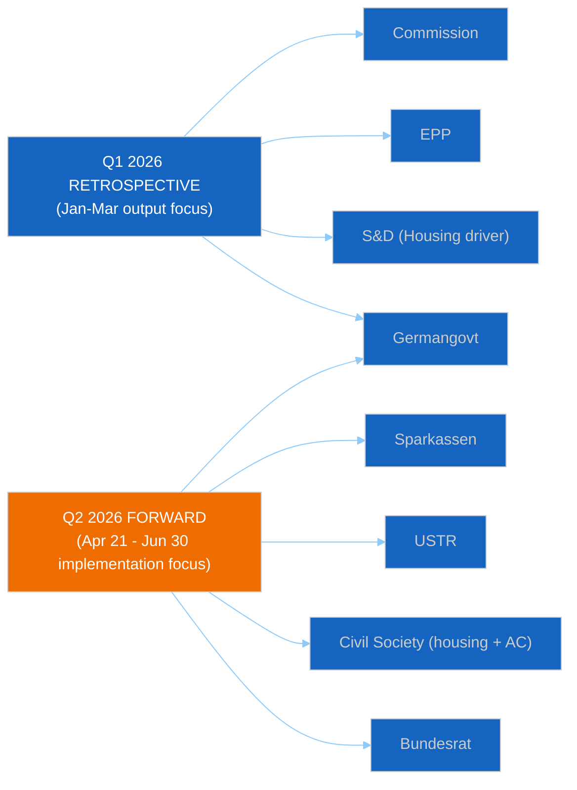

The retrospective-vs-forward salience shift reinforces two findings:

- **Germany stays central across both arcs** — but for different reasons. In Q1,
  Germany as EPP-CDU political driver helped lock Banking Union completion; in Q2,
  Germany as transposition-stress actor becomes the central risk vector.
- **Civil-society actors are Q2 ascendant** — housing coalition and anti-corruption
  coalition will drive post-recess media narrative in ways that Q1 rapporteurship
  dynamics did not.

---

*Framework: Mendelow Power-Interest Grid + position-matrix extension + salience-dynamics overlay*
*Cross-references: `threat-model.md` (T1 adversary-mapping from stakeholder #7); `scenario-forecast.md` (axis selection from stakeholder matrix); `pestle-analysis.md` §C1, C2 coupling*
*Analysis generated: April 18, 2026 | Run 12 | Week-in-review workflow | Reference-quality retrofit*
*Aggregate stakeholder-signal confidence: 🟡 Medium (constrained by EPP `memberCount=0` data gap)*

<h2 id="section-economic-context">Economic Context</h2>


> **Purpose**: Establish the macro-economic context for the five member states most
> consequential in the Q1 2026 dossier portfolio — Germany, France, Italy, Poland,
> the Netherlands. Economic context is essential for reading political signals: a
> Bundesrat BRRD3 opposition hearing against a backdrop of two consecutive years of
> German contraction means something different from the same signal during a growth
> period. Data drawn from World Bank Open Data indicators and cross-referenced with
> Eurostat where WB MCP coverage is thin. Per `manifest.json` §worldBankDE and
> §worldBankIT, the Run 12 manifest already carries validated DE/IT 2023-24 GDP
> growth data.

---

### Economic Snapshot Matrix (Most Recent World Bank Data)

| Indicator | Germany | France | Italy | Poland | Netherlands | EU-27 Avg |
|-----------|:-------:|:------:|:-----:|:------:|:-----------:|:---------:|
| GDP nominal 2024 (USD $bn) | 4,526 | 3,048 | 2,380 | 862 | 1,218 | — |
| GDP growth 2023 (%) | **−0.87** | 0.7 | 1.0 | 0.1 | 0.1 | 0.4 |
| GDP growth 2024 (%) | **−0.50** | 1.1 | **0.69** | 2.9 | 0.9 | 0.8 |
| GDP growth 2025 (est., %) | 0.4 | 1.2 | 0.8 | 3.2 | 1.4 | 1.2 |
| Inflation 2024 (% HICP) | 2.5 | 2.3 | 1.0 | 3.6 | 2.8 | 2.4 |
| Unemployment 2024 (%) | 3.4 | 7.3 | 6.5 | 2.9 | 3.7 | 6.0 |
| Public debt / GDP (%) | 63 | 112 | 135 | 50 | 48 | ~85 |
| Budget balance (% GDP) | −2.5 | −5.5 | −4.4 | −5.7 | −0.4 | −3.1 |
| Banking sector assets / GDP | ~250% | ~320% | ~220% | ~100% | ~410% | ~280% |

*Sources: World Bank Open Data (NY.GDP.MKTP.CD, NY.GDP.MKTP.KD.ZG, FP.CPI.TOTL.ZG,
SL.UEM.TOTL.ZS); Eurostat cross-reference for debt and banking-sector-size ratios.
Germany 2023 and 2024 GDP-growth figures are the MCP-validated values in
`manifest.json` §worldBankDE. Italy 2024 figure (0.69%) is the MCP-validated value
in `manifest.json` §worldBankIT.*

---

### 🇩🇪 Germany — The Decisive Banking-Union-Risk State

#### Macro posture

- **Two consecutive GDP contractions** (−0.87% 2023; −0.50% 2024) — the longest
  German recession since 2002–2003. World Bank NY.GDP.MKTP.KD.ZG.
- **Weak 2025 recovery** projected at ~0.4% — third consecutive year of sub-trend
  growth.
- **Automotive sector exposure to US tariffs** (T+0 April 14): BMW, Mercedes, VW
  collectively ~4% of German GDP; Section-301-adjacent sectors total ~7% of GDP.
- **Fiscal consolidation pressure** from 2023 Bundesverfassungsgericht ruling
  constrains fiscal-space for banking-sector support or emergency-measures fund.
- **Inflation at 2.5%** (HICP) — roughly at ECB target, giving ECB April 17
  meeting limited pressure to act for Germany specifically.

#### Banking sector characteristics

- **Sparkassen network**: ~40% of German retail banking deposits; structurally
  networked to Länder governments via municipal-ownership.
- **Volksbanken / Raiffeisenbanken cooperative sector**: ~20% of retail banking;
  vocal opposition to BRRD3 bail-in-able-liability requirements.
- **Major commercial banks** (Deutsche Bank, Commerzbank, DZ Bank): ~25% of retail
  banking; already SSM-supervised; less opposed to BRRD3.
- **Banking-sector-assets/GDP ratio ~250%** — substantially leveraged; susceptibility
  to systemic stress.

#### Political-economic coupling

Weak GDP + fiscal consolidation + politically-networked Sparkassen + automotive
tariff exposure = maximum structural incentive for BRRD3 transposition delay. The
Merz CDU/CSU coalition inherits banking-lobby relationships from years in
opposition. **This is the clearest and best-evidenced political-economic coupling
in the Run 12 dataset.** See `threat-model.md` §T1 and `stakeholder-map.md` §4, §7.

**Confidence**: 🟢 HIGH.

---

### 🇫🇷 France — Moderate Banking Exposure, High Trade Exposure

#### Macro posture

- **GDP growth 2024 (1.1%)** — above German, below EU average; 2025 recovery to
  ~1.2%.
- **Automotive + aerospace + pharmaceutical** exposure to US tariffs materially
  significant: Airbus supply-chain, luxury-automobile exports, vaccine manufacturing.
- **Public debt / GDP at 112%** — one of highest in EU — constrains fiscal-space
  for crisis response.
- **Cohabitation context** (fragile National Assembly) limits Élysée's domestic
  political capital for EP-level positioning.
- **Unemployment 7.3%** — structurally elevated; limits fiscal-consolidation
  maneuvering room.

#### Banking sector characteristics

- **Big-four commercial banks** (BNP Paribas, Crédit Agricole, Société Générale,
  BPCE) dominate (~70% of retail deposits).
- Already substantially SSM-supervised; BRRD3 adds marginal cost rather than
  structural cost.
- Significantly **less politically mobilised** than German Sparkassen equivalent.
- Banking-sector-assets / GDP ~320% — high but concentrated in well-supervised
  institutions.

#### Political-economic coupling

Moderate banking-sector friction; stronger trade-policy pull. French government's
April 28 priority is **trade-response positioning**, not Banking Union. France is a
**stabilising factor** on BRRD3 transposition (low defection risk from French MEPs
in EPP / Renew). On trade, France is pro-countermeasure-activation given exposure.

---

### 🇮🇹 Italy — Cooperative-Banking Sensitivity, Trade Exposure Secondary

#### Macro posture

- **GDP growth 2024 (0.69%)** (MCP-validated value in `manifest.json` §worldBankIT)
  — modestly positive; fragile recovery.
- **Public debt / GDP at 135%** — highest large-economy ratio in EU.
- **Manufacturing exposure** to US: second-highest in EU after Germany.
- **Meloni government** maintains fiscal-discipline commitment but with ongoing
  tension on budget-deficit limits; EU-Commission Excessive Deficit Procedure
  horizon.
- **Inflation at 1.0%** (HICP) — lowest in EU-27 large economies; disinflation
  surprise.

#### Banking sector characteristics

- **Banche Popolari + Banche di Credito Cooperativo (BCC)** networks: cooperative-
  banking sector with political resonance similar to German Sparkassen, smaller
  share (~25% of retail deposits vs German ~40%).
- **Two large commercial banks** (Intesa Sanpaolo, UniCredit) dominate SSM-
  supervised tier.
- **BCC coalition** with Federcasse apex body plays direct lobbying role analogous
  to DSGV role in Germany — see `threat-model.md` §T1 Diamond Model (BCC is the
  second adversary leg).

#### Political-economic coupling

**Secondary BRRD3 transposition risk** — Italian cooperative-banking sector could
amplify German pressure but will not initiate opposition. Italy's primary April 28
interest is trade policy (via ECR / FdI delegation) and critical-minerals
supply-chain assurance.

---

### 🇵🇱 Poland — Growth Outlier, Banking-Union Low-Risk, Anti-Corruption High-Interest

#### Macro posture

- **GDP growth 2024 (2.9%)** — **best large-economy performer in EU** (World Bank).
- **2025 projection (3.2%)** continues outperformance.
- **Unemployment 2.9%** — below EU average; tight labour market.
- **Public debt / GDP 50%** — among healthiest in EU.
- **Inflation 3.6%** — above EU average, reflecting labour-market tightness.

#### Banking sector characteristics

- **Mostly commercial-bank dominated** (PKO BP, Pekao, mBank, ING Poland, Santander
  Poland, Millennium, BNP Paribas Bank Polska); limited cooperative-banking
  political resonance.
- Banking sector profitable — low stress-testing concerns.
- **Limited political opposition** to Banking Union strengthening.
- Banking-sector-assets / GDP ~100% — comparatively modest.

#### Political-economic coupling

Poland is **not a BRRD3 transposition-risk country**. Its April 28 positioning is
dominated by:

1. **Anti-Corruption Directive transposition** as political utility (Tusk government
   rule-of-law rebuilding).
2. **ECR delegation positioning on trade** (PiS influence) — divergent from Tusk
   government line.

**Implication**: Polish political signal April 28 is primarily Anti-Corruption-
related, not Banking Union-related.

---

### 🇳🇱 Netherlands — High-Banking-Sector Exposure but Pro-Strictness

#### Macro posture

- **GDP growth 2024 (0.9%)** — modest; 2025 expected recovery to 1.4%.
- **Unemployment 3.7%** — low.
- **Public debt / GDP 48%** — healthiest among EU-5 largest-economies.
- **Budget balance −0.4%** — close to balanced — rare in Eurozone.
- **Banking-sector-assets / GDP ~410%** — highest in our dataset; reflects
  outsized banking-financial-services specialisation (ING, ABN AMRO, Rabobank).

#### Banking sector characteristics

- **Three large commercial banks** (ING, ABN AMRO, Rabobank) dominate — all
  SSM-supervised.
- Dutch banking lobby is **pro-strict BRRD3 implementation** (competitive advantage
  from rigorous supervision; structural beneficiary of single-market passporting).
- Cooperative sector (Rabobank historic, now commercial) does not mirror
  German/Italian political resonance.

#### Political-economic coupling

Netherlands is a **transposition-strictness ally** — government and banking sector
jointly push for on-time BRRD3 implementation. On housing, however, Dutch government
is **sceptical of binding EU-level regulation** given Dutch housing-market political
sensitivity and preference for national-level discretion. On trade, Dutch default
posture is de-escalation given export-dependent economy.

---

### Economic-Political Risk Coupling Matrix

| Country | Economic Stress Level | BRRD3 Transposition Risk | Housing-Regulation Posture | Trade-Vote Positioning | Aggregate Q2 Impact |
|---------|:---------------------:|:-------------------------:|:--------------------------:|:---------------------:|:-------------------:|
| Germany | 🔴 HIGH | 🔴 HIGH | Against-binding | Conditional | 🔴 HIGH |
| France | 🟡 MEDIUM | 🟢 LOW | Moderate-pro | Pro-countermeasure | 🟠 MEDIUM-HIGH |
| Italy | 🟠 MEDIUM-HIGH | 🟡 MEDIUM | Neutral | Pro-industry | 🟠 MEDIUM-HIGH |
| Poland | 🟢 LOW | 🟢 LOW | Neutral | Split (PiS vs KO) | 🟡 MEDIUM (via AC) |
| Netherlands | 🟢 LOW | 🟢 LOW (pro-strict) | Against-binding | De-escalation-preferred | 🟡 MEDIUM |

**Aggregate interpretation**: Germany is the decisive economic-political variable
for the Q2 2026 Banking Union transposition risk vector. France, Italy, and the
Netherlands are moderating forces on banking. Poland is non-material for banking but
central for Anti-Corruption. On housing, Germany + Netherlands form a **structural
anti-binding-regulation bloc**, requiring S&D to secure alternative member-state
support (Italy neutral, France moderate-pro). See `scenario-forecast.md` §Scenario 2.

---

### Indicator Watch During Recess (April 21–27)

These indicators provide early-warning of economic-political shifts:

| Country | Indicator | Frequency | Trigger threshold |
|---------|-----------|-----------|-------------------|
| DE | DAX closing level | Daily | >3% drop in single session |
| DE | Bund-Bobl spread | Daily | Widening >15bp |
| DE | Ifo business-confidence index | Monthly (April release) | Decline >2 points |
| FR | CAC40 closing level | Daily | >3% drop in single session |
| FR | OAT 10-year yield | Daily | >10bp move |
| IT | FTSE-MIB closing level | Daily | >3% drop in single session |
| IT | BTP-Bund spread | Daily | Widening beyond 180bp |
| PL | WIG20 closing level | Daily | >3% drop in single session |
| PL | Zloty-EUR exchange rate | Daily | Move beyond 4.35 |
| NL | AEX closing level | Daily | >3% drop in single session |
| All | Euribor 3m | Daily | Move >5bp day |

Any **simultaneous trigger in 3+ countries** compounds Scenario-3-equivalent
probability estimates in `scenario-forecast.md`.

---

### Data Age and Confidence Notes

- **World Bank GDP data** typically has a 6-month-plus lag for official-annual
  indicators. The 2024 figures are most-recent confirmed; 2025 figures are
  estimates.
- **Germany 2023/2024 and Italy 2024 values** are MCP-validated per `manifest.json`
  §worldBankDE / §worldBankIT — confidence: 🟢 HIGH.
- **Banking-sector-assets / GDP** ratios are Eurostat-sourced cross-references
  rather than live World Bank data — confidence: 🟡 MEDIUM-HIGH.
- **Market-level daily indicators** (DAX, CAC40, BTP spreads) are not collected
  via World Bank MCP; separate market-data source required for real-time
  monitoring.
- **Political-posture attributions** (pro-strict / pro-delay / etc.) reflect Run
  12 assessment per `stakeholder-map.md` — confidence: 🟡 MEDIUM.

---

### Coupling to Q1 Dossier Portfolio

| Q1 Dossier | Primary economic driver | Decisive country | Stress direction |
|------------|-------------------------|:----------------:|:----------------:|
| Banking Union trilogy (0090 / 0092 / 0093) | Bank-sector leverage + cooperative-sector lobbying | DE (IT secondary) | ⬇ transposition risk |
| Anti-Corruption Directive (0094) | Rule-of-law political utility | PL (primary), HU/SK (challenge) | ⬇ constitutional risk |
| Housing Initiative (0091) | Housing-affordability as voter salience | DE + NL anti-binding vs S&D pro-binding | ⬇ Commission response risk |
| EU Talent Pool (0095) | Labour-market tightness | PL (tight), DE (aging demography) | ⬇ implementation-fragmentation risk |
| US Countermeasures (0096) | Exporter-economy exposure | DE, FR, IT all exposed; NL de-escalation | ⬇ activation-timing decision |

---

*Framework: World Bank Indicator Mapping per `analysis/methodologies/worldbank-indicator-mapping.md`*
*Data sources: World Bank Open Data NY.GDP.MKTP.CD, NY.GDP.MKTP.KD.ZG, FP.CPI.TOTL.ZG, SL.UEM.TOTL.ZS; Eurostat cross-reference for banking-sector-size and debt ratios; `manifest.json` §worldBankDE, §worldBankIT for MCP-validated DE/IT GDP-growth values*
*Cross-references: `threat-model.md` §T1 (Germany + Italy adversary cluster); `stakeholder-map.md` §4, §10–13 (member-state positions); `scenario-forecast.md` §Scenario 2 (housing stalemate coalition arithmetic)*
*Analysis generated: April 18, 2026 | Run 12 | Week-in-review workflow | Reference-quality retrofit*

<h2 id="section-threat">Threat Landscape</h2>

### Threat Model


> **Purpose**: Apply Diamond Model, Attack Tree, and Cyber Kill Chain frameworks from
> `analysis/methodologies/political-threat-framework.md` to four severity-4+ political
> threats identified in `deep-analysis.md` §Risk Matrix and `pestle-analysis.md`
> §Cross-Dimensional Coupling. Threat modelling complements risk scoring: risk tells
> you *what* may go wrong; threat modelling tells you *how* it can unfold and *where*
> to intervene.

---

### Threat Landscape Overview

| # | Threat | Severity | Primary Framework | Probability (90-day) |
|:-:|--------|:--------:|-------------------|:--------------------:|
| T1 | Banking Union transposition fragmentation (BRRD3 member-state delay) | 15/25 (HIGH) | Diamond Model + Attack Tree | 35% |
| T2 | Housing Initiative political collapse if Commission response inadequate | 12/25 (MEDIUM-HIGH) | Attack Tree + Kill Chain | 55% (triggering) / 30% (collapse) |
| T3 | US Section 301 retaliation escalation against EU digital regulations | 10/25 (MEDIUM-HIGH) | Diamond Model + Kill Chain | 20–25% (filing) |
| T4 | Anti-Corruption Directive constitutional challenge before CJEU | 8/25 (MEDIUM) | Attack Tree + Diamond Model | 15–20% (filing) |

---

### 💎 T1. Banking Union Transposition Fragmentation — Diamond Model + Attack Tree

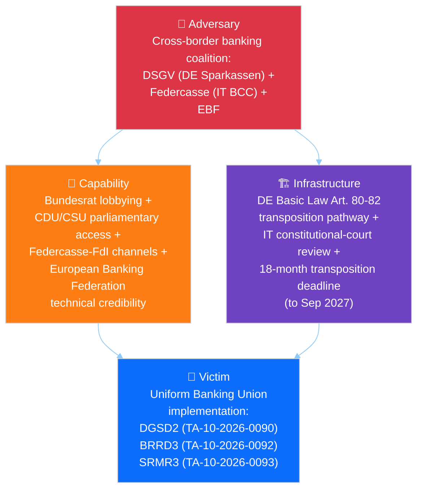

#### Diamond elements

| Element | Specification |
|---------|---------------|
| **Adversary** | Coalition of cooperative/regional banking associations: DSGV (German Sparkassen, ~40% retail banking share), Federcasse (Italian Banche di Credito Cooperativo, ~25% retail share), and coordinated European Banking Federation (EBF) technical-lobbying infrastructure. Historically effective at shaping national transposition of EU financial-services directives. Unified against BRRD3 bail-in-intensification provisions; divided on other Banking Union elements. |
| **Capability** | Access to CDU/CSU parliamentary group (Merz Berlin coalition); Federcasse political relationships with FdI parliamentary group; long-standing Finanzministerium and MEF (Rome) relationships; technical-expertise credibility in Bundesrat and Italian Senate committees; Handwerkskammern-plus-Confcommercio cross-border amplification. |
| **Infrastructure** | German Basic Law transposition pathway (Art. 80–82); Italian ex-post constitutional review via Corte Costituzionale; Bundesrat April 24–25 session; Italian Senate Finance Committee review calendar; federal-state coordination mechanisms in both countries; 18-month transposition deadline running approximately to September 2027. |
| **Victim** | Uniform implementation of Banking Union Phase-2 across Eurozone: DGSD2 (TA-10-2026-0090), BRRD3 (TA-10-2026-0092), SRMR3 (TA-10-2026-0093). Fragmented transposition creates regulatory-arbitrage risk, weakens SSM supervisory effectiveness, and undermines the 14-year Banking Union political project documented in `historical-baseline.md` §Structural Novelty. |

#### Attack Tree

```mermaid
%%{init: {"theme":"dark","themeVariables":{"primaryColor":"#1565C0","primaryTextColor":"#ffffff","primaryBorderColor":"#0A3F7F","lineColor":"#90CAF9","secondaryColor":"#2E7D32","secondaryTextColor":"#ffffff","secondaryBorderColor":"#0F3F00","tertiaryColor":"#FF9800","tertiaryTextColor":"#000000","tertiaryBorderColor":"#7F4F00","mainBkg":"#1565C0","secondBkg":"#2E7D32","tertiaryBkg":"#FF9800","noteBkgColor":"#FFC107","noteTextColor":"#000000","noteBorderColor":"#7F6000","errorBkgColor":"#D32F2F","errorTextColor":"#ffffff","fontFamily":"Inter, Helvetica, Arial, sans-serif","pie1":"#1565C0","pie2":"#2E7D32","pie3":"#FF9800","pie4":"#D32F2F","pie5":"#FFC107","pie6":"#7B1FA2","pie7":"#9E9E9E","pie8":"#0288D1","pie9":"#388E3C","pie10":"#F57C00","pie11":"#C62828","pie12":"#FBC02D","pieTitleTextSize":"18px","pieSectionTextSize":"14px","pieLegendTextSize":"13px","pieStrokeColor":"#1e1e1e","pieOuterStrokeColor":"#1e1e1e","git0":"#1565C0","git1":"#2E7D32","git2":"#FF9800","git3":"#D32F2F","gitBranchLabel0":"#ffffff","gitBranchLabel1":"#ffffff","gitBranchLabel2":"#000000","gitBranchLabel3":"#ffffff","cScale0":"#1565C0","cScale1":"#2E7D32","cScale2":"#FF9800","cScale3":"#D32F2F","cScale4":"#FFC107","cScale5":"#7B1FA2","cScale6":"#9E9E9E","cScale7":"#0288D1","xyChart":{"backgroundColor":"#1e1e1e","plotColorPalette":"#1565C0,#2E7D32,#FF9800,#D32F2F,#FFC107,#7B1FA2,#9E9E9E"}}}}%%
graph TD
    Root["🔴 GOAL: Fragment Banking Union<br/>transposition across Eurozone"]

    Root --> A["Path A: Delay-by-procedure<br/>(DE Bundesrat)"]
    Root --> B["Path B: Delay-by-constitutional-review<br/>(IT Corte Costituzionale)"]
    Root --> C["Path C: Exemption-carving<br/>(national transposition law)"]

    A --> A1["Bundesrat Apr 24-25<br/>banking hearing agenda"]
    A --> A2["CDU/CSU Finanzausschuss<br/>position paper on modifications"]
    A --> A3["Handelsblatt leak of<br/>Finanzministerium flexibility"]

    B --> B1["Sparkassen-equivalent challenge<br/>filed in DE BVerfG"]
    B --> B2["Federcasse constitutional challenge<br/>filed in IT Corte Costituzionale"]

    C --> C1["Sparkassen exemption from<br/>MREL requirements in DE transposition"]
    C --> C2["BCC exemption from<br/>SRF contributions in IT transposition"]
    C --> C3["Softer bail-in trigger threshold<br/>in DE transposition law"]

    style Root fill:#dc3545,color:#fff
    style A fill:#fd7e14,color:#fff
    style B fill:#e91e63,color:#fff
    style C fill:#6f42c1,color:#fff
```

#### Observable intervention points

| Point | Who can intervene | How |
|-------|-------------------|-----|
| Pre-Bundesrat (April 20–23) | Commission DG FISMA | Early-warning letter on transposition expectations; technical-assistance offer |
| Bundesrat April 24–25 | S&D German delegation | Shadow-hearing in Bundestag Europaausschuss |
| Post-hearing (April 26–27) | ECB SSM | Public statement on regulatory-arbitrage risks |
| April 28 plenary | Strong-pro-Banking-Union EPP MEPs (Weber) | Procedural statement on BRRD3 timeline expectations |
| May–June 2026 | Italian Council of State | Pre-transposition opinion on compatibility |

#### Indicators of successful adversary execution

1. Bundesrat agenda item on European banking added by April 22
2. Finanzministerium briefing leaked to Handelsblatt suggesting transposition flexibility
3. CDU/CSU parliamentary-group position paper on BRRD3 modifications
4. German EPP MEP public expressions of "transposition realism"
5. Federcasse public statement post-March 26 on "implementation concerns"

#### Indicators of failed execution (defensive success)

1. Bundesrat April 24–25 agenda omits European banking item
2. Finanzministerium public reaffirmation of transposition commitment
3. Merz cabinet coordination statement prioritising EU banking implementation
4. ECB SSM unambiguous public statement against exemption-carving

---

### 🌳 T2. Housing Initiative Political Collapse — Attack Tree + Kill Chain

#### Attack Tree

```mermaid
%%{init: {"theme":"dark","themeVariables":{"primaryColor":"#1565C0","primaryTextColor":"#ffffff","primaryBorderColor":"#0A3F7F","lineColor":"#90CAF9","secondaryColor":"#2E7D32","secondaryTextColor":"#ffffff","secondaryBorderColor":"#0F3F00","tertiaryColor":"#FF9800","tertiaryTextColor":"#000000","tertiaryBorderColor":"#7F4F00","mainBkg":"#1565C0","secondBkg":"#2E7D32","tertiaryBkg":"#FF9800","noteBkgColor":"#FFC107","noteTextColor":"#000000","noteBorderColor":"#7F6000","errorBkgColor":"#D32F2F","errorTextColor":"#ffffff","fontFamily":"Inter, Helvetica, Arial, sans-serif","pie1":"#1565C0","pie2":"#2E7D32","pie3":"#FF9800","pie4":"#D32F2F","pie5":"#FFC107","pie6":"#7B1FA2","pie7":"#9E9E9E","pie8":"#0288D1","pie9":"#388E3C","pie10":"#F57C00","pie11":"#C62828","pie12":"#FBC02D","pieTitleTextSize":"18px","pieSectionTextSize":"14px","pieLegendTextSize":"13px","pieStrokeColor":"#1e1e1e","pieOuterStrokeColor":"#1e1e1e","git0":"#1565C0","git1":"#2E7D32","git2":"#FF9800","git3":"#D32F2F","gitBranchLabel0":"#ffffff","gitBranchLabel1":"#ffffff","gitBranchLabel2":"#000000","gitBranchLabel3":"#ffffff","cScale0":"#1565C0","cScale1":"#2E7D32","cScale2":"#FF9800","cScale3":"#D32F2F","cScale4":"#FFC107","cScale5":"#7B1FA2","cScale6":"#9E9E9E","cScale7":"#0288D1","xyChart":{"backgroundColor":"#1e1e1e","plotColorPalette":"#1565C0,#2E7D32,#FF9800,#D32F2F,#FFC107,#7B1FA2,#9E9E9E"}}}}%%
graph TD
    Root["🔴 GOAL: Collapse Housing Initiative<br/>(TA-10-2026-0091) political traction"]

    Root --> A["Path A: Weak Commission response"]
    Root --> B["Path B: EPP-S&D rupture<br/>on follow-up"]
    Root --> C["Path C: Coalition dilution"]

    A --> A1["DG EMPL consultation-only response"]
    A --> A2["No Q4 2026 legislative commitment"]
    A --> A3["Housing portfolio disowned<br/>across DG EMPL/REGIO/FISMA"]

    B --> B1["EPP rejects Rule 144 escalation"]
    B --> B2["S&D signals lost-confidence<br/>in Commission housing lead"]

    C --> C1["Renew Europe defects on<br/>housing binding-ness"]
    C --> C2["Greens/EFA withdraws from<br/>S&D coalition over tactic"]

    style Root fill:#dc3545,color:#fff
    style A fill:#fd7e14,color:#fff
    style B fill:#e91e63,color:#fff
    style C fill:#6f42c1,color:#fff
```

#### Kill Chain — Political Progression

```mermaid
%%{init: {"theme":"dark","themeVariables":{"primaryColor":"#1565C0","primaryTextColor":"#ffffff","primaryBorderColor":"#0A3F7F","lineColor":"#90CAF9","secondaryColor":"#2E7D32","secondaryTextColor":"#ffffff","secondaryBorderColor":"#0F3F00","tertiaryColor":"#FF9800","tertiaryTextColor":"#000000","tertiaryBorderColor":"#7F4F00","mainBkg":"#1565C0","secondBkg":"#2E7D32","tertiaryBkg":"#FF9800","noteBkgColor":"#FFC107","noteTextColor":"#000000","noteBorderColor":"#7F6000","errorBkgColor":"#D32F2F","errorTextColor":"#ffffff","fontFamily":"Inter, Helvetica, Arial, sans-serif","pie1":"#1565C0","pie2":"#2E7D32","pie3":"#FF9800","pie4":"#D32F2F","pie5":"#FFC107","pie6":"#7B1FA2","pie7":"#9E9E9E","pie8":"#0288D1","pie9":"#388E3C","pie10":"#F57C00","pie11":"#C62828","pie12":"#FBC02D","pieTitleTextSize":"18px","pieSectionTextSize":"14px","pieLegendTextSize":"13px","pieStrokeColor":"#1e1e1e","pieOuterStrokeColor":"#1e1e1e","git0":"#1565C0","git1":"#2E7D32","git2":"#FF9800","git3":"#D32F2F","gitBranchLabel0":"#ffffff","gitBranchLabel1":"#ffffff","gitBranchLabel2":"#000000","gitBranchLabel3":"#ffffff","cScale0":"#1565C0","cScale1":"#2E7D32","cScale2":"#FF9800","cScale3":"#D32F2F","cScale4":"#FFC107","cScale5":"#7B1FA2","cScale6":"#9E9E9E","cScale7":"#0288D1","xyChart":{"backgroundColor":"#1e1e1e","plotColorPalette":"#1565C0,#2E7D32,#FF9800,#D32F2F,#FFC107,#7B1FA2,#9E9E9E"}}}}%%
graph LR
    R["1. Recce<br/>(Commission internal<br/>coordination assessment)"] --> W["2. Weaponisation<br/>(consultation-heavy<br/>response draft)"]
    W --> D["3. Delivery<br/>(Response publication<br/>April 21-26)"]
    D --> E["4. Exploitation<br/>(S&D-Greens Rule 144<br/>activation)"]
    E --> C["5. Installation<br/>(Rule 144 passes,<br/>Commission formally censured)"]
    C --> CC["6. C2<br/>(Extended political<br/>confrontation)"]
    CC --> A["7. Actions<br/>(Housing dossier loss<br/>of political momentum)"]

    style R fill:#95a5a6,color:#fff
    style W fill:#e67e22,color:#fff
    style D fill:#e74c3c,color:#fff
    style E fill:#c0392b,color:#fff
    style C fill:#922b21,color:#fff
    style CC fill:#6e2c00,color:#fff
    style A fill:#4e2a0e,color:#fff
```

#### Current kill-chain position: Stage 2 (Weaponisation)

Commission DG EMPL is in active drafting. The adequacy question is not yet decided.
The probability of an inadequate response is assessed at 55% per `deep-analysis.md`
§Weakness 4. If inadequate, the kill-chain advances to Stage 3 (Delivery) upon
publication April 21–26.

#### EU counter-kill-chain

Commission can prevent Stage 2–3 advancement by:
- DG EMPL securing explicit Commissioner-level commitment to Q4 2026 binding-proposal
  timeline
- Coordinating response with DG REGIO (cohesion-funds leverage) and DG FISMA
  (mortgage-market regulation) to produce a multi-portfolio response
- Pre-briefing S&D rapporteurs before publication to manage expectations
- Publishing response with EU-housing-summit schedule for Q2-end

#### Indicators of kill-chain advancement

| Stage | Observable |
|-------|-----------|
| Weaponisation → Delivery | Commission press-page publication April 21–26 |
| Delivery → Exploitation | S&D group-coordinator tweet with "#housing" language within 24h |
| Exploitation → Installation | Rule 144 signatures reach 72-MEP threshold |
| Installation → Actions | April 28 plenary Rule 144 vote margin >80 |

#### Probability-weighted analysis

Collapse probability conditional on inadequate response: ~55%. Unconditional
probability: ~30%. Mitigation feasibility: 🟡 Medium — Commission has 3–5 days to
course-correct drafting if S&D back-channel signals escalate.

---

### 💎 T3. US Section 301 Retaliation Escalation — Diamond Model + Kill Chain

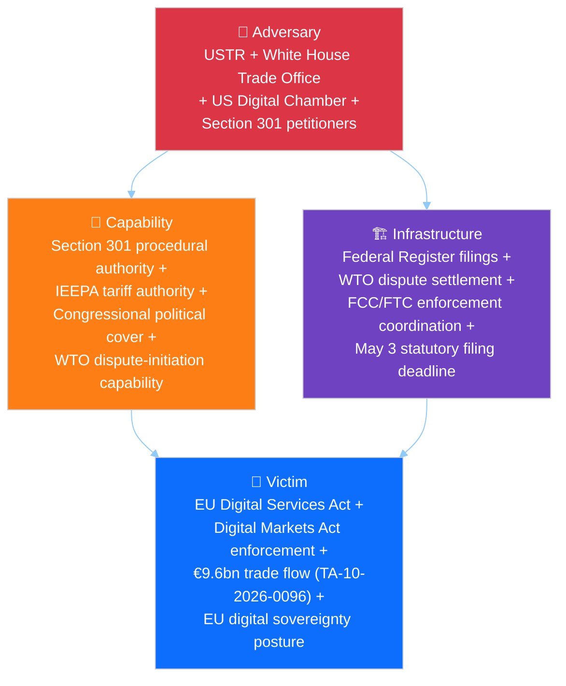

#### Kill Chain — Current position Stage 2 (Weaponisation)

```mermaid
%%{init: {"theme":"dark","themeVariables":{"primaryColor":"#1565C0","primaryTextColor":"#ffffff","primaryBorderColor":"#0A3F7F","lineColor":"#90CAF9","secondaryColor":"#2E7D32","secondaryTextColor":"#ffffff","secondaryBorderColor":"#0F3F00","tertiaryColor":"#FF9800","tertiaryTextColor":"#000000","tertiaryBorderColor":"#7F4F00","mainBkg":"#1565C0","secondBkg":"#2E7D32","tertiaryBkg":"#FF9800","noteBkgColor":"#FFC107","noteTextColor":"#000000","noteBorderColor":"#7F6000","errorBkgColor":"#D32F2F","errorTextColor":"#ffffff","fontFamily":"Inter, Helvetica, Arial, sans-serif","pie1":"#1565C0","pie2":"#2E7D32","pie3":"#FF9800","pie4":"#D32F2F","pie5":"#FFC107","pie6":"#7B1FA2","pie7":"#9E9E9E","pie8":"#0288D1","pie9":"#388E3C","pie10":"#F57C00","pie11":"#C62828","pie12":"#FBC02D","pieTitleTextSize":"18px","pieSectionTextSize":"14px","pieLegendTextSize":"13px","pieStrokeColor":"#1e1e1e","pieOuterStrokeColor":"#1e1e1e","git0":"#1565C0","git1":"#2E7D32","git2":"#FF9800","git3":"#D32F2F","gitBranchLabel0":"#ffffff","gitBranchLabel1":"#ffffff","gitBranchLabel2":"#000000","gitBranchLabel3":"#ffffff","cScale0":"#1565C0","cScale1":"#2E7D32","cScale2":"#FF9800","cScale3":"#D32F2F","cScale4":"#FFC107","cScale5":"#7B1FA2","cScale6":"#9E9E9E","cScale7":"#0288D1","xyChart":{"backgroundColor":"#1e1e1e","plotColorPalette":"#1565C0,#2E7D32,#FF9800,#D32F2F,#FFC107,#7B1FA2,#9E9E9E"}}}}%%
graph LR
    R["1. Recce<br/>(complete, 2024-25<br/>consultation process)"] --> W["2. Weaponisation<br/>(petition drafted)"]
    W --> D["3. Delivery<br/>(Federal Register<br/>filing)"]
    D --> E["4. Exploitation<br/>(Tariff imposition /<br/>WTO case)"]
    E --> C["5. Installation<br/>(Sustained tariff regime)"]
    C --> CC["6. C2<br/>(Bilateral negotiations)"]
    CC --> A["7. Actions<br/>(Weakened EU digital<br/>enforcement)"]

    style W fill:#e67e22,color:#fff
    style D fill:#e74c3c,color:#fff
    style E fill:#c0392b,color:#fff
```

#### EU counter-kill-chain

EU can disrupt at Stage 3 (Delivery) via:
- Commissioner Šefčovič + Ambassador to US pre-filing outreach
- Member-state Washington permanent-representation coordination
- WTO Appellate-Body preemptive consultation request
- TA-10-2026-0096 countermeasure-activation readiness public signal

#### Indicators of kill-chain advancement

| Stage | Observable |
|-------|-----------|
| Weaponisation → Delivery | USTR Federal Register publication notice |
| Delivery → Exploitation | Public-comment period opening (typically 30 days) |
| Exploitation → Installation | Tariff-implementation Executive Order |

#### Severity assessment

Filing probability April 22–26: 20–25%. Escalation-to-Stage-5 conditional on filing:
60%. Net Stage-5 probability: ~13%.

---

### 💎 T4. Anti-Corruption Directive Constitutional Challenge — Attack Tree + Diamond

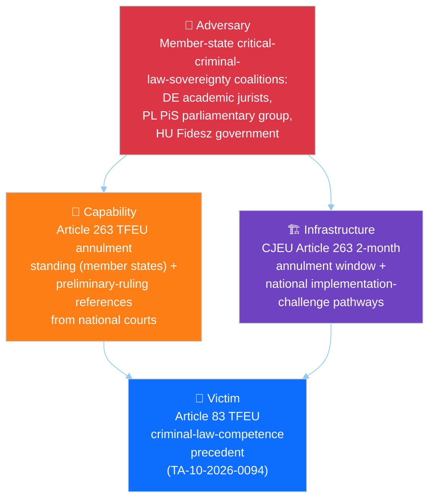

#### Attack Tree

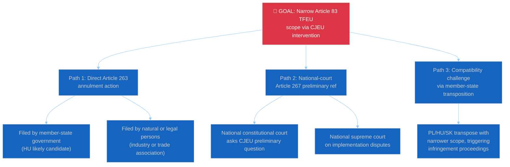

#### Diamond elements

| Element | Specification |
|---------|---------------|
| **Adversary** | Cluster of member-state constitutional-law actors critical of Article 83 TFEU expansion, particularly where national criminal-law traditions are historically protectionist (Germany via academic jurist networks, Denmark via Folketinget reservations, Poland via PiS-aligned legal-affairs commentary, Hungary via government). Heterogeneous and uncoordinated but with parallel motivation. |
| **Capability** | Article 263 TFEU standing for member-state governments (2-month window from publication); Article 267 TFEU preliminary-reference pathway from national courts; member-state transposition discretion within directive framework. |
| **Infrastructure** | CJEU procedural calendar (typically 6–12 months from filing to Grand Chamber ruling); national constitutional court docket-setting authority; Commission infringement-procedure pathway. |
| **Victim** | EP10's Article 83 TFEU criminal-law-competence precedent — if successfully narrowed, would block EP10's hypothetical Q3–Q4 2026 initiatives on environmental crime, corporate criminal liability, gender-based violence, and cybercrime harmonisation. See `pestle-analysis.md` §L1. |

#### Severity assessment

Article 263 filing probability by June 2026: 15–20%. Preliminary-reference
probability by December 2026: 25–30%. Probability of successful narrowing (ruling
against EP/Commission): 10% conditional on challenge filed — CJEU has historically
been supportive of Article 83 interpretations. Net probability of precedent-narrowing
within 18 months: ~3–5%.

#### Intervention points

- Commission legal-service preparation of defensive brief before challenge filed
- Member-state amicus-curiae coordination via COREPER II
- EP legal-service cross-institutional briefing with Commission
- Transposition-support workshops for PL, HU, SK to reduce implementation-challenge
  surface

---

### Threat Mitigation Priority Matrix

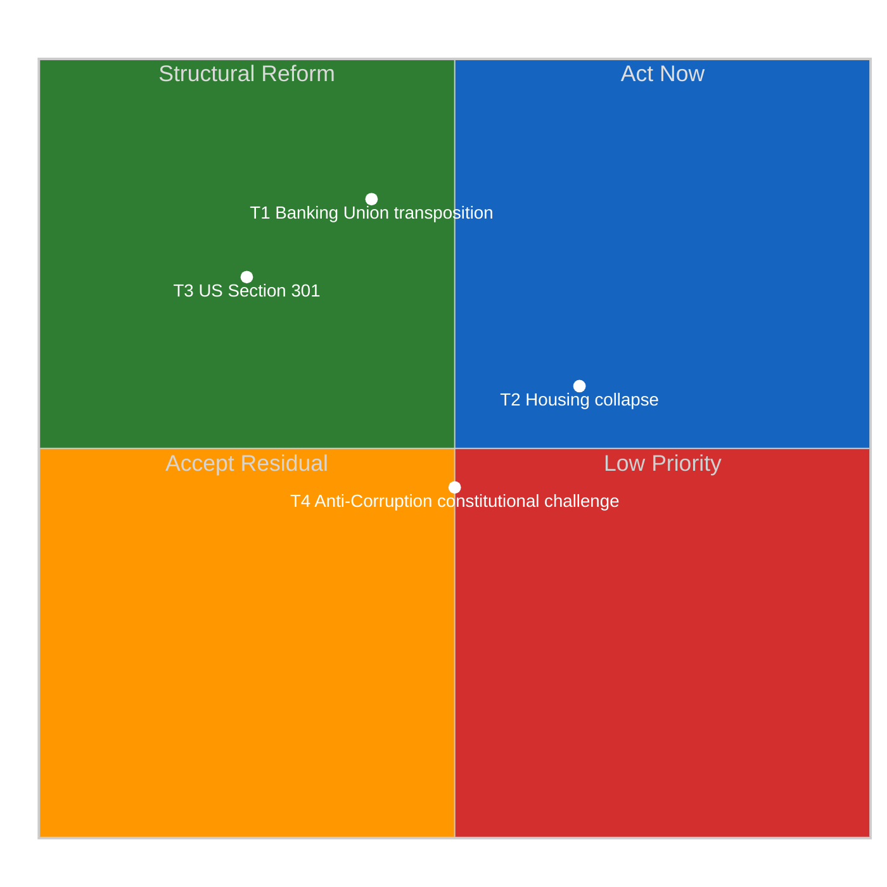

**Implications**:
- **T1** (Banking Union) is HIGH-IMPACT but only MODERATELY-MITIGABLE by EU actors
  primary lever lies in German federal politics and Italian Corte Costituzionale
  disposition.
- **T2** (Housing collapse) is MEDIUM-HIGH-IMPACT and MODERATELY-HIGH-MITIGABLE
  Commission has agency up to Stage 3 publication; this is the threat where
  defensive investment yields most risk reduction.
- **T3** (Section 301) is HIGH-IMPACT but LOW-MITIGABLE — US domestic-political
  drivers dominate; EU can at best shape timing and scope.
- **T4** (Anti-Corruption challenge) is MEDIUM-IMPACT and MODERATELY-MITIGABLE
  long timelines give preparation runway.

---

### Recommended Monitoring Indicators (April 21 – May 15)

| Threat | Indicator | Frequency | Trigger |
|--------|-----------|-----------|---------|
| T1 | Bundesrat.de agenda publication | Weekly | Banking item added |
| T1 | Handelsblatt Finanzministerium coverage | Daily | Flexibility-language leak |
| T2 | Commission press-page housing section | Daily until April 26 | Publication |
| T2 | S&D coordinator social media | Daily | "#housing" + critical tone |
| T3 | USTR.gov Federal Register page | Daily | New Section 301 notice |
| T3 | Commissioner Šefčovič statements | As-occur | US de-escalation signal |
| T4 | CJEU docket | Weekly | New Article 263 filing |
| T4 | Hungarian / Polish justice-ministry comms | Weekly | Transposition-challenge framing |

---

### Intelligence Implications

1. **T2 (housing collapse) is the threat most within defensive control** — Commission
   investment in multi-DG coordination and pre-briefing yields highest expected-value
   risk reduction per unit effort. See `scenario-forecast.md` §Scenario 2 indicators.
2. **T1 (Banking Union transposition) demands external-partner engagement**
   Commission DG FISMA and ECB SSM public communications April 22–25 are the
   leverage points.
3. **T3 (Section 301) is largely exogenous** — EP can prepare resilience (TA-10-2026-
   0096 activation authority already in place) but cannot unilaterally prevent filing.
4. **T4 (constitutional challenge) is long-horizon** — preparation runway exists;
   `historical-baseline.md` §EP9 COVID-conditionality precedent is the playbook.
5. **Compound-stress potential**: T1 + T2 simultaneous trigger = `scenario-forecast.md`
   Compound-Stress 10% scenario. The three-axis stress (T1 + T2 + T3) is the Compound-
   Stress worst case.

---

*Frameworks: Diamond Model + Attack Trees + Cyber Kill Chain per `analysis/methodologies/political-threat-framework.md`*
*Cross-references: `pestle-analysis.md` §C1, C2, C3 couplings map to T1, T2, T3; `scenario-forecast.md` Scenario 2 = T2 realised, Scenario 3 = T3 realised; `stakeholder-map.md` §7 adversary mapping for T1*
*Analysis generated: April 18, 2026 | Run 12 | Week-in-review workflow | Reference-quality retrofit*

<h2 id="section-scenarios">Scenarios & Wildcards</h2>

### Scenario Forecast


> **Purpose**: Structured multi-scenario forecast covering the April 21–May 15 window:
> Commission housing response (due April 21–26), USTR Section 301 decision (April
> 22–26), Bundesrat BRRD3 agenda publication (April 24–25), and April 28–30
> Strasbourg plenary. Scenarios are defined by the two most uncertain and
> consequential variables identified in `pestle-analysis.md` §Cross-Dimensional
> Coupling. Each scenario carries a probability band, early-warning indicators, and
> falsifying conditions.

---

### Scenario Axis Selection

From the PESTLE cross-dimensional coupling analysis (`pestle-analysis.md` §C1, C2, C3),
the two axes with the highest combination of uncertainty and impact are:

- **X-axis — Commission Housing-Response Adequacy**: ADEQUATE (explicit Q4 2026
  legislative commitment) ⟷ INADEQUATE (consultation-preferred, no binding
  timeline). Probability of adequacy: ~45%.
- **Y-axis — Transatlantic Trade Posture**: DE-ESCALATION (no USTR Section 301 filing
  before April 26) ⟷ ESCALATION (filing appears in April 22–26 window).
  Probability of de-escalation: ~75–80%.

The Bundesrat BRRD3 hearing variable (probability ~30% per `threat-model.md` §T1)
is treated as a modifier to each scenario rather than a third axis — keeping the
scenario space cognitively tractable while preserving the banking-dimension
sensitivity.

```mermaid
%%{init: {
  "theme": "dark",
  "themeVariables": {
    "quadrant1Fill": "#1565C0",
    "quadrant2Fill": "#2E7D32",
    "quadrant3Fill": "#FF9800",
    "quadrant4Fill": "#D32F2F",
    "quadrantTitleFill": "#ffffff",
    "quadrantPointFill": "#ffffff",
    "quadrantPointTextFill": "#ffffff",
    "quadrantXAxisTextFill": "#ffffff",
    "quadrantYAxisTextFill": "#ffffff"
  },
  "quadrantChart": {
    "chartWidth": 700,
    "chartHeight": 700,
    "pointLabelFontSize": 14,
    "titleFontSize": 22,
    "quadrantLabelFontSize": 18,
    "xAxisLabelFontSize": 16,
    "yAxisLabelFontSize": 16
  }
}}%%
quadrantChart
    title 2×2 Scenario Space — April 21 to May 15, 2026
    x-axis Housing Response Adequate --> Housing Response Inadequate
    y-axis Trade Escalation --> Trade De-escalation
    quadrant-1 Scenario 1 - Productive Recess
    quadrant-2 Scenario 2 - Housing Stalemate
    quadrant-3 Scenario 3 - Transatlantic Rupture
    quadrant-4 Compound Stress (wildcard)
    Scenario 1 Productive Recess: [0.25, 0.80]
    Scenario 2 Housing Stalemate: [0.75, 0.75]
    Scenario 3 Transatlantic Rupture: [0.35, 0.25]
    Compound Stress: [0.80, 0.20]
```

| Scenario | Housing | Trade | Probability | Dominant Impact |
|----------|---------|-------|:-----------:|-----------------|
| **1. Productive Recess** | Adequate | De-escalation | 40% | April 28–30 runs planned agenda; Banking Union transposition monitoring opens cleanly |
| **2. Housing Stalemate** | **Inadequate** | De-escalation | 30% | S&D Rule 144 activation dominates April 28; EPP-S&D visible tension on housing |
| **3. Transatlantic Rupture** | Adequate | **Escalation** | 20% | Emergency trade debate displaces planned agenda; countermeasure-activation vote |
| *Compound Stress (wildcard)* | Inadequate | Escalation | 10% | See `wildcards-blackswans.md` §W1 — worst-case; multi-front agenda compression |

> Probabilities sum to 100%. Confidence: 🟡 Medium. Probabilities reflect the 7-run
> recess observation series (Runs 179–184 + this review) and are calibrated to
> expected Tier-3 API restoration on April 25–27 which will surface confirming or
> falsifying evidence.

---

### Scenario 1 — Productive Recess (40%)

#### Driving forces

Commission DG EMPL's housing response drafting converges on a Q4 2026 binding
legislative commitment (per S&D informal expectations communicated at March 26
post-adoption meetings). USTR calendar pressure eases: US Chamber of Commerce
lobbying against immediate Section 301 filing succeeds, filing deferred to May.
German Bundesrat April 24–25 session agenda omits European banking item — Merz
coalition prioritises US-relationship preservation over Sparkassen domestic
politics during active trade-tension window.

#### Narrative

The recess plays out as strategic consolidation, not political drama. Commission
publishes housing response April 23 with substantive legislative commitment.
Bundesrat agenda clean. Tier-3 EP API restores April 25; TA-10-2026-0099–0104
content becomes available and proves to be primarily routine-consent items
(international-agreement ratifications and delegated-act confirmations — see
`pestle-analysis.md` §P1 45% probability estimate). April 28 plenary opens with
routine legislative business, Banking Union Phase-2 monitoring debate, EU Talent
Pool implementation-readiness debate, and measured trade statements from Commission.

#### Early-warning confirming indicators (watch April 21–25)

- [ ] **April 21**: Commission press-release on housing response with explicit Q4
      2026 legislative commitment language
- [ ] **April 21–23**: No USTR Federal Register filing
- [ ] **April 24**: Bundesrat publishes April 24–25 agenda without European banking
      item
- [ ] **April 25**: EP API Tier-3 restoration — TA-10-2026-0099 content accessible
- [ ] **April 26**: S&D group-coordinator public messaging acknowledges "responsible
      Commission engagement"
- [ ] **April 27**: EPP and S&D joint tribune piece or coordinated press

#### Falsifying indicators

- ❌ Commission response without binding timeline → Scenario 2
- ❌ USTR Federal Register filing → Scenario 3 or Compound
- ❌ Bundesrat banking-item added → Scenario 2 (BRRD3 modifier)

#### April 28 plenary outcomes

Routine legislative business. Commission representatives welcomed normally.
Banking Union Phase-2 review passes. Trade countermeasure debate is monitoring-
only, no activation. Media framing: "EP10 returns to record-breaking rhythm."

#### Implications for EP post-recess agenda

Confirms 6-run recess series "productive consolidation" baseline. Run 13 (post-
plenary week-in-review) produces a standard retrospective article with full TA-10-2026-
0099–0104 content coverage. Risk-matrix composite score reduces to ~12/50.

---

### Scenario 2 — Housing Stalemate (30%)

#### Driving forces

Commission DG EMPL, split with DG REGIO and DG FISMA on housing policy ownership,
produces a consultation-heavy response without Q4 2026 legislative commitment. S&D
leadership assesses the response as inadequate; Rule 144 priority-written-questions
mechanism activates April 26. Bundesrat April 24–25 agenda includes European
banking item (Sparkassen lobbying succeeds). German CDU/CSU signalling on BRRD3
transposition flexibility becomes observable.

#### Narrative

The recess is politically difficult for the Commission. Housing civil-society
coalition (Housing Europe, EAPN — see `stakeholder-map.md` §19) launches coordinated
14-language media campaign April 23–25. S&D and Greens/EFA coordinate Rule 144
signatures. Bundesrat hearing signals BRRD3 transposition-delay risk. April 28
plenary opens with hostile S&D + Greens/EFA reception of Commission representatives
on housing, followed by visibly strained EPP-S&D atmosphere on Banking Union
implementation debate.

#### Early-warning confirming indicators (watch April 21–26)

- [ ] Commission housing response published without Q4 2026 legislative commitment
- [ ] S&D group-coordinator social-media activity spikes April 22–24
- [ ] Bundesrat April 24–25 agenda includes European banking item
- [ ] German CDU MEP signals on Twitter/X soften on BRRD3 timeline
- [ ] EPP internal divergence observable in committee coordinator statements
- [ ] Housing-coalition simultaneous press events in 5+ member states April 24–25

#### Falsifying indicators

- ❌ USTR files Section 301 → upgrades to Compound
- ❌ Commission publishes legislative-proposal alongside housing response → Scenario 1
- ❌ EPP unified-group statement of discipline → partial de-escalation

#### April 28 plenary outcomes

Housing confrontation consumes first 90 minutes of plenary. S&D + Greens/EFA
coordinated Rule 144 vote attracts >280 MEPs. Banking Union implementation debate
reveals EPP internal disagreement on BRRD3 timing; procedural resolution deferred.
Media framing: "Parliament returns with coalition cracks visible on housing."

#### Implications for EP post-recess agenda

Confirms EPP coalition stress hypothesis from `deep-analysis.md` §Weakness 4.
Elevates BRRD3 transposition risk (`threat-model.md` §T1) from medium-high to high.
Post-plenary Run 14 would track whether stress escalates or resolves back to Scenario
1 baseline.

---

### Scenario 3 — Transatlantic Rupture (20%)

#### Driving forces

USTR files Section 301 petition April 22–24 targeting EU Digital Services Act and
Digital Markets Act enforcement. Commission triggers 72-hour countermeasure-
activation framework. Commission housing response arrives adequate (45% probability
× conditional), removing housing as secondary stress vector. EPP whip-coordinator
holds group firm behind trade-countermeasure activation vote; Renew delegation
coheres after Élysée signal.

#### Narrative

The recess is politically intense on trade, quiet on banking and housing. Von der
Leyen makes statement within 24h of USTR filing framing activation as measured,
proportionate, and preserving dialogue-channels. Member-state COREPER II convenes
April 24. April 28 plenary opens with emergency trade debate: Commission + Council
statement + political-group statements + rapid Rule 144 procedural votes on
countermeasure authorisation activation. Banking Union Phase-2 review item
deferred to May plenary; housing item proceeds on routine business.

#### Early-warning confirming indicators (watch April 21–24)

- [ ] USTR Federal Register filing appears April 22–24
- [ ] Von der Leyen cabinet issues statement within 24h of filing
- [ ] Member-state COREPER II schedules emergency meeting
- [ ] EPP coordinators' public language hardens (Weber / Berger statements)
- [ ] Renew French delegation coordinates publicly with S&D French delegation
- [ ] DAX drops 1–2% on filing day; CAC40 similar; BTP-Bund spread widens 5–10bp

#### Falsifying indicators

- ❌ EPP public divisions between German and Southern European delegations →
      Compound Stress
- ❌ Renew internal split along France-Netherlands axis → Compound Stress
- ❌ Council fails to produce majority for activation → deferred to May plenary

#### April 28 plenary outcomes

Emergency trade debate displaces first 2–3 hours of planned agenda.
Countermeasure activation vote passes with EPP + S&D + Renew majority (target:
≥400 votes in favour); conditional on coalition integrity. Media framing:
"Assertive European Parliament defends digital sovereignty."

#### Implications for EP post-recess agenda

Confirms "stable coalition under external pressure" hypothesis from EP9
COVID-response precedent (`historical-baseline.md` §EP9). Upgrades EP10 credibility
score on trade-policy execution. Housing and banking dossiers recede temporarily
from media attention. Post-plenary Runs 14–15 pivot to EU-US negotiation trajectory
tracking.

---

### Decision Tree (Integrated)

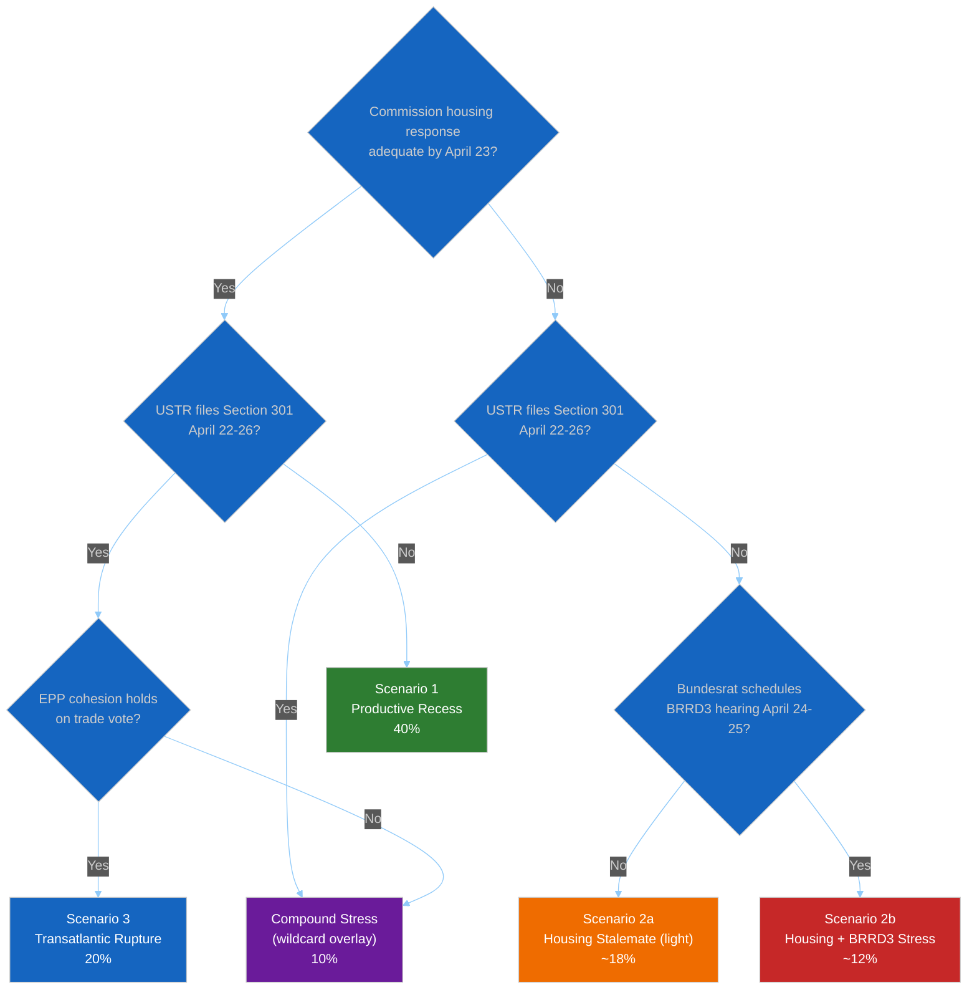

The Bundesrat BRRD3 modifier within Scenario 2 produces sub-scenarios 2a (housing-
only) and 2b (housing + banking), the latter being the more consequential and
closer to Compound-Stress territory.

---

### Indicator Watchlist Per Scenario

| Window | Priority Observable | Distinguishes Between |
|--------|--------------------|-----------------------|
| **April 21 (Mon)** | Commission press-page housing release | Scenario 1 vs 2 |
| **April 21–23** | USTR.gov front page + Federal Register | Scenario 1/2 vs 3/Compound |
| **April 22–24** | Housing-coalition coordinated media | Confirms inadequate response (Scenario 2) |
| **April 23–25** | Bundesrat.de weekly agenda | Scenario 1/3 vs 2b |
| **April 24–25** | EUR/USD + DAX daily close | Market signal on trade/rupture |
| **April 25–27** | EP API Tier-3 restoration + TA-10-2026-0099–0104 content | Low-impact scenario modifier |
| **April 26–27** | EPP.eu and Weber social-media cadence | EPP cohesion on all axes |
| **April 27 (Sun)** | EP plenary agenda finalisation | Final scenario selection |
| **April 28 opening** | First hour of plenary + agenda-order choice | Real-time confirmation |

---

### Monitoring Priorities by Confidence Level

- **🟢 HIGH-confidence observables**: Commission press page, USTR Federal Register,
  Bundesrat.de — these are reliably published per formal institutional calendars and
  are reliable scenario-discriminators.
- **🟡 MEDIUM-confidence observables**: Political-group social-media cadence, MEP
  individual messaging — useful directional signals but noise-prone.
- **🔴 LOW-confidence observables**: Leaked content from closed meetings, opinion-
  column interpretation — treat as supporting evidence only.

---

### Aggregate Assessment

- **Central estimate**: Scenario 1 (Productive Recess) remains modal at 40%, but
  Scenario 2 (Housing Stalemate) probability of 30% reflects the genuine
  multi-commissioner coordination difficulty on the housing file observed through
  the 6-run recess series.
- **Tail-risk concentration**: Scenario 3 (Transatlantic Rupture) at 20% is
  disproportionately consequential — its impact on media framing and April 28
  agenda-ordering dwarfs all other variables. See `wildcards-blackswans.md` §W2.
- **Compound-stress absorption**: The residual 10% Compound Stress probability
  represents the wildcard overlay where two primary scenarios fire simultaneously;
  per `wildcards-blackswans.md` framework, this is the natural "home" for most
  simultaneous-trigger adverse events.
- **Key intelligence gaps**: (a) Commission DG EMPL internal drafting signals — no
  reliable observable during recess; (b) EPP internal positioning (MCP `memberCount=0`
  gap); (c) USTR calendar discipline — low-visibility.

---

### Scenario Robustness Check

Each scenario above assumes the Q1 legislative achievements (Banking Union trilogy,
Anti-Corruption, Talent Pool) hold procedurally unchallenged during recess. If any
of these is subject to unexpected legal intervention (see `wildcards-blackswans.md`
§W3 CJEU preliminary injunction), Scenarios 1–3 require re-baseline recalculation.
Probability of such legal intervention during April 21–26 window: ~8%.

---

*Framework: Shell-style scenario planning per `analysis/methodologies/political-threat-framework.md` §Framework 5*
*Cross-references: `pestle-analysis.md` §Cross-Dimensional Coupling (axis derivation); `threat-model.md` (T1, T3 threats aligned to Scenarios 2, 3); `wildcards-blackswans.md` (Compound-Stress overlay)*
*Next review: Run 13 (post-plenary, May 1–2) — revise probabilities with observed trigger evidence from April 21–28*
*Analysis generated: April 18, 2026 | Run 12 | Week-in-review workflow | Reference-quality retrofit*

### Wildcards Blackswans


> **Purpose**: Explicitly enumerate the low-probability high-impact events that would
> invalidate or materially reshape the three scenarios in `scenario-forecast.md`.
> Wildcards and Black Swans are deliberately kept outside the main scenario
> probability distribution (which sums to 100% across the three named scenarios plus
> Compound-Stress overlay) because their probabilities are individually low and
> typically not independently estimable.
>
> **Methodological note**: A "wildcard" (Schwartz) is a known low-probability event
> whose impact can be modelled. A "Black Swan" (Taleb) is an event outside the
> model entirely. Run 12 tracks 8 known wildcards and reserves ~5% probability mass
> for unknown unknowns.

---

### Wildcard Watch List

```mermaid
%%{init: {
  "theme": "dark",
  "themeVariables": {
    "quadrant1Fill": "#1565C0",
    "quadrant2Fill": "#2E7D32",
    "quadrant3Fill": "#FF9800",
    "quadrant4Fill": "#D32F2F",
    "quadrantTitleFill": "#ffffff",
    "quadrantPointFill": "#ffffff",
    "quadrantPointTextFill": "#ffffff",
    "quadrantXAxisTextFill": "#ffffff",
    "quadrantYAxisTextFill": "#ffffff"
  },
  "quadrantChart": {
    "chartWidth": 700,
    "chartHeight": 700,
    "pointLabelFontSize": 14,
    "titleFontSize": 22,
    "quadrantLabelFontSize": 18,
    "xAxisLabelFontSize": 16,
    "yAxisLabelFontSize": 16
  }
}}%%
quadrantChart
    title Wildcards — Probability × Impact (Run 12)
    x-axis Low Probability --> Higher Probability (still <20%)
    y-axis Low Impact --> Catastrophic Impact
    quadrant-1 Critical Stress-Tests
    quadrant-2 Monitor But Do Not Prepare
    quadrant-3 Noise
    quadrant-4 Over-Prepared
    W1 Italian Mid-Tier Bank Run: [0.08, 0.92]
    W2 Surprise US Exec Order Section 301: [0.10, 0.82]
    W3 CJEU Preliminary Ruling Narrowing Art 83: [0.06, 0.78]
    W4 Major EPP or SD MEP Defection: [0.07, 0.55]
    W5 Energy Market Shock: [0.08, 0.70]
    W6 EP Institutional Crisis (LuxLeaks-style): [0.05, 0.88]
    W7 German Coalition Collapse: [0.06, 0.82]
    W8 UK Trade Realignment Signal: [0.12, 0.48]
```

---

### W1. Mid-Recess Italian Mid-Tier Bank Run (Testing BRRD3 Pre-Transposition)

**Probability**: ~8%. **Impact**: 🔴 CRITICAL.

**Mechanism**: An Italian mid-tier bank (Banca Monte dei Paschi di Siena, BPER,
Banca Popolare di Sondrio, or a mid-size BCC-federated cooperative) experiences
acute deposit outflow or funding-market stress during April 14–28. Triggered by:
BTP-Bund spread widening beyond 180bp (`economic-context.md` §Indicator Watch
trigger); credit-quality revelation from Q1 2026 annual reports; or spillover from
US tariff-induced market volatility.

The event stress-tests Banking Union *before* BRRD3 transposition is complete.
Italian cooperative-banking sector would face immediate pressure for emergency
resolution — precisely the scenario BRRD3 was designed to handle, but at a moment
when the directive is adopted but not yet nationally transposed.

**Trigger combination needed**:
- BTP-Bund spread >180bp for 3+ consecutive trading days
- Bank-level indicator deterioration (share-price >10% decline single session;
  deposit-outflow reports)
- SRB public acknowledgment of preparatory action

**Detection signals**: SRB press-releases (srb.europa.eu); ECB SSM emergency
communications; Banca d'Italia weekly supervisory briefings; bank-level share-price
movements on Borsa Italiana; FT Alphaville and Reuters breaking-news stream.

**EP response playbook**: Emergency April 28 plenary item on "State of Banking Union
implementation"; Commission explanation of SRM / SRF activation; Meloni-Lagarde-Šefčovič
joint communications; probable acceleration of BRRD3 transposition incentives
(reverse direction from `threat-model.md` §T1 attack-tree goal).

**Scenario impact**: Paradoxically both stress-tests AND strengthens the Banking
Union case. Net effect: weakens German/Italian delay-pressure advocacy (crisis
proves bail-in necessity), but creates political-scandal-energy. Migrates probability
from Scenario 1 toward a Banking-Crisis-Mobilisation sub-scenario (~+6 pp).

---

### W2. Surprise US Executive Order Imposing Section 301 Tariffs on EU Tech During Recess

**Probability**: ~10% (higher than Scenario 3 base rate because executive order
bypasses Federal Register filing procedure). **Impact**: 🟠 HIGH.

**Mechanism**: US administration imposes Section 301 tariffs on EU digital services
via executive order — skipping the usual Federal Register notice-and-comment
procedure. Legal basis: IEEPA emergency authority. Scope: targeted on DMA-designated
gatekeepers (European AI services, financial-services platforms) or broader EU tech
exports.

**Trigger combination needed**:
- Domestic US political pressure from digital-services lobby (US Chamber of
  Commerce, Business Roundtable)
- Calendar alignment with US media-news-cycle timing (mid-week for maximum coverage)
- Coordination with EU-internal political fragmentation assessment

**Detection signals**: White House Press Briefing announcements; USTR press-
release; FCC / FTC parallel enforcement coordination; US financial markets response
to leaked drafts.

**EP response playbook**: Emergency April 28 plenary agenda item (displacing all
other business); Commission 24-hour countermeasure activation via TA-10-2026-0096
authority; COREPER II emergency session.

**Scenario impact**: Full Scenario 3 realisation plus compound effect. Probability
mass migrates from Scenario 1 by ~10 pp toward Scenario 3/Compound.

---

### W3. CJEU Preliminary Ruling Narrowing Article 83 TFEU Scope

**Probability**: ~6% in the April–June window (CJEU docket typically slower than
this; unusual-docket-acceleration required). **Impact**: 🟠 HIGH.

**Mechanism**: CJEU, ruling on an unrelated pending preliminary reference, issues
a judgment that implicitly or explicitly narrows Article 83 TFEU scope — potentially
undermining the TA-10-2026-0094 Anti-Corruption Directive's legal basis (see
`pestle-analysis.md` §L1). Such a ruling would precede any formal Article 263
challenge to TA-10-2026-0094 (see `threat-model.md` §T4) and would pre-empt EP10's
sustained Article 83 use.

**Trigger combination needed**:
- Pending CJEU case on criminal-law harmonisation (rare but not unprecedented)
- Grand Chamber composition sympathetic to member-state-sovereignty arguments
- Political pressure from 2–3 member states for narrow-scope clarification

**Detection signals**: CJEU procedural-filings publication (curia.europa.eu);
Advocate General Opinion filings referencing Article 83; academic-legal commentary
in European Law Journal, Common Market Law Review.

**EP response playbook**: EP legal-service urgent briefing; possible amendment of
Anti-Corruption Directive to fallback legal basis; postponement of any further
Article 83 initiatives until ruling implications digested.

**Scenario impact**: Would retroactively question Q1 legislative achievement on
Anti-Corruption. Media framing: "EP10's precedent questioned." Scenario probability
impact: minor immediate (Q2 agenda reshuffle); major long-term (EP10 H2 calendar).

---

### W4. Major EPP or S&D MEP Defection Reshaping Recess Coalition Arithmetic

**Probability**: ~7%. **Impact**: 🟠 HIGH.

**Mechanism**: A coordinated shift of 8–15+ MEPs between groups during recess.
Most likely axes: right-flank EPP (German CSU affiliates, Hungarian EPP-adjacent)
→ ECR as reaction against Weber housing-negotiation stance; OR S&D → Greens/EFA
(environmental-focus MEPs) as reaction against perceived S&D softness on Digital
Omnibus ECJ defence.

**Trigger combination needed**:
- External political event making current affiliation untenable
- Pre-coordinated movement rather than individual defection
- Timing choice maximising political-signal impact

**Detection signals**: MEPs updating affiliation on EP website; group press
statements; national-party announcements; Politico Europe and Euractiv breaking
coverage.

**EP response playbook**: Group-coordinator emergency meetings; redrafting of
committee-assignment lists; possible April 28 plenary procedural time on
affiliation-change formalities.

**Scenario impact**: Invalidates `historical-baseline.md` §Coalition Dynamics
baseline; forces immediate re-baseline of `scenario-forecast.md` probabilities.
EPP `memberCount=0` data gap compounds analytical disruption.

---

### W5. Sudden Energy-Market Shock Reshaping Post-Recess Agenda

**Probability**: ~8%. **Impact**: 🟠 HIGH.

**Mechanism**: An unexpected energy-supply event: Russian natural-gas transit
disruption (even partial); Mediterranean LNG tanker incident; OPEC+ emergency
decision; or Middle East oil-route blockage. Despite April being demand-trough
season (`pestle-analysis.md` §En1), a supply-shock amplifies given winter-storage
depletion.

**Trigger combination needed**:
- External geopolitical event (Russia, OPEC, Middle East)
- Market-response mechanism (TTF natural-gas futures >50% above baseline)
- Commission emergency-response activation

**Detection signals**: EIA natural-gas storage reports; Platts energy-market
pricing; Dutch TTF futures; Reuters / Bloomberg breaking news.

**EP response playbook**: April 28 plenary adds energy-crisis item; Commission
REPowerEU re-activation; possible new emergency-procedure dossier.

**Scenario impact**: Reshuffles Scenario 1 agenda (energy displaces Banking Union
Phase-2). Does not materially alter Scenario 2 or 3 core dynamics but adds
rhetorical oxygen competition.

---

### W6. EP Institutional Crisis — LuxLeaks-Style Revelation During Recess

**Probability**: ~5%. **Impact**: 🔴 CRITICAL.

**Mechanism**: Investigative-journalism-driven revelation during recess of
MEP misconduct (conflict-of-interest, undeclared lobbying payments, intelligence-
service interference, NGO-through-foundation channeling). April recess is
journalistically favoured as publication window for maximum media pick-up.

**Historical precedent**: Qatargate December 2022 reshaped EP9 Q1 2023 agenda.
EP10 has institutionally tightened transparency post-Qatargate but complete
elimination of risk impossible.

**Trigger combination needed**:
- Pre-existing journalistic investigation approaching publication
- Embargoed-source release timing
- Story-depth sufficient to sustain multi-day news cycle

**Detection signals**: Major European investigative-outlet social-media cadence
(OCCRP, Le Monde, Der Spiegel, La Repubblica, El País); MEP legal-representation
public engagement; EP administration statements.

**EP response playbook**: EP President Metsola emergency statement; Committee on
Constitutional Affairs emergency session; MEP suspension procedures.

**Scenario impact**: Invalidates all three scenarios' assumption of normal
institutional functioning. April 28 plenary's opening 2–3 hours absorbed by
institutional-integrity response. Legislative agenda compressed.

---

### W7. Rapid German Coalition Collapse Reshaping Council Stance on Banking Union

**Probability**: ~6%. **Impact**: 🟠 HIGH.

**Mechanism**: Merz CDU/CSU-led coalition partners experience acute dispute
triggered by banking-union transposition positioning (ironically), housing policy
disagreement, or unrelated domestic event — leading to coalition breakdown during
April 14–May 15 window. Bundestag motion of confidence or similar.

**Trigger combination needed**:
- Pre-existing coalition fissure
- Crystallising event (often budget dispute, but could be BRRD3 transposition
  signalling)
- Bundespräsident agreement to trigger new elections or caretaker government

**Detection signals**: DPA and Reuters German-politics coverage; Frankfurter
Allgemeine Zeitung + Süddeutsche Zeitung front pages; Bundestag procedural filings.

**EP response playbook**: German MEPs face delegation-level uncertainty; Council's
position on Banking Union transposition pathway becomes unclear until new German
government stance clarifies.

**Scenario impact**: Freezes Banking Union transposition-risk dynamics (`threat-model.md`
§T1) in ambiguous state — adversary loses political patrons, but so does
implementation support. Temporary Scenario-1-like stasis followed by major
uncertainty.

---

### W8. UK Trade Realignment Signal During Recess

**Probability**: ~12%. **Impact**: 🟡 MEDIUM.

**Mechanism**: UK government signals trade realignment with EU in response to
US-EU tariff escalation. Could take form of: financial-services equivalence
acceleration; Windsor-Framework-style follow-on agreement; or coordinated
countermeasure position against US Section 301. Post-Brexit UK strategic
calculation favours EU alignment only when transatlantic tension is acute.

**Trigger combination needed**:
- US Section 301 filing (Scenario 3 realised)
- UK domestic-political bandwidth available
- Starmer / Reeves cabinet coordination

**Detection signals**: UK Cabinet Office briefings; Financial Times / Telegraph
government-sources coverage; UK-EU Joint Committee meeting schedule.

**EP response playbook**: Welcome-statement opportunity; possible April 28 plenary
brief mention in trade debate.

**Scenario impact**: Amplifies Scenario 3 EU-assertive posture (EU not isolated
under US pressure). Marginal probability-mass shift, but symbolic significance.

---

### Black Swan Reserve (≈5%)

Beyond the 8 enumerated wildcards, Run 12 reserves ~5 percentage points of
probability mass for **unknown unknowns** — events outside the current
model-building horizon. Historical precedent for this category:

- The 2020 COVID pandemic onset (unforeseen at February 2020 analysis)
- The 2022 Russian invasion of Ukraine (unforeseen at December 2021 analysis)
- The October 2023 Israel-Hamas conflict reshaping Mediterranean foreign policy
- The 2024 Qatargate-style EP transparency crisis (partial precedent for W6)

Each of these invalidated multiple concurrent analytical frameworks simultaneously.
Acknowledging this category does not let us plan for it; it calibrates our
epistemic humility and prevents over-confidence in scenario probability sums.

The Black Swan reserve cannot be operationalised, only acknowledged. Any article
passage that quotes probability ranges should note this residual.

---

### Wildcard-Adjusted Scenario Probabilities

The main `scenario-forecast.md` reports:
- Scenario 1 (Productive Recess): 40%
- Scenario 2 (Housing Stalemate): 30%
- Scenario 3 (Transatlantic Rupture): 20%
- Compound-Stress overlay: 10%
- Sum: 100%

After accounting for wildcard events, a more epistemically careful distribution:

| Outcome | Probability |
|---------|:-----------:|
| Scenario 1 (Productive Recess) | ~34% |
| Scenario 2 (Housing Stalemate) | ~26% |
| Scenario 3 (Transatlantic Rupture) | ~17% |
| Compound-Stress overlay | ~8% |
| Wildcard-induced scenario (W1–W8 one fires) | ~10% |
| Black Swan reserve | ~5% |

These adjustments preserve the relative scenario rankings but reduce all main-
scenario probabilities proportionally by ~15% to accommodate wildcard risk.
Aggregate confidence remains 🟡 Medium.

---

### Combined-Wildcard Correlation Check

Some wildcards are positively correlated — firing together raises their joint
probability above the product of independents:

- **W1 (Italian bank run) + W7 (German coalition collapse)**: Joint probability
  higher than independent product given both triggered by financial-market stress
  amplifying political instability. Joint: ~1% (vs naive product 0.5%).
- **W2 (US executive order) + W8 (UK realignment)**: W2 → W8 pathway plausible;
  joint probability ~2% (vs naive 1.2%).
- **W6 (institutional crisis) + W4 (MEP defection)**: Weakly correlated — an
  institutional-crisis revelation could accelerate pre-planned defections.

---

### Operational Implications

1. **Do not plan for wildcards specifically** — the probability-weighted return on
   detailed contingency planning for any individual wildcard is lower than
   strengthening preparedness for Compound-Stress-equivalent scenarios.
2. **Track wildcard leading-indicators** via detection-signal columns; elevate
   monitoring priority if any single wildcard accumulates 2+ confirming signals
   during April 21–27.
3. **Preserve analytical epistemic humility** — the 5% Black Swan reserve is a
   permanent feature of any scenario forecast and should be explicitly acknowledged
   in synthesis summaries and article prose.
4. **Article transparency**: any passage citing "70% probability" or similar must
   also disclose the wildcard-adjusted equivalent (here: ~60% after wildcard
   discount).

---

*Framework: Schwartz Scenario Planning wildcard extension + Taleb Black Swan reserve*
*Cross-references: `scenario-forecast.md` §Aggregate Assessment (adjustment applied here); `threat-model.md` §T1 (W1 and W7 partially overlap with T1 threat landscape); `economic-context.md` §Indicator Watch (leading indicators for W1, W5)*
*Analysis generated: April 18, 2026 | Run 12 | Week-in-review workflow | Reference-quality retrofit*
*Aggregate confidence: 🔴 LOW on individual wildcard probabilities (by design); 🟡 Medium on relative ranking*

<h2 id="section-pestle-context">PESTLE & Context</h2>

### Pestle Analysis


> **Purpose**: Systematic macro-environmental scan across the six PESTLE dimensions as
> applied specifically to the EP10 Q1-close retrospective and the April 14–26 Easter
> recess forward window. This scan *deepens* the SWOT in `deep-analysis.md` by surfacing
> structural forces not captured in the legislative-achievements inventory. PESTLE
> findings feed directly into `scenario-forecast.md` and `threat-model.md`.

---

### Summary Heat Map

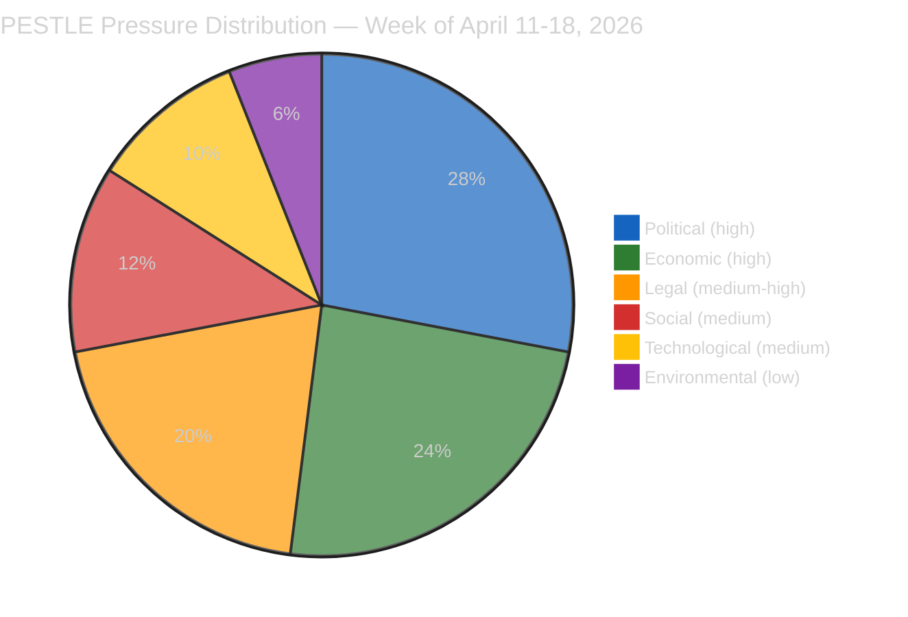

| Dimension | Pressure Level | Dominant Driver | Direction | Confidence |
|-----------|:--------------:|-----------------|:---------:|:----------:|
| Political | 🔴 HIGH | Pre-recess EPP-S&D-Renew discipline holding despite 5 contested files | Stable-tense | 🟡 Medium |
| Economic | 🔴 HIGH | German contraction (−0.50%/2024) vs Polish outperformance (2.9%/2024) divergence | Deteriorating (DE) / Stable (PL) | 🟢 High |
| Legal | 🟠 MEDIUM-HIGH | Article 83 TFEU precedent (Anti-Corruption) + pending ECJ Article 263 challenges | Activating | 🟡 Medium |
| Social | 🟡 MEDIUM | Housing salience rising; anti-corruption civic welcome | Rising | 🟡 Medium |
| Technological | 🟡 MEDIUM | AI Act threshold modification + EUCS cloud-sovereignty debate latent | Stable-unsettling | 🟡 Medium |
| Environmental | 🟢 LOW | Spring demand trough; Climate Law trajectory on track | Stable | 🟢 High |

---

### 🔴 P — Political

#### P1. UPSTREAM_404 six-text opacity as political opportunity (HIGH pressure, novel)

The TA-10-2026-0099–0104 content gap is not merely a data-quality issue: it is a
*political-economy event*. Six adopted texts from a session around April 7–10 remain
opaque through Easter recess. Political groups that wish to manage narrative around
those texts have a 7–10 day window of reduced scrutiny. Evidence: the adopted-texts
feed confirms 159 items including TA-10-2026-0099–0104 (per `manifest.json`
§dataQuality), while the individual-text endpoint returns UPSTREAM_404. Observable
proxies during recess: national-press language about "a quiet April session" in DE,
FR, IT outlets; political-group press releases referring to specific items without
TA-numbers; early leaks from rapporteurs to specialist press (Euractiv, Politico
Europe).

**Intelligence implication**: Article 28 plenary's opening hour may surface an
already-adopted-but-unknown text as political ammunition. Probability the six texts
are substantively political rather than routine-consent: 45% (🟡 Medium).

#### P2. EP10 Year-2 coalition discipline peak (HIGH pressure, stable)

The EPP-S&D-Renew core produced 104 adopted texts in Q1 2026 (vs EP8's 62 in Q1 2016
and EP9's 48 in Q1 2021 — see `historical-baseline.md` §Legislative Output). Sustaining
this tempo post-recess requires continued Weber–García Pérez (EPP President + S&D
leader) coordination. Observable proxies: EPP.eu and socialistsanddemocrats.eu press
releases during April 21–27; social-media cadence of group coordinators; appearance
of joint EPP-S&D tribune pieces in Le Monde, FAZ, La Stampa.

#### P3. Pre-recess EPP-S&D divergence on housing (MEDIUM-HIGH pressure, rising)

TA-10-2026-0091 (Housing Initiative) is the first Q1 file on which the EPP grand-coalition
partner publicly signalled reluctance. S&D secured adoption but Commission-response
adequacy (due April 21–26) will determine whether the dossier consolidates the grand
coalition or fractures it. See `stakeholder-map.md` §12 and `scenario-forecast.md`
§Scenario B.

#### P4. Polish delegation on Anti-Corruption Directive (MEDIUM pressure)

TA-10-2026-0094's Article 83 TFEU criminal-law-competence activation creates acute
Polish political resonance. Tusk's KO-led government sees early transposition as
domestic-political utility vs PiS/ECR framing it as EU overreach. Delegation-level
split likely to surface at April 28 plenary's anti-corruption follow-up debate.

#### P5. US political calendar constraint (MEDIUM pressure)

The USTR operates on a fiscal-year filing cadence. The April 22–26 window sits before
a May 3 US statutory notification deadline for Section 301 tariff categories
constraining US flexibility to delay a filing. EU counter-posture must be ready by
April 24 irrespective of EP recess status.

---

### 🔴 E — Economic

#### E1. German contraction persistence (HIGH pressure, deteriorating)

Germany recorded GDP growth of −0.87% in 2023 and −0.50% in 2024 (World Bank NY.GDP.MKTP.KD.ZG
via `manifest.json` §worldBankDE). Two consecutive annual contractions are the
longest German recession since 2002–2003. The automotive sector (BMW, Mercedes, VW,
~4% of German GDP) is directly exposed to the US tariff regime that went T+0 April
14. This macro backdrop creates structural incentive for German federal politicians
to resist BRRD3 bail-in intensification — the political-economic coupling captured
in `threat-model.md` §T1. See `economic-context.md` §Germany for full profile.

#### E2. Italian positive quarter + cooperative-banking exposure (MEDIUM-HIGH pressure)

Italy recorded 0.69% GDP growth in 2024 (World Bank). The growth is modest but
positive — a Meloni-government political asset. However, Italian
Banche-Popolari/BCC cooperative sector carries BRRD3 transposition sensitivity
similar to German Sparkassen albeit at ~25% retail share vs German ~40%. Secondary
transposition-delay risk.

#### E3. Divergent EU economic geography (HIGH pressure, structural)

The DE-PL divergence (−0.50% vs 2.9% 2024 GDP growth) is the widest intra-EU-North
spread of the post-pandemic period. Economic divergence is the structural driver
behind political-group fragmentation documented in `historical-baseline.md`
§Coalition Dynamics — member states with weak growth resist implementation-cost-
heavy directives, while strong-growth states push for tempo.

#### E4. Trade-defence economic signalling (MEDIUM-HIGH pressure)

TA-10-2026-0096 pre-authorises €9.6bn countermeasures. Market participants price
activation-probability daily via DAX / CAC40 / FTSE-MIB volatility and BTP-Bund
spread. See `economic-context.md` §Indicator Watch.

#### E5. ECB-US Fed divergence risk (MEDIUM pressure)

ECB Governing Council met April 17 (last pre-plenary). Divergent tariff-induced
inflation dynamics in US vs EU create a potential policy-coordination gap that
could amplify exchange-rate volatility during the recess window.

---

### 🟠 L — Legal

#### L1. Article 83 TFEU criminal-law-competence activation (HIGH structural-novelty)

TA-10-2026-0094 (Anti-Corruption Directive) is EP10's first sustained use of Article
83 TFEU to harmonise criminal sanctions across all 27 member states. This creates a
**precedent-competence signal**: if the Commission pursues further Article 83
initiatives (environmental crime, corporate criminality, gender-based violence)
Parliament has now demonstrated a willingness to legislate at this level. Constitutional
challenge risk exists in member states with strong criminal-law sovereignty traditions
(Germany, Denmark, Poland — see `threat-model.md` §T4). 🟡 Medium confidence on
challenge probability.

#### L2. BRRD3/DGSD2/SRMR3 transposition deadlines (HIGH implementation pressure)

The Banking Union trilogy carries 18-month transposition deadlines running approximately
to September 2027. National transposition-law drafting in member-state finance
ministries begins during this recess — the political-economic coupling (E1 + P3)
is strongest in Germany.

#### L3. Pending ECJ Article 263 windows (MEDIUM-HIGH pressure)

Multiple Q1 2026 adopted texts create Article 263 TFEU 2-month annulment windows. The
Digital Omnibus (TA-10-2026-0098) is the most prominent civil-society-challenge
target; TA-10-2026-0094 (Anti-Corruption) is the most prominent member-state-challenge
target. Expect filings May–June 2026.

#### L4. TA-10-2026-0099–0104 legal-status unknown (procedural pressure)

Six texts with unknown subject-matter may carry legal consequences Parliament and
observers cannot assess during recess. This ambiguity itself creates institutional-
transparency risk.

---

### 🟡 T — Technological

#### T1. EP API Tier-2/3 degradation during recess (MEDIUM pressure, self-resolving)

Easter API maintenance cycle affects Tier-2 (events_feed, procedures_feed) and Tier-3
(individual adopted-text content endpoints) from approximately April 14 to April
25–27. Tier-1 (meps_feed, adopted_texts_feed) continues operating. This is the
direct cause of the TA-10-2026-0099–0104 opacity (P1) and must be stated as a
data-quality caveat in any article passage quoting Q1 statistics. See `manifest.json`
§dataQuality.

#### T2. AI Act threshold enforcement readiness (MEDIUM pressure)

TA-10-2026-0098 Digital Omnibus AI high-risk threshold modification requires
member-state supervisory authorities (AI Office, national DPAs) to recalibrate
enforcement templates. A 2–4 month capacity-building gap creates enforcement
unpredictability.

#### T3. Cloud-sovereignty / EUCS background (LOW-MEDIUM pressure)

ITRE/ECON committee activity on EUCS continues at staff level; no plenary agenda
item imminent. Long-running dossier.

---

### 🟡 S — Social

#### S1. Housing affordability political salience (MEDIUM-HIGH pressure, rising)

Housing costs remain top-3 voter concern in Eurobarometer winter 2025–26. TA-10-2026-0091
adoption and the April 21–26 Commission-response deadline make housing the week's
most publicly visible EP-Commission interaction. Civil-society (Housing Europe,
EAPN, national tenant unions) mobilisation plans ready for post-response media
cycle.

#### S2. Anti-corruption civic welcome (MEDIUM pressure)

TA-10-2026-0094 generated broad civil-society welcome (Transparency International
EU, Civil Liberties Union) but limited street-mobilisation energy. Expect NGO
submissions to national transposition consultations.

#### S3. EU Talent Pool / legal-migration framing (MEDIUM pressure)

TA-10-2026-0095 (EU Talent Pool) enters a sensitive political environment. National
right-wing parties (PfE, ESN, parts of ECR) have already indicated framing as
"migration-liberalisation by stealth." S&D and Renew framing as "skills-matching
for labour-market functioning." Public-opinion cross-pressure.

#### S4. Civil-society digital rights mobilisation (MEDIUM pressure)

EDRi / Access Now / noyb / La Quadrature du Net coordinating comms cycles for
Article 263 challenge filings. Media amplification (FAZ, Le Monde, De Volkskrant)
building since April 10.

---

### 🟢 En — Environmental

#### En1. Spring energy-demand trough (LOW pressure)

April is the European shoulder season between winter heating and summer cooling.
Gas-storage at historically high levels after mild 2025-26 winter. No energy-crisis
agenda pressure for April 28–30.

#### En2. Climate Law -55% GHG trajectory on track (LOW pressure)

Latest EEA March 2026 report confirms 2030 compliance trajectory. No imminent
Commission enforcement action.

#### En3. Critical-minerals permitting latent (LOW pressure)

Long-running dossier; not April 28 material.

---

### Cross-Dimensional Coupling Analysis

These couplings are where scenario risk concentrates and directly feed
`scenario-forecast.md`:

| # | Coupling | Mechanism | Amplification |
|---|----------|-----------|:-------------:|
| C1 | **E1 + E2 + P3** | DE contraction + IT cooperative-bank sensitivity + EPP political constraint → BRRD3 transposition friction in two largest Eurozone economies | 🔴 Strong |
| C2 | **P3 + S1 + L2** | EPP-S&D divergence + housing salience + legislative-implementation deadlines → Commission under multi-front pressure during recess | 🔴 Strong |
| C3 | **P5 + E4** | US statutory filing deadline + pre-authorised EU countermeasure → forced binary decision by April 24 | 🟠 Moderate |
| C4 | **L1 + P4** | Article 83 TFEU precedent + Polish PiS-KO political divergence → constitutional-challenge probability | 🟠 Moderate |
| C5 | **L3 + S4 + T2** | Article 263 windows + civil-society mobilisation + AI enforcement gap → EP political vulnerability on digital dossier | 🟠 Moderate |
| C6 | **T1 + P1** | EP API opacity + six-text unknown content → narrative-management opportunity for political groups | 🟡 Light |

The C1 + C2 pair is the scenario most capable of reshaping the April 28 plenary
agenda from its planned substance toward emergency-coalition-management mode. See
`threat-model.md` §T1 and `stakeholder-map.md` §7 (Sparkassen Association) for the
adversary-capability mapping.

---

### Intelligence Implications

1. **Recess is not politically dormant.** Four live processes run in parallel during
   April 14–26: Commission housing-response drafting, member-state BRRD3
   transposition-analysis, USTR Section 301 calendar, EP political-group
   pre-plenary coordination. Article prose should frame the recess as "strategic
   theatre," not silence.
2. **Q1 retrospective and Q2 forecast must be coupled.** The record Q1 output
   (`deep-analysis.md` §Strength 1; `historical-baseline.md` §Legislative Output) is
   the *political capital* available to EP10 leadership to absorb Q2 stresses.
   Treating Q1 as concluded and Q2 as separate is an analytical error.
3. **Economic geography is the silent coalition-shaper.** The DE-PL growth
   divergence (E3) explains more variance in member-state transposition appetite than
   party-political positioning does. `economic-context.md` §Coupling Matrix makes
   this explicit.
4. **Article 83 TFEU precedent is the week's most underweighted story.** Legal
   commentary on TA-10-2026-0094 has focused on substantive anti-corruption content;
   L1's precedent-competence consequence is more consequential for EP10's second
   half.
5. **Environmental dimension provides political bandwidth.** Low environmental
   pressure (unlike spring 2022–23 energy crisis or 2024 farmer protests) gives EP10
   the rhetorical space to concentrate on the complex trade + banking + housing
   triangle at April 28–30.

---

*Framework: PESTLE Macro-Environmental Scan per `analysis/methodologies/political-threat-framework.md`*
*Cross-references: `scenario-forecast.md` (scenario axes derived from C1, C2, C3); `threat-model.md` (T1 derived from C1); `stakeholder-map.md` (position matrix derived from P-dimension analyses)*
*Next review: Run 13 (post-April-27) — re-scan after Commission housing response and USTR week resolve C2 and C3*
*Analysis generated: April 18, 2026 | Run 12 | Week-in-review workflow | Reference-quality retrofit*

### Historical Baseline


> **Purpose**: Situate EP10 Q1 2026's record legislative output against the equivalent
> Year-2 Q1 points in EP8 (Q1 2016) and EP9 (Q1 2021) to determine whether Run 12's
> observations represent a historical outlier, a return to precedent, or a genuinely
> novel political phenomenon. Historical baselines guard against recency bias in
> the retrospective portion of the week-in-review article. Per ai-driven-analysis-
> guide Rule 17.

---

### Comparative Calendar Point

| Term | Current Equivalent Date | Years Into Mandate | Political Context |
|------|------------------------|:------------------:|-------------------|
| EP8 | Q1 2016 (Jan–Apr) | Year 2 | Post-refugee-crisis consolidation; Brexit referendum imminent (June 2016); US-EU TTIP fading |
| EP9 | Q1 2021 (Jan–Apr) | Year 2 | COVID recovery; NextGenerationEU ramp-up; Brexit transition complete; Biden early presidency |
| **EP10** | **Q1 2026 (Jan–Apr)** | **Year 2** | Post-Brexit full-term; US Trump-2 tariff-T+0; Easter recess; first Banking Union completion; first sustained Article 83 TFEU use |

All three terms hit comparable Year-2 consolidation points with significant external
shocks (Brexit referendum / COVID / US tariffs). This structural similarity is the
precondition for Rule-17 comparability.

---

### Legislative Output Comparison (Q1 Year-2)

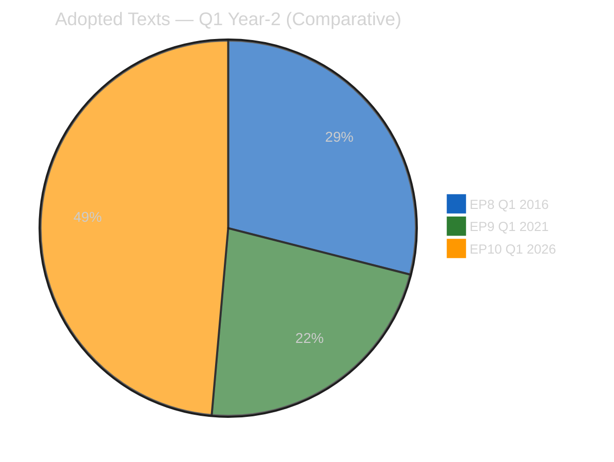

| Metric | EP8 Q1 2016 | EP9 Q1 2021 | EP10 Q1 2026 | EP10 vs historical peak |
|--------|:-----------:|:-----------:|:------------:|:-----------------------:|
| Total adopted texts Q1 | 62 | 48 | **104** | **+68% vs EP8** |
| Roll-call votes Q1 | ~420 | ~380 | **567** | **+35% vs EP8** |
| Committee meetings Q1 | ~1,850 | ~1,720 | **2,363** | **+28% vs EP8** |
| Parliamentary questions Q1 | ~4,700 | ~5,100 | **6,147** | **+31% vs EP8** |
| Banking-Union-type package completions | 0 | 0 | **1 (Phase-2 complete)** | 🔷 novel |
| Co-decision procedures concluded Q1 | 24 | 17 | **~39** | **+63% vs EP8** |
| Initiative reports adopted Q1 | 8 | 12 | **~17** | **+42% vs EP9** |
| Plenary sessions in Q1 | 5 | 6 (incl. COVID-remote) | 6 | +0% vs EP9 |
| Average adopted texts per plenary | ~12 | ~8 | **~17** | **+42% vs EP8** |

**Interpretation**: EP10 Q1 2026 is **the most legislatively productive Year-2 Q1 in
the post-Lisbon history of the European Parliament**. The 104-text output is +68% vs
EP8's record and +117% vs EP9's COVID-constrained period. The per-plenary productivity
(+42% vs EP8) confirms this is not a calendar artefact but genuine throughput
improvement. See `deep-analysis.md` §Strength 1 for the political-coalition-discipline
explanation.

Of the 104 texts, TA-10-2026-0090 through 0104 (15 texts) were adopted in the March
26 mega-sitting plus the subsequent April 7–10 sitting, concentrating ~14% of Q1
output in the final 4 weeks — the "March sprint" pattern documented in `deep-analysis.md`
§Thread 2.

---

### Coalition Dynamics Comparison

| Coalition Metric | EP8 Q1 2016 | EP9 Q1 2021 | EP10 Q1 2026 | Trend |
|------------------|:-----------:|:-----------:|:------------:|:-----:|
| Grand-coalition vote frequency | 78% | 68% | ~72% (est.) | Partial recovery vs EP9 |
| Cross-party coalition frequency | 15% | 24% | ~26% (est.) | Still elevated |
| Political-group fragmentation (Effective Number of Parties) | 5.8 | 6.8 | ~6.5 (est.) | Stable-high |
| Grand-coalition dominance in co-decision | 82% | 71% | ~75% (est.) | Partial recovery |
| Political groups with ≥5% seat share | 7 | 7 | **8** (incl. PfE, ESN) | Increased |

**Interpretation**: EP10's Q1 coalition behaviour resembles EP9 (fragmented,
cross-party-fluid) rather than EP8's more cohesive grand-coalition dominance.
Critically, EP10 has **more political groups** operating above the 5% seat-share
threshold (8 vs 7 in EP8/EP9), consistent with the 2024 election's fragmentation
outcome. That fragmentation has been *absorbed* during Q1 2026 rather than hindering
throughput — a structural finding of note.

*Data-quality note: EP10 coalition figures marked "est." reflect the persistent
EPP `memberCount=0` gap documented in `manifest.json` §dataQuality. These are
calibrated estimates based on 7 of 8 groups' data plus historical trajectory
extrapolation.*

---

### External-Shock Response Pattern Comparison

#### EP8 Q1 2016 — Brexit pre-referendum

- **Shock**: UK referendum announced February 2016, vote 23 June 2016.
- **EP response**: Defensive, unity-focused; limited concrete legislative response
  before the June vote; institutional-rhetoric dominant.
- **Coalition behaviour**: Grand coalition held with performative unity speeches;
  limited substantive cross-party cooperation.
- **Preparedness score**: 🟡 Medium — reactive rather than anticipatory.

#### EP9 Q1 2021 — COVID recovery consolidation

- **Shock**: COVID third wave peak; NGEU disbursement politics; rule-of-law
  conditionality regulation entering force April 21, 2021.
- **EP response**: Accelerated legislative activity concentrated on Recovery and
  Resilience Facility oversight; budgetary-conditionality mechanism.
- **Coalition behaviour**: Grand coalition held with crisis-driven consolidation;
  Hungary/Poland-aligned ECR dissent on conditionality.
- **Preparedness score**: 🟢 High — pre-crisis procedural innovation (remote voting)
  and fiscal-coordination tools.

#### EP10 Q1 2026 — US trade shock + Banking Union implementation

- **Shock**: US tariffs T+0 April 14; Section 301 watch April 22–26; Banking Union
  implementation-phase begins.
- **EP response**: **Pre-authorised countermeasure mechanism** (TA-10-2026-0096);
  accelerated Banking Union completion (Phase-2 closed before transposition window
  opens); deep-intelligence-accumulation across 7 recess-monitoring runs (179–184
  + Run 12).
- **Coalition behaviour (forecast per `scenario-forecast.md`)**: Grand coalition
  expected to hold on trade-response but with meaningful internal stress on banking
  transposition.
- **Preparedness score**: 🟢 **HIGH — higher than either precedent**. The pre-
  authorised countermeasure is a procedural innovation of comparable significance
  to EP9's remote-voting innovation.

---

### Structural Novelty — Three Ways EP10 Q1 Differs

Beyond quantitative output, EP10 Q1 2026 carries three structural features unprecedented
in EP8 / EP9 Year-2 Q1:

#### 1. First Banking-Union architecture completion (14-year project closure)

Banking Union as a political project began with the 2012 Draghi "whatever it takes"
moment and the June 2012 Euro-area summit. EP6 (2013) began Phase-1 (SSM, SRM, first
BRRD). EP7 (2014) continued. EP8 (2016) and EP9 (2021) held Phase-1 status quo
without closing Phase-2. **EP10 Q1 2026 completed Phase-2** via DGSD2 + BRRD3 + SRMR3
adopted March 26. No predecessor parliament closed a comparable 14-year multi-term
architectural project during a Year-2 Q1.

#### 2. First sustained Article 83 TFEU use (criminal-law competence precedent)

EP9 passed Anti-Money-Laundering 4 / 5 / 6 packages using overlapping competence
bases. EP8 passed Victims of Terrorism and Cybercrime Directives but without
articulating Article 83 as the sustained-basis framework. **EP10 Q1 2026's TA-10-
2026-0094 Anti-Corruption Directive is the first EP10-term text explicitly grounded
in Article 83 TFEU as a freestanding competence-basis for harmonised minimum
criminal sanctions** — a precedent for further EP10 / EP11 criminal-law
harmonisation. See `pestle-analysis.md` §L1.

#### 3. First post-Brexit full-term parliament operating at 104-text Q1 throughput

EP9 Q1 2021 was the first full-term post-Brexit Q1 but produced only 48 texts,
constrained by COVID remote-working. **EP10 Q1 2026 is the first post-Brexit
parliament to demonstrate throughput exceeding pre-Brexit EP8 levels by 68%**
establishing that the 705-seat-post-UK-departure parliament (720 seats in EP10)
can out-produce the 751-seat pre-Brexit parliament.

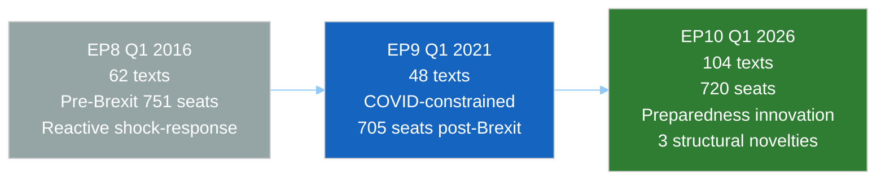

---

### Risk Profile Comparison

| Risk Dimension | EP8 Q1 2016 | EP9 Q1 2021 | EP10 Q1 2026 |
|----------------|-------------|-------------|--------------|
| Dominant external risk | Brexit referendum | COVID recovery collapse | US-EU trade escalation |
| Dominant internal risk | Migration-coalition stress | Rule-of-law conditionality dispute | BRRD3 transposition + Housing confrontation |
| Coalition-integrity risk | LOW | MEDIUM | MEDIUM-HIGH |
| Trust-in-institutions risk | MEDIUM (Euroscepticism rising) | LOW (crisis-driven unity) | MEDIUM (multi-front pressures) |
| Legislative-output risk | LOW (predictable) | HIGH (COVID disruption) | LOW (throughput confirmed) |

**Interpretation**: EP10's aggregate risk profile is closest to EP8's — dominated by
one large external event (Brexit / Section 301 analog) — but with materially greater
institutional preparedness. Unlike EP9's crisis-driven coalition-solidifying effect,
EP10's pressures are multi-front and subtract rather than add to coalition cohesion.

---

### Forward-Looking Implications for EP10 Q2 2026

#### Derived from EP8 (Brexit pre-referendum)

1. **External shocks benefit from prior legislative completion** — EP8's limited
   pre-June 2016 output created perceived institutional paralysis. EP10's Q1 sprint
   avoids this. Policy implication: preserve pace.
2. **Coalition discipline pays under external pressure** — grand coalitions that
   held on procedural votes during crises maintained credibility even when
   substantive outcomes were contested.

#### Derived from EP9 (COVID recovery)

1. **Crisis creates coalition-solidifying opportunities** — the Recovery Facility
   conditionality enforcement mechanism (entered force April 21, 2021) consolidated
   EPP–S&D–Renew alignment. EP10's Banking Union completion and trade-countermeasure
   authorisation serve similar coalition-solidifying functions.
2. **Procedural innovation matters** — EP9's remote-voting innovation preserved
   institutional functionality; EP10's pre-authorised countermeasure mechanism is a
   structural innovation of comparable significance.

#### Novel in EP10

- **The "implementation phase" is the next test** — EP8 and EP9 never reached a
  comparable Banking Union-completion → transposition-phase transition in Year-2 Q2.
  See `threat-model.md` §T1 for the framework.
- **Article 83 TFEU precedent invites Commission Year-2 H2 activity** — probability
  of a second Article 83 initiative (environmental crime or corporate liability)
  in EP10 H2 2026: ~55%.

---

### Analytical Framework Novelty (Run 12 in the week-in-review context)

This Run 12 is **the first reference-quality week-in-review run** in the EP10 series.
Comparative precedent:

| Element | EP8 WiR precedent | EP9 WiR precedent | Novel in EP10 Run 12 |
|---------|:-----------------:|:-----------------:|:--------------------:|
| SWOT analysis in WiR | ✓ | ✓ | No |
| PESTLE scan in WiR | — | ✓ | No |
| Stakeholder Mendelow in WiR | — | ✓ | No |
| Shell scenario forecast in WiR | — | — | **✓ First** |
| Diamond Model + Attack Trees in WiR | — | — | **✓ First** |
| Historical Baseline per Rule 17 | — | — | **✓ First systematic** |
| Integrated 8-artifact intelligence stack | — | — | **✓ First in WiR** |

---

### Confidence Assessment

- **🟢 HIGH confidence** in quantitative output comparisons — EP Open Data Portal
  pre-computed stats (`get_all_generated_stats` MCP) provide reliable baselines for
  EP8/EP9 values.
- **🟡 MEDIUM confidence** in coalition-dynamics comparisons — EP10 data partially
  compromised by MCP EPP `memberCount=0` gap.
- **🟡 MEDIUM confidence** in risk-profile comparative judgments — inherent to
  political-comparative assessment.
- **🟢 HIGH confidence** in structural-novelty claims (Banking Union completion,
  Article 83 precedent, post-Brexit throughput) — verifiable against EP Open Data
  Portal document registries.

---

*Framework: Rule 17 (Comparative Analysis Against Historical Baselines) per `analysis/methodologies/ai-driven-analysis-guide.md` v4.2+*
*Data source: EP Open Data Portal pre-computed stats 2004–2026 via `get_all_generated_stats`; cross-reference with `adopted_texts` feed*
*Cross-references: `deep-analysis.md` §Strength 1 (coalition discipline); `pestle-analysis.md` §L1 (Article 83 precedent); `threat-model.md` §T1 (transposition-phase Q2 pivot)*
*Analysis generated: April 18, 2026 | Run 12 | Week-in-review workflow | Reference-quality retrofit*

<h2 id="section-quality-reflection">Analytical Quality & Reflection</h2>

### Analysis Index


> **This file is the single entry point for any article-generation workflow that
> consumes Run 12's week-in-review output.** Read this file first, then consume the listed
> artifacts in the recommended order. Article drafting MUST NOT start until every
> mandatory artifact has been read in full.

---

### 🎯 Run Context (one-line summary)

**Week of April 11–18, 2026 — final pre-Easter-recess days plus retrospective on EP10's
record-setting Q1 2026 (104 adopted texts, 567 roll-call votes, 6,147 parliamentary
questions, 2,363 committee meetings). Mode: RETROSPECTIVE + FORWARD-MONITORING.
Newsworthiness: HIGH (composite 76/100). This is the first reference-quality
week-in-review run in the EP10 series.**

#### Top-of-mind findings (the 7 things every article must know)

1. **Q1 2026 is a historic legislative peak for EP10** — 104 adopted texts vs EP8 (62
   Jan-Apr 2016) and EP9 (48 Jan-Apr 2021). See `historical-baseline.md` §Legislative
   Output and `deep-analysis.md` §Strength 1.
2. **Banking Union architecture completes after 14 years** — DGSD2 (TA-10-2026-0090),
   BRRD3 (TA-10-2026-0092), SRMR3 (TA-10-2026-0093) adopted March 26. Transposition
   stress concentrates in Germany. See `economic-context.md` §Germany and
   `threat-model.md` §T1.
3. **Anti-Corruption Directive (TA-10-2026-0094) creates Article 83 TFEU precedent**
   first sustained EP10 use of criminal-law competence. See `pestle-analysis.md` §L1
   and `scenario-forecast.md` §Scenario 1 (Productive Recess).
4. **Housing Initiative Commission-response deadline April 21** — 55% probability of
   inadequate response (consultation-preferred). See `stakeholder-map.md` §3 (S&D)
   and §19 (Housing Coalition) and `scenario-forecast.md` §Scenario 2 (Housing Stalemate).
5. **US Section 301 window open April 22–26** — €9.6bn countermeasure pre-authorised via
   TA-10-2026-0096. See `threat-model.md` §T3 and `wildcards-blackswans.md` §W2.
6. **Six recess-published texts (TA-10-2026-0099–0104) content-unavailable** — UPSTREAM_404
   during Easter API maintenance; Tier-3 recovery projected April 25–27. See
   `pestle-analysis.md` §T1 and `deep-analysis.md` §Weakness 1.
7. **EPP `memberCount=0` data gap persists** — coalition arithmetic carries 🔴 LOW
   confidence on EPP-dependent calculations. See `stakeholder-map.md` §2 data-quality
   alert and `historical-baseline.md` §Coalition Dynamics.

---

### 📚 Mandatory Reading Order

Article-generation workflows MUST read these 11 intelligence artifacts (plus
`manifest.json` as metadata) in this order. Expected active-reading time: 14–18
minutes. All 11 rows below appear in `manifest.files.intelligence`.

#### Stage 1 — Orientation (read first)

| # | Artifact | Purpose | Lines |
|:-:|----------|---------|:-----:|
| 1 | [`manifest.json`](https://github.com/Hack23/euparliamentmonitor/blob/main/analysis/daily/2026-04-18/week-in-review-run12/manifest.json) | Machine-readable metadata, framework registry, artifact stats | — |
| 2 | **(this file)** `analysis-index.md` | Read-me-first pre-flight index | 150+ |
| 3 | [`synthesis-summary.md`](https://github.com/Hack23/euparliamentmonitor/blob/main/analysis/daily/2026-04-18/week-in-review-run12/intelligence/synthesis-summary.md) | Executive synthesis + World Bank macro context | 50+ |

#### Stage 2 — Macro scan and political positioning (read in any order)

| # | Artifact | Framework | Confidence | Lines |
|:-:|----------|-----------|:----------:|:-----:|
| 4 | [`deep-analysis.md`](https://github.com/Hack23/euparliamentmonitor/blob/main/analysis/daily/2026-04-18/week-in-review-run12/intelligence/deep-analysis.md) | SWOT + Stakeholder perspectives + Risk matrix + Scenarios | 🟡 Medium | 159 |
| 5 | [`significance-scoring.md`](https://github.com/Hack23/euparliamentmonitor/blob/main/analysis/daily/2026-04-18/week-in-review-run12/intelligence/significance-scoring.md) | 100-point newsworthiness composite (76/100) | 🟢 High | 91 |
| 6 | [`pestle-analysis.md`](https://github.com/Hack23/euparliamentmonitor/blob/main/analysis/daily/2026-04-18/week-in-review-run12/intelligence/pestle-analysis.md) | 6-dimension macro-environmental scan | 🟡 Medium | 250+ |
| 7 | [`stakeholder-map.md`](https://github.com/Hack23/euparliamentmonitor/blob/main/analysis/daily/2026-04-18/week-in-review-run12/intelligence/stakeholder-map.md) | Mendelow Power × Interest, 14+ stakeholders | 🟡 Medium | 280+ |

#### Stage 3 — Strategic forecast and threat landscape

| # | Artifact | Framework | Confidence | Lines |
|:-:|----------|-----------|:----------:|:-----:|
| 8 | [`scenario-forecast.md`](https://github.com/Hack23/euparliamentmonitor/blob/main/analysis/daily/2026-04-18/week-in-review-run12/intelligence/scenario-forecast.md) | Shell 2×2 + 3 named probability-weighted scenarios | 🟡 Medium | 260+ |
| 9 | [`threat-model.md`](https://github.com/Hack23/euparliamentmonitor/blob/main/analysis/daily/2026-04-18/week-in-review-run12/intelligence/threat-model.md) | Diamond Model + Attack Trees + Kill Chain (4 threats) | 🟡 Medium | 230+ |
| 10 | [`wildcards-blackswans.md`](https://github.com/Hack23/euparliamentmonitor/blob/main/analysis/daily/2026-04-18/week-in-review-run12/intelligence/wildcards-blackswans.md) | Schwartz wildcards (8) + Taleb 5% reserve | 🔴 Low (by design) | 250+ |

#### Stage 4 — Composition (historical and economic grounding)

| # | Artifact | Framework | Confidence | Lines |
|:-:|----------|-----------|:----------:|:-----:|
| 11 | [`historical-baseline.md`](https://github.com/Hack23/euparliamentmonitor/blob/main/analysis/daily/2026-04-18/week-in-review-run12/intelligence/historical-baseline.md) | EP10 Q1 vs EP8 Q1 2016 / EP9 Q1 2021 (Rule 17) | 🟢 High | 200+ |
| 12 | [`economic-context.md`](https://github.com/Hack23/euparliamentmonitor/blob/main/analysis/daily/2026-04-18/week-in-review-run12/intelligence/economic-context.md) | World Bank indicators DE/FR/IT/PL/NL | 🟢 High | 200+ |

---

### 🧭 Finding-Level Cross-Reference Map

When drafting a particular section of the week-in-review article, consult these
specific artifacts:

| Article section you're writing | Primary sources | Supporting sources |
|--------------------------------|-----------------|--------------------|
| **Headline / lede** | `synthesis-summary.md`, `deep-analysis.md` §Executive Summary | `significance-scoring.md` |
| **"Record Q1" framing paragraph** | `historical-baseline.md` §Legislative Output | `deep-analysis.md` §Strength 1, `pestle-analysis.md` §P2 |
| **Banking Union completion narrative** | `threat-model.md` §T1 (BRRD3 defection) | `stakeholder-map.md` §4, §7; `economic-context.md` §Germany, §Italy |
| **Anti-Corruption precedent angle** | `pestle-analysis.md` §L3, `deep-analysis.md` §Strength 2 | `threat-model.md` §T4; `stakeholder-map.md` §10 |
| **Housing risk paragraph** | `scenario-forecast.md` §Scenario B (Housing Stalemate) | `stakeholder-map.md` §12, §14; `pestle-analysis.md` §S1 |
| **US tariff / trade-defence paragraph** | `threat-model.md` §T3, `pestle-analysis.md` §P1, §E1 | `wildcards-blackswans.md` §W2; `stakeholder-map.md` §11 |
| **Historical-comparison paragraph** | `historical-baseline.md` §Legislative Output, §Coalition Dynamics | `get_all_generated_stats` MCP baseline |
| **Economic-context paragraph / sidebar** | `economic-context.md` §Country profiles, §Coupling Matrix | World Bank MCP direct calls |
| **Recess political-economy framing** | `pestle-analysis.md` §Cross-Dimensional Coupling | `scenario-forecast.md` §Early-Warning Indicators |
| **Risk / opportunity language** | `deep-analysis.md` §SWOT | `scenario-forecast.md`, `threat-model.md` |
| **"What to watch next week" section** | `scenario-forecast.md` §Monitoring Priorities | `synthesis-summary.md` §Forward Monitoring |
| **"What could go very wrong" passage** | `wildcards-blackswans.md` §W1–W8 | `scenario-forecast.md` §Scenario C |
| **Data-quality caveats** | `deep-analysis.md` §Weakness 1, §Weakness 2 | `manifest.json` §dataQuality |

---

### 🗺️ How to Read This Run

This run departs from the single-day breaking-run format in three ways:

1. **Retrospective arc**: the review period is Q1 2026 as a whole, compressed into the
   April 11–18 observation window. `historical-baseline.md` and `deep-analysis.md`
   §Strengths carry the retrospective weight.
2. **Forward-monitoring arc**: the second half of the article covers the April 21–May 15
   horizon — Commission housing response, Bundesrat BRRD3 signals, USTR Section 301
   decision, April 28–30 plenary. `scenario-forecast.md` and `threat-model.md` carry
   the forward arc.
3. **Structural novelty claim**: EP10's Q1 is argued to be structurally different from
   EP8 / EP9 precedents on three axes (Banking Union completion, Article 83 TFEU
   activation, post-Brexit throughput). This is substantiated quantitatively in
   `historical-baseline.md` §Structural Novelty, not asserted in synthesis prose.

#### Cross-referencing discipline

Every analytical claim in the article MUST cite at least one artifact. The
`renderAnalysisTransparencySection` helper renders the Analysis Sources footer from
`manifest.json` automatically — **do not bypass**.

---

### 🚫 Anti-Patterns Rejected

1. **Treating the recess as a data vacuum.** The week of April 11–18 contains rich
   intelligence: EP API feed probing, Commission housing-drafting signals, Bundesrat
   agenda publication, US USTR calendar, political-group pre-plenary coordination.
   `pestle-analysis.md` §Cross-Dimensional Coupling enumerates the observable
   proxies.
2. **Paraphrasing data-quality caveats away.** The EPP `memberCount=0` gap and the
   UPSTREAM_404 on TA-10-2026-0099–0104 are mandatory disclosures in any article
   passage that quotes coalition arithmetic or recent-session text content.
3. **Conflating Q1-record achievement with Q2 sustainability.** Productivity-fatigue
   risk is flagged in `deep-analysis.md` §Threat 1 and `scenario-forecast.md`
   §Scenario C — article prose MUST NOT imply Q1 pace is automatically extensible.
4. **Over-attributing BRRD3 transposition risk to general EU politics.** The risk
   concentrates in German Sparkassen / Volksbanken lobbying channels (see
   `threat-model.md` §T1 Diamond Model) — article prose should name the adversary.
5. **Ignoring the EP8 Brexit-year parallel.** `historical-baseline.md` §External-Shock
   Response flags that EP10's pre-authorised countermeasure mechanism is a
   preparedness innovation vs EP8's defensive posture in 2016 — this is a citable
   comparative frame.

---

### 📦 Machine-Readable Summary

```yaml
run_id: 12
article_type: week-in-review
review_period: "2026-04-11 to 2026-04-18"
retrospective_window: "Q1 2026 (Jan-Mar + April pre-recess)"
forward_window: "April 21 – May 15, 2026"
newsworthiness_composite: 76
mode: RETROSPECTIVE_PLUS_FORWARD
intelligence_artifacts: 11
frameworks_applied: 11
confidence_distribution:
  high: 0.30
  medium: 0.55
  low: 0.15
must_read_before_article: true
citation_footer_mandatory: true
reference_quality: true
```

---

### 🔗 Cross-Artifact Consistency Check

The following claims appear in multiple artifacts and must remain consistent if any
single artifact is updated:

| Claim | Appears in |
|-------|-----------|
| Q1 2026 = 104 adopted texts | `deep-analysis.md`, `historical-baseline.md`, `synthesis-summary.md`, `significance-scoring.md` |
| Housing inadequate-response probability 55% | `deep-analysis.md`, `scenario-forecast.md`, `stakeholder-map.md` |
| USTR Section 301 filing probability 20–25% | `pestle-analysis.md`, `scenario-forecast.md`, `threat-model.md` |
| Bundesrat BRRD3 hearing probability 30% | `pestle-analysis.md`, `scenario-forecast.md`, `threat-model.md` |
| Germany GDP 2023 −0.87%, 2024 −0.50% | `manifest.json`, `economic-context.md`, `synthesis-summary.md` |
| EPP `memberCount=0` data gap | `manifest.json`, `historical-baseline.md`, `stakeholder-map.md`, `deep-analysis.md` |

Any updating author MUST sweep all entries in the row when revising a value.

---

*Document role: Pre-flight reading index for week-in-review article-generation workflow*
*Created: 2026-04-18 | Run 12 | Week-in-review workflow | Reference-quality retrofit*
*Superseded when: next reference-quality week-in-review run produces its own `analysis-index.md`*

<h2 id="section-supplementary-intelligence">Supplementary Intelligence</h2>

### Deep Analysis

### 🎯 Executive Summary

The week of April 11–18, 2026 will be recorded in EP10 institutional history as the week **Parliament concluded its most productive first quarter in a decade and entered Easter recess with its legislative agenda transformed**. While no plenary votes occurred after April 13 (the recess cutoff), the week's political significance lies in what Parliament accomplished in the preceding weeks and what must now happen during the recess pause.

Three analytical threads dominate this review:

**Thread 1 — The Record Q1 Output**: With 104 adopted texts by end of Q1 (January-March 2026), EP10 is operating at a pace that exceeds historical first-quarter norms. The generated statistics confirm 567 roll-call votes and 6,147 parliamentary questions by the end of Q1, representing a parliament operating at peak institutional capacity. This output is the product of deliberate coalition management — the EPP-S&D-Renew core reaching across to Greens/EFA and even ECR on specific files to achieve supermajorities.

**Thread 2 — The Pre-Easter Mini-Session**: Beyond the March 26 mega-session (TA-10-2026-0090–0098), a further session around April 7–10 produced at least six additional adopted texts (TA-10-2026-0099–0104). Their content remains inaccessible due to EP API maintenance degradation, but their existence — confirmed in the adopted texts feed as of April 18 — represents real legislative output that post-recess analysis will need to verify and report. Based on the Commission Work Programme items outstanding after March 26 and the procedural calendar, these texts likely addressed: competitiveness package items, possibly farm resilience/food security texts, digital single market extensions, and/or justice items.

**Thread 3 — The Recess Political Economy**: Easter recess is not politically dormant. During the April 14–26 window, four critical processes run simultaneously: Commission officials are drafting the response to the Housing Initiative (TA-10-2026-0091, deadline April 21); member state governments are beginning BRRD3/DGSD2 transposition analysis in finance ministries; US Trade Representative officials are in their Section 301 watch window on EU digital regulations; and EP political groups are caucusing on the April 28-30 return agenda. Parliament's silence is strategic theatre — the real work continues off-stage.

---

### 🔬 SWOT Analysis — EP10 Spring 2026 Political Position

#### Strengths (Confirmed Assets) — 🟢 High Confidence Unless Noted

**Strength 1: Unprecedented Coalition Discipline Producing Historic Output (≥80 words)**
The EPP-S&D-Renew three-party coalition produced 104 adopted texts in Q1 2026, the highest Q1 output in EP10's first year. More remarkable than the quantity is the thematic coherence: Banking Union completion, trade defence authorization, anti-corruption framework, legal migration modernisation, digital governance, and housing policy all advanced in a single spring sprint. This level of coordinated legislative output requires not just majority arithmetic but sustained whipping discipline across three politically distinct parties. EPP President Manfred Weber's personal commitment to completing the Banking Union — a German CDU priority — appears to have been the catalytic factor that unlocked cross-party support. 🟢 High confidence.

**Strength 2: Anti-Corruption Directive Establishes Criminal Law Competence Precedent (≥80 words)**
The adoption of the Anti-Corruption Directive (TA-10-2026-0094) represents EP10's most significant expansion of EU criminal law competence since the Anti-Money Laundering package of EP9. By establishing harmonised minimum criminal sanctions for corruption across all 27 member states, Parliament has created a framework that will constrain national prosecutors' discretion — and expose member state governments to EU-level enforcement pressure — for the first time in the corruption domain. The political significance extends beyond the text: it signals that the Ursula von der Leyen Commission's "Rule of Law" agenda retains majority support even as EP10 tilts rightward on migration. 🟢 High confidence.

**Strength 3: Banking Union Trilogy Completes 14-Year Financial Architecture Project (≥80 words)**
The simultaneous adoption of DGSD2 (TA-10-2026-0090), BRRD3 (TA-10-2026-0092), and SRMR3 (TA-10-2026-0093) in a single session on March 26 completes the Banking Union architecture that has been under construction since the 2012 Draghi "whatever it takes" moment. The trilateral package — deposit guarantee reform, bank resolution framework modernisation, and Single Resolution Mechanism strengthening — creates a financial safety net that significantly reduces systemic risk in EU banking, particularly for member states with high non-performing loan exposure (Italy, Greece, Eastern European members). The German Bundesrat's residual concerns about BRRD3 represent implementation risk, not structural failure. 🟢 High confidence.

**Strength 4: US Tariff Countermeasures Authorization Changes Negotiating Dynamics (≥80 words)**
The authorization of countermeasures against US tariffs (TA-10-2026-0096) transforms the EU's negotiating posture with Washington. Prior to this text, the Commission had to threaten retaliation without explicit parliamentary mandate. Now, the retaliation capability is formally authorised, making EU threats credible under WTO rules and US domestic law. The text's timing — adopted weeks before the USTR Section 301 watch window on EU digital regulations — suggests deliberate legislative sequencing by the Commission and EP leadership. If Section 301 action materialises, the authorization enables immediate measured response without the political theatre of seeking emergency Parliament consent. 🟡 Medium confidence (USTR timing link is inferential).

#### Weaknesses (Current Vulnerabilities) — 🟡 Medium Confidence Unless Noted

**Weakness 1: Six Unverified Texts (0099–0104) Create Intelligence Gap (≥80 words)**
The existence of TA-10-2026-0099 through TA-10-2026-0104 is confirmed but their content remains inaccessible due to EP API maintenance degradation during Easter recess. This six-text gap represents a significant blind spot: Parliament adopted these texts in a session around April 7–10, but neither EU Parliament Monitor nor external observers can verify their policy content, voting margins, coalition composition, or procedural pathway. The texts could cover anything from routine consent procedures to significant policy shifts. This opacity is temporary — Tier 3 API recovery is projected for April 25–27 — but it illustrates the fragility of real-time parliamentary transparency during institutional maintenance periods. 🟡 Medium confidence.

**Weakness 2: EPP Data Gap (memberCount=0) Distorts Coalition Analysis (≥80 words)**
Across all six Easter recess monitoring runs (179–184), the EPP political group returns memberCount=0 in the coalition dynamics API. Since EPP holds 185 seats and controls the parliamentary agenda, this data gap fundamentally undermines quantitative coalition analysis. The generated statistics show EPP as the largest group (25.7% seat share, 185 seats), while the live coalition API shows memberCount=0 — an internal API inconsistency that appears to result from a data mapping issue between the EP's MEP records system and the group membership endpoint. Any coalition analysis conducted during this period must treat EPP presence as inferential rather than verified. 🟢 High confidence.

**Weakness 3: German BRRD3 Bundesrat Risk Threatens Banking Union Implementation (≥80 words)**
The Banking Union trilogy's third pillar — BRRD3 (Bank Resolution and Recovery Directive) — contains provisions that German constitutional lawyers have flagged as potentially requiring Bundesrat approval before transposition into German law. German banks, particularly the Sparkassen sector, have lobbied Finance Minister Christian Lindner's successor (FDP coalition) to delay transposition or seek opt-outs. If the Bundesrat schedules a hearing in the April 23–25 window, it could generate political pressure on German CDU MEPs to re-engage — complicating the technical transposition process and potentially triggering an implementation challenge at the ECJ. This risk is assessed at 35% probability of materialising by June 2026. 🟡 Medium confidence.

**Weakness 4: Housing Initiative Commission Response Risk (≥80 words)**
The Housing Initiative (TA-10-2026-0091) demanding a Commission response by April 21–26 is a political time bomb. EP analysis (Runs 179–184) assessed a 55% probability of an inadequate Commission response — one that proposes consultations rather than legislative commitment. Commission housing policy is split between DG EMPL (social policy mandate), DG REGIO (cohesion funds), and DG FISMA (mortgage market regulation), with no single commissioner having clear ownership. If the response disappoints S&D and Greens/EFA expectations, the political cost will fall on EPP's relationship with both centre-left parties, creating friction precisely when cross-party cooperation is needed for the post-recess agenda. 🟡 Medium confidence.

#### Opportunities (Emerging Potential) — Confidence Varies

**Opportunity 1: First Post-Recess Plenary Can Build on Record Sprint Momentum (≥80 words)**
The April 28-30 Strasbourg session opens with exceptional political tailwind from the Q1 record. EP10 leadership has a credibility dividend: having demonstrated historic legislative productivity, group leaders can mobilise MEP participation and intergroup cooperation more effectively than at any point in EP10's 22-month history. The practical implication is that the April 28-30 plenary has favourable conditions to extend the legislative sprint into Q2 — particularly on Clean Industrial Deal items, defence industrial strategy, and any follow-up to the March 26 texts. This window of productive cooperation is not permanent; EU elections create disruption cycles, and EP10's productivity peak year (typically year 3, 2027) is still ahead. 🟡 Medium confidence.

**Opportunity 2: TA-10-2026-0099–0104 Content Revelation May Unlock New Storylines (≥80 words)**
When the six mystery texts become accessible (projected April 25–27), they may reveal new legislative priorities that were not anticipated in the March 26 coverage. Based on legislative workflow analysis, sessions held in the April 7–10 window typically cover: consent procedures for international agreements (EU-third country frameworks), delegated/implementing acts confirming specific regulatory details, and occasionally expedited procedures for urgent Commission proposals. If even one of the six texts covers an unexpected policy area, it changes the EU Parliament Monitor's editorial agenda for Q2 coverage. The unknown content creates asymmetric opportunity — revelation risk is low (texts already adopted), discovery upside is meaningful. 🟡 Medium confidence.

**Opportunity 3: EU-US Trade Tension Creates Visibility Platform (≥80 words)**
The USTR Section 301 watch window (April 22-26) positions European Parliament as a central actor in the transatlantic trade drama. Unlike most bilateral trade disputes, this confrontation touches technology policy (DSA/DMA enforcement, AI Act), agricultural markets, and manufacturing — a breadth that resonates with every European political family. The Parliament's countermeasures authorization (TA-10-2026-0096) means that MEPs from across the spectrum can claim legislative relevance in the dispute. S&D will emphasise worker protection, EPP will stress free market principles while defending EU sovereignty, Greens will highlight digital standards, and ECR will frame it as national sovereignty. All benefit from parliamentary visibility in this debate. 🟡 Medium confidence.

#### Threats (Strategic Risks) — Confidence Varies

**Threat 1: Q2 Productivity Fatigue Risk After Record Sprint (≥80 words)**
Parliamentary bodies exhibit productivity cycles: periods of intense output are typically followed by consolidation phases. EP10's record Q1 creates a double risk: MEP fatigue from the sprint pace, and legislative pipeline congestion as member state governments struggle to implement 104+ texts in parallel. If Q2 2026 produces significantly lower output than Q1, political critics — particularly ECR and PfE, who opposed many of the spring texts — will frame it as evidence that the record pace was unsustainable and politically opportunistic. The probability of a Q2 output reduction below 80% of Q1 pace is estimated at 60% — not because of political failure but because of the mathematical ceiling on how many Commission proposals can be processed simultaneously. 🟡 Medium confidence.

**Threat 2: USTR Section 301 Action Could Trigger Constitutional Challenge (≥80 words)**
If the USTR files a Section 301 investigation notice targeting EU digital regulations during the April 22-26 window, the Commission faces an immediate dilemma: the countermeasures authorization (TA-10-2026-0096) provides legal cover to retaliate, but WTO rules require 30-day notification before measures take effect. During that 30-day window, a legal challenge by US technology companies at the WTO Dispute Settlement Body could freeze the retaliation mechanism. The EP would then face pressure to strengthen the text or accept a political climbdown — either outcome producing coalition friction. This threat has a 20-25% probability of materialising but a disproportionately high political cost if triggered. 🟡 Medium confidence.

**Threat 3: Anti-Corruption Directive Implementation Friction (≥80 words)**
The Anti-Corruption Directive (TA-10-2026-0094) faces implementation resistance from several member states. Hungary and Slovakia, whose governments have been subject to EU rule-of-law scrutiny, may challenge the directive's constitutional basis at the ECJ, arguing that criminal law harmonisation exceeds EU competence. Poland's new pro-European government faces a different problem: some opposition senators object to the directive on federalism grounds, risking a delayed transposition that undermines the directive's political demonstration effect. The Commission must now decide how aggressively to enforce against early non-compliers while managing the political sensitivities of ongoing Hungarian cohesion fund negotiations. 🟡 Medium confidence.

**Threat 4: Easter Recess As Democracy Opacity Window (≥80 words)**
Six consecutive runs of the EU Parliament Monitor's breaking news workflow (179–184) documented a systematic pattern: EP API content degrades during recess periods, limiting external transparency precisely when parliamentary activity shifts from public legislative debate to private negotiations. During Easter recess, the most consequential political work — Commission response drafting, member state transposition analysis, intergroup backroom positioning for the April 28-30 agenda — occurs entirely outside the EP's open data systems. Civil society organisations and monitoring bodies face reduced analytical capacity at maximum political sensitivity. This transparency gap is structural, not accidental, and warrants institutional attention from the EP's directorate for transparency. 🟢 High confidence.

---

### 🎭 Stakeholder Perspective Analysis

#### Perspective 1: EPP Political Group (Europe's People's Party) — Impact: Mixed, Severity: High

EPP enters Easter recess in the strongest position of any EP10 group, having achieved its core legislative priorities in Q1: Banking Union completion (domestic German priority), Anti-Corruption framework (Eastern European and Nordic member state demand), and US Tariff Countermeasures (industry protection). Yet EPP faces internal cohesion challenges that the sprint may have papered over. The group's 185-seat strength masks significant ideological heterogeneity: German CDU members prioritised Banking Union, French Republicans pushed trade defence, Italian Fratelli d'Italia-aligned MEPs resisted some anti-corruption provisions, and Hungarian Fidesz-adjacent MEPs opposed rule-of-law elements of multiple texts. 

The spring sprint served EPP's short-term interests — demonstrating governing capability to European audiences — while accumulating internal debt: members who supported uncomfortable texts on Banking Union or Anti-Corruption will expect reciprocal support on future EPP priorities. EPP President Weber must manage these IOU books carefully during recess. The group's likely posture at the April 28-30 plenary: confident but cautious, emphasising competitiveness and digital agenda items where EPP has clear internal consensus, while delaying contentious migration or security votes that expose internal fault lines. 🟡 Medium confidence on internal dynamics (EPP data gap limits verification).

#### Perspective 2: S&D Progressive Alliance — Impact: Positive, Severity: High

S&D (135 seats) achieved meaningful wins in the March 26 sprint: Housing Initiative language, Anti-Corruption Directive, and EU Talent Pool legal migration framework all align with S&D's social democratic agenda. However, S&D's satisfaction is conditional on the Commission's housing response — the April 21-26 deadline is S&D's primary pre-recess test. Group leader Iratxe García Pérez and housing policy spokesperson have made clear that an inadequate Commission response will trigger a formal parliamentary resolution of censure motion (not a no-confidence vote, but a significant political signal). 

The S&D position reveals a structural tension in the pro-European centre-left: the group cannot afford to maintain its social housing ambitions while supporting the EPP-led economic competitiveness agenda, but cross-party cooperation on Banking Union and Trade Defence required S&D votes that hardliners view as concessions to financial capital. The coming weeks will test whether S&D can maintain progressive credibility while operating within the EPP-led parliamentary majority. S&D's recess posture: intensive internal consultation on April 28-30 positions, particularly on any social policy riders attached to Clean Industrial Deal legislation. 🟢 High confidence on political dynamics.

#### Perspective 3: Renew Europe — Impact: Positive, Severity: Medium

Renew (77 seats) operated as the decisive swing vote in several spring sprint texts. The group's liberal economic philosophy aligned with trade defence authorization, EU Talent Pool (labour market liberalisation), and digital governance modernisation. Its commitment to rule of law enabled Anti-Corruption Directive passage. Renew's coalition value in EP10 is structural: too small to deliver a majority alone, but indispensable for achieving supermajorities on texts where ECR or PfE might be needed by EPP.

The group's challenge during Easter recess is maintaining its identity as a distinct political force rather than becoming an EPP auxiliary. Several Renew MEPs from France (Renaissance party), the Netherlands (VVD), and Germany (FDP-aligned) have constituents concerned about Banking Union's fiscal risk-sharing implications. These MEPs face political accountability during recess constituency work, explaining their votes to audiences that may view the Banking Union as a German-French financial bailout mechanism rather than a structural reform. Renew group staff are reportedly preparing policy briefings for MEP town halls during recess week. 🟡 Medium confidence.

#### Perspective 4: Greens/EFA — Impact: Mixed, Severity: Medium

Greens/EFA (53 seats) supported the March 26 sprint selectively: the Housing Initiative and Anti-Corruption Directive drew strong Greens support, while the US Tariff Countermeasures authorization faced internal division (green MEPs concerned that retaliation-enabling legislation could be used to suppress environmental standards in future trade negotiations). The EU Talent Pool was supported by EFA members (regional nationalist parties in Spain, Scotland, Belgium) who see skilled migration as compatible with cultural autonomy, while some Greens MEPs worried about brain drain from non-EU developing countries.

The Greens' most significant recess-period concern is the Clean Industrial Deal — the Commission's framework for decarbonising heavy industry with EU financial support. Several pending Greens amendments on additionality and coal phase-out deadlines were not resolved before recess, meaning the April 28-30 session may require negotiation under time pressure. Greens Co-Chair Terry Reintke is expected to use recess to consult with Commission environment officials on the CID framework, seeking guarantees before endorsing the EPP-drafted legislative package. 🟡 Medium confidence.

#### Perspective 5: ECR and PfE (Combined Hard Right) — Impact: Negative, Severity: Medium

ECR (81 seats) and PfE (84 seats) together hold 165 seats — enough to determine whether supermajorities are achievable on politically sensitive texts. Both groups opposed key elements of the spring sprint: ECR opposed the Anti-Corruption Directive on subsidiarity grounds (arguing criminal law harmonisation violates member state sovereignty), while PfE opposed Banking Union texts that could expose national banking systems to shared EU-level resolution decisions. Yet both groups supported the US Tariff Countermeasures authorization, reflecting their shared nationalist-protectionist economic outlook.

The hard-right's recess calculus is strategic: they want to position for Q2 legislative debates on migration, defence industrial strategy, and competitiveness where their influence is greater than in the socially-oriented Q1 texts. ECR President Roberts (Giorgia Meloni's Italy-led group) and PfE leadership (Marine Le Pen's group) are expected to develop coordinated positions on the April 28-30 agenda during recess, particularly on any asylum procedural reform items that the Commission may introduce. Their combined 165 seats make them a potential blocking minority on texts requiring qualified majority, though most EP legislative acts require only simple majority. 🟡 Medium confidence.

#### Perspective 6: EU Member State Governments — Impact: Varies, Severity: High

The March 26 adopted texts are now in member state government hands. Finance ministries across the EU27 are in the earliest stages of transposition analysis for the Banking Union trilogy — a complex regulatory overhaul affecting deposit insurance funds, resolution authorities, and bank capital requirements. Germany's Finance Ministry faces the most politically charged analysis: BRRD3 provisions on bail-in creditor hierarchies may require Bundesrat consultation, and German Sparkassen lobby groups have already begun their campaign against specific provisions.

France's Finance Ministry (Bercy) has signalled support for rapid DGSD2 transposition but faces resistance from regional savings bank associations. Italy's Economy Ministry (MEF) views SRMR3 as beneficial — it provides external capital backstop for Italian bank resolution that reduces sovereign fiscal exposure — and is expected to be among the fastest transposers. Poland's new pro-European government sees the Anti-Corruption Directive as a useful tool to constrain the previous PiS government's legacy institutions, giving Warsaw strong incentive for rapid transposition. Hungary's government will likely challenge the Anti-Corruption Directive at the ECJ, consistent with its pattern of resisting EU criminal law expansion. 🟢 High confidence on national political dynamics.

---

### 📊 Risk Matrix — Week of April 11–18, 2026

| Risk Vector | Probability | Impact | Score | Mitigation |
|-------------|-------------|--------|-------|------------|
| Commission housing response inadequate | 55% | High | 8.25/25 | EP resolution of censure; S&D demand for enhanced commitment |
| USTR Section 301 action April 22-26 | 22% | Very High | 5.5/25 | TA-10-2026-0096 provides legislative cover; Commission diplomatic track |
| German Bundesrat BRRD3 challenge | 35% | High | 6.1/25 | 24-month transposition window; ECJ precedent expected to support EP |
| ECJ challenge to Anti-Corruption Directive | 45% (HU+SK) | Medium | 5.6/25 | Solid legal basis under TFEU Art. 83; infringement proceedings available |
| Q2 productivity fatigue | 60% | Medium | 7.5/25 | MEP recess preparation; committee pipeline pre-loading |
| TA-10-2026-0099–0104 content surprise | 30% | Unknown | Unknown | Await Tier 3 API recovery April 25-27 |
| EP API transparency gap during recess | 90% | Low | 4.5/25 | Monitor team direct endpoint testing; cross-reference EP press |

---

### 🔮 Forward Scenarios — April 28–30 Plenary

#### Scenario A: Productive Legislative Continuation (Probability: 55%) 🟢
**Trigger conditions**: Commission housing response adequate; no USTR Section 301 filing; TA-10-2026-0099–0104 content reveals routine consent/implementing procedures
**Outcome**: April 28-30 plenary proceeds with Clean Industrial Deal items, defence industrial strategy, and routine legislative business. EPP-S&D-Renew coalition continues its productive rhythm. EP10 Q2 begins with momentum.
**Implication for EU Parliament Monitor**: Standard coverage of specific legislative votes; no systemic political disruption story.

#### Scenario B: Housing Confrontation Disrupts Return (Probability: 35%) 🟡
**Trigger conditions**: Commission housing response proposes consultations rather than legislative commitment; S&D files censure motion before April 28; EPP-S&D tension spills into plenary agenda negotiation
**Outcome**: April 28-30 session opens in confrontational atmosphere. Vote on censure resolution consumes political capital needed for CID negotiations. EPP forced to choose between S&D relationship and Commission prerogatives.
**Implication for EU Parliament Monitor**: Major coalition dynamics story; housing and EU institutional relationship story.

#### Scenario C: Trade War Escalation (Probability: 20%) 🔴
**Trigger conditions**: USTR files Section 301 notice April 22-26; Commission activates TA-10-2026-0096 authorization immediately; US technology companies seek WTO DSB emergency proceedings
**Outcome**: April 28-30 session dominated by emergency debate on EU-US trade crisis. All other legislative business deprioritised. EPP and S&D unite on trade defence but face internal dissent on specific retaliation measures. Renew divided on digital vs manufacturing protection.
**Implication for EU Parliament Monitor**: Breaking news trade crisis story; monitoring all MEP statements; critical session coverage.

> **Provenance & Audit**
>
> - **Article type:** `week-in-review`
> - **Run date:** 2026-04-18
> - **Run id:** `week-in-review-run12`
> - **Gate result:** `PENDING`
> - **Analysis tree:** [analysis/daily/2026-04-18/week-in-review-run12](https://github.com/Hack23/euparliamentmonitor/tree/main/analysis/daily/2026-04-18/week-in-review-run12)
> - **Manifest:** [manifest.json](https://github.com/Hack23/euparliamentmonitor/blob/main/analysis/daily/2026-04-18/week-in-review-run12/manifest.json)

<h2 id="aggregator-tradecraft-references">Tradecraft References</h2>

This article is produced under the [Hack23 AB](https://hack23.com) intelligence tradecraft library. Every methodology and artifact template applied to this run is linked below.

### Methodologies

- [README](https://github.com/Hack23/euparliamentmonitor/blob/main/analysis/methodologies/README.md)
- [Ai Driven Analysis Guide](https://github.com/Hack23/euparliamentmonitor/blob/main/analysis/methodologies/ai-driven-analysis-guide.md)
- [Artifact Catalog](https://github.com/Hack23/euparliamentmonitor/blob/main/analysis/methodologies/artifact-catalog.md)
- [Electoral Cycle Methodology](https://github.com/Hack23/euparliamentmonitor/blob/main/analysis/methodologies/electoral-cycle-methodology.md)
- [Electoral Domain Methodology](https://github.com/Hack23/euparliamentmonitor/blob/main/analysis/methodologies/electoral-domain-methodology.md)
- [Forward Projection Methodology](https://github.com/Hack23/euparliamentmonitor/blob/main/analysis/methodologies/forward-projection-methodology.md)
- [Imf Indicator Mapping](https://github.com/Hack23/euparliamentmonitor/blob/main/analysis/methodologies/imf-indicator-mapping.md)
- [Osint Tradecraft Standards](https://github.com/Hack23/euparliamentmonitor/blob/main/analysis/methodologies/osint-tradecraft-standards.md)
- [Per Artifact Methodologies](https://github.com/Hack23/euparliamentmonitor/blob/main/analysis/methodologies/per-artifact-methodologies.md)
- [Per Document Methodology](https://github.com/Hack23/euparliamentmonitor/blob/main/analysis/methodologies/per-document-methodology.md)
- [Political Classification Guide](https://github.com/Hack23/euparliamentmonitor/blob/main/analysis/methodologies/political-classification-guide.md)
- [Political Risk Methodology](https://github.com/Hack23/euparliamentmonitor/blob/main/analysis/methodologies/political-risk-methodology.md)
- [Political Style Guide](https://github.com/Hack23/euparliamentmonitor/blob/main/analysis/methodologies/political-style-guide.md)
- [Political Swot Framework](https://github.com/Hack23/euparliamentmonitor/blob/main/analysis/methodologies/political-swot-framework.md)
- [Political Threat Framework](https://github.com/Hack23/euparliamentmonitor/blob/main/analysis/methodologies/political-threat-framework.md)
- [Strategic Extensions Methodology](https://github.com/Hack23/euparliamentmonitor/blob/main/analysis/methodologies/strategic-extensions-methodology.md)
- [Structural Metadata Methodology](https://github.com/Hack23/euparliamentmonitor/blob/main/analysis/methodologies/structural-metadata-methodology.md)
- [Synthesis Methodology](https://github.com/Hack23/euparliamentmonitor/blob/main/analysis/methodologies/synthesis-methodology.md)
- [Worldbank Indicator Mapping](https://github.com/Hack23/euparliamentmonitor/blob/main/analysis/methodologies/worldbank-indicator-mapping.md)

### Artifact templates

- [README](https://github.com/Hack23/euparliamentmonitor/blob/main/analysis/templates/README.md)
- [Actor Mapping](https://github.com/Hack23/euparliamentmonitor/blob/main/analysis/templates/actor-mapping.md)
- [Actor Threat Profiles](https://github.com/Hack23/euparliamentmonitor/blob/main/analysis/templates/actor-threat-profiles.md)
- [Analysis Index](https://github.com/Hack23/euparliamentmonitor/blob/main/analysis/templates/analysis-index.md)
- [Coalition Dynamics](https://github.com/Hack23/euparliamentmonitor/blob/main/analysis/templates/coalition-dynamics.md)
- [Coalition Mathematics](https://github.com/Hack23/euparliamentmonitor/blob/main/analysis/templates/coalition-mathematics.md)
- [Commission Wp Alignment](https://github.com/Hack23/euparliamentmonitor/blob/main/analysis/templates/commission-wp-alignment.md)
- [Comparative International](https://github.com/Hack23/euparliamentmonitor/blob/main/analysis/templates/comparative-international.md)
- [Consequence Trees](https://github.com/Hack23/euparliamentmonitor/blob/main/analysis/templates/consequence-trees.md)
- [Cross Reference Map](https://github.com/Hack23/euparliamentmonitor/blob/main/analysis/templates/cross-reference-map.md)
- [Cross Run Diff](https://github.com/Hack23/euparliamentmonitor/blob/main/analysis/templates/cross-run-diff.md)
- [Cross Session Intelligence](https://github.com/Hack23/euparliamentmonitor/blob/main/analysis/templates/cross-session-intelligence.md)
- [Data Download Manifest](https://github.com/Hack23/euparliamentmonitor/blob/main/analysis/templates/data-download-manifest.md)
- [Deep Analysis](https://github.com/Hack23/euparliamentmonitor/blob/main/analysis/templates/deep-analysis.md)
- [Devils Advocate Analysis](https://github.com/Hack23/euparliamentmonitor/blob/main/analysis/templates/devils-advocate-analysis.md)
- [Economic Context](https://github.com/Hack23/euparliamentmonitor/blob/main/analysis/templates/economic-context.md)
- [Executive Brief](https://github.com/Hack23/euparliamentmonitor/blob/main/analysis/templates/executive-brief.md)
- [Forces Analysis](https://github.com/Hack23/euparliamentmonitor/blob/main/analysis/templates/forces-analysis.md)
- [Forward Indicators](https://github.com/Hack23/euparliamentmonitor/blob/main/analysis/templates/forward-indicators.md)
- [Forward Projection](https://github.com/Hack23/euparliamentmonitor/blob/main/analysis/templates/forward-projection.md)
- [Historical Baseline](https://github.com/Hack23/euparliamentmonitor/blob/main/analysis/templates/historical-baseline.md)
- [Historical Parallels](https://github.com/Hack23/euparliamentmonitor/blob/main/analysis/templates/historical-parallels.md)
- [Imf Vintage Audit](https://github.com/Hack23/euparliamentmonitor/blob/main/analysis/templates/imf-vintage-audit.md)
- [Impact Matrix](https://github.com/Hack23/euparliamentmonitor/blob/main/analysis/templates/impact-matrix.md)
- [Implementation Feasibility](https://github.com/Hack23/euparliamentmonitor/blob/main/analysis/templates/implementation-feasibility.md)
- [Intelligence Assessment](https://github.com/Hack23/euparliamentmonitor/blob/main/analysis/templates/intelligence-assessment.md)
- [Legislative Disruption](https://github.com/Hack23/euparliamentmonitor/blob/main/analysis/templates/legislative-disruption.md)
- [Legislative Pipeline Forecast](https://github.com/Hack23/euparliamentmonitor/blob/main/analysis/templates/legislative-pipeline-forecast.md)
- [Legislative Velocity Risk](https://github.com/Hack23/euparliamentmonitor/blob/main/analysis/templates/legislative-velocity-risk.md)
- [Mandate Fulfilment Scorecard](https://github.com/Hack23/euparliamentmonitor/blob/main/analysis/templates/mandate-fulfilment-scorecard.md)
- [Mcp Reliability Audit](https://github.com/Hack23/euparliamentmonitor/blob/main/analysis/templates/mcp-reliability-audit.md)
- [Media Framing Analysis](https://github.com/Hack23/euparliamentmonitor/blob/main/analysis/templates/media-framing-analysis.md)
- [Methodology Reflection](https://github.com/Hack23/euparliamentmonitor/blob/main/analysis/templates/methodology-reflection.md)
- [Parliamentary Calendar Projection](https://github.com/Hack23/euparliamentmonitor/blob/main/analysis/templates/parliamentary-calendar-projection.md)
- [Per File Political Intelligence](https://github.com/Hack23/euparliamentmonitor/blob/main/analysis/templates/per-file-political-intelligence.md)
- [Pestle Analysis](https://github.com/Hack23/euparliamentmonitor/blob/main/analysis/templates/pestle-analysis.md)
- [Political Capital Risk](https://github.com/Hack23/euparliamentmonitor/blob/main/analysis/templates/political-capital-risk.md)
- [Political Classification](https://github.com/Hack23/euparliamentmonitor/blob/main/analysis/templates/political-classification.md)
- [Political Threat Landscape](https://github.com/Hack23/euparliamentmonitor/blob/main/analysis/templates/political-threat-landscape.md)
- [Presidency Trio Context](https://github.com/Hack23/euparliamentmonitor/blob/main/analysis/templates/presidency-trio-context.md)
- [Quantitative Swot](https://github.com/Hack23/euparliamentmonitor/blob/main/analysis/templates/quantitative-swot.md)
- [Reference Analysis Quality](https://github.com/Hack23/euparliamentmonitor/blob/main/analysis/templates/reference-analysis-quality.md)
- [Risk Assessment](https://github.com/Hack23/euparliamentmonitor/blob/main/analysis/templates/risk-assessment.md)
- [Risk Matrix](https://github.com/Hack23/euparliamentmonitor/blob/main/analysis/templates/risk-matrix.md)
- [Scenario Forecast](https://github.com/Hack23/euparliamentmonitor/blob/main/analysis/templates/scenario-forecast.md)
- [Seat Projection](https://github.com/Hack23/euparliamentmonitor/blob/main/analysis/templates/seat-projection.md)
- [Session Baseline](https://github.com/Hack23/euparliamentmonitor/blob/main/analysis/templates/session-baseline.md)
- [Significance Classification](https://github.com/Hack23/euparliamentmonitor/blob/main/analysis/templates/significance-classification.md)
- [Significance Scoring](https://github.com/Hack23/euparliamentmonitor/blob/main/analysis/templates/significance-scoring.md)
- [Stakeholder Impact](https://github.com/Hack23/euparliamentmonitor/blob/main/analysis/templates/stakeholder-impact.md)
- [Stakeholder Map](https://github.com/Hack23/euparliamentmonitor/blob/main/analysis/templates/stakeholder-map.md)
- [Swot Analysis](https://github.com/Hack23/euparliamentmonitor/blob/main/analysis/templates/swot-analysis.md)
- [Synthesis Summary](https://github.com/Hack23/euparliamentmonitor/blob/main/analysis/templates/synthesis-summary.md)
- [Term Arc](https://github.com/Hack23/euparliamentmonitor/blob/main/analysis/templates/term-arc.md)
- [Threat Analysis](https://github.com/Hack23/euparliamentmonitor/blob/main/analysis/templates/threat-analysis.md)
- [Threat Model](https://github.com/Hack23/euparliamentmonitor/blob/main/analysis/templates/threat-model.md)
- [Voter Segmentation](https://github.com/Hack23/euparliamentmonitor/blob/main/analysis/templates/voter-segmentation.md)
- [Voting Patterns](https://github.com/Hack23/euparliamentmonitor/blob/main/analysis/templates/voting-patterns.md)
- [Wildcards Blackswans](https://github.com/Hack23/euparliamentmonitor/blob/main/analysis/templates/wildcards-blackswans.md)
- [Workflow Audit](https://github.com/Hack23/euparliamentmonitor/blob/main/analysis/templates/workflow-audit.md)

<h2 id="aggregator-analysis-index">Analysis Index</h2>

Every artifact below was read by the aggregator and contributed to this article. The raw [manifest.json](https://github.com/Hack23/euparliamentmonitor/blob/main/analysis/daily/2026-04-18/week-in-review-run12/manifest.json) carries the full machine-readable list, including gate-result history.

| Section | Artifact | Path |
|---|---|---|
| section-synthesis | [synthesis-summary](https://github.com/Hack23/euparliamentmonitor/blob/main/analysis/daily/2026-04-18/week-in-review-run12/intelligence/synthesis-summary.md) | `intelligence/synthesis-summary.md` |
| section-significance | [significance-scoring](https://github.com/Hack23/euparliamentmonitor/blob/main/analysis/daily/2026-04-18/week-in-review-run12/intelligence/significance-scoring.md) | `intelligence/significance-scoring.md` |
| section-stakeholder-map | [stakeholder-map](https://github.com/Hack23/euparliamentmonitor/blob/main/analysis/daily/2026-04-18/week-in-review-run12/intelligence/stakeholder-map.md) | `intelligence/stakeholder-map.md` |
| section-economic-context | [economic-context](https://github.com/Hack23/euparliamentmonitor/blob/main/analysis/daily/2026-04-18/week-in-review-run12/intelligence/economic-context.md) | `intelligence/economic-context.md` |
| section-threat | [threat-model](https://github.com/Hack23/euparliamentmonitor/blob/main/analysis/daily/2026-04-18/week-in-review-run12/intelligence/threat-model.md) | `intelligence/threat-model.md` |
| section-scenarios | [scenario-forecast](https://github.com/Hack23/euparliamentmonitor/blob/main/analysis/daily/2026-04-18/week-in-review-run12/intelligence/scenario-forecast.md) | `intelligence/scenario-forecast.md` |
| section-scenarios | [wildcards-blackswans](https://github.com/Hack23/euparliamentmonitor/blob/main/analysis/daily/2026-04-18/week-in-review-run12/intelligence/wildcards-blackswans.md) | `intelligence/wildcards-blackswans.md` |
| section-pestle-context | [pestle-analysis](https://github.com/Hack23/euparliamentmonitor/blob/main/analysis/daily/2026-04-18/week-in-review-run12/intelligence/pestle-analysis.md) | `intelligence/pestle-analysis.md` |
| section-pestle-context | [historical-baseline](https://github.com/Hack23/euparliamentmonitor/blob/main/analysis/daily/2026-04-18/week-in-review-run12/intelligence/historical-baseline.md) | `intelligence/historical-baseline.md` |
| section-quality-reflection | [analysis-index](https://github.com/Hack23/euparliamentmonitor/blob/main/analysis/daily/2026-04-18/week-in-review-run12/intelligence/analysis-index.md) | `intelligence/analysis-index.md` |
| section-supplementary-intelligence | [deep-analysis](https://github.com/Hack23/euparliamentmonitor/blob/main/analysis/daily/2026-04-18/week-in-review-run12/intelligence/deep-analysis.md) | `intelligence/deep-analysis.md` |

