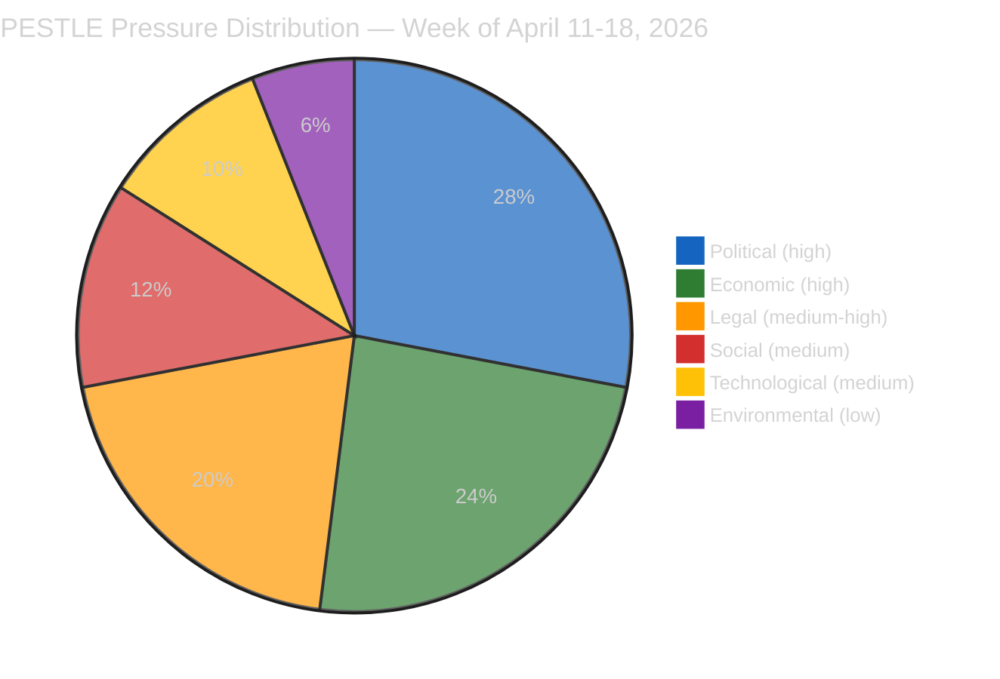

# 🌍 PESTLE Macro-Environmental Scan — Week of April 11–18, 2026 (Run 12)

> **Purpose**: Systematic macro-environmental scan across the six PESTLE dimensions as
> applied specifically to the EP10 Q1-close retrospective and the April 14–26 Easter
> recess forward window. This scan *deepens* the SWOT in `deep-analysis.md` by surfacing
> structural forces not captured in the legislative-achievements inventory. PESTLE
> findings feed directly into `scenario-forecast.md` and `threat-model.md`.

---

## Summary Heat Map

| Dimension | Pressure Level | Dominant Driver | Direction | Confidence |
|-----------|:--------------:|-----------------|:---------:|:----------:|
| Political | 🔴 HIGH | Pre-recess EPP-S&D-Renew discipline holding despite 5 contested files | Stable-tense | 🟡 Medium |
| Economic | 🔴 HIGH | German contraction (−0.50%/2024) vs Polish outperformance (2.9%/2024) divergence | Deteriorating (DE) / Stable (PL) | 🟢 High |
| Legal | 🟠 MEDIUM-HIGH | Article 83 TFEU precedent (Anti-Corruption) + pending ECJ Article 263 challenges | Activating | 🟡 Medium |
| Social | 🟡 MEDIUM | Housing salience rising; anti-corruption civic welcome | Rising | 🟡 Medium |
| Technological | 🟡 MEDIUM | AI Act threshold modification + EUCS cloud-sovereignty debate latent | Stable-unsettling | 🟡 Medium |
| Environmental | 🟢 LOW | Spring demand trough; Climate Law trajectory on track | Stable | 🟢 High |

---

## 🔴 P — Political

### P1. UPSTREAM_404 six-text opacity as political opportunity (HIGH pressure, novel)

The TA-10-2026-0099–0104 content gap is not merely a data-quality issue: it is a
*political-economy event*. Six adopted texts from a session around April 7–10 remain
opaque through Easter recess. Political groups that wish to manage narrative around
those texts have a 7–10 day window of reduced scrutiny. Evidence: the adopted-texts
feed confirms 159 items including TA-10-2026-0099–0104 (per `manifest.json`
§dataQuality), while the individual-text endpoint returns UPSTREAM_404. Observable
proxies during recess: national-press language about "a quiet April session" in DE,
FR, IT outlets; political-group press releases referring to specific items without
TA-numbers; early leaks from rapporteurs to specialist press (Euractiv, Politico
Europe).

**Intelligence implication**: Article 28 plenary's opening hour may surface an
already-adopted-but-unknown text as political ammunition. Probability the six texts
are substantively political rather than routine-consent: 45% (🟡 Medium).

### P2. EP10 Year-2 coalition discipline peak (HIGH pressure, stable)

The EPP-S&D-Renew core produced 104 adopted texts in Q1 2026 (vs EP8's 62 in Q1 2016
and EP9's 48 in Q1 2021 — see `historical-baseline.md` §Legislative Output). Sustaining
this tempo post-recess requires continued Weber–García Pérez (EPP President + S&D
leader) coordination. Observable proxies: EPP.eu and socialistsanddemocrats.eu press
releases during April 21–27; social-media cadence of group coordinators; appearance
of joint EPP-S&D tribune pieces in Le Monde, FAZ, La Stampa.

### P3. Pre-recess EPP-S&D divergence on housing (MEDIUM-HIGH pressure, rising)

TA-10-2026-0091 (Housing Initiative) is the first Q1 file on which the EPP grand-coalition
partner publicly signalled reluctance. S&D secured adoption but Commission-response
adequacy (due April 21–26) will determine whether the dossier consolidates the grand
coalition or fractures it. See `stakeholder-map.md` §12 and `scenario-forecast.md`
§Scenario B.

### P4. Polish delegation on Anti-Corruption Directive (MEDIUM pressure)

TA-10-2026-0094's Article 83 TFEU criminal-law-competence activation creates acute
Polish political resonance. Tusk's KO-led government sees early transposition as
domestic-political utility vs PiS/ECR framing it as EU overreach. Delegation-level
split likely to surface at April 28 plenary's anti-corruption follow-up debate.

### P5. US political calendar constraint (MEDIUM pressure)

The USTR operates on a fiscal-year filing cadence. The April 22–26 window sits before
a May 3 US statutory notification deadline for Section 301 tariff categories
constraining US flexibility to delay a filing. EU counter-posture must be ready by
April 24 irrespective of EP recess status.

---

## 🔴 E — Economic

### E1. German contraction persistence (HIGH pressure, deteriorating)

Germany recorded GDP growth of −0.87% in 2023 and −0.50% in 2024 (World Bank NY.GDP.MKTP.KD.ZG
via `manifest.json` §worldBankDE). Two consecutive annual contractions are the
longest German recession since 2002–2003. The automotive sector (BMW, Mercedes, VW,
~4% of German GDP) is directly exposed to the US tariff regime that went T+0 April
14. This macro backdrop creates structural incentive for German federal politicians
to resist BRRD3 bail-in intensification — the political-economic coupling captured
in `threat-model.md` §T1. See `economic-context.md` §Germany for full profile.

### E2. Italian positive quarter + cooperative-banking exposure (MEDIUM-HIGH pressure)

Italy recorded 0.69% GDP growth in 2024 (World Bank). The growth is modest but
positive — a Meloni-government political asset. However, Italian
Banche-Popolari/BCC cooperative sector carries BRRD3 transposition sensitivity
similar to German Sparkassen albeit at ~25% retail share vs German ~40%. Secondary
transposition-delay risk.

### E3. Divergent EU economic geography (HIGH pressure, structural)

The DE-PL divergence (−0.50% vs 2.9% 2024 GDP growth) is the widest intra-EU-North
spread of the post-pandemic period. Economic divergence is the structural driver
behind political-group fragmentation documented in `historical-baseline.md`
§Coalition Dynamics — member states with weak growth resist implementation-cost-
heavy directives, while strong-growth states push for tempo.

### E4. Trade-defence economic signalling (MEDIUM-HIGH pressure)

TA-10-2026-0096 pre-authorises €9.6bn countermeasures. Market participants price
activation-probability daily via DAX / CAC40 / FTSE-MIB volatility and BTP-Bund
spread. See `economic-context.md` §Indicator Watch.

### E5. ECB-US Fed divergence risk (MEDIUM pressure)

ECB Governing Council met April 17 (last pre-plenary). Divergent tariff-induced
inflation dynamics in US vs EU create a potential policy-coordination gap that
could amplify exchange-rate volatility during the recess window.

---

## 🟠 L — Legal

### L1. Article 83 TFEU criminal-law-competence activation (HIGH structural-novelty)

TA-10-2026-0094 (Anti-Corruption Directive) is EP10's first sustained use of Article
83 TFEU to harmonise criminal sanctions across all 27 member states. This creates a
**precedent-competence signal**: if the Commission pursues further Article 83
initiatives (environmental crime, corporate criminality, gender-based violence)
Parliament has now demonstrated a willingness to legislate at this level. Constitutional
challenge risk exists in member states with strong criminal-law sovereignty traditions
(Germany, Denmark, Poland — see `threat-model.md` §T4). 🟡 Medium confidence on
challenge probability.

### L2. BRRD3/DGSD2/SRMR3 transposition deadlines (HIGH implementation pressure)

The Banking Union trilogy carries 18-month transposition deadlines running approximately
to September 2027. National transposition-law drafting in member-state finance
ministries begins during this recess — the political-economic coupling (E1 + P3)
is strongest in Germany.

### L3. Pending ECJ Article 263 windows (MEDIUM-HIGH pressure)

Multiple Q1 2026 adopted texts create Article 263 TFEU 2-month annulment windows. The
Digital Omnibus (TA-10-2026-0098) is the most prominent civil-society-challenge
target; TA-10-2026-0094 (Anti-Corruption) is the most prominent member-state-challenge
target. Expect filings May–June 2026.

### L4. TA-10-2026-0099–0104 legal-status unknown (procedural pressure)

Six texts with unknown subject-matter may carry legal consequences Parliament and
observers cannot assess during recess. This ambiguity itself creates institutional-
transparency risk.

---

## 🟡 T — Technological

### T1. EP API Tier-2/3 degradation during recess (MEDIUM pressure, self-resolving)

Easter API maintenance cycle affects Tier-2 (events_feed, procedures_feed) and Tier-3
(individual adopted-text content endpoints) from approximately April 14 to April
25–27. Tier-1 (meps_feed, adopted_texts_feed) continues operating. This is the
direct cause of the TA-10-2026-0099–0104 opacity (P1) and must be stated as a
data-quality caveat in any article passage quoting Q1 statistics. See `manifest.json`
§dataQuality.

### T2. AI Act threshold enforcement readiness (MEDIUM pressure)

TA-10-2026-0098 Digital Omnibus AI high-risk threshold modification requires
member-state supervisory authorities (AI Office, national DPAs) to recalibrate
enforcement templates. A 2–4 month capacity-building gap creates enforcement
unpredictability.

### T3. Cloud-sovereignty / EUCS background (LOW-MEDIUM pressure)

ITRE/ECON committee activity on EUCS continues at staff level; no plenary agenda
item imminent. Long-running dossier.

---

## 🟡 S — Social

### S1. Housing affordability political salience (MEDIUM-HIGH pressure, rising)

Housing costs remain top-3 voter concern in Eurobarometer winter 2025–26. TA-10-2026-0091
adoption and the April 21–26 Commission-response deadline make housing the week's
most publicly visible EP-Commission interaction. Civil-society (Housing Europe,
EAPN, national tenant unions) mobilisation plans ready for post-response media
cycle.

### S2. Anti-corruption civic welcome (MEDIUM pressure)

TA-10-2026-0094 generated broad civil-society welcome (Transparency International
EU, Civil Liberties Union) but limited street-mobilisation energy. Expect NGO
submissions to national transposition consultations.

### S3. EU Talent Pool / legal-migration framing (MEDIUM pressure)

TA-10-2026-0095 (EU Talent Pool) enters a sensitive political environment. National
right-wing parties (PfE, ESN, parts of ECR) have already indicated framing as
"migration-liberalisation by stealth." S&D and Renew framing as "skills-matching
for labour-market functioning." Public-opinion cross-pressure.

### S4. Civil-society digital rights mobilisation (MEDIUM pressure)

EDRi / Access Now / noyb / La Quadrature du Net coordinating comms cycles for
Article 263 challenge filings. Media amplification (FAZ, Le Monde, De Volkskrant)
building since April 10.

---

## 🟢 En — Environmental

### En1. Spring energy-demand trough (LOW pressure)

April is the European shoulder season between winter heating and summer cooling.
Gas-storage at historically high levels after mild 2025-26 winter. No energy-crisis
agenda pressure for April 28–30.

### En2. Climate Law -55% GHG trajectory on track (LOW pressure)

Latest EEA March 2026 report confirms 2030 compliance trajectory. No imminent
Commission enforcement action.

### En3. Critical-minerals permitting latent (LOW pressure)

Long-running dossier; not April 28 material.

---

## Cross-Dimensional Coupling Analysis

These couplings are where scenario risk concentrates and directly feed
`scenario-forecast.md`:

| # | Coupling | Mechanism | Amplification |
|---|----------|-----------|:-------------:|
| C1 | **E1 + E2 + P3** | DE contraction + IT cooperative-bank sensitivity + EPP political constraint → BRRD3 transposition friction in two largest Eurozone economies | 🔴 Strong |
| C2 | **P3 + S1 + L2** | EPP-S&D divergence + housing salience + legislative-implementation deadlines → Commission under multi-front pressure during recess | 🔴 Strong |
| C3 | **P5 + E4** | US statutory filing deadline + pre-authorised EU countermeasure → forced binary decision by April 24 | 🟠 Moderate |
| C4 | **L1 + P4** | Article 83 TFEU precedent + Polish PiS-KO political divergence → constitutional-challenge probability | 🟠 Moderate |
| C5 | **L3 + S4 + T2** | Article 263 windows + civil-society mobilisation + AI enforcement gap → EP political vulnerability on digital dossier | 🟠 Moderate |
| C6 | **T1 + P1** | EP API opacity + six-text unknown content → narrative-management opportunity for political groups | 🟡 Light |

The C1 + C2 pair is the scenario most capable of reshaping the April 28 plenary
agenda from its planned substance toward emergency-coalition-management mode. See
`threat-model.md` §T1 and `stakeholder-map.md` §7 (Sparkassen Association) for the
adversary-capability mapping.

---

## Intelligence Implications

1. **Recess is not politically dormant.** Four live processes run in parallel during
   April 14–26: Commission housing-response drafting, member-state BRRD3
   transposition-analysis, USTR Section 301 calendar, EP political-group
   pre-plenary coordination. Article prose should frame the recess as "strategic
   theatre," not silence.
2. **Q1 retrospective and Q2 forecast must be coupled.** The record Q1 output
   (`deep-analysis.md` §Strength 1; `historical-baseline.md` §Legislative Output) is
   the *political capital* available to EP10 leadership to absorb Q2 stresses.
   Treating Q1 as concluded and Q2 as separate is an analytical error.
3. **Economic geography is the silent coalition-shaper.** The DE-PL growth
   divergence (E3) explains more variance in member-state transposition appetite than
   party-political positioning does. `economic-context.md` §Coupling Matrix makes
   this explicit.
4. **Article 83 TFEU precedent is the week's most underweighted story.** Legal
   commentary on TA-10-2026-0094 has focused on substantive anti-corruption content;
   L1's precedent-competence consequence is more consequential for EP10's second
   half.
5. **Environmental dimension provides political bandwidth.** Low environmental
   pressure (unlike spring 2022–23 energy crisis or 2024 farmer protests) gives EP10
   the rhetorical space to concentrate on the complex trade + banking + housing
   triangle at April 28–30.

---

*Framework: PESTLE Macro-Environmental Scan per `analysis/methodologies/political-threat-framework.md`*
*Cross-references: `scenario-forecast.md` (scenario axes derived from C1, C2, C3); `threat-model.md` (T1 derived from C1); `stakeholder-map.md` (position matrix derived from P-dimension analyses)*
*Next review: Run 13 (post-April-27) — re-scan after Commission housing response and USTR week resolve C2 and C3*
*Analysis generated: April 18, 2026 | Run 12 | Week-in-review workflow | Reference-quality retrofit*
