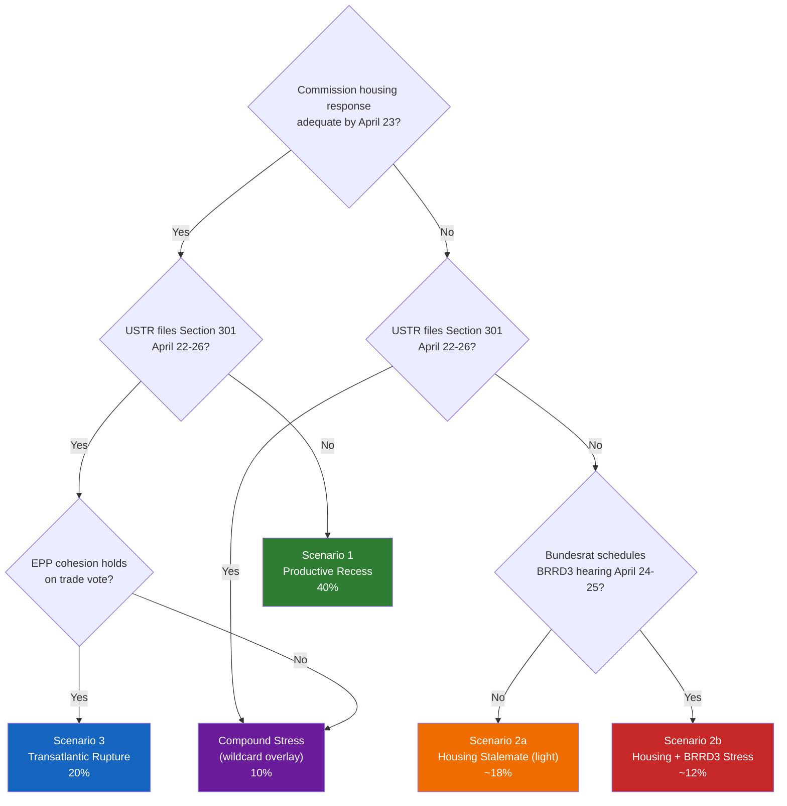

# 🎲 Scenario Forecast — Post-Recess Political Landscape (Run 12)


> **Purpose**: Structured multi-scenario forecast covering the April 21–May 15 window:
> Commission housing response (due April 21–26), USTR Section 301 decision (April
> 22–26), Bundesrat BRRD3 agenda publication (April 24–25), and April 28–30
> Strasbourg plenary. Scenarios are defined by the two most uncertain and
> consequential variables identified in `pestle-analysis.md` §Cross-Dimensional
> Coupling. Each scenario carries a probability band, early-warning indicators, and
> falsifying conditions.

---

## Scenario Axis Selection

From the PESTLE cross-dimensional coupling analysis (`pestle-analysis.md` §C1, C2, C3),
the two axes with the highest combination of uncertainty and impact are:

- **X-axis — Commission Housing-Response Adequacy**: ADEQUATE (explicit Q4 2026
  legislative commitment) ⟷ INADEQUATE (consultation-preferred, no binding
  timeline). Probability of adequacy: ~45%.
- **Y-axis — Transatlantic Trade Posture**: DE-ESCALATION (no USTR Section 301 filing
  before April 26) ⟷ ESCALATION (filing appears in April 22–26 window).
  Probability of de-escalation: ~75–80%.

The Bundesrat BRRD3 hearing variable (probability ~30% per `threat-model.md` §T1)
is treated as a modifier to each scenario rather than a third axis — keeping the
scenario space cognitively tractable while preserving the banking-dimension
sensitivity.

```mermaid
quadrantChart
    title 2×2 Scenario Space — April 21 to May 15, 2026
    x-axis Housing Response Adequate --> Housing Response Inadequate
    y-axis Trade Escalation --> Trade De-escalation
    quadrant-1 Scenario 1 - Productive Recess
    quadrant-2 Scenario 2 - Housing Stalemate
    quadrant-3 Scenario 3 - Transatlantic Rupture
    quadrant-4 Compound Stress (wildcard)
    Scenario 1 Productive Recess: [0.25, 0.80]
    Scenario 2 Housing Stalemate: [0.75, 0.75]
    Scenario 3 Transatlantic Rupture: [0.35, 0.25]
    Compound Stress: [0.80, 0.20]
```

| Scenario | Housing | Trade | Probability | Dominant Impact |
|----------|---------|-------|:-----------:|-----------------|
| **1. Productive Recess** | Adequate | De-escalation | 40% | April 28–30 runs planned agenda; Banking Union transposition monitoring opens cleanly |
| **2. Housing Stalemate** | **Inadequate** | De-escalation | 30% | S&D Rule 144 activation dominates April 28; EPP-S&D visible tension on housing |
| **3. Transatlantic Rupture** | Adequate | **Escalation** | 20% | Emergency trade debate displaces planned agenda; countermeasure-activation vote |
| *Compound Stress (wildcard)* | Inadequate | Escalation | 10% | See `wildcards-blackswans.md` §W1 — worst-case; multi-front agenda compression |

> Probabilities sum to 100%. Confidence: 🟡 Medium. Probabilities reflect the 7-run
> recess observation series (Runs 179–184 + this review) and are calibrated to
> expected Tier-3 API restoration on April 25–27 which will surface confirming or
> falsifying evidence.

---

## Scenario 1 — Productive Recess (40%)

### Driving forces

Commission DG EMPL's housing response drafting converges on a Q4 2026 binding
legislative commitment (per S&D informal expectations communicated at March 26
post-adoption meetings). USTR calendar pressure eases: US Chamber of Commerce
lobbying against immediate Section 301 filing succeeds, filing deferred to May.
German Bundesrat April 24–25 session agenda omits European banking item — Merz
coalition prioritises US-relationship preservation over Sparkassen domestic
politics during active trade-tension window.

### Narrative

The recess plays out as strategic consolidation, not political drama. Commission
publishes housing response April 23 with substantive legislative commitment.
Bundesrat agenda clean. Tier-3 EP API restores April 25; TA-10-2026-0099–0104
content becomes available and proves to be primarily routine-consent items
(international-agreement ratifications and delegated-act confirmations — see
`pestle-analysis.md` §P1 45% probability estimate). April 28 plenary opens with
routine legislative business, Banking Union Phase-2 monitoring debate, EU Talent
Pool implementation-readiness debate, and measured trade statements from Commission.

### Early-warning confirming indicators (watch April 21–25)

- [ ] **April 21**: Commission press-release on housing response with explicit Q4
      2026 legislative commitment language
- [ ] **April 21–23**: No USTR Federal Register filing
- [ ] **April 24**: Bundesrat publishes April 24–25 agenda without European banking
      item
- [ ] **April 25**: EP API Tier-3 restoration — TA-10-2026-0099 content accessible
- [ ] **April 26**: S&D group-coordinator public messaging acknowledges "responsible
      Commission engagement"
- [ ] **April 27**: EPP and S&D joint tribune piece or coordinated press

### Falsifying indicators

- ❌ Commission response without binding timeline → Scenario 2
- ❌ USTR Federal Register filing → Scenario 3 or Compound
- ❌ Bundesrat banking-item added → Scenario 2 (BRRD3 modifier)

### April 28 plenary outcomes

Routine legislative business. Commission representatives welcomed normally.
Banking Union Phase-2 review passes. Trade countermeasure debate is monitoring-
only, no activation. Media framing: "EP10 returns to record-breaking rhythm."

### Implications for EP post-recess agenda

Confirms 6-run recess series "productive consolidation" baseline. Run 13 (post-
plenary week-in-review) produces a standard retrospective article with full TA-10-2026-
0099–0104 content coverage. Risk-matrix composite score reduces to ~12/50.

---

## Scenario 2 — Housing Stalemate (30%)

### Driving forces

Commission DG EMPL, split with DG REGIO and DG FISMA on housing policy ownership,
produces a consultation-heavy response without Q4 2026 legislative commitment. S&D
leadership assesses the response as inadequate; Rule 144 priority-written-questions
mechanism activates April 26. Bundesrat April 24–25 agenda includes European
banking item (Sparkassen lobbying succeeds). German CDU/CSU signalling on BRRD3
transposition flexibility becomes observable.

### Narrative

The recess is politically difficult for the Commission. Housing civil-society
coalition (Housing Europe, EAPN — see `stakeholder-map.md` §19) launches coordinated
14-language media campaign April 23–25. S&D and Greens/EFA coordinate Rule 144
signatures. Bundesrat hearing signals BRRD3 transposition-delay risk. April 28
plenary opens with hostile S&D + Greens/EFA reception of Commission representatives
on housing, followed by visibly strained EPP-S&D atmosphere on Banking Union
implementation debate.

### Early-warning confirming indicators (watch April 21–26)

- [ ] Commission housing response published without Q4 2026 legislative commitment
- [ ] S&D group-coordinator social-media activity spikes April 22–24
- [ ] Bundesrat April 24–25 agenda includes European banking item
- [ ] German CDU MEP signals on Twitter/X soften on BRRD3 timeline
- [ ] EPP internal divergence observable in committee coordinator statements
- [ ] Housing-coalition simultaneous press events in 5+ member states April 24–25

### Falsifying indicators

- ❌ USTR files Section 301 → upgrades to Compound
- ❌ Commission publishes legislative-proposal alongside housing response → Scenario 1
- ❌ EPP unified-group statement of discipline → partial de-escalation

### April 28 plenary outcomes

Housing confrontation consumes first 90 minutes of plenary. S&D + Greens/EFA
coordinated Rule 144 vote attracts >280 MEPs. Banking Union implementation debate
reveals EPP internal disagreement on BRRD3 timing; procedural resolution deferred.
Media framing: "Parliament returns with coalition cracks visible on housing."

### Implications for EP post-recess agenda

Confirms EPP coalition stress hypothesis from `deep-analysis.md` §Weakness 4.
Elevates BRRD3 transposition risk (`threat-model.md` §T1) from medium-high to high.
Post-plenary Run 14 would track whether stress escalates or resolves back to Scenario
1 baseline.

---

## Scenario 3 — Transatlantic Rupture (20%)

### Driving forces

USTR files Section 301 petition April 22–24 targeting EU Digital Services Act and
Digital Markets Act enforcement. Commission triggers 72-hour countermeasure-
activation framework. Commission housing response arrives adequate (45% probability
× conditional), removing housing as secondary stress vector. EPP whip-coordinator
holds group firm behind trade-countermeasure activation vote; Renew delegation
coheres after Élysée signal.

### Narrative

The recess is politically intense on trade, quiet on banking and housing. Von der
Leyen makes statement within 24h of USTR filing framing activation as measured,
proportionate, and preserving dialogue-channels. Member-state COREPER II convenes
April 24. April 28 plenary opens with emergency trade debate: Commission + Council
statement + political-group statements + rapid Rule 144 procedural votes on
countermeasure authorisation activation. Banking Union Phase-2 review item
deferred to May plenary; housing item proceeds on routine business.

### Early-warning confirming indicators (watch April 21–24)

- [ ] USTR Federal Register filing appears April 22–24
- [ ] Von der Leyen cabinet issues statement within 24h of filing
- [ ] Member-state COREPER II schedules emergency meeting
- [ ] EPP coordinators' public language hardens (Weber / Berger statements)
- [ ] Renew French delegation coordinates publicly with S&D French delegation
- [ ] DAX drops 1–2% on filing day; CAC40 similar; BTP-Bund spread widens 5–10bp

### Falsifying indicators

- ❌ EPP public divisions between German and Southern European delegations →
      Compound Stress
- ❌ Renew internal split along France-Netherlands axis → Compound Stress
- ❌ Council fails to produce majority for activation → deferred to May plenary

### April 28 plenary outcomes

Emergency trade debate displaces first 2–3 hours of planned agenda.
Countermeasure activation vote passes with EPP + S&D + Renew majority (target:
≥400 votes in favour); conditional on coalition integrity. Media framing:
"Assertive European Parliament defends digital sovereignty."

### Implications for EP post-recess agenda

Confirms "stable coalition under external pressure" hypothesis from EP9
COVID-response precedent (`historical-baseline.md` §EP9). Upgrades EP10 credibility
score on trade-policy execution. Housing and banking dossiers recede temporarily
from media attention. Post-plenary Runs 14–15 pivot to EU-US negotiation trajectory
tracking.

---

## Decision Tree (Integrated)



The Bundesrat BRRD3 modifier within Scenario 2 produces sub-scenarios 2a (housing-
only) and 2b (housing + banking), the latter being the more consequential and
closer to Compound-Stress territory.

---

## Indicator Watchlist Per Scenario

| Window | Priority Observable | Distinguishes Between |
|--------|--------------------|-----------------------|
| **April 21 (Mon)** | Commission press-page housing release | Scenario 1 vs 2 |
| **April 21–23** | USTR.gov front page + Federal Register | Scenario 1/2 vs 3/Compound |
| **April 22–24** | Housing-coalition coordinated media | Confirms inadequate response (Scenario 2) |
| **April 23–25** | Bundesrat.de weekly agenda | Scenario 1/3 vs 2b |
| **April 24–25** | EUR/USD + DAX daily close | Market signal on trade/rupture |
| **April 25–27** | EP API Tier-3 restoration + TA-10-2026-0099–0104 content | Low-impact scenario modifier |
| **April 26–27** | EPP.eu and Weber social-media cadence | EPP cohesion on all axes |
| **April 27 (Sun)** | EP plenary agenda finalisation | Final scenario selection |
| **April 28 opening** | First hour of plenary + agenda-order choice | Real-time confirmation |

---

## Monitoring Priorities by Confidence Level

- **🟢 HIGH-confidence observables**: Commission press page, USTR Federal Register,
  Bundesrat.de — these are reliably published per formal institutional calendars and
  are reliable scenario-discriminators.
- **🟡 MEDIUM-confidence observables**: Political-group social-media cadence, MEP
  individual messaging — useful directional signals but noise-prone.
- **🔴 LOW-confidence observables**: Leaked content from closed meetings, opinion-
  column interpretation — treat as supporting evidence only.

---

## Aggregate Assessment

- **Central estimate**: Scenario 1 (Productive Recess) remains modal at 40%, but
  Scenario 2 (Housing Stalemate) probability of 30% reflects the genuine
  multi-commissioner coordination difficulty on the housing file observed through
  the 6-run recess series.
- **Tail-risk concentration**: Scenario 3 (Transatlantic Rupture) at 20% is
  disproportionately consequential — its impact on media framing and April 28
  agenda-ordering dwarfs all other variables. See `wildcards-blackswans.md` §W2.
- **Compound-stress absorption**: The residual 10% Compound Stress probability
  represents the wildcard overlay where two primary scenarios fire simultaneously;
  per `wildcards-blackswans.md` framework, this is the natural "home" for most
  simultaneous-trigger adverse events.
- **Key intelligence gaps**: (a) Commission DG EMPL internal drafting signals — no
  reliable observable during recess; (b) EPP internal positioning (MCP `memberCount=0`
  gap); (c) USTR calendar discipline — low-visibility.

---

## Scenario Robustness Check

Each scenario above assumes the Q1 legislative achievements (Banking Union trilogy,
Anti-Corruption, Talent Pool) hold procedurally unchallenged during recess. If any
of these is subject to unexpected legal intervention (see `wildcards-blackswans.md`
§W3 CJEU preliminary injunction), Scenarios 1–3 require re-baseline recalculation.
Probability of such legal intervention during April 21–26 window: ~8%.

---

*Framework: Shell-style scenario planning per `analysis/methodologies/political-threat-framework.md` §Framework 5*
*Cross-references: `pestle-analysis.md` §Cross-Dimensional Coupling (axis derivation); `threat-model.md` (T1, T3 threats aligned to Scenarios 2, 3); `wildcards-blackswans.md` (Compound-Stress overlay)*
*Next review: Run 13 (post-plenary, May 1–2) — revise probabilities with observed trigger evidence from April 21–28*
*Analysis generated: April 18, 2026 | Run 12 | Week-in-review workflow | Reference-quality retrofit*
