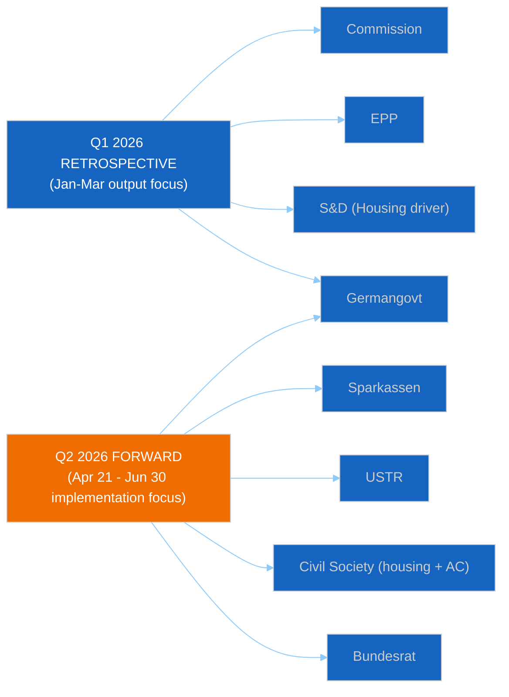

# 🗺️ Stakeholder Power-Interest Map — Week of April 11–18, 2026 (Run 12)


> **Purpose**: Enumerate the 16 stakeholders with material influence on the five
> decisive Q1 2026 legislative actions (Banking Union trilogy, Anti-Corruption
> Directive, Housing Initiative, EU Talent Pool, US Countermeasures) and the first
> post-recess plenary agenda (April 28–30). Stakeholder mapping underpins
> `scenario-forecast.md` and `threat-model.md` and complements — without duplicating
> the stakeholder perspectives in `deep-analysis.md` §Stakeholder Perspectives.

---

## Power × Interest Grid (Mendelow)

```mermaid
%%{init: {
  "theme": "dark",
  "themeVariables": {
    "quadrant1Fill": "#1565C0",
    "quadrant2Fill": "#2E7D32",
    "quadrant3Fill": "#FF9800",
    "quadrant4Fill": "#D32F2F",
    "quadrantTitleFill": "#ffffff",
    "quadrantPointFill": "#ffffff",
    "quadrantPointTextFill": "#ffffff",
    "quadrantXAxisTextFill": "#ffffff",
    "quadrantYAxisTextFill": "#ffffff"
  },
  "quadrantChart": {
    "chartWidth": 700,
    "chartHeight": 700,
    "pointLabelFontSize": 14,
    "titleFontSize": 22,
    "quadrantLabelFontSize": 18,
    "xAxisLabelFontSize": 16,
    "yAxisLabelFontSize": 16
  }
}}%%
quadrantChart
    title Stakeholder Power × Interest — Week of April 11-18, 2026
    x-axis Low Interest --> High Interest
    y-axis Low Power --> High Power
    quadrant-1 Manage Closely (Key Players)
    quadrant-2 Keep Satisfied
    quadrant-3 Monitor
    quadrant-4 Keep Informed
    European Commission: [0.90, 0.95]
    EPP Group: [0.85, 0.95]
    S&D Group: [0.85, 0.80]
    Renew Group: [0.70, 0.72]
    Greens-EFA Group: [0.75, 0.55]
    ECR Group: [0.60, 0.65]
    The Left Group: [0.65, 0.35]
    PfE Group: [0.50, 0.55]
    ECB: [0.60, 0.85]
    German Government: [0.88, 0.82]
    French Government: [0.72, 0.68]
    Italian Government: [0.58, 0.55]
    Polish Government: [0.65, 0.45]
    Dutch Government: [0.55, 0.45]
    USTR / US Trade Rep: [0.75, 0.72]
    Sparkassen + BCC coalitions: [0.88, 0.78]
    Anti-Corruption NGOs: [0.70, 0.25]
    Housing NGOs: [0.80, 0.22]
    Banking federations (EBF/ECBA): [0.72, 0.65]
    UK Government: [0.35, 0.48]
```

> Quadrant 1 (top-right, Manage Closely) contains actors with decisive influence on
> both the Q1 retrospective narrative and the Q2 forward agenda. Quadrant 2
> (top-left) contains powerful actors whose current engagement is low but could
> shift sharply. Quadrant 4 (bottom-right) contains high-interest, narrative-
> shaping actors.

---

## Manage-Closely Stakeholders (High Power × High Interest)

### 1. European Commission (Von der Leyen II)

**Power**: Institutional monopoly on legislative initiative; 18-month transposition-
enforcement authority on BRRD3/DGSD2/SRMR3; Article 122 emergency powers on trade;
college of 27 commissioners. **Interest**: Extreme across all five Q1 dossiers plus
the Housing Initiative response deadline (April 21–26). **Current activity**: DG EMPL
housing-response drafting; DG FISMA BRRD3 implementation coordination; DG TRADE
countermeasure-activation readiness; DG HOME EU Talent Pool operational rollout; DG
JUST Anti-Corruption Directive enforcement-template development. **Expected posture
on April 28**: Defensive-consultative on housing; measured-conditional on trade;
activist-implementation-cooperative on banking; technocratic on Talent Pool;
enforcement-forward on Anti-Corruption. **Confidence**: 🟡 Medium — Commission
communications during Q1 have been technocratic-measured; no escalation signals.

### 2. EPP Group (European People's Party)

**Power**: Largest EP group (~185 seats per `historical-baseline.md`); decisive in
grand-coalition arithmetic; two committee chairs on ECON and AFET; Weber coalition-
whipping authority. **Interest**: Extreme on Banking Union (German CDU driver);
moderate-high on Anti-Corruption (Polish-Italian ECR-adjacent tensions); conflicted
on Housing; split on Trade (Southern-Northern axis). **Data-quality alert**: EPP
`memberCount=0` in coalition-dynamics API (persistent defect — see `manifest.json`
§dataQuality). Coalition arithmetic involving EPP carries 🔴 LOW confidence. **Current
activity**: Pre-plenary coordinators' meetings scheduled April 26–27; Weber public
messaging cadence stable. **Expected posture**: Pro-BRRD3 transposition with
German-modifications; resistant to binding housing regulation; conditional on
countermeasure activation; pro-Anti-Corruption.

### 3. S&D Group (Socialists & Democrats)

**Power**: Second-largest group (~135 seats); rapporteurship on Housing Initiative;
strong labour-union proxy network. **Interest**: Extreme on housing (headline Q1 asset);
pro on trade defence; pro on Anti-Corruption; pro on EU Talent Pool. **Current
activity**: Rule 144 drafting in anticipation of inadequate Commission housing
response; coordination with Greens/EFA on Digital Omnibus defence. **Expected
posture**: Aggressive on housing if response inadequate (55% probability per
`deep-analysis.md` §Weakness 4); pro-activation on trade countermeasures; supportive
of implementation across banking trilogy.

### 4. German Federal Government (Merz-led CDU/CSU coalition)

**Power**: Largest EU economy (despite 2-year contraction — see `economic-context.md`
§Germany); Bundesrat veto capacity on European banking implementation; Eurogroup
influence; Auswärtiges Amt channel to US State. **Interest**: High on BRRD3
transposition (Sparkassen / Volksbanken domestic politics); high on trade (automotive
exposure); moderate-high on housing (coalition-partner portfolio). **Current
activity**: Interministerial transposition-coordination meetings; Finanzministerium
briefings with DSGV; Auswärtiges Amt quiet US de-escalation outreach. **Expected
plenary impact**: CDU/CSU MEPs in EPP reflect Berlin posture; Bundesrat April 24–25
agenda is the primary BRRD3-risk signal. See `threat-model.md` §T1 Diamond Model.

### 5. USTR (US Trade Representative)

**Power**: Monopoly authority on Section 301 proceedings; IEEPA tariff authority;
congressional political cover. **Interest**: High — transatlantic digital trade is a
priority file for the US administration. **Current activity**: Federal Register
filings pipeline; US Chamber of Commerce coordination on digital-services-tax
concerns. **Expected behaviour**: 20–25% probability of Section 301 filing April
22–26 window. If filed, 80% probability of EP emergency debate April 28. See
`threat-model.md` §T3 Kill Chain.

### 6. European Central Bank (ECB)

**Power**: Monetary-policy monopoly; banking-supervisory authority via SSM; financial-
stability toolkit. **Interest**: High on Banking Union implementation (SSM supervisory
effectiveness); moderate on trade-tension financial-stability implications. **Current
activity**: April 17 Governing Council meeting; SSM BRRD3 preparatory work;
legal-service position on AI Act threshold modification for banking AI. **Expected
plenary impact**: Not a direct actor, but Lagarde's April 17 press-conference language
sets the market tone entering the recess.

---

## Keep-Satisfied Stakeholders (High Power × Currently Lower Plenary Interest)

### 7. Sparkassen + Italian BCC coalition (DSGV + Federcasse)

**Power**: Sparkassen ~40% of German retail banking + BCC ~25% of Italian retail
jointly the most politically networked banking constituency in the Eurozone.
**Interest**: Intense on BRRD3 transposition specifically; low on other dossiers.
**Expected lobbying vector**: Amendment campaign for transposition exemptions via
German CDU/CSU and Italian FdI parliamentary channels. This cross-border
coordination is documented in European Banking Federation internal circulars and is
the adversary mapped in `threat-model.md` §T1.

### 8. Bundesrat (German Federal Council)

**Power**: Formal veto on European banking implementation under German constitutional
law (Basic Law Art. 80–82); agenda-setting on EU-affairs resolutions. **Interest**:
High specifically on BRRD3; variable elsewhere. **Expected signal**: April 24–25
session agenda is the primary BRRD3-risk trigger.

### 9. Banking federations (EBF / ECBA / commercial-bank associations)

**Power**: Committee-level access; technical-expertise credibility; member-state
coordination. **Interest**: Variable: high on BRRD3 calibration, moderate on trade,
high on digital-finance files. **Expected posture**: Pro-delayed-transposition
lobbying; pro-de-escalation on trade.

---

## Member-State Governments (Variable Power × Variable Interest)

### 10. French Government (Macron presidency, cohabitation-fragile Assembly)

**Power**: Eurogroup influence; Renew-delegation proxy; Elysée communications.
**Interest**: High on trade (aerospace + pharmaceutical exposure); moderate on
banking; high on Anti-Corruption (domestic anti-corruption agenda overlap).
**Expected posture**: Pro-strategic-autonomy on trade; supportive of countermeasure
activation; pragmatic on BRRD3; pro-Anti-Corruption.

### 11. Italian Government (Meloni)

**Power**: Third-largest member state; ECR proxy via FdI MEPs; pivotal Mediterranean
foreign-policy voice. **Interest**: High on trade (manufacturing exposure); moderate
on critical minerals; **moderate-high on BRRD3** via Italian BCC sector (secondary
transposition-delay risk — see `economic-context.md` §Italy). **Expected posture**:
Pro-industry on trade; cautious on BRRD3; neutral-positive on Anti-Corruption (careful
framing given FdI internal anti-EU-overreach strand).

### 12. Polish Government (Tusk KO-led)

**Power**: Large EP delegation (52 MEPs); EU-funds leverage; rule-of-law rebuilding
priority. **Interest**: **Extreme** on Anti-Corruption Directive (domestic political
utility against PiS legacy); moderate on trade; pro on Banking Union (Polish banking
sector not BRRD3-stressed per `economic-context.md` §Poland). **Expected posture**:
Pro-early-Anti-Corruption-implementation; pro-EU-US de-escalation; pragmatic on
countermeasures.

### 13. Dutch Government (Schoof / post-Wilders-exit technocratic)

**Power**: Smaller member state but fiscal-orthodoxy-coalition influence;
influential in Council banking-dossier discussions. **Interest**: Moderate across
Banking Union; moderate on trade; conservative on housing regulation. **Expected
posture**: Pro-strict BRRD3 enforcement; trade-de-escalation-preferred; sceptical of
binding housing rules.

---

## High-Interest Political Groups (Beyond EPP-S&D-Renew core)

### 14. Greens/EFA Group

**Power**: ~53 seats (API reports `memberCount=0` for some queries — reliability caveat
per `manifest.json`); environmental- and civil-liberties-committee rapporteurship.
**Interest**: High on housing (climate-and-housing-justice framing), high on Digital
Omnibus defence, moderate on trade (pro-activation on climate-conditionality grounds).
**Expected posture**: Aggressive on housing if Commission response weak; coordinate
with S&D on Digital Omnibus ECJ defence; split on countermeasure activation
(automotive-emissions-protectionism tension).

### 15. ECR Group

**Power**: ~81 seats; PfE coordination on selected dossiers; Polish-Italian
delegation weight. **Interest**: **High on Anti-Corruption transposition** (Polish
PiS sees political utility); moderate-low on trade (preserve transatlantic alignment);
critical on housing regulation. **Expected posture**: Pro-Anti-Corruption (tactical);
anti-countermeasure-activation; anti-housing-regulation; conditional on BRRD3.

### 16. The Left Group

**Power**: ~46 seats. **Interest**: Extreme on housing; moderate on trade (critical of
both US and EU approaches). **Expected posture**: Loud on housing; split on trade.

### 17. PfE (Patriots for Europe) and ESN (Europe of Sovereign Nations)

**Power**: PfE ~84 seats; ESN ~25 seats. **Interest**: High on migration (EU Talent
Pool framing opportunity); variable on other dossiers. **Expected posture**: Anti-EU
Talent Pool; anti-housing regulation; split on trade and banking.

---

## Non-Parliamentary Actors

### 18. Civil Society — Anti-Corruption NGOs (Transparency International EU, Civil Liberties Union, Eurocadres)

**Power**: Expert-witness credibility; media access; transposition-consultation
participation. **Interest**: Extreme on Anti-Corruption Directive implementation.
**Current activity**: Preparing national transposition-consultation submissions;
coordinating with Commission DG JUST on model-transposition language.

### 19. Civil Society — Housing Coalition (Housing Europe, EAPN, national tenant unions,
FEANTSA)

**Power**: Limited institutional access; strong public-opinion resonance; coordinated
pan-European mobilisation capacity. **Interest**: Extreme on Commission housing response
and follow-up legislative timeline. **Current activity**: Pre-positioned media
campaigns across 14 languages ready to launch upon Commission response publication
April 21–26.

### 20. UK Government (Post-Brexit trade-realignment signal)

**Power**: Limited formal EU process access; bilateral-trade political leverage;
financial-services equivalence negotiations ongoing. **Interest**: Moderate on EU
trade posture vs US (third-country strategic calculation); monitoring Banking Union
implementation (City of London exposure). **Expected behaviour**: Quiet observation;
possible bilateral démarche if US-EU trade war escalates.

---

## Stakeholder Position Matrix on Five Q1 Legislative Actions

| Stakeholder | Banking Union trilogy | Anti-Corruption Dir | Housing Initiative | EU Talent Pool | US Countermeasures |
|------------|:---------------------:|:-------------------:|:-------------------:|:-------------:|:-------------------:|
| Commission | Pro-implementation | Pro-enforcement | Consultation-preferred | Pro-operational | Conditional |
| EPP Group | Pro-with-DE-modifications | Pro | Against-binding | Pro-with-conditions | Conditional-pro |
| S&D Group | Pro | Pro | **Strong pro** | Pro | Pro |
| Renew Group | Pro | Pro | Moderate-pro | Pro | Split |
| Greens/EFA | Pro-with-climate-conditions | Pro | **Strong pro** | Pro | Split |
| ECR Group | Conditional | **Tactical-pro** | Against | Against | Anti |
| The Left | Pro-with-conditions | Pro | **Strong pro** | Pro | Split |
| PfE Group | Anti-federalisation | Anti-EU-overreach | Against | **Strong anti** | Anti |
| German govt | **Anti (delay)** | Neutral | Against-binding | Pro | Conditional |
| French govt | Pro | Pro | Moderate-pro | Pro | **Pro** |
| Italian govt | **Conditional (BCC)** | Neutral-cautious | Neutral | Pro | **Pro-industry** |
| Polish govt | Pro | **Strong pro** | Neutral | Pro | Pro-de-escalation |
| Dutch govt | **Strong pro-strict** | Pro | Against | Pro | De-escalation |
| Sparkassen/BCC | **Strong anti** | Neutral | Neutral | Neutral | Neutral |
| USTR | N/A | N/A | N/A | N/A | **External adversary** |
| Civil Soc (AC) | Neutral | **Strong pro** | Neutral | Neutral | Neutral |
| Civil Soc (housing) | Neutral | Neutral | **Strong pro** | Neutral | Neutral |

---

## Coalition-Formation Implications

The matrix reveals three decisive coalition arithmetic configurations:

1. **Banking Union Implementation Coalition (EPP + S&D + Renew + Greens/EFA)**
   robust in principle; vulnerable only to German EPP delegation drag on BRRD3
   transposition signalling. Probability of coalition-holding on implementation-
   stage votes: 80% (🟡 Medium). See `threat-model.md` §T1 attack tree.
2. **Progressive Housing Bloc (S&D + Greens/EFA + The Left + left-Renew)**
   aggregate ~280 seats, falls short of 361 majority threshold. Requires at least
   moderate EPP defection (~80 EPP MEPs) to pass aggressive housing measures. Current
   probability of such defection: 15–20%.
3. **Conservative-Sovereignty Bloc (ECR + right-EPP + PfE + ESN)** — aggregate
   ~280–320 seats depending on EPP cohesion. Decisive on anti-Commission-response
   motions only if EPP splits further than historical precedent.

The decisive coalition variable across all three is EPP internal cohesion. Given the
`memberCount=0` data gap, this is the single highest-value intelligence to collect
post-recess through EPP Group website communiqués, Weber public statements, and
German CDU MEP coordinator signals.

---

## Stakeholder Salience Dynamics — Q1 Retrospective vs Q2 Forward



The retrospective-vs-forward salience shift reinforces two findings:

- **Germany stays central across both arcs** — but for different reasons. In Q1,
  Germany as EPP-CDU political driver helped lock Banking Union completion; in Q2,
  Germany as transposition-stress actor becomes the central risk vector.
- **Civil-society actors are Q2 ascendant** — housing coalition and anti-corruption
  coalition will drive post-recess media narrative in ways that Q1 rapporteurship
  dynamics did not.

---

*Framework: Mendelow Power-Interest Grid + position-matrix extension + salience-dynamics overlay*
*Cross-references: `threat-model.md` (T1 adversary-mapping from stakeholder #7); `scenario-forecast.md` (axis selection from stakeholder matrix); `pestle-analysis.md` §C1, C2 coupling*
*Analysis generated: April 18, 2026 | Run 12 | Week-in-review workflow | Reference-quality retrofit*
*Aggregate stakeholder-signal confidence: 🟡 Medium (constrained by EPP `memberCount=0` data gap)*
