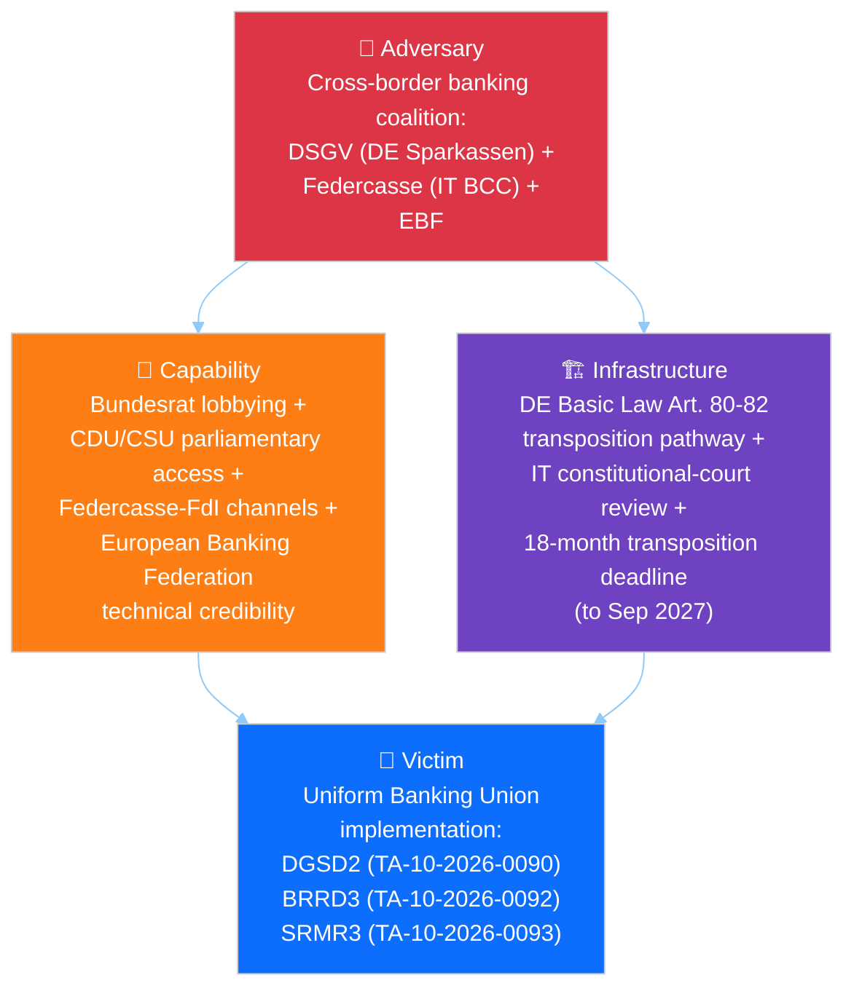
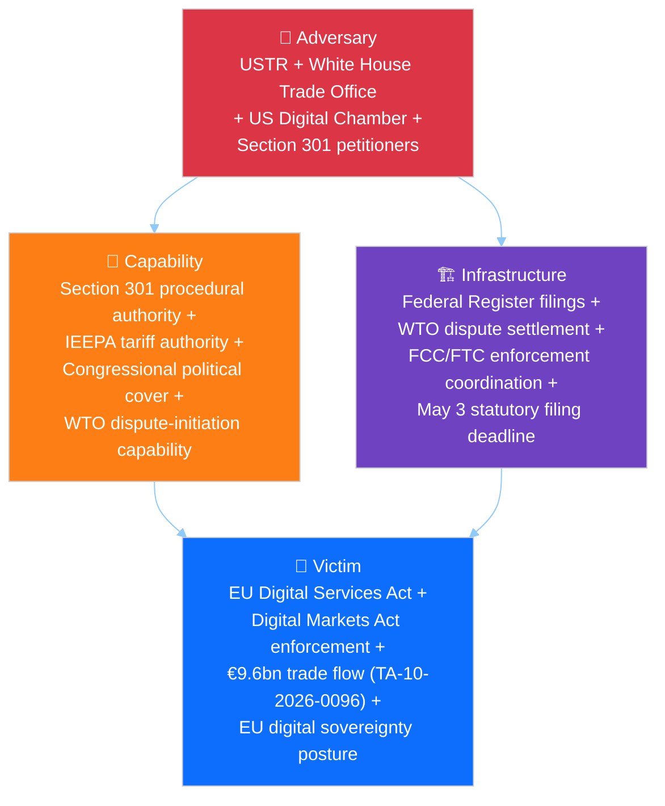
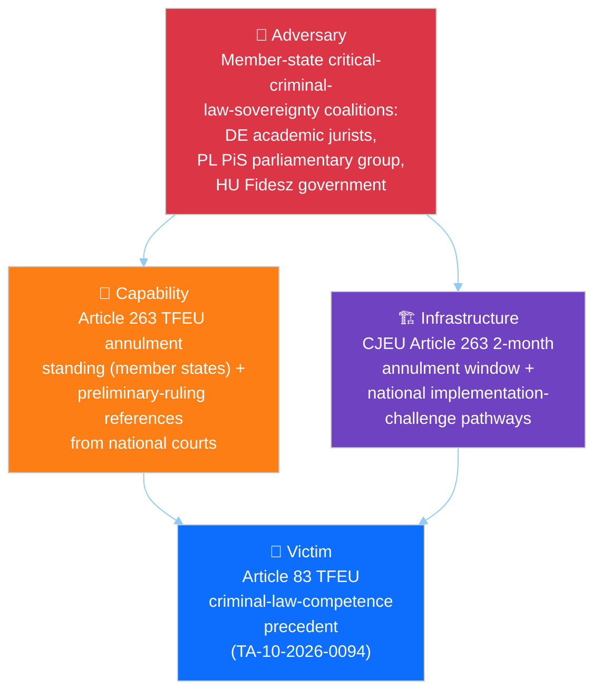
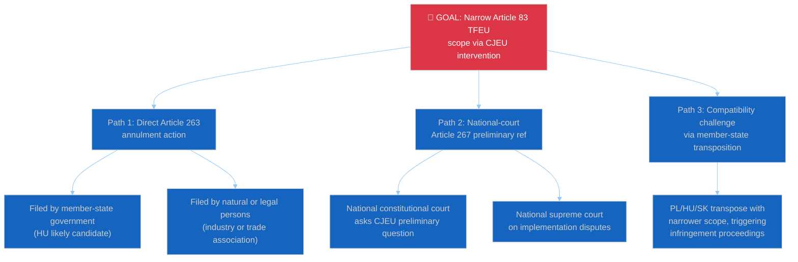
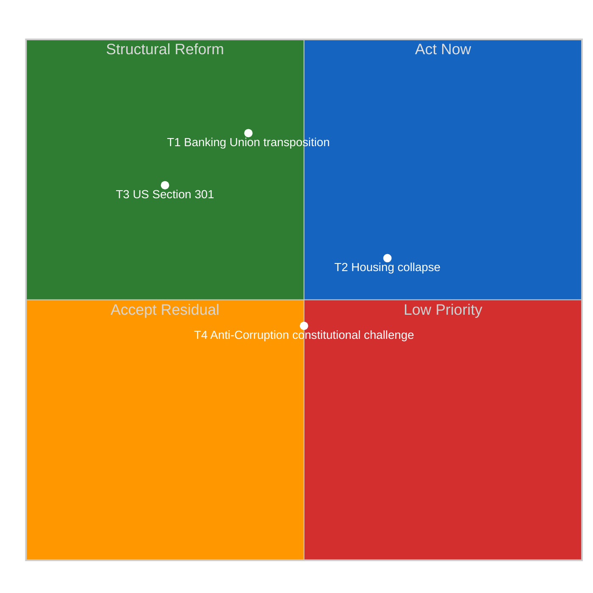

# 🎯 Threat Model — Post-Q1 EP10 Political Threats (Run 12)

> **Purpose**: Apply Diamond Model, Attack Tree, and Cyber Kill Chain frameworks from
> `analysis/methodologies/political-threat-framework.md` to four severity-4+ political
> threats identified in `deep-analysis.md` §Risk Matrix and `pestle-analysis.md`
> §Cross-Dimensional Coupling. Threat modelling complements risk scoring: risk tells
> you *what* may go wrong; threat modelling tells you *how* it can unfold and *where*
> to intervene.

---

## Threat Landscape Overview

| # | Threat | Severity | Primary Framework | Probability (90-day) |
|:-:|--------|:--------:|-------------------|:--------------------:|
| T1 | Banking Union transposition fragmentation (BRRD3 member-state delay) | 15/25 (HIGH) | Diamond Model + Attack Tree | 35% |
| T2 | Housing Initiative political collapse if Commission response inadequate | 12/25 (MEDIUM-HIGH) | Attack Tree + Kill Chain | 55% (triggering) / 30% (collapse) |
| T3 | US Section 301 retaliation escalation against EU digital regulations | 10/25 (MEDIUM-HIGH) | Diamond Model + Kill Chain | 20–25% (filing) |
| T4 | Anti-Corruption Directive constitutional challenge before CJEU | 8/25 (MEDIUM) | Attack Tree + Diamond Model | 15–20% (filing) |

---

## 💎 T1. Banking Union Transposition Fragmentation — Diamond Model + Attack Tree

### Diamond elements

| Element | Specification |
|---------|---------------|
| **Adversary** | Coalition of cooperative/regional banking associations: DSGV (German Sparkassen, ~40% retail banking share), Federcasse (Italian Banche di Credito Cooperativo, ~25% retail share), and coordinated European Banking Federation (EBF) technical-lobbying infrastructure. Historically effective at shaping national transposition of EU financial-services directives. Unified against BRRD3 bail-in-intensification provisions; divided on other Banking Union elements. |
| **Capability** | Access to CDU/CSU parliamentary group (Merz Berlin coalition); Federcasse political relationships with FdI parliamentary group; long-standing Finanzministerium and MEF (Rome) relationships; technical-expertise credibility in Bundesrat and Italian Senate committees; Handwerkskammern-plus-Confcommercio cross-border amplification. |
| **Infrastructure** | German Basic Law transposition pathway (Art. 80–82); Italian ex-post constitutional review via Corte Costituzionale; Bundesrat April 24–25 session; Italian Senate Finance Committee review calendar; federal-state coordination mechanisms in both countries; 18-month transposition deadline running approximately to September 2027. |
| **Victim** | Uniform implementation of Banking Union Phase-2 across Eurozone: DGSD2 (TA-10-2026-0090), BRRD3 (TA-10-2026-0092), SRMR3 (TA-10-2026-0093). Fragmented transposition creates regulatory-arbitrage risk, weakens SSM supervisory effectiveness, and undermines the 14-year Banking Union political project documented in `historical-baseline.md` §Structural Novelty. |

### Attack Tree

```mermaid
%%{init: {"theme":"dark","themeVariables":{"primaryColor":"#1565C0","primaryTextColor":"#ffffff","primaryBorderColor":"#0A3F7F","lineColor":"#90CAF9","secondaryColor":"#2E7D32","secondaryTextColor":"#ffffff","secondaryBorderColor":"#0F3F00","tertiaryColor":"#FF9800","tertiaryTextColor":"#000000","tertiaryBorderColor":"#7F4F00","mainBkg":"#1565C0","secondBkg":"#2E7D32","tertiaryBkg":"#FF9800","noteBkgColor":"#FFC107","noteTextColor":"#000000","noteBorderColor":"#7F6000","errorBkgColor":"#D32F2F","errorTextColor":"#ffffff","fontFamily":"Inter, Helvetica, Arial, sans-serif","pie1":"#1565C0","pie2":"#2E7D32","pie3":"#FF9800","pie4":"#D32F2F","pie5":"#FFC107","pie6":"#7B1FA2","pie7":"#9E9E9E","pie8":"#0288D1","pie9":"#388E3C","pie10":"#F57C00","pie11":"#C62828","pie12":"#FBC02D","pieTitleTextSize":"18px","pieSectionTextSize":"14px","pieLegendTextSize":"13px","pieStrokeColor":"#1e1e1e","pieOuterStrokeColor":"#1e1e1e","git0":"#1565C0","git1":"#2E7D32","git2":"#FF9800","git3":"#D32F2F","gitBranchLabel0":"#ffffff","gitBranchLabel1":"#ffffff","gitBranchLabel2":"#000000","gitBranchLabel3":"#ffffff","cScale0":"#1565C0","cScale1":"#2E7D32","cScale2":"#FF9800","cScale3":"#D32F2F","cScale4":"#FFC107","cScale5":"#7B1FA2","cScale6":"#9E9E9E","cScale7":"#0288D1","xyChart":{"backgroundColor":"#1e1e1e","plotColorPalette":"#1565C0,#2E7D32,#FF9800,#D32F2F,#FFC107,#7B1FA2,#9E9E9E"}}}}%%
graph TD
    Root["🔴 GOAL: Fragment Banking Union<br/>transposition across Eurozone"]

    Root --> A["Path A: Delay-by-procedure<br/>(DE Bundesrat)"]
    Root --> B["Path B: Delay-by-constitutional-review<br/>(IT Corte Costituzionale)"]
    Root --> C["Path C: Exemption-carving<br/>(national transposition law)"]

    A --> A1["Bundesrat Apr 24-25<br/>banking hearing agenda"]
    A --> A2["CDU/CSU Finanzausschuss<br/>position paper on modifications"]
    A --> A3["Handelsblatt leak of<br/>Finanzministerium flexibility"]

    B --> B1["Sparkassen-equivalent challenge<br/>filed in DE BVerfG"]
    B --> B2["Federcasse constitutional challenge<br/>filed in IT Corte Costituzionale"]

    C --> C1["Sparkassen exemption from<br/>MREL requirements in DE transposition"]
    C --> C2["BCC exemption from<br/>SRF contributions in IT transposition"]
    C --> C3["Softer bail-in trigger threshold<br/>in DE transposition law"]

    style Root fill:#dc3545,color:#fff
    style A fill:#fd7e14,color:#fff
    style B fill:#e91e63,color:#fff
    style C fill:#6f42c1,color:#fff
```

### Observable intervention points

| Point | Who can intervene | How |
|-------|-------------------|-----|
| Pre-Bundesrat (April 20–23) | Commission DG FISMA | Early-warning letter on transposition expectations; technical-assistance offer |
| Bundesrat April 24–25 | S&D German delegation | Shadow-hearing in Bundestag Europaausschuss |
| Post-hearing (April 26–27) | ECB SSM | Public statement on regulatory-arbitrage risks |
| April 28 plenary | Strong-pro-Banking-Union EPP MEPs (Weber) | Procedural statement on BRRD3 timeline expectations |
| May–June 2026 | Italian Council of State | Pre-transposition opinion on compatibility |

### Indicators of successful adversary execution

1. Bundesrat agenda item on European banking added by April 22
2. Finanzministerium briefing leaked to Handelsblatt suggesting transposition flexibility
3. CDU/CSU parliamentary-group position paper on BRRD3 modifications
4. German EPP MEP public expressions of "transposition realism"
5. Federcasse public statement post-March 26 on "implementation concerns"

### Indicators of failed execution (defensive success)

1. Bundesrat April 24–25 agenda omits European banking item
2. Finanzministerium public reaffirmation of transposition commitment
3. Merz cabinet coordination statement prioritising EU banking implementation
4. ECB SSM unambiguous public statement against exemption-carving

---

## 🌳 T2. Housing Initiative Political Collapse — Attack Tree + Kill Chain

### Attack Tree

```mermaid
%%{init: {"theme":"dark","themeVariables":{"primaryColor":"#1565C0","primaryTextColor":"#ffffff","primaryBorderColor":"#0A3F7F","lineColor":"#90CAF9","secondaryColor":"#2E7D32","secondaryTextColor":"#ffffff","secondaryBorderColor":"#0F3F00","tertiaryColor":"#FF9800","tertiaryTextColor":"#000000","tertiaryBorderColor":"#7F4F00","mainBkg":"#1565C0","secondBkg":"#2E7D32","tertiaryBkg":"#FF9800","noteBkgColor":"#FFC107","noteTextColor":"#000000","noteBorderColor":"#7F6000","errorBkgColor":"#D32F2F","errorTextColor":"#ffffff","fontFamily":"Inter, Helvetica, Arial, sans-serif","pie1":"#1565C0","pie2":"#2E7D32","pie3":"#FF9800","pie4":"#D32F2F","pie5":"#FFC107","pie6":"#7B1FA2","pie7":"#9E9E9E","pie8":"#0288D1","pie9":"#388E3C","pie10":"#F57C00","pie11":"#C62828","pie12":"#FBC02D","pieTitleTextSize":"18px","pieSectionTextSize":"14px","pieLegendTextSize":"13px","pieStrokeColor":"#1e1e1e","pieOuterStrokeColor":"#1e1e1e","git0":"#1565C0","git1":"#2E7D32","git2":"#FF9800","git3":"#D32F2F","gitBranchLabel0":"#ffffff","gitBranchLabel1":"#ffffff","gitBranchLabel2":"#000000","gitBranchLabel3":"#ffffff","cScale0":"#1565C0","cScale1":"#2E7D32","cScale2":"#FF9800","cScale3":"#D32F2F","cScale4":"#FFC107","cScale5":"#7B1FA2","cScale6":"#9E9E9E","cScale7":"#0288D1","xyChart":{"backgroundColor":"#1e1e1e","plotColorPalette":"#1565C0,#2E7D32,#FF9800,#D32F2F,#FFC107,#7B1FA2,#9E9E9E"}}}}%%
graph TD
    Root["🔴 GOAL: Collapse Housing Initiative<br/>(TA-10-2026-0091) political traction"]

    Root --> A["Path A: Weak Commission response"]
    Root --> B["Path B: EPP-S&D rupture<br/>on follow-up"]
    Root --> C["Path C: Coalition dilution"]

    A --> A1["DG EMPL consultation-only response"]
    A --> A2["No Q4 2026 legislative commitment"]
    A --> A3["Housing portfolio disowned<br/>across DG EMPL/REGIO/FISMA"]

    B --> B1["EPP rejects Rule 144 escalation"]
    B --> B2["S&D signals lost-confidence<br/>in Commission housing lead"]

    C --> C1["Renew Europe defects on<br/>housing binding-ness"]
    C --> C2["Greens/EFA withdraws from<br/>S&D coalition over tactic"]

    style Root fill:#dc3545,color:#fff
    style A fill:#fd7e14,color:#fff
    style B fill:#e91e63,color:#fff
    style C fill:#6f42c1,color:#fff
```

### Kill Chain — Political Progression

```mermaid
%%{init: {"theme":"dark","themeVariables":{"primaryColor":"#1565C0","primaryTextColor":"#ffffff","primaryBorderColor":"#0A3F7F","lineColor":"#90CAF9","secondaryColor":"#2E7D32","secondaryTextColor":"#ffffff","secondaryBorderColor":"#0F3F00","tertiaryColor":"#FF9800","tertiaryTextColor":"#000000","tertiaryBorderColor":"#7F4F00","mainBkg":"#1565C0","secondBkg":"#2E7D32","tertiaryBkg":"#FF9800","noteBkgColor":"#FFC107","noteTextColor":"#000000","noteBorderColor":"#7F6000","errorBkgColor":"#D32F2F","errorTextColor":"#ffffff","fontFamily":"Inter, Helvetica, Arial, sans-serif","pie1":"#1565C0","pie2":"#2E7D32","pie3":"#FF9800","pie4":"#D32F2F","pie5":"#FFC107","pie6":"#7B1FA2","pie7":"#9E9E9E","pie8":"#0288D1","pie9":"#388E3C","pie10":"#F57C00","pie11":"#C62828","pie12":"#FBC02D","pieTitleTextSize":"18px","pieSectionTextSize":"14px","pieLegendTextSize":"13px","pieStrokeColor":"#1e1e1e","pieOuterStrokeColor":"#1e1e1e","git0":"#1565C0","git1":"#2E7D32","git2":"#FF9800","git3":"#D32F2F","gitBranchLabel0":"#ffffff","gitBranchLabel1":"#ffffff","gitBranchLabel2":"#000000","gitBranchLabel3":"#ffffff","cScale0":"#1565C0","cScale1":"#2E7D32","cScale2":"#FF9800","cScale3":"#D32F2F","cScale4":"#FFC107","cScale5":"#7B1FA2","cScale6":"#9E9E9E","cScale7":"#0288D1","xyChart":{"backgroundColor":"#1e1e1e","plotColorPalette":"#1565C0,#2E7D32,#FF9800,#D32F2F,#FFC107,#7B1FA2,#9E9E9E"}}}}%%
graph LR
    R["1. Recce<br/>(Commission internal<br/>coordination assessment)"] --> W["2. Weaponisation<br/>(consultation-heavy<br/>response draft)"]
    W --> D["3. Delivery<br/>(Response publication<br/>April 21-26)"]
    D --> E["4. Exploitation<br/>(S&D-Greens Rule 144<br/>activation)"]
    E --> C["5. Installation<br/>(Rule 144 passes,<br/>Commission formally censured)"]
    C --> CC["6. C2<br/>(Extended political<br/>confrontation)"]
    CC --> A["7. Actions<br/>(Housing dossier loss<br/>of political momentum)"]

    style R fill:#95a5a6,color:#fff
    style W fill:#e67e22,color:#fff
    style D fill:#e74c3c,color:#fff
    style E fill:#c0392b,color:#fff
    style C fill:#922b21,color:#fff
    style CC fill:#6e2c00,color:#fff
    style A fill:#4e2a0e,color:#fff
```

### Current kill-chain position: Stage 2 (Weaponisation)

Commission DG EMPL is in active drafting. The adequacy question is not yet decided.
The probability of an inadequate response is assessed at 55% per `deep-analysis.md`
§Weakness 4. If inadequate, the kill-chain advances to Stage 3 (Delivery) upon
publication April 21–26.

### EU counter-kill-chain

Commission can prevent Stage 2–3 advancement by:
- DG EMPL securing explicit Commissioner-level commitment to Q4 2026 binding-proposal
  timeline
- Coordinating response with DG REGIO (cohesion-funds leverage) and DG FISMA
  (mortgage-market regulation) to produce a multi-portfolio response
- Pre-briefing S&D rapporteurs before publication to manage expectations
- Publishing response with EU-housing-summit schedule for Q2-end

### Indicators of kill-chain advancement

| Stage | Observable |
|-------|-----------|
| Weaponisation → Delivery | Commission press-page publication April 21–26 |
| Delivery → Exploitation | S&D group-coordinator tweet with "#housing" language within 24h |
| Exploitation → Installation | Rule 144 signatures reach 72-MEP threshold |
| Installation → Actions | April 28 plenary Rule 144 vote margin >80 |

### Probability-weighted analysis

Collapse probability conditional on inadequate response: ~55%. Unconditional
probability: ~30%. Mitigation feasibility: 🟡 Medium — Commission has 3–5 days to
course-correct drafting if S&D back-channel signals escalate.

---

## 💎 T3. US Section 301 Retaliation Escalation — Diamond Model + Kill Chain

### Kill Chain — Current position Stage 2 (Weaponisation)

```mermaid
%%{init: {"theme":"dark","themeVariables":{"primaryColor":"#1565C0","primaryTextColor":"#ffffff","primaryBorderColor":"#0A3F7F","lineColor":"#90CAF9","secondaryColor":"#2E7D32","secondaryTextColor":"#ffffff","secondaryBorderColor":"#0F3F00","tertiaryColor":"#FF9800","tertiaryTextColor":"#000000","tertiaryBorderColor":"#7F4F00","mainBkg":"#1565C0","secondBkg":"#2E7D32","tertiaryBkg":"#FF9800","noteBkgColor":"#FFC107","noteTextColor":"#000000","noteBorderColor":"#7F6000","errorBkgColor":"#D32F2F","errorTextColor":"#ffffff","fontFamily":"Inter, Helvetica, Arial, sans-serif","pie1":"#1565C0","pie2":"#2E7D32","pie3":"#FF9800","pie4":"#D32F2F","pie5":"#FFC107","pie6":"#7B1FA2","pie7":"#9E9E9E","pie8":"#0288D1","pie9":"#388E3C","pie10":"#F57C00","pie11":"#C62828","pie12":"#FBC02D","pieTitleTextSize":"18px","pieSectionTextSize":"14px","pieLegendTextSize":"13px","pieStrokeColor":"#1e1e1e","pieOuterStrokeColor":"#1e1e1e","git0":"#1565C0","git1":"#2E7D32","git2":"#FF9800","git3":"#D32F2F","gitBranchLabel0":"#ffffff","gitBranchLabel1":"#ffffff","gitBranchLabel2":"#000000","gitBranchLabel3":"#ffffff","cScale0":"#1565C0","cScale1":"#2E7D32","cScale2":"#FF9800","cScale3":"#D32F2F","cScale4":"#FFC107","cScale5":"#7B1FA2","cScale6":"#9E9E9E","cScale7":"#0288D1","xyChart":{"backgroundColor":"#1e1e1e","plotColorPalette":"#1565C0,#2E7D32,#FF9800,#D32F2F,#FFC107,#7B1FA2,#9E9E9E"}}}}%%
graph LR
    R["1. Recce<br/>(complete, 2024-25<br/>consultation process)"] --> W["2. Weaponisation<br/>(petition drafted)"]
    W --> D["3. Delivery<br/>(Federal Register<br/>filing)"]
    D --> E["4. Exploitation<br/>(Tariff imposition /<br/>WTO case)"]
    E --> C["5. Installation<br/>(Sustained tariff regime)"]
    C --> CC["6. C2<br/>(Bilateral negotiations)"]
    CC --> A["7. Actions<br/>(Weakened EU digital<br/>enforcement)"]

    style W fill:#e67e22,color:#fff
    style D fill:#e74c3c,color:#fff
    style E fill:#c0392b,color:#fff
```

### EU counter-kill-chain

EU can disrupt at Stage 3 (Delivery) via:
- Commissioner Šefčovič + Ambassador to US pre-filing outreach
- Member-state Washington permanent-representation coordination
- WTO Appellate-Body preemptive consultation request
- TA-10-2026-0096 countermeasure-activation readiness public signal

### Indicators of kill-chain advancement

| Stage | Observable |
|-------|-----------|
| Weaponisation → Delivery | USTR Federal Register publication notice |
| Delivery → Exploitation | Public-comment period opening (typically 30 days) |
| Exploitation → Installation | Tariff-implementation Executive Order |

### Severity assessment

Filing probability April 22–26: 20–25%. Escalation-to-Stage-5 conditional on filing:
60%. Net Stage-5 probability: ~13%.

---

## 💎 T4. Anti-Corruption Directive Constitutional Challenge — Attack Tree + Diamond

### Attack Tree

### Diamond elements

| Element | Specification |
|---------|---------------|
| **Adversary** | Cluster of member-state constitutional-law actors critical of Article 83 TFEU expansion, particularly where national criminal-law traditions are historically protectionist (Germany via academic jurist networks, Denmark via Folketinget reservations, Poland via PiS-aligned legal-affairs commentary, Hungary via government). Heterogeneous and uncoordinated but with parallel motivation. |
| **Capability** | Article 263 TFEU standing for member-state governments (2-month window from publication); Article 267 TFEU preliminary-reference pathway from national courts; member-state transposition discretion within directive framework. |
| **Infrastructure** | CJEU procedural calendar (typically 6–12 months from filing to Grand Chamber ruling); national constitutional court docket-setting authority; Commission infringement-procedure pathway. |
| **Victim** | EP10's Article 83 TFEU criminal-law-competence precedent — if successfully narrowed, would block EP10's hypothetical Q3–Q4 2026 initiatives on environmental crime, corporate criminal liability, gender-based violence, and cybercrime harmonisation. See `pestle-analysis.md` §L1. |

### Severity assessment

Article 263 filing probability by June 2026: 15–20%. Preliminary-reference
probability by December 2026: 25–30%. Probability of successful narrowing (ruling
against EP/Commission): 10% conditional on challenge filed — CJEU has historically
been supportive of Article 83 interpretations. Net probability of precedent-narrowing
within 18 months: ~3–5%.

### Intervention points

- Commission legal-service preparation of defensive brief before challenge filed
- Member-state amicus-curiae coordination via COREPER II
- EP legal-service cross-institutional briefing with Commission
- Transposition-support workshops for PL, HU, SK to reduce implementation-challenge
  surface

---

## Threat Mitigation Priority Matrix

**Implications**:
- **T1** (Banking Union) is HIGH-IMPACT but only MODERATELY-MITIGABLE by EU actors
  primary lever lies in German federal politics and Italian Corte Costituzionale
  disposition.
- **T2** (Housing collapse) is MEDIUM-HIGH-IMPACT and MODERATELY-HIGH-MITIGABLE
  Commission has agency up to Stage 3 publication; this is the threat where
  defensive investment yields most risk reduction.
- **T3** (Section 301) is HIGH-IMPACT but LOW-MITIGABLE — US domestic-political
  drivers dominate; EU can at best shape timing and scope.
- **T4** (Anti-Corruption challenge) is MEDIUM-IMPACT and MODERATELY-MITIGABLE
  long timelines give preparation runway.

---

## Recommended Monitoring Indicators (April 21 – May 15)

| Threat | Indicator | Frequency | Trigger |
|--------|-----------|-----------|---------|
| T1 | Bundesrat.de agenda publication | Weekly | Banking item added |
| T1 | Handelsblatt Finanzministerium coverage | Daily | Flexibility-language leak |
| T2 | Commission press-page housing section | Daily until April 26 | Publication |
| T2 | S&D coordinator social media | Daily | "#housing" + critical tone |
| T3 | USTR.gov Federal Register page | Daily | New Section 301 notice |
| T3 | Commissioner Šefčovič statements | As-occur | US de-escalation signal |
| T4 | CJEU docket | Weekly | New Article 263 filing |
| T4 | Hungarian / Polish justice-ministry comms | Weekly | Transposition-challenge framing |

---

## Intelligence Implications

1. **T2 (housing collapse) is the threat most within defensive control** — Commission
   investment in multi-DG coordination and pre-briefing yields highest expected-value
   risk reduction per unit effort. See `scenario-forecast.md` §Scenario 2 indicators.
2. **T1 (Banking Union transposition) demands external-partner engagement**
   Commission DG FISMA and ECB SSM public communications April 22–25 are the
   leverage points.
3. **T3 (Section 301) is largely exogenous** — EP can prepare resilience (TA-10-2026-
   0096 activation authority already in place) but cannot unilaterally prevent filing.
4. **T4 (constitutional challenge) is long-horizon** — preparation runway exists;
   `historical-baseline.md` §EP9 COVID-conditionality precedent is the playbook.
5. **Compound-stress potential**: T1 + T2 simultaneous trigger = `scenario-forecast.md`
   Compound-Stress 10% scenario. The three-axis stress (T1 + T2 + T3) is the Compound-
   Stress worst case.

---

*Frameworks: Diamond Model + Attack Trees + Cyber Kill Chain per `analysis/methodologies/political-threat-framework.md`*
*Cross-references: `pestle-analysis.md` §C1, C2, C3 couplings map to T1, T2, T3; `scenario-forecast.md` Scenario 2 = T2 realised, Scenario 3 = T3 realised; `stakeholder-map.md` §7 adversary mapping for T1*
*Analysis generated: April 18, 2026 | Run 12 | Week-in-review workflow | Reference-quality retrofit*
