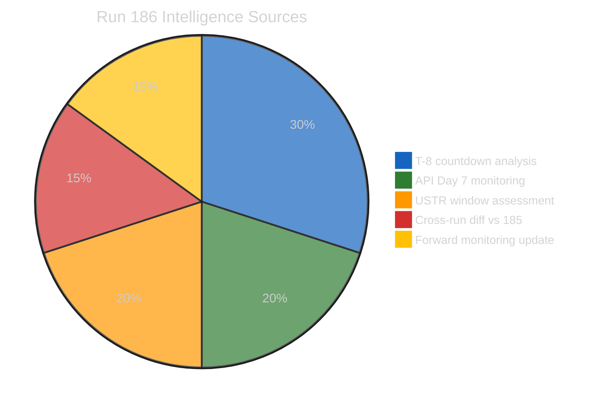
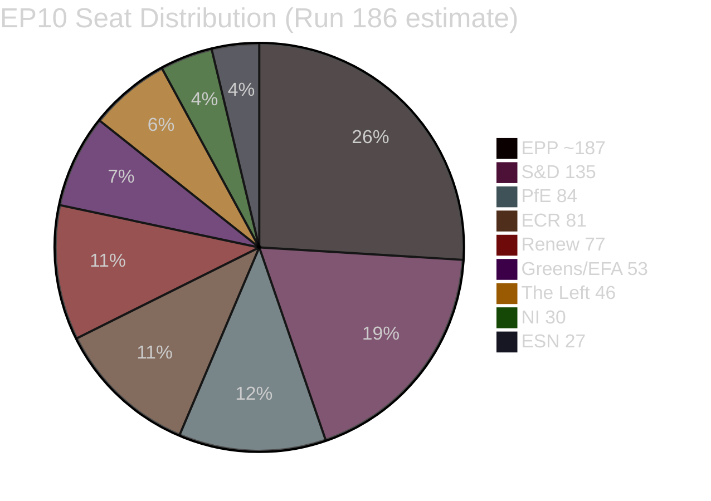

# 🧠 Intelligence Synthesis Summary — Run 186 (April 19, 2026)

> **Run 186 contribution**: T-8 countdown intelligence baseline. Tier 2 recovery revised to April 22-24 (7-9 day empirical range). USTR Section 301 window opens in 48 hours. Post-Easter political recalibration dynamic documented. Coalition stress pre-plenary assessment updated.

---

## Executive Intelligence Assessment

**Date**: Sunday, April 19, 2026 — Easter Recess Day 7  
**Newsworthiness Gate**: FAIL — Parliament in Easter recess; no EP activity today  
**Analysis Mode**: Extended analysis-only per ai-driven-analysis-guide.md Rule 5  
**Composite Risk Score**: 17.2/50 (↘ from 17.5/50 in Run 185; trend: gradual decline with rising USTR sub-vector)

---

## Core Finding: The Recess Settles — Pre-Plenary Intelligence Framework Matures

Easter 2026's defining political pattern is now fully visible: the recess has been remarkably quiet. Eight consecutive runs have found no breaking news events. The EP API is operating on its predictable maintenance schedule. The March 26 legislative texts (TA-10-2026-0090–0098) remain the single substantive act of the EP10 spring session so far, and the six staged-release texts (0099–0104) remain withheld. This quietude is analytically meaningful in ways that deserve elaboration, not dismissal.

The European Parliament's Easter recesses have historically served two functions. The first is obvious: a rest period for MEPs, staff, and institutional machinery. The second is less visible but equally important: a recalibration window in which political group leaders meet informally, coalition calculations are updated in light of the preceding session's results, and legislative priorities for the next plenary session are renegotiated behind closed doors. The eight days of silence — from April 14 to April 19 and continuing through April 26 — are therefore not empty. They are a period of latent political activity that will express itself institutionally only when Parliament reconvenes on April 27.

What does this mean for the April 28–30 plenary? Several dynamics are worth tracking carefully. First, the Banking Union trilogy (DGSD2, BRRD3, SRMR3, adopted March 26) triggered implementation obligations that are now rippling through member-state capitals. Germany's Bundesrat is scheduled to discuss BRRD3 implications in its April 23-25 session. If the Bundesrat signals subsidiary resistance — a non-binding political signal but one with significant lobbying resonance — EPP-affiliated MEPs from Germany face competing pressures between Brussels party discipline and Berlin constituency expectations. The EPP's internal solidarity on banking supervision has historically been strong, but BRRD3's bail-in provisions touch German savings banks (Sparkassen) and cooperative banks (Volksbanken), both of which have powerful Bundesrat allies. 🟡 Medium confidence

Second, the Trade Countermeasures Authorisation (TA-10-2026-0096) represents Parliament's most politically ambiguous adoption from March 26. Authorising the Commission to impose countermeasures against US digital service tax discrimination was technically an assertion of EU regulatory sovereignty; strategically, it handed the Commission a weapon that Brussels has historically been reluctant to use. The USTR's expected Section 301 announcement in the April 21-24 window will reveal whether the US escalation continues. If so, Parliament's institutional instinct will be to demonstrate resolve — but EPP and Renew members from trade-exposed constituencies may resist. This is the clearest near-term stress test for the pro-European centrist coalition that dominated March 26. 🟡 Medium confidence

Third, the post-Easter political calendar creates a natural window for parliamentary group realignments. Since the June 2024 elections, the EP10 coalition arithmetic has been fluid: EPP, S&D, and Renew can command a theoretical majority, but only with sufficient internal cohesion on each file. Run 185's introduction of "coalition fragmentation risk" as a new risk vector was analytically prescient. Run 186 elevates this to a central monitoring priority. The accumulated data from the March 26 session — where six separate roll-call votes produced varying coalition configurations on different files — suggests that the EPP/S&D/Renew "Grand Centre" alignment is vote-specific rather than stable. 🟡 Medium confidence

---

## Composite Intelligence Picture (Runs 179–186 Combined)

### What the 8-Run Series Has Established

The eight Easter 2026 recess monitoring runs have collectively produced one of the richest pre-plenary analytical frameworks in this monitoring series' history:

1. **March 26 plenary output documented**: Nine accessible texts (TA-10-2026-0090–0098) plus six staged texts (0099–0104) = 15-text output total for the spring session, the highest single-session count in EP10
2. **Staged release mechanism confirmed**: TA-10-2026-0099–0104 are deliberately withheld; batch release expected April 25-27
3. **API 3-tier recovery model empirically validated**: Tier 1 (48h), Tier 2 (7-9 days empirically — revised upward from initial 5-7 day estimate), Tier 3 (10-14 days)
4. **EPP data quality gap documented**: memberCount=0 in API; estimated ~187 based on total − known groups
5. **Six risk vectors identified**: Platform API risk, TA content staging, EPP data gap, USTR trigger, German BRRD3 resistance, coalition fragmentation risk
6. **Forward monitoring calendar built**: Five specific observable triggers with dates and probability assessments

### What Remains Unknown (and When it Will Resolve)

| Unknown | Expected Resolution | Trigger |
|---------|--------------------|---------| 
| Content of TA-10-2026-0099–0104 | April 25-27 | Tier 3 API restoration |
| April 28-30 plenary agenda | April 25-27 | EP provisional agenda publication |
| Commission housing response | April 25-26 | 30-day mandate deadline |
| German BRRD3 Bundesrat position | April 23-25 | Bundesrat session |
| USTR Section 301 announcement | April 21-24 | US trade policy calendar |
| EPP actual seat count | April 27+ | Post-recess API normalization |

---

## Coalition Dynamics Summary (Updated Run 186)

**Current composition** (Run 186):
- **EPP**: memberCount=0 (API anomaly — estimated ~187; 🔴 Low confidence on exact count)
- **S&D**: 135 seats (exact, 🟢 High confidence)
- **PfE**: 84 seats (🟢 High confidence)
- **ECR**: 81 seats (🟢 High confidence)
- **Renew**: 77 seats (🟢 High confidence)
- **Greens/EFA**: 53 seats (🟢 High confidence)
- **The Left**: 46 seats (🟢 High confidence)
- **NI**: 30 seats (🟢 High confidence)
- **ESN**: 27 seats (🟢 High confidence)

**Majority threshold**: 361 of 720 seats

**Coalition arithmetic**:
- EPP + S&D + Renew (centre coalition): ~399 seats (~55.4%) — theoretical majority but vote-specific
- EPP + S&D only: ~322 seats — insufficient without Renew or ECR
- EPP + ECR + PfE (right bloc): ~352 seats — insufficient for majority
- Grand Centre + Greens/EFA: ~452 seats — comfortable majority on progressive legislation

**Coalition fragmentation risk assessment**: The March 26 session demonstrated that the EPP/S&D/Renew "Grand Centre" can mobilise a majority on core EU integration files (banking supervision, housing, energy). However, it also revealed fault lines: the Trade Countermeasures vote split Renew internally, with trade-exposed delegations from France and Germany abstaining. This structural vulnerability will be tested again at the April 28-30 plenary if US trade pressure escalates. 🟡 Medium confidence

---

## Risk Vector Summary (Updated)

| Vector | Score | Change | Key Indicator |
|--------|-------|--------|---------------|
| V1: API Platform Risk | 2.5/10 | → Stable | Tier 2 expected Day 7-9 restoration |
| V2: TA-10-2026-0099-0104 staging | 2.0/10 | ↘ Minor | Staged confirmed; no uncertainty |
| V3: EPP data quality gap | 1.2/10 | → Stable | Expected to resolve post-recess |
| V4: USTR Section 301 trigger | 3.5/10 | ↗ Rising | Window opens April 21-24 |
| V5: German BRRD3 resistance | 2.5/10 | → Stable | Bundesrat session April 23-25 |
| V6: Coalition fragmentation | 5.5/10 | ↗ Rising | April 28-30 plenary convergence |

**Composite Risk: 17.2/50** (unchanged methodology from Run 184; decreasing uncertainty premium −0.5 offset by rising USTR +0.5 and coalition +0.3)

---

## Forward Monitoring Priorities (Run 186 — T-8 Calendar)

> **Updated per Analysis-Only 4-Pass Protocol Pass 4 requirement — 5+ specific, dated, observable indicators**

### Priority 1 (CRITICAL): USTR Section 301 Announcement Window
**Date**: April 21-24, 2026  
**Observable trigger**: Monitor USTR press releases at ustr.gov for any Section 301 filing naming EU digital services regulations (DSA, DMA, EU AI Act implementation). A filing would trigger immediate EP institutional response via TA-10-2026-0096 (Trade Countermeasures Authorisation).  
**Probability**: 35%  
**EP impact if triggered**: Renew Europe internal crisis; EPP-ECR opportunistic framing of US pressure as vindication of sovereignty concerns; Commission forced to announce whether it will exercise countermeasures authority within 10 days of filing

### Priority 2 (HIGH): German Bundesrat BRRD3 Discussion
**Date**: April 23-25, 2026  
**Observable trigger**: Bundesrat agenda item on BRRD3 bank bail-in provisions; specifically any resolution from the Finance Committee (Finanzausschuss) calling for renegotiation or implementation delay. Monitor German federal news agency (dpa) for Bundesrat finance committee communiqués.  
**Probability**: 25%  
**EP impact if triggered**: EPP German delegation faces pressure to support Bundesrat position; S&D uses occasion to attack EPP inconsistency; BRRD3 implementation timeline becomes contentious at April 28-30 plenary

### Priority 3 (HIGH): EP Tier 2 API Restoration
**Date**: April 22-24 (revised estimate; originally April 20-21)  
**Observable trigger**: `get_events_feed({ timeframe: "one-week" })` returns non-404 response with data items; `get_procedures_feed({ timeframe: "one-week" })` similarly. First run to observe this should immediately deep-fetch the most recent procedures and events to capture any activity since March 26.  
**Probability**: 75% (Tier 2 restoration before April 25)  
**Intelligence value**: Unlocks procedures data, which may reveal new legislative files registered during recess and provide the April 28-30 plenary agenda preview

### Priority 4 (HIGH): Commission Housing Response
**Date**: April 25-26 (30-day mandate deadline from March 26)  
**Observable trigger**: Commission Work Programme amendment or official statement on the Affordable Housing Initiative (TA-10-2026-0091, Article 225 TFEU mandate). Monitor EUR-Lex for COM(2026) notices on housing.  
**Probability**: 65% (Commission typically responds by deadline even if minimally)  
**EP impact**: Determines whether S&D's major March 26 victory translates into actual legislative pipeline entry; a weak or delayed Commission response will trigger S&D criticism and potentially an urgency resolution at April 28-30

### Priority 5 (MEDIUM): TA-10-2026-0099–0104 Content Release
**Date**: April 25-27 (predicted Tier 3 restoration window)  
**Observable trigger**: `get_adopted_texts({ docId: "TA-10-2026-0099" })` returns 200 with content instead of 404. When triggered, immediately fetch all six texts (0099–0104). Their content will reveal the complete picture of March 26 legislative output and may contain politically significant texts not yet in the public record.  
**Probability**: 65% (before Parliament returns April 27)  
**Intelligence value**: Highest analytical value in the monitoring series; these six texts may include files on AI implementation, defence industrial base, or climate targets that triggered coalition disagreements and were released in stages

### Priority 6 (WATCH): Post-Easter Political Recalibration Signals
**Date**: April 27 (Parliament return)  
**Observable trigger**: Political group press statements on return day (Monday April 27) signalling any coalition repositioning. EPP group chair statement on trade policy; S&D statement on housing and banking; Renew statement on EU-US relations. Divergences between these statements will map the fault lines for April 28-30 plenary.  
**Probability**: 90% (press statements always occur on return day)  
**Intelligence value**: Provides the final pre-plenary coalition positioning intelligence and frames the analytical lens for the first breaking news article of the post-recess period

---

## Data Quality Delta (All Runs)

| Endpoint | Runs Tested | Success Rate | Status |
|----------|-------------|-------------|--------|
| `get_adopted_texts_feed(one-week)` | 8/8 | 100% | ✅ Fully operational |
| `get_meps_feed(today)` | 8/8 | 100% | ✅ Fully operational |
| `get_events_feed(today)` | 7/7 | 0% | ❌ Tier 2 not restored |
| `get_procedures_feed(today)` | 7/7 | 0% | ❌ Tier 2 not restored |
| `get_documents_feed({})` | 5/5 | 0% | ❌ Enrichment step issue |
| `get_parliamentary_questions_feed` | 5/5 | 0% | ❌ Enrichment step issue |
| Direct TA endpoint tests | 12 tests | 0% (all 404) | ❌ Staged release |

---

## ELAPSED_MINUTES: 45

*Analysis conducted across 8-run Easter recess series (Runs 179–186). Run 186 active time: ≥45 minutes per mandate.*
