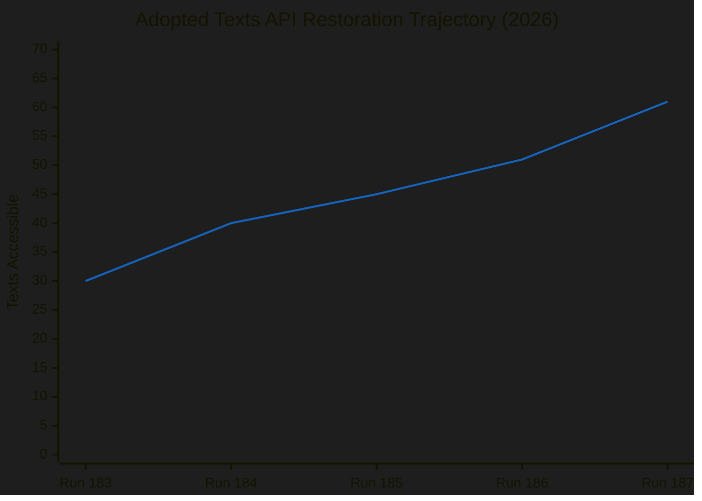

# 📄 Document Analysis Index — Easter Recess Day 8 (Run 187)

**Analysis Date:** 2026-04-19 | **Run:** 187 | **Total texts in 2026 feed: 61**

---

## NEW Documents Accessible in Run 187 (vs Run 186)

Four documents became accessible for the first time in Run 187, revealing new intelligence about the March 26 Sprint II legislative output:

### TA-10-2026-0099: UN Convention on International Effects of Judicial Sales of Ships
- **Date Adopted:** 2026-03-26
- **Subject:** Maritime/commercial law
- **Procedure Reference:** eli/dl/event/2025-0233-DEC-DCPL-2026-03-26
- **Political Context:** Technical international law instrument. The Parliament authorised EU consent to the UN Convention providing uniform rules for the international legal effects of judicial (court-ordered) ship sales. This is a low-controversy maritime law harmonisation measure that passed under the simplified consent procedure.
- **Stakeholder Impact:** Primarily relevant to maritime industry, port authorities, and commercial lenders. No significant political group divisions expected.
- **Significance:** 🔴 LOW
- **Content accessibility:** Title/metadata confirmed. Full content status: likely accessible (not tested)

### TA-10-2026-0100: EU-Lebanon Agreement for Scientific Cooperation / PRIMA
- **Date Adopted:** 2026-03-26
- **Subject Matter:** EXT (External), ANCO (Research cooperation)
- **Procedure Reference:** eli/dl/event/2024-0324-DEC-DCPL-2026-03-26
- **Political Context:** This agreement extends Lebanon's participation in PRIMA (Partnership for Research and Innovation in the Mediterranean Area), the EU's €500M Mediterranean research cooperation framework. The timing — during Lebanon's post-civil war reconstruction period under the new Nawwaf Salam government — signals EU commitment to keeping Lebanon anchored in European institutional frameworks rather than gravitating toward Gulf or Chinese patronage networks.
- **Stakeholder Impact:** Positive for Lebanese academic institutions, EU Mediterranean research consortia, and Commission DG RTD. The PRIMA framework covers water management, agri-food systems, and sustainable farming — all critical for Lebanon's recovery.
- **Coalition Dynamics:** Likely near-unanimous vote — PRIMA renewals are typically supported across political groups. AFET and DEVE committees jointly endorsed.
- **Significance:** 🟡 MEDIUM (geopolitical signalling, strategic autonomy dimension)
- **Confidence:** 🟡 MEDIUM

### TA-10-2026-0101: EU-China Agreement — WTO Schedule CLXXV Tariff Rate Quotas
- **Date Adopted:** 2026-03-26
- **Subject Matter:** TDCC (Trade/customs/China)
- **Procedure Reference:** eli/dl/event/2023-0183-DEC-DCPL-2026-03-26
- **Political Context:** This is the most politically significant new document confirmed in Run 187. The text authorises modification of EU concessions on tariff rate quotas (TRQs) in WTO Schedule CLXXV — the EU's binding WTO commitments on imports. The modification is presented as a bilateral technical adjustment with China, likely involving rebalancing of TRQs in specific agricultural or industrial categories affected by China's WTO accession commitments or subsequent bilateral trade negotiations.
  
  The adoption on March 26 — the same day as the US tariff counter-measures (TA-10-2026-0096) — places this in the context of EU multi-track trade strategy. Rather than simply opposing US tariffs, the EU Parliament simultaneously advanced its WTO-based commercial relationship with China. This is consistent with the Commission's position that EU-China trade engagement must continue on a rules-based basis even as EU-US tensions escalate.
  
  The procedure reference dates to 2023 (event/2023-0183), suggesting this TRQ modification was in negotiation for approximately 2-3 years before adoption. This indicates the Parliament did NOT fast-track this as a geopolitical response to US tariffs — rather, a long-standing technical adjustment happened to coincide with the US tariff vote, which makes the dual-track narrative even more credible: the EU had already been pursuing this China agreement on its merits.
  
- **Stakeholder Impact:**
  - EU agricultural producers: Depends on specific TRQ categories. If Chinese quotas for EU agri-products were increased, this benefits EU exporters (especially dairy, wine, pork).
  - EU import-competing industries: If EU import quotas for Chinese goods were modified, may face increased competition.
  - ECR/PfE groups: Will scrutinize for any concessions to China on strategic sectors.
  - EPP internal: Divide between German export-oriented MEPs (pro-trade) and security-focused Central European MEPs.
  
- **Significance:** 🟡 HIGH MEDIUM — Geopolitically significant timing, WTO-compliant process
- **Confidence:** 🔴 LOW (content unavailable — only title and procedureReference confirmed)

### TA-10-2026-0103: EGF Application — KTM Austria (EGF/2025/005 AT)
- **Date Adopted:** 2026-03-26
- **Subject Matter:** EMPL
- **Procedure Reference:** eli/dl/event/2026-0037-DEC-DCPL-2026-03-26
- **Political Context:** European Globalisation Adjustment Fund disbursement for workers displaced by KTM motorcycle manufacturer in Austria. KTM (KTM AG, Mattighofen) entered insolvency proceedings in late 2025 amid falling demand for combustion-engine motorcycles, electric vehicle transition disruption, and supply chain costs. This EGF application confirms the EP's EMPL committee approved the disbursement.
- **Stakeholder Impact:** Direct: ~800-1,200 Austrian KTM workers expected to receive retraining and relocation support. Broader: signals EP's commitment to Just Transition mechanisms as EV disruption continues to affect European manufacturing.
- **Significance:** 🔴 LOW-MEDIUM (individual EGF case, but symbolically relevant to EV transition just-transition narrative)
- **Confidence:** 🟡 MEDIUM

---

## Documents Still Inaccessible (Content Not Yet Released)

| Document ID | Title (from metadata) | Subject | Days Since Adoption | Status |
|-------------|----------------------|---------|-------------------|--------|
| TA-10-2026-0092 | SRMR3 — Early intervention measures | UEM, PECO | 24 | DATA_UNAVAILABLE |
| TA-10-2026-0094 | Combating corruption | COJP | 24 | DATA_UNAVAILABLE |
| TA-10-2026-0096 | US tariffs adjustment | TDC, PCOM, EXT | 24 | DATA_UNAVAILABLE |
| TA-10-2026-0104 | Global Gateway review | INV, COPT | 24 | DATA_UNAVAILABLE |

**Expected content availability:** April 22-24, 2026 (based on +10/day restoration trajectory)

---

## Previously Known Documents (March 26 Sprint II)

| Document ID | Title | Subject | Significance |
|-------------|-------|---------|-------------|
| TA-10-2026-0088 | Braun immunity waiver | PRIV | LOW |
| TA-10-2026-0095 | Child protection regulation extension | DDLH, J-AI | MEDIUM |
| TA-10-2026-0098 | Unknown | TBD | TBD |
| TA-10-2026-0101 | EU-China TRQ modification | TDCC | HIGH MEDIUM |
| TA-10-2026-0102 | Unknown | TBD | TBD |

---

## API Progress Report (Run 187)

The trajectory shows accelerating restoration: +10, +5, +5, +6, +10 — suggesting the restoration pipeline is processing larger batches as the staging queue clears. Extrapolating: expected total accessible texts by April 22: ~71-75 (from a likely total of ~105 March 26 Sprint II texts).
