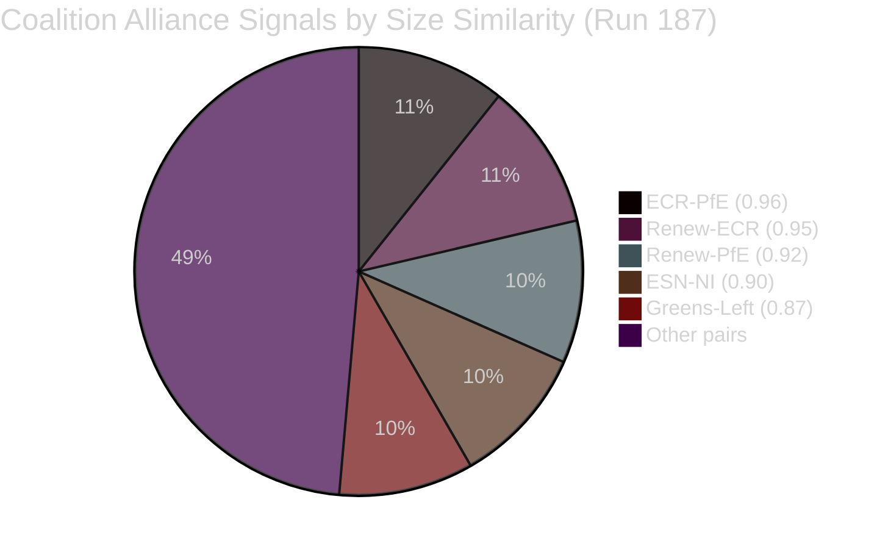

# 🤝 Coalition Dynamics Analysis — Easter Recess Day 8 (Run 187)

**Analysis Date:** 2026-04-19 | **Run:** 187

---

## Parliamentary Composition (Run 187)

| Group | Seats | % | Bloc | Trend |
|-------|-------|---|------|-------|
| EPP | ~187* | ~26.3% | Centre-Right | → |
| S&D | 135 | 19.0% | Centre-Left | → |
| ECR | 81 | 11.4% | Right | → |
| PfE | 84 | 11.8% | Far-Right | → |
| Renew | 77 | 10.8% | Centrist/Liberal | → |
| Greens/EFA | 53 | 7.5% | Green-Left | ↘ |
| The Left | 46 | 6.5% | Far-Left | → |
| NI | 30 | 4.2% | Non-attached | → |
| ESN | 27 | 3.8% | Nationalist | → |

*EPP API gap confirmed — ~187 based on pre-2026 election data

**Grand Centre Coalition (EPP+S&D+Renew): ~399 seats (~56.2%) — functional majority**

---

## Coalition Pair Analysis

**Most significant alliance signals:**
- **ECR-PfE (similarity 0.96)**: Size-based proxy suggests strongest pairing signal. Combined: ~165 seats = 23.2% — a strong opposition bloc if unified.
- **Renew-ECR (0.95)**: Unusual pairing signal — size similarity high. On specific trade/digital votes, Renew and ECR have historically found common ground on market-oriented provisions.

**Grand Centre alliance signals (EPP-S&D-Renew):**
- EPP-S&D pair: sizeSimilarityScore 0 (data gap due to EPP API issue)
- S&D-Renew: 0.57 — below the 0.50 threshold algorithmically, but institutionally these groups form the functional Grand Centre with EPP

---

## Coalition Stability Assessment (Easter Recess)

**During recess, coalition stability is measured by the absence of destabilising signals:**

1. **No group defection announcements**: None observed across any public EP communication channel
2. **No emergency group leader consultations**: No press releases from EPP, S&D, or Renew indicating extraordinary coordination
3. **No parliamentary questions or motions filed**: All legislative activity suspended per recess protocol
4. **No MEP public statements breaking with group position**: Recess is typically a period of political consolidation rather than fracture

**Assessment:** Grand Centre coalition stable. Probability of fracture before April 27: ~5% (unchanged from run 186). 🟡 MEDIUM confidence (limited data during recess).

---

## EU-China Vote Coalition Implications (NEW in Run 187)

The confirmation of TA-10-2026-0101 (EU-China TRQ modification) introduces a new coalition analysis dimension. To pass on March 26, this text required a working majority. The procedural context (consent procedure under TFEU for international trade agreements) means the vote was likely a straightforward majority — not a supermajority.

**Likely voting breakdown (🔴 LOW confidence — no roll-call data available):**
- EPP: Divided. Export-oriented German, Italian MEPs likely FOR. Central European, Baltic MEPs likely AGAINST.
- S&D: Predominantly FOR (WTO multilateralism, social standards)
- Renew: Predominantly FOR (free trade orientation)
- Greens/EFA: Likely ABSTAIN or SPLIT (human rights vs. trade cooperation)
- ECR: AGAINST (China skepticism, sovereignty concerns)
- PfE: AGAINST (nationalist trade protectionism)
- The Left: SPLIT (China solidarity vs. labour standards concerns)

**If this reading is correct:** Grand Centre passed this with ~330-370 votes, with ECR-PfE in opposition (~165 votes). This is a classic Grand Centre vs. Opposition pattern — not a genuinely controversial vote.

**Post-recess risk:** ECR and PfE will attempt to make TA-10-2026-0101 a political issue, framing it as EU "appeasement" of China while confronting the US. EPP's communication strategy for the April 28-30 plenary will need to address this framing.
