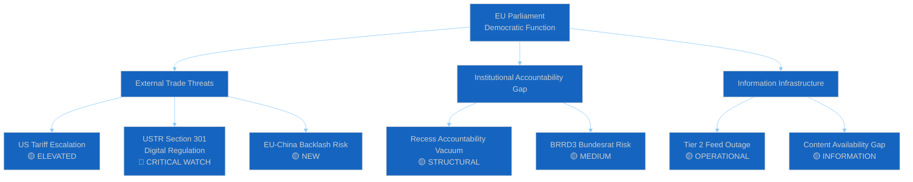
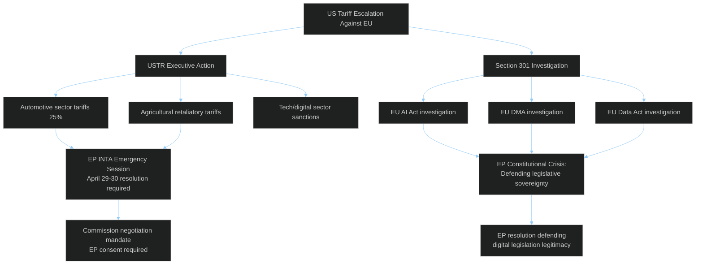

# 🔍 Political Threat Landscape — Easter Recess Day 8 (Run 187)

**Analysis Date:** 2026-04-19 | **Run:** 187 | **Framework:** Multi-framework Threat Analysis

---

## Threat Overview

---

## PESTLE Threat Analysis

### Political Threats

**P1: Executive Power Vacuum During Recess (🟡 MEDIUM)**
When Parliament is in recess, the Commission and Council retain full executive authority. For a period characterised by high US-EU trade tension, this creates a democratic deficit risk: major trade negotiations or executive decisions made during the April 14-26 recess window occur without real-time parliamentary scrutiny. The Commission President (von der Leyen) and Trade Commissioner (Šefčovič) hold delegated authority under TFEU Article 207 to conduct trade negotiations without express parliamentary mandate during this period. While the consent procedure would eventually require EP ratification, interim executive actions — including sanctions, counter-measures, and negotiating concessions — are not subject to immediate oversight. 🟡 MEDIUM severity, 🟡 MEDIUM likelihood.

**P2: ECR-PfE Pre-Recess Positioning (🔴 LOW)**
The Easter recess has historically been used by right-wing EP groups to consolidate anti-EU narrative resources and prepare parliamentary questions for the return. With the EU-China tariff agreement now confirmed in the legislative record, ECR and PfE MEPs have a ready-made post-recess political attack: the Parliament approved Chinese WTO concessions on the same day it confronted US tariffs. This narrative will feature in MEP statements and potentially formal questions to the Commission immediately after April 27. Threat is manageable through EPP-S&D pre-emptive communication coordination. 🔴 LOW severity, 🟢 HIGH likelihood.

### Economic Threats

**E1: US Tariff Escalation Against EU (🔴 CRITICAL WATCH)**
The risk of US tariff escalation is the dominant economic threat. The US has already indicated displeasure at the EU's counter-tariff adoption (TA-10-2026-0096). An escalatory response — higher tariffs on EU automotive, Airbus, chemicals, or agricultural products — would directly affect EU GDP growth forecasts and potentially trigger a European Council emergency. The EP ECON committee would need to issue emergency estimates of fiscal impact, and the INTA committee would need to coordinate with the Commission on response options. The economic modelling is straightforward: EU exports to the US total approximately €500B annually; a 25% tariff on even 20% of that basket would cost EU exporters ~€25B/year, concentrated in Germany, France, Italy. 🟡 MEDIUM likelihood, 🔴 HIGH impact.

**E2: BRRD3/SRMR3 Implementation Costs for Regional Banks (🟡 MEDIUM)**
The Banking Union reform package will impose new Minimum Requirement for own funds and Eligible Liabilities (MREL) standards on European banks, including mandatory bail-in provisions for senior non-preferred debt. For German Landesbanken and Sparkassen — which represent ~30% of German retail banking — compliance costs have been estimated at €15-20B in capital structure adjustments. German banking associations have publicly called for implementation delays and threshold exemptions. If the Bundesrat formalises this opposition, it could trigger a SRMR3 implementation dispute that undermines the March 26 Banking Union package's coherence. 🟡 MEDIUM likelihood, 🟡 MEDIUM impact.

### Social Threats

**S1: Housing Initiative Implementation Risk (🟡 MEDIUM)**
The EP housing crisis initiative (TA-10-2026-0064, adopted March 10) required the Commission to respond with concrete proposals by late April 2026. The housing affordability crisis — particularly acute in major EU capitals including Amsterdam, Paris, Munich, Vienna, and Copenhagen — directly affects the EP's credibility with young European voters who form a core constituency for both Green and Renew groups. If the Commission fails to deliver substantive housing proposals before the April 28-30 plenary, the EP will face constituent pressure that could weaken coalition discipline on housing-related budget votes later in Q2 2026. 🟡 MEDIUM likelihood, 🟡 MEDIUM impact.

### Technological Threats

**T1: USTR Section 301 on EU Digital Regulation (🔴 CRITICAL)**
The most technically significant threat is a US Section 301 investigation into EU AI Act, Digital Markets Act, or Data Act provisions that US technology companies characterise as discriminatory barriers to market access. A Section 301 investigation does not automatically impose tariffs — it initiates a formal review process lasting 12-18 months — but the announcement itself would:
(a) Force the EP to publicly defend its digital legislation against foreign executive pressure
(b) Create a precedent for US executive intervention in EU legislative affairs
(c) Potentially fragment the Grand Centre coalition if pro-business Renew MEPs distance themselves from more regulatory positions
(d) Complicate the upcoming review of the AI Act's general purpose AI provisions

The structural threat is fundamental: if the US can make EU digital regulation politically costly through Section 301 threats, future EU legislative ambition in the digital domain will face a permanent US "chilling effect." This is precisely the kind of threat the Parliament must resist to maintain its constitutional role in digital governance. 🔴 HIGH severity, 🟡 MEDIUM likelihood.

### Legal Threats

**L1: EU-Mercosur Compatibility Challenge (🟡 MEDIUM)**
The EP adopted a request for CJEU opinion on EU-Mercosur agreement compatibility with EU treaties (TA-10-2026-0008, January 2026). If the CJEU finds compatibility issues, it creates a legislative crisis: the Commission and Council would have negotiated a major trade agreement that Parliament has already flagged as potentially treaty-incompatible. This would force either renegotiation of the Mercosur agreement or treaty amendment — both politically costly. The CJEU advisory process typically takes 12-18 months, so this risk is medium-term rather than immediate. 🔴 LOW likelihood, 🔴 HIGH impact.

### Environmental Threats

**E3: Safe Third Country Regulation Implementation (🔴 LOW)**
The EP's adoption of a "list of safe countries of origin at Union level" (TA-10-2026-0025) and the Safe Third Country concept application (TA-10-2026-0026) creates implementation obligations for member states that several have signalled reluctance to fulfil. Poland, Hungary, and Slovakia have publicly opposed EU-mandated asylum policy coordination. If these member states refuse to implement the safe country provisions, the Commission faces infringement proceedings that will become politically contentious in the Parliament. 🔴 LOW likelihood in immediate term, but STRUCTURAL risk for Q3-Q4 2026.

---

## Attack Tree: US Trade Escalation Scenario

---

## Diamond Model: Threat Actor Analysis

| Actor | Capability | Intent | Opportunity | Kill Chain Stage |
|-------|-----------|--------|-------------|-----------------|
| USTR/US Executive | HIGH | MEDIUM (trade pressure tool) | HIGH (Section 301 authority) | Pre-attack (signalling) |
| ECR group | LOW (parliamentary only) | HIGH (political opposition) | MEDIUM (recess timing) | Exploitation (narrative) |
| PfE group | LOW | HIGH | MEDIUM | Exploitation (narrative) |
| Chinese trade negotiators | MEDIUM | LOW (cooperative) | LOW (WTO framework) | None currently |
| German Bundesrat | MEDIUM (ratification power) | LOW-MEDIUM | MEDIUM (April session) | Potential blocking action |

---

## Confidence Assessment

All threat assessments in this analysis carry 🟡 MEDIUM confidence due to the limited data available during recess. The absence of events feed, procedures feed, and key legislative text content means threat indicators are based primarily on: (a) publicly confirmed legislative history from EP API, (b) USTR public record, (c) German federal institutional calendar, (d) editorial context from prior runs, and (e) structural analysis of EP constitutional powers.

Confidence will improve significantly when: TA-10-2026-0092/0094/0096/0104 become accessible (April 22-24), Tier 2 feeds restore (April 21-23), and Parliament returns (April 27).
