# 🗂️ Analysis Index — Run 188 (Easter Recess Day 7)


-yellow?style=flat-square)


> **Purpose**: Single index to every artifact produced in Run 188 of the Easter-recess
> Breaking workflow, with reading order, size, and cross-reference map. This is the
> orientation file for any subsequent reviewer — human or automated quality gate.
> It replaces individual artifact-manifest queries with a single authoritative
> catalogue.

## Run 188 Headline Findings

1. **Four landmark title confirmations (🟢 HIGH confidence)**: TA-10-2026-0092
   (SRMR3), TA-10-2026-0094 (Anti-Corruption), TA-10-2026-0096 (US tariff/TRQ),
   TA-10-2026-0104 (Global Gateway) — all now title-confirmed via the
   metadata-layer endpoint after 24 days of content-layer unavailability.
2. **First observed content regression in 10-run series (🟢 HIGH confidence)**:
   TA-10-2026-0101 (EU-China TRQ agreement) regressed from accessible in Run 187
   to `DATA_UNAVAILABLE` in Run 188. Candidate MCP defect #8.
3. **EP API dual-layer architecture confirmed (🟢 HIGH)**: 159 texts indexed at
   metadata layer vs ~61 accessible at content layer. Gap of 98 texts.
4. **Grand-Centre coalition at series-high stability (🟢 HIGH)**: 84/100
   stability score from `early_warning_system` MCP tool; 399/720 seats (55.4%).
5. **Forward monitoring inflection approaches**: USTR Section 301 window April
   21–24 (25% probability); Bundesrat banking session April 23–25; Parliament
   returns April 27; first post-recess plenary April 28–30.

## Recommended Reading Order

For a reviewer with 15 minutes:
1. This file (2 minutes)
2. `intelligence/synthesis-summary.md` (5 minutes)
3. `intelligence/cross-run-diff.md` (3 minutes)
4. `risk-scoring/risk-matrix.md` (5 minutes)

For a reviewer with 45 minutes, add:
5. `intelligence/pestle-analysis.md`
6. `intelligence/scenario-forecast.md`
7. `intelligence/stakeholder-map.md`
8. `documents/document-analysis-index.md`

For a full audit, read all 18 artifacts in the order below.

## Artifact Catalogue

| File | Type | Lines | Status | Rule 22 floor |
|------|------|:-----:|:------:|:-------------:|
| `intelligence/analysis-index.md` | Index | *(this file)* | ✅ | 160 |
| `intelligence/synthesis-summary.md` | Synthesis | ≥205 | ✅ | 205 |
| `intelligence/cross-run-diff.md` | Differential | ≥100 | ✅ | 100 |
| `intelligence/significance-scoring.md` | Significance | ≥150 | ✅ | 105 |
| `intelligence/coalition-dynamics.md` | Coalition | ≥135 | ✅ | 135 |
| `intelligence/political-threat-landscape.md` | Threats | ≥200 | ✅ | 90 |
| `intelligence/pestle-analysis.md` | PESTLE | ≥250 | ✅ | 250 |
| `intelligence/scenario-forecast.md` | Scenarios | ≥280 | ✅ | 280 |
| `intelligence/stakeholder-map.md` | Stakeholders | ≥305 | ✅ | 305 |
| `intelligence/threat-model.md` | Threat model | ≥250 | ✅ | 250 |
| `intelligence/wildcards-blackswans.md` | Wild cards | ≥275 | ✅ | 275 |
| `intelligence/historical-baseline.md` | Historical | 286 | ✅ (Phase 0 landed) | 190 |
| `intelligence/economic-context.md` | Economic | 219 | ✅ (Phase 0 landed) | 185 |
| `intelligence/reference-analysis-quality.md` | Reference | existing | ✅ | 190 |
| `intelligence/mcp-reliability-audit.md` | MCP audit | existing | ✅ | 385 |
| `risk-scoring/risk-matrix.md` | Risk | ≥150 | ✅ | 150 |
| `risk-scoring/quantitative-swot.md` | SWOT | ≥140 | ✅ | 140 |
| `documents/document-analysis-index.md` | Documents | ≥160 | ✅ | 95 |
| `classification/significance-classification.md` | Classification | ≥120 | ✅ | 105 |
| `manifest.json` | Metadata | — | ✅ | — |

> **Note**: the *Lines* column lists workflow target budgets (what the agent aims to produce); the *Rule 22 floor* column is the machine-enforced minimum from `analysis/methodologies/reference-quality-thresholds.json` — validator output is keyed against the latter.

## Cross-Reference Map

```
TA-10-2026-0092 (SRMR3)  ─┬─ TA-0090 (DGSD2) ─┬─ TA-0091 (BRRD3)
                           │                   └─ Banking Union trilogy (all adopted 2026-03-26)
                           └─ Monitoring: German Bundesrat April 23-25 signals (Risk R3)

TA-10-2026-0094 (Anti-Corruption) ─── COJP subject domain
                                   └─ First binding EU anti-corruption legislative standard
                                   └─ Monitoring: Hungarian subsidiarity signals (Risk R5)

TA-10-2026-0096 (US tariff/TRQ) ─┬─ TA-10-2026-0101 (EU-China TRQ — REGRESSED Run 188)
                                 │   └─ Both adopted 2026-03-26 — EP dual-track trade strategy
                                 └─ Monitoring: USTR Section 301 window April 21-24 (Risk R1)

TA-10-2026-0104 (Global Gateway review) ─── TA-0101 (EU-China TRQ)
                                         └─ EP narrative positioning: EU alternatives to BRI

All four texts ─── Data Model: see DATA_MODEL.md §Text structure
                └─ Dual-layer architecture: intelligence/mcp-reliability-audit.md
```

## Artifact Dependency Graph

```mermaid
%%{init: {"theme":"dark","themeVariables":{"primaryColor":"#1565C0","primaryTextColor":"#ffffff","primaryBorderColor":"#0A3F7F","lineColor":"#90CAF9","secondaryColor":"#2E7D32","secondaryTextColor":"#ffffff","secondaryBorderColor":"#0F3F00","tertiaryColor":"#FF9800","tertiaryTextColor":"#000000","tertiaryBorderColor":"#7F4F00","mainBkg":"#1565C0","secondBkg":"#2E7D32","tertiaryBkg":"#FF9800","noteBkgColor":"#FFC107","noteTextColor":"#000000","noteBorderColor":"#7F6000","errorBkgColor":"#D32F2F","errorTextColor":"#ffffff","fontFamily":"Inter, Helvetica, Arial, sans-serif","pie1":"#1565C0","pie2":"#2E7D32","pie3":"#FF9800","pie4":"#D32F2F","pie5":"#FFC107","pie6":"#7B1FA2","pie7":"#9E9E9E","pie8":"#0288D1","pie9":"#388E3C","pie10":"#F57C00","pie11":"#C62828","pie12":"#FBC02D","pieTitleTextSize":"18px","pieSectionTextSize":"14px","pieLegendTextSize":"13px","pieStrokeColor":"#1e1e1e","pieOuterStrokeColor":"#1e1e1e","git0":"#1565C0","git1":"#2E7D32","git2":"#FF9800","git3":"#D32F2F","gitBranchLabel0":"#ffffff","gitBranchLabel1":"#ffffff","gitBranchLabel2":"#000000","gitBranchLabel3":"#ffffff","cScale0":"#1565C0","cScale1":"#2E7D32","cScale2":"#FF9800","cScale3":"#D32F2F","cScale4":"#FFC107","cScale5":"#7B1FA2","cScale6":"#9E9E9E","cScale7":"#0288D1","xyChart":{"backgroundColor":"#1e1e1e","plotColorPalette":"#1565C0,#2E7D32,#FF9800,#D32F2F,#FFC107,#7B1FA2,#9E9E9E"}}}}%%
graph TD
    Index["📇 analysis-index.md<br/>(this file)"]
    Synth["📊 synthesis-summary.md"]
    Diff["🔄 cross-run-diff.md"]
    Sig["📈 significance-scoring.md"]
    Coal["🤝 coalition-dynamics.md"]
    PTL["🔴 political-threat-landscape.md"]
    PEST["🔍 pestle-analysis.md"]
    Scen["🎲 scenario-forecast.md"]
    Stake["🗺️ stakeholder-map.md"]
    TM["🛡️ threat-model.md"]
    WC["🎰 wildcards-blackswans.md"]
    Hist["📜 historical-baseline.md"]
    Econ["💶 economic-context.md"]
    Ref["📚 reference-analysis-quality.md"]
    MCP["🔧 mcp-reliability-audit.md"]
    RM["⚠️ risk-matrix.md"]
    SWOT["📐 quantitative-swot.md"]
    Docs["📄 document-analysis-index.md"]
    SC["📋 significance-classification.md"]

    Index --> Synth
    Synth --> Diff
    Synth --> Sig
    Diff --> MCP
    Coal --> PEST
    PTL --> TM
    PEST --> Scen
    Scen --> WC
    Stake --> TM
    TM --> RM
    RM --> SWOT
    Hist --> Scen
    Econ --> PEST
    Docs --> SC
    Ref --> Synth
    Ref --> PEST
    Ref --> Scen

    style Index fill:#1565c0,color:#fff
    style Synth fill:#1976d2,color:#fff
    style Diff fill:#388e3c,color:#fff
    style Sig fill:#f57c00,color:#fff
    style RM fill:#c62828,color:#fff
    style SWOT fill:#7b1fa2,color:#fff
```



## Data Source Provenance

All artifacts in Run 188 derive from these authoritative sources, each cited
inline in the relevant file:

| Source | Endpoint / URL | Used by |
|--------|----------------|---------|
| EP Open Data Portal — adopted texts metadata | `get_adopted_texts(year:2026)` | synthesis, cross-run-diff, documents |
| EP Open Data Portal — adopted texts content | `get_adopted_texts(docId:...)` | documents, cross-run-diff |
| EP Open Data Portal — MEPs feed | `get_meps_feed(timeframe:"today")` | coalition-dynamics |
| EP Open Data Portal — events feed | `get_events_feed(timeframe:"today")` | synthesis (404 observation) |
| EP Open Data Portal — procedures feed | `get_procedures_feed(timeframe:"today")` | synthesis (404 observation) |
| Coalition-dynamics MCP tool | `analyze_coalition_dynamics` | coalition-dynamics, stakeholder-map |
| Early-warning MCP tool | `early_warning_system(sensitivity:"medium")` | synthesis, PTL, risk-matrix |
| Historical stats MCP tool | `get_all_generated_stats(category:"all")` | historical-baseline |
| World Bank WDI | `world-bank.get-economic-data` | economic-context, pestle-analysis |
| USTR press office | `ustr.gov/about-us/policy-offices/press-office/press-releases` | scenarios, risk-matrix, threat-model |
| Bundesrat agenda | `bundesrat.de/DE/plenum/termine` | scenarios, risk-matrix |
| ECB press | `ecb.europa.eu/press/pressconf` | economic-context, wildcards |
| europarl.europa.eu/plenary | EP10 plenary schedule | scenarios, synthesis |

## Validation

This run must pass:
```
npm run validate-analysis -- --analysis-dir="analysis/daily/2026-04-19/breaking-run188" --article-type="breaking"
```

Expected: `exit 0` and `"Pre-flight gate PASSED"` with all mandatory artifacts
meeting their `analysis/methodologies/reference-quality-thresholds.json` floors.

## Workflow Context

- **Run number**: 188 (10th run of the Easter-recess series, Runs 179–188)
- **Schedule**: Breaking workflow, ANALYSIS_ONLY mode (significance 18/50 < 25/50 threshold)
- **Elapsed time**: ~30 minutes active analysis
- **Mode**: No article generated; artifacts only
- **Next run**: Run 189 on April 20 morning — primary purpose: verify Tier-2 API
  restoration trajectory and TA-0101 re-accessibility status
- **Critical observation windows**: April 21–24 (USTR + Tier-2 restoration +
  Bundesrat agenda); April 26–27 (EP political-group pre-plenary statements);
  April 28 morning (first post-recess plenary opening)

---

*Analysis generated: April 19, 2026 | Run 188 | Breaking workflow | Analysis-only mode*
*Maintained by: EU Parliament Monitor intelligence-operative pipeline*
