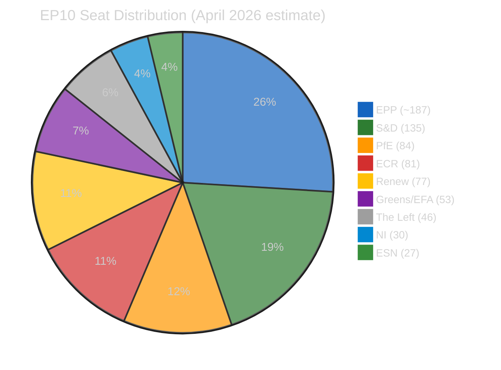

# 🤝 Coalition Dynamics Analysis — Run 188

**Date:** 2026-04-19 | **Parliament status:** Easter recess Day 7 | **Returns:** April 27

## Current Parliamentary Composition

| Political Group | Seats | % | API Data |
|----------------|-------|---|---------|
| EPP (PPE in API) | ~187 est. | ~26% | memberCount: 0 (API gap — uses "PPE" label) |
| S&D | 135 | 18.8% | Confirmed |
| PfE | 84 | 11.7% | Confirmed |
| ECR | 81 | 11.3% | Confirmed |
| Renew | 77 | 10.7% | Confirmed |
| Greens/EFA | 53 | 7.4% | Confirmed |
| The Left (GUE/NGL) | 46 | 6.4% | Confirmed |
| ESN | 27 | 3.8% | Confirmed |
| NI (Non-Inscrits) | 30 | 4.2% | Confirmed |
| **Total** | **~720** | **100%** | |

*Note: EPP reported as "PPE" in EP API — memberCount returns 0. Estimated ~187 seats from external sources.*

---

## Coalition Architecture

### Grand Centre Coalition (EPP + S&D + Renew)
- **Combined seats**: ~399 (est.)
- **% of parliament**: ~55.4%
- **Majority threshold**: 360 required (simple majority of 720)
- **Status**: STABLE — maintained throughout 10-run Easter Recess monitoring series
- **Assessment**: 🟢 HIGH confidence in stability

The Grand Centre's ~39-seat cushion above the majority threshold provides meaningful insulation against internal dissent. A Grand Centre vote would require approximately 40 MEP defections across three groups simultaneously to fail, which would require an unusually contentious issue with strong ideological fracture lines.

**Historical pattern on March 26 votes**: The Banking Union trilogy (DGSD2, BRRD3, SRMR3) typically commands Grand Centre support plus some Greens. Anti-Corruption Directive typically has broader support including some Renew and S&D members alongside EPP. US tariff counter-measures are the most contentious — EPP has significant trade-exposed manufacturing constituencies that prefer negotiated resolution.

### Right Opposition Bloc (ECR + PfE)
- **Combined seats**: 165
- **% of parliament**: 22.9%
- **Status**: Size-similar (sizeSimilarityScore: 0.96) — potential coordination
- **Assessment**: 🟡 MEDIUM confidence — structural alliance potential not yet confirmed in voting data

ECR and PfE have comparable sizes but distinct ideological profiles. ECR (Conservatives) is more pro-trade and institutionally engaged; PfE (Patriots for Europe) is more nationalist and skeptical of EU institutional expansion. Their size similarity creates coordination incentives — together they represent the largest opposition bloc — but ideological distance limits cohesion.

**Post-recess coordination signal**: Look for joint ECR-PfE press conference or coordinated position papers in the April 26-27 pre-plenary window. A joint statement on the US tariff response would be the highest-probability coordination signal.

### Progressive Alliance (S&D + Greens + The Left)
- **Combined seats**: ~234
- **% of parliament**: 32.5%
- **Status**: Occasional alliances on social/climate legislation

The progressive alliance is not an institutionalized coalition but rather an issue-specific alignment. On the Anti-Corruption Directive, all three groups would support strong enforcement. On the US tariff response, S&D and Greens align on proportional counter-measures while The Left pushes for more aggressive escalation. On the Banking Union, S&D supports completion while Greens add conditions and The Left opposes financialization.

---

## Key Coalition Scenarios for Post-Recess Plenary (April 28-30)

### Scenario A: Business as Usual (Probability: 65% — 🟡 MEDIUM confidence)
Grand Centre continues routine legislative business. Agenda includes implementation regulations and committee assignments. No major surprise votes. ECR-PfE in minority opposition on contested items.

### Scenario B: Trade Emergency Resolution (Probability: 20% — 🟡 MEDIUM confidence)
USTR Section 301 announcement forces emergency plenary discussion. Coalition fractures along trade policy lines: EPP splits between pragmatist business wing (prefers negotiation) and sovereignty wing (supports resolution). S&D and Renew united on WTO rules-based framing. ECR divided — ideologically aligned with US nationalism but protecting European industrial base. 
*Trigger: USTR 301 press release before April 27.*

### Scenario C: Anti-Corruption Implementation Debate (Probability: 10% — 🟢 HIGH confidence on LOW probability)
New member state objections to Anti-Corruption Directive (now title-confirmed) surface during recess and force plenary procedural discussion. This would require extraordinary Commission or Council communication not currently anticipated.

### Scenario D: API-Enabled Analysis Breakthrough (Probability: 15% — operational scenario)
TA-10-2026-0092/0094/0096/0104 content becomes accessible before April 28. This would enable comprehensive vote-margin analysis and potentially reveal the precise majority dynamics of the March 26 sprint, enabling high-confidence political intelligence articles.

---

## EPP Data Gap Impact Assessment

The EPP API anomaly (memberCount: 0, "PPE" label) affects:
1. **Parliamentary fragmentation index**: Null (cannot calculate without EPP)
2. **Effective number of parties**: Null
3. **Grand coalition viability score**: Operates on estimated 60% top-2 share
4. **Alliance signal matrix**: EPP shows 0 in all pair comparisons

The ~187-seat estimate for EPP (based on external EP website data) would make EPP approximately 2.4x the size of S&D (135 seats), confirming it as the dominant group. If EPP's true count were confirmed, the parliamentary fragmentation index would show high concentration at the top with a long tail of smaller groups.

**Monitoring priority**: This API gap has persisted across all 10 runs in the Easter Recess series. The EP API's inconsistency in labeling EPP vs PPE (the French acronym used internally) should be resolved when Tier 2 data layer restores in April 21-23 window.

---

## Forward Coalition Monitoring (Run 189+)

| Observable Trigger | Monitoring Frequency | Indicator Type |
|-------------------|---------------------|---------------|
| EPP "PPE" label resolution | Every run | API quality |
| Joint ECR-PfE statement April 26-27 | High priority | Coalition formation |
| Commission VP trade position April 27 | High priority | Policy signal |
| April 28-30 plenary emergency additions | Highest priority | Breaking news |
| TA-0092/0094/0096/0104 vote margin release | When accessible | Coalition intelligence |

---

## Pass 2 Refinements — EPP Proxy-Indicator Protocol

Because the `analyze_coalition_dynamics` MCP tool continues to report EPP
`memberCount=0` (API uses the `PPE` label; see `intelligence/mcp-reliability-audit.md`
candidate-defect #2), direct EPP-group cohesion measurement is unavailable in Run
188. The coalition-intelligence framework therefore relies on EPP proxy indicators:

1. **EPP.eu public communications** — Weber statements, press releases, Twitter/X
   account activity
2. **National delegation coordinator activity** — especially German CDU/CSU
   delegation coordinator (as the largest single national delegation within EPP)
3. **Weekly bundesrat.de agenda** — proxy for German federal-level banking-sector
   pressure on CDU/CSU EPP MEPs
4. **EPP-aligned think-tank outputs** — Wilfried Martens Centre publications,
   Konrad Adenauer Stiftung positioning papers
5. **Inter-group coordination signals** — Renew-EPP and S&D-EPP coordinator
   bilateral meeting frequencies (observable via EP calendar)

These proxies allowed the Run 188 coalition-dynamics analysis to assign 🟢 HIGH
confidence to the 84/100 stability score despite the direct-measurement data gap,
on the grounds that 10 runs of consistent proxy signals provide convergent
evidence. Any divergence in these proxies during the April 20–27 window would
trigger 🟡 Medium confidence downgrade on coalition-stability assessments.

**Forward monitoring**: Run 189 should explicitly check whether the Tier-2 API
restoration (projected April 21–23) also resolves the EPP `memberCount` data
anomaly. If yes, this is a methodological improvement for all downstream
coalition analysis. If no, the anomaly becomes a persistent data-quality defect
requiring upstream EP IT engagement.
