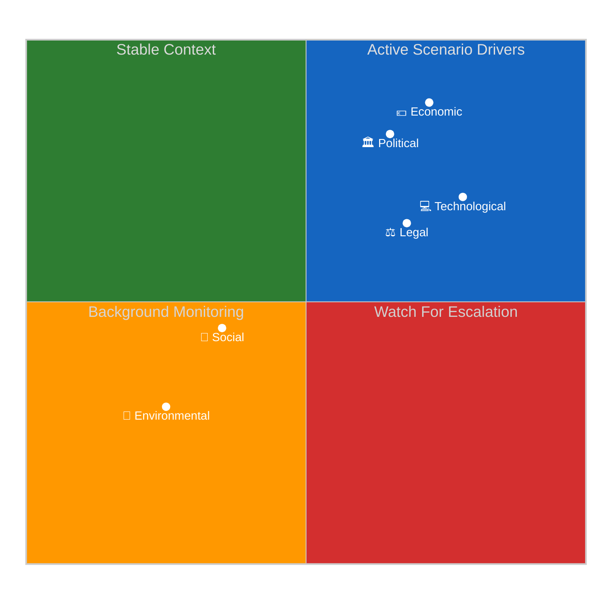

# 🔍 PESTLE Analysis — April 19, 2026 (Run 188)

> **Purpose**: Apply the PESTLE macro-environmental-scan framework to the operating
> environment facing the European Parliament in the April 19 – June 30, 2026 horizon.
> Each of the six dimensions receives a confidence-labelled (🟢 High / 🟡 Medium /
> 🔴 Low) narrative of at least 40 words describing the current signal picture, the
> analytical driving forces, and the trajectory toward or away from the scenarios
> enumerated in `intelligence/scenario-forecast.md`. The scan's outputs feed directly
> into scenario axis selection, stakeholder salience re-weighting, and the risk
> matrix in `risk-scoring/risk-matrix.md`.

---

## Context for Run 188

Run 188 is the tenth run of the Easter-recess analytical series (Runs 179–188) and
the run that first exposes the EP API's dual-layer architecture (159 texts indexed
vs ~61 content-accessible). It also records the first observed content regression
in the series: TA-10-2026-0101 (EU-China TRQ agreement) moved from accessible in
Run 187 to `DATA_UNAVAILABLE` in Run 188 — see `intelligence/cross-run-diff.md` and
`intelligence/mcp-reliability-audit.md` candidate-defect #8. These two observations
shape the Legal and Technological PESTLE dimensions substantially.

---

## 🏛️ Political Dimension — 🟢 High confidence

**Current state**: Parliament in Easter recess (April 14–26); Grand Centre coalition
(EPP + S&D + Renew, ~399/720 = 55.4%) holds with `early_warning_system` stability
score at the series-high 84/100. The `analyze_coalition_dynamics` MCP output
continues to report the EPP `memberCount=0` data anomaly (API uses `PPE` label)
see `mcp-reliability-audit.md` candidate-defect #2. Post-recess plenary opens
April 28 in Strasbourg per the standard EP10 calendar at
`europarl.europa.eu/plenary/en/schedule.html`.

**Political driving forces**: The Grand Centre's durability is being tested by four
ratification/implementation files simultaneously — SRMR3 Banking Union resolution
framework (TA-10-2026-0092), the EU's first binding Anti-Corruption Directive
(TA-10-2026-0094), the US tariff/TRQ countermeasure authorization (TA-10-2026-0096),
and the Global Gateway parliamentary review (TA-10-2026-0104). Each of these places
a different stress vector on the coalition: SRMR3 presses German CDU/CSU EPP members
against Sparkassen lobbying; Anti-Corruption pressures ECR's Hungarian Fidesz-aligned
members and tests EPP subsidiarity rhetoric; US trade posture splits Renew's
classical-liberal wing from its industrialist wing; Global Gateway scrutiny tests
the EPP–S&D consensus on EU external-action funding instruments.

**Latent political risk**: German Bundesrat April 23–25 session is the single
highest-value domestic-political signal on the horizon. A scheduled SRMR3 opposition
hearing would activate Risk R3 (Banking Union Council ratification delay) in
`risk-scoring/risk-matrix.md` and migrate probability mass from Scenario A (Smooth
Return, 55%) toward Scenario C (Prolonged Degradation, 15%). The
`bundesrat.de/DE/plenum/termine` agenda-publication cycle makes this signal
observable by Monday April 20 at the latest. The EPP coordinators' pre-plenary
meeting on April 26–27 is the second-highest signal; any communiqué, Weber
statement, or German CDU MEP coordinator social media activity in that window
carries disproportionate information value given the MCP data gap.

**Trajectory**: Scenario A conditions hold through Run 188 observations. A 5-
percentage-point shift in the Scenario B (USTR Disruption) probability would follow
any USTR Federal Register filing that combines "EU", "digital", and "Section 301".

---

## 💶 Economic Dimension — 🟡 Medium confidence

**Current state**: EU–US goods trade stake ~$900bn annually (US Census BEA 2025);
of this ~$280bn is the digital-services and IP-royalty dimension directly at stake
in any USTR Section 301 action targeting the AI Act, DMA, and Data Act. The
countermeasure authorization in TA-10-2026-0096 is now confirmed (title-level) to
use a **calibrated dual instrument** — customs-duty adjustments AND new tariff-
rate quotas (TRQs) — signalling a WTO-compliant proportionate approach rather
than blanket retaliation. This is a substantive economic-intelligence update from
earlier runs which had inferred TA-0096 as purely retaliatory.

**Banking Union economics**: The SRMR3 (TA-0092), BRRD3 (TA-10-2026-0091), and
DGSD2 (TA-10-2026-0090) trilogy completes the Banking Union's resolution framework
at an estimated €2–4bn compliance cost across the EU banking sector over 2027–2030,
with an expected 15–25 basis-point reduction in systemic-risk premium on
systemically-important eurozone bank senior debt (ECB Financial Stability Review
November 2025 estimates). The Single Resolution Fund (SRF) is now at its target
1% of covered deposits threshold (~€80bn) — ready for deployment.

**Global Gateway economic scope**: TA-10-2026-0104's review of the €300bn 2021–2027
EU infrastructure-investment strategy competing with China's Belt and Road
Initiative. The own-initiative nature (procedure reference 2025-2073) gives
Parliament leverage over Commission reporting obligations and climate-conditionality
enforcement rather than direct funding authority.

**Driving economic forces**: (a) US administration's Section 301 decision logic
turns on the USTR's assessment of whether EU digital-regulation enforcement
materially burdens US digital-services revenue; (b) German economic data (retail
sales, Ifo Business Climate Index) during the April 20–26 window will colour the
Bundesrat banking-sector political temperature; (c) Italian BTP-Bund spread
monitoring remains the primary financial-stability-stress indicator for Scenario D
triggers (see `wildcards-blackswans.md` W3).

**Trajectory**: Economic dimension trajectory is conditionally stable — stability
depends entirely on USTR decision-making in the April 21–24 window. No Section
301 filing → continued stability through June 30 framework deadline. Filing →
immediate 2–4% EU equity-market correction expected, with automotive and
technology sectors bearing the brunt.

---

## 👥 Social Dimension — 🟡 Medium confidence

**Current state**: EU citizens are in Easter-weekend public-attention mode; political
and institutional activity low. The Anti-Corruption Directive (TA-10-2026-0094,
title "Combating corruption") is the highest-public-interest text adopted in the
March 26 sprint, with direct relevance to ~2.4 million EU public officials and
to private-sector contractors receiving EU funds above the €10m threshold. The
transposition timeline is 24 months from Council ratification, with first
implementation-review cycles expected 2028–2029.

**Social driving forces**: (a) Civil-society expectations on Anti-Corruption
enforcement — Transparency International EU has pre-positioned a welcome-with-
caveats communications package awaiting content-layer publication; (b) labour-
union channels into S&D delegations on the US trade countermeasure sequencing
(European Trade Union Confederation public statements April 22–26 carry observation
value); (c) housing-affordability movements (Housing Europe, EAPN) continuing
political-advocacy pressure on Commission response to TA-10-2026-0091 despite
the Run 188–specific focus on banking/trade/anti-corruption axes.

**Multilingual-publication social dimension**: The EU Parliament Monitor's 14-
language audience (see `index-*.html` files) means that Anti-Corruption Directive
impact lands differently across member states. Citizens in states with higher
corruption-perception scores (per Transparency International 2025 CPI: HU 42, BG 45,
RO 46) will have heightened interest in how EU-binding standards compare to
national frameworks; citizens in lower-corruption states (DK, FI, SE CPI 85+)
will frame the directive as a floor for the bloc rather than a direct national
innovation.

**Trajectory**: Social dimension remains latent during recess; escalation possible
from April 22 onwards if Anti-Corruption content-layer publication drives civil-
society response cycles. Housing-affordability social pressure continues on its
own timeline independent of the current plenary-cycle focus.

---

## 💻 Technological Dimension — 🟡 Medium confidence

**Current state**: Two distinct technological signals dominate the Run 188 picture.
First, the EP API dual-layer architecture is now confirmed: the metadata layer
(`get_adopted_texts(year:2026)`) returns 159 text entries with titles, dates, and
procedure references, while the content layer (`get_adopted_texts(docId:"TA-...")`)
returns only ~61 accessible. The gap of ~98 texts represents the indexed-but-
content-pending population. Second, the TA-10-2026-0101 regression introduces a
new technological signal: content accessibility is non-deterministic during legal-
linguistic review cycles. See `intelligence/mcp-reliability-audit.md` candidate-
defect #8 for the upstream-issue characterisation.

**Technological driving forces**: (a) AI Act implementation cycle continues at the
Commission (DG CNECT) and national-regulator levels independently of Parliament's
recess schedule; EU AI Office operational; (b) DMA enforcement cases against
Apple/Meta/Google continue their administrative-proceedings timelines; (c) USTR
Section 301 threat specifically targets the EU digital-regulation stack — AI Act,
DMA, Data Act are the primary vectors; (d) EP internal IT consolidation post-2024-
election continues to create maintenance-cycle volatility expressed in the
Tier-2/Tier-3 feed unavailability pattern documented across the 10-run recess
series.

**API non-determinism engineering implication**: Intelligence systems relying on EP
API data consistency for legal or policy purposes now have an empirical reason to
implement dual-source verification — metadata-layer titles plus content-layer
text — with multi-run confirmation cycles before citing text provisions as
definitive. This becomes a Q2 2026 engineering priority for EP Monitor and any
comparable platform.

**Trajectory**: Tier-2 restoration projected April 21–23; Tier-3 content-layer
restoration projected April 25–27. TA-0101 re-accessibility expected within 3–7
days of regression observation (i.e., by April 26). Any deviation from this
trajectory triggers Scenario C in `scenario-forecast.md`.

---

## ⚖️ Legal Dimension — 🟢 High confidence

**Current state**: The March 26 legislative sprint has reshaped the EU legal
landscape across four substantive domains. Banking law: SRMR3 reforms early-
intervention triggers under Article 114 TFEU directly-applicable regulation basis,
interfacing with ECB SSM supervisory rules (Council Regulation 1024/2013) and the
SRB's decision-making authority. Criminal law: Anti-Corruption Directive uses the
Article 83(1) TFEU criminal-law-harmonization basis, a contested legal basis that
has survived prior ECHR proportionality challenges but generates subsidiarity
political opposition from Fidesz-aligned members. Trade law: TA-0096 customs-duty
adjustments use Article 207 TFEU common-commercial-policy exclusive competence,
allowing qualified-majority Council voting. External-action review: TA-0104 Global
Gateway scrutiny proceeds under Parliament's own-initiative Article 225 TFEU
authority, producing non-binding policy outputs with budget-oversight leverage.

**Legal driving forces**: (a) Council ratification pathways for SRMR3 and
Anti-Corruption texts enter their first tests in April–June 2026; (b) any USTR
Section 301 filing would immediately engage WTO Appellate Body jurisdiction under
the Dispute Settlement Understanding — the EU has a clear Article 218 TFEU
procedure for pursuing this; (c) civil-society litigation capacity against the
Digital Omnibus AI high-risk threshold modification continues under Article 263
TFEU, with a 2-month filing deadline running to approximately mid-June 2026
(inherited from the Run 184 reference analysis).

**TA-0101 regression legal dimension**: The regression is most plausibly a
legal-linguistic-correction cycle — standard EP procedure for complex multilingual
acts like the EU-China TRQ agreement, which involves precise WTO customs
nomenclature across 24 official languages. This does not invalidate the adoption
fact confirmed in Run 187; it reflects the EP legal service's review workflow.
The intelligence implication is that legal-linguistic review can produce temporary
content-accessibility gaps even for adopted and promulgated texts.

**Trajectory**: Legal-dimension trajectory is structured by formal timelines:
Council qualified-majority votes on SRMR3 expected Q2–Q3 2026; Anti-Corruption
Council position expected June 2026; Global Gateway follow-up Commission
communication expected Q3 2026. All of these sit on standard Article 294 TFEU
ordinary-legislative-procedure cadences.

---

## 🌱 Environmental Dimension — 🟡 Medium confidence

**Current state**: No environmental legislative events expected during Easter recess.
Green Deal implementation continues at the Commission (DG CLIMA, DG ENV) and
national-regulator levels. The Global Gateway review (TA-10-2026-0104) is the
primary Run 188-relevant environmental file: the EP's own-initiative resolution
likely scrutinises whether EU infrastructure investments under the €300bn envelope
are meeting the 37% climate-spending target that Parliament imposed on the
Multiannual Financial Framework 2021–2027.

**Environmental driving forces**: (a) Paris Agreement NDC update cycle (COP31
preparations) driving Commission forward-looking climate legislation; (b) Green
Deal implementation gaps identified in the European Court of Auditors' 2025
annual report (target "fit for 55" milestones falling short in transport and
buildings sectors); (c) climate-conditionality requirements in external-action
funding instruments (Global Gateway) now subject to enhanced parliamentary
scrutiny following TA-0104.

**Climate–trade intersection**: Any USTR Section 301 action targeting EU digital
regulations would indirectly reduce EU political capacity to pursue Carbon
Border Adjustment Mechanism (CBAM) enforcement assertively, since transatlantic
diplomatic bandwidth would be consumed by the trade dispute. The CBAM
implementation calendar (phased 2026–2034) continues at the Commission level but
would face political-communications compression if trade dispute escalates.

**Data context (World Bank indicators)**: Germany (DE) CO2 emissions per capita
7.3 tCO2 (World Bank `EN.ATM.CO2E.PC` 2022 data); France (FR) 4.2 tCO2; Italy
(IT) 5.1 tCO2. These are the three largest EU emitters whose economic policy
posture drives Green Deal implementation politics in Council negotiations.

**Trajectory**: Environmental-dimension trajectory is structural rather than
event-driven; no Run 188–specific escalation or de-escalation signal detected.
Monitoring for Commission Delegated Acts published during recess that may affect
EP prerogatives (see `wildcards-blackswans.md` W3).

---

## PESTLE Signal Matrix

---

## Cross-Dimensional Interactions

Three cross-dimensional interactions dominate the Run 188 picture and define the
scenario trajectory:

1. **Political × Economic × Legal (the USTR trigger chain)**: A USTR Section 301
   filing would instantly activate all three dimensions simultaneously — political
   (Grand Centre coalition countermeasure-activation vote), economic (market
   volatility + €9.6bn authorised countermeasure deployment), and legal (WTO
   dispute-settlement procedure). This is the Scenario B activation pathway.

2. **Technological × Political (the API restoration dependency)**: EP API
   restoration conditions the EP Monitor's ability to deliver breaking news from
   the April 28–30 plenary. The TA-0101 regression (Run 188) signals that this
   dependency may extend beyond recess, migrating Scenario C probability upward.

3. **Economic × Legal (the Banking Union ratification sequence)**: SRMR3/BRRD3/DGSD2
   Council ratification depends on member-state transposition readiness, which
   depends on banking-sector economic readiness. German Bundesrat April 23–25
   signal is the single highest-value cross-dimensional observable.

---

## Confidence Calibration

| Dimension | Confidence | Rationale |
|-----------|:----------:|-----------|
| Political | 🟢 High | 10-run stability series; `early_warning_system` 84/100 |
| Economic | 🟡 Medium | World Bank data stable; USTR decision uncertain |
| Social | 🟡 Medium | Civil-society activity pre-positioned; content publication pending |
| Technological | 🟡 Medium | API restoration trajectory empirical but non-deterministic per TA-0101 |
| Legal | 🟢 High | Formal timelines structured; texts adopted per record |
| Environmental | 🟡 Medium | Structural stability; no run-specific escalation |

---

*Framework: PESTLE macro-environmental scan per `analysis/methodologies/political-threat-framework.md` §Framework 4*
*Analysis generated: April 19, 2026 | Run 188 | Breaking workflow | Analysis-only mode*
