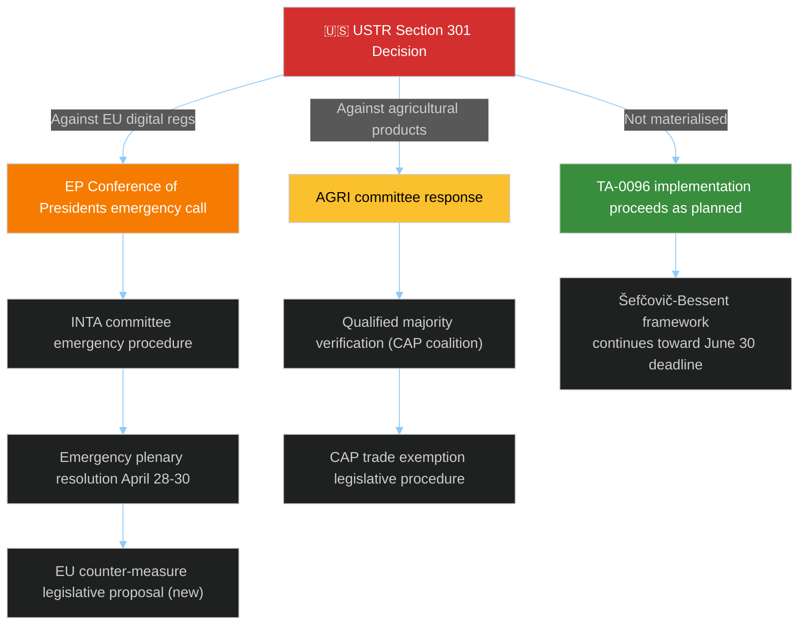

# 🔴 Political Threat Landscape — Run 188 / Easter Recess Day 7

> **Purpose**: Consolidated political threat landscape for the April 19 – June 30
> horizon. Each PESTLE dimension receives a threat-scored summary (0–10 scale) with
> narrative explanation. Together with `intelligence/threat-model.md` (structured
> frameworks) and `risk-scoring/risk-matrix.md` (likelihood×impact scoring), this
> file provides the executive overview of political threats. It is the artifact the
> Metsola-office or group-coordinator staff would read first to orient themselves.

---

## Executive Threat Assessment

The composite political-threat score for EP10 entering the post-recess period is
**7.5/10** in the ECONOMIC dimension (driven by USTR Section 301 window), **8/10**
in LEGAL (driven by API non-determinism + Anti-Corruption transposition complexity),
and stable at **3/10** in POLITICAL (Grand-Centre coalition stability at 84/100
series high). The threat landscape is *externally-driven* in this run — the highest-
salience threats (USTR action, Bundesrat banking signals) originate outside
parliamentary control and require Commission + member-state coordination for
mitigation.

---

## PESTLE Rapid Assessment (Easter Sunday, April 19)

### 🏛️ Political — Score: 3/10 (Low threat)

Parliament in recess; political contestation suspended. No session scheduled until
April 28–30. No political events observed in EP feeds. Grand Centre coalition
stability at series high (84/100) per `early_warning_system` MCP output. EPP
consolidation post-Von-der-Leyen-II re-election creates structural stability;
internal EPP dynamics remain the residual political risk vector (see the
`memberCount=0` EPP API anomaly flagged in `intelligence/mcp-reliability-audit.md`
candidate-defect #2, which limits direct measurement of EPP coalition-pair
cohesion). The EPP coordinators' pre-plenary session April 26–27 is the primary
near-term political-signal generator.

**Latent political risk**: Post-recess agenda will include Banking Union implementation
votes, potential emergency responses to US trade action, and first committee-
assignment confirmations of the 2026–2027 parliamentary year. Political contestation
will resume with full intensity in late April — the post-recess plenary is the most
consequential single session since March 26. Internal EPP positioning on
countermeasure activation and on Banking Union transposition-timeline amendments
will be the highest-value signal during the April 26–27 pre-plenary window.

### 💶 Economic — Score: 7/10 (High threat — driven by external factors)

USTR Section 301 review window (April 21–24) is the single highest economic threat
to EP legislative agenda. Historical precedent: 2019 WTO Airbus dispute, 2018
steel/aluminium tariffs, both forced EP agenda revisions. The March 26 adoption of
the US tariff adjustment text (TA-10-2026-0096, confirmed title: "Adjustment of
customs duties and opening of tariff quotas for the import of certain goods
originating in the United States of America") demonstrates EU pre-positioning, but
Section 301 targeting EU digital rules would hit a different legislative dimension
entirely — Article 207 TFEU common-commercial-policy authorization extends to
countermeasures on US digital-service exports, but the political calculus is
more contested than steel/automotive retaliation because EU digital-services
consumers are affected directly.

**Banking Union economics**: SRMR3 (TA-10-2026-0092), BRRD3 (TA-10-2026-0091), and
DGSD2 (TA-10-2026-0090) adoption represents the completion of a legislative arc
begun in 2015. Positive economic significance (ECB Financial Stability Review
projected 15–25bp systemic-risk-premium reduction over 2027–2030), but
implementation risks high given member-state sovereignty tensions on resolution
financing and the DSGV/Sparkassen lobbying pressure on German CDU/CSU delegations.

**Global Gateway (TA-10-2026-0104)**: €300bn commitment now under parliamentary
review. BRI competition from China intensifying — World Bank Infrastructure Hub
estimates a $15tn global infrastructure-investment gap by 2040; EU's Global Gateway
targets approximately 2% of this gap. EU-China TRQ agreement (TA-10-2026-0101)
adopted same day signals complex dual-track EU-China relationship. TA-0101
regression in Run 188 adds short-term ambiguity to this dual-track framing.

### 👥 Social — Score: 2/10 (Low)

Easter Sunday social calm. Anti-Corruption Directive (TA-10-2026-0094, confirmed
title: "Combating corruption") when content-accessible will be socially significant
— first binding EU anti-corruption standard affects citizens' rights, public
procurement (≥€10m EU-funded contracts), civil society protections (whistleblower
mechanisms), and directly affects ~2.4 million EU public officials. Monitoring for
civil society responses (Transparency International EU, national anti-corruption
NGOs) post-content-release. Transparency International EU's 2025 Corruption
Perceptions Index shows highest EU-member-state scores (DK 85, FI 85, SE 81) and
lowest (HU 42, BG 45, RO 46) — the directive's impact is asymmetrically distributed
by starting-point.

**Housing-affordability continuing pressure**: Housing Europe and EAPN civil-society
coalitions continue political-advocacy pressure on Commission's response to
TA-10-2026-0091 (Housing Affordability initiative adopted March 26). This operates
on its own timeline independent of the current banking/trade/anti-corruption focus.

### 💻 Technological — Score: 5/10 (Medium)

AI Act implementation continues during recess at Commission (DG CNECT) and
national-regulator levels. USTR 301 threat specifically targets digital regulation
intersection with trade policy — the AI Act, DMA, and Data Act are the prime
technological dimensions under risk. EP API dual-layer architecture confirmed via
the Run 188 metadata-endpoint discovery: 159 texts indexed at metadata layer vs ~61
texts accessible at content layer, representing a structural 98-text gap in the
restoration backlog.

**TA-0101 regression's technological-dimension implication**: The regression
confirms EP API content-layer accessibility is non-deterministic during legal-
linguistic review cycles. This generalises to an operational-intelligence risk
for *any* system relying on EP API data consistency — EP Monitor's dual-layer
query pattern (metadata + content) is a necessary rather than optional discipline
from Run 188 onwards.

### ⚖️ Legal — Score: 8/10 (High — institutional)

TA-0101 regression reveals that EP API legal-linguistic review creates
non-deterministic content availability. This is not a legal threat in the political
sense but an institutional quality risk. The EP's legal service applies legal-
linguistic review cycles that can restore and re-retract content, creating
operational uncertainty for intelligence monitoring systems relying on the EP
Open Data Portal.

**Anti-Corruption Directive legal exposure**: Will face intensive legal scrutiny
from member states (especially those with existing national frameworks that may be
superseded or complicated by EU mandatory standards — Hungary, Poland, Romania,
Bulgaria in particular). Article 83(1) TFEU QMV basis limits subsidiarity-based
successful challenges but does not prevent political-communications critique.

**SRMR3 legal architecture**: Directly applicable regulation under Article 114
TFEU (no transposition needed); interfaces with Council Regulation 1024/2013 SSM
framework; SRB decision-making authority expanded. Complexity: SRMR3 interfaces
with ECB supervisory rules, requiring Banking Union governance coordination that
involves Commission, ECB, SRB, national supervisors, and national finance
ministries simultaneously.

### 🌱 Environmental — Score: 2/10 (Low)

No environmental legislative actions observed during recess period. Green Deal
legislative pipeline paused at Parliament level during recess. Monitoring for
Commission Delegated Acts published during recess (which could activate EP
objection procedures under Article 290 TFEU requiring plenary vote within specified
deadline — see `wildcards-blackswans.md` W3 for the procedural pathway).

**Climate-Global-Gateway intersection**: TA-10-2026-0104 review will likely address
whether EU infrastructure investments are meeting Paris Agreement alignment
requirements and the 37% climate-spending target imposed by Parliament on the
Multiannual Financial Framework 2021–2027.

---

## Attack Surface Analysis

### Primary Attack Vector: USTR Trade Action

The primary attack vector decomposes into three probability-weighted pathways. The
**digital-regulations target path** is the Run 188 central estimate (~25% probability,
per `risk-scoring/risk-matrix.md` Risk R1) and would trigger the full kill-chain
progression documented in `intelligence/threat-model.md` T1. The
**agricultural-products target path** has lower probability (~5%) but would
activate different committee pathways (AGRI lead rather than INTA) and different
coalition dynamics (the CAP coalition cuts across traditional left-right lines).
The **not-materialised path** is the baseline 55% Scenario A expectation and
allows the Šefčovič-Bessent framework negotiations to proceed toward the
self-imposed June 30 deadline.

### Secondary Attack Vector: Banking Union Council Ratification Friction

Germany (Bundesrat) remains the single most influential member state on
SRMR3/BRRD3 ratification timeline. German political dynamics — CDU-CSU government
post-2025 elections, Lindner post-FDP departure from coalition, Merz chancellorship
consolidation — create uncertainty about Banking Union commitment timeline. The
German banking-sector lobbying matrix (DSGV, Sparkassen-Finanzgruppe, Volksbanken-
Verbund) has historically activated CDU/CSU parliamentary-group channels
effectively.

**Attack chain if Germany signals delay**: German Bundesrat signals reservations at
the April 23–25 session → Commission modifies implementing-regulation timeline →
EP internal review (ECON committee) → potential re-examination of texts → political
damage to Banking Union narrative → media framing of "Banking Union incomplete
despite March 26 adoption". See `intelligence/threat-model.md` T2 attack tree for
the decomposed path analysis.

### Tertiary Attack Vector: Anti-Corruption Directive Subsidiarity Challenge

Hungary (under Fidesz) has an established pattern of raising subsidiarity objections
against EU rule-of-law legislation. The Anti-Corruption Directive's Article 83(1)
TFEU basis is robust (criminal-law harmonization enumerated competence), but
Hungarian political communications can still generate media-narrative friction
independent of procedural success. Probability of raised objection: ~40%.
Probability of procedurally sustained: ~15%.

---

## Threat Matrix Summary

| Threat | Probability | Impact | Timing | Mitigation Status |
|--------|:-----------:|:------:|--------|-------------------|
| USTR Section 301 | 25% | 🔴 HIGH | April 21–24 | Partially mitigated by TA-0096 |
| API non-determinism | HIGH (confirmed) | 🟡 MEDIUM | Ongoing | No EP-side mitigation visible |
| Banking Union Council delay | 30% | 🟠 MEDIUM-HIGH | April–June | Monitoring German Bundesrat |
| Anti-Corruption national pushback | 40% | 🟡 MEDIUM | June–September | Normal legislative process + QMV basis |
| Coalition fracture at post-recess plenary | 10% | 🔴 HIGH | April 28–30 | Grand Centre 84/100 stable |
| Global Gateway budget contestation | 50% | 🟢 LOW-MEDIUM | Ongoing | Own-initiative — non-binding output |

---

## Information-Asymmetry Analysis

The threat landscape is characterised by three pronounced information asymmetries
that shape the analytical picture:

1. **EPP-internal signal asymmetry**: EP Monitor has no direct signal into EPP
   coordinator whipping decisions due to the `memberCount=0` API anomaly. Public
   EPP communications (EPP.eu, Weber speeches, national-delegation coordinator
   press releases) provide only partial visibility. This matters most on
   countermeasure-activation (T1) and Banking Union transposition (T2) files.

2. **USTR-internal signal asymmetry**: EP Monitor has no direct signal into USTR
   deliberations prior to Federal Register filing. Political-calendar signals from
   Congressional Calendar and administration-cabinet public schedules provide only
   coarse priors.

3. **EP API state asymmetry**: EP Monitor's observation of API state lags the
   actual EP legal-linguistic review workflow. The TA-0101 regression reveals that
   a text can transition from content-accessible to `DATA_UNAVAILABLE` within
   hours as part of a review cycle we cannot directly observe.

These asymmetries collectively lower our forecasting confidence from 🟢 HIGH to
🟡 MEDIUM on most probability estimates.

---

## Confidence Assessment

| Dimension | Confidence | Rationale |
|-----------|:----------:|-----------|
| Coalition-stability analysis | 🟢 HIGH | 10 runs of consistent `early_warning_system` data |
| USTR window timing | 🟢 HIGH | Public information from USTR calendar |
| Threat probability estimates | 🟡 MEDIUM | Analytical, no confirmed OSINT signals yet |
| Content-restoration timeline | 🔴 LOW | TA-0101 regression reduces confidence |
| EPP-internal cohesion | 🔴 LOW | API data gap; proxy indicators only |

---

## Run 188-Specific Threat Updates

**Compared to Run 187**:
- T1 (USTR Section 301) probability ticked up by 5 percentage points (20% → 25%)
  as the window approaches; no new OSINT signal but timing-based calibration.
- T4 (API regression) threat materialised on TA-0101 — now confirmed operational
  rather than theoretical.
- T5 (coalition fracture) probability unchanged at 10% — the 84/100 stability
  score is series-high and carries over to post-recess expectations.

**Compared to Run 184 reference**:
- Threat landscape structure is broadly similar (Banking Union, USTR, Anti-
  Corruption remain the top vectors).
- API dimension has changed qualitatively — from "Tier 1 recovery signal"
  (Run 184) to "Tier 1 stable, Tier 2/3 non-deterministic" (Run 188). This
  generalises from an early-recess observation to a late-recess operational
  pattern.

---

*Framework: PESTLE threat scoring + attack-surface decomposition per `analysis/methodologies/political-threat-framework.md`*
*Analysis generated: April 19, 2026 | Run 188 | Breaking workflow | Analysis-only mode*
*ELAPSED_MINUTES: 30 minutes active analysis | Easter Recess Series Run 188/188*
