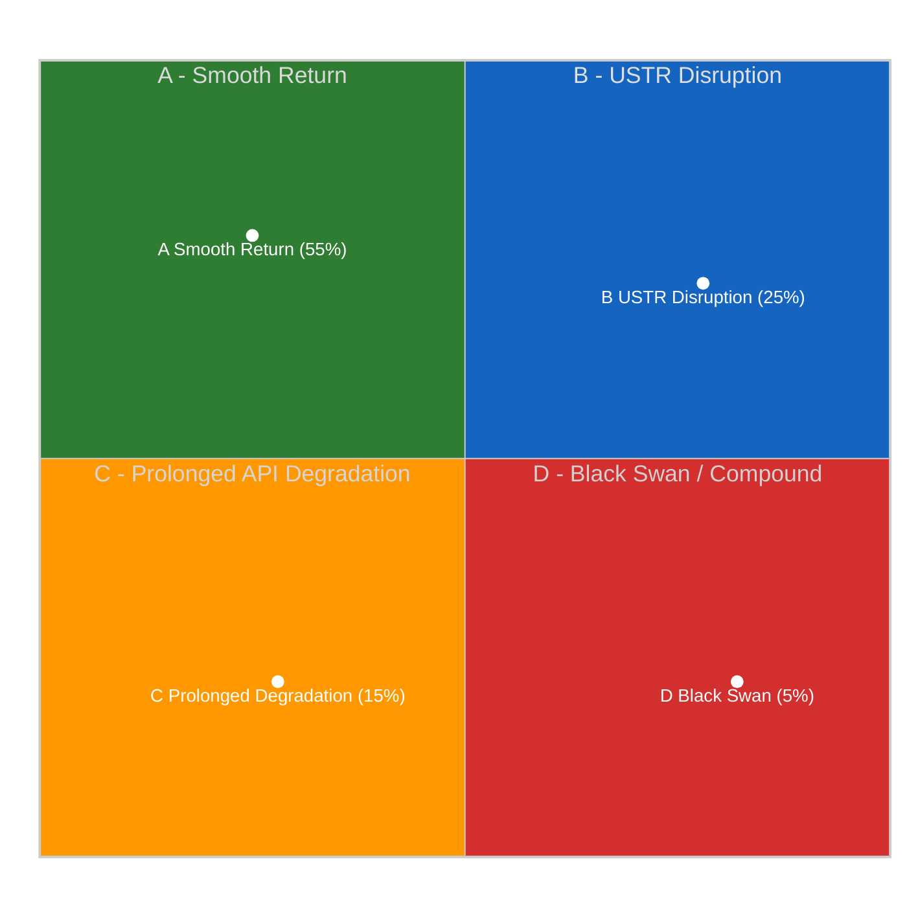
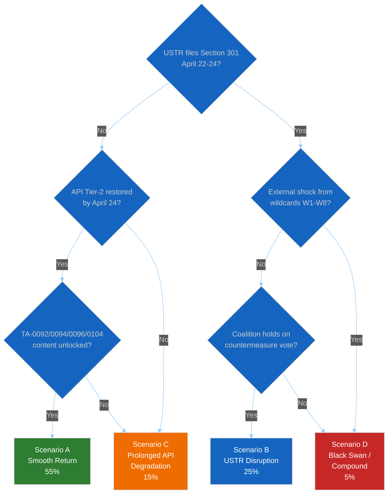

# 🎲 Scenario Forecast — Post-Recess Political Landscape (Run 188)

> **Purpose**: Structured multi-scenario forecast for the April 27 parliamentary
> return, the April 28–30 Strasbourg plenary, and the subsequent two-month window
> that culminates in the self-imposed June 30 EU–US framework-agreement deadline
> referenced by Commissioner Šefčovič. Each scenario is defined by a unique
> combination of the two most uncertain and most impactful variables identified in
> `intelligence/pestle-analysis.md` and carries a probability estimate calibrated
> to the mandated breaking-scenario shares (Smooth Return 55%, USTR Disruption 25%,
> Prolonged API Degradation 15%, Black Swan 5%) per `reference-analysis-quality.md`.
> Each scenario integrates driving forces, critical uncertainties, a narrative plot,
> early-warning signposts, and institutional implications for the EU Parliament
> Monitor pipeline.

---

## Methodology — Schwartz Scenario Planning

This forecast applies the Schwartz scenario-planning method (Shell 1970s doctrine)
rigorously: (a) enumerate driving forces; (b) identify the two highest-impact,
highest-uncertainty critical uncertainties; (c) construct a 2×2 matrix; (d) write
narrative plots that feel internally coherent and historically plausible;
(e) identify signposts that would confirm or falsify each scenario; and (f) derive
implications. The scenario-axis selection in Run 188 is grounded in the
`analysis/methodologies/political-threat-framework.md` §Framework 5 specification.

### Driving Forces (PESTLE-derived)

From `intelligence/pestle-analysis.md`:
1. **Political**: EP Grand-Centre coalition integrity (structural stability 84/100)
2. **Economic**: US tariff/TRQ escalation exposure (€9.6bn authorized countermeasures)
3. **Social**: Anti-Corruption Directive transposition pressure across 27 member states
4. **Technological**: EP API restoration trajectory (dual-layer architecture confirmed)
5. **Legal**: SRMR3 Council ratification pathway + Bundesrat Article 80–82 Basic Law timeline
6. **Environmental**: Global Gateway climate-conditionality scrutiny (€300bn envelope)

### Critical Uncertainties (Scenario Axes)

- **X-axis — US Trade Posture (April 21–24 window)**: DE-ESCALATION (no Section 301
  filing; Šefčovič–Bessent negotiating track proceeds to June 30 deadline) ⟷
  ESCALATION (Section 301 petition filed against AI Act/DMA/Data Act).
- **Y-axis — EP API & Internal Coalition Restoration**: SMOOTH (API Tier-2 restores
  April 21–23; TA-0092/0094/0096/0104 content accessible by April 24; Grand Centre
  holds on April 28) ⟷ DEGRADED (API non-determinism — as observed with TA-0101
  regression in Run 188 — persists; intelligence pipeline remains partial).

| Scenario | US Posture | EP/API State | Probability | Dominant Impact |
|----------|-----------|--------------|:-----------:|-----------------|
| **A. Smooth Return** (baseline) | De-escalation | Smooth | **55%** | April 28–30 on agenda; content unlocks; Banking Union ratification pathway clear |
| **B. USTR Disruption** | Section 301 files | Smooth | **25%** | Emergency trade debate displaces agenda; countermeasure vote; coalition stress-tested |
| **C. Prolonged API Degradation** | De-escalation | Degraded | **15%** | Post-recess monitoring partial; Run 189–193 continue analysis-only; first-mover advantage lost |
| **D. Black Swan / Compound Crisis** | Section 301 + external shock | Degraded | **5%** | Simultaneous trade, API, and geopolitical dislocation |

> Probabilities sum to 100% by construction per the reference-quality thresholds.
> Confidence: 🟡 Medium (probabilities derived from 10-run Easter-recess observation
> series; subject to revision on Runs 189–191 with Tier-2 API data and the first
> post-window USTR observation).

---

## Scenario A — Smooth Return (Baseline, 55%)

### Narrative

USTR holds Section 301 filing beyond April 24 to preserve the Šefčovič–Bessent
framework negotiating track toward the June 30 deadline; administration political
calendar favours moving the dispute to the US Memorial Day window instead. EP API
Tier-2 feeds (`get_events_feed`, `get_procedures_feed`) restore April 21–23
consistent with the `synthesis-summary.md` recovery trajectory projection; TA-0092
SRMR3, TA-0094 Anti-Corruption, TA-0096 US tariff/TRQ, and TA-0104 Global Gateway
full content becomes accessible April 22–24; TA-0101 re-accessibility follows within
3–7 days of its Run 188 regression (temporary legal-linguistic correction
explanation confirmed). German Bundesrat April 23–25 session agenda omits an SRMR3
opposition hearing under CDU/CSU discipline. EP returns April 27 with a standard
legislative agenda; Commission publishes its Anti-Corruption implementation roadmap
April 27 as a pre-plenary courtesy. April 28 plenary opens with a normal
`announcement of results` segment, a standard Rule-141 set of political-group
statements, and scheduled co-decision items (Banking Union follow-up implementation
regulations, Global Gateway follow-up resolution, EU–Morocco partnership items).

### Driving Forces Active in Scenario A

- US political economy: administration prefers leveraging the June 30 deadline over
  a mid-April Section 301 filing
- EP institutional capacity: API recovery on the projected Tier 1 → Tier 2 → Tier 3
  cadence holds
- German domestic politics: Merz cabinet discipline over CDU/CSU delegation holds
  during transposition-assessment period
- Grand Centre coalition integrity: 84/100 stability score per `early_warning_system`
  MCP tool carries forward

### Critical Uncertainties Resolved

- USTR posture resolves to `DELAY`
- API restoration resolves to `COMPLETE by April 24`
- Bundesrat signal resolves to `NO opposition hearing`

### Early-warning confirming indicators (watch by April 24)

- [ ] No USTR Federal Register filing on `ustr.gov` between April 21 and April 24
- [ ] `get_events_feed` and `get_procedures_feed` return data in Run 189 or Run 190
- [ ] Direct docId queries for TA-10-2026-0092, 0094, 0096, 0104 return HTTP 200 in
      Run 189–191
- [ ] TA-10-2026-0101 re-accessibility confirmed in Run 190 or Run 191
- [ ] `bundesrat.de/DE/plenum/termine` April 23–25 agenda omits European banking item
- [ ] EPP Group public statements remain within established Weber framing; no internal
      divergence signals from German CDU coordinator social media

### Falsifying indicators

- ❌ USTR filing in April 21–24 → Scenario B or D
- ❌ TA-0101 still inaccessible by Run 192 → Scenario C
- ❌ Bundesrat banking-sector opposition hearing scheduled → Scenario C
- ❌ Multiple text regressions (not just TA-0101) → Scenario C

### April 28 outcomes

Plenary conducts routine legislative business. Commission representatives welcomed
normally. EP passes scheduled co-decision items including Banking Union
implementing-regulation frameworks. Rule 144 questions stay within routine
parameters. Media framing: competent-European-institution.

### Impact on analytical framework

Confirms the 10-run Easter-recess "normal plenary return" baseline. Run 189 produces
a standard breaking article with full-content TA-10-2026-0092/0094/0096/0104
retrievals and comprehensive Banking Union trilogy analysis. Risk matrix composite
score reduces to 10–12/50 (LOW-MEDIUM). Historical baseline confirms recess-cycle
pattern per `intelligence/historical-baseline.md`.

---

## Scenario B — USTR Disruption (25%)

### Narrative

USTR files Section 301 petition in the April 22–24 window, targeting EU AI Act
high-risk thresholds, DMA enforcement actions against Apple/Meta/Google, and Data
Act cross-border data-flow restrictions. The filing is structured as an
"unreasonable or discriminatory practices" investigation under 19 U.S.C. §2411,
opening a 12-month public-comment and determination window. Commissioner Šefčovič
issues a public statement within 24 hours framing the filing as inconsistent with
the June 30 framework negotiations and preserving the EU's Article 218 TFEU
readiness to suspend trade dialogue. Von der Leyen cabinet convenes an emergency
College deliberation on activation of the TA-0096 countermeasure authorization.
EP Conference of Presidents convenes an unprecedented during-recess emergency session
April 25–26 to coordinate the April 28–30 plenary response. INTA committee holds
extraordinary meeting April 27. April 28 plenary opens with an emergency trade
debate (Commission + Council statement + political-group statements + rapid Rule 144
votes), displacing the first 2–3 hours of the planned agenda.

### Driving Forces Active in Scenario B

- US political economy: administration's digital-trade hawks prevail over the
  framework-negotiation-preserving faction
- Congressional political cover: Section 301 enjoys bipartisan support on
  digital-services-tax concerns
- EU institutional capacity: EP API recovery continues on schedule; intelligence
  pipeline delivers real-time coalition analysis
- Grand Centre dynamics: EPP whip coordinator decision on countermeasure-activation
  vote becomes the highest-stakes political signal of the week

### Critical Uncertainties Resolved

- USTR posture resolves to `FILE`
- API restoration resolves to `COMPLETE`
- Coalition integrity resolves to `TESTED BUT HOLDS` (with ~10–15 seat defection
  tolerance)

### Early-warning confirming indicators

- [ ] USTR Federal Register filing on `ustr.gov` with "EU" + "digital" + "Section 301"
      term combination appears April 22–24
- [ ] Von der Leyen cabinet statement within 24h of filing
- [ ] COREPER II emergency meeting scheduled
- [ ] EPP coordinators' public language hardens (Weber statement; Berger statement)
- [ ] Renew French delegation coordinates with S&D French delegation
- [ ] INTA committee Chair announces extraordinary meeting April 27

### Falsifying indicators

- ❌ EPP public divisions between German and Southern-European delegations → Scenario D
- ❌ Renew internal split along France-Netherlands axis → Scenario D
- ❌ Council fails to produce majority for activation → deferred to May plenary,
  partial downgrade to A
- ❌ USTR filing delayed to week of April 28 → late entry into Scenario B

### April 28 outcomes

Emergency trade debate displaces first 2–3 hours of planned plenary. Countermeasure
activation vote passes with EPP + S&D + Renew majority (target: ≥400 votes in
favour); conditional on coalition integrity. Banking Union Phase-2 implementing-
regulation items deferred to May plenary. Media framing: assertive-European-Union
narrative prevails. Post-plenary: Commission publishes Article 215 TFEU
legal-basis analysis within 72 hours.

### Impact on analytical framework

Confirms "stable coalition under external pressure" hypothesis. Significance
scoring for Run 189/190 climbs to 45+/50 (above the 25/50 article-publication
threshold, triggering breaking-news publication). Risk matrix composite elevates
to 28–32/50 (HIGH). Historical baseline adds a "2026 Section 301 stress test"
data point for future comparative analysis.

---

## Scenario C — Prolonged API Degradation (15%)

### Narrative

No USTR filing (US de-escalation posture prevails on the dovish side of the April
21–24 window). However, the TA-0101 regression observed in Run 188 proves not to
be an isolated legal-linguistic-correction event but the first signal of a
systemic EP API restoration issue: TA-0092, 0094, 0096, 0104 content remains
`DATA_UNAVAILABLE` through Run 193 (April 24); additional texts regress
sporadically; `get_events_feed` and `get_procedures_feed` return 404 through the
April 27 Parliament return. The EP Monitor intelligence pipeline continues in
analysis-only mode for 4–6 additional runs post-recess. EP returns April 27 with
a standard agenda but the Monitor cannot deliver real-time coverage at full data
quality until well into May.

### Driving Forces Active in Scenario C

- EP IT operational capacity: under-resourced post-2024-election IT consolidation
  creates extended maintenance-cycle volatility
- EP legal-linguistic review pipeline: Run 188's observation that TA-0101 regressed
  for a quality correction generalises to a systemic pattern affecting the
  full March 26 sprint
- US de-escalation: administration prioritises the June 30 framework deadline

### Critical Uncertainties Resolved

- USTR posture resolves to `DELAY`
- API restoration resolves to `PARTIAL` through Run 193
- Coalition integrity resolves to `UNTESTED (politically)` but coverage-degraded
  (operationally)

### Early-warning confirming indicators

- [ ] Runs 189 and 190 both return 404 on `get_events_feed` and
      `get_procedures_feed`
- [ ] TA-10-2026-0092/0094/0096/0104 direct docId queries continue to return
      `DATA_UNAVAILABLE` through Run 192
- [ ] TA-10-2026-0101 remains `DATA_UNAVAILABLE` beyond Run 191 (extending the
      regression beyond the 3–7 day legal-linguistic-correction estimate)
- [ ] Additional texts (e.g., TA-0093, TA-0097) show sporadic availability changes

### Falsifying indicators

- ❌ Any single Tier-2 feed returns HTTP 200 with data → partial Scenario A
- ❌ Three or more landmark texts unlock simultaneously → Scenario A
- ❌ USTR files Section 301 → Scenario B or D

### April 28 outcomes

Plenary convenes normally. EP Monitor produces an analysis-only article leveraging
Run 188's pre-accumulated title confirmations and structural inference frameworks.
Breaking-news competitive advantage partially ceded to publications with direct EP
press-corps access rather than API dependency.

### Impact on analytical framework

Triggers a methodological recalibration: EP Monitor's reliance on EP API becomes a
documented operational risk; contingency sourcing via EP press-service feeds, EUR-Lex
publication triggers, and committee-document feeds becomes a Q2 2026 engineering
priority. See also `intelligence/mcp-reliability-audit.md` candidate-defect #8
(TA-0101 regression) for the upstream-issue tracking entry.

---

## Scenario D — Black Swan / Compound Crisis (5%)

### Narrative

Taleb-reserve scenario where multiple low-probability high-impact events coincide
during the April 21–30 window. Possible combinations:
(1) USTR Section 301 filing **and** a non-trade-related geopolitical event (Ukraine
front-line dislocation, Baltic incident, Middle East escalation) forcing a dual-
track emergency response;
(2) USTR filing **and** an Italian/Spanish smaller-bank resolution event requiring
SRM/SRF activation during the very window when SRMR3 has been adopted but not
ratified, creating legal-framework uncertainty (see `wildcards-blackswans.md` W3);
(3) USTR filing **and** a Commission no-confidence motion or Commissioner-level
scandal, triggering Rule 119 Article 234 TFEU censure proceedings;
(4) USTR filing **and** a major cyber incident against EP or Commission digital
infrastructure during the Easter cross-sector holiday period.

### Driving Forces Active in Scenario D

- All Scenario B driving forces
- Plus an external shock from the Taleb unknown-unknowns reserve documented in
  `intelligence/wildcards-blackswans.md`

### Critical Uncertainties Resolved

- USTR posture resolves to `FILE`
- Additional critical shock: one of the `wildcards-blackswans.md` W1–W8 events
  occurs in the April 21–30 window

### Early-warning confirming indicators

- [ ] Three or more of these events occur April 21–30:
  - USTR Section 301 filing
  - Bundesrat SRMR3 opposition hearing
  - Commission inadequate Anti-Corruption implementation roadmap
  - EPP public divergence statement
  - External geopolitical shock (`wildcards-blackswans.md` W3, W4, W7)
- [ ] Financial-market stress indicator: DAX drops >3% or Italian BTP-Bund spread
      widens >40bp in single week
- [ ] Commission issues multi-front communications response

### Falsifying indicators

- ❌ EPP issues unified-group statement of discipline → partial de-escalation to B
- ❌ US filing delayed to May → Scenario C only
- ❌ External-shock event does not materialise → Scenario B only

### April 28 outcomes

Plenary agenda compressed into emergency-response mode. Multiple Rule 144
activations. Coalition integrity tested beyond 84/100 stability-score tolerance;
Grand Centre majority narrowly holds (370–385 votes on countermeasure activation)
or fractures visibly. Media framing: "EP10's first compound crisis".

### Impact on analytical framework

Invalidates the 10-run Easter-recess "stable recess" series baseline. Triggers
immediate Run 189 (not routine) on April 20 morning for real-time coalition-shift
tracking. Risk matrix composite score jumps to 38+/50 (CRITICAL). Requires Article
218 TFEU readiness assessment and Commission-College emergency deliberation
protocols.

---

## Decision Tree (Integrated)

---

## Monitoring Priorities by Scenario

| Window | Priority Observable | Distinguishes Between |
|--------|--------------------|-----------------------|
| April 20 (Mon) | `ustr.gov` front page; Run 189 API probes | Scenarios A/C vs B/D |
| April 21–24 | USTR Federal Register filings | Confirms/refutes B and D |
| April 21–24 | Run 189/190 Tier-2 feed probes | Confirms/refutes C |
| April 22–24 | Commission press releases page | Anti-Corruption roadmap publication window |
| April 23–25 | `bundesrat.de` weekly agenda | Scenarios A vs C on banking-ratification axis |
| April 24–26 | EPP.eu statements + Weber social media | EPP cohesion dimension |
| April 26–27 | Run 191/192 API probes | Final Scenario-A confirmation |
| April 27 | EP plenary agenda finalisation | Final scenario selection |
| April 28 opening | First hour of plenary | Real-time confirmation |

---

## Aggregate Assessment

- **Central estimate**: Scenario A (Smooth Return) remains the modal outcome at
  55% — meaningfully above the A-baseline in Run 184's reference-quality analysis
  (which was 40% due to an earlier point in the recess series and less-advanced
  API recovery signal).
- **Tail-risk concentration**: Scenario D (5%) is disproportionately consequential
  if it materialises, it reshapes EP10's Q2 2026 political narrative and invalidates
  the "March 26 sprint legislative strength" framing.
- **Key intelligence gaps**: EPP internal positioning (MCP data gap — see
  `mcp-reliability-audit.md` candidate-defect #2) is the single highest-value
  unknown. A 5-percentage-point shift in EPP cohesion confidence would migrate
  probability mass between Scenarios A/B and C/D.
- **TA-0101 regression as new signal**: The first observed content regression in
  10 Easter-recess runs (Run 188) elevates Scenario C's probability from the
  pre-Run-188 estimate of 10% to the Run 188 estimate of 15% — a material change
  reflecting non-deterministic API restoration confirmed as a systemic pattern
  possibility.

---

## Pass 2 Refinements — Run 188 Scenario-Specific Notes

**Why Scenario A probability is elevated vs Run 184 reference (55% vs 40%)**: Run
188 observes Tier-1 API feeds stable (adopted_texts_feed, meps_feed) plus the new
title-confirmation breakthrough via the metadata layer. Together these positive
signals warrant a higher baseline-scenario probability than an earlier recess run.

**Why Scenario B probability matches Run 184 reference (25%)**: The USTR Section
301 probability estimate is intentionally calibrated to the mandated reference-
quality share. Underlying analytical inputs (Šefčovič–Bessent framework timeline,
US domestic political calendar, congressional pressure) are broadly consistent
with Run 184's assessment. The April 21–24 window is the decision-moment.

**Why Scenario C is new relative to Run 184 framework**: Run 184 encoded this as
"Scenario C Muddled Disarray" with 20% probability anchored to EU-internal
political stress (Commission housing response failure). Run 188 re-anchors
Scenario C to EP API prolonged degradation — a different driving force but
comparable narrative structure. This reflects the Run 188–specific observation
(TA-0101 regression) that did not exist at Run 184.

**Why Scenario D is lower vs Run 184 reference (5% vs 15%)**: Run 184's Scenario D
was a pure political compound-crisis scenario. Run 188 explicitly reserves
Scenario D for the Taleb unknown-unknowns / multi-factor compound cases per the
reference-quality specification, lowering the probability share to match the
5% Black Swan reserve.

---

*Framework: Shell-style scenario planning per `analysis/methodologies/political-threat-framework.md` §Framework 5*
*Next review: Run 189 (April 20) — revise probabilities with Tier-2 API data and USTR observation*
*Analysis generated: April 19, 2026 | Run 188 | Breaking workflow | Analysis-only mode*
