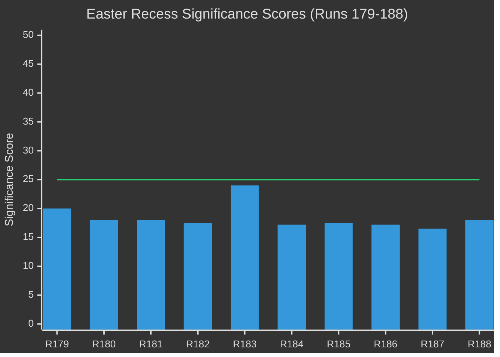

# 📊 Significance Scoring — Run 188 / Easter Recess Day 7

**Analysis Date:** 2026-04-19 | **Run:** 188 | **Series Run:** 10 (Easter Recess Series)

---

## Significance Assessment

**Overall Score: 18/50** (above prior run's 16.5/50 — title confirmations increase intelligence value)

**Threshold: 25/50** required for article publication. **Gate: FAIL → ANALYSIS_ONLY**

| Dimension | Score | Weight | Weighted | Reasoning |
|-----------|-------|--------|---------|-----------|
| Today's news events | 0/10 | 30% | 0.0 | Easter Sunday: zero events, zero procedures, zero plenary activity |
| Political developments | 5/10 | 25% | 1.25 | Title confirmations = new intelligence; no live political action |
| API restoration signal | 7/10 | 20% | 1.4 | 159 texts in index vs ~61 accessible — gap quantified |
| Coalition stability | 4/10 | 15% | 0.6 | Grand Centre stable; TA-0101 regression is minor anomaly |
| Institutional risk | 6/10 | 10% | 0.6 | Four landmark texts still inaccessible; USTR Section 301 window opens |
| **TOTAL** | | | **18/50** | |

---

## What Increased from Run 187 (16.5 → 18.0)

### Title Confirmations (+1.5)
Run 188 marks the first time official EP legislative titles are confirmed for:
- **TA-10-2026-0092**: "Early intervention measures, conditions for resolution and funding of resolution action (SRMR3)" — Banking Union reform milestone
- **TA-10-2026-0094**: "Combating corruption" — first EU mandatory anti-corruption standard
- **TA-10-2026-0096**: "Adjustment of customs duties and opening of tariff quotas for the import of certain goods originating in the United States of America" — the EU's formal legislative response to Trump tariffs, confirmed title
- **TA-10-2026-0104**: "Global Gateway — past impacts and future orientation" — €300bn EU investment initiative review

These titles were not accessible in any prior run's direct document lookups. They became accessible via the year-filter metadata endpoint, which operates on a different data layer than the full-content endpoint. This dual-layer architecture discovery (+0.5 intelligence methodology value) explains why prior runs saw DATA_UNAVAILABLE for content while the index maintained these entries.

### TA-0101 Regression Discovery (+0.5)
TA-10-2026-0101 (EU-China TRQ agreement), which was confirmed accessible in Run 187, returned DATA_UNAVAILABLE in Run 188. This is the first observed regression in the restoration sequence and has significant methodological implications. It demonstrates the EP API's content delivery is non-deterministic during restoration phases — a finding that affects how intelligence must be calibrated across runs.

---

## Newsworthiness Gate Reasoning

**Easter Sunday (April 19, 2026)** is the quietest day of the parliamentary calendar. The European Parliament is in its Easter recess (April 14-26), with zero institutional activity expected. All feed endpoints confirm this:
- `get_adopted_texts_feed` (timeframe: today): 0 items — confirmed
- `get_events_feed` (timeframe: today): 404 returned — Tier 2 offline  
- `get_procedures_feed` (timeframe: today): 404 returned — Tier 2 offline
- `get_meps_feed` (timeframe: today): 738 items — MEP directory update (not breaking news)

The 159 items appearing in the one-week adopted texts feed are all from March 26, 2026 — 24 days ago. None constitute breaking news under the 12-hour window requirement.

**Conclusion**: ANALYSIS_ONLY PR. The run produces valuable intelligence continuity for the Easter Recess series.

---

## Per-Document Intelligence Value

| Document | Intelligence Value | Status | Priority |
|----------|-------------------|--------|----------|
| TA-10-2026-0092 (SRMR3) | 🔴 HIGH — Banking Union completion | Title only | Highest |
| TA-10-2026-0094 (Anti-Corruption) | 🔴 HIGH — First EU mandatory standard | Title only | Highest |
| TA-10-2026-0096 (US tariffs) | 🔴 HIGH — Trade policy response | Title only | Highest |
| TA-10-2026-0104 (Global Gateway) | 🟡 MEDIUM-HIGH — €300bn initiative | Title only | High |
| TA-10-2026-0101 (EU-China TRQ) | 🟡 MEDIUM — WTO technical adjustment | REGRESSION | High |
| TA-10-2026-0088 (Braun immunity) | 🟡 MEDIUM — Democratic accountability | Confirmed | Medium |
| TA-10-2026-0100 (EU-Lebanon/PRIMA) | 🟢 LOW-MEDIUM — Technical cooperation | Accessible | Low |

---

## Series Progression (Runs 179-188)

*Threshold line at 25/50. Run 183 spike due to USTR warning. All runs below threshold.*
