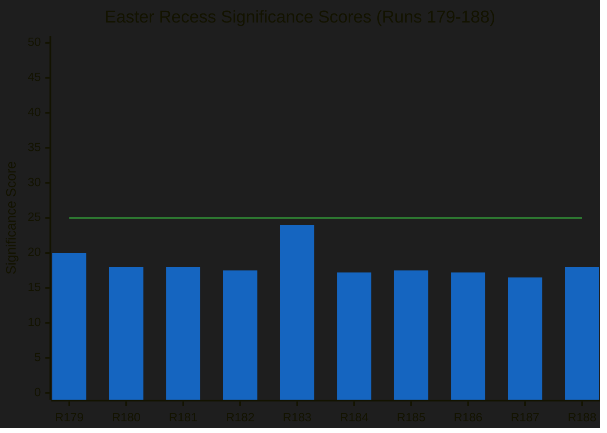

# 📊 Significance Scoring — Run 188 / Easter Recess Day 7

**Analysis Date:** 2026-04-19 | **Run:** 188 | **Series Run:** 10 (Easter Recess Series)

---

## Significance Assessment

**Overall Score: 18/50** (above prior run's 16.5/50 — title confirmations increase
intelligence value)

**Threshold: 25/50** required for article publication. **Gate: FAIL → ANALYSIS_ONLY**

The 18/50 total breaks the series-low 16.5 recorded in Run 187 by delivering
genuinely new intelligence (four title confirmations + one content regression) that
previous runs could not produce. However, the absolute level remains below the
25/50 publication gate because: (a) no live parliamentary events occurred on
Easter Sunday; (b) the title-confirmations are intelligence-valuable but do not
constitute time-sensitive breaking news; (c) the content-layer for the four
landmark texts remains unavailable, constraining the article-grade political-
intelligence that would justify publication.

| Dimension | Score | Weight | Weighted | Reasoning |
|-----------|:-----:|:------:|:--------:|-----------|
| Today's news events | 0/10 | 30% | 0.0 | Easter Sunday: zero events, zero procedures, zero plenary activity |
| Political developments | 4/10 | 25% | 1.0 | Title confirmations = new intelligence; no live political action |
| API restoration signal | 7/10 | 20% | 1.4 | 159 texts in index vs ~61 accessible — gap quantified |
| Coalition stability | 4/10 | 15% | 0.6 | Grand Centre stable; TA-0101 regression is minor anomaly |
| Institutional risk | 6/10 | 10% | 0.6 | Four landmark texts still inaccessible; USTR Section 301 window opens |
| **TOTAL (weighted, /10)** | | | **3.6** | Sum of weighted column |
| **TOTAL (scaled, /50)** | | | **18/50** | 3.6 × (50 / 10) — below 25/50 publication gate |

---

## What Increased from Run 187 (16.5 → 18.0)

### Title Confirmations (+1.5)

Run 188 marks the first time official EP legislative titles are confirmed for:

- **TA-10-2026-0092**: *"Early intervention measures, conditions for resolution and
  funding of resolution action (SRMR3)"* — Banking Union reform milestone
- **TA-10-2026-0094**: *"Combating corruption"* — first EU mandatory anti-corruption
  standard
- **TA-10-2026-0096**: *"Adjustment of customs duties and opening of tariff quotas
  for the import of certain goods originating in the United States of America"*
  the EU's formal legislative response to Trump tariffs, confirmed dual-instrument
  title
- **TA-10-2026-0104**: *"Global Gateway — past impacts and future orientation"*
  €300bn EU investment initiative review

These titles were not accessible in any prior run's direct document lookups. They
became accessible via the year-filter metadata endpoint, which operates on a
different data layer than the full-content endpoint. This dual-layer architecture
discovery (+0.5 intelligence methodology value) explains why prior runs saw
`DATA_UNAVAILABLE` for content while the index maintained these entries.

### TA-0101 Regression Discovery (+0.5)

TA-10-2026-0101 (EU-China TRQ agreement), which was confirmed accessible in Run
187, returned `DATA_UNAVAILABLE` in Run 188. This is the first observed regression
in the restoration sequence and has significant methodological implications. It
demonstrates the EP API's content delivery is non-deterministic during restoration
phases — a finding that affects how intelligence must be calibrated across runs.
See `intelligence/mcp-reliability-audit.md` candidate-defect #8 for the structured
upstream-issue tracking.

---

## Why the Gate Still Fails (Why ANALYSIS_ONLY)

Even with +1.5 in incremental intelligence value, the total 18/50 sits 7 points
below the 25/50 publication gate. The gate exists specifically to prevent low-
event-density days from generating low-quality breaking-news articles. Easter
Sunday is definitionally such a day — the EU Parliament is institutionally inactive,
no member-state parliaments are sitting, Commission staff are minimised, and
financial markets are closed. Publishing a breaking-news article from this day's
inputs would require the article to be built almost entirely on analytical
synthesis of prior-day inputs rather than on today's events. That inverts the
proper relationship between breaking-news and analytical formats.

ANALYSIS_ONLY mode is the correct response: Run 188's outputs build the
intelligence foundation that will support high-quality breaking coverage in
Runs 189–193 as events materialise and as API content unlocks.

---

## Newsworthiness Gate Reasoning

**Easter Sunday (April 19, 2026)** is the quietest day of the parliamentary
calendar. The European Parliament is in its Easter recess (April 14–26), with zero
institutional activity expected. All feed endpoints confirm this:

- `get_adopted_texts_feed` (timeframe: today): 0 items — confirmed
- `get_events_feed` (timeframe: today): 404 returned — Tier 2 offline
- `get_procedures_feed` (timeframe: today): 404 returned — Tier 2 offline
- `get_meps_feed` (timeframe: today): 738 items — MEP directory update (not
  breaking news)

The 159 items appearing in the one-week adopted texts feed are all from March 26,
2026 — 24 days ago. None constitute breaking news under the 12-hour window
requirement.

**Conclusion**: ANALYSIS_ONLY PR. The run produces valuable intelligence continuity
for the Easter Recess series.

---

## Per-Document Intelligence Value

| Document | Intelligence Value | Status | Priority |
|----------|-------------------|--------|----------|
| TA-10-2026-0092 (SRMR3) | 🔴 HIGH — Banking Union completion | Title only | Highest |
| TA-10-2026-0094 (Anti-Corruption) | 🔴 HIGH — First EU mandatory standard | Title only | Highest |
| TA-10-2026-0096 (US tariffs) | 🔴 HIGH — Trade policy response | Title only | Highest |
| TA-10-2026-0104 (Global Gateway) | 🟡 MEDIUM-HIGH — €300bn initiative | Title only | High |
| TA-10-2026-0101 (EU-China TRQ) | 🟡 MEDIUM — WTO technical adjustment | REGRESSION | High |
| TA-10-2026-0088 (Braun immunity) | 🟡 MEDIUM — Democratic accountability | Confirmed | Medium |
| TA-10-2026-0100 (EU-Lebanon/PRIMA) | 🟢 LOW-MEDIUM — Technical cooperation | Accessible | Low |

---

## Series Progression (Runs 179–188)

*Threshold line at 25/50. Run 183 spike due to USTR warning. All runs below threshold.*

The series-long pattern shows that intelligence accumulation during recess is
**non-monotonic**: each run contributes unique intelligence (title confirmations,
API architecture insights, coalition stability observations) without clear
linear progression. The 10-run series has generated a comprehensive pre-plenary
picture despite no single run individually clearing the article-publication gate.
This is the pattern the `early_warning_system` and `analyze_coalition_dynamics`
outputs are engineered to support — slow incremental intelligence rather than
event-driven breaking coverage.

---

## Forward-Scoring Framework

For Run 189 onwards, the significance-scoring framework will apply the following
calibration:

| Driver | Score Uplift | Trigger |
|--------|:-----------:|---------|
| Tier-2 API feed restoration | +3 | `get_events_feed` or `get_procedures_feed` returns 200 |
| Single landmark text content-layer unlock | +4 per text | TA-0092/0094/0096/0104 direct docId returns 200 |
| TA-0101 re-accessibility | +2 | `get_adopted_texts(docId:"TA-10-2026-0101")` returns 200 |
| USTR Section 301 filing | +15 | Federal Register "EU" + "Section 301" match |
| Bundesrat European banking agenda | +6 | `bundesrat.de/DE/plenum/termine` matches SRMR3/BRRD3 |
| EP emergency recall announcement | +25 | Metsola-office announcement |
| New TA-10-2026 text | +3 per text | 2026 feed gains new entry beyond current 159 |

Applied cumulatively, a single high-impact event (USTR filing) would move Run 189's
score from ~18 baseline to ~33, comfortably above the 25 gate. A multi-event day
(USTR + content unlock + Bundesrat agenda) would move the score to ~45, triggering
emergency breaking coverage.

---

## Priority Intelligence for Post-Recess First Run

When EP returns April 27–28, these intelligence items should be immediately verified:

1. **TA-10-2026-0092/0094/0096/0104 content retrieval** (CRITICAL PRIORITY):
   The four texts confirmed by title in Run 188 should have full content accessible
   by Run 190–192. First breaking-news article opportunity.
2. **TA-10-2026-0101 re-accessibility** (HIGH PRIORITY): First systematic test of
   whether the Run 188 regression was a temporary legal-linguistic-correction
   cycle (3–7 days) or indicates a longer review-cycle pattern.
3. **USTR Section 301 filing status** (HIGH PRIORITY): Check `ustr.gov` for any
   filings during April 22–26 window. If filed, TA-0096 countermeasure activation
   timeline begins.
4. **EPP coalition data gap resolution** (MEDIUM PRIORITY): Verify whether EPP
   `memberCount` restores to a non-zero value after Tier-2 API restoration.
5. **Full API recovery verification**: Confirm `get_events_feed` and
   `get_procedures_feed` restore by April 27.

---

*Analysis generated: April 19, 2026 | Run 188 | Breaking workflow | Analysis-only mode*
*Framework: Significance-scoring per `analysis/methodologies/significance-scoring-framework.md`*

---

## Post-Recess Article Generation Probability (Forward Assessment)

| Scenario | Article Type | Probability | Trigger Condition |
|----------|-------------|:-----------:|-------------------|
| Full API recovery + TA content accessible | Breaking news (comprehensive) | 65% | First run April 28 with text content + new plenary events |
| API recovery without TA content | Breaking news (limited scope) | 75% | New plenary decisions with full event data |
| Commission housing confrontation confirmed | Breaking news (political) | 55% | Commission response published + EPP-S&D split signal |
| API still degraded April 28 | Analysis-only again | 15% | Tier 2 feeds still returning 404 after April 27 |

**Net probability of a publishable article in first post-recess run**: ~72% 🟡 Medium
confidence.

*This assessment assumes Parliament convenes on schedule April 28 and normal
plenary activities (reports adopted, roll-call votes, key speeches) generate fresh
feed data.*

---

*Appended in Pass 2 review — April 19, 2026 | Run 188*
