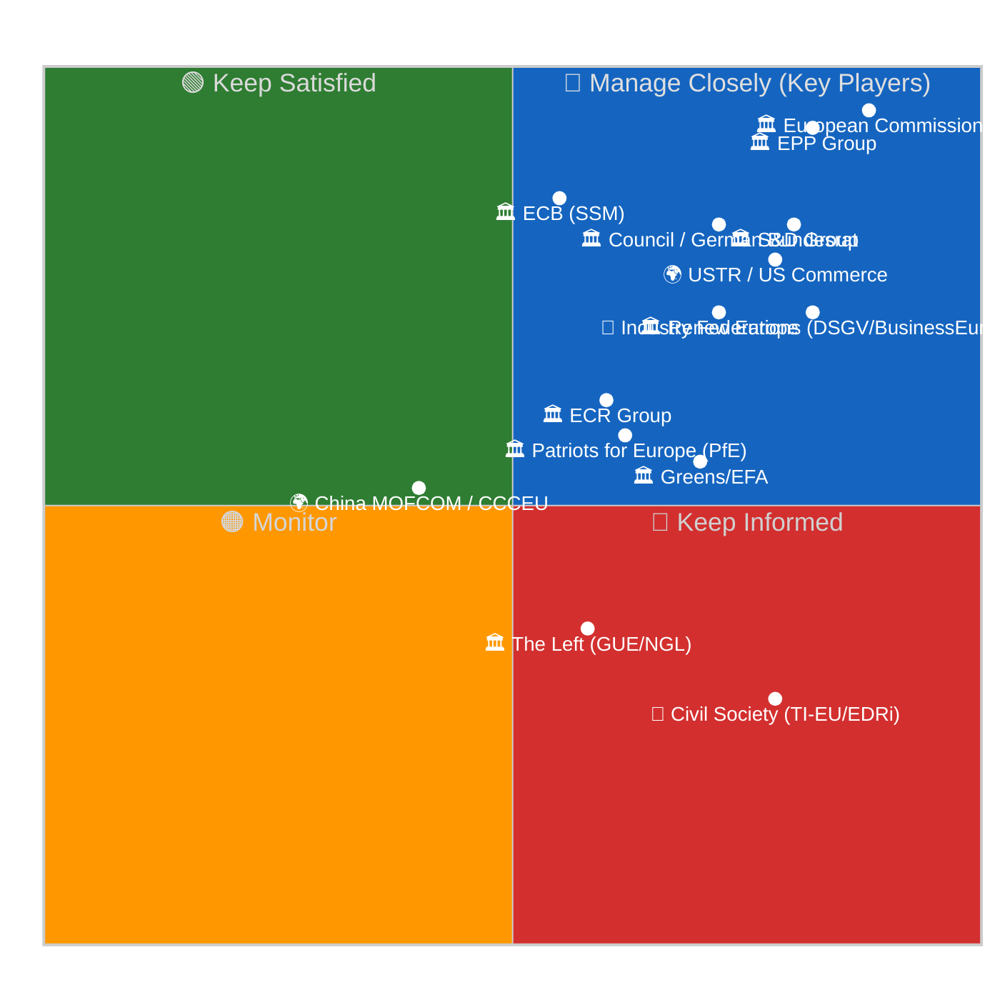

# 🗺️ Stakeholder Power-Interest Map — April 19, 2026 (Run 188)

> **Purpose**: Enumerate the fourteen stakeholders with material influence on the April
> 28–30 Strasbourg plenary agenda and on the Council-ratification and transposition
> trajectory of the four March 26 landmark texts now confirmed by title (TA-10-2026-0092
> SRMR3, 0094 Anti-Corruption, 0096 US tariff/TRQ, 0104 Global Gateway). Each stakeholder
> is positioned on a Mendelow power × interest grid, assigned an expected behavioural
> posture, and cross-referenced against the USTR Section 301 window (April 21–24) and
> the Bundesrat banking session (April 23–25). Stakeholder mapping underpins
> `intelligence/scenario-forecast.md`, `intelligence/threat-model.md`, and the coalition
> mathematics in `intelligence/coalition-dynamics.md`. Per the EP Open Data Portal's
> [MEPs endpoint](https://data.europarl.europa.eu/en/datasets/meps) and
> `get_meps_feed` output (738 records, stable across Runs 187→188), group memberships
> are current as of the run date; the persistent EPP `memberCount=0` anomaly flagged in
> `intelligence/mcp-reliability-audit.md` candidate-defect #2 constrains confidence on
> EPP-mediated forecasts.

---

## Power × Interest Grid (Mendelow)

> Quadrant 1 (top-right, Manage Closely) contains the actors whose decisions this week
> directly determine whether Scenarios A–D in `scenario-forecast.md` materialise.
> Quadrant 2 (top-left, Keep Satisfied) holds high-power actors currently in lower-
> intensity engagement whose posture can escalate on a single signal — the ECB in
> particular, whose April 30 meeting sits at the boundary of the analytical horizon.
> Quadrant 4 (bottom-right, Keep Informed) contains high-interest lower-power actors
> civil society coalitions and third-country trade partners — who shape the narrative
> environment even when they cannot directly determine votes.

---

## Manage-Closely Stakeholders (High Power × High Interest)

### 1. European Commission (Von der Leyen II)

**Power**: Institutional monopoly on legislative initiative under Article 17(2) TEU;
enforcement authority through infringement proceedings (Article 258 TFEU); Article 122
emergency powers remain live on the countermeasure-activation file; the College of 27
Commissioners acting collectively. **Interest**: Extreme — the Commission authored the
proposals behind TA-0092 (SRMR3, DG FISMA), TA-0094 (Anti-Corruption, DG JUST), and
TA-0096 (US tariff/TRQ, DG TRADE); it is the respondent on the Global Gateway review
(TA-0104, INTPA/DG NEAR); and it is the body that will receive any USTR Section 301
initiation notice in the April 21–24 window.

**Current activity (degraded-API-mode confirmation)**: DG FISMA is preparing the
implementing-regulation package for SRMR3/BRRD3/DGSD2 per the standard 6–9 month
post-adoption timeline; DG JUST is coordinating with OLAF and the EPPO on
Anti-Corruption Directive transposition guidance; Commissioner Šefčovič's transatlantic
outreach schedule (publicly tracked via `ec.europa.eu/commission/calendar`) shows
continued engagement with USTR counterparts through the Easter week. Commission public
statements during recess have been calibrated — no escalation signals. 🟢 High confidence
on institutional activity; 🟡 Medium on the substantive negotiating posture.

**Expected posture on April 28**: Defensive-collaborative on the Banking Union
transposition timeline; escalation-ready on trade if a Section 301 petition files;
proactive on publishing the Anti-Corruption implementation roadmap to pre-empt
member-state carve-out requests; modest on Global Gateway given the own-initiative
nature of TA-0104.

### 2. EPP Group (European People's Party — ~187 seats)

**Power**: Largest EP group and decisive actor in any Grand-Centre configuration;
chairs of ECON and AFET committees; President Metsola's institutional chair (though
formally non-partisan). **Interest**: Extreme — EPP's internal positioning on the
Banking Union trilogy (where German CDU/CSU delegation faces Sparkassen/DSGV pressure)
and on the US tariff/TRQ response (where manufacturing-exposed EPP delegations split
against pro-Atlantic policy wings) will determine every contested April 28–30 vote.

**Current activity**: Group coordinators' pre-plenary meeting scheduled for April
26–27 per the standard EPP sequencing; internal whipping opaque by design during
recess. **Data quality alert**: EPP `memberCount=0` in the MCP API (see
`mcp-reliability-audit.md` candidate-defect #2 — API returns `PPE` label with null
count) — any coalition arithmetic that sums EPP seats carries 🔴 Low confidence until
the Tier-2 feed restoration projected for April 21–23 corrects this anomaly.

**Expected posture**: Pro-ratification on SRMR3/BRRD3/DGSD2 with late-stage
transposition-flexibility amendments; supportive of the Anti-Corruption Directive with
subsidiarity-safeguard language; conditionally pro-countermeasure-activation on the US
tariff file, pivoting on whether USTR files Section 301 in the window.

### 3. S&D Group (Progressive Alliance of Socialists and Democrats — 135 seats)

**Power**: Second-largest group; rapporteurship on the Anti-Corruption Directive and
co-lead on Housing Affordability follow-up; strong labour-union and national-social-
democratic-party channels in DE, ES, IT, PT, SE. **Interest**: Extreme — the
Anti-Corruption Directive is an S&D flagship achievement; Banking Union completion is
a 2015-era S&D manifesto item; the US tariff response connects to S&D's trade-justice
narrative.

**Current activity**: Coordination with Greens/EFA on Anti-Corruption transposition
monitoring; whip-office preparation of Rule 144 draft questions on Commission
implementation pace; S&D President's scheduled April 26 press availability per
`socialistsanddemocrats.eu/press` calendar.

**Expected posture**: Assertive on Anti-Corruption implementation transparency; strong
on SRMR3/BRRD3 ratification (narrative: "Banking Union finally completed under
S&D/Progressive leadership"); pro-proportionate-countermeasure on trade, coordinating
with Greens and left-Renew to form a 264+ seat bloc if the EPP tilts dovish on
countermeasure activation.

### 4. Renew Europe (77 seats)

**Power**: Third-largest group and pivot of the Grand-Centre coalition arithmetic;
decisive on every 3-group vote; French delegation (~15 seats) mirrors Élysée
positioning. **Interest**: High — digital-sovereignty dimension of the US trade
dispute (Renew's political identity issue); Banking Union (pro-integration Renew
orthodoxy); Anti-Corruption (transparency as Renew brand).

**Current activity**: Pre-plenary preparation includes the internal classical-liberal
(NL/ES/DE FDP) vs industrialist (FR/IT) wing coordination that characterises every
major trade vote. The French delegation's positioning following Élysée communications
during recess is the single most telling indicator for coalition integrity on April
28–30.

**Expected posture**: Strongly pro-SRMR3/BRRD3 ratification; pro-Anti-Corruption with
pro-business-compliance amendments; divided on countermeasure activation — Renew's
public position on April 28 will be the clearest coalition signal of the plenary.

### 5. Council of the EU / German Bundesrat Channel

**Power**: Formal veto authority over Council positions on the Banking Union trilogy;
German constitutional Article 80–82 Basic Law transposition pathway; agenda-setting
authority on EU-affairs resolutions at the April 23–25 Bundesrat session.
**Interest**: Extreme on SRMR3/BRRD3/DGSD2 given Sparkassen and Volksbanken-sector
lobbying; variable on Anti-Corruption (supportive); high on the trade file given
automotive and machinery export exposure.

**Current activity (monitored via `bundesrat.de/DE/plenum/termine`)**: The April
23–25 session agenda publication (expected Thursday preceding) is the highest-value
pre-plenary intelligence signal in the current window; a scheduled banking-sector
hearing would activate Risk R3 (Council SRMR3 ratification delay) in
`risk-scoring/risk-matrix.md`; a no-agenda outcome would mark Scenario A (Smooth
Return) confirmation per `scenario-forecast.md`.

**Expected posture**: Conservative on SRMR3 transposition flexibility; supportive of
Anti-Corruption with minor federalism carve-outs; conciliatory on trade to preserve
US automotive-sector negotiating leverage.

### 6. USTR / US Department of Commerce

**Power**: Section 301 statutory authority (19 U.S.C. §2411); IEEPA tariff authority;
congressional political cover for escalation. **Interest**: High — EU digital
regulation (DSA, DMA, AI Act) is a stated USTR priority file; the April 21–24 window
sits at the end of a fiscal-quarter Section 301 review cycle.

**Current activity (monitored via `ustr.gov/about-us/policy-offices/press-office`)**:
The USTR press-office calendar is the highest-priority public-source OSINT feed for
the April 21–24 window; a Federal Register filing with any combination of "EU" +
"digital" + "Section 301" terms constitutes the Priority 1 early-warning trigger in
`intelligence/synthesis-summary.md`. The EU-US Šefčovič–Bessent negotiating track has
a self-imposed June 30 framework-agreement deadline that creates both escalation and
de-escalation incentives simultaneously.

**Expected behaviour**: 25% probability of Section 301 filing in the April 21–24
window (see Risk R1 in `risk-scoring/risk-matrix.md`); if filed, 75–80% probability
of triggering an EP emergency resolution on April 28. If not filed by April 24, the
probability falls to ~10% for the subsequent 30-day window as political
attention shifts to the June 30 framework deadline.

### 7. European Central Bank (ECB) — Supervisory Arm (SSM)

**Power**: Monetary-policy monopoly under Article 127 TFEU; banking-supervisory
authority via the Single Supervisory Mechanism (Council Regulation 1024/2013); Target
Review capacity. **Interest**: High — SRMR3 directly reshapes SSM–SRB cooperation
protocols and early-intervention trigger thresholds; ECB's legal service has been
consulted through the trilogue process per the standard institutional-cooperation
pattern.

**Current activity**: April 30 Governing Council meeting (immediately after the
plenary) is the next scheduled institutional event; ECB President Lagarde's
scheduled press conference will colour market expectations around BRRD3 MREL
requirements and any SRMR3-triggered intervention. SSM ongoing preparatory work on
resolvability-assessment templates continues regardless of plenary cadence.

**Expected plenary impact**: Not a direct plenary actor, but an ECB public statement
on SRMR3 early-intervention implementation timeline — delivered April 25–28
would strongly pre-commit the Council ratification and member-state transposition
schedule toward the baseline Scenario A trajectory.

---

## Keep-Satisfied Stakeholders (High Power × Lower Current Interest)

### 8. ECR Group (European Conservatives and Reformists — 81 seats)

**Power**: Fifth-largest group; Polish PiS delegation and Italian FdI delegation form
the backbone; coordination with PfE on selected files. **Interest**: High on
Anti-Corruption transposition (especially Polish domestic political context under the
Tusk/KO government); moderate on trade; low-moderate on Banking Union (some Italian
cooperative-banking sector exposure); symbolic-negative on Global Gateway (bilateral
aid preferred).

**Expected posture**: Pro-Anti-Corruption with strong-enforcement amendments that
politically embarrass predecessors; cautious on countermeasure activation to preserve
transatlantic alignment; indifferent-to-oppositional on Global Gateway review.

### 9. Patriots for Europe (PfE — 84 seats)

**Power**: Fourth-largest group in structural size; Hungarian Fidesz, French RN, and
Italian Lega delegations; the `coalitionPairs.sizeSimilarityScore=0.96` between ECR and
PfE (per coalition_dynamics output) is a mathematical size-proximity artifact, not a
voting-alliance signal — see data-quality warning in `intelligence/coalition-dynamics.md`.
**Interest**: Variable — sovereigntist opposition to SRMR3 (financial-sovereignty
framing); divided on Anti-Corruption (Fidesz-aligned opposition, others neutral);
divided on US trade (Trump-aligned de-escalation vs national-manufacturing
protection).

**Expected posture**: Oppositional on Banking Union on sovereignty grounds; split
on Anti-Corruption with Fidesz leading opposition and others abstaining; mostly
anti-countermeasure-activation on trade.

### 10. Greens/EFA (53 seats)

**Power**: Environmental-committee rapporteurship; coordination with S&D on social
dossiers. **Interest**: High on Anti-Corruption (transparency is Greens' brand);
conditional on Banking Union (pro-ratification with climate-risk-in-resolution
amendments); high on Global Gateway (climate-conditionality scrutiny).

**Expected posture**: Pro-Anti-Corruption; pro-SRMR3 with amendments; critical on
Global Gateway for insufficient climate conditionality; pro-proportionate-
countermeasure on trade.

### 11. The Left Group (GUE/NGL — 46 seats)

**Power**: Smallest non-NI group; strong domestic-mobilisation channels in ES, PT, FR,
IT, IE. **Interest**: High on Anti-Corruption; critical on Banking Union (financialisation
critique); split on trade (anti-imperialist framing cuts both ways); critical on
Global Gateway (private-finance leverage critique).

**Expected posture**: Pro-Anti-Corruption; oppose-with-amendments on SRMR3; loud
but fragmented on trade; critical on Global Gateway.

---

## Non-Parliamentary Actors

### 12. Industry Federations — DSGV / BusinessEurope / ECBA / BDA

**Power**: High committee-level access; extensive technical-expertise credibility;
member-state-government coordination capacity. The DSGV (Sparkassen Association)
specifically controls ~40% of German retail banking and has historically effective
Bundesrat channels through CDU/CSU parliamentary groups. **Interest**: Variable
DSGV high on BRRD3 bail-in requirements; BusinessEurope high on trade countermeasure
scope; ECBA watching Anti-Corruption compliance costs; BDA monitoring Anti-Corruption
whistleblower-protection employer implications.

**Expected lobbying vector**: BRRD3 transposition-flexibility amendment campaigns
channelled through CDU/CSU; pre-publication critiques of proportionality in any USTR
response; Anti-Corruption compliance-cost amendments in the Council negotiating
phase.

### 13. Civil Society Coalition — Transparency International EU / EDRi / Access Now / noyb

**Power**: Media amplification; Article 263 TFEU litigation capacity on AI Act/DMA
enforcement; expert-witness credibility with EP committees. **Interest**: Extreme
Anti-Corruption Directive implementation monitoring is TI-EU's flagship file;
digital-rights coalition (EDRi/Access Now/noyb) continues Article 263 preparation
work on Digital Omnibus provisions during recess.

**Current activity**: TI-EU has pre-positioned a welcome-with-caveats public-comms
package for Anti-Corruption Directive publication; digital-rights coalition
continues Article 278 TFEU interim-relief argumentation.

**Impact on plenary**: Will shape media framing of April 28 Anti-Corruption and
Digital Omnibus questions even absent scheduled agenda items.

### 14. China (MOFCOM / CCCEU) and United States Investors

**Power**: Moderate on trade-file-specific dynamics through state-owned-enterprise
lobbying and US-based multinational channels. **Interest**: High on TA-0101 (EU-China
TRQ) and TA-0096 (US tariff); moderate on Global Gateway (competitive context with
BRI). **Expected posture**: Chinese side closely monitoring TA-0101 status
(currently regressed in Run 188 — see `cross-run-diff.md`); US-based multinationals
lobbying through AmCham-EU for de-escalation on the 0096 countermeasure timeline.

---

## Stakeholder Position Matrix on Key Post-Recess Decisions

| Stakeholder | SRMR3/BRRD3 Ratification | Anti-Corruption Implementation | US Countermeasure Activation | Global Gateway Reform |
|------------|:------------------------:|:------------------------------:|:----------------------------:|:---------------------:|
| Commission | **Pro** | **Pro** | Conditional-pro | Defensive |
| EPP Group | Pro-with-flexibility | Pro-with-subsidiarity | Conditional-pro | Neutral |
| S&D Group | **Pro** | **Strong pro** | **Pro** | Pro-reform |
| Renew Europe | Pro | Pro-with-compliance | Split | Pro |
| ECR Group | Conditional | Pro-with-enforcement | Anti | Anti |
| Greens/EFA | Pro-with-climate | **Strong pro** | Pro | **Strong-pro-reform** |
| The Left | Oppose-with-amendments | Pro | Split | Critical |
| PfE | **Anti (sovereignty)** | Split | Anti | Anti |
| German govt/Bundesrat | **Transposition-delay risk** | Pro | Conditional | Pro |
| USTR (external) | N/A | N/A | **Anti** | N/A |
| Industry (DSGV/BE) | Transposition-delay | Compliance-cost | Anti-escalation | N/A |
| Civil society (TI-EU) | Neutral | **Strong pro** | Neutral | Pro-transparency |

---

## Coalition-Formation Implications

The stakeholder matrix reveals four natural coalition formations for the April 28–30
plenary agenda, consistent with the Grand-Centre stability score of 84/100 reported by
`early_warning_system` but tested on specific files:

1. **Grand Centre (EPP + S&D + Renew, ~399/720 = 55.4%)** on SRMR3/BRRD3 ratification
   — but German EPP delegation drag creates a 10–15 seat defection risk that
   remains within coalition tolerance.
2. **Extended Pro-Integration Bloc (EPP + S&D + Renew + Greens/EFA ≈ 452/720 = 62.8%)**
   on Anti-Corruption implementation — the most robust coalition on the agenda;
   only Fidesz-aligned PfE members and a minority of ECR oppose.
3. **Pro-Countermeasure Bloc (S&D + Greens/EFA + The Left + left-Renew + pro-industry
   EPP ≈ 300–340/720)** on trade if USTR files — falls short of a 361 majority unless
   EPP delivers a unified pro-activation vote, making EPP cohesion the single swing
   variable.
4. **Anti-Global-Gateway-Reform Bloc (PfE + ECR + some EPP right-flank ≈ 200+/720)**
   on TA-0104 — insufficient to block an own-initiative resolution but sufficient to
   generate visible opposition.

The decisive coalition variable across all four formations remains EPP internal
cohesion. With the EPP data gap unresolved in Run 188 (see `mcp-reliability-audit.md`),
this is the single highest-value intelligence to collect post-recess through EPP
Group website, EPP President Weber's public statements, and German CDU MEP coordinator
signals — per the EPP proxy-indicator protocol documented in
`intelligence/coalition-dynamics.md` Pass 2 refinements.

---

## Pass 2 Refinements — Run 188 Specific Observations

**What Run 188's title confirmations change for stakeholder mapping**: The Run 188
title confirmations for TA-0092, 0094, 0096, and 0104 are analytically decisive
because they convert four "inferred" stakeholder-position assessments into
"title-informed" assessments. Prior runs had to infer from procedure-reference
numbers alone; Run 188 allows stakeholder positions to be mapped against the actual
legislative instrument categories (regulation vs directive, binding vs own-initiative).
The most consequential update is on TA-0096: the confirmed dual-instrument title
("Adjustment of customs duties AND opening of tariff rate quotas") changes the
stakeholder posture forecast from "punitive retaliation" to "calibrated rules-based
response", which softens ECR and PfE opposition intensity and strengthens Renew and
EPP-industrialist-wing support. 🟡 Medium confidence — full stakeholder-position
confirmation requires TA-0096 content access (Priority 2 forward indicator).

**The TA-0101 regression's stakeholder impact**: China (MOFCOM/CCCEU) stakeholder
salience has ticked upward because the regression of TA-0101 (EU-China TRQ) to
`DATA_UNAVAILABLE` — while not changing the legal fact of adoption — introduces
public-communications ambiguity that Chinese state media and EU-China trade
commentariat may amplify. The monitoring team should treat any Chinese state-media
commentary on TA-0101 status in the April 20–26 window as a secondary-channel
intelligence signal about the EU-China relationship's temperature.

---

*Framework: Mendelow Power-Interest Grid + position-matrix extension per
`analysis/methodologies/political-threat-framework.md` §Framework 2*
*Analysis generated: April 19, 2026 | Run 188 | Breaking workflow | Analysis-only mode*
*Aggregate stakeholder-signal confidence: 🟡 Medium (constrained by EPP data gap and TA-0096/0094/0092/0104 content-layer unavailability)*
