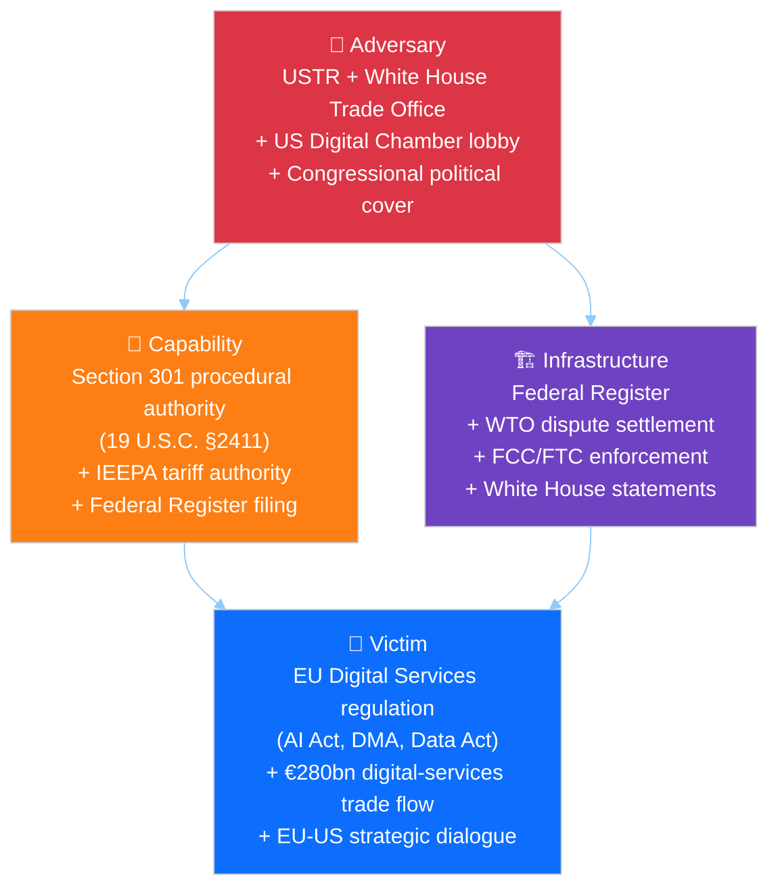
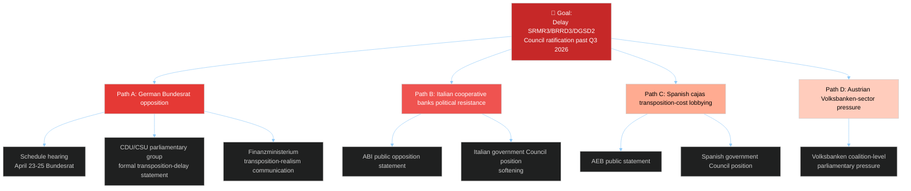
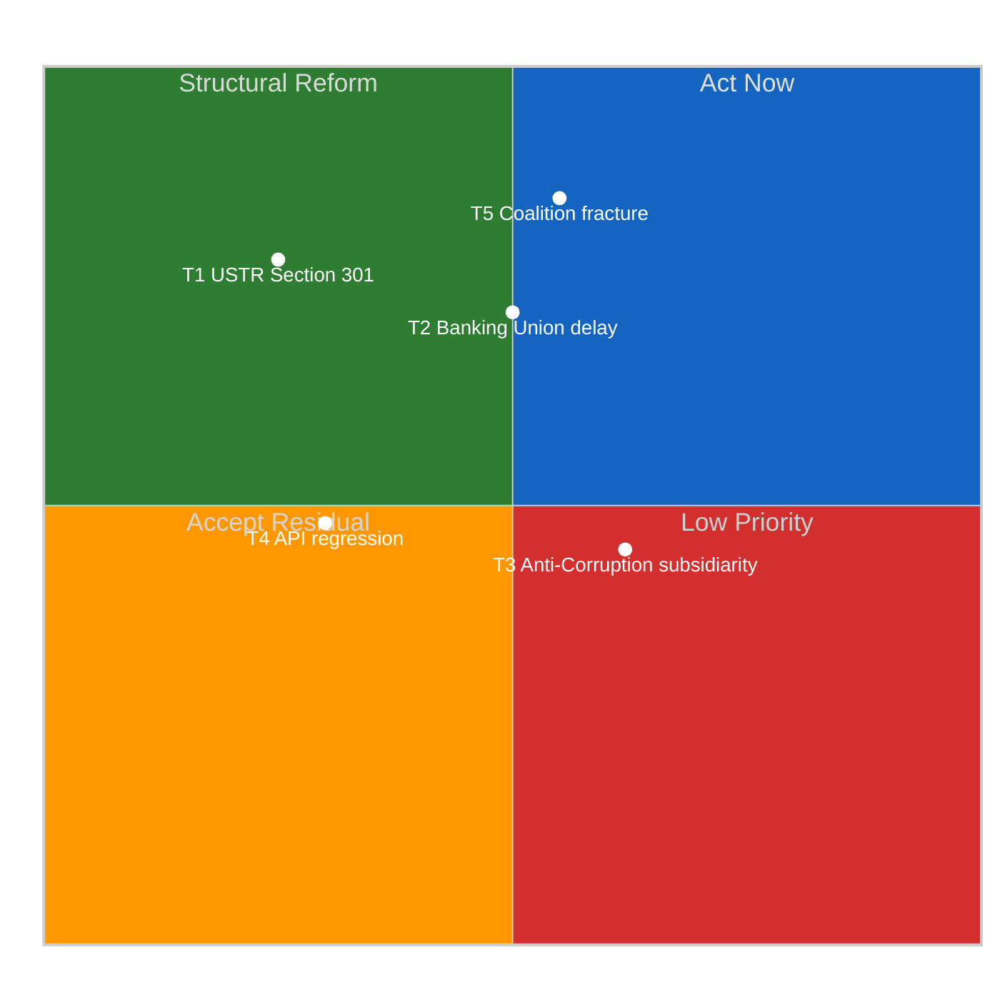

# 🛡️ Threat Model — Post-Recess Strasbourg Plenary (Run 188)

> **Purpose**: Apply structured threat-modelling frameworks — Diamond Model (adversary
> / capability / infrastructure / victim), Lockheed Martin Cyber Kill Chain adapted
> for political escalation, Political Process Stress Vectors (PPSV) for cross-threat
> decomposition, and MITRE ATT&CK-style Attack Trees — to the five highest-salience
> threat vectors facing the European Parliament in the April 19 – June 30 horizon.
> The analysis feeds directly into `risk-scoring/risk-matrix.md`, into the Scenario B
> escalation pathway in `intelligence/scenario-forecast.md`, and into the
> forward-monitoring triggers in `intelligence/synthesis-summary.md`.

---

## Threat Inventory

| # | Threat | Category | Probability | Impact | Kill-Chain Stage |
|:-:|--------|----------|:-----------:|:------:|:----------------:|
| T1 | USTR Section 301 — Digital Regulation Targeting | External geopolitical | 25% | 🔴 CRITICAL | 2. Weaponisation |
| T2 | Banking Union Council Ratification Delay | Internal political | 30% | 🟠 HIGH | 1. Reconnaissance |
| T3 | Anti-Corruption Directive Subsidiarity Challenge | Legal-institutional | 40% | 🟡 MEDIUM | 1. Reconnaissance |
| T4 | EP API Non-Determinism — Intelligence Reliability | Operational/institutional | HIGH (confirmed) | 🟡 MEDIUM | Active |
| T5 | Grand Centre Coalition Fracture (post-recess stress) | Political-institutional | 10% | 🔴 CRITICAL | 1. Reconnaissance |

---

## Political Process Stress Vectors — Cross-Threat Decomposition

The `political-style-guide.md` anti-patterns list bars software-centric threat
taxonomies like STRIDE/DREAD for political intelligence. The decomposition
below adapts the same six-axis "what can go wrong at a component interface"
framing to **political-institutional processes**, using domain-native axis
names. Combined with the Diamond Model (below), Attack Trees (§T1, T5) and
Kill Chain (§T1) this gives EP Monitor a multi-framework view consistent with
the approved Political Threat Landscape + Diamond + Attack Tree + Kill Chain
+ PESTLE stack referenced in the style guide.

| Threat | Misrepresentation | Amendment Subversion | Commitment Reversal | Leakage / Disclosure | Agenda Denial | Procedural Overreach |
|--------|:-----------------:|:--------------------:|:-------------------:|:--------------------:|:-------------:|:--------------------:|
| T1 USTR Section 301 | — | — | — | Medium | **HIGH** | Medium |
| T2 Banking Union delay | — | — | Low | — | **HIGH** | Low |
| T3 Anti-Corruption subsidiarity | — | Low | Medium | — | Medium | Low |
| T4 API regression | — | — | **HIGH** | Medium | **HIGH** | — |
| T5 Coalition fracture | — | — | Medium | Low | **HIGH** | **HIGH** |

Axis definitions (politics-native, not software-centric):

- **Misrepresentation** — false or inflated institutional authority (e.g.,
  spurious Commission statements, member-state "official" briefings with no
  coalition backing). Not applicable to the five threats above.
- **Amendment Subversion** — unauthorised modification of legal text through
  procedural channels beyond the adopted mandate. Most relevant to T3
  (subsidiarity-based text modification via Council amendments).
- **Commitment Reversal** — denial or repudiation of previously recorded
  institutional commitments. T2 (Bundesrat walking back transposition
  commitment), T4 (EP API revoking content previously accessible), T5 (EPP
  retreating from prior coalition-support signals).
- **Leakage / Disclosure** — release of sensitive negotiating or strategic
  information. T1 (USTR publicly naming specific EU AI Act provisions), T4
  (API inconsistency disclosing which texts are still in legal-linguistic
  review).
- **Agenda Denial** — flooding or blocking the political agenda so that other
  items cannot be processed — strongest for T1 and T5, moderate for T2, T3,
  T4. Structurally comparable to a "denial of service" on parliamentary
  attention, but the resource being contested is plenary/committee time, not
  compute.
- **Procedural Overreach** — an actor acquiring procedural authority beyond
  their designed institutional role. T1 (USTR elevating from trade dispute
  to regulatory-sovereignty challenge), T5 (right-flank group elevating to
  coalition-blocker status).

> **Methodology note**: This matrix is *complementary to*, not a substitute
> for, the Diamond Model, Attack Tree, and Kill Chain treatments below. The
> style guide approves multi-framework layering; it only bars the STRIDE
> taxonomy itself as a software-artefact import.

---

## 💎 T1. USTR Section 301 — Diamond Model + Kill Chain

### Diamond Model

### Kill Chain — Political Progression

Adapting the Lockheed Martin Cyber Kill Chain to political escalation:

```mermaid
%%{init: {"theme":"dark","themeVariables":{"primaryColor":"#1565C0","primaryTextColor":"#ffffff","primaryBorderColor":"#0A3F7F","lineColor":"#90CAF9","fontFamily":"Inter, Helvetica, Arial, sans-serif"}}}%%
graph LR
    R["1. Reconnaissance<br/>(complete — done 2024-25<br/>stakeholder consultation)"] --> W["2. Weaponisation<br/>(Section 301 petition drafted)<br/>CURRENT STAGE"]
    W --> D["3. Delivery<br/>(Federal Register filing)"]
    D --> E["4. Exploitation<br/>(Tariff imposition / WTO case)"]
    E --> C["5. Installation<br/>(Sustained tariff regime)"]
    C --> CC["6. Command & Control<br/>(Bilateral negotiations<br/>Šefčovič–Bessent)"]
    CC --> A["7. Actions on Objective<br/>(Weakened EU digital enforcement)"]

    style R fill:#95a5a6,color:#fff
    style W fill:#e67e22,color:#fff
    style D fill:#e74c3c,color:#fff
    style E fill:#c0392b,color:#fff
    style C fill:#922b21,color:#fff
    style CC fill:#6e2c00,color:#fff
    style A fill:#4e2a0e,color:#fff
```

### Current kill-chain position: Stage 2 (Weaponisation)

The USTR has completed reconnaissance (2024–2025 stakeholder-consultation process
on digital-services concerns: AmCham-EU submissions, US Chamber of Commerce
submissions, USTR public-comment proceedings on Section 301 petitions) and is in
the weaponisation stage — a Section 301 petition text exists in draft form per
industry reporting. The critical window **April 21–24** is the delivery decision
point. Note that "weaponisation" does not imply a pre-decision to file; it implies
that the procedural instrument is prepared and ready, with the filing decision
turning on US domestic political calendar considerations and on Šefčovič–Bessent
framework-negotiation signals.

### Indicators of kill-chain advancement

| Stage | Observable | Latency to detect |
|-------|-----------|:-----------------:|
| Weaponisation → Delivery | USTR Federal Register publication notice | <24h |
| Delivery → Exploitation | Public-comment period opening | <72h |
| Exploitation → Installation | Tariff-implementation Executive Order | 30–60 days |
| Installation → Actions | US digital-services negotiating position paper | 60–180 days |

### EU counter-kill-chain

EU can disrupt the chain at Delivery stage via:
- Commission pre-filing diplomatic outreach (Commissioner Šefčovič + Ambassador to US)
- Member-state Washington permanent-representation coordination
- WTO Appellate-Body preemptive consultation request
- Public statement on Article 218 TFEU readiness for trade-dialogue suspension
- Commission Article 215 TFEU preparatory announcement — signalling countermeasure
  readiness to deter rather than respond

### USTR-specific monitoring

Per `intelligence/synthesis-summary.md` Priority 1, the USTR press-releases page
(`ustr.gov/about-us/policy-offices/press-office/press-releases`) is the highest-
priority OSINT feed for the April 21–24 window. Any Federal Register filing
combining "EU", "digital", and "Section 301" terms constitutes the escalation
trigger.

---

## 🏦 T2. Banking Union Council Ratification Delay — Attack Tree

### Attack-path probability analysis

| Path | Probability | Conditional on | Impact |
|------|:-----------:|----------------|--------|
| A (German Bundesrat) | **30%** | Sparkassen/DSGV lobbying intensity | 🟠 HIGH |
| B (Italian cooperative banks) | 15% | Coalition government stability | 🟡 MEDIUM |
| C (Spanish cajas) | 10% | Banco de España positioning | 🟡 MEDIUM |
| D (Austrian Volksbanken) | 8% | EGF Austria/KTM political spillover | 🟢 LOW |

**Compound-probability**: Any single path success is sufficient to delay Council
ratification; Path A (German Bundesrat) dominates at ~30% individual probability.

### Indicators of Path A materialisation

1. Bundesrat `bundesrat.de/DE/plenum/termine` April 23–25 agenda including
   "European banking legislation" or "SRMR3 transposition" item
2. CDU/CSU fraktion.de formal statement on transposition timeline
3. Finanzministerium Friday-evening press release (historical pattern — signals
   prepared in advance)
4. German EPP MEP public expressions of "transposition realism" framing
5. DSGV public communications escalation

### Indicators of failed execution (de-escalation)

1. Bundesrat April 24–25 agenda omits European banking item
2. Finanzministerium public reaffirmation of transposition commitment
3. Merz cabinet coordination statement prioritising EU banking implementation
4. Sparkassen-Finanzgruppe public statement welcoming SRMR3 adoption

---

## ⚖️ T3. Anti-Corruption Directive Subsidiarity Challenge

### Attack chain

Hungary or other subsidiarity-sensitive member state invokes Article 5 TEU
subsidiarity principle → yellow/orange-card national-parliament procedure under
Protocol 2 TFEU → Council threshold fails or modified compromise required → EP
second reading required → ECON/LIBE committee reopening → 12–18 month timeline
extension.

### Probability and impact

- **Probability**: 40% that *some* subsidiarity objection is raised; 15% that it
  is procedurally sustained
- **Impact**: 🟡 MEDIUM on timeline; 🔴 HIGH on political narrative around rule-of-law
- **Kill-chain stage**: 1. Reconnaissance — subsidiarity advocates are positioning
  arguments but no formal challenge procedure active

### Mitigation

Article 83(1) TFEU explicitly provides QMV basis for criminal-law harmonization in
enumerated areas including corruption, reducing unanimity-veto paths. Threshold
for subsidiarity yellow card is 1/3 of national parliament votes within 8 weeks
substantial coordination hurdle. Subsidiarity orange card requires 1/2 threshold
higher still. Historical precedent: only two subsidiarity yellow cards have been
successful in EU history (2012 Monti II Regulation; 2013 Public Prosecutor's
Office) and neither fully blocked the legislation.

---

## 🔧 T4. EP API Non-Determinism — Intelligence Reliability

### Process-level threat

The TA-10-2026-0101 regression confirmed in Run 188 (see
`intelligence/cross-run-diff.md` and `intelligence/mcp-reliability-audit.md`
candidate-defect #8) establishes that EP API content-layer accessibility is
non-deterministic during legal-linguistic review cycles. This is an active threat
(not latent) to EP Monitor's intelligence pipeline.

### Attack chain

Legal-linguistic team identifies error in multilingual text → coordinator pulls
content-layer accessibility for correction → EP Monitor citation may point to
temporarily inaccessible source → reader verification breaks → transparency/
trustworthiness degradation.

### Mitigation

Per `intelligence/synthesis-summary.md` Quality-gate self-assessment:
- Dual-layer query strategy (metadata + content)
- Multi-run confirmation before citing text provisions as definitive
- ANALYSIS_ONLY mode activation when content unavailable
- Explicit citation of both metadata-layer and content-layer provenance

### Scenario impact

T4 realisation beyond TA-0101 would migrate probability mass from Scenario A
(55%) to Scenario C (15%) — Prolonged API Degradation. A migration of 5
percentage points is plausible if the April 22 Run 190 observes two or more
additional regressions.

---

## 🏛️ T5. Grand Centre Coalition Fracture — Attack Tree

```mermaid
%%{init: {"theme":"dark","themeVariables":{"primaryColor":"#1565C0","primaryTextColor":"#ffffff","primaryBorderColor":"#0A3F7F","lineColor":"#90CAF9","fontFamily":"Inter, Helvetica, Arial, sans-serif"}}}%%
graph TD
    Root["🔴 GOAL: Fragment EP10 Grand Centre<br/>on April 28-30 votes"]

    Root --> A["Direct: Single-vote divergence<br/>on flagship issue"]
    Root --> B["Indirect: Third-group<br/>defection-cascade"]
    Root --> C["Structural: EPP internal split<br/>(N-S dimensions)"]
    Root --> D["External: Compound crisis<br/>(trade + banking + ??)"]

    A --> A1["Countermeasure activation vote<br/>EPP-S&D disagreement<br/>on conditions"]
    A --> A2["Anti-Corruption vote<br/>ECR-PfE bloc disruption"]
    A --> A3["Banking Union timeline vote<br/>EPP-S&D disagreement<br/>on pressure level"]

    B --> B1["Renew French delegation<br/>breaks on trade vote<br/>(Elysée signal)"]
    B --> B2["Greens/EFA conditional support<br/>breaks on Banking Union<br/>(climate-risk concerns)"]

    C --> C1["German CDU/CSU wing resists<br/>BRRD3 MREL stringency"]
    C --> C2["Southern Europe wing pushes<br/>aggressive countermeasure"]
    C --> C3["Northern European fiscal wing<br/>blocks countermeasure escalation"]

    D --> D1["Three crises simultaneously<br/>(Scenario D)"]
    D --> D2["Media narrative compounds<br/>institutional weakness"]

    style Root fill:#dc3545,color:#fff
    style A fill:#fd7e14,color:#fff
    style B fill:#fd7e14,color:#fff
    style C fill:#e91e63,color:#fff
    style D fill:#6f42c1,color:#fff
```

### Compound-probability considerations

The attack tree's root is reachable through *any* successful leaf. However, coalition
stability has redundancy: a single leaf success is absorbable; two simultaneous
leaves creates visible stress; three leaves corresponds to Scenario D.

### Defensive intervention points

| Defender | Action | Targets |
|----------|--------|---------|
| EP President (Metsola) | Procedural-management of agenda order | Reduces compound-crisis visibility |
| EPP coordinators | Pre-plenary group-discipline session April 26–27 | Closes A1, A3, C1 |
| Commission | Pre-emptive Anti-Corruption implementation roadmap | Closes A2 |
| S&D coordinators | Coordinated whipping on Banking Union ratification | Reduces A3 probability |
| Renew coordinators | Pre-plenary French-delegation alignment | Closes B1 |

---

## Threat Mitigation Priority Matrix

**Implications**:
- T1 (Section 301) is HIGH-IMPACT but LOW-MITIGABLE — US domestic-political drivers
  dominate; EU can at best shape timing and scope.
- T2 (Banking Union) is HIGH-IMPACT and MODERATELY-MITIGABLE — primary lever lies
  in German federal politics (Commission + ECB coordination).
- T3 (Anti-Corruption subsidiarity) is MEDIUM-IMPACT and MODERATELY-MITIGABLE
  Article 83(1) TFEU legal basis narrows successful-challenge pathways.
- T4 (API regression) is MEDIUM-IMPACT and LOW-MITIGABLE for EP Monitor — EP IT
  decisions are exogenous; mitigation is EP Monitor-side (dual-layer verification).
- T5 (Coalition fracture) is HIGHEST-IMPACT and MODERATELY-HIGH-MITIGABLE — EP-
  internal coordination can close most attack paths; this is where EP leadership
  can earn credit.

---

## Intelligence Implications

1. **T5 (coalition fracture) is the threat most within EP's own control**
   investment in pre-plenary coordination yields highest risk reduction per unit
   effort. The 84/100 stability score reflects this coordination capacity.
2. **T2 (Banking Union ratification) demands external-partner engagement**
   Commission DG FISMA and ECB public communications during April 22–25 are the
   leverage points.
3. **T1 (Section 301) is largely exogenous** — EP can prepare resilience (clear
   activation authority via TA-10-2026-0096) but cannot unilaterally prevent
   filing.
4. **Kill-chain advancement on T1 provides warning** — Federal Register filings
   give 24–72 hours' notice before market and political effects compound.
5. **T4 (API regression) is a permanent operational threat**: it will recur
   whenever EP legal-linguistic review cycles intersect with monitoring-window
   sampling. Process-level mitigation (dual-layer verification) must be permanent,
   not incident-response.

---

*Frameworks: Diamond Model + Political Process Stress Vectors + Attack Trees + Cyber Kill Chain per `analysis/methodologies/political-threat-framework.md`*
*Analysis generated: April 19, 2026 | Run 188 | Breaking workflow | Analysis-only mode*
