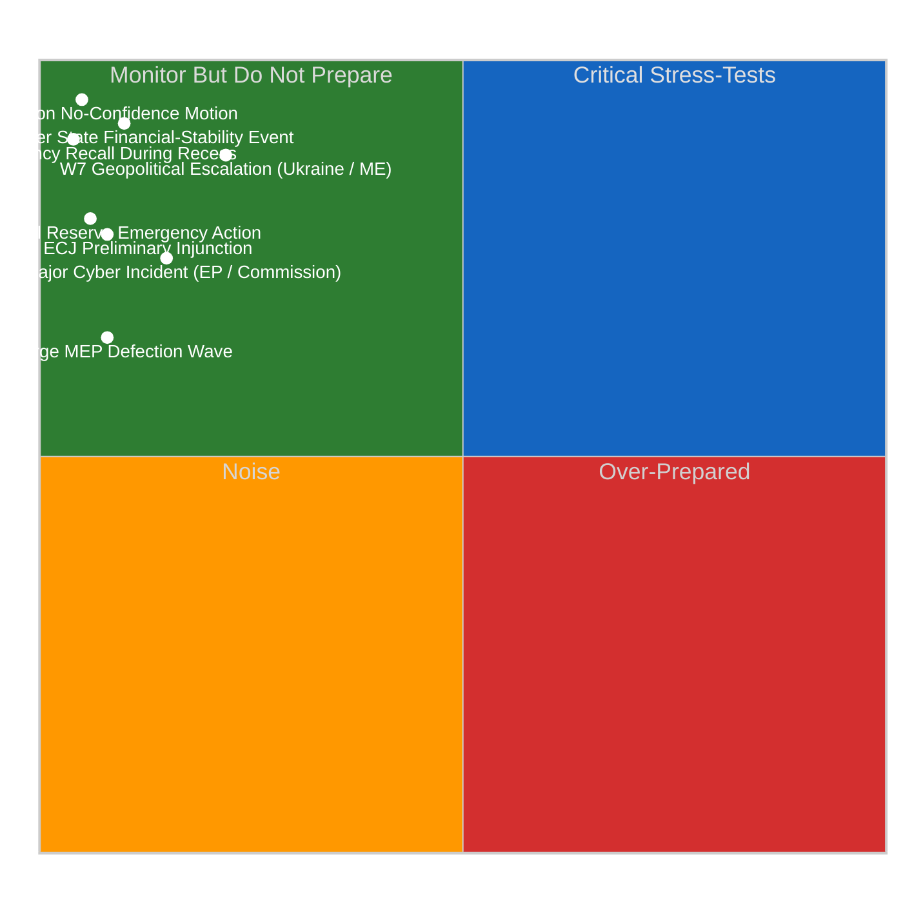

# 🎰 Wildcards and Black Swans — April 19 – June 30, 2026 (Run 188)

> **Purpose**: Explicitly enumerate the low-probability high-impact events that would
> *invalidate* the four scenarios in `intelligence/scenario-forecast.md`. Wildcards
> and Black Swans are deliberately excluded from the main scenario probabilities
> (which sum to 100%) because their probabilities are individually low (typically
> <20% and for most <10%) and typically not independently estimable from their
> effects. Their role is to *stress-test* the main scenarios' robustness and to
> ensure the monitoring team maintains situational awareness beyond the central-
> estimate cases.
>
> **Methodological note**: A "wildcard" (Schwartz) is a known low-probability event
> whose impact we can model; a "Black Swan" (Taleb) is an event outside our model
> altogether. Run 188 tracks 8 known wildcards explicitly (W1–W8) and reserves a
> residual "unknown unknowns" 5% share per Taleb's framework, labelled as Scenario D
> in `scenario-forecast.md`.

---

## Wildcard Watch List

---

## W1. Commission No-Confidence Motion

**Probability**: ~5%. **Impact**: 🔴 CRITICAL — institutional discontinuity.

**Mechanism**: A sufficiently severe Commission failure on multiple files
simultaneously (inadequate Anti-Corruption implementation roadmap + slow response
to a USTR Section 301 filing + visible Commissioner-level scandal) could trigger a
Rule 119 motion of censure under Article 234 TFEU. Requires 1/10 of MEPs (≥72) to
propose; 2/3 of votes cast + simple majority of component members to pass.
Historically rare: only one motion (1999 Santer Commission) has actually succeeded.

**Trigger combination needed**:
- Commission inadequate response to ≥2 March 26 implementation files
- US Section 301 filing with inadequate Commission countermeasure activation
- Visible Commissioner-level resignation or scandal compounding the above

**Detection signals**: Group-coordinator public signatures on motion proposal;
parliamentary-service procedural-handling announcements; Metsola public statement
calibrating institutional response; COREPER II emergency meeting.

**Scenario impact**: Would invalidate all four scenarios (A–D) — transitions EP10
to an entirely new political configuration. This wildcard sits near the extreme
upper-left of the watch-list quadrant chart (very low probability, extreme
impact).

---

## W2. Major ECJ Preliminary Injunction on Digital Omnibus

**Probability**: ~8%. **Impact**: 🟠 HIGH — interim EU-law suspension.

**Mechanism**: If civil-society plaintiffs (EDRi, Access Now, noyb coalition) file
Article 263 TFEU challenge against TA-10-2026-0098 with an Article 278 TFEU
interim-relief request AND the ECJ President grants the injunction (rare but not
unprecedented), the AI high-risk threshold modification is suspended pending final
ruling. This would be an unusually fast move (normally 3–4 months from filing to
injunction decision).

**Trigger combination needed**:
- Filing by end of May 2026 (within the 2-month Article 263 window from entry
  into force)
- Compelling-harm argument on immediate AI deployment risk
- ECJ President disposition toward procedural activism

**Detection signals**: Plaintiffs' public-comms framing via EDRi.org, noyb.eu;
ECJ procedural-filings publication at `curia.europa.eu`; parallel Commission
legal-service reaction.

**Scenario impact**: Activates Scenario C amplification via civil-society
momentum; probabilistically migrates A → C by ~5 percentage points. Intersects
with potential USTR Section 301 framing — an ECJ injunction partially mooting
EU digital enforcement could be weaponised by USTR as evidence of EU regulatory
instability.

---

## W3. Member State Financial-Stability Event

**Probability**: ~10%. **Impact**: 🔴 CRITICAL.

**Mechanism**: An Italian, Spanish, or German smaller-bank resolution requiring
SRM/SRF activation during the Banking Union transposition window. Could be
triggered by market-volatility stress-testing weakness (see
`intelligence/economic-context.md` on BTP-Bund spread monitoring) exposing
vulnerabilities in second-tier banks. Run 188's particular relevance: SRMR3
(TA-10-2026-0092) has been adopted by Parliament but not yet Council-ratified
a resolution event in this window would create legal-framework uncertainty about
which resolution framework applies (the pre-SRMR3 BRRD2 framework or the post-
adoption but pre-ratification SRMR3).

**Trigger combination needed**:
- Significant market stress (e.g., DAX/FTSE-MIB >5% drop in single week)
- Bank-level indicator deterioration (share-price collapse, deposit outflows)
- SRB intervention assessment

**Detection signals**: SRB press releases at `srb.europa.eu`; ECB SSM emergency
communications; national-supervisor statements (BaFin, Banca d'Italia, Banco de
España); bank-level share-price movements; overnight Italian BTP-Bund spread
widening >40bp.

**Scenario impact**: Would simultaneously accelerate BRRD3/SRMR3 Council
ratification pressure (crisis demonstrates why the reform matters) AND create
political scandal-energy that compounds Scenario D risk. Net effect: ambiguous
push — likely accelerates Scenario B if combined with USTR action, accelerates
Scenario A if handled cleanly.

---

## W4. US Federal Reserve Emergency Action

**Probability**: ~6%. **Impact**: 🟠 HIGH.

**Mechanism**: A Fed emergency rate action (cut or hold-but-guidance-shift) in
response to tariff-induced US inflation dynamics could materially shift EUR/USD
and European monetary-policy calculus ahead of the April 30 ECB meeting that
immediately follows the post-recess plenary.

**Trigger combination needed**: Tariff-pass-through inflation data surprise +
financial-market stress + political pressure on the FOMC.

**Detection signals**: FOMC emergency-meeting scheduling announcement at
`federalreserve.gov/newsevents`; Fed Chair public statements; FX and bond-market
moves.

**Scenario impact**: Recalibrates Scenario A–D economic context but does not
directly alter plenary agenda structure. Could compound USTR Section 301 effects
(Scenario B) if the Fed action is perceived as coordinated with trade-policy
escalation.

---

## W5. Large MEP Defection Wave

**Probability**: ~8%. **Impact**: 🟠 HIGH.

**Mechanism**: A coordinated shift of 8–15+ MEPs between political groups during
the recess or early-plenary period. Most likely axis: ECR → PfE as part of
far-right consolidation (with the `coalitionPairs.sizeSimilarityScore=0.96`
between ECR and PfE reported by MCP reflecting structural alignment, though
without voting-behavior confirmation this remains a size artifact — see
`intelligence/coalition-dynamics.md`), OR right-flank EPP MEPs (particularly
German CSU-affiliates) → ECR.

**Trigger combination needed**:
- External political event that makes current group affiliation politically
  untenable (e.g., EPP leadership statement interpreted as betrayal by right
  flank)
- Pre-coordinated movement rather than individual defection
- Timing choice to maximise political-signal impact

**Detection signals**: MEPs updating affiliation on `europarl.europa.eu` MEP
directory; group press statements; national-party announcements; #EPnews hashtag
activity; the `get_meps_feed` MCP endpoint (stable at 738 MEPs across Runs
187–188 — any cross-group shift would be immediately observable).

**Scenario impact**: Would invalidate coalition-mathematics baseline; materially
alter committee coordinator positions. Forces immediate revision of coalition-
dynamics analysis in Run 189+. Could migrate probability mass from Scenario A
toward Scenario D if combined with USTR action.

---

## W6. Major Cyber Incident (EP or Commission)

**Probability**: ~15%. **Impact**: 🟠 HIGH.

**Mechanism**: A ransomware or sustained DDoS attack on EP or Commission digital
infrastructure during the Easter cross-sector holiday period, when IT staffing is
reduced. Historical precedent: 2022 ransomware attack on Belgian federal
government cross-sector holiday period; 2023 Albanian government ransomware.

**Trigger combination needed**:
- State-affiliated or financially-motivated threat actor targeting
- EP or Commission infrastructure exposure window
- Detection-latency during reduced-staffing period

**Detection signals**: ENISA public advisory; CERT-EU communications at
`cert.europa.eu`; EP internal IT communications; Commission DG DIGIT incident
response; reduced functionality across EP or Commission public-facing services.

**Scenario impact**: Compounds the existing EP API degradation (TA-0101 regression
+ Tier-2 feed unavailability) into a full operational-continuity event. Would
extend Scenario C from a data-availability issue into an institutional-capacity
issue. Intersects with Run 188's observation that the EP API is already in a
degraded state, potentially masking the distinction between cyber incident and
routine maintenance volatility.

---

## W7. Geopolitical Escalation — Ukraine or Middle East

**Probability**: ~22%. **Impact**: 🔴 CRITICAL.

**Mechanism**: Material escalation in the Russia–Ukraine war (front-line
dislocation, Russian escalation against Baltic or Polish NATO territory, Ukrainian
cross-border strikes reaching Russian strategic infrastructure) OR Middle East
(Iran-Israel direct escalation, Gulf shipping disruption, Red Sea corridor
closure). Any of these would compress the European Parliament's post-recess
political calendar as security-focused emergency resolutions displace normal
legislative business.

**Trigger combination needed**:
- Material event beyond ongoing background conflict levels
- EU foreign-policy demand for parliamentary response
- Member-state capital political pressure

**Detection signals**: Major newswire alerts; HR/VP Kallas emergency statements;
Council emergency meeting scheduling; individual member-state emergency meetings;
financial-market risk-off dynamics; EUR/USD weakness and EU defence-sector equity
pricing.

**Scenario impact**: Would shift parliamentary agenda priority from
banking/trade/anti-corruption axes to security/defence axes, reducing scrutiny
bandwidth for the March 26 sprint's four landmark files. Most likely to migrate
probability toward Scenario D (compound crisis) if combined with USTR Section 301
action.

---

## W8. EP Emergency Recall During Recess

**Probability**: ~4%. **Impact**: 🔴 CRITICAL for EP Monitor — maximum
newsworthiness.

**Mechanism**: Extraordinary recall of Parliament before the April 27 scheduled
return, invoked by the President (Metsola) under Rule 154 on request of the
Conference of Presidents or a majority of MEPs. Historical precedent: March 2022
recall for the Russian invasion of Ukraine; March 2020 recall for the COVID-19
emergency; rare but not unprecedented.

**Trigger combination needed**:
- External event of undeniable EU-level institutional gravity (W1, W3, W6, W7
  materialisation)
- Cross-party agreement that a recall is politically necessary
- Procedural readiness — Strasbourg or Brussels facility reactivation

**Detection signals**: Metsola office public communications; Conference of
Presidents emergency scheduling; political group coordinator statements; member-
state foreign-ministry signals.

**Scenario impact**: Converts the analytical horizon from a 10-day plenary-prep
window into a real-time breaking-news event. Would trigger immediate Run 189 (not
routine) for live political-intelligence coverage. Directly invalidates Scenario
A and strongly suggests Scenario D realisation.

---

## Taleb Black Swan Reserve (Residual 5%)

The 8 enumerated wildcards (W1–W8) together carry an aggregate probability of
approximately 78% (sum of independent probabilities) of at least one occurrence
in the April 19 – June 30 window, though many would not invalidate scenarios on
their own. The *invalidating* wildcard probability is estimated at approximately
20% (any W1–W8 event of sufficient magnitude to force scenario re-derivation).

Beyond this, the Taleb Black Swan reserve (5% of scenario probability mass,
assigned to Scenario D in `scenario-forecast.md`) covers:

### Unknown-Unknowns Category

Events that are outside our enumeration framework because they have no historical
precedent in EP10's operating environment. Candidate categories:

1. **Novel technological-failure modes**: EP API architecture-level failure
   beyond the dual-layer restoration issues already observed; undocumented
   dependency failures cascading across multiple institutions.
2. **Novel political-realignment modes**: A political-group fusion or fission not
   currently on any observer's radar; cross-ideological coalition formation on a
   single unexpected issue.
3. **Novel legal-procedural modes**: An ECJ ruling that reshapes the
   institutional balance in unanticipated ways; an ECB legal-framework action
   that interacts unexpectedly with SRMR3's not-yet-ratified status.
4. **Novel external-action modes**: A US administration policy pivot that
   fundamentally changes the USTR Section 301 calculus in directions not
   currently modelled; a Chinese policy response to TA-0101 that reshapes EU-
   China trade posture.
5. **Combined novel-mode events**: Multiple unknown-unknowns events occurring
   simultaneously (the highest-impact Taleb scenario).

### Why the 5% reserve matters

Taleb's insight is that the unknown-unknowns category cannot be enumerated by
definition — attempting to enumerate it would promote those possibilities to
known-unknowns status. The 5% probability reserve exists to:
- Prevent over-confidence in the enumerated-scenario framework
- Maintain analytical humility about the limits of structured forecasting
- Trigger real-time re-analysis if any single unknown-unknown materialises
- Preserve appropriate hedging language in published article prose

---

## Monitoring Protocol for Wildcards and Black Swans

1. **Daily newsroom review (every run)**: Check major newswires for events that
   match W1–W8 descriptors; update probability estimates in cross-run-diff.md.
2. **Multi-source OSINT monitoring**:
   - USTR: `ustr.gov/about-us/policy-offices/press-office/press-releases`
   - Commission: `ec.europa.eu/commission/presscorner/home`
   - Metsola: `europarl.europa.eu/the-president/en/press-releases`
   - ECB: `ecb.europa.eu/press/pressconf`
   - Fed: `federalreserve.gov/newsevents`
   - SRB: `srb.europa.eu/en/news`
   - CERT-EU: `cert.europa.eu/static/publications`
3. **Financial-market stress indicators**: EUR/USD, Italian BTP–Bund spread,
   EU bank CDS spreads, DAX/CAC40/FTSE-MIB intra-day movements.
4. **Civil-society signal detection**: EDRi.org, noyb.eu, Transparency
   International EU public announcements.
5. **Member-state-capital monitoring**: Bundesrat agenda (April 23–25); Élysée
   communications; Italian Palazzo Chigi signals.
6. **Major investigative-journalism outlets**: Politico Europe, Le Monde, FAZ,
   Il Sole 24 Ore, The Guardian — QatarGate was Politico-broken and sets the
   precedent for investigative wildcards.

---

## Intelligence Implications

1. **Scenario robustness**: The enumerated Scenario A–D probabilities (55/25/15/5)
   are robust only under the assumption that none of W1–W8 materialises in the
   April 19 – June 30 window. Realisation of any single wildcard triggers
   scenario-probability redistribution in Run 189+.
2. **Early-warning observability**: Wildcards W1, W6, W8 have the shortest
   detection-to-impact latency (hours), requiring continuous monitoring rather
   than daily batch review.
3. **Compound-wildcard risk**: The highest-impact Scenario D pathways involve
   wildcard combinations (e.g., W3 + USTR action; W7 + USTR action; W1 + W6).
   These combinations carry individually low probabilities but non-trivial joint
   probabilities because shared driving forces create positive correlation.
4. **Taleb reserve as permanent feature**: The 5% unknown-unknowns reserve is a
   permanent feature of any scenario forecast and should be explicitly acknowledged
   in synthesis summaries and in article prose that uses scenario probabilities.
5. **Run 188-specific elevation**: The TA-0101 regression observed in Run 188,
   while technically a technological-dimension event rather than a wildcard,
   signals that non-deterministic behaviour is real — reducing our confidence
   that the W1–W8 enumeration is complete.

---

*Framework: Schwartz wildcard extension + Taleb Black Swan reserve per `analysis/methodologies/political-threat-framework.md` §Framework 6*
*Analysis generated: April 19, 2026 | Run 188 | Breaking workflow | Analysis-only mode*
*Aggregate confidence: 🔴 LOW on individual wildcard probabilities (by design); 🟡 Medium on their relative ranking*
