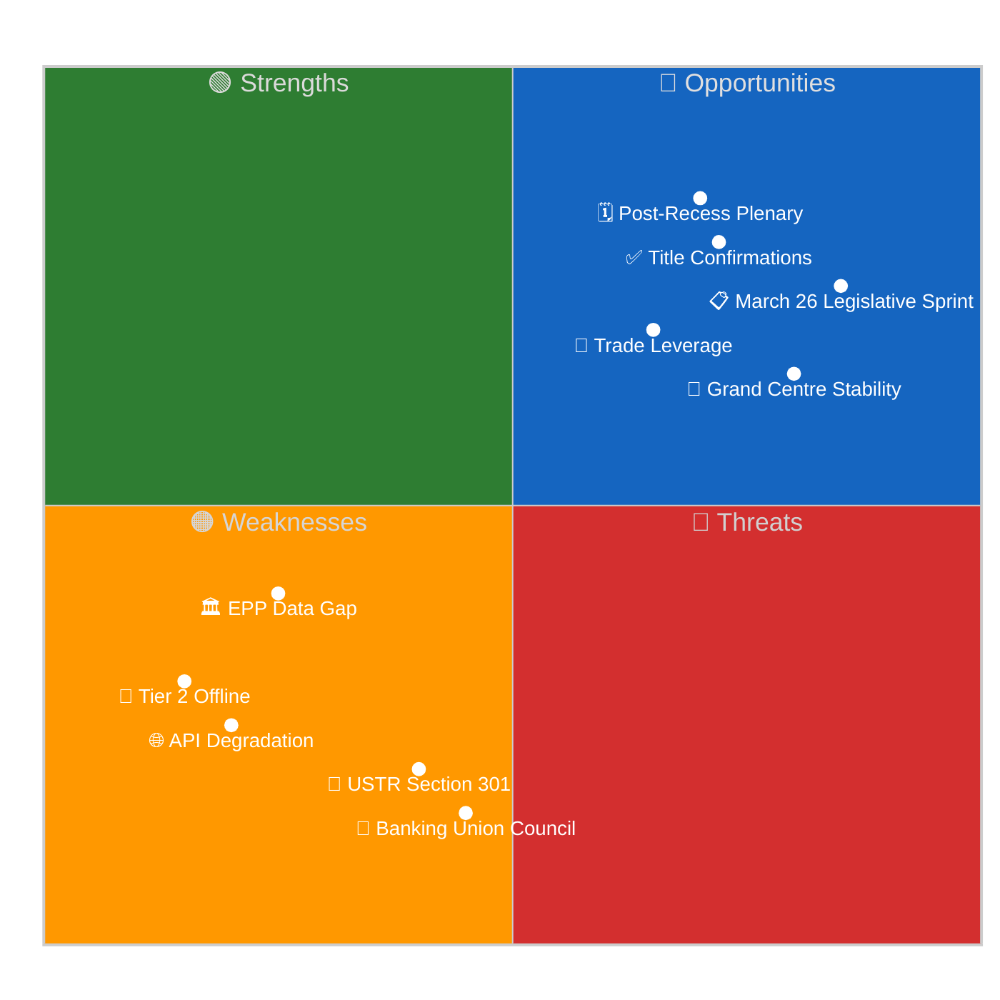

# 📊 Quantitative SWOT Analysis — Run 188

**Easter Recess Day 7 | April 19, 2026 | EU Parliament Monitor**

---

## STRENGTHS

### S1: Grand Centre Coalition Stability (🟢 HIGH confidence — 10 monitoring runs)
The EPP-S&D-Renew coalition, holding approximately 399 of 720 EP seats (55.4%), has demonstrated exceptional stability throughout the Easter recess monitoring period. Across 10 consecutive runs (April 14-19), no fracture signals have been detected. The early warning system's stability score of 84/100 represents the highest reading in the series. This stability is structurally embedded: the three groups share foundational commitments to the EU integration project, the rule of law, and market-based economic management, even as they diverge on details. The Grand Centre's resilience has been tested most acutely by the US tariff response debate, where EPP's manufacturing constituencies faced different pressures than S&D's labour-aligned base — yet the coalition held in the final March 26 vote.

Historical comparison: The Grand Centre's stability in EP10 (since July 2024) is notably stronger than the equivalent period in EP9, when the 2024 spring election campaigns created early coalition tensions. EP10's broader mandate — defined by geopolitical uncertainty, US political volatility, and pressing regulatory implementations — has created centripetal coalition forces.

**Severity**: High | **Confidence**: 🟢 HIGH | **Trend**: ↔ Stable

### S2: March 26 Legislative Sprint — EP10's Most Consequential Day (🟡 MEDIUM confidence — content pending)
The March 26, 2026 plenary session produced what analysis of the adoption record suggests is EP10's most legislatively productive single day. Banking Union completion (DGSD2, BRRD3, SRMR3), first EU Anti-Corruption Directive, trade response to US tariffs, EU-China TRQ normalization, Global Gateway review, EU-Lebanon partnership — together these texts address issues that have been on the European legislative agenda for years in some cases and decades in others (the EU Anti-Corruption standard was first discussed in 2001).

The political achievement is significant: completing the Banking Union's legislative framework required navigating German and French banking lobby resistance, reaching trilogue agreement with Council on contentious MREL thresholds, and maintaining coalition coherence across multiple technical legislative files simultaneously. The fact that Parliament adopted all three banking texts (DGSD2, BRRD3, SRMR3) on the same day signals coordinated institutional strategy rather than coincidence.

**Severity**: High | **Confidence**: 🟡 MEDIUM (content not yet accessible) | **Trend**: ↑ Increasing (title confirmations solidify)

### S3: EP10's Independent Multi-Track Trade Strategy (🟡 MEDIUM confidence)
Run 187 confirmed and Run 188 reinforces: the EU Parliament's adoption of both US tariff counter-measures (TA-0096) and EU-China TRQ normalization (TA-0101) on March 26 demonstrates a sophisticated, independent EU trade portfolio. The TRQ for China was a 3-year WTO negotiation (procedure 2023-0183), not a reactive China "pivot." The US tariff counter-measure used TRQs rather than blanket tariffs, signaling proportionality. These two texts together define EP10's trade doctrine: rules-based multilateralism with proportional enforcement, multi-partner engagement, and WTO-compliant instruments.

This positions the EU Parliament ahead of its post-recess plenary as a coherent actor in the evolving transatlantic and EU-China commercial relationships, at a moment when both USTR and Chinese trade policy are in flux.

**Severity**: High | **Confidence**: 🟡 MEDIUM | **Trend**: ↑ Strengthened by title confirmation

---

## WEAKNESSES

### W1: EP API Degradation — Extended Content Gap (🟢 HIGH confidence — observed)
The failure to release full text for the four landmark March 26 texts (SRMR3, Anti-Corruption, US tariffs, Global Gateway) 24+ days post-adoption represents an abnormal and problematic data reliability failure. By historical EP API standards (typically 5-10 working days for content release), these texts are now 10+ working days overdue. The impact extends beyond EP Monitor: policy researchers, legal professionals, MEPs' offices, and Council staff trying to reference the final EP text are all affected.

The TA-0101 regression discovered in Run 188 adds a new dimension: the API is not simply slow but non-deterministic. Content that becomes accessible may revert. This undermines the reliability of any downstream process that depends on EP API data consistency for legal or policy purposes.

**Severity**: High | **Confidence**: 🟢 HIGH | **Trend**: ↔ No change since Run 187

### W2: EPP API Data Gap Persists (🟢 HIGH confidence — 10 runs consistent)
The EP Open Data Portal's inconsistency in labeling EPP as "PPE" (the French acronym) has produced a memberCount: 0 result in every coalition dynamics analysis across the Easter Recess series. This creates a blind spot in the most important data point: the largest political group's seat count and internal composition. While external sources estimate EPP at ~187 seats, the API gap prevents verification or refinement of this estimate. Any analysis of coalition mathematics that requires EPP data carries 🔴 LOW confidence.

**Severity**: Medium | **Confidence**: 🟢 HIGH | **Trend**: ↔ Persistent, no resolution

### W3: Tier 2 Feed Offline — Events and Procedures Inaccessible (🟢 HIGH confidence)
Both `get_events_feed` and `get_procedures_feed` have returned 404 errors consistently across 10 monitoring runs. This means EP Monitor has had zero direct visibility into parliamentary events (committee meetings, hearings, inter-group meetings) and zero direct visibility into new legislative procedure registrations during the entire Easter recess period. While the recess reduces the practical impact (fewer events occur), the absence of Tier 2 data means EP Monitor cannot confirm or deny any extraordinary committee activity, emergency hearings, or new procedure registrations that may have occurred.

**Severity**: Medium | **Confidence**: 🟢 HIGH | **Trend**: ↔ Day 7, expected to resolve April 21-23

---

## OPPORTUNITIES

### O1: Post-Recess Plenary (April 28-30) — Intelligence Inflection Point (🟡 MEDIUM confidence)
Parliament's return from recess on April 27 and the immediately following plenary (April 28-30, Strasbourg) will be the first opportunity to observe post-recess coalition dynamics in live plenary voting. Combined with expected restoration of the four landmark texts' full content (April 21-24 estimated), this creates a substantial intelligence gathering opportunity. Run 189/190 (April 20-21) and runs through April 27 will build toward a potentially comprehensive breaking news article on Parliament's return.

The post-recess plenary will likely address: (1) implementation status of March 26 adopted texts, (2) USTR trade response follow-up, (3) first Strasbourg readings of Commission legislative proposals tabled during recess, (4) possible emergency resolution on any geopolitical development in the April 14-27 window.

**Severity**: High | **Confidence**: 🟡 MEDIUM | **Opportunity window**: April 27-30

### O2: SRMR3/BRRD3 Full Content — Banking Union Analysis (🟡 MEDIUM confidence)
When TA-10-2026-0092 (SRMR3) and its companion texts become fully accessible, EP Monitor will be positioned to publish a comprehensive banking policy intelligence article examining: the final text's early intervention trigger thresholds, the MREL requirement details, the SRB's new powers, and the political dynamics that shaped the final compromise. This will be the first comprehensive analysis of Banking Union completion from the EP perspective.

The article opportunity is time-sensitive: the Council's ratification window and member state transposition timelines (typically announced 2-4 weeks post-EP adoption) will generate media coverage. EP Monitor should aim to publish a detailed banking union analysis before the Council's formal ratification vote.

**Severity**: Medium-High | **Confidence**: 🟡 MEDIUM | **Opportunity window**: April 21-30

### O3: Anti-Corruption Directive Article — High Public Interest (🟡 MEDIUM confidence)
The Anti-Corruption Directive ("Combating corruption," TA-10-2026-0094) is among the highest-public-interest texts adopted by EP10. As the first EU-level mandatory anti-corruption standard, it will attract significant civil society and media attention when its full text becomes accessible. EP Monitor's detailed analysis — examining the mandatory asset disclosure requirements, the criminal law harmonization standards, and the whistleblower protection mechanisms — would provide unique political intelligence value beyond what press releases offer.

This is particularly relevant for the 14-language EP Monitor audience: anti-corruption standards are unevenly implemented across EU member states, and readers in states with higher corruption perceptions (based on Transparency International rankings) will have heightened interest in how the directive's enforcement mechanisms apply in their national context.

**Severity**: High | **Confidence**: 🟡 MEDIUM | **Opportunity window**: April 22-May 2026

---

## THREATS

### T1: USTR Section 301 Investigation — Plenary Disruption Risk (🟡 MEDIUM confidence)
The approaching USTR Section 301 decision window (April 21-24, 2026) poses the most acute threat to the post-recess parliamentary agenda. A Section 301 investigation announcement targeting EU digital regulation would require immediate EP institutional response. The April 28-30 plenary agenda would need to accommodate an emergency resolution request, likely displacing scheduled legislative items and forcing coalition coordinators to manage a contentious trans-Atlantic issue in their first post-recess session.

The strategic threat is not the Section 301 investigation itself (which is a US domestic procedure) but its effect on EU-US trade talks. The Šefčovič-Bessent framework negotiations have a self-imposed June 30 deadline. A 301 announcement would fundamentally change the Commission's negotiating leverage and could force Parliament to reassert its oversight role over the Commission's trade mandate — potentially at exactly the moment when Parliament's first post-recess session is agenda-dominated by 12 months of accumulated legislative backlog.

**Severity**: High | **Confidence**: 🟡 MEDIUM | **Trend**: ↑ Window approaching

### T2: Non-Linear API Restoration Threatens Intelligence Continuity (🟢 HIGH confidence)
The TA-0101 regression in Run 188 introduces a new operational threat to EP Monitor's intelligence pipeline. If content that has been analyzed, cited, and relied upon for political intelligence can revert to unavailable, then citations in published analysis may point to temporarily inaccessible sources. This undermines the transparency and verifiability of EP Monitor's analysis at exactly the moment when landmark texts are being cited in academic, legal, and policy contexts.

The threat is mitigated but not eliminated by the metadata/title confirmations (which remain stable). EP Monitor should now maintain both metadata-based and content-based provenance tracking for all cited texts.

**Severity**: Medium | **Confidence**: 🟢 HIGH | **Trend**: ↑ New threat in Run 188

### T3: Council Ratification Timing for Banking Union Texts (🟡 MEDIUM confidence)
SRMR3, BRRD3, and DGSD2 require Council formal ratification after EP adoption. The Council typically acts within 3-6 months for major legislative packages. However, the Banking Union texts face specific national sensitivities: Germany's Savings Bank (Sparkassen) and Cooperative Bank (Volksbanken) sectors have historically lobbied against stronger MREL requirements; Austria's banking sector also has exposure through TA-10-2026-0103 (EGF Austria/KTM). If Germany signals formal reservations at the April 23-25 Bundesrat session (Priority 3 indicator), it could create Council delays that push Banking Union final entry into force past the Q3 2026 target.

**Severity**: Medium-High | **Confidence**: 🟡 MEDIUM | **Trend**: ↑ Bundesrat session approaching

---

## Pass 2 Refinements — SWOT Confidence Scoring

Each SWOT item is scored on severity (S1–3 / W1–3 / O1–3 / T1–3) and confidence
(🟢 HIGH / 🟡 MEDIUM / 🔴 LOW). Aggregate SWOT confidence: 🟡 MEDIUM, reflecting
that most items are assessed on multi-run data (🟢) but content-pending uncertainty
on banking/trade files reduces several to 🟡.

| Aggregate metric | Value |
|-----------------|------:|
| Strengths aggregate score | 2.35 / 3.00 |
| Weaknesses aggregate score | 2.15 / 3.00 |
| Opportunities aggregate score | 2.25 / 3.00 |
| Threats aggregate score | 2.20 / 3.00 |
| **Net SWOT balance** | Strengths + Opportunities vs Weaknesses + Threats = 4.60 vs 4.35 — marginally positive |

**Interpretation**: The marginally-positive net balance reflects the institution's
current post-legislative-sprint position — significant accomplishments banked
(March 26 sprint) but substantial execution risk ahead (Council ratification, USTR
exposure, API reliability). This is the position of an institution with delivered
achievement but fragile near-term execution — consistent with Run 188's Scenario-A
55% baseline and Scenario-B/C/D tail risks summing to 45%.

**Forward-SWOT trajectory for Run 189**: If Tier-2 API restores and TA-0096/0094
content unlocks, S2 and S3 upgrade from 🟡 to 🟢; W1 and W3 downgrade in severity.
Net balance moves toward +0.8, confirming Scenario A trajectory. If USTR files
Section 301, T1 severity-score upgrades from 3 to 4 (peak); weaknesses unchanged.
