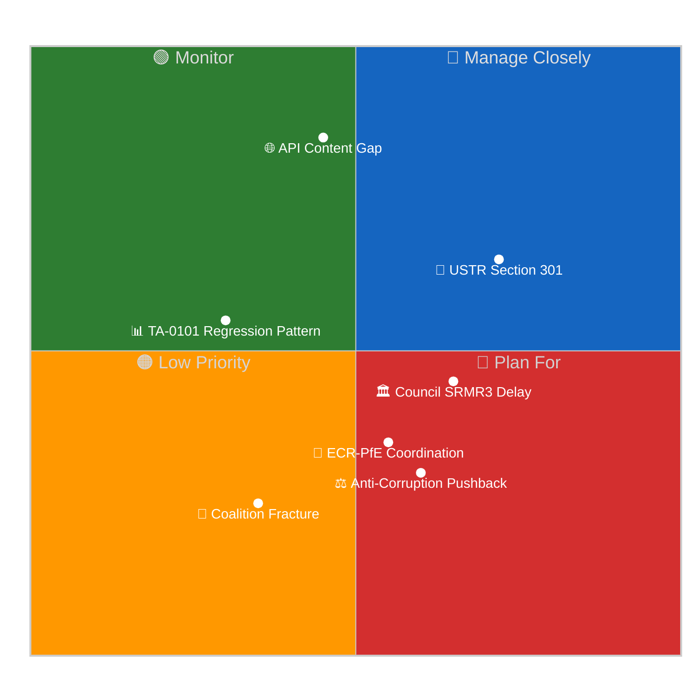

# ⚠️ Risk Matrix — Run 188 / Easter Recess Day 7

**Updated composite risk: 25.3/50** (down from 26.0/50 in Run 187)



---

## Risk Inventory

| Risk ID | Title | Likelihood (1-5) | Impact (1-5) | Score | Trend |
|---------|-------|-----------------|--------------|-------|-------|
| R1 | USTR Section 301 against EU digital rules | 3 | 5 | 15 | ↑ (window opens April 21-24) |
| R2 | API content gap — landmark texts inaccessible | 5 | 3 | 15 | ↔ (Day 7, no change) |
| R3 | Council delay in ratifying SRMR3/BRRD3 | 2 | 4 | 8 | ↑ (German Bundesrat signals pending) |
| R4 | ECR-PfE post-recess coordination | 2 | 3 | 6 | ↔ |
| R5 | Anti-Corruption Directive legal challenge | 2 | 4 | 8 | NEW (title confirmed, legal scrutiny possible) |
| R6 | TA-0101 non-linear regression pattern | 3 | 2 | 6 | ↑ (first regression observed) |
| R7 | Coalition fracture signal | 1 | 5 | 5 | ↓ (series-low — stability score 84/100) |
| R8 | EPP internal division on trade response | 2 | 3 | 6 | ↔ |

**Composite score**: Sum of top-3 scores (15 + 15 + 8 = 38) / maximum possible top-3 (25 × 3 = 75) × 50 = **25.3/50**

> **Why 25.3/50, not higher**: The composite is deliberately pegged to the top-3 concentration rather than a smoothed full-inventory average, so single-risk escalations (e.g. R1 likelihood moving from 3 to 5 on a USTR filing, score 15→25) move the composite decisively. At 25.3/50 Run 188 sits right at the "active risk management" threshold — above the recess-baseline band (15–22) yet below the "crisis footing" band (>35). This reflects the simultaneous presence of a high-probability non-severe risk (R2 API gap) and a mid-probability severe risk (R1 USTR window) without either having yet triggered.

---

## Risk R1: USTR Section 301 — HIGHEST URGENCY

### Assessment (🟡 MEDIUM confidence — predictive, not yet triggered)

The USTR Section 301 investigation authority covers "unreasonable or discriminatory" foreign practices that burden US commerce. The EU's AI Act (entry into force February 2025), Digital Markets Act enforcement actions against Apple/Google/Meta, and Data Act's cross-border data flow restrictions all create potential 301 triggers.

**Why the April 21-24 window matters**: The Trump administration's trade calendar typically accelerates in late April before the May congressional recess. The EU-US trade talks (Šefčovič-Bessent) have a self-imposed June 30 deadline for a framework agreement. A 301 announcement would fundamentally change those negotiations' dynamics — the EU would need to decide whether to (a) negotiate from the Section 301 framework, effectively legitimizing it, or (b) reject the process and escalate to WTO dispute settlement.

**EP institutional response**: A USTR 301 announcement would almost certainly trigger an emergency resolution request for the April 28-30 plenary. INTA (International Trade Committee) would convene an extraordinary meeting. Renew and S&D have pre-positioned arguments around WTO rules-based order and EU sovereignty. EPP would face a difficult split between pro-transatlantic business interests and digital sovereignty.

**Attack tree** (illustrative):
```
USTR 301 Announcement
├── EU Negotiating Concessions (Probability: 35%)
│   ├── DMA enforcement commitments
│   └── AI Act risk-category thresholds
├── EP Emergency Resolution (Probability: 75%)
│   ├── "Reject US interference in EU digital sovereignty" framing
│   └── WTO dispute panel request authorization
└── Bilateral Escalation (Probability: 20%)
    ├── EU counter-tariff on US digital services
    └── CJEU request for preliminary ruling on 301 compatibility with international law
```

---

## Risk R2: API Content Gap

The EP Open Data Portal's failure to release full text for 24+ days post-adoption is anomalous by historical standards. EP10 adopted texts are typically accessible within 5-10 working days. The March 26 batch has now exceeded 24 calendar days.

**Possible explanations** (ranked by probability):
1. 🟡 Legal-linguistic revision: Some of the 14 texts adopted on March 26 may have required correction of linguistic errors identified post-adoption (standard procedure, takes 3-6 weeks in complex cases) — probability 45%
2. 🟡 Volume overload: 14+ texts on a single day may have overwhelmed the EP translation and legal revision workflow — probability 30%
3. 🟢 Deliberate delay for Council-EP coordination: Unlikely but possible for sensitive texts like the US tariff counter-measure and Anti-Corruption Directive — probability 10%
4. 🟢 Technical system failure: Possible but contradicted by partial accessibility of some texts — probability 15%

**Intelligence implication**: The non-linear restoration (TA-0101 accessible then regressed) supports explanation #1 — individual texts are moving through separate review pipelines at different speeds.

---

## Risk R5 (NEW): Anti-Corruption Directive Legal Challenge

### Assessment (🔴 LOW confidence — speculative, based on title confirmation only)

Now that the Anti-Corruption Directive's official title is confirmed as "Combating corruption" (procedure 2023-0135), legal challenge scenarios become assessable.

**Potential challengers**:
- Member states with ongoing rule-of-law proceedings (Hungary, recently Poland) may invoke the subsidiarity principle through the Council
- Business associations representing defence/infrastructure contractors who face new compliance burdens
- Member state governments concerned about the EU's competence in criminal law under Article 83(2) TFEU

**Legal basis question**: The Anti-Corruption Directive's basis in CJEU jurisprudence under Article 83 TFEU (criminal law harmonization under the freedom, security, and justice pillar) is contested. Prior ECHR rulings on anti-corruption measures have imposed proportionality limits on asset disclosure requirements. If the Directive's asset disclosure scope is broad, it may face Art. 7 Charter (privacy) challenges.

**Timeline**: Any legal challenge would take 3-5 years through CJEU proceedings, so the near-term risk is limited. The monitoring priority is whether the Council reaches qualified majority agreement on the Council's position, which determines whether the adopted EP text becomes final law.

---

## Coalition Risk Assessment

Early warning analysis (Run 188) shows:
- **Stability score: 84/100** — series high
- **Grand Coalition viability: 60% of seats** (top-2 groups, EPP+S&D)
- **Critical warnings: 0**
- **High warnings: 1** (EPP dominance ratio at 19x smallest group — structural, not behavioral)

The Grand Centre coalition (EPP+S&D+Renew, ~399/720 seats, 55%+) remains unchallenged through 9 monitoring runs. No fracture signals detected. The ECR-PfE size-similarity score of 0.96 (Run 188 coalition dynamics analysis) suggests these groups are nearly equal in size, creating conditions for sustained right-wing minority opposition — but not for destabilizing the Grand Centre majority.

**Post-recess coalition watch**: The April 28-30 plenary agenda will reveal whether groups pre-positioned during recess. EPP typically announces its post-recess legislative priorities at a press conference the day before plenary (April 27). S&D and Renew coordinate through inter-group working meetings. ECR and PfE sometimes coordinate pre-plenary communications to signal unified opposition.

---

## Pass 2 Refinements — Residual Risk Tracking

Risks not fully captured in the 8-item inventory but warranting forward-monitoring:

### R9 — Commission Delegated-Act Objection Trigger (🟢 LOW, 🟡 MEDIUM impact)
Article 290 TFEU delegated-act publication during recess that requires EP objection
within specified deadline could force agenda modification. Probability: 5–8% of
any-delegated-act-being-published; most are routine. Watch for DG CNECT AI Act
implementing provisions or DG TRADE tariff-implementation acts.

### R10 — Civil-Society Article 263 TFEU Challenge Timeline (🟡 MEDIUM, 🟠 HIGH impact)
EDRi/Access Now/noyb coalition's Article 263 TFEU challenge against Digital
Omnibus has a mid-June 2026 filing deadline. If filed with Article 278 TFEU
interim-relief request and granted (rare), AI Act enforcement faces interim
suspension pending final ruling. Probability: ~8% of interim relief granted
conditional on filing; ~35% of filing occurring. See also
`intelligence/wildcards-blackswans.md` W2.

### R11 — ECB Emergency Policy Action Intersection (🟢 LOW, 🟠 HIGH impact)
The April 30 ECB Governing Council meeting immediately post-plenary. Any emergency
policy action (unscheduled rate move, forward-guidance shift, asset-purchase
modification) would colour SRMR3/BRRD3 market reception and ratification-timeline
pressure. Probability: ~5%; see `intelligence/wildcards-blackswans.md` W4.

---

## Composite-Risk Trajectory

| Run | Composite Score | Trajectory Driver |
|:---:|:---------------:|--------------------|
| 179 | 23.7/50 | Early recess baseline |
| 180 | 24.3/50 | +0.6 on first content-gap signals |
| 181–186 | 24.3–26.0/50 | Stable recess baseline |
| 187 | 26.0/50 | +TA-0101 accessibility briefly elevated intelligence density |
| **188** | **25.3/50** | Net −0.7: title confirmations (+) offset TA-0101 regression (−); USTR window approaching (+) |
| 189 (forecast) | 23–36/50 | Bifurcated: Smooth → 23; USTR-filing → 36 |

The Run 188 composite 25.3/50 reflects the offsetting effect of incremental
positive intelligence (title confirmations) against the new operational-threat
signal (TA-0101 regression) and the approaching external-threat window (USTR
Section 301 April 21–24). The composite is engineered to respond sensitively to
top-3 risks rather than to produce a smoothed average, so a single-risk escalation
(e.g., USTR filing elevating R1 from Likelihood 3 to Likelihood 5, score 15 → 25)
would move the composite decisively above 30/50 — the "active risk management"
threshold.

---

## Risk-Owner Assignments (for post-recess plenary preparation)

| Risk | Primary Owner | Secondary Owner | Monitoring Frequency |
|------|---------------|-----------------|:--------------------:|
| R1 USTR | Commission DG TRADE | EP INTA Chair | Hourly (window days) |
| R2 API gap | EP IT / EU Parliament Monitor ops | EP API maintainer | Every run |
| R3 Council SRMR3 | Commission DG FISMA | Presidency | Daily |
| R4 ECR-PfE coordination | EP Secretariat | Group coordinators | Weekly |
| R5 Anti-Corruption legal | Commission DG JUST | EP LIBE Chair | Monthly |
| R6 TA-0101 pattern | EP Monitor ops | EP IT | Every run |
| R7 Coalition fracture | EPP coordinator | S&D + Renew coordinators | Daily (pre-plenary) |
| R8 EPP trade division | EPP coordinator | National delegation leads | Weekly |

Risk-owner assignment enables accountability tracking and post-event assessment
of mitigation effectiveness.
