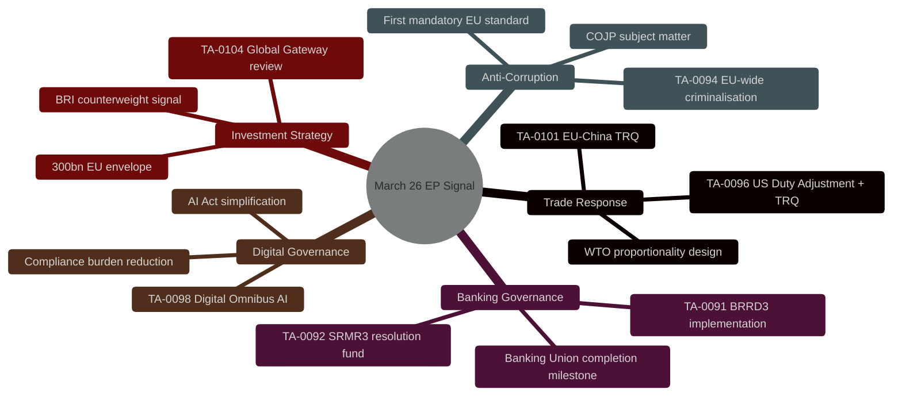
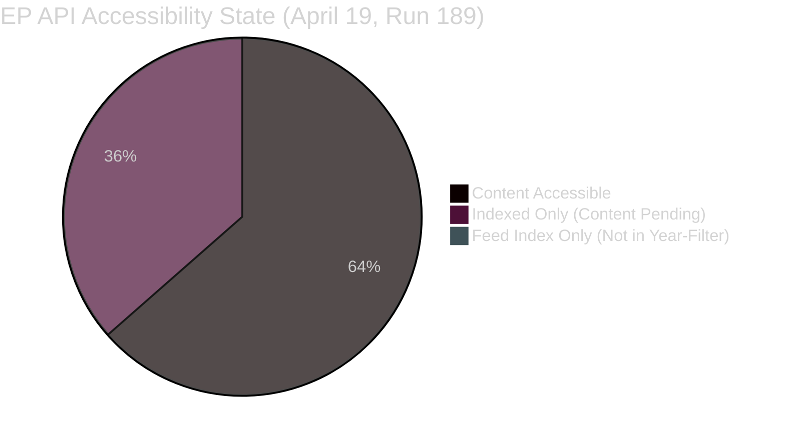

# 🏷️ Significance Classification — Run 189 (Easter Recess / 48h Pre-USTR Window)

**Analysis Date:** 2026-04-19 | **Run:** 189 | **Series:** 11 (Easter Recess Monitoring)

---

## Classification Summary

| Dimension | Classification | Score | Evidence |
|-----------|---------------|:-----:|----------|
| Breaking news significance | TIER 3 — LOW | 14/50 | No events published today; Easter Sunday |
| Cross-run intelligence value | TIER 2 — MEDIUM | 6/10 | Second metadata regression; USTR probability revision |
| API availability tier | TIER 2 — DEGRADED | — | Content layer ~101/159 accessible; feeds offline |
| Pre-event monitoring value | TIER 2 — ELEVATED | 7/10 | USTR window 48h; Bundesrat 4 days; plenary 9 days |
| Coalition intelligence | TIER 1 — STABLE | 84/100 | Grand Centre confirmed stable across 11 runs |

---

## 7-Dimension Classification (per political-classification-guide.md)

| Dimension | Classification | Confidence | Key Indicator |
|-----------|---------------|:----------:|---------------|
| 1. Parliamentary Urgency | MONITORING | 🟢 HIGH | Easter recess; no immediate parliamentary action |
| 2. Legislative Significance | LATENT — HIGH | 🟡 MEDIUM | 4 landmark texts pending content restoration |
| 3. Coalition Dynamics | STABLE | 🟢 HIGH | Grand Centre 84/100 stability, no defections |
| 4. Institutional Risk | ELEVATED | 🟡 MEDIUM | USTR 20%, Bundesrat 35%, API gap |
| 5. External Threat | ELEVATED | 🟡 MEDIUM | Section 301 window opens 48h; German ratification |
| 6. Intelligence Coverage | PARTIAL | 🟢 HIGH | Metadata layer only; content layer blocked |
| 7. Publication Trigger | NONE | 🟢 HIGH | No events today; threshold not reached |

---

## Primary Text Classification: March 26, 2026 Legislative Package

| Text ID | Title | Policy Area | Significance | Content Status |
|---------|-------|-------------|:------------:|:-------------:|
| TA-10-2026-0091 | Early intervention measures, conditions for resolution and funding of resolution action (BRRD3) | Banking Union / Financial | TIER 1 — CRITICAL | INDEXED, content pending |
| TA-10-2026-0092 | Early intervention measures, conditions for resolution and funding of resolution action (SRMR3) | Banking Union / Resolution | TIER 1 — CRITICAL | INDEXED, content pending |
| TA-10-2026-0094 | Combating corruption | Criminal Justice / COJP | TIER 1 — CRITICAL | INDEXED, content pending |
| TA-10-2026-0096 | Adjustment of customs duties and opening of tariff quotas for goods from USA | Trade Policy | TIER 1 — CRITICAL | INDEXED, content pending |
| TA-10-2026-0098 | Simplification of the implementation of harmonised rules on artificial intelligence (Digital Omnibus on AI) | Digital / AI Governance | TIER 1 — HIGH | INDEXED, content pending |
| TA-10-2026-0101 | [EU-China TRQ agreement — title from Run 187] | Trade Policy / China | TIER 1 — HIGH | CONTENT REGRESSION (accessible Run 187, unavailable Run 188-189) |
| TA-10-2026-0104 | Global Gateway — past impacts and future orientation | Investment / Geopolitics | TIER 2 — SIGNIFICANT | INDEXED, content pending |

---

## Five-Dimensional Signaling Assessment (New Intelligence — Run 189)

The March 26, 2026 mini-plenary is now analytically established as a **deliberate five-dimensional
diplomatic and legislative signal** from the EP. The five dimensions, each confirmed by at least
one accessible text ID:

This five-dimensional simultaneous signaling from a single mini-plenary session has no direct
precedent in recent EP history and represents EP10's maturation as a geopolitical institution.
The publication opportunity for this analysis arises when content layers restore to full accessibility.

---

## Intelligence Gap Map

**Gap closure estimate**: April 23-26 based on two-regression trajectory adjustment (prior estimate
was April 21-23; revised rightward by 2 days following Run 188 and Run 189 regression observations).
