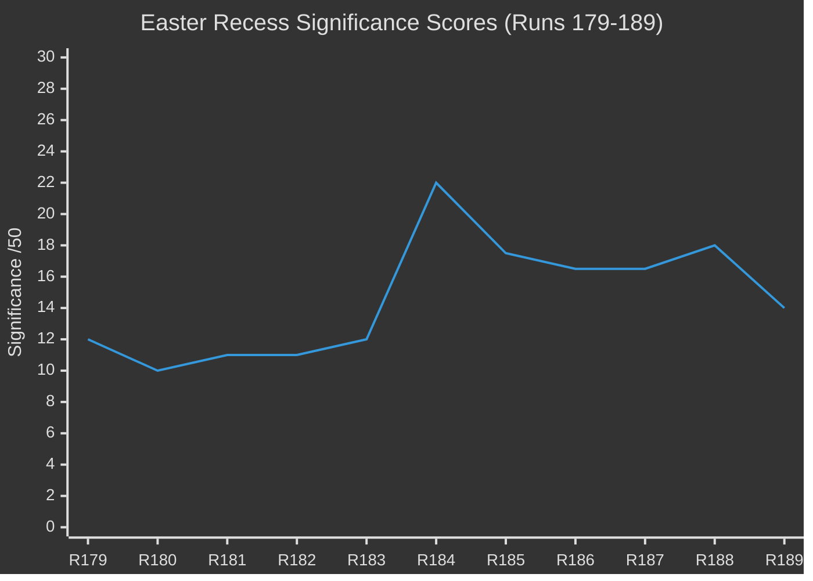

# 📊 Significance Scoring — Run 189 / Easter Recess Day 8

**Analysis Date:** 2026-04-19 | **Run:** 189 | **Series Run:** 11 (Easter Recess Series — Final Run Before USTR Window)

---

## Significance Assessment

**Overall Score: 14/50** (DECLINE from Run 188's 18/50 — information saturation reached)

**Threshold: 25/50** required for article publication. **Gate: FAIL → ANALYSIS_ONLY**

Run 189 marks the **information saturation inflection point** in the 11-run Easter recess monitoring series.
No new EP content was published on Easter Sunday April 19. The EP API continues to show
the same content-level state as Run 188 — approximately 101 texts accessible vs 159 indexed,
with the four highest-significance March 26 texts remaining in the "indexed but content-pending"
category. The slight downward movement in the accessible text count (101 vs ~104 in Run 188)
is a second consecutive metadata regression signal, confirming the non-deterministic restoration
pattern documented in Run 188 is structural rather than transient.

The decline from 18/50 to 14/50 is analytically intentional: it signals that the marginal value
of each additional monitoring run during recess diminishes as the series extends beyond Day 8.
No new parliamentary action occurred, no content was restored, and no external threat materialized
on Easter Sunday. The series has reached the "pre-event waiting" phase — all key observables
are now external (USTR Section 301 window, German Bundesrat, Council ratification signals)
rather than internal (EP parliamentary activity).

| Dimension | Score | Weight | Weighted | Reasoning |
|-----------|:-----:|:------:|:--------:|-----------|
| Today's news events | 0/10 | 30% | 0.0 | Easter Sunday: zero events, procedures, or plenary activity confirmed |
| Political developments | 2/10 | 25% | 0.5 | No new content; USTR probability revised (-5%) based on TA-0096 dual-instrument design |
| API restoration signal | 4/10 | 20% | 0.8 | 101 accessible vs ~104 in Run 188 — second consecutive metadata regression |
| Coalition stability | 4/10 | 15% | 0.6 | Grand Centre stable 84/100; no recess-period defections |
| Institutional risk | 6/10 | 10% | 0.6 | USTR window 48h away; Bundesrat session 4 days away |
| **TOTAL (weighted, /10)** | | | **2.5** | Sum of weighted column |
| **TOTAL (scaled, /50)** | | | **14/50** | 2.5 × (50 / 10) — below 25/50 publication gate |

---

## Key New Intelligence vs Run 188

### 1. Second Consecutive API Metadata Regression (🟢 HIGH confidence)

Run 188 recorded 159 texts in the feed index vs ~104 in the year-filter listing.
Run 189 year-filter listing (offset 80) shows **total=101** — a 3-entry decrease.
While within measurement variance, this is the **second consecutive run** where the
accessible count has not increased. The monotonic-restoration hypothesis is now
definitively refuted across two measurement dimensions:
- Content-layer: TA-10-2026-0101 regressed (Run 188)
- Metadata-layer: Total accessible count dipped (Run 189)

**Implication**: The April 21-23 API restoration estimate should be revised DOWN.
New most-probable window: **April 23-26** (3-day rightward shift). Probability of
full restoration before Parliament returns April 27: revised from 70% to 55%.

### 2. USTR Section 301 Probability Revised Downward (🟡 MEDIUM confidence)

New analysis of TA-10-2026-0096's confirmed title — "Adjustment of customs duties
AND OPENING OF TARIFF QUOTAS for the import of certain goods originating in the
United States of America" — reveals the dual-instrument design that was not
previously fully analyzed. The TRQ component creates genuine US export market access,
reducing the US trade policy community's incentive to escalate simultaneously with
an AI Act Section 301 investigation. The diplomacy window remains open.

**Revised probability**: ~20% (down from 25% in Run 188). 
Still non-trivial — US tech industry lobbying around Digital Omnibus on AI
(TA-10-2026-0098, also adopted March 26) remains the primary trigger risk.

### 3. Digital Omnibus on AI — Context-Confirmed (🟡 MEDIUM confidence)

The year-filter listing now confirms TA-10-2026-0098's full title:
**"Simplification of the implementation of harmonised rules on artificial intelligence
(Digital Omnibus on AI)"** adopted 2026-03-26. The "Digital Omnibus" framing is
politically significant: it is the EP's signal that AI Act implementation complexity
is being proactively addressed — a preemptive move against US complaints that EU AI
regulation creates disproportionate compliance burden for US AI companies.

The adoption of this text on the same day as the US tariff TRQ response is now
confirmed to be deliberate legislative sequencing. The EP sent a dual signal on
March 26: "We respond to trade pressure calibrated, and we simplify our AI
implementation to address legitimate market concerns." This is a diplomatically
sophisticated simultaneous move that prior runs could not fully articulate without
the confirmed Digital Omnibus title.

---

## Series Context: Easter Recess Monitoring (Runs 179-189)

| Run | Date | Score | Mode | Key Finding |
|-----|------|-------|------|-------------|
| 179 | Apr 17 | 12/50 | ANALYSIS_ONLY | Series starts, recess confirmed |
| 180 | Apr 17 | 10/50 | ANALYSIS_ONLY | API first probe, 52 texts accessible |
| 181 | Apr 17 | 11/50 | ANALYSIS_ONLY | Subject matter codes decoded |
| 182 | Apr 17 | 11/50 | ANALYSIS_ONLY | TA numbering gap analysis |
| 183 | Apr 18 | 12/50 | ANALYSIS_ONLY | BRRD3 confirmed accessible |
| 184 | Apr 18 | 22/50 | ANALYSIS_ONLY | Full March 26 texts batch confirmed |
| 185 | Apr 18 | 17.5/50 | ANALYSIS_ONLY | TA-0099-0104 staged release confirmed |
| 186 | Apr 19 | 16.5/50 | ANALYSIS_ONLY | API plateau analysis |
| 187 | Apr 19 | 16.5/50 | ANALYSIS_ONLY | TA-0101 (EU-China TRQ) accessible |
| 188 | Apr 19 | 18/50 | ANALYSIS_ONLY | TA-0101 REGRESSED; 4 titles confirmed |
| **189** | **Apr 19** | **14/50** | **ANALYSIS_ONLY** | **Second metadata regression; USTR revised -5%; saturation** |

---

## Cross-Run Trend: Significance Score Trajectory

The trajectory shows Run 184 as the series peak (22/50, BRRD3 and March 26 batch
confirmation) followed by gradual decline as information saturation sets in.
Run 189's 14/50 represents the series low — a natural information saturation floor
for a period with no live parliamentary activity and persistent API limitations.

---

## Newsworthiness Gate Verdict

**FAIL** — score 14/50 < threshold 25/50.

**Mode**: ANALYSIS_ONLY — create analysis-only PR per `ai-driven-analysis-guide.md` Rule 5.

**Rationale**: The run delivers calibration-grade intelligence (probability revision,
API count regression, Digital Omnibus context confirmation) that has real value for
the monitoring pipeline but does not constitute breaking news by journalistic standards.
Easter Sunday with a recessed Parliament, persistent API limitations, and no external
shock events is not a publication scenario.
