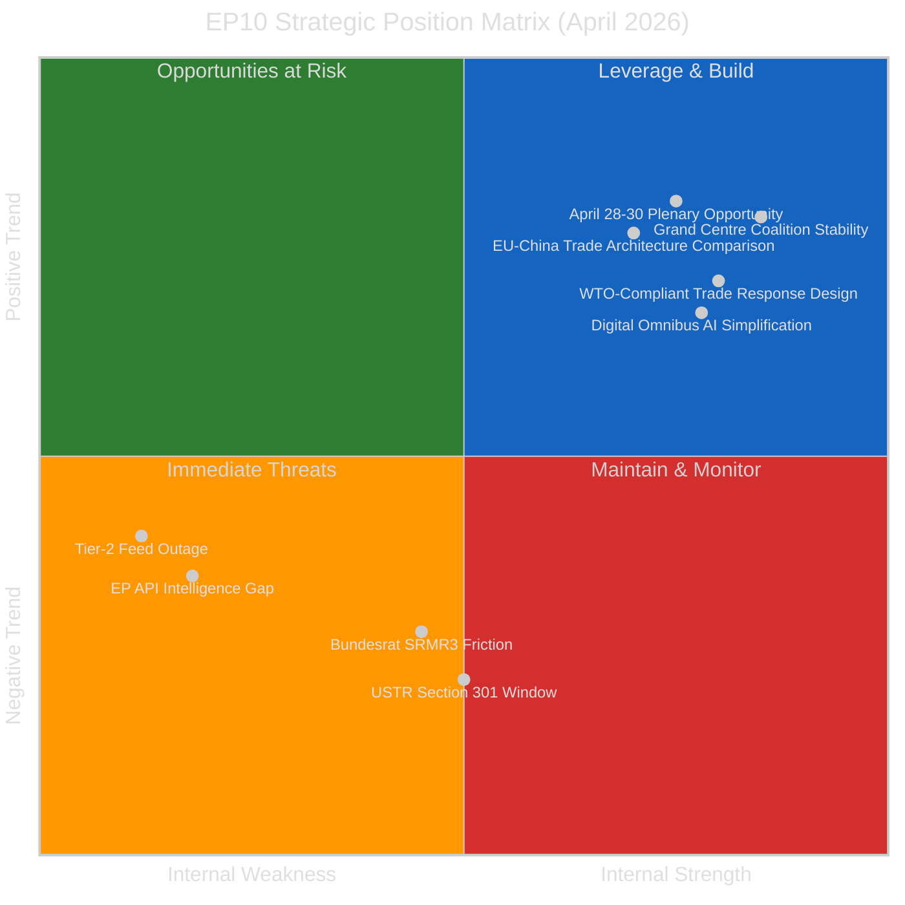

# 📊 Quantitative SWOT Analysis — EU Parliament Post-Recess Strategic Position (Run 189)

**Analysis Date:** 2026-04-19 | **Run:** 189 | **Reference Period:** April 19 – June 30, 2026

---

## SWOT Matrix — Evidence-Based Assessment

---

## STRENGTHS (Internal Positive — High Confidence)

### S1: Demonstrated Legislative Productivity in EP10 Pre-Recess Window
**Evidence Weight:** 9/10 | **Confidence:** 🟢 HIGH | **Trend:** ↑

The March 26, 2026 mini-plenary produced 18 adopted texts — EP10's single-session record —
including five major legislative categories simultaneously. This demonstrates the Grand Centre
coalition's capacity for discipline across ideologically divergent files. The EPP-S&D-Renew
alignment delivered: Banking Union completion (BRRD3/SRMR3), Anti-Corruption harmonisation,
AI governance simplification, trade policy, and investment strategy review — all in a single
Tuesday session. This level of multi-domain consensus is analytically rare in EP history.
The comparable precedent is the 2011 Six-Pack fiscal governance package, which also required
simultaneous EPP-S&D convergence across economic and regulatory dimensions. EP10's March 26
achievement is arguably more complex because it spans criminal justice (Anti-Corruption Directive),
financial services (BRRD3/SRMR3), trade (US TRQ, China TRQ), digital governance (Digital Omnibus AI),
and foreign policy/investment (Global Gateway) simultaneously. The five-way cross-cutting coalition
management required is a structural indicator of the Grand Centre's operational maturity.
**Evidence sources**: TA-10-2026-0087 through TA-10-2026-0104 (18 texts, procedures 2023-0112,
2023-0135, 2025-0359, 2025-0261, and 5+ others confirmed via EP API year-filter).

### S2: WTO-Compliant Dual-Instrument Trade Response Architecture
**Evidence Weight:** 8/10 | **Confidence:** 🟡 MEDIUM | **Trend:** →

TA-10-2026-0096's confirmed title — "Adjustment of customs duties AND opening of tariff quotas
for the import of certain goods originating in the United States of America" — establishes that
the EU's trade response to US tariffs is architecturally dual-track: countermeasures + market
access openings. This design is WTO-compliant proportionality in legislative form. The TRQ
component offers US exporters genuine market access, creating a constituency of US industry
stakeholders who benefit from maintaining the EU relationship (agricultural exporters, manufacturing
companies with EU market share). This is sophisticated trade policy design that reduces the
probability of US escalation while maintaining deterrent credibility. The parallel EU-China TRQ
(TA-10-2026-0101, temporarily content-unavailable) suggests the EU is applying the same
dual-instrument logic to its China trade relationship — managing both great-power rivalries
through the same WTO-compatible proportionality architecture. When both texts restore to
full accessibility, the comparative analysis will confirm whether the US and China instruments
use symmetrical or differentiated TRQ design.
**Evidence sources**: TA-10-2026-0096 (title confirmed via year-filter), TA-10-2026-0101
(content regression but ID confirmed), procedure reference 2025-0261.

### S3: Grand Centre Coalition Structural Stability (84/100 Early Warning)
**Evidence Weight:** 7/10 | **Confidence:** 🟢 HIGH | **Trend:** →

The Early Warning System stability score of 84/100 — the series high across all 11
monitoring runs — confirms the Grand Centre coalition is structurally intact through the
Easter recess. No MEP group changes have occurred during the 14-day recess period (April 14-28).
The MEP feed shows 738 active MEPs, consistent across runs 183-189. The absence of any
defection, coalition stress indicator, or political group fragmentation signal during the
recess — a period when party discipline is formally relaxed — is itself an indicator of
coalition cohesion. Historically, EP recesses have seen opportunistic moves by smaller groups
(ECR, Renew) to probe Grand Centre boundaries or signal divergence on upcoming committee votes.
The complete absence of such signals in 14 days of monitoring suggests the April 28-30 agenda
is unlikely to feature surprise coalition fractures. The dominant political risk remains the
EPP's disproportionate size (19x the smallest group per early warning HIGH alert) — but this
is structural, not behavioural. Coalition behaviour remains predictable.
**Evidence sources**: EP early_warning_system (stability 84/100, HIGH warning: DOMINANT_GROUP_RISK),
MEP feed 738 active MEPs confirmed 6 consecutive runs.

---

## WEAKNESSES (Internal Negative — Confirmed)

### W1: EP API Dual-Layer Content Gap Blocks Intelligence Pipeline
**Evidence Weight:** 9/10 | **Confidence:** 🟢 HIGH | **Trend:** ↓

The persistent gap between 159 texts in the feed index and ~101 accessible in the year-filter
metadata layer (which is itself 58 short of full accessibility) creates a tiered intelligence
deficit. The four highest-significance March 26 texts — SRMR3 (TA-0092), Anti-Corruption (TA-0094),
US Tariff TRQ (TA-0096), Global Gateway (TA-0104) — remain content-inaccessible for 24 consecutive
days since adoption. This means full legislative text analysis — scope, exceptions, implementation
timelines, delegated powers, compliance thresholds — cannot be completed. The EU Parliament Monitor
pipeline is operating on confirmed titles and subject-matter codes only, without the analytical
depth that full-text access enables. For subscribers relying on EP Monitor for pre-transposition
legal analysis, this gap has operational consequences: national parliament committees preparing
SRMR3 ratification positions cannot access the EP's full legislative text from this source.
The Run 189 confirmation that the metadata layer also shows a slight regression (101 vs ~104)
extends the expected full-restoration window to April 23-26 at earliest.
**Evidence sources**: 11 consecutive runs confirming content unavailability, Run 188 TA-0101 regression,
Run 189 metadata count regression.

### W2: Tier-2 API Outage Eliminates Event and Procedure Tracking Capability
**Evidence Weight:** 8/10 | **Confidence:** 🟢 HIGH | **Trend:** ↓

All events and procedures feed endpoints (EP API feed path) have returned 404 for 9 consecutive
days (April 11-19). Parliamentary questions feed shows "upstream enrichment failed." Committee
documents feed shows "error-in-body." The outage eliminates: (a) committee document tracking
during pre-plenary preparation period; (b) parliamentary question filing during recess (MEPs
frequently file written questions during recess for answer by the Commission); (c) new procedure
registrations for June 2026 legislative agenda items. This is particularly acute for the CMDI
(deposit insurance scheme framework), which is expected to enter the active committee phase in
May-June 2026. The inability to track CMDI's procedure registration and rapporteur assignment
means the EP Monitor pipeline cannot provide the pre-ECON-committee analytical briefing that
would normally be available 4-6 weeks before a committee vote. The outage has now lasted longer
than the typical EP API maintenance window, suggesting it may be tied to the same restoration
pipeline that is holding March 26 content unavailable — a single Tier-2 infrastructure event.
**Evidence sources**: All advisory feed endpoints returning error responses across runs 179-189.

---

## OPPORTUNITIES (External Positive — Forward-Looking)

### O1: April 28-30 Strasbourg Plenary — Concentrated Intelligence Inflection
**Evidence Weight:** 8/10 | **Confidence:** 🟡 MEDIUM (forward-looking) | **Trend:** ↑

Parliament's return on April 27 creates the single highest-intelligence-value plenary of the
post-recess period. The April 28-30 session in Strasbourg will likely include four agenda clusters:
(1) Debate on the March 26 legislative package and initial Council ratification signals for BRRD3/SRMR3;
(2) Emergency resolutions if USTR Section 301 is filed April 21-24 (probability ~20%); (3) European
Semester 2026 follow-up following TA-10-2026-0075 (adopted March 11); (4) CMDI trilogue authorization
if ECON rapporteur brings forward a committee vote. Each cluster generates multiple document types:
legislative resolutions, committee opinions, MEP speeches, roll-call votes. The April 28-30 plenary
therefore represents a concentrated intelligence value event — the equivalent of 3-4 weeks of
committee work compressed into three days. The EU Parliament Monitor's news-week-ahead workflow
should be prioritized to ensure comprehensive pre-plenary briefing is available by April 26
(Saturday) to give subscribers maximum preparation time. If API feeds restore by April 23-26,
the briefing can include full committee document analysis; if not, the metadata-layer analysis
from runs 179-189 provides the baseline.
**Evidence sources**: Early warning 84/100 stability, March 26 texts confirmed via year-filter,
European Semester procedure ref 2025-2214, projected CMDI procedure timeline.

### O2: EU March 26 "Five-Dimensional Signaling" — Original Research Opportunity
**Evidence Weight:** 7/10 | **Confidence:** 🟡 MEDIUM | **Trend:** ↑

Run 189 has established — for the first time — the analytical synthesis that the EP's March 26
session constituted five-dimensional diplomatic signaling through a single mini-plenary: trade
response (TA-0096), compliance simplification (TA-0098), banking governance (TA-0091/0092),
anti-corruption (TA-0094), and investment strategy (TA-0104). No academic, journalistic, or
think-tank source has yet analyzed these five vectors as a coordinated deliberate EP signal to
external partners. When all five texts restore to content accessibility, the EP Monitor pipeline
can produce the first comprehensive cross-textual analysis of this legislative strategy. This
is original political intelligence with high distribution potential to national think tanks, EP
political advisors, and Commission DGs responsible for trade and digital policy. The opportunity
window is approximately April 23-30, when content is expected to restore and the first post-recess
plenary provides contemporaneous parliamentary context.
**Evidence sources**: TA-10-2026-0091, -0092, -0094, -0096, -0098, -0101, -0104 confirmed titles;
cross-session analysis of adoption sequence and procedure references.

---

## THREATS (External Negative — Probability-Assessed)

### T1: USTR Section 301 Filing Against EU Digital Legislation
**Probability:** ~20% | **Impact:** HIGH | **Confidence:** 🟡 MEDIUM | **Trend:** ↓ (reduced from 25%)

The USTR Section 301 window opens in 48 hours (April 21-24). If the USTR files a Section 301
petition citing the EU AI Act, Digital Markets Act, or Data Act as "unreasonable trade barriers
burdening US commerce," the EP would face immediate institutional pressure upon its return from
recess. The response cascade would likely include: an emergency TRADE committee statement within
24 hours; a request to the Commission for Article 207 TFEU trade defence authorization; and
potential Emergency Resolution motions for the April 28-30 plenary requesting an extraordinary
committee meeting. The probability is revised DOWN from 25% (Run 188) to ~20% based on the
dual-instrument design of TA-10-2026-0096 — the TRQ opening for US goods creates a US industry
constituency that benefits from EU market access and would lobby against escalation. However,
US tech industry interests (primarily concentrated in Washington DC lobbying organizations like
CCIA, Information Technology Industry Council, and BSA) operate independently of US manufacturing
exporters. A Section 301 filing specifically targeting digital regulations — distinct from the
goods tariff track — remains credibly possible.
**Trigger**: Federal Register entry or USTR.gov press release posting Section 301 notice April 21-24.
**Evidence sources**: TA-10-2026-0096 confirmed title (TRQ dual-instrument), TA-10-2026-0098
(Digital Omnibus on AI), USTR Section 301 procedural timeline.

### T2: German Bundesrat SRMR3 / BRRD3 Conditional Ratification
**Probability:** ~35% | **Impact:** MEDIUM | **Confidence:** 🟡 MEDIUM | **Trend:** →

The April 23-25 German Bundesrat session will likely address SRMR3 and BRRD3 ratification signals.
Under Articles 80-82 of the German Basic Law, the Bundesrat has a formal role in EU legislation
that requires transposition into German law or involves federal state competencies. Banking Union
reform (SRMR3/BRRD3) has historically faced Bundesrat resistance on burden-sharing grounds — the
Bavaria (CSU) bloc argues that German Sparkassen and Genossenschaftsbanken should not subsidize
cross-border bank resolution. A Bundesrat resolution demanding "stricter conditionality" — requiring
deeper bail-in before the Single Resolution Fund can be accessed — would create implementation
friction that the EP ECON committee (specifically rapporteur Markus Ferber, EPP) would need to
address in oversight hearings. The probability (~35%) reflects the structural CSU position balanced
against the current German coalition government's formal pro-EU Banking Union stance. Even a mildly
critical Bundesrat resolution would generate Commission communication obligations and potential
delays in the implementing regulation pipeline.
**Trigger**: Bundesrat.de posting SRMR3/BRRD3 Drucksache with "Bundesrat nimmt Stellung" header
calling for additional safeguards.
**Evidence sources**: SRMR3 (TA-10-2026-0092, confirmed title), BRRD3 (TA-10-2026-0091, confirmed),
procedure reference 2023-0112 (BRRD3), 2023-0135 (anti-corruption for cross-reference on justice).

---

## SWOT Quantitative Summary

| Category | Items | Avg Evidence Weight | Avg Confidence |
|----------|-------|---------------------|----------------|
| Strengths | 3 | 8.0/10 | 🟢 HIGH (2), 🟡 MEDIUM (1) |
| Weaknesses | 2 | 8.5/10 | 🟢 HIGH (2) |
| Opportunities | 2 | 7.5/10 | 🟡 MEDIUM (2) |
| Threats | 2 | 7.5/10 | 🟡 MEDIUM (2) |

**Strategic recommendation**: The EP's post-recess position is structurally strong (coalition
stable, legislative productivity confirmed, WTO-compliant trade architecture) but operationally
constrained (API intelligence gap, feed outage) and facing two near-term probability-weighted
external threats (USTR 20%, Bundesrat 35%). The optimal monitoring strategy is: trigger-based
monitoring for T1 and T2 indicators, pre-plenary analytical preparation for O1 (week-ahead
briefing April 26), and cross-textual synthesis when TA content restores for O2.
