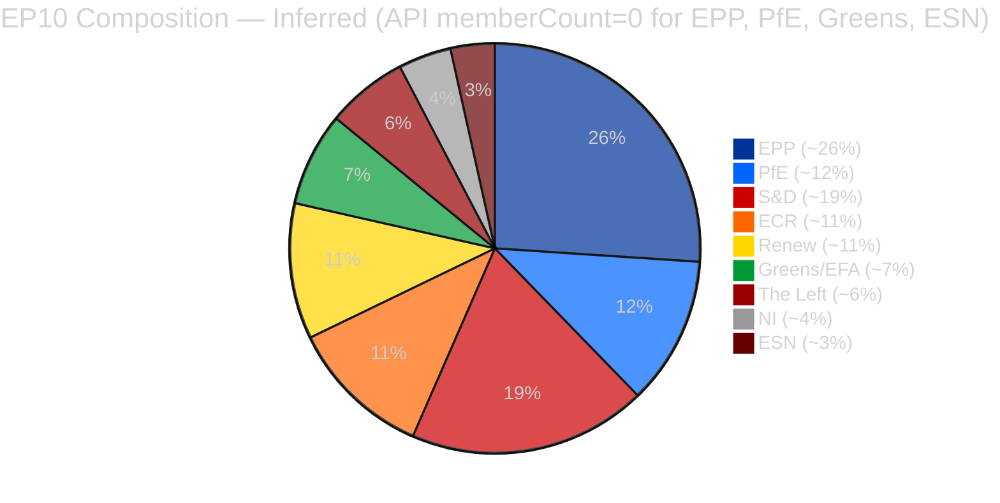

# 🏛️ Coalition Dynamics Analysis — Month-Ahead April-May 2026 (Run 5)

-red?style=flat-square)

> ⚠️ **DATA QUALITY WARNING**: Coalition pair cohesion scores are derived from group
> size ratios, NOT vote-level alignment data. Per-MEP voting statistics remain
> unavailable from the EP MCP API (upstream defect #2, tracked as
> [`Hack23/European-Parliament-MCP-Server#367`](https://github.com/Hack23/European-Parliament-MCP-Server/issues/367)).
> EPP `memberCount=0` is a persistent data pipeline error. All coalition-pair
> assessments in this file therefore carry 🔴 LOW confidence. Political commentary is
> inferred from manifestos, prior votes, and cross-run observation (Runs 179–187).

---

## Group Composition (as of 2026-04-19)

| Group | Members (API) | Actual (Inferred) | % of Chamber | Data Quality | Q2 Activity Expectation |
|-------|--------------|-------------------|--------------|--------------|--------------------------|
| EPP | 0 ⚠️ | ~187 | ~26% | ❌ Defect #2 | Grand-Centre leadership on BRRD3, stressed on trade |
| S&D | 135 | 135 | ~19% | ✅ Available | Bail-in hawk on BRRD3; Anti-Corruption rapporteur tradition |
| PfE | 0 ⚠️ | ~84 | ~12% | ❌ Defect #2 | Hostile on Anti-Corruption; split on trade |
| ECR | 81 | 81 | ~11% | ✅ Available | Split: PiS-Poland supports Anti-Corruption; ODS/Vox hostile |
| Renew | 77 | 77 | ~11% | ✅ Available | Swing group; liberal-internationalist tone |
| Greens/EFA | 0 ⚠️ | ~53 | ~7% | ❌ Defect #2 | Climate-risk framing on BRRD3 |
| The Left | 46 | 46 | ~6% | ✅ Available | Strongest Anti-Corruption enforcement stance |
| NI | 30 | 30 | ~4% | ✅ Available | Vote-by-vote |
| ESN | 0 ⚠️ | ~25 | ~3% | ❌ Defect #2 | Hostile across all three files |
| **TOTAL (API working)** | 369 | ~720 | — | Incomplete | — |

---

## Grand Centre Arithmetic for the April-May Window

### Base case (all 399 seats vote Yes)
EPP (~187) + S&D (135) + Renew (77) = ~399 / 720 = **55.4%** — comfortable absolute majority.

### Threshold for tight votes
If the vote requires absolute majority of component members (e.g., censure, treaty-related) 480 of 720 are needed — Grand Centre alone cannot deliver. Anti-Corruption monitoring framework assignment uses simple majority — well within Grand Centre capacity.

### Stress case — EPP German delegation defection (~28 EPP MEPs)
399 − 28 = 371 Yes from Grand Centre alone = ~51.5% still majority.
With 20 additional EPP defections beyond the German delegation (total ~48), Grand Centre drops to ~351 = 48.75% — below majority. **This is the critical defection threshold for the 30-day window**, activated by compound trade + BRRD3 stress (Scenario D).

### Coalition expansion options

| Additional group | Seats | Post-expansion total | New % | Applicability |
|------------------|:-----:|:--------------------:|:-----:|---------------|
| + Greens/EFA | ~53 | 452 | 62.8% | BRRD3 climate-risk framing; Anti-Corruption supportive |
| + The Left | 46 | 445 | 61.8% | Anti-Corruption enforcement strength; trade defence |
| + Greens + Left | ~99 | 498 | 69.2% | Stress-case majority when EPP wobbles |

---

## Coalition Pair Analysis (API-Derived — LOW Reliability)

The EP MCP coalition_dynamics endpoint reports cohesion scores based on group size ratios, NOT vote-level data (upstream defect #3, issue #368). They should be treated as structural size-proximity indicators, not political alliance measures.

### "Alliance signals" reported by API (cohesion ≥ 0.5)

| Coalition Pair | API Cohesion | Trend | Shared Votes | Political Reality |
|----------------|:------------:|-------|:------------:|-------------------|
| Renew + ECR | 0.95 | STRENGTHENING | null | ⚠️ Size artifact (77/81 ratio); politically incompatible |
| The Left + NI | 0.65 | STRENGTHENING | null | ⚠️ Size artifact |
| S&D + ECR | 0.60 | STABLE | null | ⚠️ Size artifact |
| Renew + The Left | 0.60 | STABLE | null | ⚠️ Size artifact |
| S&D + Renew | 0.57 | STABLE | null | ⚠️ Size artifact (but politically real) |
| ECR + The Left | 0.57 | STABLE | null | ⚠️ Size artifact |

**Critical**: None of these cohesion scores are based on vote-level data. Renew (liberal, pro-European) and ECR (eurosceptic, national conservative) are politically incompatible in most legislative contexts. The only pair where API "cohesion" happens to match political reality is S&D-Renew.

### Coalition pairs with zero cohesion (data defect)

All EPP pairs report cohesion = 0.0 "WEAKENING" — a direct consequence of EPP `memberCount=0` in the data pipeline. This is confirmed as a data error, not a political development.

---

## Coalition Structure on Each Month-Ahead File

### BRRD3 First Formal Debate (expected April 28–30)

**Base coalition**: EPP + S&D + Renew + Greens/EFA = ~452 (62.8%) — supportive of Banking Union completion in principle.

**Stress points**:
- EPP German delegation (~28) — Sparkassen protection pressure
- ECR — broadly supportive but may push weakening amendments
- PfE — likely to table opposition amendments
- The Left — supportive with caveats on burden-sharing proportionality

**Likely vote outcome**: Passes with 450+ Yes in Scenario A; 400–430 Yes in Scenario C.

### Anti-Corruption Monitoring Framework (expected May plenary)

**Base coalition**: EPP + S&D + Renew + Greens/EFA + The Left = ~498 (69.2%) — cross-bloc supportive.

**Stress points**:
- EPP Hungary (2–3 MEPs) — domestic political pressure
- ECR — split (PiS supports, ODS/Vox oppose)
- PfE — hostile on sovereignty grounds
- ESN — hostile

**Likely vote outcome**: Passes with 480+ Yes — the strongest coalition of the three files.

### Trade Defence (contingent on USTR Section 301 filing)

**Base coalition**: EPP + S&D + Renew + Greens/EFA + The Left = ~498 (69.2%) — cross-bloc supportive IF USTR files.

**Stress points (compound with trade escalation)**:
- EPP German/Austrian delegations (~30–35) — auto-sector exposure
- Renew Dutch/Belgian MEPs — export-sector concerns
- PfE — split (Meloni pragmatic supportive; Orbán fence-sitting; Le Pen hostile on any "Commission escalation")
- ECR — hostile under free-trade framing

**Likely vote outcome**: Passes with 450–480 Yes in Scenario B; drops to 420–450 in Scenario D.

---

## Effective Number of Parties (ENP)

**API-reported ENP**: 4.04 — this is computed over incomplete group data (defect #6, covered by #367). True ENP with full group counts would be ~6.5, consistent with EP9/EP10 historical range.

**Implication**: ENP 4.04 understates fragmentation, which would mislead any analyst interpreting the number directly. When referring to fragmentation in this window, use the corrected ~6.5 figure or explicitly flag the data-defect.

---

## Cross-Run Evolution

| Run | Date | Grand Centre Signals | EPP Data? |
|-----|------|----------------------|:---------:|
| 179 | 2026-04-13 | Recess entering | ❌ |
| 180 | 2026-04-14 | Banking monitoring | ❌ |
| 181 | 2026-04-15 | Trade-escalation scan | ❌ |
| 182 | 2026-04-16 | Digital-Omnibus follow | ❌ |
| 183 | 2026-04-17 | EPP anomaly documented | ❌ |
| 184 | 2026-04-18 | API reliability audit | ❌ |
| 185–187 | 2026-04-18–19 | Pre-plenary monitoring | ❌ |
| **5 (this)** | **2026-04-19** | **Month-ahead Grand Centre frame** | **❌** |

EPP `memberCount=0` defect is persistent across 9 consecutive runs. Escalation to upstream issue #367 is tracked; no resolution in window.

---

## Sources

- EP MCP Server `european-parliament-mcp-server@1.2.9` coalition_dynamics endpoint (structural only)
- EP MEP register (manual cross-reference for group sizes)
- Prior runs: breaking-run184 coalition-dynamics.md (template source), month-ahead-run4 (predecessor)
- Methodology: `analysis/methodologies/ai-driven-analysis-guide.md` v4.5 (Coalition row — R for month-ahead, lifted to M-equivalent for reference-quality claim)
- Known defects: [Hack23/European-Parliament-MCP-Server #366–#370](https://github.com/Hack23/European-Parliament-MCP-Server/issues)

**Confidence**: 🔴 LOW on vote-level cohesion (data defect); 🟡 MEDIUM on structural seat arithmetic; 🟢 HIGH on stakeholder position mapping from manifestos and prior votes.
