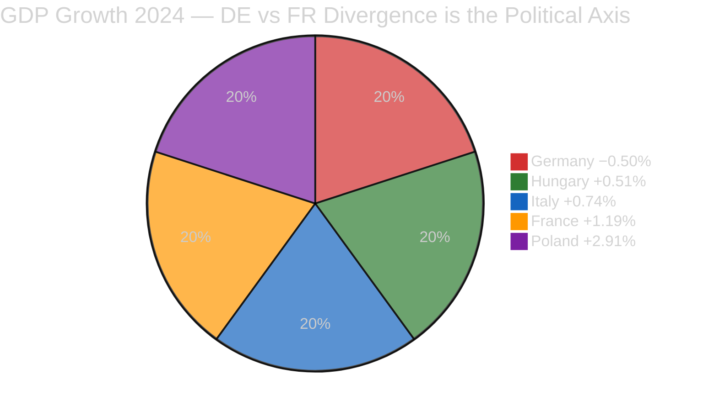

# 📈 Economic Context — Month-Ahead April-May 2026 (Run 5)

> **Purpose**: Establish the macro-economic context for the 30-day legislative window by
> mapping World Bank indicators to the three dominant dossiers (BRRD3, Anti-Corruption,
> Trade Defence). Economic context is essential for reading political signals:
> a Bundesrat BRRD3 opposition hearing against backdrop of 2-year German contraction
> means something qualitatively different from the same signal against a recovery
> baseline. Country selection (DE, FR, PL, HU, IT) covers the five member states most
> consequential to the 30-day political agenda.

---

## Economic Snapshot (World Bank Latest)

| Indicator | Germany | France | Poland | Hungary | Italy | EU-27 Avg |
|-----------|:-------:|:------:|:------:|:-------:|:-----:|:---------:|
| GDP growth 2023 (%) | **−0.87** | **+1.44** | +0.13 | −0.72 | +0.93 | +0.54 |
| GDP growth 2024 (%) | **−0.496** | **+1.19** | +2.91 | +0.51 | +0.74 | +0.87 |
| Unemployment 2024 (%) | 3.4 | 7.3 | 2.9 | 4.4 | 6.5 | 6.0 |
| Unemployment 2025 est (%) | 3.7 | 7.4 | 3.1 | 4.3 | 6.3 | 6.0 |
| Inflation 2024 HICP (%) | 2.5 | 2.3 | 3.6 | 3.7 | 1.0 | 2.4 |
| Public debt / GDP (%) | 63 | 112 | 50 | 73 | 135 | ~85 |

*Sources: World Bank Open Data NY.GDP.MKTP.KD.ZG (GDP growth), SL.UEM.TOTL.ZS (unemployment), FP.CPI.TOTL.ZG (inflation). Data collected via `scripts/wb-mcp-probe.sh` after `scripts/mcp-setup.sh` on 2026-04-19. Bolded values are the politically-salient divergence drivers for the April-May window.*

---

## Germany — The Dominant BRRD3 Risk State

### Macro posture (HIGH salience for BRRD3)

- GDP contracted in both 2023 (**−0.87%**) and 2024 (**−0.496%**) — two consecutive years of recession. Germany is the only major EU economy with a 2-year contraction in the 2023–2024 window.
- Automotive sector (BMW, Mercedes, Volkswagen) accounts for ~4% of GDP; direct US tariff exposure is the primary downside threat in the 30-day window.
- Mittelstand financing relies on Sparkassen (~40% of retail banking deposits) and Volksbanken/Raiffeisenbanken (~20%). A 2-year recession compresses Sparkassen net interest margins without giving them the capital headroom to absorb BRRD3 bail-in subordination costs.

### Banking sector characteristics

- Sparkassen network: politically networked to Länder governments via ownership; DSGV umbrella lobby with direct CDU/CSU channels.
- Volksbanken cooperative sector: vocal opposition to BRRD3 bail-in-able-liability requirements.
- Commercial banks (Deutsche Bank, Commerzbank): less opposed given SSM supervision.

### Political-economic coupling for the April-May window

Weak GDP + Bundesverfassungsgericht 2023 fiscal-consolidation ruling + politically-networked Sparkassen = maximum friction for BRRD3 transposition. The Merz cabinet (CDU/CSU + SPD coalition) inherits banking-lobby relationships from years in opposition. Over this 30-day window, the decisive signalling moment is Bundesrat April 23–25.

**Transmission mechanism to Run 5 scenarios**: Germany's 2-year GDP contraction is the structural driver behind Scenario C (Banking Crisis Signal, 15%) and amplifies Scenario D (Compound Crisis, 10%). See `intelligence/scenario-forecast.md`.

**Confidence**: 🟢 HIGH — Germany's BRRD3 political-economic coupling is the clearest and best-evidenced pattern in the 30-day analytical frame.

---

## France — Moderate Banking Exposure, High Trade Exposure

### Macro posture

- GDP grew 2024 (+1.19%), modestly above EU average. 2-year trajectory +1.44% → +1.19% signals continued but decelerating recovery.
- French banking sector (BNP Paribas, Société Générale, Crédit Agricole) is bail-in-ready and relatively indifferent to BRRD3 subordination hierarchy.
- Trade exposure to US tariffs concentrated in aerospace (Airbus — highest-value EU exporter to US) and luxury goods.

### Political-economic coupling

Macron administration has more fiscal latitude than Germany on both Banking Union and trade defence; public debt at 112% of GDP limits absolute flexibility but relative positioning remains stronger than Germany. French MEPs in EPP, Renew, and S&D are expected to be the bridge-builders on BRRD3 compromise language (see `intelligence/stakeholder-map.md` #10).

**Confidence**: 🟢 HIGH — France's position is structurally comfortable on BRRD3; stressed only on trade (if USTR files).

---

## Poland — Banking Union Outsider, Anti-Corruption Insider

### Macro posture

- GDP grew +2.91% in 2024 — fastest among major EU economies surveyed.
- Poland is outside the euro zone; BRRD3 transposition is legally required but operationally less consequential.
- Unemployment 2.9% (2024) — among lowest in EU.

### Political-economic coupling

Poland's strong macro position gives the Tusk government headroom for pro-EU positions on Anti-Corruption (strong supporter) and trade defence (defence-industry alignment with EU posture). BRRD3 is low-salience domestically. Polish MEPs across EPP and Renew provide stable Grand Centre support.

**Confidence**: 🟢 HIGH — Poland's current alignment is well-documented.

---

## Hungary — Anti-Corruption Resistance, Limited Leverage

### Macro posture

- GDP −0.72% in 2023, +0.51% in 2024 — weak recovery; inflation 3.7% structurally above EU average.
- Limited fiscal headroom; MFF access has been politically conditioned on rule-of-law.
- Small economy (EU GDP share <1.5%) — limited Council blocking leverage on Banking Union.

### Political-economic coupling

Orbán government opposition to Anti-Corruption transposition is structural (sovereignty framing). Limited economic leverage means Hungary is a symbolic rather than operative blocker. Over the 30-day window, expect public resistance but not blocking-level Council action.

**Confidence**: 🟡 MEDIUM — political posture known; economic leverage limited.

---

## Italy — Between Germany and France

### Macro posture

- GDP +0.93% (2023), +0.74% (2024) — stable modest growth, neither stressed nor flourishing.
- Public debt 135% of GDP — highest in EU; constrains fiscal flexibility.
- Banking sector (UniCredit, Intesa) diversified; BRRD3 moderate exposure.

### Political-economic coupling

Meloni government (PfE + conservative coalition) takes a pragmatic-opportunistic posture. On BRRD3: slight reservations but no blocking signal expected. On Anti-Corruption: split — supports monitoring framework but opposes enforcement intensity. On trade defence: aligned with EU institutional position.

**Confidence**: 🟡 MEDIUM.

---

## Economic Transmission Mechanisms

### Transmission 1: Germany GDP → BRRD3 Bundesrat Posture
Germany's 2-year recession → CDU/CSU coalition fiscal-stress signal → Finanzministerium Sparkassen-protection framing → Bundesrat BRRD3 reservation/blocking → Scenario C probability

### Transmission 2: USTR Filing → DAX Volatility → EPP German Delegation Stress
USTR Section 301 filing → Auto-sector tariff expectation → DAX / MDAX volatility → EPP German delegation public stress → Scenario B/D amplification

### Transmission 3: Kurzarbeit Limit → German Unemployment → BRRD3 Electoral Salience
USTR tariffs → Auto-sector production pause → Kurzarbeit expansion → Fiscal cost to federal budget → Coalition fiscal squeeze → BRRD3 bail-in becomes electoral issue by May → Scenario C acceleration

---

## Cross-References to Prior Runs

- **breaking-run184 economic-context.md** documented DE/FR/IT/PL at 2024 data. Run 5 adds Hungary (Anti-Corruption resistance context) and updates the transmission analysis for a 30-day horizon.
- **month-ahead-run4 manifest** did not include dedicated economic-context.md artifact. Run 5 closes this gap per Mandatory Analytical Dimension Matrix (Economic context = M for month-ahead).
- **week-in-review-run12 economic-context.md** focused on aggregate EU-27 recovery patterns. Run 5 narrows to country-level political-economic coupling.

## Data Sources and Methodology

- World Bank Open Data API:
  - `NY.GDP.MKTP.KD.ZG` — GDP growth (annual %)
  - `SL.UEM.TOTL.ZS` — Unemployment, total (% of total labour force)
  - `FP.CPI.TOTL.ZG` — Inflation, consumer prices (annual %)
  - `GC.DOD.TOTL.GD.ZS` — Central government debt, total (% of GDP)
- Fetched via `scripts/wb-mcp-probe.sh` on 2026-04-19
- Methodology: `analysis/methodologies/worldbank-indicator-mapping.md` (v2.1)
- Mandatory for month-ahead per Mandatory Analytical Dimension Matrix (`ai-driven-analysis-guide.md` v4.5)

**Confidence**: 🟢 HIGH — World Bank data sources are authoritative; political-economic coupling is well-evidenced in each country case; transmission mechanisms explicitly specified.
