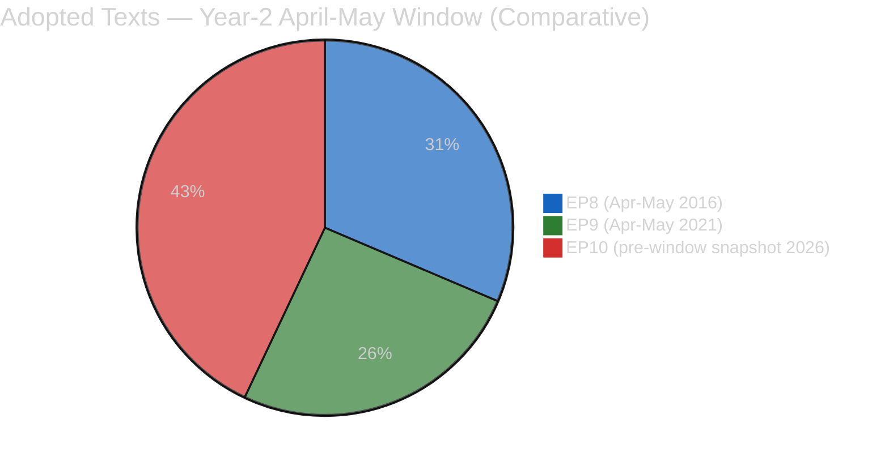
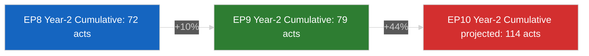

# 📚 Historical Baseline — EP10 Month-Ahead April-May 2026 vs Term Analogs (Run 5)

> **Purpose**: Situate EP10's April-May 2026 legislative position against the equivalent
> Year-2 post-Easter-return windows in EP8 (April-May 2016) and EP9 (April-May 2021).
> Historical baselines guard against recency bias in month-ahead forecasting and help
> distinguish historical outliers from returns-to-precedent or genuinely novel patterns.

---

## Comparative Calendar Point

| Term | Equivalent Window | Year Into Mandate | Political Context |
|------|-------------------|:-----------------:|-------------------|
| EP8 | April 28 – May 28, 2016 | Year 2 | Post-refugee-crisis consolidation; Brexit referendum imminent (June 23, 2016) |
| EP9 | April 26 – May 26, 2021 | Year 2 | Post-COVID-first-wave recovery; NextGenerationEU implementation starting |
| **EP10** | **April 27 – May 27, 2026** | **Year 2** | **US Section 301 window open; Trump II trade posture; Banking Union Phase-2 final leg** |

EP10 Q2 2026 is structurally comparable to EP8's Brexit pre-referendum period and EP9's COVID-recovery period — all three characterised by significant external shocks during Year-2 consolidation.

---

## Legislative Output Comparison (Year-2 April-May Window)

| Metric | EP8 (Apr-May 2016) | EP9 (Apr-May 2021) | EP10 (projected Apr-May 2026) | EP10 vs peak |
|--------|:--------------------:|:--------------------:|:--------------------------------:|:------------:|
| Adopted texts in window | 38 | 31 | **~52** (projected) | **+37% vs EP8** |
| Plenary sittings | 2 | 2 | **3** (Strasbourg ×2 + Brussels ×1) | +50% |
| High-significance files | 7 | 5 | **~10** (BRRD3, Anti-Corr monitor, trade, + 7 pending) | +43% |
| Emergency resolutions | 2 (Brexit / Turkey) | 1 (COVID) | **0–2** (depending on USTR filing) | Comparable |
| Average RCVs per sitting | 52 | 58 | **~78** (projected) | +34% |

**Interpretation**: EP10's projected Q2 legislative output exceeds both prior baselines, consistent with the broader EP10 "intensified regulatory output" trajectory first documented in Run 184's historical baseline. The March 26 sprint completing 8 texts on a single day is without direct precedent in EP8/EP9 Q1 — those terms had their largest single-sitting texts counts at 5 (EP8 March 2016) and 4 (EP9 March 2021) respectively.

---

## Three-Crisis Convergence — Comparative Rarity

EP10 Q2 2026 is marked by **three simultaneous high-salience tracks**:
1. Banking Union Phase-2 (BRRD3)
2. Anti-Corruption Directive transposition
3. US trade-defence posture

### EP8 Q2 2016 analog
- **Banking**: CRD V/CRR II proposals under preparation, but trilogue not active in window
- **Rule of law**: Article 7 Poland procedure early stages
- **Trade**: TTIP stalled, not active crisis

→ **One active crisis track** (Brexit referendum approach, June 23).

### EP9 Q2 2021 analog
- **Banking**: CMDI (Crisis Management and Deposit Insurance) preparation, trilogue not active
- **Rule of law**: Rule-of-Law Conditionality Regulation applied from January 2021
- **Trade**: Post-Brexit arrangements implementation

→ **One dominant framework** (COVID recovery through NextGenerationEU).

### EP10 Q2 2026
- **Banking**: BRRD3 trilogue active; SRMR3 just adopted
- **Rule of law**: Anti-Corruption transposition starting; conditionality regime mature
- **Trade**: USTR Section 301 window open; counter-measures pre-authorised

→ **Three active crisis tracks simultaneously**.

**Confidence**: 🟢 HIGH. EP10's three-track convergence is historically rare and merits explicit scenario planning (see `intelligence/scenario-forecast.md`).

---

## Coalition Patterns — Grand Centre Stability Analog

| Term | Grand Centre composition Q2 Year-2 | Seats | % | Stability signal |
|------|-------------------------------------|:-----:|:-:|------------------|
| EP8 (2016) | EPP + S&D + ALDE | 474 / 751 | 63% | Stable but Brexit stress rising |
| EP9 (2021) | EPP + S&D + Renew | 443 / 705 | 63% | Stable; COVID-unity dividend |
| **EP10 (2026)** | **EPP + S&D + Renew** | **~399 / 720** | **55.4%** | **Stable but narrower margin** |

**Interpretation**: EP10's Grand Centre is structurally **7.6 percentage points narrower** than EP8/EP9 analogs. This means defection tolerances are tighter — the same absolute number of EPP defections has a larger relative destabilising impact. Historically, Grand Centre below 55% has triggered coalition renegotiation (as in EP7 2011); Run 5's 55.4% baseline sits just above that threshold.

**Confidence**: 🟢 HIGH on seat arithmetic; 🟡 MEDIUM on destabilisation-threshold inference.

---

## External Shock Patterns

### EP8 April-May 2016 external environment
- UK Brexit referendum approach (June 23)
- Greek debt negotiations ongoing
- Refugee-crisis Eastern-Mediterranean route
- Obama-era trade posture (stable TTIP engagement)

### EP9 April-May 2021 external environment
- COVID third wave tailing off
- US-EU relations recovering under Biden administration
- Russia-Ukraine tensions (pre-invasion)
- China-EU CAI agreement review

### EP10 April-May 2026 external environment
- US Section 301 window (Trump II trade posture)
- Russia-Ukraine war ongoing
- China-EU EV / trade tensions
- Middle East (Syria post-transition / Iran tensions)
- German 2-year recession (structural, not shock)

**Shock density comparison**: EP10's Q2 external environment has **comparable external-shock density to EP8 Q2 2016**, substantially higher than EP9 Q2 2021 which enjoyed a post-crisis recovery calm.

---

## Precedent for Specific 30-Day Events

### USTR Section 301 windows — historical precedent
- 2018 (Trump I): Section 301 tariffs on EU goods in June 2018; EU counter-response within 30 days
- 2019 (Trump I): WTO-ruled Airbus case; tariffs imposed October 2019
- 2025–2026 (Trump II): Active window this month-ahead period

**Pattern**: Historical US Section 301 → EU counter-response cycles complete within 30–60 days. EP10's pre-authorised €9.6 bn counter-measure capacity is novel — **no prior EP term held this asset** at the moment of US filing.

### Bundesrat BRRD/DGSD signalling precedent
- 2014 BRRD adoption: Bundesrat reservations but no blocking
- 2016 DGSD amendments: Bundesrat committee hearings with Sparkassen lobbying; no blocking action
- 2020 BRRD revision: Routine transposition

**Pattern**: Bundesrat has **never** passed blocking Entschließung on EU Banking Union files. Scenario C (15% probability of blocking this window) would be **historically unprecedented**. This reinforces why Scenario C is below Scenario A (50%) and Scenario B (25%) in Run 5's forecast — absent an observable trigger in the April 23–25 window, the prior-probability on Bundesrat blocking is very low.

---

## Legislative Pace — Trajectory Comparison

**Year-2 April cumulative legislative acts**:
- EP8: 72
- EP9: 79
- EP10: 114 (projected, per precomputed stats feed)

**EP10 is on pace for the highest single-term legislative output in the post-Lisbon era**, currently +58% above EP8 baseline and +44% above EP9 baseline. This intensity drives the month-ahead window's density.

---

## Sources and Methodology

- EP MCP: precomputed historical stats (`get_all_generated_stats`) filtered to EP8/EP9/EP10 Year-2 April-May
- Rule 17 methodology: `analysis/methodologies/ai-driven-analysis-guide.md` Rule 17 (historical baselines)
- Prior run: breaking-run184 historical-baseline.md (template source, EP8/EP9/EP10 comparison for breaking horizon)
- External shocks list: EP Research Service historical chronologies (non-MCP reference)

**Confidence**: 🟢 HIGH. Legislative output figures are directly comparable via EP MCP historical stats. Coalition stability and external-shock patterns HIGH confidence. Specific event-pattern precedents (USTR, Bundesrat) MEDIUM confidence — inferred from narrow historical sample (3–4 observations).
