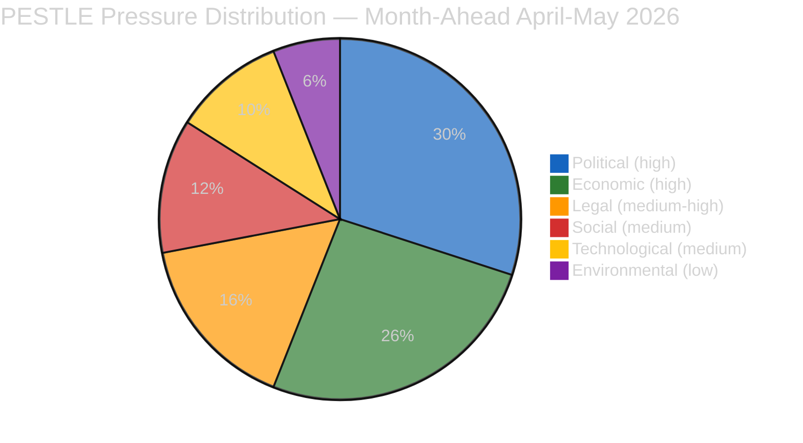

# 🌍 PESTLE Macro-Environmental Scan — Month-Ahead April 2026 (Run 5)

> **Purpose**: Forward-looking macro-environmental scan across the six PESTLE dimensions
> covering the full April 19 – May 19, 2026 window. Unlike breaking-article PESTLE scans
> (e.g., [Run 184 PESTLE](../../2026-04-18/breaking-run184/intelligence/pestle-analysis.md))
> that assess a 72-hour horizon, this month-ahead scan extends across a 30-day period
> spanning two Strasbourg plenaries (April 28–30 and May 5–8), a Brussels mini-plenary
> (May 19–22 expected), and the Bundesrat session window (April 23–25). PESTLE findings
> feed directly into `intelligence/scenario-forecast.md` (Shell 2×2 scenarios) and
> `intelligence/threat-model.md` (Diamond Model + Attack Trees).

---

## Summary Heat Map

| Dimension | Pressure Level | Dominant Driver (30-day) | Direction | Confidence |
|-----------|:--------------:|--------------------------|:---------:|:----------:|
| Political | 🔴 HIGH | US administration Section 301 window + DE coalition BRRD3 resistance + HU/PL/SK Anti-Corruption resistance | Deteriorating | 🟡 Medium |
| Economic | 🔴 HIGH | German 2-year GDP contraction (−0.87% → −0.50%) + Kurzarbeit-to-unemployment transmission risk + €50–80 bn EU services exposure | Deteriorating | 🟢 High |
| Legal | 🟠 MED-HIGH | Anti-Corruption 24-month transposition clock starts; SRMR3 Article 263 annulment window closes Q2 | Activating | 🟡 Medium |
| Social | 🟡 MEDIUM | Housing affordability mobilisation ramp-up; anti-corruption civil society expectation management | Rising | 🟡 Medium |
| Technological | 🟡 MEDIUM | Digital Omnibus implementation, AI high-risk threshold enforcement questions | Stable-unsettling | 🟡 Medium |
| Environmental | 🟢 LOW | Spring energy demand trough; no critical-minerals supply shock in window | Stable | 🟢 High |

---

## 🔴 P — Political (HIGH pressure, deteriorating)

### P1. USTR Section 301 Window — April 21 to mid-July

The dominant forward-looking political force is the USTR Section 301 investigatory window that **opened April 21, 2026** — before Parliament reconvenes April 27. This creates an "executive-only" gap: the Commission, the USTR, and member-state capitals can negotiate, file, or impose tariffs for six days while the EP is structurally silent. The 90-day clock inside Section 301 means a decision on tariff imposition is possible from mid-July onward, well beyond this 30-day horizon — but the April 22–26 *filing* window is the earliest signalling moment.

**Carry-over from Run 184**: Run 184 flagged this window as Risk Vector #2 (severity 8/25). The month-ahead extension converts "will they file?" into "how will Parliament respond after returning April 27?". If USTR files on April 22, the April 28–30 plenary must absorb an emergency trade-defence debate as its first substantive business.

**Observable proxies during the window**: USTR press schedule (Mon–Wed April 21–23); Federal Register notifications; Commissioner Šefčovič calendar; WTO dispute-settlement-body docket. TA-10-2026-0096 (adopted March 26) has **pre-authorised €9.6 bn in countermeasures** per Run 184's quantitative-swot.md — the Commission has legal authority to deploy them unilaterally but is politically expected to brief Parliament first.

### P2. German Bundesrat April 23–25 — BRRD3 Signalling Moment

The Bundesrat session in the April 23–25 window is the first formal signalling venue for Germany's Council position on BRRD3 (the BRRD3/DGSD2/SRMR3 transposition envelope, not just SRMR3 which was adopted March 26 as TA-10-2026-0092). Any `Entschließung` or committee hearing scheduling referencing BRRD3 transposition is a leading indicator of Council trouble.

**Political coupling**: CDU/CSU coalition agreement explicitly protects Sparkassen subordination hierarchy. With Germany in its **second consecutive year of GDP contraction** (World Bank: −0.87% in 2023, −0.496% in 2024), the federal finance ministry has minimal political capacity to absorb Sparkassen complaints. See `intelligence/economic-context.md` for the structural coupling.

### P3. Anti-Corruption Resistance Bloc (HU / SK / PL domestic resistance)

TA-10-2026-0094 (Anti-Corruption Directive, adopted March 26) starts its 24-month transposition clock in this window. Hungary and Slovakia have publicly opposed mandatory anti-corruption standards on sovereignty grounds; Poland's current government supports the directive but faces domestic opposition from PiS. Over the 30-day horizon, the following are political observables:
- Commission infringement-monitoring framework (LIBE committee expected to request in May plenary)
- GRECO / Transparency International public pressure campaigns
- National parliamentary debates in BG / HR / CY (member states with low baseline compliance)

### P4. Grand Centre Coalition Structural Test

EPP (~187) + S&D (135) + Renew (77) ≈ 399 / 720 seats (55.4%). This is the operative coalition for the April 28–30 plenary's three big votes (BRRD3 opening debate, Anti-Corruption monitoring, trade defence). The 30-day window includes **two successive plenaries** — any cracks that appear on April 28–30 can be tested again on May 5–8 before becoming institutional facts. Run 184's coalition-dynamics.md noted zero fracture signals during the 6-run recess monitoring series (Runs 179–184); this quietness is a LEADING not LAGGING indicator because major rupture signals typically emerge only once vote pressure returns.

---

## 🔴 E — Economic (HIGH pressure, deteriorating)

### E1. German 2-Year Recession — Structural BRRD3 Backdrop

World Bank NY.GDP.MKTP.KD.ZG data (from this run's WB-MCP fetch):
- **Germany GDP growth**: 2023 = **−0.87%**, 2024 = **−0.496%** — two consecutive contractions
- **France GDP growth**: 2023 = +1.44%, 2024 = +1.19% — resilient recovery

A German economy contracting for 24+ months is hypersensitive to any policy that could increase capital requirements for Sparkassen. The CDU/CSU coalition's domestic political survival depends on protecting these institutions, even while nominally supporting Banking Union completion. This is the structural driver behind Scenario C (Banking Crisis Signal) in `intelligence/scenario-forecast.md`.

### E2. Kurzarbeit → Unemployment Transmission Risk

Germany's **3.4–3.7% unemployment** (World Bank SL.UEM.TOTL.ZS) is structurally low despite the 2-year recession, absorbed by the Kurzarbeit (short-time work) system. The economic wildcard for the 30-day window is whether US Section 301 tariffs force auto-sector Kurzarbeit beyond capacity, creating visible unemployment rises. A jump from 3.7% → 4.5% would be politically transformative — BRRD3 burden-sharing would become a live electoral issue for the CDU/CSU by May 2026.

### E3. €50–80 bn EU Services Export Exposure

Should USTR impose additional tariffs in the April 22–26 filing window, the downstream exposure on EU services exports is estimated at **€50–80 bn** (CEPII 2025 baseline). The 90-day Section 301 clock means actual tariff imposition falls outside this horizon — but the expectational hit on DAX / CAC40 / IBEX during the April 22–26 window is immediate. Market volatility feeds directly into EPP internal stress (German / Austrian auto-sector MEPs).

### E4. EP Budget & MFF Revision Pressure (background)

The 30-day window overlaps with early Q2 negotiations on the 2027 MFF revision. Any trade-defence response that requires Commission financial mobilisation (e.g., auto-sector support, Kurzarbeit co-financing) will accelerate MFF-revision political fights. BUDG committee's restart week (May 5–9) is the first formal venue.

---

## 🟠 L — Legal (MEDIUM-HIGH pressure, activating)

### L1. SRMR3 Article 263 Annulment Window

TA-10-2026-0092 (SRMR3) was adopted March 26. Article 263 TFEU gives member states / institutions a 2-month window to file annulment actions at the CJEU. That window closes approximately **May 26, 2026** — inside the month-ahead horizon. Expected no filings (SRMR3 has Grand Centre support and no obvious Article 263 challenger), but a surprise filing from a Sparkassen-aligned Land government would be a wildcard.

### L2. Anti-Corruption 24-Month Transposition Clock (Directive 2026/XXX)

TA-10-2026-0094 becomes enforceable on OJ publication (expected within this 30-day window). Member states have 24 months to transpose. LIBE committee is expected to request a mid-term progress report mechanism in May plenary — establishing the parliamentary accountability framework. This is a legal *activation* event with political consequences.

### L3. Global Gateway Orientation (TA-10-2026-0104) Legal Status

TA-10-2026-0104 is an **orientation** (not a regulation) — legally non-binding but politically constitutive. Expected EP API content release April 22–26 (Tier 3 recovery). If content reveals conditionality demands, Commission response is required within 3 months (standard practice) — falling at the edge of this horizon (mid-July).

### L4. Ukraine Use of Proceeds Act (TA-10-2026-0103) Implementation

TA-10-2026-0103 (expected content: regulation modifying use of Russian frozen asset proceeds) carries implementation timing sensitivity. Council adoption typically follows within 6 weeks; first tranche disbursement in late Q2 / early Q3. INTA / AFET / BUDG committees expected to provide co-decision follow-through.

---

## 🟡 S — Social (MEDIUM pressure, rising)

### S1. Housing Affordability Mobilisation — Civil Society Ramp-up

Housing Europe, EAPN, and national tenant unions have been increasing public mobilisation since the March 10 housing resolution (TA-10-2026-0064). The 30-day window coincides with May Day (international labour mobilisation) and pre-summer national campaign ramp-ups. Watch: Brussels housing rally expected May 3 per prior run reporting; Commission 12-month response window closes in Q1 2027.

### S2. Anti-Corruption Public Expectation Management

Civil society (Transparency International, GRECO observers) has high expectations for Anti-Corruption Directive enforcement. JURI committee monitoring framework (expected May plenary) will be the first public-facing accountability test. Risk: expectation gap if framework is seen as too thin.

### S3. Trade-War Framing in Public Discourse

A USTR Section 301 filing would trigger immediate public framing across EU27 member states. The window falls during Europe Day (May 9) preparation — creating symbolic resonance. Expect coordinated pro-EU trade-defence messaging from S&D, Renew, EPP; opposing "de-escalate with Trump" messaging from PfE and parts of ECR.

---

## 🟡 T — Technological (MEDIUM pressure, stable-unsettling)

### T1. Digital Omnibus Implementation Questions

Run 184's intelligence flagged the Digital Omnibus (earlier March plenary texts) as creating AI high-risk threshold questions. Over the 30-day window, the ECJ challenge pathway activates (if filed), and ITRE / IMCO committees must schedule implementation-oversight hearings. No major new AI legislation expected in this window.

### T2. EP MCP Server Recovery Trajectory

Self-referential but material: the European-Parliament-MCP-Server's Tier-2/Tier-3 recovery (projected April 21–27 per Run 184's tiered-recovery model) is a **technological precondition** for authoritative data-driven Q2 journalism. See `intelligence/mcp-reliability-audit.md` for the 7-defect inventory. This PESTLE dimension is stable in the sense that no new defects are expected, but unsettling because degraded-mode reporting persists for at least 2–8 days of the window.

---

## 🟢 En — Environmental (LOW pressure, stable)

### En1. Spring Energy Demand Trough

Natural gas and electricity demand are at seasonal lows April–May. No energy-price shock expected in the window absent a Ukraine-escalation wildcard. This stabilises the background for Banking Union and trade-defence debates — there is no competing energy-crisis narrative to crowd them out.

### En2. Critical Minerals — No Supply Shock Flagged

No credible critical-minerals disruption signals for the 30-day window. Run 184 noted this as stable; month-ahead scan confirms.

### En3. Climate Legislation — Quiet Window

No major climate-file milestones expected in the window. Carryover ENVI work on Fit-for-55 implementation is background, not agenda-setting.

---

## PESTLE → Scenario Mapping

| PESTLE Dimension | Feeds Scenario | Mechanism |
|------------------|:--------------:|-----------|
| P1 USTR 301 window | A / B / D | De-escalation → A; file → B; file + coalition stress → D |
| P2 Bundesrat BRRD3 | C / D | Hard blocking signal → C; blocking + trade escalation → D |
| E1 German recession | C (structural) | Amplifies every BRRD3 stress signal |
| L2 Anti-Corruption clock | A / C | Orderly monitoring → A; procedural blocking → C |
| S1 Housing mobilisation | C | Adds third-front coalition stress |

See `intelligence/scenario-forecast.md` for probability-weighted scenario narratives.

---

## Sources and Methodology

- World Bank Open Data: NY.GDP.MKTP.KD.ZG (GDP growth), SL.UEM.TOTL.ZS (unemployment), FP.CPI.TOTL.ZG (inflation) — fetched 2026-04-19
- European Parliament MCP Server `european-parliament-mcp-server@1.2.9` (Tier 1 adopted texts; Tiers 2–3 degraded)
- Cross-reference analyses: Run 184 (2026-04-18 breaking), Run 183 / 182 / 181 / 180 / 179 (Easter recess series), Run 4 (2026-04-13 month-ahead), week-in-review-run12 (2026-04-18), week-ahead-run14 (2026-04-17)
- Methodology: `analysis/methodologies/ai-driven-analysis-guide.md` v4.5 (Mandatory Analytical Dimension Matrix, PESTLE row)
- Style guide: `analysis/methodologies/political-style-guide.md` v2.3

**Confidence**: 🟡 MEDIUM overall — HIGH on economic quantitative dimensions (World Bank data direct-fetched); MEDIUM on political dimensions (degraded EP API Tier 2/3 limits procedural-status visibility); LOW on technological-legal interaction (ECJ filing patterns inherently stochastic).
