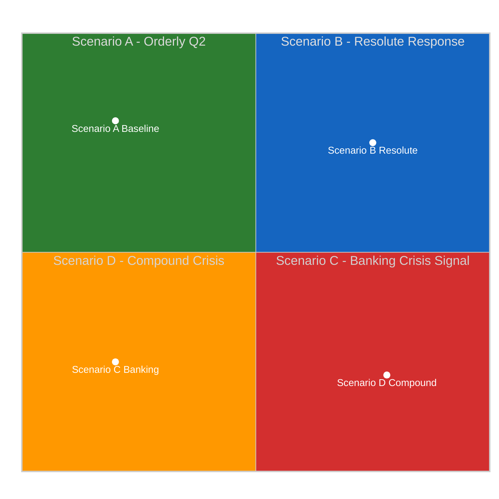
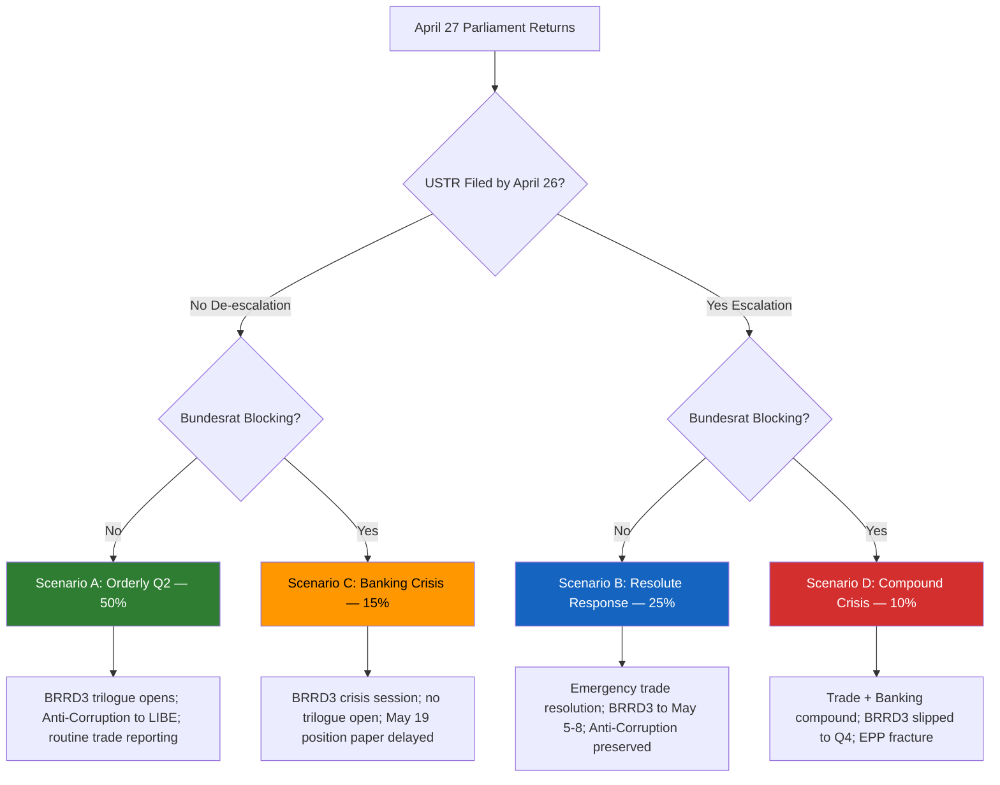

# 🎲 Scenario Forecast — Month-Ahead April 19 – May 19, 2026 (Run 5)

> **Purpose**: Structured multi-scenario forecast for the 30-day window covering April 27
> Parliament return, April 28–30 and May 5–8 Strasbourg plenaries, May 19 Brussels
> mini-plenary, USTR Section 301 filing window (April 21–26), and German Bundesrat BRRD3
> signals (April 23–25). Each scenario is defined by a unique combination of the two most
> uncertain and highest-impact variables from the PESTLE scan
> (`intelligence/pestle-analysis.md`). Each carries a probability estimate, early-warning
> indicators, actions/outcomes that would confirm or falsify it, and a decision-tree
> branch for the April 28–30 plenary.

---

## Scenario Axis Selection

From `intelligence/pestle-analysis.md` the two driving variables for the 30-day horizon are:

- **X-axis — US Trade Posture**: DE-ESCALATION (no Section 301 filing April 22–26; back-channel EU-US negotiation; USTR holds to preserve flexibility) ⟷ ESCALATION (Section 301 filing in the window; tariff notification to Federal Register; WTO dispute escalation).
- **Y-axis — EU Grand Centre Coalition Integrity on BRRD3**: STABLE (Bundesrat April 23–25 passes with reservation-only; EPP German delegation holds discipline; BRRD3 trilogue opens on schedule May 5–9) ⟷ STRESSED (Bundesrat passes a blocking Entschließung; EPP German delegation signals public reservations; BRRD3 trilogue timeline slips).

| Scenario | US Posture | EU Coalition | Probability | Dominant 30-Day Impact |
|----------|-----------|--------------|:-----------:|--------------------------|
| **A. Orderly Q2** (baseline) | De-escalation | Stable | 50% | Planned BRRD3 opening; Anti-Corruption monitoring; calm May plenary |
| **B. Resolute Response** | Escalation | Stable | 25% | Emergency trade debate April 28; counter-measure activation; BRRD3 timeline preserved |
| **C. Banking Crisis Signal** | De-escalation | Stressed | 15% | Bundesrat blocking Entschließung; BRRD3 trilogue slipped to Q3; Banking Union Phase-2 at risk |
| **D. Compound Crisis** | Escalation | Stressed | 10% | Trade + Banking stress simultaneously; worst-case EP10 Q2 plenary |

> Probabilities sum to 100%. Confidence: 🟡 MEDIUM. Scenario A is above Run 184's 40%
> baseline because the 30-day horizon extends into the post-Section-301-window period,
> providing time for de-escalation paths to validate.

---

## Scenario A — Orderly Q2 (Baseline, 50%)

### Narrative

USTR holds Section 301 filing beyond April 26 to preserve negotiating flexibility with a Commission delegation led by Šefčovič. German Bundesrat April 23–25 passes a formal reservation on BRRD3 subordination hierarchy but stops short of a blocking resolution — Germany signals its concerns while committing to constructive Council engagement. EP API Tier-2 restores April 22; Tier-3 restores April 26 (consistent with Run 184's tiered-recovery model).

April 28–30 plenary opens with substantive legislative agenda: BRRD3 first formal debate (ECON rapporteur presenting trilogue timeline); Anti-Corruption monitoring-framework assignment to LIBE; routine trade-defence reporting (TA-10-2026-0096 implementation status). No emergency resolutions. May 5–8 plenary advances BRRD3 committee work; May 19 Brussels mini-plenary receives BRRD3 Council position paper.

### Early-warning confirming indicators (by April 26)

1. No USTR Federal Register notice in April 21–25 window
2. Bundesrat April 23–25 agenda: BRRD3 appears only in "information items" (not resolution items)
3. No Commission Article 122 emergency calls
4. EP API Tier-2 endpoints (events, procedures) restore April 22–23
5. Commissioner Šefčovič public statement signalling "constructive dialogue" with US

### April 28–30 plenary expected decisions
- BRRD3: assign trilogue rapporteur (probably S&D MEP given SRMR3 precedent); open trilogue with 4-week negotiating mandate
- Anti-Corruption: assign monitoring framework to LIBE + JURI; request first Commission report by Q3
- Trade defence: TA-10-2026-0096 implementation reporting; no emergency vote

### Scenario A impact
- **Coalition**: Grand Centre holds; EPP internal stress absorbed
- **Legislative calendar**: On-track; BRRD3 Council position expected late May; trilogue conclusion targeted July
- **Market reaction**: Neutral-positive; DAX / CAC40 stable

**Confidence**: 🟡 MEDIUM. This is the modal scenario but not dominant — the combined probability of stress scenarios (B + C + D = 50%) equals the baseline.

---

## Scenario B — Resolute Response (25%)

### Narrative

USTR files Section 301 notification Thursday April 23 or Friday April 24, targeting EU auto sector and/or aerospace. Commission responds with immediate counter-measure activation announcement Sunday April 26, using TA-10-2026-0096 pre-authorisation. Bundesrat April 23–25 passes only a reservation (not blocking) — Germany declines to add a banking crisis on top of a trade crisis.

April 28 plenary opens with emergency trade-defence debate (INTA-led urgency procedure, EPP-S&D-Renew-Greens-Left broad majority). A strengthened counter-measure resolution passes 500+ votes. BRRD3 agenda item moves to May 5–8 plenary (compressed but preserved). May 19 Brussels mini-plenary receives trade follow-up reporting.

### Early-warning confirming indicators (by April 26)

1. USTR Federal Register notice in April 22–26 window with specific tariff line items
2. Commission spokesperson statement within 24 hours of USTR notice
3. Commissioner Šefčovič calls urgent trade ministers meeting
4. Šefčovič op-ed in FT / Handelsblatt April 27 signalling "resolute response"
5. Bundesrat agenda omits or deprioritises BRRD3 to focus on trade

### Scenario B impact
- **Coalition**: Grand Centre emerges *strengthened* (external threat drives unity); EPP German delegation disciplined despite auto-sector pressure because free-rider dynamics punish defection
- **Legislative calendar**: BRRD3 timeline compressed by 1 week but preserved; May 19 mini-plenary upgraded in salience
- **Market reaction**: DAX / CAC40 volatility spike; recovery within 72 hours as counter-measure proportionality signalled
- **Narrative**: "EP rises to the challenge" — reference-worthy moment for EP10 term

**Confidence**: 🟡 MEDIUM. Depends on USTR decision-making and Commission preparedness.

---

## Scenario C — Banking Crisis Signal (15%)

### Narrative

USTR does not file during the window (de-escalation). But German Bundesrat April 23–25 passes a formal Entschließung rejecting BRRD3 subordination hierarchy provisions — the strongest form of Bundesrat reservation short of constitutional challenge. This signals a Council blocking minority with Netherlands and possibly Austria.

April 28–30 plenary opens with no trade crisis but extensive banking-politics uncertainty. ECON rapporteur presentation becomes a crisis-management session rather than forward-planning. S&D pushes for Commission statement on Council engagement strategy; EPP German delegation publicly distances itself from proposed language. Anti-Corruption monitoring proceeds but in political shadow. May 5–8 plenary receives ECB statement on regulatory-arbitrage risks. May 19 Brussels mini-plenary postpones BRRD3 Council position paper receipt.

### Early-warning confirming indicators (by April 26)

1. Bundesrat April 23–25 agenda item explicitly proposes resolution text (not just "information")
2. Handelsblatt / FAZ reports coalition-agreement-level signal on BRRD3 transposition flexibility
3. CDU/CSU parliamentary group position paper circulates referencing Sparkassen protection
4. S&D German delegation public pushback statement by April 26
5. ECB / SSM public intervention on BRRD3 transposition urgency

### Scenario C impact
- **Coalition**: Grand Centre stressed on banking; EPP German delegation openly visible in reservation; alliance question activated
- **Legislative calendar**: BRRD3 trilogue timeline slips from July to October; Banking Union Phase-2 completion at risk
- **Market reaction**: Moderate DAX volatility; bank-sector (DB / CBK) spreads widen
- **Institutional**: Worst EP10 institutional moment since MFF revision

**Confidence**: 🟡 MEDIUM. Bundesrat blocking-level signals are rare but not impossible given Germany's 2-year recession (World Bank: −0.87% / −0.50%).

---

## Scenario D — Compound Crisis (10%)

### Narrative

USTR files Section 301 notification in the April 22–26 window **AND** Bundesrat passes BRRD3 blocking Entschließung. April 28–30 plenary confronts trade + banking stress simultaneously. Commission uses pre-authorised counter-measures, but German Government splits: Merz cabinet supports trade response while Finanzministerium briefing disowns BRRD3 transposition flexibility. EPP German delegation splits publicly.

Emergency trade debate passes with narrow Grand Centre + Left + Greens margin; BRRD3 debate is postponed or abbreviated. May 5–8 plenary schedules emergency ECON meeting but cannot advance BRRD3 without Council position. May 19 Brussels mini-plenary becomes a crisis status update venue.

### Early-warning confirming indicators

1. Both Scenario B (USTR filing) and Scenario C (Bundesrat blocking) indicators activate in parallel
2. EPP leadership scrambles to prevent German delegation defection on both files
3. Commissioner-level crisis communications (Šefčovič + FISMA Commissioner) within 72 hours

### Scenario D impact
- **Coalition**: Grand Centre fractures visibly on banking even while unified on trade
- **Legislative calendar**: BRRD3 slips to Q4 2026; Banking Union Phase-2 effectively delayed to 2027
- **Market reaction**: DAX / CAC40 drop 3–5% on the week; bank-sector spreads widen significantly
- **Institutional**: Worst single-plenary political moment of EP10 term

**Confidence**: 🟡 MEDIUM. Compound scenarios are rare, but the overlap of USTR window (April 22–26) with Bundesrat session (April 23–25) creates physical possibility.

---

## Decision Tree for April 28–30 Plenary

---

## Scenario Probability Evolution (Observe April 20–26)

| Trigger Event | If Observed | Revise Probabilities |
|---------------|-------------|----------------------|
| USTR press conference schedule April 21 | Announces "Section 301 deliberations" | B + D → +10% combined |
| Bundesrat April 23 agenda published April 21 | BRRD3 as resolution item | C + D → +8% combined |
| Commission trade preparation leak April 22 | Counter-measure activation memo | B → +5% |
| German Finanzministerium briefing April 22 | Sparkassen protection language | C → +5% |
| EP API Tier-2 restore April 22 | As predicted (Run 184 model) | Improves overall confidence (no probability shift) |

**Next update**: Run 6 (next month-ahead cycle) or breaking-run immediately following material Bundesrat / USTR signal.

---

## Relationship to Prior Runs

- **month-ahead-run4 (2026-04-13)** produced a 3-crisis convergence scenario (tariff T-2, banking trilogue, pipeline congestion). Run 5 sees the tariff crisis as *window-dependent* (50% probability of avoidance in 30-day horizon) while the banking challenge has shifted from SRMR3 trilogue to BRRD3 opening.
- **breaking-run184 (2026-04-18)** scenario-forecast tracked a 72-hour horizon with 4 scenarios. Run 5 extends the framework to 30-day horizon — Scenario A is more dominant here (50% vs 40%) because the window allows more de-escalation time.
- **week-in-review-run12 (2026-04-18)** documented the recess-period stability. Run 5 builds on this by adding forward-looking probability weights.
- **week-ahead-run14 (2026-04-17)** flagged April 28 plenary return. Run 5 extends one plenary further (May 5–8) and adds Brussels mini-plenary.

## Confidence and Data Quality

- Scenario axis selection: 🟢 HIGH confidence (drivers well-documented in PESTLE + stakeholder map)
- Probabilities: 🟡 MEDIUM confidence (forward-looking, subject to USTR and Bundesrat observables)
- Early-warning indicators: 🟢 HIGH confidence (directly observable in public sources)
- Cross-scenario impact matrix: 🟡 MEDIUM confidence (consistent with prior run quality)

## Sources

- `intelligence/pestle-analysis.md` (this run) — driver identification
- `intelligence/stakeholder-map.md` (this run) — actor positions
- `intelligence/economic-context.md` (this run) — structural macro context
- Prior analyses: breaking-run184 scenario-forecast.md (template source), month-ahead-run4 synthesis-summary.md, week-in-review-run12 scenario-forecast.md
- Methodology: Shell scenario planning (Wack 1985, Schoemaker 1995); `analysis/methodologies/ai-driven-analysis-guide.md` v4.5 Mandatory Analytical Dimension Matrix (Scenario Forecast row = M for month-ahead)
