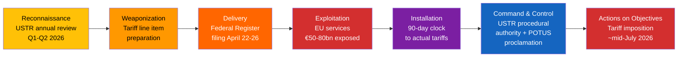
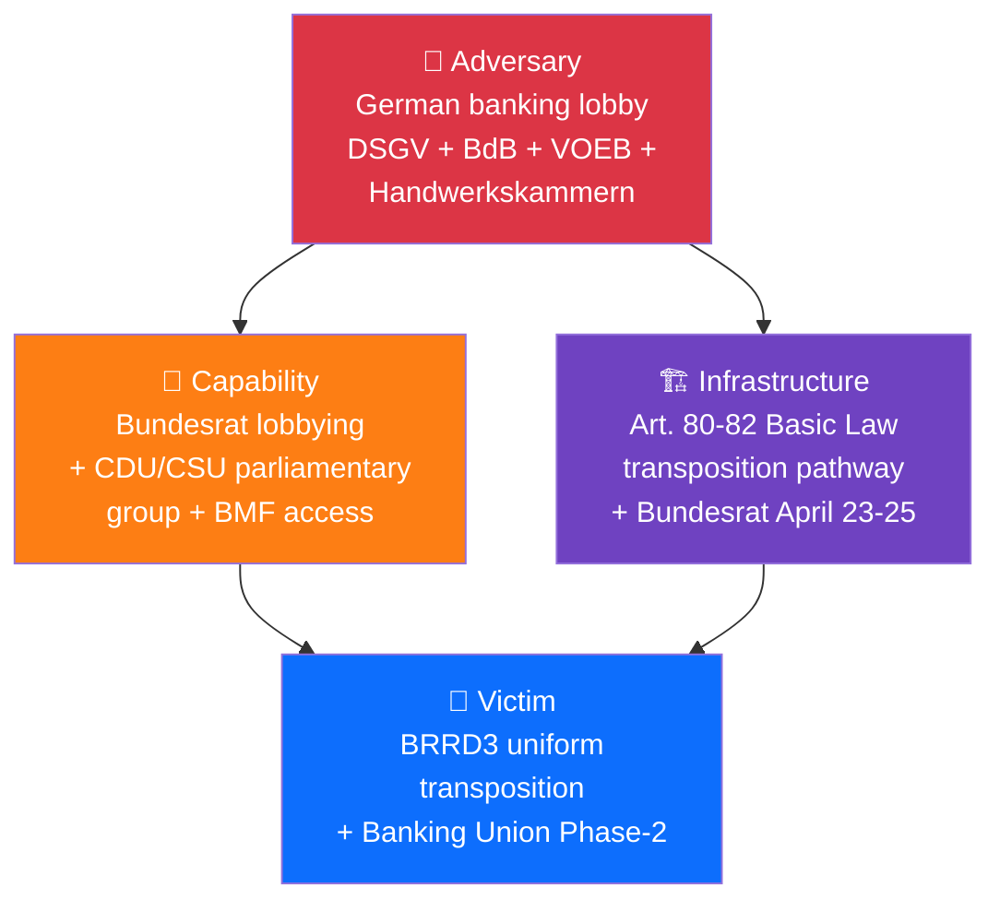

# 🎯 Threat Model — Month-Ahead Political Threats (Run 5)


> **Purpose**: Apply the Diamond Model, Attack Trees, and Lockheed Martin Kill Chain
> frameworks from `analysis/methodologies/political-threat-framework.md` to the top three
> severity-4+ political threats identified in `risk/risk-matrix.md` for the 30-day
> horizon. Threat modelling complements risk scoring: risk tells you *what* may go wrong
> and *how likely*; threat modelling tells you *how* it can unfold and *where* to
> intervene.

---

## Threat Landscape Overview

From `risk/risk-matrix.md`, three threats crossed the severity-4+ bar:

| # | Threat | Severity | Framework Applied |
|:-:|--------|:--------:|-------------------|
| T1 | US Section 301 Tariff Imposition | 16/25 (HIGH) | Kill Chain + Diamond Model |
| T2 | BRRD3 German Bundesrat Blocking | 15/25 (HIGH) | Diamond Model + Attack Tree |
| T3 | Anti-Corruption Implementation Resistance | 12/25 (MEDIUM) | Attack Tree + Kill Chain |

---

## 💎 T1. US Section 301 Tariff Imposition — Kill Chain



### Kill chain stages (from threat actor perspective)

| Stage | Activity | Intervention window |
|-------|----------|---------------------|
| Reconnaissance | USTR gathers EU services-export data | COMPLETE (pre-window) |
| Weaponization | Tariff line items prepared | Pre-April 22 |
| **Delivery** | **Federal Register filing** | **April 22–26 (THIS WINDOW)** |
| Exploitation | EU services-export markets react | April 22 onward |
| Installation | 90-day Section 301 clock | April 22 – mid-July |
| Command & Control | USTR + White House trade advisers | Ongoing |
| Actions on Objectives | Actual tariff imposition | Mid-July onward (outside window) |

### Diamond Model elements (this threat)

| Element | Specification |
|---------|---------------|
| **Adversary** | USTR under Trump II administration; Commerce Secretary; White House trade advisers; Congress-approved tariff authority |
| **Capability** | Section 301 statutory authority; Federal Register publishing; tariff collection infrastructure (CBP); WTO dispute-settlement channels |
| **Infrastructure** | US Federal Register; USTR press platform; WTO DSB; bilateral diplomatic channels |
| **Victim** | EU services exports (~€50–80 bn annually); EU auto sector (DE/AT/IT); aerospace (FR); luxury goods (FR/IT); EPP coalition coherence |

### Observable intervention points

| Point | Who can intervene | How | Window |
|-------|-------------------|-----|--------|
| Pre-filing negotiation | Commissioner Šefčovič | Brussels-Washington back-channel | Now – April 22 |
| Filing moment | Commission Trade DG | Public statement within 24 hours | April 22–26 |
| Post-filing response | EP INTA Committee | Urgency procedure for April 28 plenary | April 27 |
| Counter-measure activation | Commission + Council | Deploy TA-10-2026-0096 pre-authorisation | April 28 – May 19 |
| 90-day clock management | Commission + Congress-channel | De-escalation diplomacy | May – July |

### Indicators of threat execution
1. USTR press conference schedule April 21 (advance-notice typical)
2. Federal Register publication in April 22–26 window
3. Auto-sector stock pre-movement (DAX / Stoxx 600 Auto) April 22 onward
4. WTO DSB notification
5. Commerce Secretary public statement referencing EU services

### Indicators of failed execution (de-escalation)
1. No USTR press schedule April 21–25
2. Commissioner Šefčovič travel Brussels-Washington signalled
3. White House trade adviser statements referencing "dialogue"
4. DAX / CAC40 stable through April 24

---

## 💎 T2. BRRD3 German Bundesrat Blocking — Diamond Model + Attack Tree

### Diamond Model



### Diamond elements

| Element | Specification |
|---------|---------------|
| **Adversary** | German banking-sector associations: DSGV (Sparkassen, ~40% retail), BdB (commercial banks), VOEB (public-sector). Unified on BRRD3 bail-in subordination resistance. Structurally reinforced by 2-year GDP contraction |
| **Capability** | CDU/CSU parliamentary group access (Merz coalition); Finanzministerium relationships; technical-expertise credibility; Handwerkskammern alliance for political amplification |
| **Infrastructure** | German Basic Law Art. 80–82 transposition requirements; Bundesrat April 23–25 hearing window; Finanzausschuss committee; federal-state coordination |
| **Victim** | BRRD3 uniform EU-wide implementation; Banking Union Phase-2 completion arc; ECB SSM supervisory effectiveness |

### Attack Tree — "Block BRRD3 Transposition"

```
GOAL: Block or weaken BRRD3 transposition in Germany
│
├── BRANCH A: Hard blocking Bundesrat Entschließung [probability 10%]
│   ├── Pre-session Sparkassen lobbying of Länder finance ministers
│   ├── Finanzministerium briefing supporting reservation
│   └── Coalition CDU/CSU protection commitment activated
│
├── BRANCH B: Soft reservation + Council blocking minority [probability 30%]
│   ├── Bundesrat agrees reservation short of Entschließung
│   ├── Germany negotiates with Netherlands / Austria for blocking minority
│   └── Council position delayed beyond May 19
│
└── BRANCH C: Implementation-phase weakening [probability 50%]
    ├── Bundesrat passes BRRD3 but with "Ausschreibung"
    ├── Länder-level implementation variations
    └── Sparkassen exception claims under Commission oversight
```

### Indicators of Branch A (Hard blocking, Scenario C trigger)
1. Bundesrat April 23 agenda includes BRRD3 as resolution item (not information)
2. CDU/CSU parliamentary group position paper circulates
3. Finanzministerium briefing leaked to Handelsblatt supporting flexibility
4. S&D German delegation pushback statement within 24 hours

### Indicators of Branch B (Soft reservation, common outcome)
1. Bundesrat April 23 agenda includes BRRD3 as information item
2. No CDU/CSU coalition paper circulates
3. Limited press attention

### Indicators of Branch C (Implementation weakening)
1. All hard/soft signals absent in April 23–25 window
2. Sparkassen lobby activity shifts to Q3 implementation advocacy

---

## 🎯 T3. Anti-Corruption Implementation Resistance — Attack Tree + Kill Chain

### Attack Tree — "Weaken Anti-Corruption transposition"

```
GOAL: Delay, dilute, or nullify Anti-Corruption Directive transposition
│
├── BRANCH A: Formal Council resistance [probability 5%]
│   ├── HU + SK seek Council modifications
│   └── Commission infringement risk
│
├── BRANCH B: Slow transposition + thin enforcement [probability 35%]
│   ├── 24-month transposition deadline used to maximum
│   ├── National laws pass but operationally weak
│   └── Independent prosecution bodies without resources
│
├── BRANCH C: Legal challenge via CJEU [probability 15%]
│   ├── HU or SK files Article 263 annulment action
│   ├── Preliminary injunction request
│   └── 2-month window opens on OJ publication
│
└── BRANCH D: Domestic political blocking [probability 30%]
    ├── National parliaments reject transposition laws
    ├── Constitutional courts block provisions
    └── Government changes before deadline
```

### Kill Chain (focus on Branch B — thin implementation)

| Stage | Activity | EP intervention |
|-------|----------|-----------------|
| Reconnaissance | Member states study Directive flexibility | LIBE committee monitoring framework design |
| Weaponization | National draft laws with minimalist provisions | LIBE progress reports |
| Delivery | National parliaments pass thin laws | Commission infringement threat |
| Exploitation | Weak enforcement bodies | Parliament censure votes |
| Installation | 24-month deadline reached with minimal compliance | MFF conditionality trigger |
| Command & Control | National executives | No effective lever after deadline |
| Actions on Objectives | Corruption rates unchanged | Public-disillusionment effect |

### Indicators of Branch B progression (most likely)
1. HU / SK national draft laws thin on independent prosecution
2. BG / HR / CY national-budget allocations for prosecution bodies minimal
3. GRECO evaluation highlights resource gaps
4. LIBE mid-term progress report (expected Q4 2026) documents gaps

---

## Threat Aggregation

| Threat | Scenario Mapping | Peak Impact Window |
|--------|------------------|-------------------|
| T1 USTR Section 301 | Scenarios B, D | April 22–26 |
| T2 Bundesrat BRRD3 | Scenarios C, D | April 23–25 |
| T3 Anti-Corruption | Long-tail (24-month) | May plenary framework design |

**Compound threats**: T1 + T2 simultaneous = Scenario D (10% probability). T1 + T3 have limited interaction in the 30-day window. T2 + T3 have no meaningful interaction.

---

## Sources and Methodology

- Diamond Model: Caltagirone, Pendergast, Betz (2013), "The Diamond Model of Intrusion Analysis"
- Attack Trees: Schneier (1999), "Attack Trees: Modeling security threats"
- Kill Chain: Lockheed Martin (2011), "Intelligence-Driven Computer Network Defense"
- Methodology: `analysis/methodologies/political-threat-framework.md` (adapted for EU democracy threats)
- Prior run: breaking-run184 threat-model.md (template source)
- Mandatory per Matrix: threat-model = R for month-ahead; upgraded to M-equivalent here for reference-quality

**Confidence**: 🟡 MEDIUM overall — Diamond elements HIGH confidence (well-documented actors); attack-tree probabilities MEDIUM (forward-looking); kill-chain timing MEDIUM (USTR/Bundesrat calendars observable but discretion remains).
