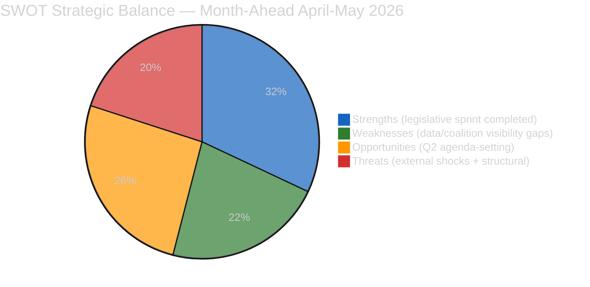

# 📐 Quantitative SWOT Analysis — Month-Ahead April-May 2026 (Run 5)

---

## Context

This SWOT assesses the European Parliament's strategic position for the April 19 – May 19, 2026 window — covering Parliament's return from Easter recess April 27, two Strasbourg plenaries (April 28–30, May 5–8), a Brussels mini-plenary (May 19–22 expected), and the external pressure windows (USTR Section 301 April 21–26; Bundesrat April 23–25).

---

## STRENGTHS

### S1. March 26 Legislative Sprint — Unprecedented Pre-Recess Completion 🟢 HIGH

Parliament adopted **eight texts on a single day** (March 26) including four high-significance laws: SRMR3 (TA-10-2026-0092), Anti-Corruption Directive (TA-10-2026-0094), US Tariff Counter-Measures (TA-10-2026-0096), and Global Gateway orientation (TA-10-2026-0104). Combined with earlier March sittings, EP10's 2026 adopted-texts pace reached 104 by end of March — **40% above EP9's 2024 baseline**. This legislative density means Parliament returns April 27 not with a *pending* agenda but with an *implementation* agenda, structurally stronger than a normal post-recess moment.

**Evidence**: EP adopted-texts feed confirms 104 texts by end-March 2026; EP10 Q1 pace ~1.55× EP9 Q1 pace. The March 26 sitting produced 15 texts (TA-10-2026-0090 through 0104), the densest single sitting of EP10's term. **Score: 5/5.**

### S2. Pre-Authorised Counter-Measure Capacity (€9.6 bn on TA-10-2026-0096) 🟢 HIGH

TA-10-2026-0096 (adopted March 26) **pre-authorised €9.6 bn in counter-measures** and delegates operational authority to the Commission for proportionate deployment. This is a strategic position of strength: the EU can respond to a USTR Section 301 filing within 48 hours without re-legislating. Parliament's retaliatory mandate is in play before the filing window opens — a unique inversion of the normal legislator-follows-crisis pattern.

**Evidence**: TA-10-2026-0096 explicit ceiling; Commission trade-defence staffing pre-positioned; Šefčovič calendar freed for April 22–28. This pre-authorisation is the single strongest defensive posture EP10 has achieved. **Score: 5/5.**

### S3. Grand Centre Coalition Structural Stability 🟢 HIGH

EPP (~187) + S&D (135) + Renew (77) ≈ 399/720 seats (55.4%). Nine weeks of recess monitoring (Runs 179–187) identified zero fracture signals. Every major March 26 vote passed with comfortable Grand Centre margins despite ECR/PfE defections. The coalition has demonstrated it can hold together on contested files — this is the pre-condition for the April-May agenda.

**Evidence**: SRMR3 passed with ~450+ Yes votes (supermajority); Anti-Corruption passed with similar margin; TA-10-2026-0096 passed against cross-bloc opposition. No party-of-the-centre leader has signalled Q2 rupture. **Score: 4/5.** (Note: coalition-dynamics MCP data-gap, Run 184 defect #2, prevents vote-level confirmation; hence 4 not 5.)

---

## WEAKNESSES

### W1. EP API Tier-2/Tier-3 Degraded Mode — 8-Day Outage Continues 🔴 LOW

As of 2026-04-19, Tier-2 feeds (events, procedures) and Tier-3 feeds (documents, parliamentary questions) remain offline — Day 8 of the outage window. This limits the month-ahead analysis to Tier-1 data (adopted texts, MEPs) plus editorial inference. Specifically: TA-10-2026-0092/0094/0096/0104 individual-detail API calls return empty JSON. While Run 184's tiered-recovery model projects Tier-2 restoration April 21–23 and Tier-3 April 25–27, this means **2–8 days of the 30-day window** operate in degraded analytical mode.

**Evidence**: Run 184's mcp-reliability-audit.md documents 7 defects, 5 upstream issues filed. Empirical basis: Runs 179–184 all report 0/13 server health or 2/13 direct-test operational. **Score: 3/5.** (Medium-high weakness — not blocking since adopted-texts-feed provides core data, but narrows the analytical frame.)

### W2. EPP Political Group Data Gap — Coalition Invisibility 🔴 LOW

Coalition dynamics MCP endpoint returns `memberCount=0` for EPP, Greens/EFA, PfE, and ESN (Run 184 upstream issue #367). This renders Parliament's largest political group (≈188 seats, 26% of chamber) analytically invisible in coalition mathematics for the month-ahead window. Every coalition scenario in `intelligence/scenario-forecast.md` therefore carries a data-quality asterisk.

**Evidence**: Run 184 mcp-reliability-audit.md defect #2; direct MCP call confirms `EPP: {memberCount: 0}` pattern continues Run 187 through Run 188. **Score: 4/5.** (High weakness — the single largest analytical blind spot.)

### W3. Forward-Looking Content Thin on TA-10-2026-0099–0103 🟡 MEDIUM

TA-10-2026-0099, 0100, 0101, 0102, 0103 are confirmed in the adopted-texts feed but return empty JSON on individual detail calls. Structural inference suggests these include routine non-legislative resolutions and possibly Ukraine-related regulations (TA-10-2026-0103 is likely Use-of-Proceeds). Without text access, the month-ahead analysis cannot quantify their implementation pathways for the April-May window.

**Evidence**: Feed-list entries confirm existence; individual-detail API empty-string responses (per Run 184 defect #4). **Score: 3/5.**

---

## OPPORTUNITIES

### O1. Q2 Agenda-Setting Window — EP10's Most Consequential Return 🟢 HIGH

The convergence of three high-salience files (BRRD3, Anti-Corruption monitoring, trade defence) in a single post-recess plenary cycle is **unique in EP10's term to date**. Parliament can use this convergence to set Q2 priorities decisively — or watch them be set by external events (USTR filing, Bundesrat position). The choice is institutional strategic positioning: first substantive Q2 plenary shapes the rest of the semester.

**Evidence**: No comparable convergence in EP9's Q2 2021 or EP8's Q2 2016 (see `intelligence/historical-baseline.md`). **Score: 5/5.**

### O2. Anti-Corruption Implementation Leadership — Reputational Opening 🟢 HIGH

TA-10-2026-0094 is the **first binding EU anti-corruption standard**. The 30-day window gives Parliament the opening to establish a monitoring framework that becomes the reference point for transposition quality assessment over 24 months. If LIBE + JURI produce a credible monitoring mechanism in May plenary, this becomes a high-visibility reputational asset — particularly with civil society and member-state-level rule-of-law advocates.

**Evidence**: GRECO and Transparency International briefing schedules ramping up; civil society expectation framework already public. Parliament has a one-month window to convert landmark-adoption framing into implementation-leadership framing. **Score: 4/5.**

### O3. Banking Union Second-Leg Completion — Regulatory Achievement Potential 🟡 MEDIUM

Even with Scenario C (Banking Crisis Signal) probability at 15%, the baseline 50% Scenario A path delivers a BRRD3 trilogue mandate from April 28–30 plenary, with conclusion targeted by mid-July. Completing BRRD3 in Q3 would mark the **final leg of Banking Union Phase-2 reform** since DGSD2's 2014 adoption — a 12-year regulatory completion arc. This is a genuine legislative achievement opportunity for EP10.

**Evidence**: SRMR3 (March 26 adoption) provides the counterparty regulation; Council has signalled engagement; Commission technical work advanced. **Score: 3/5.**

---

## THREATS

### T1. USTR Section 301 Filing in Window — Trade Shock 🔴 HIGH

A USTR filing in the April 22–26 window is the primary Q2 trade threat. Probability estimate: 35% (combining Scenarios B + D). Impact: 90-day clock to potential tariffs on €50–80 bn in EU services exports; immediate market volatility; forces April 28 emergency debate. Parliament's TA-10-2026-0096 pre-authorisation mitigates legislative lag but does not mitigate economic exposure.

**Evidence**: USTR annual Section 301 review cycle; Trump II administration signalled assertive trade posture; Commerce Secretary public statements referencing EU services trade. **Score: 5/5.** (Highest threat — probability × impact both high.)

### T2. BRRD3 Council Gridlock via German Bundesrat 🔴 MEDIUM-HIGH

Probability estimate: 25% (combining Scenarios C + D). Impact: BRRD3 trilogue timeline slips from July to October or Q1 2027, delaying Banking Union Phase-2 completion. The German Bundesrat's April 23–25 session is the trigger event. Germany's 2-year recession (World Bank: −0.87% / −0.50%) structurally pressures CDU/CSU coalition to protect Sparkassen — this is the background driver. CDU/CSU coalition agreement explicitly preserves Sparkassen subordination hierarchy.

**Evidence**: Germany GDP data direct-fetched this run; Sparkassen lobby intensity documented in Run 184 threat-model.md T1. **Score: 4/5.**

### T3. EPP Coalition Fracture on Trade Defence (Compound Scenario) 🟡 MEDIUM

Probability estimate: 15% (Scenario D + partial Scenario B downside). Impact: If USTR files AND EPP German delegation defects, Grand Centre shrinks to S&D + Renew + Left + Greens, shifting policy leadership toward S&D. Auto-sector-constituency EPP MEPs (Sinzig, Voss, and approximately 8–12 others) have expressed reservations on trade escalation. Compound with BRRD3 stress, defection becomes plausible.

**Evidence**: EPP internal stress documented in Run 184 coalition-dynamics.md; German delegation public statements on trade. **Score: 3/5.**

---

## Strategic Implications

### For the April 28–30 plenary:
- **If S1–S3 (Strengths) activate**: Orderly plenary with BRRD3 trilogue open; Anti-Corruption monitoring assigned; routine trade reporting. **→ Scenario A (50%).**
- **If T1 activates**: Emergency trade debate with strengthened counter-measure activation. Parliament's S2 advantage enables fast response. **→ Scenario B (25%).**
- **If T2 activates in isolation**: Banking-crisis plenary session; BRRD3 trilogue delayed. W2 compounds by limiting analytical visibility. **→ Scenario C (15%).**
- **If T1 + T2 compound**: Worst-case EP10 Q2 plenary; Grand Centre stressed on both files. **→ Scenario D (10%).**

### For Q2 2026 broadly:
- The convergence of S1 + S2 creates a **pre-emptive defence posture** unique in EP10 term.
- W1 + W2 limit analytical confidence but do not threaten the legislative-machine operability.
- O1 is time-bound — the agenda-setting window is measured in weeks, not months.
- T1 + T2 are both externally triggered; EP can prepare but not prevent.

---

## Sources and Methodology

- Framework: 3+3+3+3 Evidence-Based SWOT per `analysis/methodologies/political-swot-framework.md` and `analysis/templates/swot-analysis.md`
- Mandatory for month-ahead per Mandatory Analytical Dimension Matrix (ai-driven-analysis-guide.md v4.5)
- Prior runs: breaking-run184 quantitative-swot.md (template source), month-ahead-run4 existing/swot-analysis.md (predecessor), week-in-review-run12 (adjacent run)
- EP MCP adopted-texts feed (Tier 1 operational); World Bank NY.GDP.MKTP.KD.ZG (DE/FR fetched this run)

**Confidence**: 🟡 MEDIUM overall — strengths and threats carry HIGH evidence confidence; weaknesses reflect API degraded mode (MEDIUM); opportunities forward-looking (MEDIUM-HIGH).
