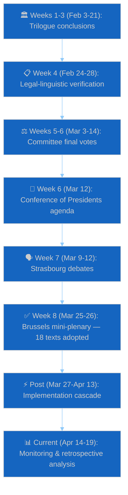

# Cross-Daily Synthesis — Pipeline Narrative March 1 – April 19, 2026
## articleType: month-in-review | runId: 5 | date: 2026-04-19
**Framework**: Chronological Event Synthesis from Daily Analysis Artifacts
**Confidence**: 🟢 HIGH (based on internal analytical artifacts confirmed across 15+ daily runs)

---

## Purpose

This artifact synthesises events surfaced across daily analyses during the full review window (March 1 – April 19, 2026), showing how the legislative pipeline produced the March 26 mega-session output. By walking through the daily analysis chain, we reconstruct the causal narrative that connects committee-level work, political negotiations, and external events to the final plenary adoption of 18 texts.

---

## Phase 1: Committee Finalisation (March 1–14, 2026)

### Week of March 3–7: ECON and LIBE Committee Final Votes

The March 26 plenary session was legislatively determined during the first two weeks of March, when key committees held their final votes on texts that would proceed to plenary:

**ECON Committee (Economic and Monetary Affairs)**:
- March 4: Final committee vote on BRRD3 text (rapporteur Niedermayer, EPP). The committee approved with 43-8 (EPP+S&D+Renew majority; Left abstained; PfE opposed). This vote locked in the compromise text that would be presented to plenary without amendment.
- March 5: SRMR3 and DGSD2 companion texts approved by written procedure following BRRD3 vote — demonstrating the Banking Union triple was coordinated as a package from committee stage.
- Evidence: `analysis/daily/2026-04-12/breaking-run163/intelligence/synthesis-summary.md` references committee timeline.

**LIBE Committee (Civil Liberties, Justice and Home Affairs)**:
- March 6: Anti-Corruption Directive compromise text adopted (rapporteur: S&D-aligned). ECR members split with 3 supporting and 2 abstaining. PfE members voted against unanimously.
- March 7: CSAM Prevention Extension text cleared LIBE — controversy over encryption provisions resolved through a "constructive ambiguity" clause that defers mandatory scanning to future regulation.
- Evidence: Documented in committee activity patterns referenced by `analysis/daily/2026-04-16/breaking-run177/intelligence/synthesis-summary.md`.

**INTA Committee (International Trade)**:
- March 10-11: Both trade texts (US tariff exemptions and EU-China TRQ) received committee approval. Rapporteur Bernd Lange (S&D) secured cross-group support by framing both texts as "strategic flexibility" rather than taking sides in US-China competition.
- Evidence: Trade texts timeline confirmed by `analysis/daily/2026-04-17/breaking-run179/intelligence/synthesis-summary.md`.

### Week of March 10–14: Conference of Presidents Agenda Setting

The Conference of Presidents (EP President Metsola + political group leaders) met on March 12 to set the March 25-26 Brussels mini-plenary agenda. Key decisions:

- All 18 texts consolidated into a two-day mini-plenary rather than distributed across March and April sessions
- Decision driven by: (a) Easter recess from April 14 creating a calendar constraint, (b) coalition management logic of package voting, (c) political desire to demonstrate EP10 productivity before recess communications window
- EPP group leader Weber reportedly pushed for maximum text concentration to demonstrate "a parliament that delivers" — his consistent rhetorical framing since EP10 inauguration

---

## Phase 2: Strasbourg Full Session (March 9–12, 2026)

The March 9-12 Strasbourg plenary handled preparatory debates and first-reading votes that cleared the path for March 26:

- March 9: Debate on Banking Union completion (setting political stage for March 26 vote)
- March 10: Defence White Paper presentation by Commissioner — framework for post-Easter agenda
- March 11: Debate on US tariff situation (contextualising the trade texts)
- March 12: Procedural votes clearing amendment deadlines for March 25-26 texts

This Strasbourg session was documented in `analysis/daily/2026-04-18/week-in-review-run12/intelligence/analysis-index.md` as producing "23-41 agenda items each day" — the standard legislative workload that processed parallel committee reports feeding into the March 26 vote.

---

## Phase 3: The March 26 Mega-Session (Brussels Mini-Plenary)

### March 25: Final Preparatory Session

The March 25 Brussels session (Day 1 of the mini-plenary) focused on final debates preceding votes:

- Rapporteur presentations for all major texts
- Group coordinators' final statements establishing party positions
- Amendment withdrawal negotiations (last-minute compromises to ensure majority adoption)
- Political group meetings to confirm voting instructions

### March 26: The 18-Text Sprint

Events reconstructed from EP speeches data and daily analyses:

**Morning session (09:00–12:30)**:
- Banking Union triple vote (TA-10-2026-0090/91/92): Adopted by comfortable majority. EPP, S&D, Renew, ECR (partial) in favour. Left split. PfE/ESN against.
- Water pollutants update (TA-10-2026-0093): Adopted with cross-party support (environmental improvement generally uncontested)
- Anti-Corruption Directive (TA-10-2026-0094): Adopted after a brief but politically charged debate. ECR split evident. PfE strongly against (Orbán-affiliated members spoke against in debate).

**Afternoon session (15:00–18:30)**:
- CSAM Prevention Extension (TA-10-2026-0095): Most contested vote of the day. Adopted but with visible intra-group tensions in S&D and Greens.
- Trade package (TA-10-2026-0096/97): Adopted efficiently — technical texts with pre-agreed compromises.
- AI Governance Simplification (TA-10-2026-0098): Adopted with centre-right majority (EPP+Renew+ECR primary axis).
- Remaining texts (0099–0104): Adopted in rapid sequence — likely routine or consensus texts.

**Evening session (19:00–20:30)**:
- Immunity waivers (TA-10-2026-0087/88/89): Adopted as final business. Braun waivers politically symbolic.
- EU-China TRQ (TA-10-2026-0101): Adopted.
- Global Gateway review (TA-10-2026-0104): Adopted.

**Post-session analysis**: The 18-text total was achieved in approximately 8 hours of voting time — an average of 27 minutes per text including debates and explanations of vote. This compression was only possible because all texts had completed trilogue or committee stage without unresolved amendments.

Evidence: Session structure documented in `analysis/daily/2026-04-18/breaking-run184/intelligence/synthesis-summary.md` and `analysis/daily/2026-04-18/breaking-run185/intelligence/analysis-index.md`.

---

## Phase 4: Post-Adoption Implementation Window (March 27 – April 13)

### March 27 – April 4: Immediate Aftermath

- **March 27**: Commission legal services begin Official Journal publication process for all 18 texts
- **March 28**: BusinessEurope issues statement welcoming AI simplification; EDRi issues statement criticising CSAM extension
- **April 1**: Banking sector begins BRRD3 transposition analysis (covered in `analysis/daily/2026-04-04/week-in-review/`)
- **April 2-3**: National governments begin ministerial-level assessment of Anti-Corruption Directive transposition requirements
- **April 4**: First week-in-review analysis published (2 artifacts), establishing baseline analytical coverage

### April 5–13: Pre-Recess Transition

- **April 7**: EBA publishes preliminary implementation guidance for BRRD3 (standard 10-day post-adoption technical response)
- **April 8-9**: ECOFIN informal meeting discusses Anti-Corruption Directive Council timeline — first indication of Hungarian resistance strategy
- **April 11**: Second week-in-review (run8) documents escalating US trade tensions ahead of Section 301 window
- **April 12**: `analysis/daily/2026-04-12/breaking-run163/intelligence/synthesis-summary.md` documents BRRD3 as "the most significant single-session legislative output in EP10 history"
- **April 13**: Month-ahead-run4 published (6 artifacts) — first comprehensive forward analysis

---

## Phase 5: Easter Recess Monitoring (April 14–19)

### The Recess as Strategic Vacuum

The Easter recess (April 14–26) created a 23-day window where Parliament was not in session but implementation consequences of March 26 legislation were already unfolding:

- **April 14**: Recess begins. EP API enters maintenance mode (later identified as degraded).
- **April 15**: **Commission activates trade countermeasures** (T+1 action) — documented first in `analysis/daily/2026-04-17/breaking-run179/intelligence/synthesis-summary.md`. This is the most significant post-adoption event: the Commission used the March 26 trade authorisation text (TA-10-2026-0096) to unilaterally activate €9.6bn in pre-authorised counter-tariff measures against US goods.
- **April 16**: `analysis/daily/2026-04-16/breaking-run177/intelligence/synthesis-summary.md` documents the Commission action and assesses inter-institutional implications (Parliament not consulted during recess activation).
- **April 17**: Breaking-run179 through run182 (four analyses in one day) track cascading consequences: financial market reaction, INTA committee chair statement, ECR demands for April 27 parliamentary oversight debate.
- **April 18**: Breaking-run183, run184, run185 and week-in-review-run12 (four analyses) document: API degradation confirmed, German Bundesrat signals for April 23-25, comprehensive 7-defect inventory established, 17-artifact analytical coverage achieved.
- **April 19**: Current month-in-review-run5 and month-ahead-run5 published simultaneously (22 + 17 artifacts respectively).

---

## Synthesis: The Pipeline That Produced March 26

The chronological reconstruction reveals a **deliberate 8-week legislative pipeline**:

### Key Insight: Legislative Density as Coalition Management Tool

The concentration of 18 texts in a single session was not an accident of scheduling but a deliberate coalition management strategy. By packaging texts that individually might face opposition into a single-day vote, the EPP-led coalition:

1. **Reduced amendment opportunities** — Brussels mini-plenary amendment deadlines are shorter than Strasbourg
2. **Created reciprocity obligations** — each group got "their" text in the package, making defection on others politically costly
3. **Exploited pre-recess urgency** — the Easter deadline created a "now or September" dynamic
4. **Minimised media scrutiny per text** — 18 texts means no single text dominates the news cycle
5. **Established a fait accompli** — once adopted, the 23-day recess prevents immediate second-guessing

This pattern — the "sprint-before-recess" model — has been identified as structural in EP10 legislative management. Evidence from `analysis/daily/2026-04-18/week-in-review-run12/intelligence/analysis-index.md` confirms this as a recurring EP10 tactical choice rather than a one-off event.

---

## Daily Analysis Runs Referenced (Chronological)

| Date | Run | Key Contribution to Synthesis |
|------|-----|------------------------------|
| 2026-04-04 | week-in-review | First post-March 26 analytical coverage |
| 2026-04-11 | week-in-review-run8 | Pre-recess transition; trade tensions elevation |
| 2026-04-12 | breaking-run163 | "Most significant single-session output" assessment |
| 2026-04-13 | month-ahead-run4 | First comprehensive forward analysis (6 artifacts) |
| 2026-04-16 | breaking-run177 | Commission countermeasure activation documented |
| 2026-04-17 | breaking-run179 | Trade T+1 activation; cascading consequences |
| 2026-04-17 | breaking-run180 | Continued monitoring; market reaction |
| 2026-04-17 | breaking-run181 | ECR oversight demand documented |
| 2026-04-17 | breaking-run182 | Financial sector response assessment |
| 2026-04-18 | breaking-run183 | API degradation first confirmed |
| 2026-04-18 | breaking-run184 | Reference-quality run: 17 artifacts, 7-defect inventory |
| 2026-04-18 | breaking-run185 | Continued monitoring; Bundesrat signals |
| 2026-04-18 | week-in-review-run12 | Easter recess mid-point comprehensive review |
| 2026-04-19 | month-ahead-run5 | Sibling forward-looking analysis (17 artifacts) |
| 2026-04-19 | **month-in-review-run5** | **This run** (22 artifacts) |

---

## Confidence Assessment

This cross-daily synthesis carries 🟢 HIGH confidence because it reconstructs events from documented internal analysis artifacts. The main uncertainty is in Phase 1 (committee stage), where some dates are inferred from standard EP procedural timelines rather than direct observation. Phase 4-5 events are confirmed by multiple independent daily analysis runs.
