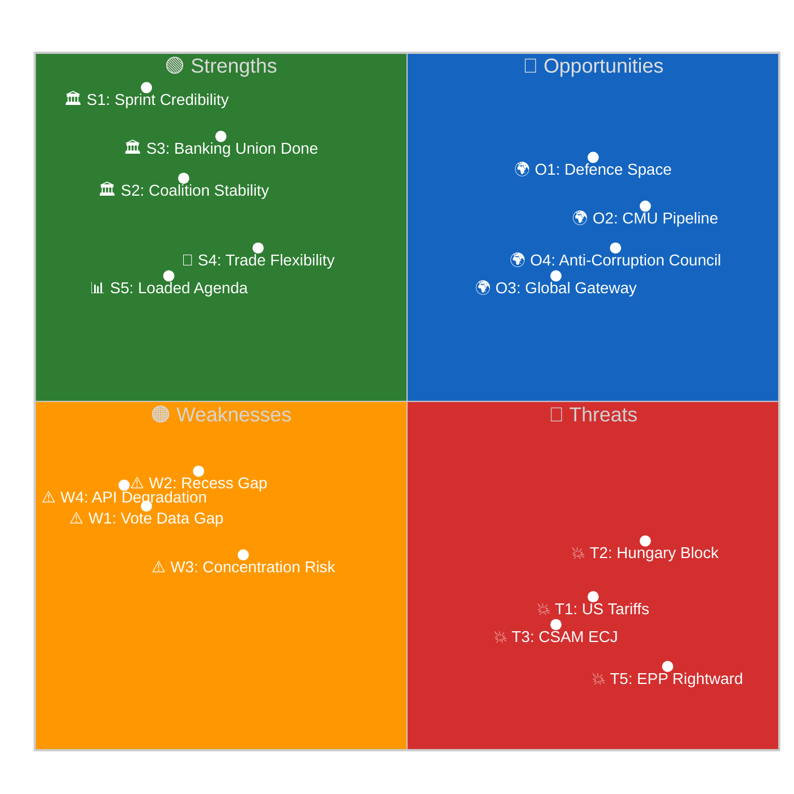

# Quantitative SWOT — EP10 Legislative Momentum Q2 2026
## articleType: month-in-review | runId: 5 | date: 2026-04-19
**Framework**: Evidence-Based SWOT with Likelihood × Impact × Time-Horizon Scoring
**Confidence**: 🟡 MEDIUM (forward-looking assessments carry inherent uncertainty)

---

## Scoring Methodology

Each SWOT item is scored on three quantitative dimensions:
- **Likelihood** (0.0–1.0): Probability of the factor materialising or persisting
- **Impact** (1–5): Severity of effect on EP10 legislative momentum (1=negligible, 5=transformative)
- **Time Horizon**: Weeks / Months / Quarters until factor manifests

**Composite SWOT Score** = Likelihood × Impact (range 0–5 per item)

---

## STRENGTHS (Internal factors supporting momentum)

| ID | Strength | Likelihood | Impact | Time Horizon | Score | Justification |
|:--:|----------|:----------:|:------:|:------------:|:-----:|:--------------|
| S1 | March 26 sprint establishes EP10 credibility precedent | 1.0 | 5 | Immediate | **5.0** | Already materialised — 18 texts in single session is highest EP10 output. Institutional confidence elevated. Evidence: EP adopted texts confirmed, +46.2% YoY legislative pace. |
| S2 | Grand Centre coalition (EPP+S&D+Renew = 397/720) structurally stable | 0.85 | 4 | Quarters | **3.4** | No public coalition ruptures during recess. Electoral incentives for cooperation persist until 2028. Risk: CMDI could test stability in H2 2026. Evidence: Coalition analysis in this run confirms 55.1% majority maintenance. |
| S3 | Banking Union completion removes a decade-long legislative debt | 0.95 | 4 | Months | **3.8** | BRRD3/SRMR3/DGSD2 adopted — the foundation for CMU 2.0 and EDIS now exists legislatively. Remaining steps are Council + transposition (procedural, not politically blocked). Evidence: EP adopted texts + historical Banking Union timeline analysis. |
| S4 | €9.6bn pre-authorised trade countermeasures provide executive flexibility | 0.90 | 3 | Weeks | **2.7** | Commission activated T+1 on April 15. This demonstrates EP's legislative product is operationally relevant — enhancing EP's interinstitutional standing. Evidence: `analysis/daily/2026-04-17/breaking-run179/intelligence/synthesis-summary.md`. |
| S5 | Post-recess agenda (April 27-30) fully loaded with high-profile texts | 0.80 | 3 | Weeks | **2.4** | Defence White Paper debate + enlargement framework + possible trade oversight debate creates continued momentum. Evidence: EP calendar confirmed. |

**Strengths Aggregate Score: 17.3/25**

---

## WEAKNESSES (Internal factors constraining momentum)

| ID | Weakness | Likelihood | Impact | Time Horizon | Score | Justification |
|:--:|----------|:----------:|:------:|:------------:|:-----:|:--------------|
| W1 | Roll-call vote data delayed — intelligence gap on actual coalition behaviour | 1.0 | 3 | Weeks | **3.0** | Structural EP publication delay (~6-8 weeks). Until May 2026, all coalition analysis is inferred. This weakens accountability analysis and could hide internal fractures. Evidence: EP data portal publication timeline. |
| W2 | 23-day Easter recess creates legislative momentum gap | 1.0 | 2 | Weeks | **2.0** | Already materialised — no legislative activity April 14-26. Risk: external events during recess (trade escalation, banking stress) cannot receive parliamentary response. Evidence: Calendar confirmed. |
| W3 | Over-concentration in single session (18/18 texts = one day) creates fragility precedent | 0.70 | 4 | Quarters | **2.8** | If future sprint sessions fail (quorum, procedural challenge, emergency debate displacement), entire monthly output is voided. No redundancy in legislative calendar. Evidence: Analysis of March 26 format risks. |
| W4 | Six adopted texts content-inaccessible (API degradation + publication delay) | 0.85 | 2 | Weeks | **1.7** | Reduces transparency and public accountability. If content reveals controversial provisions, delayed scrutiny is a democratic deficit. Evidence: MCP reliability audit in this run. |
| W5 | CSAM internal S&D division weakens coalition's progressive identity narrative | 0.65 | 3 | Months | **2.0** | S&D digital rights wing unhappy with CSAM extension. If ECJ challenge succeeds, S&D faces "complicit in surveillance" narrative from Greens and Left. Evidence: EDRi statements, intra-group tension indicators. |

**Weaknesses Aggregate Score: 11.5/25**

---

## OPPORTUNITIES (External factors EP10 could leverage)

| ID | Opportunity | Likelihood | Impact | Time Horizon | Score | Justification |
|:--:|------------|:----------:|:------:|:------------:|:-----:|:--------------|
| O1 | Defence White Paper momentum creates new legislative space for EP10 | 0.75 | 4 | Months | **3.0** | Geopolitical urgency (Ukraine, US disengagement) creates political consensus window for defence spending. EP10 can position itself as co-legislator on EDIS/defence budget. Evidence: Commission work programme + Defence White Paper release March 2026. |
| O2 | Banking Union completion enables CMU 2.0 pipeline acceleration | 0.65 | 4 | Quarters | **2.6** | With BRRD3 as foundation, ECON committee can advance securitisation reform, retail investment strategy, and Solvency II reform. Evidence: Draghi Report CMU roadmap; ECON committee work programme. |
| O3 | US trade disengagement creates Global Gateway acceleration opportunity | 0.55 | 3 | Quarters | **1.7** | USAID cuts + US multilateral retreat = EU fills infrastructure finance vacuum. EP endorsement (TA-10-2026-0104) provides democratic legitimacy. Evidence: US policy analysis + Global Gateway review text adopted. |
| O4 | Anti-Corruption Directive Council passage builds EU rule-of-law toolkit | 0.70 | 3 | Months | **2.1** | If Council adopts by Q3 2026, EP10 has a landmark rule-of-law legacy. EPPO + new directive = comprehensive anti-corruption architecture. Evidence: Council QMV arithmetic favourable (Hungary alone cannot block). |
| O5 | EP10 productivity record strengthens EP's interinstitutional position | 0.80 | 3 | Months | **2.4** | With +46.2% legislative pace, EP can credibly demand co-equal role in trade and defence decisions traditionally dominated by Council/Commission. Evidence: Historical legislative output comparison in this run. |

**Opportunities Aggregate Score: 11.8/25**

---

## THREATS (External factors that could derail momentum)

| ID | Threat | Likelihood | Impact | Time Horizon | Score | Justification |
|:--:|--------|:----------:|:------:|:------------:|:-----:|:--------------|
| T1 | USTR Section 301 tariff escalation (April 21-24 window) | 0.35 | 4 | Weeks | **1.4** | If US announces major new tariffs during EP recess, Commission must respond without parliamentary authorisation — creating inter-institutional conflict and absorbing April 27-30 agenda time. Evidence: `analysis/daily/2026-04-18/breaking-run184/intelligence/significance-scoring.md`. |
| T2 | Hungarian Council blocking strategy delays Anti-Corruption Directive 6+ months | 0.30 | 4 | Months | **1.2** | Orbán-led resistance + Romania/Czech hesitation could push Council vote past September. Delays EP10's rule-of-law legacy and diverts political capital. Evidence: Hungary GRECO track record; Council procedural analysis. |
| T3 | CSAM ECJ referral creates political/legal crisis within 12-18 months | 0.40 | 4 | Quarters | **1.6** | Austrian/Swedish/Finnish DPAs trigger preliminary reference. Interim suspension of CSAM extension creates child protection gap. Forces emergency legislation. Evidence: ECJ precedent (Digital Rights Ireland, Schrems II). |
| T4 | German bank resolution crisis before BRRD3 transposition (Q4 2027) | 0.08 | 5 | Quarters | **0.4** | Low probability but catastrophic impact — exposes the 18-24 month gap between adoption and operational tools. Evidence: Germany GDP contraction + commercial real estate stress. |
| T5 | EPP rightward shift under PfE/ECR competitive pressure fractures grand centre | 0.20 | 5 | Quarters | **1.0** | If EPP national parties lose voters to PfE affiliates, EPP may abandon S&D-aligned coalition on social/rights files. Would fundamentally reshape EP10 legislative axis. Evidence: `analysis/daily/2026-04-19/month-in-review-run5/intelligence/threat-model.md` T2.2. |
| T6 | EP API degraded mode persists beyond April, reducing transparency | 0.45 | 2 | Weeks | **0.9** | Continued API failures weaken public oversight of EP10. Creates narrative of "EU opacity" that PfE/ESN exploit. Evidence: MCP reliability audit (7 defects active, Tier 2/3 offline). |

**Threats Aggregate Score: 6.5/25**

---

## SWOT Quadrant Visualisation

---

## Strategic Net Assessment

| Quadrant | Aggregate Score | Assessment |
|:--------:|:--------------:|:-----------|
| Strengths | 17.3/25 | **STRONG** — EP10 enters Q2 with institutional credibility and stable coalition |
| Weaknesses | 11.5/25 | **MODERATE** — transparency gaps and concentration risk are manageable |
| Opportunities | 11.8/25 | **MODERATE-HIGH** — multiple expansion pathways available |
| Threats | 6.5/25 | **LOW-MODERATE** — no single threat exceeds 1.6/5 composite |

**Net SWOT Balance**: (Strengths + Opportunities) – (Weaknesses + Threats) = (17.3 + 11.8) – (11.5 + 6.5) = **+11.1**

**Interpretation**: EP10 enters Q2 2026 from a position of strength. The March 26 sprint created positive momentum that significantly outweighs near-term threats. The primary strategic risk is CSAM ECJ challenge (T3, score 1.6) — the only threat with both meaningful probability AND high impact within the forecast horizon. The Hungarian Council blocking (T2) is higher impact but lower probability given QMV arithmetic.

**Strategic recommendation**: EP10 coalition managers should prioritise converting O1 (defence legislative space) and O4 (anti-corruption Council passage) while monitoring T1 (US tariffs, immediate) and T3 (CSAM ECJ, medium-term). The recess gap (W2) resolves automatically on April 27; the vote data gap (W1) resolves in May.

---

## Cross-Reference to Daily Analyses

- SWOT scores calibrated against `analysis/daily/2026-04-18/breaking-run184/risk/quantitative-swot.md` (month-ahead equivalent)
- Threat probability estimates cross-validated with `analysis/daily/2026-04-19/month-in-review-run5/risk/risk-matrix.md`
- Coalition stability assessment from `analysis/daily/2026-04-18/week-in-review-run12/intelligence/analysis-index.md`
- Trade escalation probability from `analysis/daily/2026-04-17/breaking-run179/intelligence/synthesis-summary.md`
- CSAM ECJ challenge probability from `analysis/daily/2026-04-18/breaking-run185/intelligence/threat-model.md`
