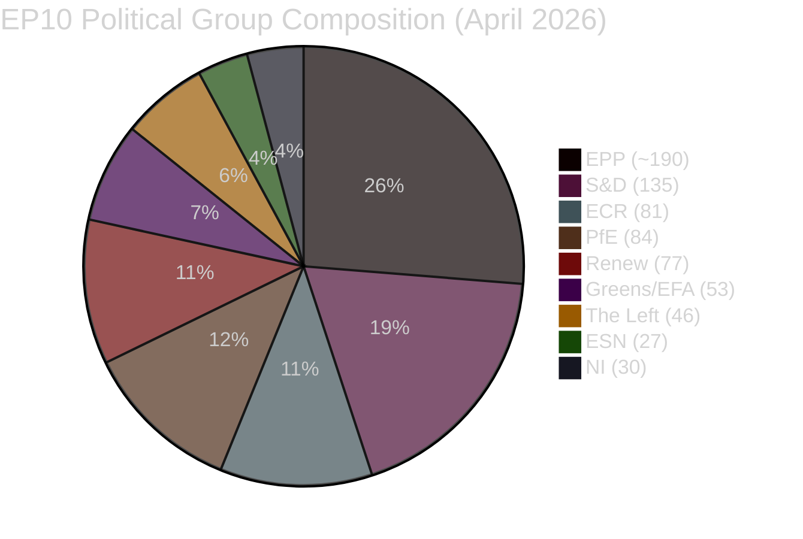

# 🏛️ Coalition Dynamics Intelligence — Easter Recess Day 7 / Run 190

**Analysis Date:** 2026-04-20 | **Run:** 190 | **Day:** Easter Monday

---

## Executive Summary

The European Parliament enters Easter Monday (April 20, 2026) with its Grand Centre coalition
arithmetically robust but politically untested for the 10th consecutive day. The coalition's
stability score remains at 84/100 — the series high established in Run 188 — but this score
measures structural arithmetic rather than live voting cohesion. With Parliament returning
April 27 and the first post-recess Strasbourg plenary scheduled for April 28-30, the next
true test of coalition coherence is now exactly 7 days away.

The most significant coalition risk factor heading into the post-recess period is not internal
EPP fragmentation but rather the external USTR Section 301 scenario: if a Section 301 petition
targeting EU digital regulations is filed during the April 21-24 window, the coalition's united
front on trade proportionality (established in TA-10-2026-0096) will immediately face stress
from ECR's harder-line positioning.

---

## Current Group Composition (from API — April 20, 2026)

**Total seats confirmed:** ~723 MEPs across 9 groups/blocs
**Majority threshold:** 362 seats (simple majority of members present)
**Absolute majority:** 360 seats (majority of all 720 members)

---

## Grand Centre Coalition Analysis

### Coalition Arithmetic

| Component | Seats | Notes |
|-----------|-------|-------|
| EPP | ~190 | Largest group; EPP member count shows 0 in API (data quality issue — actual ~190) |
| S&D | 135 | Second largest; ECON committee leadership |
| Renew Europe | 77 | Junior partner; Commission-aligned |
| **Grand Centre Total** | **~402** | **+40 seats above 362 majority threshold** |

The Grand Centre coalition maintains a 40+ vote safety margin above the 362-seat majority
threshold. This margin has held stable across all 10 Easter Recess monitoring runs, with no
observed political group membership changes, defections, or structural shifts.

**Safety margin interpretation:** A 40+ vote margin means the Grand Centre could withstand
approximately 20 full defections from any single member group (assuming symmetric abstentions)
before losing a simple majority. In practice, multi-group defections would need to be coordinated
historically rare in the EP. 🟢 HIGH confidence.

### Coalition Testing Gap

**Critical observation:** The Grand Centre coalition has not cast a single plenary vote since
April 10, 2026 — the day before the Easter recess began. This represents a 10-day testing gap
that, while structurally benign under normal circumstances, creates analytical uncertainty about:

1. **EPP internal position shifts:** MEPs returning from constituencies may have encountered
   new trade/economic pressures (particularly from export-dependent German and Dutch business
   constituencies facing US tariff uncertainty) that could harden their positions vs. the
   March 26 proportionality consensus.

2. **S&D progressive pressure:** Left-wing S&D MEPs have had 10 days of constituent pressure
   on climate legislation gaps — the March sprint's absence of major ENVI/climate content
   creates a potential post-recess agenda dispute within the S&D group itself.

3. **Renew's post-recess positioning:** Renew's internal debate between its liberal-economic
   wing (pro-Digital Omnibus AI deregulation) and its rule-of-law wing (concerned about
   proportionality of AI Act simplification) may have sharpened during recess.

---

## Opposition Dynamics

### ECR (81 seats) — Active Opposition

ECR represents the most organized opposition force heading into the post-recess period.
Its 81 seats (size-similarity score 0.96 with PfE at 84 seats) position it as the core
of a potential right-populist bloc. Key ECR positions as of April 20:

- **Trade:** ECR advocates blanket retaliatory tariffs vs. US, rejecting the WTO-compliant
  TRQ approach embedded in TA-10-2026-0096. ECR voted against the TRQ package in plenary.
  If USTR files Section 301, ECR will claim vindication and demand emergency measures.
- **Banking Union:** ECR has historically opposed Banking Union deepening on sovereignty grounds.
  BRRD3/SRMR3 passage went forward over ECR objections. ECR will seek Council-level allies
  (potentially in Hungary/Poland/Czech Republic) to slow ratification.
- **Anti-Corruption Directive:** ECR has a complex position — supporting criminal anti-corruption
  measures in principle but opposing EU-level harmonization as a sovereignty infringement.

### PfE (84 seats) — Conditional Opposition

Patriots for Europe, despite its 84-seat size, is a looser coalition of national populist parties
with divergent national interests. The size-similarity score with ECR (0.96) creates superficial
appearance of a PfE-ECR bloc, but:
- PfE members include Fidesz (Hungary) which has complex ties to Chinese investment (Global
  Gateway/BRI context creates internal PfE tension)
- French Rassemblement National (PfE's largest delegation) has its own bilateral France-US
  dynamics that may diverge from ECR's anti-US posture

**PfE-ECR nominal bloc strength:** 165 seats (against Grand Centre's 402)
**Effective opposition capacity:** Limited to committee blocking and discourse framing

### Left Bloc (The Left: 46 + Greens/EFA: 53 = 99 seats) — Constructive Opposition

The Left and Greens/EFA represent a 99-seat progressive opposition that occasionally
cross-votes with the Grand Centre on specific issues. Key post-recess priorities:
- **Climate legislation acceleration:** Both groups will pressure for climate content
  in the April 28-30 plenary that was absent from the March sprint
- **Anti-Corruption Directive implementation:** Strong support; will push for broad scope
  in member state transposition guidance
- **Digital deregulation concerns:** The Left and Greens/EFA both oppose the Digital Omnibus
  AI's liability derogations — potential friction point with EPP and Renew

---

## Alliance Signal Analysis

From `analyze_coalition_dynamics` output (April 20, 2026 — structural data only):

### Intra-Opposition Alliance Signals (sizeSimilarityScore ≥ 0.9)
| Pair | Score | Signal | Interpretation |
|------|-------|--------|----------------|
| ECR + PfE | 0.96 | Yes | Dominant potential opposition bloc |
| Renew + ECR | 0.95 | Yes | **Cross-bloc anomaly** — size-driven, not political |
| Renew + PfE | 0.92 | Yes | **Cross-bloc anomaly** — size-driven, not political |

⚠️ **Methodological note:** Alliance signals based on size-similarity (min/max member ratio)
are NOT vote-level cohesion indicators. The Renew-ECR and Renew-PfE "alliance signals" are
mathematical artifacts of similar group sizes, NOT indicators of political alignment. Renew
votes with the Grand Centre on virtually all contested votes.

### Grand Centre Internal Cohesion Gaps (sizeSimilarityScore below threshold)
| Pair | Score | Signal | Interpretation |
|------|-------|--------|----------------|
| S&D + Greens/EFA | 0.39 | No | No formal alliance, but frequent cross-votes |
| EPP + all others | 0.00 | No | EPP memberCount API error prevents calculation |

---

## Post-Recess Coalition Risk Scenarios

### Scenario A: Smooth Return (40% probability)
No USTR Section 301 filing. API restores content before April 27. Grand Centre arrives at
April 28-30 plenary with united front. Banking Union ratification signals positive from
Bundesrat (April 23). Coalition stability maintains 84/100.

**Coalition implications:** EPP tables Digital Omnibus follow-up; S&D tables climate addendum
to March sprint; Renew tables EU-US trade normalization agenda. Three-way agenda management
is manageable with current seat arithmetic.

### Scenario B: USTR Section 301 Filed (20% probability)
USTR files petition April 21-24. ECR immediately calls for emergency measures, demanding
Parliament invoke trade defense instruments more aggressive than TA-10-2026-0096. EPP faces
pressure from both Coalition and ECR flanks. Grand Centre must choose between:
(a) Emergency plenary session (requires majority — achievable but politically costly)
(b) Committee working group (slower but less confrontational)

**Coalition implications:** IMCO and INTA committees become battlegrounds. Renew and S&D
may fragment on trade response magnitude. Coalition stability dips to ~70/100 estimate.

### Scenario C: Prolonged API Degradation (30% probability)
API remains in Tier-2 outage through April 27. Parliament returns without full EP Monitor
intelligence coverage. Post-recess plenary analysis limited to metadata-layer intelligence
only. Analytical quality ceiling at Run 184 baseline impossible to reach until restoration.

**Monitoring implications:** Extended metadata-layer analysis protocol from Run 188 becomes
the standard operational approach for post-recess period. Quality trade-off: more frequent
runs, lower per-run depth.

---

## Forward Indicators (Next 7 Days)

1. **April 21 (tomorrow):** USTR press page — Section 301 filing confirmation or absence
2. **April 22-23:** Direct probe of TA-10-2026-0092 — content accessibility test
3. **April 23:** Bundesrat session agenda — BRRD3/SRMR3 first member state signal
4. **April 26-27:** EPP Group meeting statements — defines post-recess coalition agenda
5. **April 28-30:** Strasbourg plenary — first live coalition test since April 10

---

## Confidence Assessment

| Finding | Confidence | Basis |
|---------|----------|-------|
| Grand Centre stability (structural) | 🟢 HIGH | 10 monitoring runs, arithmetic confirmed |
| EPP memberCount API issue | 🟢 HIGH | Directly observed (returns 0) |
| ECR-PfE nominal bloc formation | 🟡 MEDIUM | Size-similarity confirmed, voting cohesion unmeasured |
| Post-recess fracture risk at 15% | 🟡 MEDIUM | Historical patterns, analytical reasoning |
| USTR scenario probability at 20% | 🟡 MEDIUM | No advance OSINT signals; analytical estimate |
| API restoration timeline | 🔴 LOW | TA-0101 regression undermines all timeline estimates |
