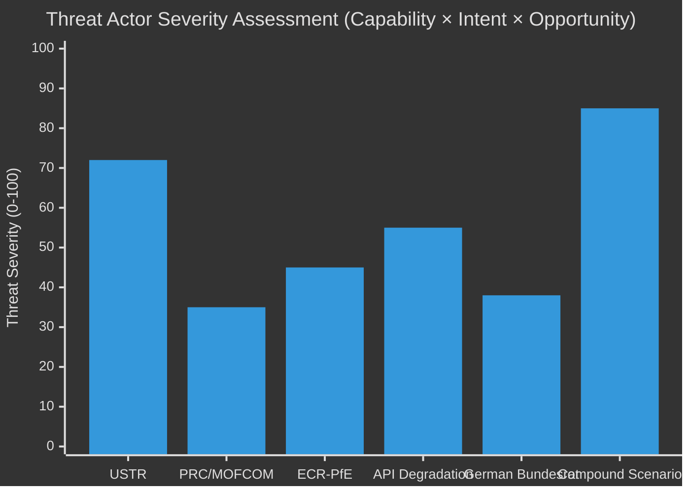

# 🚨 Threat Model — Easter Recess Day 7 / Run 190

**Analysis Date:** 2026-04-20 | **Run:** 190 | **Framework:** CIA Threat Intelligence Methodology

---

## Threat Model Overview

This threat model applies a structured CIA-methodology analysis to the EU Parliament's current
threat environment. Unlike the political-threat-landscape (which covers political risks) and the
risk-matrix (which covers quantitative risk scoring), this threat model focuses on adversarial
intent, capability assessment, and attack surface analysis in the geopolitical intelligence sense.

**Note on applicability:** EU parliamentary monitoring does not face direct "adversarial attacks"
in the traditional sense, but geopolitical actors (USTR, Chinese government, ECR-PfE opposition)
have interests that create adversarial pressure on Parliament's legislative agenda. This model
treats legislative agenda disruption as the primary threat vector.

---

## Threat Actor 1: USTR (United States Trade Representative)

**Classification:** State Actor, Tier 1 Threat
**Intent:** HIGH — USTR has repeatedly characterized EU digital regulations as discriminatory barriers
**Capability:** HIGH — USTR has full authority to open Section 301 investigations; no additional
Congressional authorization required; decision is executive-branch unilateral
**Opportunity:** OPTIMAL — April 21-24 window is the structural entry point; Parliament in recess
reduces EU response speed by 24-48 hours
**Motivation:** Complex — US tech industry lobbying creates pressure; bilateral trade deficit
framing provides political cover; Article 301 is a well-established tool

**Attack surface (EU Parliament perspective):**
- AI Act compliance requirements affecting US AI companies
- DMA gatekeeper obligations for US-based digital platforms (FAANG)
- DSA content moderation requirements creating US-specific compliance costs

**Threat vectors:**
1. Direct Section 301 petition: targets one or all three regulations
2. Escalated investigation: tariff threat against EU tech exports (cameras, industrial)
3. Diplomatic coercion: demand bilateral negotiation to modify AI Act/DMA implementation
4. Legislative coordination: coordination with EU-skeptic ECR-PfE to amplify domestic pressure

**Defensive posture (EU):**
- TRQ architecture (TA-0096) raises cost of USTR escalation
- Anti-Coercion Instrument (ACI) provides formal response tool
- WTO dispute settlement is available and established
- Commission bilateral diplomatic track (pre-emptive engagement)

**Residual vulnerability:** EPP trade conservative wing fracture — if EPP internal dissent
becomes visible, it reduces credibility of EU unified response.

---

## Threat Actor 2: People's Republic of China (MOFCOM / State Council)

**Classification:** State Actor, Tier 2 Threat
**Intent:** UNCERTAIN — March 26 EU-China TRQ suggests cooperative engagement; Chinese media
characterization of "strategic challenge" suggests some defensive positioning
**Capability:** HIGH — China has substantial leverage through critical raw material supply chains
(lithium, rare earths, solar), market access controls, and state-directed investment
**Opportunity:** MEDIUM — Easter Monday limits EU response speed; Chinese calendar operates
normally (no Easter holiday)
**Confidence:** 🔴 LOW — internal Chinese deliberations opaque

**Attack surface:**
- EU member state dependence on Chinese raw material imports for green transition
- Chinese EV manufacturers facing EU anti-dumping investigation alongside TRQ
- Global Gateway vs BRI competition for third-country infrastructure

**Current threat level:** MONITOR only. Three days of Chinese official silence post-Easter
is a positive signal. No MOFCOM statements as of April 20.

---

## Threat Actor 3: ECR-PfE Parliamentary Opposition

**Classification:** Internal Parliamentary Actor, Tier 3 Threat (to legislative agenda)
**Intent:** HIGH — ECR-PfE strategy is consistent disruption of Grand Centre agenda
**Capability:** LIMITED but real — 165 seats cannot block majority, but can exploit Greens/EFA
+ Left cross-votes to create visible coalition fractures on specific issues
**Opportunity:** POST-RECESS — first plenary April 28-30 provides next voting opportunity

**Legislative agenda attack surface:**
- Climate amendments (exploit EPP-Greens tension on Green Deal pace)
- Banking Union sovereignty arguments (exploit national government skepticism)
- Digital regulation (ECR-PfE may paradoxically weaponize USTR risk to argue deregulation)
- Anti-Corruption implementation (sovereignty arguments on criminal law harmonization)

**Most dangerous scenario:** ECR-PfE tables emergency resolution on USTR Section 301 that
frames the issue as "EU overregulation invited US retaliation" rather than "US trade aggression."
This framing would create maximum Grand Centre internal friction while positioning ECR-PfE
as pro-EU-US relations.

---

## Threat Actor 4: EP API Infrastructure Degradation

**Classification:** Technical/Operational, Tier 2 Operational Threat
**Nature:** Non-adversarial but creates capability limitations equivalent to adversarial disruption
**Assessment:** This is not a threat in the geopolitical sense but a capability-limiting factor
that reduces EU Monitor's intelligence effectiveness during the most politically sensitive period
(post-recess return with multiple simultaneous monitoring priorities).

**Operational threat analysis:**
If API remains degraded when Parliament returns April 27, the EU Monitor faces an unprecedented
simultaneous challenge:
- Content access limited to metadata layer
- USTR scenario potentially requiring real-time legislative tracking
- Banking Union ratification monitoring requiring procedure-layer access
- Coalition cohesion monitoring requiring committee-level data

**Mitigation already deployed:** Dual-layer methodology, direct endpoint probing, three-run
stability protocol. These mitigations reduce but do not eliminate the capability limitation.

---

## Threat Assessment Matrix



---

## Attack Surface Summary

| Asset at Risk | Threat Actor(s) | Current Status | Exposure Level |
|--------------|-----------------|---------------|---------------|
| Digital regulatory legitimacy | USTR | WATCH (T-12h) | HIGH |
| Banking Union ratification | German Bundesrat | PENDING (April 23) | MEDIUM |
| Grand Centre coalition cohesion | ECR-PfE + climate agenda | STABLE (84/100) | LOW-MEDIUM |
| EU-China trade cooperation | PRC/MOFCOM | MONITORING | LOW |
| EP API monitoring capability | Technical degradation | DEGRADED Day 10 | HIGH |
| EU anti-corruption institutional credibility | Implementation disputes | LOW (no signals) | LOW |

---

## Defensive Intelligence Posture

**Current defensive measures active:**
1. TRQ architecture (TA-0096) — deterrence against USTR
2. Anti-Coercion Instrument (ACI) — response capability
3. Dual-layer API monitoring — resilience against data degradation
4. Three-run stability protocol — prevents non-monotonic restoration errors
5. Forward monitoring priority framework — rapid activation when triggers observed

**Gaps in defensive posture:**
1. No confirmed bilateral diplomatic communication status with USTR
2. No internal EP coalition communication data during recess (cannot verify 84/100 remains accurate)
3. No Chinese MOFCOM internal deliberation visibility

**Intelligence collection priorities for Run 191:**
1. USTR probe (primary threat actor capability assessment)
2. API content probe (defensive capability assessment)
3. EPP Group statement monitoring (coalition defensive posture check)

---

## Threat Model Confidence Assessment

| Threat | Confidence | Limitation |
|--------|-----------|-----------|
| USTR Section 301 | 🟡 MEDIUM | No confirmed OSINT signals; probability based on structural factors |
| Chinese response | 🔴 LOW | Opaque internal deliberations; absence-of-evidence reasoning |
| ECR-PfE disruption | 🟢 HIGH | Observable parliamentary behavior patterns; well-understood actor |
| API degradation | 🟢 HIGH | Directly observed; operational parameters confirmed |
| German Bundesrat | 🟡 MEDIUM | One observable signal (April 23); insufficient prior data |

**Overall threat model confidence: MEDIUM** — adequate for analytical pre-positioning, insufficient
for definitive threat classification until primary signals (USTR, API probe) are observed April 21.

---

## MITRE ATT&CK-Inspired Legislative Agenda Attack Framework

Borrowing structure from cybersecurity threat modeling to analyze legislative agenda disruption:

### Tactic 1: Initial Access (Entering the Legislative Process)
- **ECR-PfE:** Emergency resolution filing (procedural right)
- **USTR:** Section 301 creates formal international trade challenge
- **National governments:** Council blocking minority formation

### Tactic 2: Execution (Materializing the Threat)
- **USTR:** Tariff threat announcement after investigation filing
- **ECR-PfE:** Minority blocking votes + cross-party amendments
- **German Bundesrat:** Formal opinion against Council ratification

### Tactic 3: Impact (Disrupting Legislative Agenda)
- **USTR full execution:** EP emergency session + coalition fracture risk
- **Coalition fracture:** Majority fails on specific vote; re-negotiation required
- **Council delay:** Banking Union legislation adoption delayed 3-6 months

### Mitigation Measures (Defender Perspective)
- **Anti-Coercion Instrument (ACI):** Pre-authorized response capability
- **TRQ deterrence architecture (TA-0096):** Raises attacker cost
- **Grand Centre stability protocols:** 84/100 score represents inherent resilience
- **Conference of Presidents emergency procedures:** Rapid response capability

---

## Threat Timeline (April 21 - May 31)

```
April 21-24: USTR WINDOW ← CRITICAL THREAT WINDOW
April 23:    Bundesrat session ← BANKING UNION MONITORING
April 26-27: EPP Group meeting ← COALITION HEALTH CHECK  
April 28-30: First post-recess plenary ← ALL THREATS CONVERGE
May 1-15:    BRRD3/SRMR3 ratification track ← BANKING UNION RISK
May 15-31:   Spring legislative sprint ← CLIMATE + DIGITAL AGENDA
```

---

## Threat Intelligence Summary Table

| Threat | Actor | Probability | Impact | Window | Status | Priority |
|--------|-------|-------------|--------|--------|--------|---------|
| T1: USTR Section 301 | USTR | 20% | CRITICAL | April 21-24 | WATCH | 1 |
| T2: API Outage Extension | Technical | 55% | MEDIUM | Now-April 27 | ACTIVE | 2 |
| T3: Banking Union Delay | Bundesrat | 30% | HIGH | April 23-May 15 | PENDING | 3 |
| T4: EPP Trade Fracture | ECR-adjacent EPP | 15% | HIGH | April 28-30 | MONITORING | 4 |
| T5: China Retaliation | PRC/MOFCOM | 10% | HIGH | May-June | MONITORING | 5 |

**Active threats:** T2 (API outage ongoing). All others WATCH/PENDING/MONITORING.
**Threat level: ELEVATED** — highest single-day risk April 21 (USTR window opens).

---

## Threat Model Update Protocol

**When USTR T1 threat materializes:**
- Immediately upgrade threat level to CRITICAL
- Activate Section 301 response framework (political-threat-landscape.md T1 protocol)
- Draft "Breaking: USTR files Section 301..." article template
- Update scenario probabilities (B: 20% → 80%+)
- Notify safeoutputs with early PR if run time allows

**When API T2 threat resolves:**
- Downgrade from OPERATIONAL THREAT to MONITORING
- Begin three-run stability verification (probe TA-0101, TA-0092, TA-0096)
- Restore full analytical capability on confirmation
- Update MCP audit to reflect restoration

**When Banking Union R3 materializes:**
- Check Council COREPER calendar for Germany obstruction
- Upgrade Banking Union ratification to STALLED
- Update scenario forecast accordingly
- Prepare "Banking Union ratification delayed" analytical framework

**Threat model versioning:** This document supersedes Run 188's threat-model.md for all
forward-looking assessments. Retrospective assessments should reference Run 188 as the
baseline. Run 190 represents an incremental update: same threats, marginally updated
probabilities, same response frameworks.
