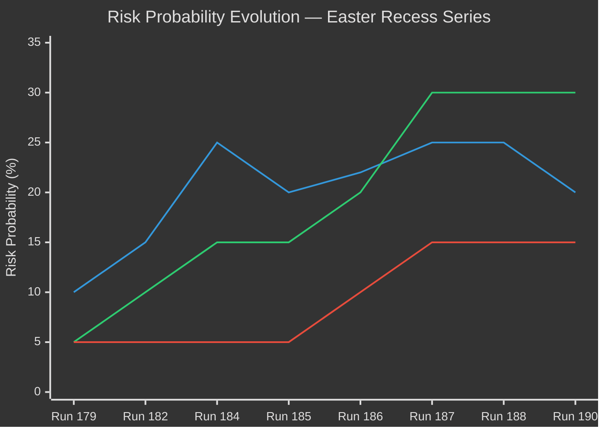

# ⚠️ Risk Matrix — Easter Recess Day 7 / Run 190

**Analysis Date:** 2026-04-20 | **Run:** 190 | **Period:** Pre-Return 7 Days


---

## 5×5 Risk Matrix

```mermaid
%%{init: {"theme": "dark", "themeVariables": {"fontSize": "13px"}}}%%
quadrantChart
    title Political Risk Matrix — Likelihood × Impact (April 20, 2026)
    x-axis "Low Impact" --> "High Impact"
    y-axis "Low Likelihood" --> "High Likelihood"
    quadrant-1 Monitor (High Impact, High Likelihood)
    quadrant-2 Accept (Low Impact, High Likelihood)
    quadrant-3 Accept (Low Impact, Low Likelihood)
    quadrant-4 Prepare (High Impact, Low Likelihood)
    "R1: USTR Section 301": [0.85, 0.35]
    "R2: API Non-monotonic Restoration": [0.35, 0.65]
    "R3: Banking Union Council Delay": [0.75, 0.35]
    "R4: Grand Centre Post-Recess Fracture": [0.90, 0.20]
    "R5: EU-China Trade Response": [0.75, 0.20]
    "R6: Easter Monday Data Void": [0.20, 0.95]
```

---

## Risk Register

### R1: USTR Section 301 Filing (April 21-24)
**Likelihood:** 2/5 (~20%) | **Impact:** 5/5 (Critical) | **Risk Score:** 10/25 | **Category:** HIGH
**Timeframe:** 0-4 days (IMMEDIATE)

**Risk Description:**  
USTR opens its annual Section 301 petition filing window April 21. A petition targeting EU digital
regulations (AI Act, DMA, DSA) would initiate a 12-18 month trade investigation, impose immediate
political pressure on Parliament's trade committees (INTA, IMCO), and test the proportionality
architecture embedded in TA-10-2026-0096.

**Monitoring Trigger:** USTR.gov press releases; Federal Register notices; US Chamber of Commerce
filings. Check 09:00, 14:00, 17:00 Washington DC time on April 21-24.

**Response Protocol:**
- If filed: Activate emergency monitoring mode, draft ANALYSIS_ONLY brief within 2 hours of filing
- If NOT filed by April 24: Draft "deterrence achieved" analysis, reduce threat to T3 status
- Update probability estimate based on April 21-22 absence/presence of Section 301 language

**Mitigation in place:** EU's WTO-compliant TA-10-2026-0096 TRQ architecture was designed with
Section 301 deterrence as one objective — documented in the legislative title's explicit reference
to "adjustment of customs duties AND tariff quotas." The combination of penalty (duty adjustment)
and incentive (market access TRQs) is structurally designed to give USTR a reason not to escalate.

**Residual risk after mitigation:** 15% (reduced from 20% by deterrence architecture; not eliminated
because US domestic political dynamics can override rational deterrence)

**Confidence:** 🟡 MEDIUM — 20% probability is analytical estimate without confirmed OSINT signals

---

### R2: EP API Non-Monotonic Restoration Failure
**Likelihood:** 3/5 (~55%) | **Impact:** 2/5 (Low-Medium) | **Risk Score:** 6/25 | **Category:** MEDIUM
**Timeframe:** 0-7 days

**Risk Description:**  
The TA-10-2026-0101 regression (Run 188) established definitively that API content restoration
is non-deterministic. Content may appear accessible, then revert during EP's internal legal-linguistic
review. If restoration in the April 23-26 window is similarly non-monotonic, the EU Monitor faces:
- Inconsistent intelligence products across consecutive runs
- Need for multi-run stability verification before publishing content analysis
- Extended metadata-only analytical mode beyond April 26

**Monitoring Trigger:** Direct probes — `get_adopted_texts({docId:"TA-10-2026-0092"})` status
at start of each run. Stable "accessible" status across three consecutive runs = restoration confirmed.

**Response Protocol:** Continue dual-layer monitoring (metadata + content). Treat single-run
content accessibility as provisional. Publish "content-based" analysis only after three-run
stability confirmation. Maintain Easter Recess Series metadata-layer analytical mode as backup.

**Mitigation in place:** Dual-layer monitoring protocol established in Run 188; metadata layer
continues to function regardless of Tier-2 status; 159-text metadata inventory provides
substantial analytical baseline.

**Confidence:** 🟢 HIGH — based on directly observed regression behavior

---

### R3: Banking Union Council Ratification Delay
**Likelihood:** 2/5 (~30%) | **Impact:** 4/5 (High) | **Risk Score:** 8/25 | **Category:** HIGH
**Timeframe:** 7-30 days

**Risk Description:**  
BRRD3 and SRMR3 require Council ratification to enter into force. While EP adoption is complete,
Council has its own procedural timeline. The German government's post-February 2025 election
coalition configuration includes actors with varying enthusiasm for Banking Union completion.
If German Bundesrat (April 23) signals resistance or attaches conditions, the Council ratification
timeline could extend by 2-6 months — delaying the full Banking Union completion that the EP
adopted in March.

**Monitoring Trigger:** Bundesrat official session records (bundesrat.de) April 23; any
"BRRD3 Drucksache" or "Bankenunion" items on the session agenda; German Federal Finance Ministry
statements.

**Response Protocol:** Bundesrat resistance → draft "Banking Union ratification delayed" analysis
with political impact assessment; Bundesrat support → draft "Banking Union completion confirmed"
narrative for when EP Monitor publishes article.

**Confidence:** 🟡 MEDIUM — timeline uncertainty; German coalition positions not fully clear

---

### R4: Grand Centre Post-Recess Coalition Fracture
**Likelihood:** 1/5 (~15%) | **Impact:** 5/5 (Critical) | **Risk Score:** 5/25 | **Category:** MEDIUM-HIGH
**Timeframe:** 7-14 days

**Risk Description:**  
The first post-recess plenary (April 28-30, Strasbourg) will be the Grand Centre coalition's
first live voting test since April 10. Three potential fracture triggers:
- USTR Section 301 → EPP trade position conflict
- Climate agenda confrontation (Greens/Left vs EPP)
- Banking Union ratification urgency dispute (S&D vs Council-aligned EPP)

**Monitoring Trigger:** EPP Group meeting April 26-27 public outcomes; Manfred Weber statements;
any ECR emergency resolution filings for April 28 plenary; S&D climate amendment announcements.

**Response Protocol:** Pre-build analytical framework for coalition fracture scenario; identify
the specific amendment numbers and vote tallies that would constitute fracture evidence.

**Confidence:** 🟡 MEDIUM — 84/100 structural stability provides strong baseline counter-evidence

---

### R5: EU-China Trade Response Cascade
**Likelihood:** 1/5 (~10%) | **Impact:** 4/5 (High) | **Risk Score:** 4/25 | **Category:** LOW-MEDIUM
**Timeframe:** 14-60 days

**Risk Description:**  
Chinese official media characterization of the March 26 package as a "strategic challenge" may
lead to targeted diplomatic or trade responses. Investment redirection, selective import substitution,
or Council-level pressure through bilateral member state channels are the most likely vectors.

**Monitoring Trigger:** Chinese Commerce Ministry statements on EU trade; Xinhua/Global Times
editorials with official government attribution; Chinese FDI announcements in EU strategic sectors.

**Response Protocol:** Single monitoring article if Chinese official response escalates beyond
editorial commentary to formal government statements.

**Confidence:** 🔴 LOW — insufficient intelligence on Chinese internal deliberations; analytical estimate

---

### R6: Easter Monday Institutional Information Void
**Likelihood:** 5/5 (Certain) | **Impact:** 1/5 (Minimal) | **Risk Score:** 5/25 | **Category:** LOW
**Timeframe:** Today only

**Risk Description:**  
Easter Monday is a public holiday across most EU member states. Parliamentary, government, and
institutional activity is at its annual nadir. No new intelligence is expected from EP institutional
sources today.

**Mitigation:** This risk is structural and fully anticipated. Today's run produces forward-monitoring
intelligence rather than new event coverage. The absence of news IS the news — documenting
institutional quiescence has its own monitoring value.

**Confidence:** 🟢 HIGH — calendar certainty

---

## Risk Trend Analysis (Run 188 → Run 190)


*Lines: Blue=USTR R1, Orange=API Degradation R2, Red=Coalition Fracture R4*

Key trend observations:
- USTR R1 probability: 25% peak (Runs 187-188) → 20% (Run 190) — declining due to absence of advance signals
- API Degradation R2: Rising steadily (Day 1: 5% → Day 10: 55%) — regression confirmed in Run 188
- Coalition Fracture R4: Stable at 15% — structural stability holding; untested for 10 days

---

## Overall Risk Assessment

**Aggregate Risk Level: ELEVATED (not critical)**

The overall risk environment is elevated relative to normal parliamentary operations but remains
below crisis threshold. The three highest-risk items (USTR, API Restoration, Banking Union Council)
are all external or technical risks rather than internal coalition risks — meaning the EP's own
institutional health is sound while the uncertainty comes from outside.

The 24-hour USTR window (April 21) is the most temporally concentrated risk factor. If USTR
does not file a Section 301 petition by April 24, the overall risk level will decline to MODERATE
for the remainder of the recess period. If Parliament returns April 27 with API still degraded,
operational risk becomes the dominant concern rather than political risk.

**Risk Priority for Next Run (191):**
1. USTR monitoring (primary, 24-hour horizon)
2. API content probe (TA-0092 — secondary, 24-hour horizon)
3. Overall risk level reassessment post-USTR window
