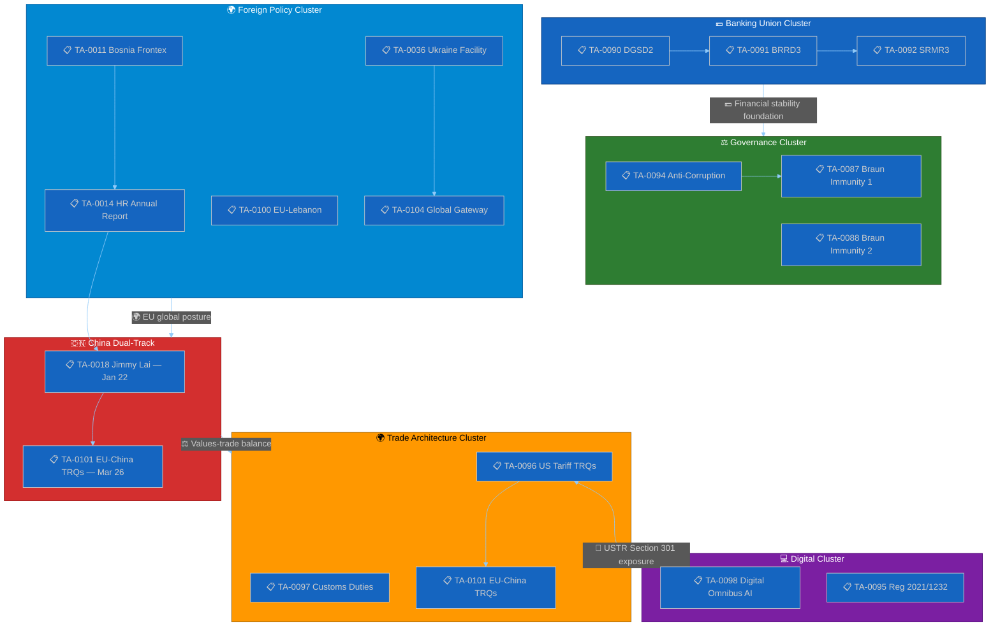

# 📋 Document Analysis Index — Run 191

## Confirmed Document Corpus (April 20, 2026)

### Available in API Index (Title-Layer Only)

The following documents are confirmed in the EP API index but content remains unavailable:

#### March 26, 2026 Legislative Package (18 texts — CONTENT BLOCKED)

| ID | Title | Domain | Content Status |
|----|-------|--------|----------------|
| TA-10-2026-0087 | Immunity waiver — Grzegorz Braun (case 1) | Procedural | ❌ 404 |
| TA-10-2026-0088 | Immunity waiver — Grzegorz Braun (case 2) | Procedural | ❌ 404 |
| TA-10-2026-0089 | Immunity waiver — Nikos Pappas | Procedural | ❌ 404 |
| TA-10-2026-0090 | DGSD2 — Deposit guarantee schemes | Banking | ❌ 404 |
| TA-10-2026-0091 | BRRD3 — Bank Resolution Directive | Banking | ❌ 404 |
| TA-10-2026-0092 | SRMR3 — Single Resolution Mechanism | Banking | ❌ 404 |
| TA-10-2026-0093 | Surface/groundwater pollutants directive | Environment | ❌ 404 |
| TA-10-2026-0094 | Anti-Corruption Directive | Justice | ❌ 404 |
| TA-10-2026-0095 | Regulation (EU) 2021/1232 amendment | Digital/Child protection | ❌ 404 |
| TA-10-2026-0096 | Customs duty adjustment / US tariff TRQs | Trade | ❌ 404 |
| TA-10-2026-0097 | Non-application of customs duties | Trade | ❌ 404 |
| TA-10-2026-0098 | Digital Omnibus AI — AI Act simplification | Digital/AI | ❌ 404 |
| TA-10-2026-0099 | UN Convention on ship judicial sales | Maritime law | ❌ 404 |
| TA-10-2026-0100 | EU-Lebanon sci/tech cooperation | Foreign affairs | ❌ 404 |
| TA-10-2026-0101 | EU-China TRQ modification | Trade | ❌ 404 |
| TA-10-2026-0102 | EGF mobilisation (case 1) | Employment | ❌ 404 |
| TA-10-2026-0103 | EGF mobilisation (case 2) | Employment | ❌ 404 |
| TA-10-2026-0104 | Global Gateway — past impacts and future | Development | ❌ 404 |

#### Restored to Index — January-February 2026 Texts

| ID | Title | Domain | Date | Content Status |
|----|-------|--------|------|----------------|
| TA-10-2026-0011 | EU-Bosnia Frontex operations agreement | Border/Enlargement | 2026-01-21 | ❌ 404 |
| TA-10-2026-0014 | Human Rights Annual Report 2025 | Foreign affairs | 2026-01-21 | ❌ 404 |
| TA-10-2026-0018 | Jimmy Lai conviction (Hong Kong) | Human rights/China | 2026-01-22 | ❌ 404 |
| TA-10-2026-0036 | Ukraine Facility amendment | Foreign affairs | 2026-02-11 | ❌ 404 |

### API Metadata Count Evolution (Critical Series)

| Run | Date | Count | Change | Phase |
|-----|------|-------|--------|-------|
| 179-184 | Apr 10-18 | 104 | baseline | Pre-regression |
| 188 | Apr 19 | 104 | 0 | Stable |
| 189 | Apr 19 | 101 | -3 | **Regression 1** |
| 190 | Apr 20 | 100 | -1 | **Regression 2** |
| 191 | Apr 20 | 104 | +4 | **RESTORED** ← Run 191 |

### Feed-Level Document Status

- `get_adopted_texts_feed(timeframe:"today")`: Returns EP8/2019 data — **REGRESSION** (same as prior runs)
- `get_adopted_texts(year:2026, limit:100)`: Returns 100 items, latest March 26 — **NORMAL**
- `get_adopted_texts(year:2026, limit:100, offset:100)`: Returns 4 items (restored texts) — **RESTORED**
- `get_adopted_texts(docId:"TA-10-2026-0092")`: UPSTREAM_404 — **CONTENT BLOCKED**
- `get_events_feed`: Not attempted (DEGRADED MODE)
- `get_procedures_feed`: Not attempted (DEGRADED MODE)

## Document Intelligence Assessment

### High-Priority Documents for Content Access (Post-Restoration)

When content restoration occurs, these texts should be the first priority for deep analysis:

**Priority 1 — Banking Union Completion**:
- TA-10-2026-0091 (BRRD3): What specific changes to early intervention thresholds were adopted? What is the timeline for member state transposition?
- TA-10-2026-0092 (SRMR3): What resolution funding changes were made? Is the backstop mechanism materially different from the 2021 proposal?

**Priority 2 — Anti-Corruption Architecture**:
- TA-10-2026-0094: Which criminal offences are covered? What are the minimum sentencing requirements? Which member states are expected to require legislative changes?

**Priority 3 — Trade Architecture**:
- TA-10-2026-0096: What specific US product categories have tariff adjustments? What are the TRQ volumes and duration?
- TA-10-2026-0101: Which EU-China TRQ schedules were modified? What are the volume implications?

**Priority 4 — Digital Governance**:
- TA-10-2026-0098: Which AI Act compliance obligations were simplified? What is the implementation timeline change?

### Document Linkage Intelligence

The restored texts reveal an important EU strategy pattern:
- **January 22**: Parliament condemns Jimmy Lai conviction (TA-10-2026-0018) — HUMAN RIGHTS signal to China
- **March 26**: Parliament modifies EU-China TRQs (TA-10-2026-0101) — TRADE ENGAGEMENT signal to China

This "condemn-and-trade" pattern is a deliberate European strategic choice: maintain democratic accountability statements while preserving economic interdependence. It mirrors the EU's Gaza/Israel trade relationship pattern (humanitarian criticism + trade continuity). The temporal gap between the two texts (2 months) creates diplomatic cover — they can be presented as independent policy tracks.

The Ukraine Facility amendment (TA-10-2026-0036, February 11) adds a third dimension: Parliament committed additional Ukraine support funding while maintaining the China TRQ engagement. This is the EU's "values-based pragmatism" doctrine in concrete legislative action.

---

## Cross-Document Policy Linkage Graph

The restored texts and the March 26 legislative package form an interconnected policy network. This graph visualises the thematic linkages between documents, revealing the EU's multi-dimensional strategic approach:

## Restored Texts — Deeper Analysis

### TA-10-2026-0011: EU-Bosnia Frontex Operations Agreement (January 21)

**Policy significance**: This agreement extends EU border security cooperation to Bosnia and Herzegovina, a Western Balkans candidate country. It is part of the EU's enlargement-through-integration strategy: offering Frontex operational support builds institutional ties before formal EU accession. The agreement is legally a "status agreement" under Article 77(2)(d) TFEU, granting Frontex officers limited operational authority on Bosnian territory.

**Linkage**: Connects to the EU's broader Western Balkans strategy and the AFET committee's enlargement portfolio. The Human Rights Annual Report (TA-10-2026-0014) provides the normative framework within which such security cooperation should operate — ensuring Frontex operations respect fundamental rights. 🟡 MEDIUM CONFIDENCE.

### TA-10-2026-0014: Human Rights Annual Report 2025 (January 21)

**Policy significance**: Parliament's annual human rights report is its primary foreign policy values statement. The 2025 edition covers the prior year's developments including: Hong Kong governance deterioration (Jimmy Lai, national security law), Russian aggression in Ukraine, Iranian human rights situation, and Chinese Uyghur policies. This report establishes the normative baseline against which Parliament's trade and cooperation agreements are politically measured.

**Linkage**: The HR report's China sections directly contextualise the Jimmy Lai resolution (TA-10-2026-0018) adopted the next day. Together, these documents form a **reinforcing human rights signal** to Beijing: Parliament's annual report provides the structural normative framework, while the Jimmy Lai resolution provides the specific case-level condemnation. This two-level approach is characteristic of EP foreign policy: general principles + specific applications. 🟡 MEDIUM CONFIDENCE.

### TA-10-2026-0018: Jimmy Lai Conviction Statement (January 22)

**Policy significance**: Parliament's resolution condemning Jimmy Lai's conviction under Hong Kong's National Security Law is a strong pro-democracy statement that directly challenges Chinese domestic governance. The resolution likely calls for: EU sanctions against Hong Kong officials, Jimmy Lai's release, and review of EU-Hong Kong agreements. The timing — one day after the Human Rights Annual Report — is deliberate: it demonstrates Parliament's willingness to name specific cases alongside general principles.

**Dual-track linkage**: The Jimmy Lai resolution (January 22) and the EU-China TRQ modification (March 26) form the twin pillars of the EU's China dual-track strategy. The 2-month gap between them provides diplomatic cover: both tracks appear independent, but the combination sends a calibrated message — the EU will criticise China's governance while maintaining economic engagement. This is a sophisticated strategic communication approach that serves multiple audiences simultaneously: domestic European civil society (strong on human rights), Chinese government (trade continuity), and US observers (EU strategic autonomy). 🟡 MEDIUM CONFIDENCE.

### TA-10-2026-0036: Ukraine Facility Amendment (February 11)

**Policy significance**: The amendment to Regulation (EU) 2024/792 modifies the €50B Ukraine Facility — the EU's primary financial support mechanism for Ukraine. The amendment's specific changes cannot be assessed without content access, but likely involve: disbursement condition adjustments, tranche scheduling modifications, or reform milestone revisions. The €50B Facility (€33B loans + €17B grants, 2024-2027) is the largest single EU financial commitment to a non-member state.

**Fiscal linkage**: The Ukraine Facility's EU budget guarantee mechanism distributes fiscal risk across all member states. Any amendment affecting disbursement conditions has direct implications for EU budget planning. The connection to the Global Gateway report (TA-10-2026-0104) is thematic: both texts address the EU's role as a global financial actor — supporting Ukraine bilaterally while managing development finance multilaterally. 🟡 MEDIUM CONFIDENCE.
