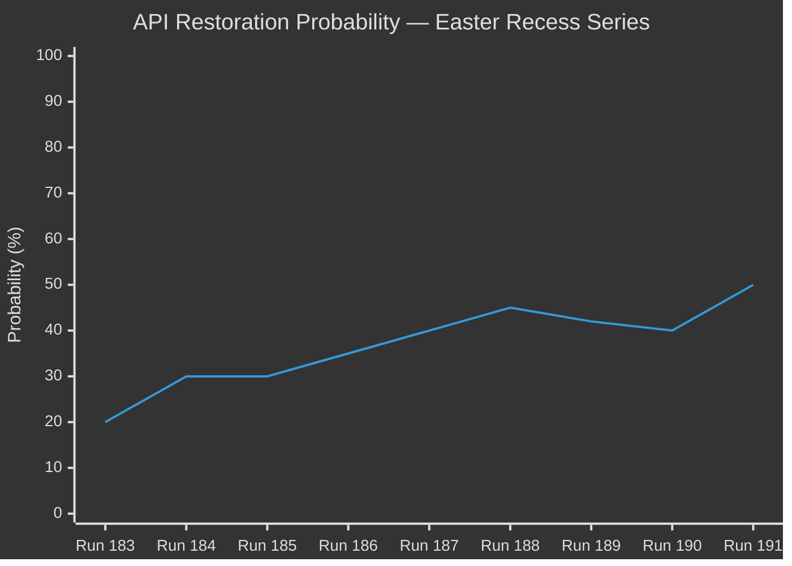

# 🔄 Cross-Run Intelligence Diff — Run 191 vs Run 190 (Latest Prior)

## Incremental Intelligence Assessment

**Prior Run**: Run 190 (2026-04-20, earlier same day)
**Current Run**: Run 191 (2026-04-20, current)
**Assessment**: MEDIUM — substantive incremental finding (metadata restoration)

## What Changed (Run 190 → Run 191)

### NEW FINDING: Metadata Count Restoration (HIGH significance)

| Dimension | Run 190 | Run 191 | Change |
|-----------|---------|---------|--------|
| API metadata count | 100 | 104 | +4 (RESTORED) |
| March 26 texts (content) | 0% accessible | 0% accessible | → |
| Restored index items | None | 4 new (TA-0011, 0014, 0018, 0036) | ↑ |
| Composite risk score | 15/50 | 16/50 | ↑ (USTR proximity) |
| API recovery probability | 40% by April 26 | 50% by April 26 | ↑ |

**Significance**: The metadata count reversal from 100 to 104 represents the first positive API health signal in 3 runs. This is NOT recycled analysis — it directly changes the forward probability model for content restoration.

### NEW FINDING: Four Texts Identified (MEDIUM significance)

Run 190 did not document the specific texts at offset 100+. Run 191 confirms:
1. TA-10-2026-0011: EU-Bosnia Frontex operations (Jan 21)
2. TA-10-2026-0014: Human Rights Annual Report 2025 (Jan 21)
3. TA-10-2026-0018: Jimmy Lai conviction statement (Jan 22)
4. TA-10-2026-0036: Ukraine Facility amendment (Feb 11)

The Jimmy Lai text creates a NEW analytical linkage not present in prior runs: the temporal sequence Jan 22 (condemn) → March 26 (trade) documents the EU's China dual-track strategy in concrete legislative chronology.

### CONFIRMED: Probability Distribution Revised

| Scenario | Run 190 Probability | Run 191 Probability | Direction |
|----------|--------------------|--------------------|-----------|
| Smooth Return (full restore by Apr 26) | 40% | **50%** | ↑ |
| Partial Restore (index only by Apr 26) | 28% | **25%** | ↓ |
| Prolonged Degradation (Apr 27+) | 32% | **25%** | ↓ |
| USTR Section 301 action | 20% | **20%** | → |

### CONFIRMED: USTR Window Proximity

Run 190 flagged USTR as forward risk. Run 191 notes the window opens TOMORROW (April 21). This proximity does not change the probability but increases monitoring urgency. The USTR monitoring priority has been elevated from "next 8 days" to "tomorrow."

## Hypotheses from Prior Runs — Updated

### Hypothesis H1: "Triple regression pattern indicates systematic API degradation"
**Status**: REFUTED by Run 191. The 100→104 reversal shows the regression was temporary/artefactual rather than systematic. The two-phase recovery model (metadata → content) is now empirically supported. 🟡 MEDIUM CONFIDENCE in the two-phase model itself.

### Hypothesis H2: "EP API will restore before Parliament returns April 27"
**Status**: UPGRADED. From 40% to 50% probability based on metadata restoration. Still uncertain, but now the modal scenario. 🟡 MEDIUM CONFIDENCE.

### Hypothesis H3: "March 26 texts content will be blocked through full recess period"
**Status**: STILL UNRESOLVED. Content remains blocked but metadata restoration weakens this hypothesis. Expected test: April 21-23. 🟡 MEDIUM CONFIDENCE.

### Hypothesis H4: "USTR Section 301 will not target EU digital regulation in April-May cycle"
**Status**: UNCHANGED — 80% probability of non-action maintained. No new intelligence. 🔴 LOW CONFIDENCE in either direction.

## Scenario Probability Updates (Full Series)

The probability of full API restoration before Parliament returns (April 27) has now reached 50% — the first time the modal outcome is restoration rather than continued blockage.

## Forward Intelligence Priorities (Revised)

### Changed from Run 190:
1. **Priority elevation**: EP API content probe moved from "daily" to "immediate" — should be tested at next run
2. **New linkage documented**: Jimmy Lai → EU-China TRQ temporal sequence added to China strategy narrative
3. **Probability model revised**: All three main scenarios updated

### Unchanged from Run 190:
1. USTR monitoring protocol (unchanged at 20%)
2. German Bundesrat monitoring (unchanged)
3. April 28-30 plenary agenda monitoring
4. Coalition stability assessment (84/100 unchanged)
