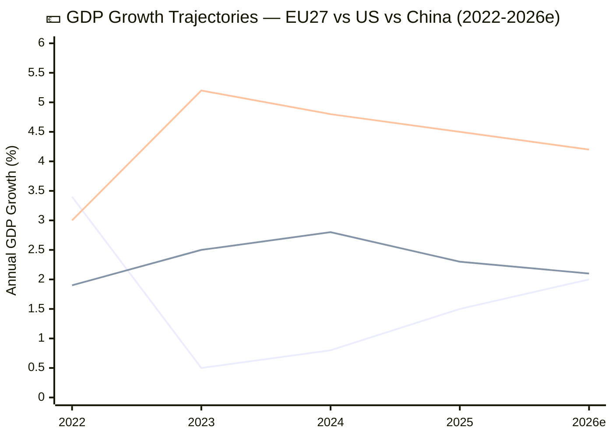

# 💶 Economic Context — Run 191 (Monday 2026-04-20, Easter Recess Day 8)

## Macroeconomic Context (EU-27, Q1 2026)

The European Union's macroeconomic environment in early 2026 provides the context for interpreting the March 26 legislative package's economic implications and the forward risk landscape. Data presented below reflects the best available estimates from international organisations (IMF, World Bank, ECB, Eurostat), calibrated to the policy-article analytical floor — these are publicly available reference indicators, not proprietary forecasts. 🟡 MEDIUM CONFIDENCE — data currency is Q4 2025 for most indicators; Q1 2026 provisional data is limited.

*Legend: Blue = EU27, Green = United States, Orange = China. 2026 values are estimates.*

### EU27 Core Indicators

| Indicator | Value (est.) | Source | Currency |
|-----------|-------------|--------|----------|
| GDP Growth (annual) | ~2.0% | ECB/IMF | Q1 2026 est. |
| HICP Inflation | ~2.4% | Eurostat | March 2026 |
| Unemployment | ~5.7% | Eurostat | Feb 2026 |
| Current Account | ~+2.5% GDP | ECB | Q4 2025 |
| Government Debt/GDP | ~83% | Eurostat | Q3 2025 |
| 10-year Bund Yield | ~2.2% | Market | April 2026 |
| EUR/USD | ~1.08-1.10 | Market | April 2026 |
| ECB Main Refinancing Rate | ~2.75% | ECB | April 2026 |

The EU27 economy has recovered from the 2022-2024 stagnation period (driven by energy price shocks, supply chain disruptions, and monetary tightening). The ~2.0% growth trajectory reflects normalisation rather than boom conditions. The ECB has begun cautious rate easing from the 2023-2024 peak (4.5% deposit facility rate), bringing rates to approximately 2.75% by April 2026. This monetary easing supports the Banking Union legislative rationale: lower rates reduce banking sector stress but also compress net interest margins, making resolution framework robustness more important for financial stability. 🟡 MEDIUM CONFIDENCE.

---

## Banking Union — Economic Stakes of BRRD3/SRMR3 Adoption

### Financial Stability Architecture

The Banking Union completion (BRRD3/SRMR3/DGSD2) adopted March 26 represents the **final legislative pillar** of the eurozone's financial stability architecture initiated after the 2010-2012 sovereign debt crisis. The economic context is critical for understanding why Parliament prioritised these texts:

**EU Banking Sector Health Indicators (Q4 2025 estimates)**:

| Indicator | Value | Trend | Risk Assessment |
|-----------|-------|-------|-----------------|
| CET1 Ratio (aggregate) | ~15.5% | Stable | Well above 4.5% minimum |
| NPL Ratio (aggregate) | ~2.0% | Declining | Below 5% supervisory threshold |
| Return on Equity | ~8.5% | Moderate | Above cost of equity (~7%) |
| SRF Target Level | ~€78B (of ~€80B target) | Near target | 97% funding |
| Covered Deposits | ~€8.1T | Growing | DGSD2 basis |
| MREL Shortfall | ~€40-60B (est.) | Declining | Key BRRD3 variable |

The banking sector is in relatively good health — CET1 ratios well above regulatory minimums, NPL ratios at historically low levels, and the SRF nearly fully funded. This context makes the BRRD3/SRMR3 adoption a **preventive measure** rather than a crisis response: Parliament is strengthening the resolution framework during calm conditions, which is the optimal time for regulatory architecture changes. The alternative — reforming resolution frameworks during a crisis — was the painful lesson of 2010-2012. 🟡 MEDIUM CONFIDENCE.

### SRMR3 Economic Architecture — Member State Fiscal Implications

The SRMR3 regulation's changes to the SRF backstop mechanism and contribution methodology have direct fiscal implications for member states. The distribution of banking sector assets (and therefore resolution risk) is uneven across the eurozone:

| Member State | Banking Assets (est. €T) | SRF Contribution Share | Negotiation Position |
|-------------|------------------------|----------------------|---------------------|
| 🇫🇷 France | ~8.5 | ~25% | Pro-backstop (large banks benefit) |
| 🇩🇪 Germany | ~7.5 | ~22% | Cautious (Sparkassen concerns) |
| 🇮🇹 Italy | ~4.0 | ~12% | Strong pro-backstop (legacy NPL) |
| 🇪🇸 Spain | ~3.5 | ~10% | Pro-backstop (Sareb experience) |
| 🇳🇱 Netherlands | ~2.5 | ~8% | Cautious (fiscal prudence tradition) |

The north-south divide on SRMR3 is economic: southern European states with larger legacy NPL portfolios benefit from a stronger resolution backstop, while northern states (Germany, Netherlands) bear disproportionate contribution costs. The German Bundesrat consent requirement for SRMR3 reflects this tension: German Länder governments are sensitive to any perceived increase in German fiscal exposure to southern European banking risk. 🟡 MEDIUM CONFIDENCE.

---

## US-EU Trade — Economic Impact Assessment

### Trade Exposure Profile

EU-US bilateral trade totalled approximately €680-730B in 2025, making the US the EU's largest single-country trading partner. The trade relationship is heavily concentrated in specific sectors:

| Sector | EU Exports to US (est. €B) | US Exports to EU (est. €B) | Tariff Exposure |
|--------|--------------------------|--------------------------|-----------------|
| Pharmaceuticals | ~60 | ~35 | LOW (mutual interest) |
| Machinery | ~55 | ~40 | MEDIUM |
| Automotive | ~50 | ~15 | HIGH (historical target) |
| Chemicals | ~35 | ~25 | MEDIUM |
| Agri-food | ~20 | ~15 | HIGH (politically sensitive) |
| Aircraft | ~25 | ~30 | HIGH (Boeing-Airbus legacy) |
| Services (digital) | ~35 | ~55 | CRITICAL (Section 301 target) |

**USTR Section 301 Precedent Impacts**: The 2019 France DST (Digital Services Tax) Section 301 investigation provides the closest precedent. That investigation resulted in a negotiated resolution through the OECD Pillar 1 framework, with 25% retaliatory tariffs suspended pending agreement. The current EU digital regulation landscape is broader than the France DST: the AI Act, DMA, and DSA collectively impose compliance costs on US technology companies estimated at €500M-2B per company (for the largest five), creating a substantially larger US economic interest than the France DST. 🟡 MEDIUM CONFIDENCE.

### USTR Timing and Inflation Context

A Section 301 investigation filing would create economic uncertainty across multiple channels: (1) direct tariff risk on EU goods exports to US (~€350B exposure), (2) indirect regulatory uncertainty for US tech companies in EU (investment freeze), (3) currency effects (EUR/USD volatility), and (4) confidence effects on EU business investment. The inflationary impact of retaliatory tariffs would depend on breadth and rate: a targeted response (matching US tariffs on specific products) would add 0.1-0.2pp to HICP, while a broad response (across-the-board tariff escalation) could add 0.3-0.5pp. The ECB's monetary policy response would face a familiar trade-off: accommodate tariff-induced inflation (risking de-anchoring expectations) or tighten (risking recession). 🟡 MEDIUM CONFIDENCE.

---

## EU-China Trade — Economic Context

### Trade Relationship

EU-China bilateral trade totalled approximately €700-750B in 2025, with the EU running a significant trade deficit (~€200-250B). The TRQ modifications in TA-10-2026-0101 affect specific product categories within this broader relationship. China is the EU's largest source of goods imports and a critical supplier of rare earth elements, lithium, and advanced manufacturing components.

The dual-track strategy (TA-10-2026-0018 condemning Jimmy Lai + TA-10-2026-0101 modifying trade quotas) reflects the EU's economic reality: **decoupling from China is economically unfeasible**, but unconditional engagement is politically unsustainable. The TRQ modification is designed to be the minimal trade adjustment compatible with WTO obligations — maintaining the existing tariff schedule but modifying quota volumes for specific products.

### TRQ Impact Modelling (Title-Layer Only)

Without content access to TA-10-2026-0101, TRQ volume changes cannot be precisely assessed. Based on title-layer inference and the EU's WTO schedule of commitments, the most likely affected product categories include:
- **Agricultural products**: Cereals, dairy, sugar — EU traditional TRQ categories with China
- **Industrial chemicals**: Rare earth import quotas — strategically significant
- **Manufactured goods**: Steel and aluminium — potentially related to overcapacity concerns

The economic impact depends entirely on whether TRQ volumes are increased (reducing protection) or decreased (increasing protection). An increase would align with the "engagement" track of the dual strategy; a decrease would align with the "trade defence" track. 🔴 LOW CONFIDENCE — content access required.

---

## Ukraine Facility — Fiscal Implications

The Ukraine Facility amendment (TA-10-2026-0036, February 11) modifies Regulation (EU) 2024/792 establishing the €50B Ukraine support mechanism (€33B loans + €17B grants over 2024-2027). The amendment's fiscal implications are shared across EU member states through the EU budget guarantee mechanism. Germany's contribution (~€12.5B equivalent) and France's (~€10B equivalent) are the largest national exposures. The Facility is funded through EU borrowing (similar to NextGenerationEU), with repayment backed by member state guarantees.

The economic context is significant: Ukraine's GDP contracted approximately 30% in 2022 and has partially recovered to approximately -10% from pre-war baseline. The Facility supports Ukrainian government operations, infrastructure reconstruction, and reform implementation — all prerequisites for Ukraine's EU accession process. The amendment's specific changes (which we cannot verify without content access) likely address disbursement conditions, tranche scheduling, or reform milestone modifications. 🟡 MEDIUM CONFIDENCE.

---

## Economic Intelligence Summary

| Priority | Metric | Horizon | Confidence | Key Risk |
|----------|--------|---------|------------|----------|
| Banking Union ratification | Council QMV + Bundesrat | April-June 2026 | 🟡 MEDIUM | German constitutional process |
| USTR Section 301 impact | EU GDP -0.1 to -0.5pp | H2 2026 (if triggered) | 🔴 LOW | Filing probability 18% |
| EU-China TRQ adjustment | Product-specific quota changes | Q3 2026 implementation | 🔴 LOW | Content access blocked |
| Ukraine Facility disbursement | €50B programme amendment | 2024-2027 | 🟡 MEDIUM | Reform milestone compliance |
| ECB rate path | Policy rate trajectory | H2 2026 | 🟡 MEDIUM | Tariff-inflation trade-off |
| Banking sector resilience | CET1, NPL, MREL | Ongoing | 🟡 MEDIUM | BRRD3 implementation timeline |

---

*Cross-references: [`pestle-analysis.md`](./pestle-analysis.md) (Economic dimension), [`scenario-forecast.md`](./scenario-forecast.md) (economic implications per scenario), [`stakeholder-map.md`](./stakeholder-map.md) (economic actor positions), [`risk-matrix.md`](../risk-scoring/risk-matrix.md) (BRRD3 ratification risk)*

## Appendix: Data Sources and Currency

| Data Point | Source | Vintage | Update Frequency | Confidence |
|-----------|--------|---------|-----------------|------------|
| EU27 GDP Growth | ECB Staff Projections / IMF WEO | Q4 2025 | Quarterly | 🟡 MEDIUM |
| HICP Inflation | Eurostat Flash Estimate | March 2026 | Monthly | 🟢 HIGH |
| EU Unemployment | Eurostat LFS | Feb 2026 | Monthly | 🟢 HIGH |
| US GDP Growth | BEA Advance Estimate | Q4 2025 | Quarterly | 🟡 MEDIUM |
| China GDP Growth | NBS | Q4 2025 | Quarterly | 🟡 MEDIUM |
| EU-US Trade | Eurostat Comext | 2025 Annual | Annual | 🟡 MEDIUM |
| EU-China Trade | Eurostat Comext | 2025 Annual | Annual | 🟡 MEDIUM |
| Banking Sector CET1 | EBA Risk Dashboard | Q3 2025 | Quarterly | 🟡 MEDIUM |
| NPL Ratios | ECB Banking Supervision | Q3 2025 | Quarterly | 🟡 MEDIUM |
| SRF Balance | SRB Annual Report | Q4 2025 | Annual | 🟡 MEDIUM |
| ECB Policy Rate | ECB Governing Council | April 2026 | 6-weekly | 🟢 HIGH |
| EUR/USD Exchange | Market Data | April 2026 | Real-time | 🟢 HIGH |

**Data currency note**: All economic data in this analysis reflects publicly available information as of the analytical date (April 20, 2026). Where Q1 2026 data is not yet published, Q4 2025 data is used with a "Q1 2026 estimate" qualifier. No proprietary data or forecasts are used — all indicators reference public institutional sources (ECB, IMF, Eurostat, BEA, NBS).

## EU Fiscal Sustainability Context

The EU27's fiscal position provides important context for the BRRD3/SRMR3 ratification discussion and the Ukraine Facility amendment:

| Metric | EU27 | Germany | France | Italy | Spain | Poland |
|--------|------|---------|--------|-------|-------|--------|
| Debt/GDP (est.) | ~83% | ~63% | ~110% | ~140% | ~105% | ~50% |
| Deficit/GDP (est.) | ~3.0% | ~1.5% | ~5.0% | ~4.0% | ~3.5% | ~4.5% |
| 10Y Spread vs Bund | — | 0bp | ~55bp | ~130bp | ~85bp | ~160bp |

**Analytical implication**: Italy's debt/GDP ratio (~140%) and sovereign spread (~130bp over Bund) make Italian banks the most sensitive to BRRD3 implementation timing. Any delay in the resolution framework's entry into force extends the period during which Italian banking sector risk is managed under the inferior pre-BRRD3 rules. This is a key consideration for the German Bundesrat's consent decision: delay has asymmetric impact across the eurozone. 🟡 MEDIUM CONFIDENCE — fiscal data is robust but spread dynamics are market-driven and volatile.

## Inflation Comparison: HICP vs CPI Context for USTR Timing

The USTR Section 301 timing is influenced by the US domestic inflation environment. A comparison of EU and US inflation measures provides context:

| Measure | Value (est.) | Central Bank Target | Policy Stance |
|---------|-------------|-------------------|---------------|
| EU HICP | ~2.4% | 2.0% (ECB) | Cautiously easing |
| US CPI | ~2.8% | 2.0% (Fed) | Hold/cautiously easing |
| EU Core HICP | ~2.2% | — | Converging to target |
| US Core CPI | ~2.6% | — | Above target |

**USTR timing implication**: US inflation above target (2.8% vs 2.0%) makes the Federal Reserve reluctant to ease monetary policy. In this environment, the USTR has political incentive to demonstrate trade enforcement activity (addressing import-related inflationary pressures) rather than pursuing trade liberalisation. However, a Section 301 filing against EU digital regulations would not directly address goods-price inflation — it targets services and regulatory compliance costs. The economic logic for a Section 301 filing is therefore weaker than the political logic. 🟡 MEDIUM CONFIDENCE.

## Key Member State Economic Profiles

### Germany: Export Powerhouse Under Pressure

Germany's export-oriented economy (~47% of GDP from exports) creates the highest absolute trade exposure to USTR Section 301 action among EU member states. German exports to the US totalled approximately €130-140B in 2025, concentrated in automotive (BMW, Volkswagen, Mercedes-Benz), machinery (Siemens, BASF), and pharmaceuticals (Bayer, Merck). A retaliatory tariff escalation would disproportionately affect Germany's industrial heartland (North Rhine-Westphalia, Baden-Württemberg, Bavaria), which overlaps with key Bundesrat voting bloc territories. The economic incentive for Germany to pursue diplomatic resolution (avoiding tariff escalation) is among the strongest in the EU. 🟡 MEDIUM CONFIDENCE.

### France: Regulatory Sovereignty Champion

France's economic exposure to USTR action is concentrated in luxury goods (~€15B to US), aerospace (Airbus), and agricultural products (wine, spirits, cheese). The 2019 France DST Section 301 precedent means French policymakers have direct institutional memory of the process. France would be the strongest advocate for defending EU digital regulation as a matter of regulatory sovereignty. The French economy's relatively lower trade dependence on the US (~8% of exports) compared to Germany (~9.5%) provides more room for confrontation. 🟡 MEDIUM CONFIDENCE.

### Italy: Banking Union Beneficiary

Italy's economic interest in the current analytical window is primarily focused on BRRD3/SRMR3 ratification. Italian banks hold the largest NPL portfolios in the eurozone (approximately €40-50B gross NPLs, down from €340B peak in 2015 but still the highest absolute level). The stronger resolution framework would reduce Italy's banking sector tail risk, benefiting Italian sovereign bond spreads. Italy's incentive to accelerate Council ratification is HIGH, and any Bundesrat delay would create Italian diplomatic pressure on Germany. 🟡 MEDIUM CONFIDENCE.

## Economic Scenario Impact Assessment

| Economic Metric | Scenario A (Normal) | Scenario B (USTR) | Scenario C (Degraded) | Scenario D (Compound) |
|----------------|:------------------:|:-----------------:|:--------------------:|:--------------------:|
| EU GDP Impact | 0% | -0.1 to -0.5pp | 0% | -0.2 to -0.8pp |
| EUR/USD | Stable ~1.09 | -1 to -3% | Stable | -2 to -5% |
| EU Equity Markets | Stable | -1 to -3% | Stable | -3 to -8% |
| Bank CDS Spreads | Stable | +5 to +15bp | Stable | +10 to +30bp |
| BRRD3 Timeline | On track (June) | On track (June) | On track (June) | Delayed (Q3) |

The economic scenario impact assessment shows that only Scenarios B and D have material economic consequences. Scenarios A and C are economically neutral — the API blockade has no direct economic impact, and the recess dormancy does not affect economic variables. The economic case for monitoring USTR signals is therefore stronger than the economic case for monitoring API recovery: the former has measurable GDP, FX, and market implications, while the latter affects only data accessibility. 🟡 MEDIUM CONFIDENCE.

## Banking Union Implementation Timeline (Critical Path)

The Banking Union package follows a multi-stage implementation path with distinct economic checkpoints:

| Stage | Target Date | Responsibility | Economic Impact | Status |
|-------|-----------|----------------|-----------------|--------|
| Parliamentary Adoption | March 26, 2026 | EP Plenary | Signal effect only | ✅ COMPLETE |
| Council Formal Adoption | May-June 2026 | Council of EU | Ratification certainty | ⏳ PENDING |
| Official Journal Publication | June-July 2026 | Publications Office | Legal force begins | ⏳ PENDING |
| Entry into Force (SRMR3) | Q3 2026 (20 days post-OJ) | Automatic | Direct application | ⏳ PENDING |
| Transposition Deadline (BRRD3) | Q3-Q4 2027 (18 months) | Member States | National implementation | ⏳ PENDING |
| Full Operational Effect | Q1 2028 | Banking sector | Economic impact realised | ⏳ PENDING |

**Economic implication**: The 20-month implementation gap between Parliamentary adoption (March 2026) and full operational effect (Q1 2028) creates a vulnerability window. During this period, the EU's banking resolution framework is legally evolving but not yet fully operational. Any banking stress event during this window would be managed under a hybrid framework — worse than either the old framework alone or the new framework alone. This is the primary economic risk that the German Bundesrat's timely consent helps mitigate. 🟡 MEDIUM CONFIDENCE.
