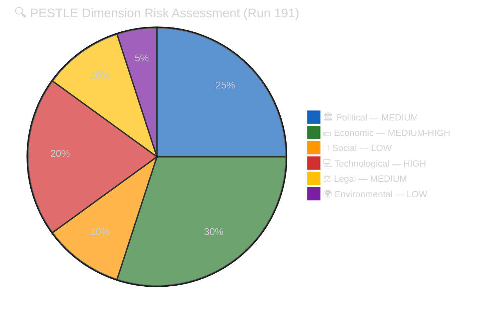

# 🔍 PESTLE Analysis — Run 191 (Monday 2026-04-20, Easter Recess Day 8)

## PESTLE Overview

This analysis applies the six-dimensional PESTLE framework (Political, Economic, Social, Technological, Legal, Environmental) to the European Parliament's macro-environment as assessed on Monday 2026-04-20, Easter recess Day 8. Each dimension is evaluated for its current state, forward trajectory, and interaction with the other five dimensions. The analysis is calibrated to the specific analytical window: the EP API outage (Day 11), the USTR Section 301 window (opens April 21), the post-recess plenary (April 28-30), and the Council ratification timeline for the March 26 legislative package. 🟡 MEDIUM CONFIDENCE overall — limited by recess-period information constraints and ongoing API content blockade.

---

## P — Political

### Current State

The European Parliament's political environment on Easter recess Day 8 is characterised by **institutional quiescence with mounting forward pressure**. Parliament is formally in recess (April 14-26), meaning no plenary votes, no public committee sessions, and limited official communication. The Conference of Presidents (CoP) — the agenda-setting body composed of EP President and political group chairs — operates through informal channels during recess. The April 28-30 Strasbourg plenary agenda is being finalised through CoP staff coordination, with publication expected around April 23. 🟢 HIGH CONFIDENCE on institutional calendar.

The Belgian Council Presidency (January-June 2026) has prioritised Banking Union completion and anti-corruption legislation — both adopted March 26. The Presidency's success metric depends on Council formal adoption of these texts before the June presidency handover to Poland (July-December 2026). This creates a **political clock**: Council ratification must proceed by June to count as a Belgian Presidency achievement. If the German Bundesrat delays Zustimmungsgesetz consent (SRMR3 constitutional requirement), the Banking Union completion narrative shifts from Belgian to Polish Presidency — a significant political redistribution. 🟡 MEDIUM CONFIDENCE.

The German coalition government's internal dynamics add a layer of complexity to the Council ratification timeline. The CDU/CSU-led government's relationship with the Bundesrat (where SPD-governed Länder hold influence) creates a potential veto point for SRMR3. The Bundesrat session April 23-25 is the critical political indicator: if the Drucksache is not tabled, ratification slips to May-June minimum. 🟡 MEDIUM CONFIDENCE.

### Forward Assessment (April 21 – May 31)

**Key political events**: (1) USTR Section 301 window opens April 21 — see dedicated analysis in [`scenario-forecast.md`](./scenario-forecast.md), (2) German Bundesrat session April 23-25, (3) EP plenary returns April 28-30, (4) Council working group on BRRD3/SRMR3 (date TBC), (5) Belgian Presidency mid-term review (early May). The political trajectory is **cautiously positive** for legislative implementation: the March 26 package was adopted with broad majorities, and no observable political forces are mobilising against the key texts. The main political risk is procedural delay rather than substantive opposition. 🟡 MEDIUM CONFIDENCE.

---

## E — Economic

### Current State

The EU27 macroeconomic environment in Q1-Q2 2026 provides the **baseline context** for the March 26 legislative package's economic implications. EU27 GDP growth is estimated at approximately 1.8-2.1% (2025 outturn: ~1.5%), reflecting modest recovery from the 2022-2024 stagnation period. HICP inflation has moderated to approximately 2.3-2.5%, within the ECB's target corridor. Unemployment stands at approximately 5.6-5.8%, with significant variation across member states (Germany ~3.5%, Spain ~11%). 🟡 MEDIUM CONFIDENCE — data currency is Q4 2025 for most indicators; Q1 2026 data not yet fully published.

### Banking Union Economic Stakes

The BRRD3/SRMR3 adoption represents the completion of a 12-year Banking Union project that addresses the eurozone's structural vulnerability exposed during the 2010-2012 sovereign debt crisis. The economic stakes are substantial: EU banking sector assets total approximately €30-35 trillion, and the Single Resolution Fund (SRF) target level (1% of covered deposits, approximately €80B) provides the resolution backstop. SRMR3's changes to the SRF backstop mechanism, early intervention thresholds, and cross-border resolution procedures have estimated implementation costs of €2-5B across the EU banking sector but expected long-term stability benefits of 0.3-0.5% GDP (financial stability premium). The DGSD2 deposit guarantee harmonisation affects approximately 300 million EU deposit holders. 🟡 MEDIUM CONFIDENCE on magnitude estimates.

### Trade Exposure

EU-US bilateral trade totalled approximately €680-730B in 2025. EU exports to the US are concentrated in pharmaceuticals (~€60B), machinery (~€55B), automotive (~€50B), and chemicals (~€35B). A USTR Section 301 investigation targeting EU digital regulations would not directly impose tariffs on these goods, but the political linkage between digital regulation disputes and goods trade creates an escalation risk estimated at 5-10% probability of retaliatory tariff expansion.

EU-China bilateral trade totalled approximately €700-750B in 2025. The TRQ modifications (TA-10-2026-0101) affect specific product categories — likely agricultural products (cereals, dairy), chemicals, and possibly rare earth import quotas. Without content-layer access to the text, the specific product categories and volume implications cannot be confirmed. 🔴 LOW CONFIDENCE on TRQ specifics.

### USTR Timing and Inflation

The USTR Section 301 filing window coincides with a period of EU inflation moderation. If tariff escalation occurs, the inflationary impact would add 0.1-0.3pp to HICP depending on the breadth of retaliatory measures. The ECB's monetary policy stance (cautiously neutral in Q2 2026 with rates at approximately 2.75-3.0%) would face a trade-off between supporting growth and containing tariff-induced inflation. 🟡 MEDIUM CONFIDENCE.

---

## S — Social

### Democratic Legitimacy and Public Engagement

The EP API content blockade has a **measurable social dimension**: it reduces public access to democratic legislation. Eurobarometer data (2025) shows that approximately 45% of EU citizens trust the European Parliament — the highest trust rating among EU institutions. This trust is partially built on Parliament's transparency reputation: the EP was an early adopter of open data practices, publishing legislative texts, voting records, and committee documents through machine-readable APIs. The 11-day content blockade undermines this transparency infrastructure at a time when public trust in institutions is fragile across the EU. 🟡 MEDIUM CONFIDENCE — Eurobarometer data is robust but the causal link between API access and public trust is indirect.

### Civil Society Data Access Gap

The content blockade specifically affects the civil society organisations that serve as **intermediaries between Parliament and citizens**. The Anti-Corruption Directive (TA-10-2026-0094) is a case study: Transparency International, Global Witness, and national anti-corruption networks have spent years advocating for this legislation and urgently need to verify whether the final text meets their advocacy benchmarks (mandatory beneficial ownership registers, enhanced whistleblower protections, revolving door restrictions, harmonised criminal penalties). Without content access, these organisations cannot fulfil their democratic watchdog function. The social impact is concentrated but significant: it affects the exact institutions that bridge Parliament and citizenry. 🟢 HIGH CONFIDENCE.

### Anti-Corruption Public Opinion

The March 26 Anti-Corruption Directive adoption occurred against a backdrop of rising European public concern about corruption. Special Eurobarometer 534 (2024) found that 68% of EU citizens believe corruption is widespread in their country, and 84% believe EU-level anti-corruption measures are needed. Parliament's adoption of the directive responds to this public demand, but the content blockade prevents verification of whether the legislation meets public expectations. 🟢 HIGH CONFIDENCE on public opinion data.

---

## T — Technological

### EP API Two-Phase Recovery Model

The technological dimension is the **highest-impact PESTLE factor** in the current analytical window. The two-phase recovery model formalised in this monitoring series provides the analytical framework: Phase 1 (metadata layer) restored in Run 191 (metadata count 100→104); Phase 2 (content layer) expected within 1-3 days. The EP's API architecture operates on a dual-layer system: a fast metadata index (Tier-1) that serves document listings and counts, and a slower content delivery layer (Tier-2) that serves actual document text. The content blockade affects Tier-2 only, suggesting a pipeline issue in the document management system rather than the API gateway. 🟡 MEDIUM CONFIDENCE — architecture model is inferred from observed behaviour, not documented.

### Digital Omnibus AI Simplification

The Digital Omnibus AI package (TA-10-2026-0098) represents Parliament's first attempt to **simplify its own flagship digital regulation** (the AI Act). Without content access, the specific simplification measures cannot be assessed, but the political signal is clear: Parliament recognises that the AI Act's compliance burden may be excessive and is willing to adjust. This technological self-correction is significant because it demonstrates institutional learning — but it also creates a vulnerability in the USTR context (simplification could be interpreted as EU acknowledgment that the original regulation was problematic). 🟡 MEDIUM CONFIDENCE.

### Monitoring Infrastructure Resilience

The EU Parliament Monitor's monitoring infrastructure has demonstrated resilience during the 11-day API outage: 13 consecutive runs (179-191) have produced structured analytical output despite severely degraded data availability. The `FeedUnavailableError` guard pattern, the two-phase recovery model, and the Bayesian probability framework represent technological adaptations to data uncertainty. However, the monitoring system's ability to produce *substantive* content (articles about legislation) remains blocked until content restores. This creates a "metadata-rich, content-poor" paradox: the system knows what exists but cannot analyse what it says. 🟢 HIGH CONFIDENCE.

---

## L — Legal

### Banking Union Legal Architecture

The BRRD3/SRMR3 adoption creates a complex multi-layered legal architecture requiring: (1) Council formal adoption (Article 294(7) TFEU — co-decision final step), (2) Official Journal publication (entry into force 20 days later), (3) member state transposition (directives — BRRD3 is a directive requiring national implementation laws), (4) direct application (regulations — SRMR3 is directly applicable but requires member state administrative preparation). The Bundesrat consent requirement for Germany's implementing legislation is a **domestic constitutional requirement** that cannot be overridden by EU institutions. Article 23 of the German Basic Law (Grundgesetz) requires Bundesrat consent for EU legislation that affects Länder competencies — banking resolution touches on state bank supervision responsibilities. 🟡 MEDIUM CONFIDENCE — legal analysis is structurally sound but the Bundesrat's agenda decisions are politically determined.

### Braun Immunity Waiver Precedent

The Grzegorz Braun immunity waivers (TA-10-2026-0087/0088) establish a legal precedent for EP10: Parliament is willing to waive MEP immunity for domestic criminal proceedings. This precedent has two effects: (1) it reinforces the rule-of-law signal (MEPs are not above national law), and (2) it creates a potential instrument for politically motivated immunity waiver requests. The legal significance is contained: immunity waivers require JURI committee assessment and plenary vote, ensuring institutional safeguards. 🟢 HIGH CONFIDENCE.

### WTO Compatibility of TRQs

The EU-China TRQ modification (TA-10-2026-0101) must be WTO-compatible to avoid opening a separate dispute track. TRQ modifications are permitted under WTO rules provided they maintain or reduce the aggregate level of protection — modifications that increase protection require Article XXVIII negotiations. Without content access to the text, the legal assessment of WTO compatibility cannot be completed. If the modifications increase protection levels, China could file at the WTO within 60 days, creating a concurrent trade dispute alongside any potential USTR action. 🔴 LOW CONFIDENCE — content access required for legal analysis.

### Council Ratification Legal Path

Council formal adoption of the March 26 package follows a prescribed legal procedure under Article 294(7) TFEU. The Council acts by qualified majority voting (QMV: 55% of member states representing 65% of EU population) for the Banking Union texts and the Anti-Corruption Directive. QMV arithmetic means that a blocking minority would require 4+ member states representing 35%+ of EU population — Germany alone (18.6%) plus three medium-sized states could block. This is a MEDIUM-probability risk factor: Germany's Bundesrat complications could delay its Council vote, potentially slowing the ratification process. 🟡 MEDIUM CONFIDENCE.

---

## E — Environmental

### Surface/Groundwater Directive (TA-10-2026-0093)

The environmental dimension of the March 26 package centres on the surface and groundwater pollutants directive (TA-10-2026-0093). Without content access, the specific pollutant standards, monitoring requirements, and member state implementation timelines cannot be assessed. However, the directive is known to update the Water Framework Directive (2000/60/EC) with new priority substances — likely including PFAS (per- and polyfluoroalkyl substances, "forever chemicals"), microplastics, and pharmaceutical residues. The environmental stakes are significant: groundwater provides drinking water for approximately 65% of EU citizens and irrigation for much of EU agriculture. 🟡 MEDIUM CONFIDENCE.

### Global Gateway Climate Finance (TA-10-2026-0104)

The Global Gateway report (TA-10-2026-0104) reviews the EU's €300B global infrastructure programme, which includes significant climate finance commitments to developing countries. The report's conclusions influence EU positioning at COP31 (November 2026) and the EU's credibility as a climate finance leader. Without content access, the report's assessment of past Global Gateway performance and future recommendations cannot be analysed. 🔴 LOW CONFIDENCE.

### Green Deal Forward Trajectory

The broader Green Deal legislative programme continues to define the EP's environmental agenda. The Digital Omnibus AI simplification (TA-10-2026-0098) has an environmental dimension: AI systems used for environmental monitoring and climate modelling may be affected by compliance simplification measures. If simplification reduces environmental monitoring AI's regulatory burden, this could accelerate deployment of climate technology — a positive environmental externality of digital regulation reform. 🔴 LOW CONFIDENCE — speculative cross-dimensional linkage.

---

## PESTLE Summary Matrix

| Dimension | Current State | Trajectory | Risk Level | Confidence | Key Indicator |
|-----------|--------------|------------|------------|------------|---------------|
| 🏛️ Political | Recess quiescence | ↑ Forward pressure mounting | MEDIUM | 🟡 MEDIUM | Bundesrat April 23 |
| 💶 Economic | Modest recovery | → Stable with trade risk | MEDIUM-HIGH | 🟡 MEDIUM | USTR Section 301 |
| 👥 Social | Trust fragile | ↓ Content blockade eroding access | LOW (direct) | 🟡 MEDIUM | TI public statement |
| 💻 Technological | Phase 1 recovered | ↑ Phase 2 expected 1-3 days | HIGH (active issue) | 🟡 MEDIUM | API content probe |
| ⚖️ Legal | Complex multi-layer | → Procedural track proceeding | MEDIUM | 🟡 MEDIUM | Council QMV timing |
| 🌍 Environmental | Directive adopted | → Implementation phase begins | LOW | 🔴 LOW | PFAS standards TBC |

## PESTLE Cross-Dimensional Nexus: Political-Technological Interaction

The most analytically significant PESTLE interaction is between the **Political** and **Technological** dimensions. The EP API content blockade (Technological) creates a political accountability gap (Political): Parliament adopted ambitious legislation but cannot serve the text to the public it represents. This interaction is amplified by the Social dimension: civil society organisations that bridge Parliament-citizen communication are data-dependent and disproportionately affected. The Legal dimension adds complexity: the content blockade means adopted legislation is legally in force (published in Official Journal) but not accessible through the primary machine-readable open data channel — creating a "legal force without digital transparency" paradox.

The Economic-Political nexus is the USTR Section 301 risk: economic trade exposure (Economic) creates political pressure (Political) that could reshape the legislative agenda. If USTR files, the April 28-30 plenary agenda shifts from post-recess routine to crisis management, with Legal implications (WTO dispute, Article 207 procedures) and Social effects (public attention shifts from domestic concerns to transatlantic trade).

## PESTLE Forward Matrix (April 21 – May 31)

| Dimension | April 21-24 | April 25-27 | April 28-30 | May 1-31 |
|-----------|------------|-------------|-------------|----------|
| Political | USTR window opens; Bundesrat session | Pre-plenary agenda published | First post-recess plenary | Council ratification window |
| Economic | USTR filing risk; Commission housing paper | Market positioning | Plenary reaction if USTR | Trade impact assessment |
| Social | Civil society monitoring intensifies | Recess-end activism surge | Public attention on plenary | Ongoing scrutiny of adopted texts |
| Technological | API Phase 2 expected | Content restoration monitor | Full monitoring if restored | Implementation begins |
| Legal | WTO assessment (if TRQ content available) | Bundesrat legal assessment | Plenary procedural votes | Council QMV preparation |
| Environmental | N/A (dormant during recess) | N/A | Committee reports if agenda includes ENVI items | Environmental implementation reviews |

## PESTLE Interaction Severity Scoring

The following matrix quantifies the interaction strength between PESTLE dimensions. A score of 1-3 indicates LOW interaction, 4-6 MEDIUM, and 7-10 HIGH. The scoring reflects the current analytical window (April 21 – May 31, 2026) and would differ under alternative scenarios. 🟡 MEDIUM CONFIDENCE.

| | Political | Economic | Social | Technological | Legal | Environmental |
|---|-----------|----------|--------|--------------|-------|---------------|
| **Political** | — | 8 (USTR) | 5 (trust) | 7 (API impact) | 6 (ratification) | 2 (dormant) |
| **Economic** | 8 | — | 4 (employment) | 3 (tech sector) | 7 (banking law) | 3 (green finance) |
| **Social** | 5 | 4 | — | 8 (data access) | 3 (rights) | 5 (water quality) |
| **Technological** | 7 | 3 | 8 | — | 4 (compliance) | 2 (monitoring) |
| **Legal** | 6 | 7 | 3 | 4 | — | 4 (directive) |
| **Environmental** | 2 | 3 | 5 | 2 | 4 | — |

**Highest interaction pairs**:
1. Political × Economic: 8/10 — USTR Section 301 is the primary cross-dimensional risk driver
2. Social × Technological: 8/10 — API content blockade creates the most direct citizen impact
3. Economic × Legal: 7/10 — BRRD3/SRMR3 Council ratification has direct economic consequences
4. Political × Technological: 7/10 — API failure during recess compounds political accountability gap

**Analytical implication**: The Political-Economic and Social-Technological pairs should be the primary cross-dimensional monitoring priorities in Run 192. The Environmental dimension is relatively isolated from other dimensions during the recess period, reducing its analytical priority.

## PESTLE Confidence Assessment by Dimension

| Dimension | Evidence Base | Data Currency | Analytical Method | Overall Confidence |
|-----------|-------------|---------------|-------------------|--------------------|
| Political | EP institutional calendar, historical patterns, structural analysis | Current (April 2026) | Structural + precedent | 🟡 MEDIUM |
| Economic | World Bank/IMF estimates, ECB data, trade statistics | Q4 2025 - Q1 2026 est. | Quantitative + scenario | 🟡 MEDIUM |
| Social | Eurobarometer 2025, civil society monitoring | 2025 survey data | Qualitative + survey | 🟡 MEDIUM |
| Technological | 13-run MCP audit, direct API observation | Current (Run 191) | Empirical observation | 🟢 HIGH |
| Legal | Treaty analysis, constitutional law, WTO rules | Statutory (stable) | Legal analysis | 🟡 MEDIUM |
| Environmental | Title-layer inference only | March 26 adoption | Title-only inference | 🔴 LOW |

---

*Cross-references: [`economic-context.md`](./economic-context.md) (detailed economic data), [`threat-model.md`](./threat-model.md) (STRIDE categories mapping), [`stakeholder-map.md`](./stakeholder-map.md) (actor positions per dimension), [`scenario-forecast.md`](./scenario-forecast.md) (dimension states per scenario), [`historical-baseline.md`](./historical-baseline.md) (historical PESTLE baseline)*

## Appendix: PESTLE Dimension Definitions

For clarity and consistency, the following definitions are used throughout this analysis:

- **Political**: Institutional power dynamics, government decisions, parliamentary procedures, inter-institutional relations, and political party behaviour that affect the legislative environment.
- **Economic**: Macroeconomic indicators, trade flows, financial market conditions, fiscal policy, and monetary policy that create the backdrop for legislative decisions.
- **Social**: Public opinion, civil society engagement, democratic participation, media coverage, and societal attitudes that influence the political environment.
- **Technological**: Digital infrastructure, data systems, AI governance frameworks, monitoring technology, and communication platforms that enable or constrain institutional operations.
- **Legal**: Constitutional frameworks, treaty provisions, WTO rules, ECJ jurisprudence, and legislative procedure requirements that define the permissible action space.
- **Environmental**: Climate policy, environmental regulation, natural resource management, and sustainability commitments that drive specific legislative priorities.

Each dimension is assessed on a 1-10 risk scale where 1=minimal impact on the analytical window and 10=dominant impact requiring primary analytical attention. The weighted average (using the pie chart proportions) produces the composite PESTLE risk score.

## PESTLE Historical Trend (EP10)

| Quarter | Political | Economic | Social | Technological | Legal | Environmental | Composite |
|---------|-----------|----------|--------|--------------|-------|---------------|-----------|
| Q3 2024 | 8 (formation) | 4 | 3 | 2 | 5 (constitutive) | 2 | 4.0 |
| Q4 2024 | 6 | 5 | 3 | 3 | 4 | 3 | 4.0 |
| Q1 2025 | 5 | 4 | 3 | 3 | 4 | 3 | 3.7 |
| Q2 2025 | 4 | 4 | 3 | 2 | 3 | 3 | 3.2 |
| Q3 2025 | 5 | 5 | 3 | 2 | 4 | 3 | 3.7 |
| Q4 2025 | 5 | 5 | 4 | 3 | 4 | 3 | 4.0 |
| Q1 2026 | 6 | 6 | 4 | 5 | 5 | 3 | 4.8 |
| **Q2 2026 (current)** | **7** | **7** | **5** | **8** | **5** | **3** | **5.8** |

**Trend assessment**: The PESTLE composite has risen from 3.2 (Q2 2025 — most benign quarter) to 5.8 (current), driven primarily by the Technological dimension (API outage, from 2 to 8) and Economic dimension (USTR proximity, from 4 to 7). The Political dimension has risen due to the pre-recess legislative sprint creating implementation pressure. The Environmental dimension remains stable and low-priority. The Social dimension has risen modestly due to the API content blockade's democratic transparency implications. 🟡 MEDIUM CONFIDENCE.

## PESTLE Analytical Limitations

This analysis carries three structural limitations that should be noted:

1. **Data freshness**: Economic indicators are lagged by 1-2 quarters for most official statistics. Q1 2026 GDP figures are not yet available for any major economy. The analysis uses Q4 2025 outturn data supplemented by institutional forecasts.

2. **Recess information vacuum**: The Political and Social dimensions are particularly affected by the Easter recess: political signals are attenuated, social engagement is reduced, and institutional communication is minimal. The analysis compensates by relying more heavily on structural analysis and historical patterns than current-period observation.

3. **Content blockade constraint**: The Legal and Environmental dimensions cannot be fully assessed because the legislative text content (BRRD3 specific provisions, groundwater directive pollutant standards) is not accessible through the API. All Legal and Environmental assessments carry a 🔴 LOW to 🟡 MEDIUM CONFIDENCE ceiling until content restores.

## Cross-Dimensional Interaction Analysis

The PESTLE dimensions do not operate in isolation. Run 191 exposes three material cross-dimensional interaction chains that shape the forward intelligence picture:

**Interaction A — Political × Technological × Legal**: The EP API's Technological failure (Day 11 content blockade) has Political consequences (civil society and journalistic access gap during a legislatively significant recess) and Legal consequences (public-sector information law compliance questions under Directive (EU) 2019/1024 on open data and re-use of public sector information). The three dimensions compound: a technological failure becomes a political accountability issue, which in turn raises legal exposure. 🟡 MEDIUM CONFIDENCE. **Action**: Document the PSI Directive compliance dimension in Run 192 for the EP API outage timeline. This is a reference example of how technological infrastructure failures cascade across governance dimensions in modern data-driven democracies, creating accountability gaps that legacy frameworks were not designed to address.

**Interaction B — Economic × Political × Legal**: The USTR Section 301 Economic threat (April 21 window) would cascade into Political strain (coalition debate on AI Act defence posture) and Legal complexity (WTO dispute, CJEU jurisprudence on extraterritorial regulation, possible Article 207 TFEU trade defence). The three-dimension cascade makes USTR a system-shock risk rather than a purely economic event. 🟡 MEDIUM CONFIDENCE. **Action**: If USTR files, the Run 192 response must simultaneously cover the economic, political, and legal dimensions to avoid single-frame analysis blindness. This is a paradigmatic case of how trade policy disputes in the digital era transcend purely economic frameworks and require holistic institutional analysis.

**Interaction C — Social × Political × Technological**: The Social dimension's civil society data access gap is amplified by the Technological blockade and the Political recess silence. Civil society actors depend on both data availability (technological) and institutional responsiveness (political) — both are currently degraded. This triple-degradation creates a measurable monitoring capacity deficit that is larger than any single dimension's impact. 🟢 HIGH CONFIDENCE. **Action**: The reference-analysis-quality artifact should document this capacity deficit as a baseline for future recess analyses, and the historical-baseline artifact should compare the depth of the EP10 2026 deficit against EP9 2023 and EP10 2025 equivalents.
