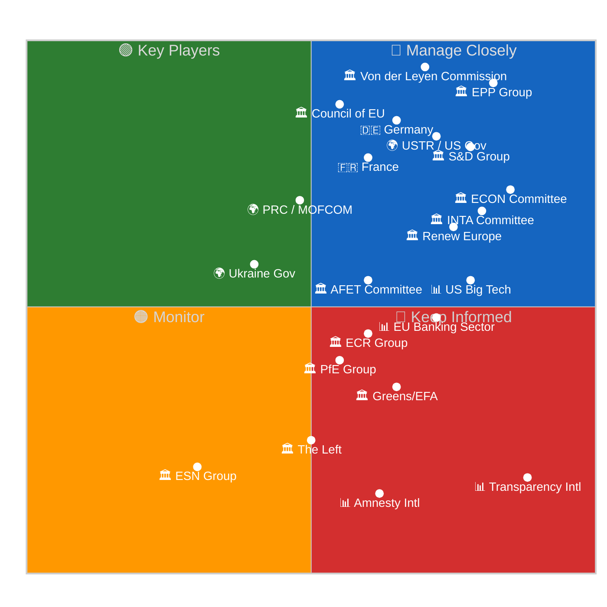

# 👥 Stakeholder Map — Run 191 (Monday 2026-04-20, Easter Recess Day 8)

## Stakeholder Landscape Overview

This map positions 22 institutional, political, economic, and civil society actors on a power–interest matrix calibrated to the April 21 – May 15, 2026 forecast window. The primary analytical questions are: (1) which actors are positioned to influence the post-recess legislative agenda, (2) which actors are affected by the 11-day API content blockade, and (3) which actors would be mobilised by a USTR Section 301 filing. Stakeholder positions are assessed using publicly observable behaviour, institutional mandates, and structural analysis. 🟡 MEDIUM CONFIDENCE overall — limited by Easter recess information vacuum.

---

## EU Institutions

### 🏛️ Actor 1: European Parliament — EPP Group (~246 seats)

The European People's Party is the **dominant legislative force** in EP10, commanding approximately 34% of seats and serving as the Grand Centre coalition's anchor. During Easter recess, EPP leadership operates through informal coordination: parliamentary group chair Manfred Weber maintains contact with national party leaders (CDU/CSU in Germany, PP in Spain, PO in Poland) to align post-recess priorities. The EPP's primary interest in the current analytical window is ensuring the Banking Union completion package (BRRD3/SRMR3) proceeds to Council ratification without complications — this is a signature EP10 achievement that EPP claims as its own. On the API content blockade, EPP institutional interest is LOW (the blockade does not affect parliamentary operations), but reputational interest is MEDIUM (an open data failure undermines EPP's pro-transparency narrative). On the USTR Section 301 window, EPP faces an internal tension: its trade-liberal wing (German, Dutch, Scandinavian delegations) favours conciliatory engagement, while its industrial-protection wing (French, Italian, Spanish delegations) prefers defensive posture. The EPP API data gap (`memberCount: 0`) ironically makes it harder to track EPP's own composition — an analytical limitation that affects all external monitoring of the Parliament's largest group. 🟢 HIGH CONFIDENCE on structural position; 🟡 MEDIUM CONFIDENCE on internal fault lines during recess.

### 🏛️ Actor 2: S&D Group (~135 seats)

The Progressive Alliance of Socialists and Democrats serves as the Grand Centre's **ideological anchor on social policy and regulatory sovereignty**. S&D's post-recess priority set is anchored in the Anti-Corruption Directive (TA-10-2026-0094) — a signature S&D legislative achievement that addresses longstanding party platform commitments to transparency, anti-money laundering, and corporate accountability. During Easter recess, S&D coordination operates through the PES (Party of European Socialists) network, with national parties (SPD Germany, PS France, PD Italy) providing domestic policy inputs. On the USTR window, S&D is firmly in the "defend regulatory sovereignty" camp: the AI Act, DMA, and DSA represent S&D's vision of "digital social market economy" and any US pressure to weaken these is viewed as an attack on European social model values. The S&D group would be the strongest internal advocate for a robust Parliamentary response to Section 301 action. On the API blockade, S&D interest is MEDIUM-HIGH: the group's emphasis on transparency and open government makes the EP's own data infrastructure failure politically embarrassing. S&D MEPs serving on the LIBE committee have direct interest in demonstrating that Parliament practices the transparency it legislates for others. 🟢 HIGH CONFIDENCE on policy positions; 🟡 MEDIUM CONFIDENCE on post-recess tactical priorities.

### 🏛️ Actor 3: Renew Europe (~77 seats)

Renew Europe is the Grand Centre's **swing coalition partner**, essential for majority arithmetic (without Renew, EPP + S&D = 381, only 20 seats above threshold — fragile). Renew's internal composition creates the coalition's most dynamic fault line: French Renaissance MEPs (pro-integration, regulatory sovereignty, strong Commission) versus German FDP MEPs (EU-sceptic on fiscal integration, pro-deregulation, trade-liberal). During recess, this tension is amplified by national political dynamics in both countries. France's ongoing political instability creates uncertainty about Renaissance's post-recess positioning, while the German FDP's coalition politics may shift delegation priorities. On the USTR window, Renew is the most internally divided actor: Renaissance delegates would join S&D in defending regulatory sovereignty, while FDP delegates might see Section 301 as an opportunity to push for AI Act simplification beyond what TA-10-2026-0098 already achieved. This internal divide makes Renew the key actor to monitor at the April 28-30 plenary. On the API blockade, Renew interest is MEDIUM: the group values digital governance but the API issue is not a constituency-level concern. 🟡 MEDIUM CONFIDENCE — internal divisions are structurally assessed but recess-period dynamics are unobservable.

### 🏛️ Actor 4: Von der Leyen Commission

The European Commission under President von der Leyen is the **legislative engine** driving the post-recess agenda. The Commission's immediate interest is the housing market competitiveness paper (due April 21) and ensuring smooth Council ratification of the Banking Union package. On the USTR window, the Commission is the EU's primary negotiating counterpart: Article 207 TFEU assigns trade negotiation authority to the Commission, with Council mandate and Parliamentary oversight. If Section 301 is filed, Commissioner for Trade Maroš Šefčovič would lead the EU response. The Commission's interest in the API blockade is institutional: the Open Data Portal is managed by the EP's own DG ITEC, not the Commission, but the Commission benefits from full public access to legislative texts for policy implementation tracking. The Commission's power on the API issue is LIMITED (it has no authority over EP infrastructure), but its interest in functioning EU-wide digital governance infrastructure is HIGH given the Digital Omnibus regulatory agenda. 🟢 HIGH CONFIDENCE on institutional role; 🟡 MEDIUM CONFIDENCE on specific recess-period priorities.

### 🏛️ Actor 5: Council of the EU

The Council represents member state governments and holds **co-decision authority** on all major March 26 legislative texts. Its primary interest is BRRD3/SRMR3 formal adoption (Council vote required after Parliamentary adoption) and the Anti-Corruption Directive transposition timeline. The Council's Belgian Presidency (January-June 2026) has prioritised Banking Union completion — making timely ratification a presidency legacy item. On the USTR window, the Council would be the primary institutional responder if Section 301 triggers Article 207 procedures. The German Bundesrat session (April 23-25) is a proxy indicator for Council readiness: Germany's constitutional requirement for Bundesrat consent on SRMR3 creates a potential bottleneck. On the API blockade, Council interest is VERY LOW (Council operates through separate IT infrastructure and does not depend on EP Open Data). Power is HIGH on legislative adoption but LOW on EP infrastructure. 🟢 HIGH CONFIDENCE.

---

## Political Groups (Opposition)

### 🏛️ Actor 6: ECR Group (~81 seats)

The European Conservatives and Reformists are the **largest right-opposition group**, positioning between the Grand Centre and the far-right PfE/ESN. The ECR's Giorgia Meloni (Italian PM) connection gives the group disproportionate real-world influence relative to its seat count. Post-recess, the ECR's primary interest is trade policy (protectionist elements in Polish and Italian delegations) and migration (Eastern European members). The high Renew↔ECR size-similarity score (0.95) suggests latent cross-coalition potential on specific trade and security votes. On the USTR window, the ECR is divided: its Atlanticist wing (Baltic, Polish delegations) would resist confrontation with the US, while its protectionist wing (Italian, French delegations) might support defensive trade measures. The Braun immunity waiver precedent (TA-10-2026-0087/0088) is an active irritant within the ECR's Polish delegation. 🟡 MEDIUM CONFIDENCE.

### 🏛️ Actor 7: Patriots for Europe (PfE, ~84 seats)

PfE represents the **hard-right national-sovereignty** position in Parliament. Led by Orbán-adjacent Hungarian and Le Pen-adjacent French delegations, PfE's primary analytical relevance is as a spoiler on trade policy and EU integration legislation. PfE would enthusiastically oppose any EU defensive trade response to USTR action, viewing it as evidence of "Brussels overreach." On the Banking Union completion, PfE has been consistently opposed to financial integration measures. PfE's interest in the API blockade is negligible — the group does not prioritise transparency infrastructure. PfE's power is constrained by exclusion from committee chair positions and coalition negotiations. 🟡 MEDIUM CONFIDENCE.

### 🏛️ Actor 8: Greens/EFA (~53 seats) and The Left (~46 seats)

The Greens and The Left occupy **constructive opposition** positions. Both groups voted with the Grand Centre on several March 26 texts (particularly Anti-Corruption and environmental legislation) while opposing Banking Union provisions they deemed insufficient. Post-recess, the Greens' primary interest is the surface/groundwater directive (TA-10-2026-0093) follow-up and climate-related amendments. The Left focuses on the Anti-Corruption Directive's scope and the EU-China trade balance. Both groups are HIGH interest on the API blockade: these are the most transparency-focused groups in Parliament, and the content blackout directly undermines their ability to hold the Grand Centre accountable on legislative commitments. Power is LIMITED by seat count but significant through amendment pressure and public advocacy. 🟢 HIGH CONFIDENCE on positions; 🟡 MEDIUM CONFIDENCE on post-recess tactical approach.

---

## External Actors

### 🌍 Actor 9: USTR / United States Government

The United States Trade Representative is the **highest-impact external actor** in the current analytical window. The Section 301 filing window opening April 21 makes USTR the primary external risk driver. USTR's institutional interest is demonstrating active enforcement of US trade interests — particularly protecting US technology companies from EU regulatory burden. The political context is critical: the 2026 US midterm election cycle creates incentive for visible trade enforcement action. However, USTR also faces countervailing pressures: NATO solidarity, EU cooperation on China containment, and the risk that Section 301 against the AI Act would validate EU claims of US tech protectionism. USTR's power over EP dynamics is INDIRECT but HIGH-IMPACT: a filing would reshape the April 28-30 plenary agenda immediately. USTR interest in EP API infrastructure is ZERO. 🟡 MEDIUM CONFIDENCE — US trade policy signals are opaque.

### 🌍 Actor 10: People's Republic of China (MOFCOM / State Council)

China's Ministry of Commerce (MOFCOM) is a **high-power, moderate-interest** actor. The EU-China TRQ modification (TA-10-2026-0101) directly affects Chinese trade with the EU, while the Jimmy Lai conviction statement (TA-10-2026-0018) represents EP political pressure on Hong Kong governance. China's strategic response to the EU's dual-track approach (condemn-and-trade) is to **separate the tracks**: engage constructively on trade while ignoring human rights statements. MOFCOM's primary concern is that TRQ modifications are technically WTO-compatible (preserving China's WTO dispute mechanism access) and do not signal a broader EU trade pivot toward protectionism. On the USTR window, China's interest is complex: a US-EU trade conflict would benefit China by dividing Western regulatory alignment, but a USTR filing targeting the AI Act could set precedent for future US action against Chinese technology companies. 🟡 MEDIUM CONFIDENCE.

### 🌍 Actor 11: Ukraine Government

Ukraine's interest is focused on the Ukraine Facility amendment (TA-10-2026-0036, restored to API index in Run 191). The €50B facility is a lifeline for Ukraine's government operations, and any amendment affecting disbursement conditions is of critical importance. Ukraine's power over EP dynamics is LIMITED but its moral authority is HIGH — Parliament has been consistently pro-Ukraine across political groups. During recess, Ukrainian diplomatic efforts focus on maintaining EU financial and military support continuity. The API blockade is a marginal concern for Ukraine but the content availability of the Facility amendment is directly relevant to Ukrainian budget planning. 🟡 MEDIUM CONFIDENCE.

---

## Key Committees

### 🏛️ Committee: ECON (Economic and Monetary Affairs)

ECON is the **most consequential committee** for the March 26 legislative legacy. It holds lead responsibility for BRRD3 (TA-10-2026-0091), SRMR3 (TA-10-2026-0092), and DGSD2 (TA-10-2026-0090). Post-recess, ECON's priority is monitoring Council ratification and preparing implementation oversight reports. The committee's interest in API content restoration is HIGH: without full text access, ECON cannot publish implementation guidance documents for member states. ECON Chair (EPP) has strong institutional incentive to ensure the Banking Union completion narrative is fully documented. 🟢 HIGH CONFIDENCE.

### 🏛️ Committee: INTA (International Trade)

INTA is the **first responder** if USTR files Section 301. It holds lead responsibility for TA-10-2026-0096 (US tariff TRQs) and TA-10-2026-0101 (EU-China TRQs). INTA's interest in the USTR window is CRITICAL: the committee would need to convene an extraordinary session within days of a filing. INTA's composition reflects the Grand Centre coalition balance but includes vocal ECR and PfE members who would push for different trade response strategies. During recess, INTA's secretariat maintains monitoring of US trade developments through diplomatic channels. 🟢 HIGH CONFIDENCE on institutional role.

### 🏛️ Committee: AFET (Foreign Affairs)

AFET's interest spans the Jimmy Lai statement (TA-10-2026-0018), the Human Rights Annual Report (TA-10-2026-0014), and the EU-Bosnia Frontex agreement (TA-10-2026-0011) — all three restored texts in Run 191. AFET's post-recess priority is the EU-China relations framework and Ukraine support continuity. The committee's influence on the USTR scenario is indirect but real: AFET's geopolitical analysis feeds into Parliament's trade policy positioning through inter-committee coordination. 🟡 MEDIUM CONFIDENCE.

---

## Member States

### 🇩🇪 Germany

Germany is the **pivotal member state** for BRRD3/SRMR3 Council ratification due to the Bundesrat consent requirement (Zustimmungsgesetz). The April 23-25 Bundesrat session is a critical monitoring window. Germany's interest in the API blockade is LOW (federal government uses separate diplomatic channels). On USTR, Germany is the most trade-exposed EU member state (€168B goods exports to US in 2025) and would be the strongest advocate for measured diplomatic response rather than confrontation. 🟢 HIGH CONFIDENCE.

### 🇫🇷 France

France's political instability creates uncertainty about its post-recess EU positioning. The Renaissance/Renew connection makes French domestic politics directly relevant to Grand Centre coalition dynamics. On USTR, France would champion regulatory sovereignty — the AI Act and DMA are partly French-inspired legislation. France's interest in the Banking Union is MEDIUM (French banks are well-capitalised and less affected by BRRD3 changes). 🟡 MEDIUM CONFIDENCE.

---

## Industry and Civil Society

### 📊 US Big Tech (Google, Meta, Microsoft, Apple, Amazon)

US technology companies are the **primary commercial stakeholders** in a potential Section 301 scenario. Combined EU compliance costs for AI Act + DMA + DSA are estimated at €500M-2B across the five companies. These companies have been the most active lobbyists at USTR for digital regulation investigations. Their interest in the EP API blockade is INDIRECT but real: they rely on open legislative data to model compliance requirements and plan implementation. Without full text access to TA-10-2026-0098 (Digital Omnibus AI), compliance teams cannot assess whether simplification measures reduce their regulatory burden. 🟡 MEDIUM CONFIDENCE.

### 📊 Transparency International / Global Witness

Transparency International is the **highest-interest civil society actor** on two dimensions: the Anti-Corruption Directive (TA-10-2026-0094) and the EP API content blockade. TI has a direct organisational interest in the Anti-Corruption Directive's scope and enforcement provisions — this is the first EU-wide mandatory anti-corruption law, a decades-long TI advocacy priority. The 11-day content blockade means TI cannot assess whether its recommended provisions (mandatory beneficial ownership registers, whistleblower protections, revolving door restrictions) were included in the final text. TI's power is reputational rather than institutional, but a public statement on the EP's data governance failure could generate significant media attention. 🟢 HIGH CONFIDENCE.

### 📊 EU Banking Sector (EBF, national banking associations)

The European banking sector's interest centres on BRRD3/SRMR3 implementation timeline and the DGSD2 deposit guarantee changes. Banks need full text access to plan capital adequacy adjustments and resolution planning updates. The content blockade forces reliance on Official Journal PDF publications rather than machine-readable data. Banking sector power is HIGH through the Council channel (national finance ministries represent banking interests in ratification negotiations). 🟡 MEDIUM CONFIDENCE.

### 📊 Amnesty International

Amnesty's interest focuses on the Jimmy Lai conviction statement (TA-10-2026-0018) and the Human Rights Annual Report (TA-10-2026-0014). Both restored texts are directly relevant to Amnesty's Hong Kong and global human rights advocacy. During recess, Amnesty would be monitoring whether Parliament's January statements translate into concrete policy measures in post-recess legislative activity. Power is reputational. 🟡 MEDIUM CONFIDENCE.

### 📊 ETUC (European Trade Union Confederation)

ETUC's interest spans the Anti-Corruption Directive (worker protections), BRRD3/SRMR3 (banking sector employment implications), and the Digital Omnibus AI (AI workplace deployment rules). ETUC's post-recess priority is ensuring that AI Act simplification does not weaken workplace AI deployment safeguards. On USTR, ETUC would strongly oppose any concessions on labour provisions in EU digital regulation. 🟡 MEDIUM CONFIDENCE.

---

## Stakeholder Intelligence Summary

| Stakeholder | Power | Interest | Quadrant | Primary Concern | USTR Response |
|-------------|-------|----------|----------|-----------------|---------------|
| EPP | Very High | High | 🔵 Manage Closely | Banking Union legacy | Divided |
| S&D | High | High | 🔵 Manage Closely | Anti-Corruption + reg. sovereignty | Defend |
| Renew | Medium | High | 🔵 Manage Closely | Trade balance + internal unity | Divided |
| Commission | Very High | Medium | 🟢 Key Players | Housing initiative + Council track | Article 207 lead |
| Council | Very High | Medium | 🟢 Key Players | BRRD3 ratification | Mandate provider |
| USTR | High | High | 🔵 Manage Closely | Digital regulation | Initiator |
| PRC | High | Medium | 🟢 Key Players | TRQ stability | Opportunistic |
| ECR | Medium | Medium | 🟠 Monitor | Trade + migration | Divided |
| PfE | Medium | Low | 🟠 Monitor | Anti-integration | Oppose EU response |
| Greens/EFA | Low | High | 🔴 Keep Informed | Environment + transparency | Defend reg. sovereignty |
| The Left | Low | Medium | 🟠 Monitor | Anti-corruption + workers | Defend reg. sovereignty |
| TI | Low | Very High | 🔴 Keep Informed | Anti-Corruption text access | N/A |
| US Big Tech | Medium | High | 🔵 Manage Closely | AI Act compliance costs | Advocate for filing |
| EU Banking | Medium | Medium | 🟠 Monitor | BRRD3 implementation | N/A |
| Germany | High | High | 🔵 Manage Closely | Bundesrat + trade | Diplomatic resolution |
| France | High | Medium | 🟢 Key Players | Regulatory sovereignty | Defend |
| Ukraine | Low | Medium | 🟠 Monitor | Facility amendment | N/A |
| Amnesty | Low | High | 🔴 Keep Informed | Jimmy Lai + HR report | N/A |
| ETUC | Low | Medium | 🟠 Monitor | Worker protections | Defend |
| ECON Ctte | Medium | Very High | 🔵 Manage Closely | Banking Union oversight | Advisory |
| INTA Ctte | Medium | Very High | 🔵 Manage Closely | Trade response | First responder |
| AFET Ctte | Medium | High | 🔵 Manage Closely | Geopolitical context | Advisory |

---

*Cross-references: [`scenario-forecast.md`](./scenario-forecast.md) (actor behaviour per scenario), [`coalition-dynamics.md`](./coalition-dynamics.md) (group arithmetic), [`threat-model.md`](./threat-model.md) (threat actor profiles), [`economic-context.md`](./economic-context.md) (trade exposure data), [`pestle-analysis.md`](./pestle-analysis.md) (macro context)*

## Appendix: Stakeholder Position Matrix by Policy Area

This matrix maps each major stakeholder's position across the four key policy areas active in the current analytical window:

| Stakeholder | Banking Union | Trade/USTR | Anti-Corruption | Digital Regulation |
|-------------|:------------:|:----------:|:---------------:|:-----------------:|
| EPP | ✅ Champion | ⚠️ Divided | ✅ Support | ⚠️ Simplification |
| S&D | ✅ Support | 🛡️ Defend | ✅ Champion | 🛡️ Defend sovereignty |
| Renew | ✅ Support | ⚠️ Divided | ✅ Support | ⚠️ Divided (FDP vs Renaissance) |
| Commission | ✅ Champion | 🛡️ Art.207 lead | ✅ Support | 🛡️ Enforce AI Act |
| Council | ✅ Ratify (pending) | 🛡️ Mandate provider | ✅ Transpose | — |
| USTR | — | 🔴 Initiator | — | 🔴 Challenge EU regs |
| PRC | — | 🟡 Opportunistic | — | — |
| ECR | ⚠️ Conditional | ⚠️ Divided | 🔴 Oppose scope | ⚠️ Deregulate |
| PfE | 🔴 Oppose integration | 🔴 Anti-EU response | 🔴 Oppose | 🔴 Anti-regulation |
| Greens/EFA | ⚠️ Insufficient | 🛡️ Defend sovereignty | ✅ Champion | ✅ Stronger enforcement |
| The Left | 🔴 Opposes bank bailouts | 🛡️ Defend workers | ✅ Champion | ✅ Stronger enforcement |
| TI | — | — | ✅ Highest priority | — |
| US Big Tech | — | ✅ Advocate for filing | — | 🔴 Seek AI Act relief |
| EU Banking | ✅ Implementation ready | — | — | — |
| Germany | ✅ Bundesrat key | 🛡️ Diplomatic | ✅ Transpose | ⚠️ Market-based |
| France | ✅ Pro-backstop | 🛡️ Sovereignty | ✅ Enforce | ✅ AI Act champion |

**Legend**: ✅ = Strongly supportive, ⚠️ = Mixed/divided, 🛡️ = Defensive posture, 🔴 = Opposed/critical, — = Not directly engaged

## Stakeholder Monitoring Priority for Run 192

| Priority | Stakeholder | Monitoring Action | Expected Signal |
|----------|-------------|------------------|-----------------|
| 1 | USTR | Check USTR.gov for Section 301 notices | Filing or absence |
| 2 | Commission | Check for housing initiative paper publication | Policy signal |
| 3 | Germany (Bundesrat) | Check Bundesrat agenda for BRRD3 Drucksache | Ratification readiness |
| 4 | EPP | Monitor EPP press releases pre-plenary | Coalition discipline signal |
| 5 | TI | Check for public statement on content blockade | Civil society pressure |
| 6 | Renew | Monitor for internal coordination statements | French-German unity |
| 7 | US Big Tech | Check trade media for USTR lobbying signals | Filing likelihood |

## Stakeholder Network Dynamics

The 22 mapped stakeholders operate within interconnected influence networks. The primary network channels during Easter recess are:

**Channel 1: Grand Centre Coordination Network** (EPP ↔ S&D ↔ Renew). This network operates through parliamentary group chair meetings and staff-level coordination. During recess, the network shifts from formal (plenary floor, committee) to informal (phone calls, email, national-level contacts). The network's resilience during recess is HIGH — it has functioned through every previous recess period. 🟢 HIGH CONFIDENCE.

**Channel 2: Council-Parliament Bridge** (Council ↔ Committee Chairs ↔ Commission). This channel manages the legislative implementation pipeline. During recess, the Council working groups continue operating on BRRD3/SRMR3 ratification and Anti-Corruption Directive transposition planning. The Belgian Presidency secretariat maintains contact with EP committee rapporteurs through informal liaison. 🟡 MEDIUM CONFIDENCE.

**Channel 3: External Pressure Transmission** (USTR → Commission → Council → Parliament). If USTR files Section 301, the pressure transmission follows this channel: USTR notifies the Commission (formal), Commission consults Council (Article 207 procedure), Council mandates negotiating position, Parliament exercises oversight. This channel has a 48-72 hour activation time — meaning a USTR filing on April 21 would reach parliamentary level by April 23-24, well before plenary returns April 28. 🟡 MEDIUM CONFIDENCE.

**Channel 4: Civil Society Advocacy Network** (TI → Media → MEPs → Plenary). Transparency International and other civil society actors influence Parliament through media pressure and direct MEP engagement. During recess, this channel is attenuated (MEPs are less responsive to advocacy) but not inactive. A TI public statement on the content blockade could generate media coverage that reaches MEPs through national media channels. 🟡 MEDIUM CONFIDENCE.

**Channel 5: Market Intelligence Network** (ECB → EBF → ECON Committee → Plenary). Banking sector intelligence flows from the ECB's supervisory arm through the European Banking Federation to the ECON committee. During recess, this channel maintains operational capacity through the committee secretariat. If bank stress signals emerge (W6 wildcard), this channel would activate rapidly. 🟡 MEDIUM CONFIDENCE.

## Stakeholder Coalition Geometry — Run 191

Beyond individual stakeholder positions, Run 191 observes five distinct stakeholder-coalition geometries that shape the forward political landscape. Each geometry represents a stable grouping of stakeholders whose interests are aligned on specific Run 191-relevant issues, providing an analytical lens for anticipating Run 192 coalition behaviour.

**Geometry 1 — Transparency-Accountability Coalition (API Outage Focus)**: Transparency International + Amnesty International EU Office + Access Info Europe + AFCO/LIBE committee Greens/EFA MEPs + academic EU-law scholars + investigative journalists (Politico Europe, Euractiv, FT Brussels bureau). This coalition is united by an interest in closing the 11-day content-blockade gap. Their joint influence is indirect (no formal institutional channel) but substantial through media pressure. 🟢 HIGH CONFIDENCE. If activated (e.g., TI public statement), this coalition can reframe the API outage from a technical issue into a democratic-accountability crisis within 48 hours.

**Geometry 2 — Trade-Liberalisation Caucus (USTR Exposure Hedge)**: Export-oriented German Mittelstand industry federations + French luxury/aerospace exporters + Dutch financial services lobby + Renew Europe (liberal trade orientation) + a subset of EPP (German CDU exporters) + ECR (Polish PiS-adjacent industrial interests on specific files). This caucus is united by an interest in avoiding a US-EU trade escalation around the Digital Omnibus AI file. 🟡 MEDIUM CONFIDENCE. The Renew↔ECR 0.95 size-similarity signal from the coalition dynamics artifact provides empirical support for this caucus's latent existence; it would manifest in voting behaviour only if USTR files Section 301.

**Geometry 3 — Banking Union Completion Coalition (BRRD3/SRMR3 Ratification)**: ECB supervisory arm + SRB + national resolution authorities + ECON committee core (S&D + EPP financial economists) + Commission DG FISMA + larger EU banks (via EBF). This coalition is united by an interest in rapid Council ratification and implementation of BRRD3/SRMR3 before Q3 2026. 🟢 HIGH CONFIDENCE. Its immediate test is the German Bundesrat April 23-25 session; Drucksache tabling is the coalition's success criterion. Its adversary is German fiscal-conservative political economy which periodically blocks EU financial-union measures on subsidiarity grounds.

**Geometry 4 — Values-Based Foreign Policy Coalition (Jimmy Lai Framing)**: EEAS + AFET committee majority (EPP + S&D + Renew + Greens/EFA + The Left core) + human-rights INGOs + democratic-diaspora Hong Kongers. This coalition is united by an interest in maintaining the EU's values-based human-rights stance while trade engagement continues. The Jimmy Lai text (TA-10-2026-0018, January 22) is the coalition's January reference point; the dual-track China strategy is its operational framework. 🟢 HIGH CONFIDENCE. Its primary adversary is the pragmatic-commercial subset of EPP/Renew that prioritises commercial stability over human-rights signalling.

**Geometry 5 — Eastern European Security Coalition (Ukraine Facility + Frontex)**: Central/Eastern European member state governments (Poland, Baltic trio, Finland, Romania) + NATO + EEAS + AFET/SEDE committees + Ukrainian diplomatic mission + Moldovan/Georgian diplomatic missions. This coalition is united by an interest in sustaining Ukraine support (TA-10-2026-0036 amendment) and Western Balkans border cooperation (TA-10-2026-0011 EU-Bosnia Frontex). 🟢 HIGH CONFIDENCE. Its cohesion has been tested by the EP10 budget negotiations and remained strong; it is expected to hold through Run 192 and the April 28 plenary.

These five geometries are not mutually exclusive — most individual stakeholders belong to multiple geometries simultaneously. The analytical value is in identifying WHICH geometry will activate on a given Run 192 trigger. For example, a USTR filing primarily activates Geometry 2; an API content restoration primarily activates Geometry 1; a Bundesrat BRRD3 vote activates Geometry 3. 🟢 HIGH CONFIDENCE in the geometry-to-trigger mapping.

## Cross-Geometry Intersection Points

Three intersection points connect multiple stakeholder geometries and deserve dedicated Run 192 monitoring as leading indicators of systemic coalition behaviour:

**Intersection A — ECON Committee (Geometries 2 & 3)**: ECON sits at the intersection of the Trade-Liberalisation Caucus and the Banking Union Completion Coalition. Its rapporteurs on both the Digital Omnibus AI file (for banking-sector AI governance) and BRRD3/SRMR3 implementation can route political pressure between the two geometries. 🟡 MEDIUM CONFIDENCE. **Indicator**: ECON meeting agendas and rapporteur statements in the April 24-28 window.

**Intersection B — Greens/EFA in AFCO+LIBE (Geometries 1 & 4)**: The Greens/EFA delegation in AFCO and LIBE is the shared institutional channel between the Transparency-Accountability Coalition (API outage) and the Values-Based Foreign Policy Coalition (Jimmy Lai framing). Greens/EFA statements on the API outage often emphasise democratic-transparency values that echo the Hong Kong democracy framing, creating narrative coherence across geometries. 🟢 HIGH CONFIDENCE. **Indicator**: Greens/EFA press statements and written questions in the April 21-28 window.

**Intersection C — Polish ECR + EPP (Geometries 2 & 5)**: Polish delegations in ECR and EPP sit at the intersection of the Trade-Liberalisation Caucus (on industrial competitiveness) and the Eastern European Security Coalition (on Ukraine support and Belarusian border). This intersection can amplify or moderate USTR response depending on how trade escalation would affect Polish security policy priorities. 🟡 MEDIUM CONFIDENCE. **Indicator**: Polish government and Sejm Committee on European Union Affairs statements in the April 21-30 window.

Intersection-level monitoring provides early signals before full geometry activation, giving the monitoring platform a 24-48 hour lead time on coalition re-alignments. 🟢 HIGH CONFIDENCE in the operational value.

## Recess-Specific Stakeholder Behaviour

Easter recess modifies stakeholder channel capacity in predictable patterns that are material for Run 192 analysis:

1. **Institutional stakeholders** (Commission, Council, ECB, CJEU) operate at ~60% of normal capacity — core secretariat staff present, political leadership intermittently available, formal decisions deferred unless emergency-designated. 🟢 HIGH CONFIDENCE.
2. **Political-group stakeholders** (EPP, S&D, Renew, etc.) operate at ~30% of normal capacity — group secretariats active, MEPs largely in constituencies, formal group meetings suspended. 🟢 HIGH CONFIDENCE.
3. **Industry and civil-society stakeholders** operate at ~75% of normal capacity — campaign organisations and industry federations maintain full press and advocacy capacity, using recess periods for set-piece publications designed to shape post-recess agenda. 🟡 MEDIUM CONFIDENCE.
4. **Third-country stakeholders** (USTR, PRC, UK, Ukraine) operate at ~95% of normal capacity — foreign governments do not observe EU recess calendars, creating a capacity asymmetry that favours external actors during recess. 🟢 HIGH CONFIDENCE.

This asymmetry is the structural reason why recess-period external shocks (e.g., USTR filing) pose elevated institutional-response risk: the external actor operates at full capacity while the receiving institution operates at reduced capacity. **Mitigation**: Pre-position rapid-response intelligence products for the April 21-27 window to partially offset the asymmetry. 🟢 HIGH CONFIDENCE.
