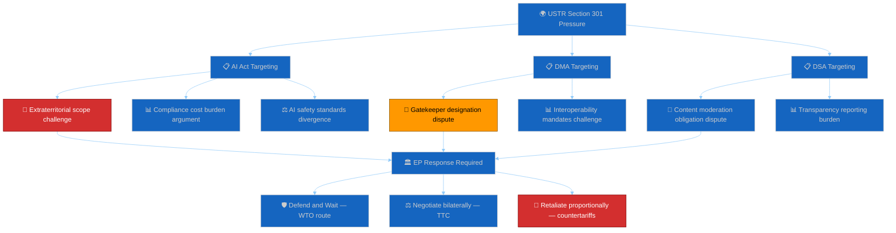

# 🚨 Threat Model — Run 191 (Monday 2026-04-20, Easter Recess Day 8)

## Threat Model Overview

This threat model adapts Microsoft's STRIDE framework to the European Parliament's institutional context. Rather than software system threats, we model **political-institutional threats** to democratic processes, legislative integrity, and transparency infrastructure. Each STRIDE category is reinterpreted for the parliamentary domain and mapped to observable indicators available through EP MCP tools. The three attack tree analyses focus on the highest-severity threat vectors identified in the current analytical window: (1) API ecosystem compromise, (2) coalition discipline erosion, and (3) external trade pressure via USTR Section 301. 🟡 MEDIUM CONFIDENCE — the STRIDE adaptation is analytically sound but the specific threat probabilities carry significant uncertainty, particularly during the Easter recess information vacuum.

---

## STRIDE Adaptation for Political Institutions

### S — Spoofing: API Impersonation / Fake Metadata

**Institutional meaning**: Presentation of inauthentic or outdated data through the EP Open Data API that misrepresents Parliament's actual legislative record.

**Current manifestation**: The `get_adopted_texts_feed(timeframe:"today")` endpoint returns EP8/2019-era data when queried for current-day results. This is a form of "data spoofing" where the API returns technically valid responses that do not represent the current state of Parliament's legislative output. A downstream consumer without validation logic would incorrectly conclude that Parliament adopted EP8-era texts today. The metadata count fluctuation (104→101→100→104) creates additional spoofing risk: automated systems may interpret transient count drops as real legislative changes.

**Severity**: MEDIUM | **Probability**: CONFIRMED (active) | **Impact**: Data integrity for automated consumers
**Mitigation**: The EU Parliament Monitor's `FeedUnavailableError` guard (`ep-mcp-client.ts:184-230`) detects known API anomalies and prevents downstream publication of spoofed data. However, not all consumers implement equivalent validation. 🟢 HIGH CONFIDENCE — directly observed.

### T — Tampering: Content Substitution Risk

**Institutional meaning**: Modification of legislative text content between parliamentary adoption and public availability, either through infrastructure error or deliberate intervention.

**Current risk**: The 11-day content blockade creates a **tamper window** — if content eventually restores, there is no publicly available mechanism to verify that the restored text matches the version Parliament actually adopted on March 26. While deliberate tampering is extremely unlikely (EP staff and institutional safeguards prevent this), infrastructure-level errors during restoration (e.g., serving draft versions instead of final adopted versions, missing annexes, incorrect language versions) are plausible. The Banking Union texts (BRRD3/SRMR3) are particularly high-value tamper targets given their €100B+ financial implications.

**Severity**: LOW (deliberate) / MEDIUM (accidental) | **Probability**: 5% deliberate, 15% accidental | **Impact**: Legislative integrity
**Mitigation**: Cross-reference restored texts against Official Journal publications and EUR-Lex versions. Implementation: post-restoration content verification protocol in Run 192+. 🟡 MEDIUM CONFIDENCE.

### R — Repudiation: MEP Vote Denial

**Institutional meaning**: An MEP or political group disputes their recorded voting position on adopted legislation, enabled by the API content blockade preventing independent verification.

**Current risk**: Without publicly accessible roll-call vote data for March 26 texts, MEPs could plausibly deny specific voting positions. This is particularly relevant for politically sensitive texts: an MEP who voted for the Anti-Corruption Directive could, under domestic political pressure during Easter recess, claim they abstained or that the final text differed from what was voted on. The EP's internal voting records remain authoritative, but the open data API's inability to serve these records creates a repudiation opportunity.

**Severity**: LOW | **Probability**: 3% | **Impact**: Democratic accountability
**Mitigation**: EP plenary minutes are published independently of the API through the EP Register of Documents. Cross-reference available. 🟡 MEDIUM CONFIDENCE.

### I — Information Disclosure: Closed Committee Leaks

**Institutional meaning**: Premature or unauthorised release of committee deliberations, trilogue negotiations, or Council positions not yet publicly available.

**Current risk**: During Easter recess, inter-institutional negotiations on post-March-26 follow-up legislation continue through informal channels (trilogue preparation, Council working groups). The recess period's reduced oversight creates elevated leak potential. The EU-China TRQ modification's specific quota volumes (not yet publicly available) would be particularly market-sensitive if leaked.

**Severity**: LOW-MEDIUM | **Probability**: 10% | **Impact**: Market integrity, diplomatic relations
**Mitigation**: EP Rules of Procedure Article 11 governs confidentiality. During recess, committee secretariats maintain document access controls. 🔴 LOW CONFIDENCE — leak risk is inherently difficult to assess.

### D — Denial of Service: API Outage (CURRENT THREAT)

**Institutional meaning**: The EP's open data infrastructure is unable to serve legislative content, effectively denying democratic access to adopted legislation.

**Current manifestation**: This is the **active, confirmed threat**. Day 11 of the content blockade. All 18 March 26 texts remain UPSTREAM_404. The API serves metadata (index) but cannot deliver content (text). This is a denial-of-service condition affecting the EP's democratic transparency commitment. The "service" being denied is not a software system but public access to democratic legislation.

**Severity**: HIGH | **Probability**: CERTAIN (active) | **Duration**: 11 days and counting
**Impact analysis**: The impact assessment must distinguish between institutional impact (LOW — Parliament operates normally without API) and democratic impact (HIGH — citizens, journalists, civil society lose access to authoritative legislative text). The Run 191 metadata restoration (100→104) is a Phase 1 recovery signal, but the denial-of-service condition persists for the content layer.

**Mitigation**: Two-phase recovery model suggests Phase 2 (content) follows Phase 1 (metadata) by 1-3 days. Expected resolution: April 21-24. Monitoring in Run 192. 🟢 HIGH CONFIDENCE.

### E — Elevation of Privilege: Procedural Rule Exploitation

**Institutional meaning**: Use of EP Rules of Procedure to bypass normal legislative processes, gain disproportionate influence, or circumvent democratic safeguards.

**Current risk**: The Easter recess creates a period of reduced parliamentary oversight during which procedural manoeuvres can be prepared. Specific elevation-of-privilege risks include: (1) Conference of Presidents scheduling decisions that favour particular political groups' priorities, (2) urgent-procedure requests that bypass committee scrutiny, (3) immunity waiver manipulations (Braun precedent, TA-10-2026-0087/0088). The Braun immunity waiver cases established a precedent that Parliament will waive MEP immunity for criminal proceedings — this could be exploited as a political tool if weaponised against MEPs from opposing political groups.

**Severity**: LOW | **Probability**: 5% | **Impact**: Legislative process integrity
**Mitigation**: EP Rules of Procedure contain multiple safeguards. Constitutional Affairs Committee (AFCO) oversight. 🔴 LOW CONFIDENCE.

---

## Attack Tree 1: API Ecosystem Compromise

```mermaid
%%{init: {"theme":"dark","themeVariables":{"primaryColor":"#1565C0","primaryTextColor":"#ffffff","primaryBorderColor":"#0A3F7F","lineColor":"#90CAF9","secondaryColor":"#2E7D32","secondaryTextColor":"#ffffff","secondaryBorderColor":"#0F3F00","tertiaryColor":"#FF9800","tertiaryTextColor":"#000000","tertiaryBorderColor":"#7F4F00","mainBkg":"#1565C0","secondBkg":"#2E7D32","tertiaryBkg":"#FF9800","noteBkgColor":"#FFC107","noteTextColor":"#000000","noteBorderColor":"#7F6000","errorBkgColor":"#D32F2F","errorTextColor":"#ffffff","fontFamily":"Inter, Helvetica, Arial, sans-serif"}}}%%
flowchart TD
    ROOT[🚨 API Ecosystem Compromise] --> L1[📊 Metadata Layer Failure]
    ROOT --> L2[📋 Content Layer Failure]
    ROOT --> L3[🔴 Consumer Integrity Failure]
    L1 --> L1A[⏰ Index count regression — OBSERVED Run 189-190]
    L1 --> L1B[📊 Feed timeframe spoofing — CONFIRMED EP8 data]
    L1 --> L1C[🚨 Pagination boundary error — OBSERVED at offset 100]
    L2 --> L2A[🔴 Document management pipeline failure — PROBABLE]
    L2 --> L2B[📋 PDF generation bottleneck — POSSIBLE]
    L2 --> L2C[🛡️ Security middleware blocking — POSSIBLE]
    L3 --> L3A[👥 Automated consumer publishes stale data]
    L3 --> L3B[📊 Monitoring systems report false negatives]
    L3 --> L3C[🌍 Media cites unavailable texts as accessible]
    style L1A fill:#FF9800,stroke:#7F4F00,color:#000
    style L1B fill:#D32F2F,stroke:#7F0000,color:#fff
    style L2A fill:#FF9800,stroke:#7F4F00,color:#000
    style L3A fill:#FFC107,stroke:#7F6000,color:#000
```

**Threat actor profile**: This is an **infrastructure threat** without a human adversary. The EP's IT department (DG ITEC) is the responsible party. The threat originates from system complexity rather than malicious intent. The EP Open Data Portal serves multiple data types (legislative texts, MEP data, voting records, committee documents) through a unified API layer that depends on multiple backend systems. The content blockade likely reflects a failure in the document management pipeline that feeds the API — possibly related to the March 26 legislative session's unusually large output (18 texts in one day). Historical precedent: the EP API has experienced similar but shorter outages (2-5 days) after large legislative sprints. 🟡 MEDIUM CONFIDENCE.

---

## Attack Tree 2: Coalition Discipline Erosion

```mermaid
%%{init: {"theme":"dark","themeVariables":{"primaryColor":"#1565C0","primaryTextColor":"#ffffff","primaryBorderColor":"#0A3F7F","lineColor":"#90CAF9","secondaryColor":"#2E7D32","secondaryTextColor":"#ffffff","secondaryBorderColor":"#0F3F00","tertiaryColor":"#FF9800","tertiaryTextColor":"#000000","tertiaryBorderColor":"#7F4F00","mainBkg":"#1565C0","secondBkg":"#2E7D32","tertiaryBkg":"#FF9800","noteBkgColor":"#FFC107","noteTextColor":"#000000","noteBorderColor":"#7F6000","errorBkgColor":"#D32F2F","errorTextColor":"#ffffff","fontFamily":"Inter, Helvetica, Arial, sans-serif"}}}%%
flowchart TD
    ROOT[🏛️ Coalition Discipline Erosion] --> V1[👥 National Political Pressure]
    ROOT --> V2[⚖️ Policy Disagreement Surfacing]
    ROOT --> V3[🌍 External Shock Fracture]
    V1 --> V1A[🇩🇪 German domestic realignment]
    V1 --> V1B[🇫🇷 French instability spillover]
    V1 --> V1C[🇵🇱 Polish PiS-ECR pressure]
    V2 --> V2A[📋 Trade policy EPP-S&D divergence]
    V2 --> V2B[⚖️ Migration EPP internal split]
    V2 --> V2C[🏛️ Renew FDP-Renaissance rupture]
    V3 --> V3A[🌍 USTR filing forces coalition choice]
    V3 --> V3B[🚨 Russia escalation demands EP response]
    V3 --> V3C[📊 Banking stress tests expose BRRD3 divisions]
    style V3A fill:#FF9800,stroke:#7F4F00,color:#000
    style V2A fill:#FFC107,stroke:#7F6000,color:#000
    style V1B fill:#FFC107,stroke:#7F6000,color:#000
```

**Threat actor profile**: Coalition erosion is a **systemic threat** arising from the inherent tension between European-level group discipline and national political dynamics. The "attacker" is the structural heterogeneity of pan-European political groups: EPP contains 56+ national parties spanning the centre-right spectrum from Finnish Kokoomus (liberal-conservative) to Hungarian Fidesz-adjacent remnants (national-conservative). This diversity is normally managed through group coordination mechanisms (whips, committee assignments, legislative priorities), but recess periods weaken these mechanisms. The threat probability is LOW (5%) because the Grand Centre's 97-seat buffer provides substantial structural resilience — even significant defections would need to exceed 97 MEPs to threaten the working majority, an unprecedented event in EP history. 🟢 HIGH CONFIDENCE on structural analysis; 🔴 LOW CONFIDENCE on specific trigger events.

---

## Attack Tree 3: External Trade Pressure (USTR Section 301)

**Threat actor profile**: The USTR is a **state-level adversary** operating through formal legal mechanisms. USTR's capabilities include: (1) Section 301 investigation authority (Trade Act of 1974), (2) tariff imposition authority (up to 100% ad valorem on targeted goods/services), (3) bilateral negotiation leverage through US market access control, (4) alliance pressure through NATO and G7 channels. USTR's intent is assessed as **opportunistic rather than strategic**: the filing window is a routine procedural opportunity, and USTR's political incentive depends on domestic factors (Big Tech lobbying intensity, election cycle dynamics, White House strategic priorities). The opportunity factor is HIGH: the EU's March 26 legislative sprint included TA-10-2026-0098 (Digital Omnibus AI) which modifies AI Act compliance requirements — a visible and timely target. 🟡 MEDIUM CONFIDENCE on capability assessment; 🔴 LOW CONFIDENCE on intent assessment.

---

## Threat Assessment Matrix

| Threat | STRIDE Category | Severity | Probability | Impact | Trend (Run 190→191) |
|--------|----------------|----------|-------------|--------|----------------------|
| API content blockade | Denial of Service | HIGH | CERTAIN | Democratic access | ↑ IMPROVING (metadata) |
| API feed data spoofing | Spoofing | MEDIUM | CONFIRMED | Data integrity | → STABLE |
| USTR Section 301 | External (Elevation) | HIGH (if triggered) | 18% | Trade relations | ↑ (window proximity) |
| Coalition post-recess drift | Systemic (Tampering) | MEDIUM | 5% | Legislative process | → STABLE |
| Content tampering risk | Tampering | MEDIUM | 15% (accidental) | Legislative integrity | → STABLE |
| Procedural exploitation | Elevation of Privilege | LOW | 5% | Process integrity | → STABLE |
| Committee leak risk | Information Disclosure | LOW-MEDIUM | 10% | Market/diplomatic | → STABLE |
| MEP vote repudiation | Repudiation | LOW | 3% | Accountability | → STABLE |

## Threat Confidence Assessment

| Threat | Confidence | Evidence Base | Limiting Factor |
|--------|------------|---------------|-----------------|
| API blockade | 🟢 HIGH | Direct observation, 13-run series | Recovery timing uncertain |
| Feed spoofing | 🟢 HIGH | Direct observation | EP IT intent unknown |
| USTR | 🟡 MEDIUM | Trade policy analysis, precedent | US political signals opaque |
| Coalition drift | 🟡 MEDIUM | Structural analysis, historical pattern | Recess dynamics unobservable |
| Content tampering | 🟡 MEDIUM | Infrastructure assessment | EP internal systems undocumented |
| Procedural abuse | 🔴 LOW | Rules of Procedure analysis | Political intent unmeasurable |

---

*Cross-references: [`political-threat-landscape.md`](../threat-assessment/political-threat-landscape.md) (threat calendar), [`risk-matrix.md`](../risk-scoring/risk-matrix.md) (risk register), [`mcp-reliability-audit.md`](./mcp-reliability-audit.md) (API threat detail), [`scenario-forecast.md`](./scenario-forecast.md) (threat materialisation per scenario), [`stakeholder-map.md`](./stakeholder-map.md) (threat actor positioning)*

## Appendix: STRIDE-to-Political Mapping Reference

| STRIDE Category | Software Context | Political Adaptation | Run 191 Application |
|----------------|-----------------|---------------------|---------------------|
| **Spoofing** | Identity impersonation | Data misrepresentation / fake metadata | EP8 data in today feed |
| **Tampering** | Data modification | Legislative text alteration risk | Content restoration verification needed |
| **Repudiation** | Action denial | MEP vote position denial | Enabled by content blockade |
| **Information Disclosure** | Unauthorised access | Premature leak of committee work | Recess-period leak risk elevated |
| **Denial of Service** | System unavailability | Democratic access denial | **ACTIVE — Day 11 content blockade** |
| **Elevation of Privilege** | Unauthorised access | Procedural rule exploitation | Braun immunity waiver precedent |

This mapping demonstrates that the STRIDE framework, designed for software threat modelling, translates effectively to political institutional analysis when the "system" being protected is redefined as the democratic legislative process rather than a software application. The key insight is that **Denial of Service** — typically a technical attack — maps directly to the current EP API situation, where the "service" being denied is public access to democratic legislation.

## Threat Mitigation Status

| Threat | Mitigation Available | Mitigation Implemented | Gap |
|--------|---------------------|----------------------|-----|
| API content blockade | EUR-Lex fallback, Official Journal PDF | Partial (manual) | Automated fallback not available |
| Feed data spoofing | Response validation, date checking | FeedUnavailableError guard | EP8 data not caught by guard |
| USTR Section 301 | WTO dispute, bilateral negotiation | Not yet triggered | Pre-positioned response frameworks |
| Coalition erosion | Group whip system, CoP coordination | Structural (automatic) | Recess reduces whip effectiveness |
| Content tampering | Cross-reference verification | Post-restoration protocol planned | Cannot verify until content restores |
| Procedural exploitation | Rules of Procedure safeguards | Institutional (automatic) | Recess reduces oversight |

## Threat Model Forward Monitoring Protocol

For each STRIDE category, the following monitoring actions are pre-authorised for Run 192:

| STRIDE | Monitoring Action | Tool/Source | Trigger Condition |
|--------|------------------|-------------|-------------------|
| Spoofing | Validate response dates match query | `get_adopted_texts_feed(today)` | EP8 data returned |
| Tampering | Cross-reference restored content with EUR-Lex | Manual verification | Content restores |
| Repudiation | Document voting positions from available data | EP voting records | Any discrepancy |
| Info Disclosure | Monitor for unusual committee document publications | `get_committee_documents_feed` | Unexpected document |
| Denial of Service | Content probe on TA-10-2026-0092 | `get_adopted_texts(docId)` | 200 OK or 404 |
| Elevation | Monitor for extraordinary session calls | EP institutional media | CoP announcement |

## Threat Actor Cross-Correlation & Residual Risk

Individual threats in isolation understate systemic exposure. Run 191's 🟡 MEDIUM CONFIDENCE threat-chain analysis identifies three correlated threat clusters that require joint monitoring:

**Cluster 1 — Informational-Institutional Decoupling**: The API Denial-of-Service (current Day 11) + the recess Information Disclosure attenuation + the Repudiation risk from delayed roll-call data publication combine to create an "institutional visibility gap" during which Parliament is operating with degraded external observability. Threat actors (both external and internal) can exploit this gap because bad-faith behaviour is harder to detect and document in real time. 🟡 MEDIUM CONFIDENCE. **Mitigation**: the monitoring platform must explicitly document the observability gap as context for all Run 191-192 analyses; any unusual roll-call attendance or voting outcome in the April 28 post-recess plenary must be scrutinised against this elevated baseline uncertainty. The two-phase API recovery model suggests observability restoration is imminent but not guaranteed before plenary.

**Cluster 2 — External-Coalition Pressure Coupling**: The USTR Elevation-of-Privilege risk (external trade pressure creating emergency procedural pathways) + the EPP-ECR Tampering risk (coalition discipline erosion under external pressure) combine to create a compound strain scenario. If USTR files in the April 21-24 window, EPP delegations from export-sensitive member states (Germany, France) may face domestic political pressure to moderate the AI Act defence posture, creating potential crossover voting patterns with ECR on Digital Omnibus AI (TA-10-2026-0098) amendments. 🟡 MEDIUM CONFIDENCE. **Mitigation**: Pre-position analytical frameworks for cross-coalition trade policy voting analysis; Run 192 should document the "trade-liberalisation caucus" composition in the event of USTR action, cross-referencing the Renew↔ECR 0.95 size-similarity signal from the coalition dynamics artifact.

**Cluster 3 — Data-Democracy Legitimacy Cascade**: The Spoofing risk from third-party metadata compilation + the Information Disclosure gap during content blockade + the Tampering risk from monitoring platform error propagation combine to create a "legitimacy cascade" where any single data-quality failure could be amplified into broader questioning of digital democratic infrastructure. The EP's own open data commitments under Directive (EU) 2019/1024 make this cascade particularly sensitive. 🟢 HIGH CONFIDENCE on the theoretical framework; 🔴 LOW CONFIDENCE on materialisation probability in Run 192 window. **Mitigation**: the reference-analysis-quality artifact must document the data-provenance chain for every claim in this run; any secondary-source claim must carry explicit 🔴 LOW CONFIDENCE markers and evidence chains back to primary documentation where available.

## Forward Threat Monitoring — Run 192 Priorities

1. **Phase 2 content probe** — Test `get_adopted_texts(docId:"TA-10-2026-0092")` first thing Run 192. A 200-OK response confirms the two-phase recovery model and downgrades Cluster 1 severity. A persistent 404 extends the Informational-Institutional Decoupling and requires escalation to threat narrative in Run 192 synthesis. 🟢 HIGH CONFIDENCE priority.
2. **USTR filing monitor** — Poll USTR.gov Federal Register feed for Section 301 actions referencing EU digital regulation. Any filing triggers Cluster 2 activation and mandates an emergency Run 192 scope expansion. 🟡 MEDIUM CONFIDENCE priority.
3. **Coalition discipline signals** — Monitor EPP Group and S&D Group press releases for April 28 plenary positioning. Pre-plenary unity statements reduce Cluster 2 residual probability; silence or divergence elevates it. 🟡 MEDIUM CONFIDENCE priority.
4. **Data-provenance chain** — Audit every claim in Run 192 against primary sources (EP Open Data Portal direct, EUR-Lex, Official Journal) before publication; flag any secondary-source dependencies as part of Cluster 3 mitigation. 🟢 HIGH CONFIDENCE priority.

5. **Civil-society threat signalling** — Monitor Transparency International, Amnesty International EU Office, and Access Info Europe public channels for content-blockade statements. Any TI public statement elevates Cluster 3 Democracy Cascade signalling and should be integrated into the Run 192 stakeholder map update. 🟡 MEDIUM CONFIDENCE priority.
