# 🦢 Wildcards & Black Swans — Run 191 (Monday 2026-04-20, Easter Recess Day 8)

## Methodology

This analysis identifies **low-probability, high-impact events** (wildcards: 2-8% probability) and **extremely low-probability, transformative events** (black swans: <2% probability) that could disrupt the European Parliament's post-recess trajectory. The Taleb-inspired framework distinguishes between events that are improbable but imaginable (wildcards) and events that are outside the current analytical horizon (black swans). For each scenario, we provide: probability estimate, trigger signals to monitor, impact assessment, and a first-response playbook.

**Expected wildcard frequency**: Given 6 wildcards at 2-8% each, the expected number of wildcards materialising during the forecast period (April 21 – May 15) is approximately 0.3-0.5 events. A zero-wildcard outcome is the modal expectation.

```mermaid
%%{init: {"theme":"dark","themeVariables":{"primaryColor":"#1565C0","primaryTextColor":"#ffffff","primaryBorderColor":"#0A3F7F","lineColor":"#90CAF9","secondaryColor":"#2E7D32","secondaryTextColor":"#ffffff","secondaryBorderColor":"#0F3F00","tertiaryColor":"#FF9800","tertiaryTextColor":"#000000","tertiaryBorderColor":"#7F4F00","mainBkg":"#1565C0","secondBkg":"#2E7D32","tertiaryBkg":"#FF9800","noteBkgColor":"#FFC107","noteTextColor":"#000000","noteBorderColor":"#7F6000","errorBkgColor":"#D32F2F","errorTextColor":"#ffffff","fontFamily":"Inter, Helvetica, Arial, sans-serif"}}}%%
flowchart TD
    ROOT[🦢 Tail Risk Landscape — Run 191] --> W[🟡 Wildcards — 2-8%]
    ROOT --> BS[🔴 Black Swans — <2%]
    W --> W1[🌍 W1: US-Taiwan Crisis During USTR Window]
    W --> W2[🌍 W2: Russia Escalation — Moldova/Baltics]
    W --> W3[🏛️ W3: EPP Split / Leadership Challenge]
    W --> W4[🏛️ W4: Renew French-German Rupture]
    W --> W5[💻 W5: AI Act Enforcement vs OpenAI/Anthropic]
    W --> W6[💶 W6: EU Bank Run Pre-BRRD3 Entry]
    BS --> BS1[🔴 BS1: EP API Total Loss / Data Corruption]
    BS --> BS2[🔴 BS2: China Currency Shock + TRQ Crisis]
    BS --> BS3[🌍 BS3: Water Pollution Mass Incident]
    style W fill:#FF9800,stroke:#7F4F00,color:#000
    style BS fill:#D32F2F,stroke:#7F0000,color:#fff
    style W1 fill:#FFC107,stroke:#7F6000,color:#000
    style W2 fill:#FFC107,stroke:#7F6000,color:#000
    style BS1 fill:#D32F2F,stroke:#7F0000,color:#fff
```

---

## Section 1: Geopolitical Wildcards

### W1: US-Taiwan Crisis During USTR Window (Probability: 3-5%)

🔴 LOW CONFIDENCE

**Scenario**: A US-China confrontation over Taiwan (military posturing, diplomatic crisis, or trade escalation) occurs during the USTR Section 301 window (April 21 – May 15). This would fundamentally alter the EU's trade policy calculus: instead of responding to US digital regulation pressure, Parliament would face pressure to choose sides in a US-China geopolitical confrontation.

**Trigger signals to monitor**:
- PLA (People's Liberation Army) military exercises near Taiwan Strait
- US naval movements in the Western Pacific
- Congressional Taiwan-related legislation or executive orders
- PRC state media escalation (Xinhua, Global Times editorial stance)
- ASEAN or Japan diplomatic statements on Taiwan

**Impact assessment**: CRITICAL. A Taiwan crisis would immediately override the USTR Section 301 analytical framework. Parliament's dual-track China strategy (TA-10-2026-0018 condemn + TA-10-2026-0101 trade) would face an existential test: can the EU maintain trade engagement with China while supporting US security objectives on Taiwan? The AFET committee would demand an emergency session. The March 26 TRQ modification might be suspended or reversed. The EPP and S&D would likely align on a pro-NATO/pro-Taiwan position, but Renew's FDP delegates and ECR's Hungary-adjacent members might resist confrontation with China. Coalition discipline would face its most severe test.

**First-response playbook**:
1. Monitor PLA Rocket Force and Eastern Theatre Command activity through OSINT channels
2. Track EU EEAS statements on cross-Strait relations
3. Prepare scenario analysis for TRQ suspension implications
4. Model coalition voting patterns on a Taiwan solidarity resolution

### W2: Russia Escalation Against Moldova or Baltic States (Probability: 3-6%)

🔴 LOW CONFIDENCE

**Scenario**: Russia escalates hybrid warfare against Moldova (Transnistria corridor pressure) or Baltic states (cyber attacks, airspace violations, border provocations) during the Easter recess. This would trigger emergency AFET and SEDE committee sessions and potentially a recalled plenary.

**Trigger signals to monitor**:
- Russian military movements near Moldova/Transnistria
- Cyber attacks against Baltic state infrastructure
- Russian diplomatic statements on NATO expansion
- Moldovan government emergency declarations
- NATO SACEUR (Supreme Allied Commander Europe) public statements

**Impact assessment**: HIGH. A Russian escalation would activate the EU's Common Foreign and Security Policy (CFSP) procedures and could trigger sanctions packages requiring parliamentary oversight. The Ukraine Facility amendment (TA-10-2026-0036) context would shift from post-conflict reconstruction to active conflict support. The Grand Centre coalition would unify around anti-Russia positions (historical pattern: external security threats strengthen coalition cohesion). However, PfE's Orbán-adjacent members and ESN's pro-Russia sympathisers would face intense pressure to demonstrate loyalty to EU solidarity.

**First-response playbook**:
1. Monitor Latvian, Estonian, Lithuanian government communications
2. Track Moldovan security service alerts
3. Prepare coalition cohesion scenarios for sanctions votes
4. Model economic impact of expanded Russia sanctions on EU

---

## Section 2: Institutional Wildcards

### W3: EPP Split or Leadership Challenge (Probability: 2-4%)

🔴 LOW CONFIDENCE

**Scenario**: The Easter recess provides cover for internal EPP realignment. A faction challenge to EPP Group Chair Manfred Weber emerges from the party's national-conservative wing (Polish PiS-adjacent, Hungarian Fidesz-remnant, Croatian HDZ delegations). The split manifests as a visible division at the April 28 plenary — potentially a contested group election or a public faction statement.

**Trigger signals to monitor**:
- EPP national party congress resolutions during Easter week
- Media reports of EPP group whip coordination failures
- Unusual EPP MEP public statements criticising group leadership
- Polish PiS-aligned MEPs coordinating with ECR on post-recess strategy

**Impact assessment**: HIGH. An EPP split would be the most consequential internal event in EP10 history. The Grand Centre coalition depends on EPP's bloc voting discipline. If 30+ EPP MEPs defect to ECR-adjacent positions, the Grand Centre's effective majority shrinks from 97-seat buffer to 67-seat buffer — still functional but significantly less robust. The immediate legislative impact would be on trade policy (protectionist EPP faction might vote against follow-on TRQ legislation) and migration (national-conservative EPP members align with ECR on restrictive measures).

**First-response playbook**:
1. Monitor EPP press releases and internal communications
2. Track attendance at EPP group pre-plenary coordination meeting (typically April 27 evening)
3. Model majority scenarios with reduced EPP cohesion (5%, 10%, 15% defection rates)
4. Prepare alternative coalition analysis (EPP-ECR "continental right" possibility)

### W4: Renew Europe French-German Rupture (Probability: 4-6%)

🟡 MEDIUM CONFIDENCE (higher than other wildcards due to structural tensions)

**Scenario**: The structural tension between Renew's French Renaissance delegation and German FDP delegation escalates into a visible public disagreement, triggered by either (a) a French political crisis during recess that forces Renaissance to adopt positions incompatible with FDP EU priorities, or (b) a German fiscal policy decision that FDP delegates champion but Renaissance opposes.

**Trigger signals to monitor**:
- French National Assembly emergency debates during Easter recess
- German government fiscal policy announcements
- Renew group chair public statements on internal unity
- FDP MEP interviews criticising EU fiscal integration
- Renaissance MEP interviews criticising EU deregulation agenda

**Impact assessment**: MEDIUM-HIGH. A Renew rupture would reduce the Grand Centre's majority from 458 to approximately 420-440 seats (depending on the size of the defecting faction). This still exceeds the 361-seat majority requirement, but the political signal would be significant: it would suggest that EP10's centrist consensus is fragmenting along national lines rather than ideological lines. The immediate legislative impact would be on digital regulation: FDP delegates favour AI Act simplification (aligned with US preferences), while Renaissance delegates favour maintaining strong regulatory standards.

**First-response playbook**:
1. Monitor French and German political media for Renew-adjacent commentary
2. Track Renew group meeting scheduling (any extraordinary meetings?)
3. Model Grand Centre majority scenarios with Renew internal divisions
4. Prepare USTR response scenario analysis with a divided Renew

---

## Section 3: Technology and Market Wildcards

### W5: AI Act Enforcement Action Against US Companies Pre-Digital Omnibus (Probability: 3-5%)

🔴 LOW CONFIDENCE

**Scenario**: The European AI Board or a national AI authority (likely France, Germany, or Netherlands) initiates an enforcement action against a US AI company (OpenAI, Anthropic, Google DeepMind) for AI Act non-compliance BEFORE the Digital Omnibus AI simplification (TA-10-2026-0098) enters into force. This would create a political crisis: Parliament adopted simplification measures for the very rules being enforced, but the simplification is not yet legally effective.

**Trigger signals to monitor**:
- European AI Board public statements or press conferences
- National AI authority enforcement notices
- US AI company public compliance statements
- European Commission AI Act implementation guidance
- Media reports of AI regulatory enforcement proceedings

**Impact assessment**: HIGH. A pre-Omnibus enforcement action would be deeply embarrassing for Parliament: it would demonstrate that the regulatory framework being enforced is one that Parliament itself has acknowledged needs simplification. The USTR would immediately cite the enforcement as evidence supporting a Section 301 investigation. The ITRE and IMCO committees would face pressure to accelerate the Digital Omnibus implementation timeline. The Grand Centre coalition would divide between S&D (defend enforcement, protect consumers) and EPP/Renew (call for enforcement pause pending simplification).

**First-response playbook**:
1. Monitor European AI Board agenda and publications
2. Track national AI authority enforcement pipelines
3. Prepare analysis of enforcement-simplification timeline conflict
4. Model USTR response scenarios to pre-Omnibus enforcement

### W6: EU Bank Run Pre-BRRD3 Entry Into Force (Probability: 2-4%)

🔴 LOW CONFIDENCE

**Scenario**: A confidence crisis at a mid-sized European bank (most likely in Italy, Greece, or a Baltic state) triggers deposit outflows before BRRD3's enhanced resolution framework enters into force. This would create a policy paradox: Parliament adopted better resolution rules but they are not yet legally effective, meaning the crisis would be managed under the inferior pre-BRRD3 framework.

**Trigger signals to monitor**:
- ECB Single Supervisory Mechanism (SSM) early intervention alerts
- Credit default swap spreads on European bank subordinated debt
- Sovereign bond spread widening in peripheral eurozone states
- Media reports of bank board of directors meetings or emergency sessions
- ECB Emergency Liquidity Assistance (ELA) applications

**Impact assessment**: MEDIUM-HIGH. A bank run pre-BRRD3 would not threaten the eurozone's systemic stability (CET1 ratios are healthy, SRF is nearly fully funded), but it would create political pressure to accelerate BRRD3 implementation. The German Bundesrat's consent timeline would become urgent: if Germany delays ratification, it could be blamed for leaving the EU's resolution framework incomplete during a crisis. The ECON committee would convene an emergency hearing. The Banking Union narrative would shift from "completion" to "too late."

**First-response playbook**:
1. Monitor ECB supervisory communications
2. Track CDS spreads on European bank subordinated debt
3. Prepare BRRD3 implementation acceleration scenario
4. Model political impact of crisis on Bundesrat ratification timeline

---

## Section 4: Black Swans (Beyond Current Risk Horizon)

### BS1: EP Open Data Portal Total Loss / Data Corruption (Probability: <1%)

🔴 LOW CONFIDENCE — By definition, black swan probabilities cannot be reliably estimated.

**Scenario**: The EP's Open Data Portal suffers a catastrophic failure — not just content blockade (current situation) but permanent data loss or corruption. This could result from a ransomware attack on EP IT infrastructure, a failed migration that destroys the historical database, or a policy decision to restrict open data access.

**Impact assessment**: TRANSFORMATIVE. The loss of the EP Open Data Portal would eliminate the primary machine-readable interface to European Parliament legislative data. All automated monitoring systems (including EU Parliament Monitor) would lose their data source. The democratic transparency infrastructure built over two decades would be destroyed. Civil society organisations, academic researchers, and journalists would lose direct access to parliamentary data.

**Why it matters**: The current 11-day content blockade is a partial manifestation of this black swan's lesser form. If the blockade were permanent rather than temporary, it would effectively be a data loss event — the texts exist somewhere but cannot be served through the standard channel.

**Monitoring signals**: Extended API outage beyond 30 days, EP official statements about data portal reorganisation, cyber security incident reports involving EP infrastructure.

### BS2: China Currency Shock + TRQ Crisis (Probability: <1%)

🔴 LOW CONFIDENCE

**Scenario**: China devalues the yuan (CNY) by 10%+ as a competitive response to global trade pressures. This would immediately make the EU-China TRQ modifications (TA-10-2026-0101) economically obsolete: quota volumes set under current exchange rates would become either too generous (if China's goods become cheaper) or insufficient (if EU industries face sudden competitive disadvantage). The €700B EU-China trade relationship would face massive disruption.

**Impact assessment**: TRANSFORMATIVE. A Chinese currency shock would trigger simultaneous economic, trade, and financial market crises across the EU. The ECB would face imported deflation pressure. The BRRD3/SRMR3 framework would face immediate stress-testing. Parliament would need to consider emergency trade measures under the Anti-Coercion Instrument (ACI). The March 26 TRQ legislation would require immediate amendment.

**Monitoring signals**: PBOC (People's Bank of China) policy announcements, CNY/EUR exchange rate movements >3% in a single week, Chinese capital outflow data, MOFCOM emergency trade policy statements.

### BS3: Water Pollution Mass Incident Exposing Groundwater Directive Gaps (Probability: <1%)

🔴 LOW CONFIDENCE

**Scenario**: A major water pollution event (industrial chemical spill, agricultural runoff catastrophe, or PFAS contamination discovery) affects drinking water supplies in a major EU metropolitan area BEFORE the surface/groundwater pollutants directive (TA-10-2026-0093) enters into force. The incident exposes the exact gaps that the March 26 legislation was designed to address — but the legislation is not yet effective.

**Impact assessment**: HIGH. A water pollution incident would galvanise public support for the groundwater directive but also expose the gap between adoption (March 26) and implementation (member state transposition, typically 18-24 months). The Greens/EFA and The Left would demand accelerated implementation. ENVI committee would convene emergency hearings. The incident would demonstrate the real-world consequences of legislative pipeline delays — making the API content blockade's prevention of public scrutiny even more politically damaging.

**Monitoring signals**: EU Rapid Alert System for Food and Feed (RASFF) notifications, national environment agency emergency declarations, WHO water quality alerts for European cities, media reports of drinking water advisories.

---

## Wildcard Interaction Analysis

### W1 + W6: Taiwan Crisis + Bank Run (Compound probability: ~0.1%)

A US-Taiwan crisis simultaneously triggering a European bank confidence crisis through market contagion. Asian financial market disruption could create CDS spread widening on European banks with Asian exposure, particularly French and German banks with significant Asia-Pacific portfolios. The interaction effect would be multiplicative: ECON and AFET committees both in emergency session, competing for plenary agenda time.

### W4 + Scenario B: Renew Rupture During USTR Response (Compound probability: ~1%)

If USTR files Section 301 (Scenario B, 18%) while Renew is internally divided (W4, 4-6%), the Grand Centre's response would be paralysed at the critical decision point. FDP delegates would push for conciliation with the US (simplify AI Act further), while Renaissance delegates would push for regulatory defence. The resulting Renew split would be visible in a divided INTA committee vote on trade response strategy.

### W3 + W2: EPP Split During Russian Escalation (Compound probability: ~0.1%)

An EPP leadership challenge coinciding with a Russian escalation would produce the worst institutional scenario: the Parliament's largest group in internal crisis while facing an external security challenge requiring maximum institutional unity. The national-conservative EPP faction might use the crisis to demand a harder anti-Russia line (differentiating from the "soft" Weber leadership), paradoxically creating a unity-through-hawkishness dynamic.

---

## Wildcard Monitor (Active Triggers)

| Wildcard | Primary Signal | Current Status | Alert Level |
|----------|---------------|----------------|-------------|
| W1: Taiwan Crisis | PLA military exercises | 🟢 QUIET | LOW |
| W2: Russia Escalation | NATO Eastern flank alerts | 🟢 QUIET | LOW |
| W3: EPP Split | Internal communications | 🟢 NO SIGNAL | LOW |
| W4: Renew Rupture | French/German political media | 🟡 LATENT TENSION | WATCH |
| W5: AI Act Enforcement | European AI Board | 🟢 NO SIGNAL | LOW |
| W6: Bank Run | CDS spreads, ECB SSM | 🟢 QUIET | LOW |

**Active monitoring recommendation**: Only W4 (Renew rupture) shows any pre-existing tension. The French political instability and German FDP EU scepticism are structural features of Renew's composition that persist regardless of specific trigger events. All other wildcards are currently at baseline (no elevated trigger signals).

---

## Wildcard Resolution Log (Series Runs 179-191)

| Run Range | Wildcards Materialised | Black Swans Materialised |
|-----------|----------------------|------------------------|
| 179-183 | 0 | 0 |
| 184-187 | 0 | 0 |
| 188-191 | 0 | 0 |
| **Series Total** | **0** | **0** |

**Assessment**: Zero wildcards have materialised in the 13-run series, consistent with the expected frequency (~0.3-0.5 events given 6 wildcards at 2-8% each over a 10-day period). The series remains within normal statistical bounds. 🟢 HIGH CONFIDENCE.

## Wildcard Preparedness Assessment

| Wildcard | Pre-positioned Analysis | Data Sources Ready | Response Time (est.) |
|----------|------------------------|-------------------|---------------------|
| W1: Taiwan Crisis | AFET context available | OSINT channels | 4-8 hours |
| W2: Russia Escalation | Ukraine Facility analysis ready | NATO/EEAS channels | 2-4 hours |
| W3: EPP Split | Coalition dynamics baseline at 84/100 | EPP press releases | 24 hours |
| W4: Renew Rupture | Renew internal structure mapped | French/German media | 12-24 hours |
| W5: AI Act Enforcement | Digital Omnibus analysis prepared | EU AI Board publications | 8-12 hours |
| W6: Bank Run | Banking sector data profiled | ECB/SRB communications | 4-8 hours |

**Preparedness score**: 7/10 — Pre-positioned analytical frameworks are available for all wildcards, but real-time data sources for rapid confirmation are limited during Easter recess. Response times would be 2-4× faster during normal parliamentary sessions when institutional communication channels are fully active. 🟡 MEDIUM CONFIDENCE.

---

*Cross-references: [`scenario-forecast.md`](./scenario-forecast.md) (Scenario D compound analysis), [`threat-model.md`](./threat-model.md) (STRIDE threat vectors), [`risk-matrix.md`](../risk-scoring/risk-matrix.md) (risk register), [`coalition-dynamics.md`](./coalition-dynamics.md) (stability score baseline), [`economic-context.md`](./economic-context.md) (banking sector health for W6), [`historical-baseline.md`](./historical-baseline.md) (emergency plenary precedent)*
