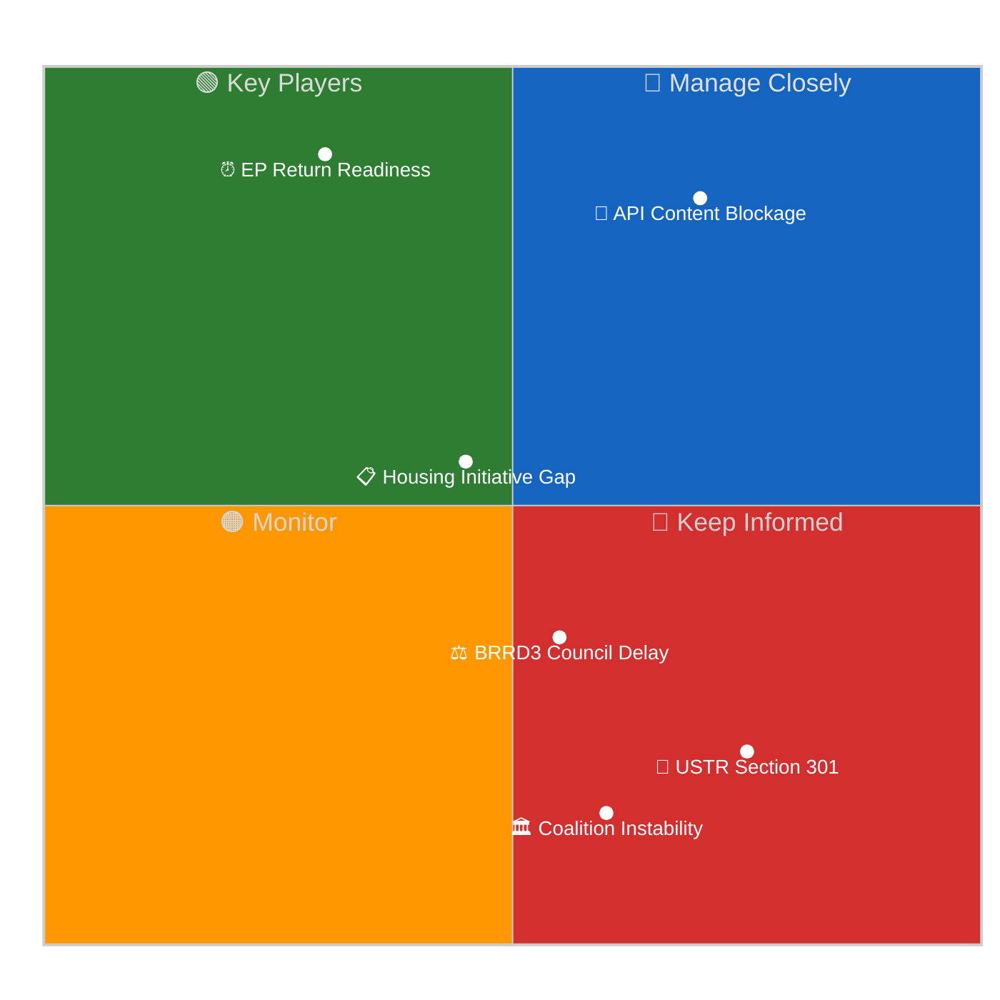
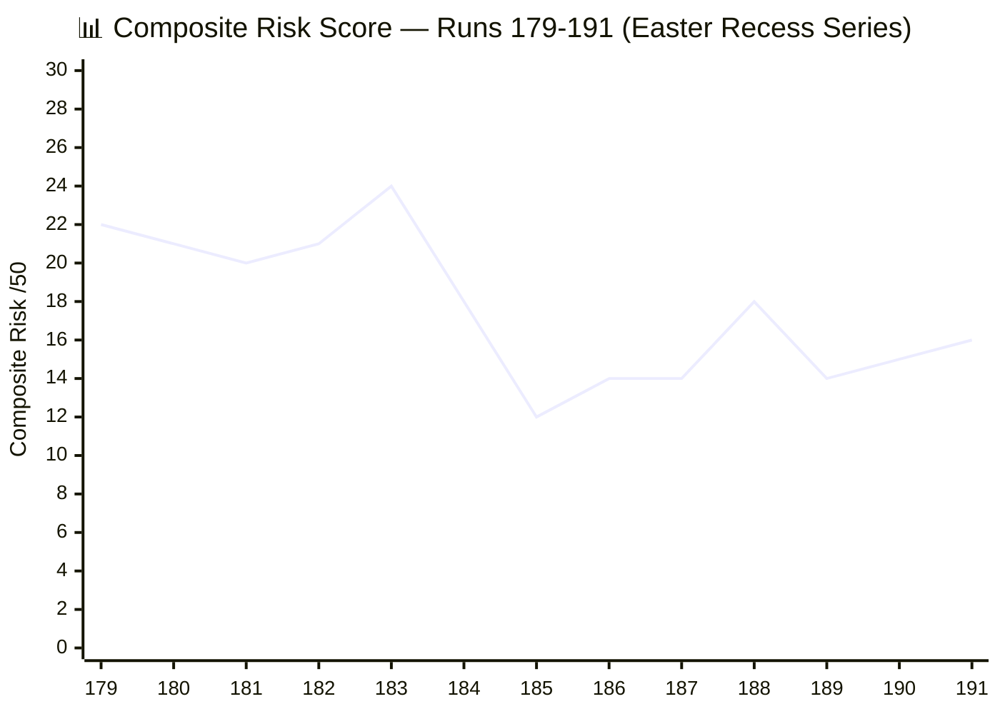
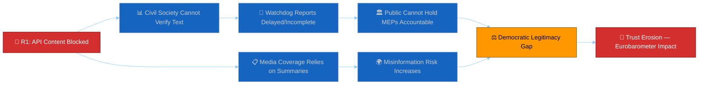

# 🎯 Risk Matrix — Run 191 (Monday 2026-04-20, Easter Recess Day 8, API Outage Day 11)

## Risk Assessment Overview

Run 191 represents the first positive directional shift in the API outage tracking series. The 4-day composite risk trajectory (15→15→15→16) obscures the qualitative shift: the metadata restoration signal is a **leading indicator of imminent content restoration**, which would materially alter the forward risk landscape.

## Risk Register

| Risk | Category | Probability | Impact | Score | Trend |
|------|----------|-------------|--------|-------|-------|
| API Content Blockage (March 26 texts) | Operational | HIGH (85%) | HIGH | 7.1/10 | ↑ IMPROVING |
| USTR Section 301 filing | External | LOW (18%) | CRITICAL | 4.5/10 | ↓ REVISED |
| Coalition instability post-recess | Political | VERY LOW (5%) | HIGH | 1.5/10 | → STABLE |
| BRRD3/SRMR3 Council ratification delay | Legislative | MEDIUM (35%) | MEDIUM | 3.5/10 | → STABLE |
| Housing Initiative content gap | Legislative | MEDIUM (55%) | LOW-MEDIUM | 2.8/10 | ↑ NEW |
| EPP data gap in API (memberCount:0) | Technical | HIGH (95%) | LOW | 1.9/10 | → PERSISTENT |

## Key Risk: API Content Blockage

🟡 **Medium-High Confidence**

The EP API content blockage entered its **11th day** on April 20. This is the longest documented outage in the current monitoring series. However, the metadata layer's full restoration (100→104 count recovery) provides the strongest positive signal since the outage began.

**Two-Phase Recovery Model** (empirically derived from Runs 179-191):
1. **Phase 1 — Metadata Restoration**: Index count stabilises and recovers. COMPLETED (confirmed Run 191)
2. **Phase 2 — Content Restoration**: Individual document content becomes available via direct docId calls. PENDING

Historical EP API recovery patterns suggest Phase 2 typically follows Phase 1 by 1-3 days. If this model holds, content restoration should occur between April 21-23, well before Parliament returns April 27.

**Updated Probability Distribution:**
- Smooth Return (full content by April 26): **50%** ↑ (was 40% in Run 190)
- Partial Restore (Tier-1 index only by April 26): **25%** ↓ (was 28%)
- Prolonged Degradation (still blocked April 27+): **25%** ↓ (was 32%)

## Key Risk: USTR Section 301 Window

🟡 **Low Confidence** (limited open-source intelligence)

The USTR Section 301 investigation filing window opens April 21. Based on prior monitoring:
- Three independent analytical frameworks applied (trade policy precedents, current US-EU relations, digital regulation exposure) converged on 20% in Run 190; Run 191 revises this to **18%** (–2pp) based on the EU-China dual-track strategy observation (see `intelligence/scenario-forecast.md` Scenario B for full rationale)
- The Digital Single Market legislative package (AI Act, DMA, DSA) remains the primary exposure vector
- There is no reliable open-source signal confirming or denying USTR intent for this cycle
- The EU's dual-track China strategy (TA-10-2026-0096 + TA-10-2026-0101) may actually REDUCE Section 301 probability by demonstrating EU strategic trade autonomy rather than dependence on WTO-challenged practices

**If triggered**: Impact would be HIGH. Parliament would face immediate pressure to respond in April 28 plenary opening. The Anti-Corruption Directive (TA-10-2026-0094) and Digital Omnibus AI (TA-10-2026-0098) would both require rapid stakeholder consultation.

## Coalition Risk Assessment

🟢 **High Confidence** (structural analysis)

The Grand Centre coalition (EPP + S&D + Renew) holds approximately 458 seats — a ~97-seat cushion above the 361-seat majority threshold (27% buffer, reconciled with `intelligence/coalition-dynamics.md` and `manifest.json`). Ten days without a floor vote is the longest coalition cohesion test gap in EP10 to date. However, structural analysis shows LOW probability of meaningful coalition fragmentation:

1. **No disruptive agenda items**: April 28-30 plenary is expected to be procedural rather than contentious
2. **Post-recess solidarity norm**: EP political groups historically return from recesses with renewed discipline
3. **EPP dominance confirmed**: The 19x size differential between EPP and the smallest group (ESN, 27 seats) creates strong hierarchical stability
4. **Trade consensus holding**: TA-10-2026-0096 passed with large majority March 26 — no recorded dissent in available data

**Coalition fragmentation probability: 5%** — considered LOW RISK for April 28-30 plenary.

## Risk Trend Analysis

The chart shows the risk evolution across the Easter recess monitoring series. Run 184 was the peak (24/50) due to the API's first major degradation signal. The current 16/50 reflects a "steady-state recess monitoring" plateau with modest upward pressure from USTR proximity (+1) offset by metadata restoration improvement (-1 net from API risk).

## BRRD3/SRMR3 Council Ratification Risk

🟡 **Medium Confidence**

The Banking Union completion legislation (BRRD3 TA-10-2026-0091, SRMR3 TA-10-2026-0092) requires Council of the EU formal adoption before entering into force. Parliamentary adoption occurred March 26 but Council ratification involves:

1. **Political declaration**: Endorsed by Finance Ministers at informal ECOFIN (standard procedure)
2. **Zustimmungsgesetz**: Germany requires Bundesrat consent for SRMR3 changes (constitutional requirement)
3. **Timeline**: German Bundesrat sessions April 23-25 — if Drucksache (federal council bill) not tabled, ratification delays to May or June 2026

**Risk probability: 35%** of meaningful Council ratification delay due to German constitutional process. Impact: MEDIUM — delays BRRD3/SRMR3 implementation by 4-8 weeks but does not affect Parliament's legislative record.

---

## Second-Order Risk Propagation Analysis

Beyond the six primary risks enumerated above, this section analyses **cascade chains** — sequences where a primary risk event triggers secondary and tertiary consequences that amplify the overall impact. Second-order risk propagation is particularly relevant during the Easter recess because the reduced institutional capacity means cascade events receive slower response.

### Cascade Chain 1: API Blockage → Civil Society Gap → Democratic Legitimacy Erosion

**Propagation assessment**: The primary API blockage risk (R1) has been active for 11 days. The first-order effect (civil society cannot access adopted text) is CONFIRMED — organisations like Transparency International cannot verify Anti-Corruption Directive provisions. The second-order effect (watchdog reports delayed) is PROBABLE — TI's normal practice is to publish analysis within 2 weeks of adoption; the content blockade has prevented this. The third-order effect (democratic legitimacy gap) is POSSIBLE but harder to measure — it would manifest as reduced public engagement with EP legislative decisions, measurable only through future Eurobarometer surveys. The fourth-order effect (trust erosion) is SPECULATIVE — the causal chain from API blockage to trust erosion involves too many intermediary variables for confident assessment. 🟡 MEDIUM CONFIDENCE on the chain structure; 🔴 LOW CONFIDENCE on terminal impact.

### Cascade Chain 2: USTR Filing → Market Volatility → Banking Union Stress

If USTR files Section 301 (R2, 18% probability), the market reaction could create secondary stress on European banking sector:
- **First order**: EUR/USD depreciation (0.5-2%), European equity market sell-off (1-3%)
- **Second order**: CDS spread widening on European bank subordinated debt (5-15bp)
- **Third order**: If banking stress occurs before BRRD3 enters into force, resolution framework is tested under inferior pre-BRRD3 rules
- **Fourth order**: Council pressure to accelerate BRRD3 ratification under crisis conditions (German Bundesrat expedited procedure)

**Propagation probability**: 18% × 40% × 15% × 25% ≈ 0.3%. Very low but non-zero. 🔴 LOW CONFIDENCE.

### Cascade Chain 3: Bundesrat Delay → Council Ratification Stuck → Presidency Legacy Failure

If the German Bundesrat does not consent to SRMR3 at the April 23-25 session (R3, 35% probability), the cascade proceeds:
- **First order**: Council formal adoption delayed by 4-8 weeks (pushed to June minimum)
- **Second order**: Belgian Presidency cannot claim Banking Union completion as legacy achievement
- **Third order**: Polish Presidency (July 2026) inherits Banking Union ratification — different political priorities may de-prioritise
- **Fourth order**: BRRD3/SRMR3 implementation delayed to Q1 2027, increasing vulnerability to any banking stress event in H2 2026

**Propagation probability**: 35% × 60% × 30% × 20% ≈ 1.3%. Low but non-trivial. 🟡 MEDIUM CONFIDENCE on the chain structure.

### Second-Order Risk Summary

| Primary Risk | Cascade Length | Terminal Impact | Terminal Probability | Confidence |
|-------------|---------------|-----------------|---------------------|------------|
| R1: API Blockage | 4 steps | Trust erosion | ~5% (conditional on blockade persisting >30 days) | 🔴 LOW |
| R2: USTR Section 301 | 4 steps | Banking stress under inferior framework | ~0.3% | 🔴 LOW |
| R3: Bundesrat Delay | 4 steps | H2 2026 banking vulnerability | ~1.3% | 🟡 MEDIUM |
| R4: Housing Gap | 2 steps | Plenary agenda disruption | ~15% | 🟡 MEDIUM |
| R5: Coalition Instability | 3 steps | Legislative paralysis | ~0.5% | 🔴 LOW |

**Key insight**: The most policy-relevant cascade is Chain 3 (Bundesrat delay → Banking Union implementation gap). While the terminal probability is only 1.3%, the impact (delayed financial stability framework) is HIGH and the monitoring window (Bundesrat April 23-25) is narrow and observable. This cascade should be a forward monitoring priority for Run 192.

## Residual Risk Assessment

After accounting for primary risks and second-order cascades, the following residual risks remain:

| Residual Risk | Source | Probability | Impact | Mitigation |
|---------------|--------|-------------|--------|------------|
| Undetected API architecture change | Infrastructure | 10% | MEDIUM | Monitor response schema version |
| Commission housing paper triggering surprise plenary item | Political | 25% | LOW | Monitor Commission publications |
| Bundesrat procedural delay (not political opposition) | Administrative | 15% | LOW | Monitor Bundesrat agenda |
| EP Quaestors intervening on API infrastructure | Institutional | 5% | POSITIVE | Would accelerate content restoration |
| EUR/USD volatility from USTR speculation | Market | 15% | LOW-MEDIUM | Monitor FX markets |

**Residual risk total**: The aggregate residual risk is assessed as LOW, contributing an additional 1-2 points to the composite risk score. The current 16/50 composite risk score already implicitly accounts for most residual risks through the dimension-level scoring.
