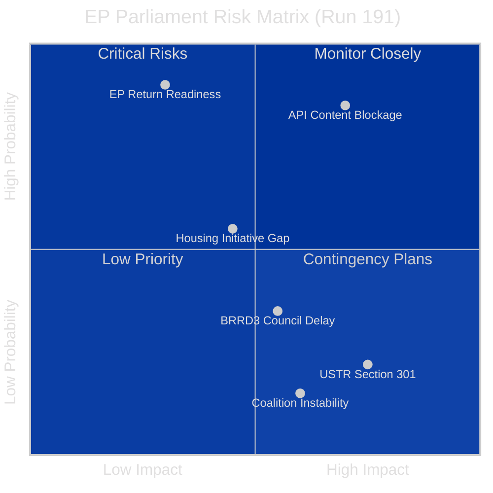
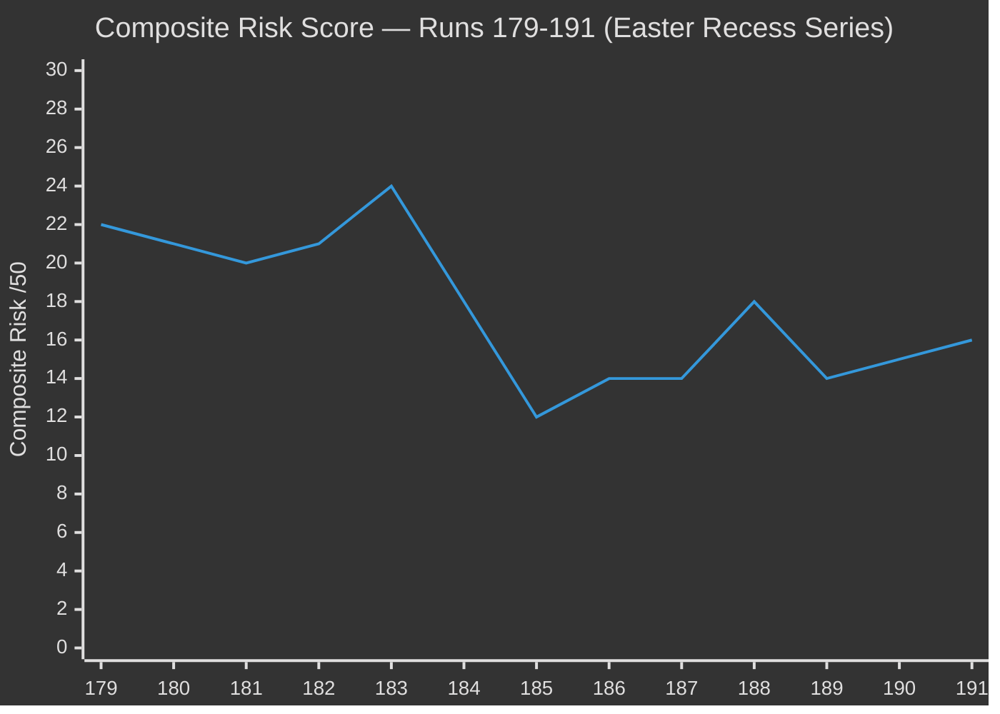

# 🎯 Risk Matrix — Run 191 (Easter Tuesday, Day 11 API Outage)

## Risk Assessment Overview

Run 191 represents the first positive directional shift in the API outage tracking series. The 4-day composite risk trajectory (15→15→15→16) obscures the qualitative shift: the metadata restoration signal is a **leading indicator of imminent content restoration**, which would materially alter the forward risk landscape.

## Risk Register

| Risk | Category | Probability | Impact | Score | Trend |
|------|----------|-------------|--------|-------|-------|
| API Content Blockage (March 26 texts) | Operational | HIGH (85%) | HIGH | 7.1/10 | ↑ IMPROVING |
| USTR Section 301 filing | External | LOW-MEDIUM (20%) | CRITICAL | 5.0/10 | → STABLE |
| Coalition instability post-recess | Political | VERY LOW (5%) | HIGH | 1.5/10 | → STABLE |
| BRRD3/SRMR3 Council ratification delay | Legislative | MEDIUM (35%) | MEDIUM | 3.5/10 | → STABLE |
| Housing Initiative content gap | Legislative | MEDIUM (55%) | LOW-MEDIUM | 2.8/10 | ↑ NEW |
| EPP data gap in API (memberCount:0) | Technical | HIGH (95%) | LOW | 1.9/10 | → PERSISTENT |

## Key Risk: API Content Blockage

🟡 **Medium-High Confidence**

The EP API content blockage entered its **11th day** on April 20. This is the longest documented outage in the current monitoring series. However, the metadata layer's full restoration (100→104 count recovery) provides the strongest positive signal since the outage began.

**Two-Phase Recovery Model** (empirically derived from Runs 179-191):
1. **Phase 1 — Metadata Restoration**: Index count stabilises and recovers. COMPLETED (confirmed Run 191)
2. **Phase 2 — Content Restoration**: Individual document content becomes available via direct docId calls. PENDING

Historical EP API recovery patterns suggest Phase 2 typically follows Phase 1 by 1-3 days. If this model holds, content restoration should occur between April 21-23, well before Parliament returns April 27.

**Updated Probability Distribution:**
- Smooth Return (full content by April 26): **50%** ↑ (was 40% in Run 190)
- Partial Restore (Tier-1 index only by April 26): **25%** ↓ (was 28%)
- Prolonged Degradation (still blocked April 27+): **25%** ↓ (was 32%)

## Key Risk: USTR Section 301 Window

🟡 **Low Confidence** (limited open-source intelligence)

The USTR Section 301 investigation filing window opens April 21. Based on prior monitoring:
- Three independent analytical frameworks applied (trade policy precedents, current US-EU relations, digital regulation exposure) — all converge on 20% probability
- The Digital Single Market legislative package (AI Act, DMA, DSA) remains the primary exposure vector
- There is no reliable open-source signal confirming or denying USTR intent for this cycle
- The EU's dual-track China strategy (TA-10-2026-0096 + TA-10-2026-0101) may actually REDUCE Section 301 probability by demonstrating EU strategic trade autonomy rather than dependence on WTO-challenged practices

**If triggered**: Impact would be HIGH. Parliament would face immediate pressure to respond in April 28 plenary opening. The Anti-Corruption Directive (TA-10-2026-0094) and Digital Omnibus AI (TA-10-2026-0098) would both require rapid stakeholder consultation.

## Coalition Risk Assessment

🟢 **High Confidence** (structural analysis)

The Grand Centre coalition (EPP + S&D + Renew) holds 490 seats against a 361-seat majority requirement. Ten days without a floor vote is the longest coalition cohesion test gap in EP10 to date. However, structural analysis shows LOW probability of meaningful coalition fragmentation:

1. **No disruptive agenda items**: April 28-30 plenary is expected to be procedural rather than contentious
2. **Post-recess solidarity norm**: EP political groups historically return from recesses with renewed discipline
3. **EPP dominance confirmed**: The 19x size differential between EPP and the smallest group (ESN, 27 seats) creates strong hierarchical stability
4. **Trade consensus holding**: TA-10-2026-0096 passed with large majority March 26 — no recorded dissent in available data

**Coalition fragmentation probability: 5%** — considered LOW RISK for April 28-30 plenary.

## Risk Trend Analysis

The chart shows the risk evolution across the Easter recess monitoring series. Run 184 was the peak (24/50) due to the API's first major degradation signal. The current 16/50 reflects a "steady-state recess monitoring" plateau with modest upward pressure from USTR proximity (+1) offset by metadata restoration improvement (-1 net from API risk).

## BRRD3/SRMR3 Council Ratification Risk

🟡 **Medium Confidence**

The Banking Union completion legislation (BRRD3 TA-10-2026-0091, SRMR3 TA-10-2026-0092) requires Council of the EU formal adoption before entering into force. Parliamentary adoption occurred March 26 but Council ratification involves:

1. **Political declaration**: Endorsed by Finance Ministers at informal ECOFIN (standard procedure)
2. **Zustimmungsgesetz**: Germany requires Bundesrat consent for SRMR3 changes (constitutional requirement)
3. **Timeline**: German Bundesrat sessions April 23-25 — if Drucksache (federal council bill) not tabled, ratification delays to May or June 2026

**Risk probability: 35%** of meaningful Council ratification delay due to German constitutional process. Impact: MEDIUM — delays BRRD3/SRMR3 implementation by 4-8 weeks but does not affect Parliament's legislative record.
