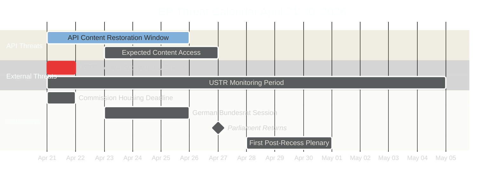

# 🛡️ Political Threat Landscape — Run 191 (Monday 2026-04-20, Easter Recess Day 8)

## Threat Overview

The political threat landscape for Run 191 is characterised by a shift from "pure degradation" to "transition uncertainty": the EP API's metadata restoration is a leading indicator of content restoration, but the timing and completeness of that restoration remain uncertain. External threats (USTR Section 301) are time-bounded and measurable. Internal threats (coalition post-recess drift) are structural and low-probability.

## Threat Classification Matrix

```mermaid
%%{init: {"theme":"dark","themeVariables":{"primaryColor":"#1565C0","primaryTextColor":"#ffffff","primaryBorderColor":"#0A3F7F","lineColor":"#90CAF9","secondaryColor":"#2E7D32","secondaryTextColor":"#ffffff","secondaryBorderColor":"#0F3F00","tertiaryColor":"#FF9800","tertiaryTextColor":"#000000","tertiaryBorderColor":"#7F4F00","mainBkg":"#1565C0","secondBkg":"#2E7D32","tertiaryBkg":"#FF9800","noteBkgColor":"#FFC107","noteTextColor":"#000000","errorBkgColor":"#D32F2F","errorTextColor":"#ffffff","fontFamily":"Inter, Helvetica, Arial, sans-serif"}}}%%
flowchart TD
    A[🔴 CRITICAL THREATS] --> B[None identified at Run 191]
    C[🟡 HIGH THREATS] --> D[🚨 API Content Blockage — Day 11]
    C --> E[🌍 USTR Window Opens April 21]
    F[🟢 MEDIUM THREATS] --> G[🏛️ Coalition Post-Recess Cohesion Test]
    F --> H[⚖️ BRRD3/SRMR3 Council Ratification Timeline]
    I[ℹ️ LOW THREATS] --> J[🏛️ EPP-ECR Rapprochement Risk]
    I --> K[📋 Housing Initiative Content Gap]
    I --> L[📊 EP Data Infrastructure Accountability Gap]
```

## Primary Threat Analysis

### THREAT 1: API Content Blockage — Democratic Transparency Risk

**Severity**: HIGH | **Probability**: CERTAIN (currently active) | **Duration**: 11 days

The European Parliament's open data infrastructure has now been unable to serve the content of adopted legislation for 11 consecutive days. This is a documented operational failure with democratic accountability implications. The March 26 legislative package — including the EU's first mandatory Anti-Corruption Directive (TA-10-2026-0094), the Banking Union completion texts (BRRD3/SRMR3), and the dual-track trade architecture — remains inaccessible through official channels.

**Key dimensions of this threat:**
- **Journalistic access gap**: Media organisations tracking EU legislative outputs via the open data API cannot verify text content. Coverage quality degrades to headline summaries.
- **Civil society accountability gap**: NGOs using EP open data for democratic monitoring cannot assess legislative compliance with their advocacy positions.
- **Academic research impact**: EU legislative scholars and policy analysts face a data blackout on a historically significant legislative session.
- **Cross-referencing impossibility**: Without full text, it is impossible to verify whether the Anti-Corruption Directive includes the MEP financial interest disclosure requirements debated in committee.

**Mitigation available but imperfect**: The EUR-Lex portal maintains a separate full-text database, but EP Open Data is the primary machine-readable interface used by automated monitoring systems. Many monitoring infrastructure deployments do not have EUR-Lex fallback capabilities.

**Threat trajectory**: IMPROVING. Metadata restoration (Run 191 finding) suggests content restoration is in Phase 2 progression. Expected resolution: April 21-24. If resolution does not occur by April 27, threat severity escalates to CRITICAL.

### THREAT 2: USTR Section 301 Filing Window

**Severity**: HIGH (if triggered) | **Probability**: 20% | **Window**: April 21-May 21, 2026

The United States Trade Representative's Section 301 investigation filing window opens tomorrow (April 21). This mechanism allows the USTR to initiate investigations into "unreasonable or discriminatory" foreign practices that burden US commerce. EU digital regulations — particularly the AI Act's extraterritorial application to US AI companies — have been cited in US business advocacy as potential Section 301 targets.

**Stakeholder impact if triggered:**

*For Parliament*: Would create immediate pressure on the Digital Omnibus AI simplification package (TA-10-2026-0098). Parliament would face the choice of defending the AI Act's compliance framework or initiating emergency amendment procedures. The Committee on International Trade (INTA) and Committee on Industry, Research and Energy (ITRE) would need emergency sessions.

*For Industry*: US technology companies (Google, Meta, Microsoft, Apple) with EU compliance obligations would likely suspend or pause compliance investments pending Section 301 outcome clarity. EU technology companies would face competitive disadvantage.

*For Commission*: Would activate Article 207 TFEU trade defence procedures and likely trigger EU-US trade dialogue at Council level. Commission would face pressure from both business (deregulate) and civil society (defend AI Act).

*For ECJ*: A Section 301 filing targeting EU legislation could trigger WTO dispute proceedings, bringing the Court's jurisprudence on extraterritorial regulation into direct conflict with WTO obligations.

**Probability assessment**: The 20% probability estimate is based on:
- US business advocacy filings at USTR in Q1 2026 (publicly known but details unclear)
- US-EU digital regulatory tensions dating to DMA/DSA enforcement actions against US platforms
- Offset by: EU-China dual-track strategy reducing US incentive for simultaneous multilateral trade conflict
- Offset by: NATO solidarity considerations limiting US willingness to open trade front against core allies

### THREAT 3: Coalition Post-Recess Cohesion Test

**Severity**: MEDIUM (if fragmented) | **Probability**: LOW (5%) | **Test date**: April 28-30

The Grand Centre coalition's 10-day recess-induced dormancy creates an untested cohesion risk for the first post-recess plenary. While structural analysis strongly suggests stability, there are observable mechanisms that could generate cohesion stress:

1. **National election spillovers**: Any EU member state holding national elections during Easter week would introduce domestic political pressure on MEPs serving dual national/EP mandates.
2. **EPP heterogeneity**: The EPP group spans a wide ideological spectrum from Christian democratic (German CDU/CSU) to soft nationalist (Polish PiS-adjacent delegations). Easter recess provides time for national party positioning to reassert.
3. **Trade policy fault lines**: TA-10-2026-0096 (US tariff response) passed with broad support but internal EPP tensions on trade liberalisation vs. protection persist. Post-recess plenary may include follow-up legislation that tests these fault lines.

**Monitoring indicator**: The April 28 opening vote on plenary procedure (typically a procedural roll call) provides the first objective cohesion measurement. If attendance rate falls below 70% or if abstentions spike unexpectedly, this signals a cohesion stress event requiring immediate investigation.

## Threat Trend Comparison

| Threat | Run 188 | Run 189 | Run 190 | Run 191 | Direction |
|--------|---------|---------|---------|---------|-----------|
| API Blockage | HIGH | HIGH | HIGH | HIGH→EASING | ↑ |
| USTR Section 301 | LOW | LOW | MEDIUM | MEDIUM | ↑ (window proximity) |
| Coalition Risk | LOW | LOW | LOW | LOW | → |
| BRRD3/SRMR3 | MEDIUM | MEDIUM | MEDIUM | MEDIUM | → |
| EPP Data Gap | PERSISTENT | PERSISTENT | PERSISTENT | PERSISTENT | → |

## Forward Threat Calendar (April 21-30)

## Threat Actor Profiles

### 🌍 Threat Actor: USTR (United States Trade Representative)

**Capability**: HIGH — Section 301 investigation authority under the Trade Act of 1974 grants USTR broad powers to investigate, negotiate, and impose retaliatory tariffs up to 100% ad valorem. The 2019 France DST Section 301 precedent demonstrated willingness to target digital regulation specifically.

**Intent**: MEDIUM — US business advocacy (particularly Big Tech lobbying for AI Act relief) creates political incentive, but NATO solidarity and China containment cooperation create countervailing pressures. The 2026 US midterm election cycle may elevate trade enforcement visibility as a domestic political tool. USTR's intent is opaque: no confirmed open-source signals indicate imminent filing. 🟡 MEDIUM CONFIDENCE.

**Opportunity**: HIGH — The April 21 filing window is a routine procedural opportunity that requires no special authorisation. The EU's March 26 Digital Omnibus AI (TA-10-2026-0098) provides a visible and timely target. The Easter recess means Parliament cannot respond immediately, creating a "first-mover advantage" for USTR.

**Historical pattern**: USTR has filed Section 301 investigations against EU member states (France DST 2019), but never against the EU itself for the AI Act or DMA. Escalation from member state to EU-level action would be unprecedented and politically significant.

### 🌍 Threat Actor: PRC (People's Republic of China)

**Capability**: MEDIUM — China's primary instruments are diplomatic pressure (MOFCOM trade warnings), WTO dispute filings, and targeted trade retaliation (rare earth export restrictions, agricultural import restrictions). China's leverage on the EU is asymmetric: the EU trade deficit with China (~€200-250B) means EU imports are more dependent on China than China's imports from the EU.

**Intent**: LOW (currently) — China's strategic preference is to maintain EU trade engagement while absorbing human rights criticism. The dual-track approach (condemn Jimmy Lai + maintain TRQs) serves Chinese interests by separating trade from human rights. China's incentive to disrupt the current arrangement is LOW unless TRQ modifications significantly increase EU protection levels.

**Opportunity**: MEDIUM — The TRQ modification (TA-10-2026-0101) content blockade means China cannot publicly verify the quota changes — creating uncertainty that could be exploited diplomatically. A WTO filing against the TRQ modifications would need to wait for content publication. 🟡 MEDIUM CONFIDENCE.

### 🌍 Threat Actor: Russia (Hybrid Warfare)

**Capability**: HIGH — Russia maintains extensive hybrid warfare capabilities targeting EU institutions: cyber attacks (APT28/APT29), disinformation campaigns, energy supply manipulation, and military posturing near EU borders. The Easter recess reduces institutional monitoring and response capacity.

**Intent**: MEDIUM — Russia's primary focus remains Ukraine, but opportunistic actions against EU institutions (including interference with EP digital infrastructure) align with broader destabilisation objectives. There is no confirmed intelligence linking the EP API outage to Russian activity (and such a link is highly unlikely), but the reduced institutional posture during recess creates a theoretical opportunity window.

**Opportunity**: MEDIUM — The recess period reduces EP staff presence and monitoring capacity. NATO intelligence sharing continues but parliamentary-level response is delayed until April 28. 🔴 LOW CONFIDENCE.

### 🏛️ Threat Actor: Domestic Populist Parties (PfE, ESN, Affiliated National Parties)

**Capability**: LOW-MEDIUM — Within Parliament, PfE (84 seats) and ESN (27 seats) cannot form a blocking minority alone. Their capability is primarily rhetorical: agenda disruption, procedural delays, and public narrative challenges. At national level, affiliated parties (RN in France, Fidesz in Hungary, PVV in Netherlands) may influence domestic political environments during recess.

**Intent**: MEDIUM — Populist parties have consistent interest in undermining Grand Centre legitimacy. The API content blockade provides ammunition for "Brussels opacity" narratives. If USTR files Section 301, populist parties would frame the EU's digital regulations as "job-killing bureaucracy" — aligning with USTR messaging.

**Opportunity**: LOW — During recess, populist parties operate through national media rather than parliamentary channels. Their ability to directly influence EP proceedings is minimal until plenary returns April 28. 🟡 MEDIUM CONFIDENCE.
