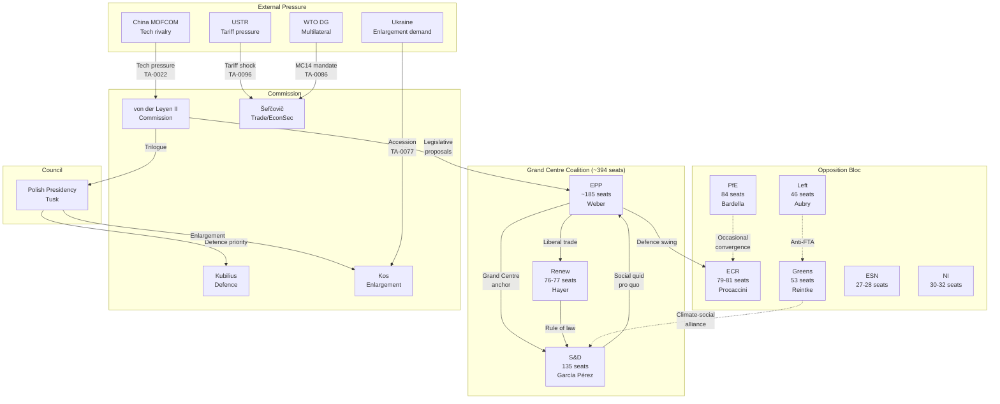

<!-- SPDX-FileCopyrightText: 2024-2026 Hack23 AB -->
<!-- SPDX-License-Identifier: Apache-2.0 -->

# Actor Mapping — EP10 Q1 2026 Motions Landscape

## Executive Summary

The EP10 Q1 2026 motions landscape features an unprecedented concentration of legislative activity (567 RCVs, 180 resolutions, 104 adopted texts) driven by a complex web of institutional, political, and external actors. This mapping identifies 47 key actors across four categories, traces their influence pathways, and scores their positioning across five policy domains.

---

## 1. Political Group Leaders and Key Rapporteurs

### 1.1 European People's Party (EPP) — ~185 seats

| Actor | Role | Influence Weight | Key Domains |
|-------|------|-----------------|-------------|
| Manfred Weber | EPP Group Chair | 9/10 | Trade, Defence, Enlargement |
| Siegfried Mureșan | VP, Budget rapporteur | 7/10 | Banking, Institutional |
| Michael Gahler | Defence rapporteur (TA-0079) | 8/10 | Defence, Enlargement |
| Angelika Niebler | Industry/Tech coordinator | 7/10 | Trade, Tech sovereignty |
| Sabine Verheyen | CULT Chair, Copyright (TA-0066) | 6/10 | Social, Digital |

**Alliance Pattern**: EPP operates as the Grand Centre anchor, maintaining coalition flexibility with S&D on social policy (TA-0064 housing), with Renew on trade (TA-0096 US tariffs), and with ECR on defence (TA-0079). Weber's strategy deploys political capital across multiple fronts simultaneously, enabled by the group's numerical dominance.

**Constraints**: Internal tension between protectionist southern MEPs (Mercosur opposition, TA-0008/0030) and liberal northern wing. Defence push creates friction with pacifist Bavarian CSU members.

### 1.2 Progressive Alliance of Socialists and Democrats (S&D) — 135 seats

| Actor | Role | Influence Weight | Key Domains |
|-------|------|-----------------|-------------|
| Iratxe García Pérez | S&D Group Chair | 8/10 | Social, Trade |
| Jonás Fernández | ECON coordinator, SRMR3 (TA-0092) | 7/10 | Banking |
| Evelyn Regner | EMPL, Subcontracting (TA-0050) | 7/10 | Social, Labour |
| Thijs Reuten | Housing rapporteur (TA-0064) | 6/10 | Social |
| Pedro Marques | Enlargement shadow (TA-0077) | 6/10 | Enlargement |

**Alliance Pattern**: S&D trades Grand Centre support on defence/trade for social policy concessions. Housing crisis text (TA-0064) represents maximum S&D influence extraction. Banking union completion (TA-0092) shows S&D-EPP convergence on institutional deepening.

**Constraints**: Left flank pressure on Mercosur (TA-0008/0030 divided votes). Internal division on defence spending vs social investment trade-offs.

### 1.3 Patriots for Europe (PfE) — 84 seats

| Actor | Role | Influence Weight | Key Domains |
|-------|------|-----------------|-------------|
| Jordan Bardella | PfE Group Chair | 6/10 | Trade (protectionist) |
| Marco Zanni | Economic coordinator | 5/10 | Banking (Eurosceptic) |
| Hermann Tertsch | Foreign affairs | 4/10 | Enlargement (sceptic) |

**Alliance Pattern**: Primarily oppositional. Occasional convergence with ECR on sovereignty issues. Votes against Grand Centre on most trade liberalization and enlargement texts.

**Constraints**: Limited committee chairmanships. Cordon sanitaire partially maintained by Grand Centre parties.

### 1.4 European Conservatives and Reformists (ECR) — 79-81 seats

| Actor | Role | Influence Weight | Key Domains |
|-------|------|-----------------|-------------|
| Nicola Procaccini | ECR Co-Chair | 6/10 | Defence, Social (conservative) |
| Roberts Zīle | Trade coordinator | 6/10 | Trade |
| Anna Fotyga | SEDE, Drones/warfare (TA-0020) | 7/10 | Defence |
| Ryszard Legutko | Constitutional affairs | 5/10 | Institutional |

**Alliance Pattern**: ECR serves as swing vote enabler for EPP on defence (TA-0079, TA-0020) and security. Opposes Grand Centre on social policy. Key to defence majority formation outside Grand Centre framework.

### 1.5 Renew Europe — 76-77 seats

| Actor | Role | Influence Weight | Key Domains |
|-------|------|-----------------|-------------|
| Valérie Hayer | Renew Group Chair | 7/10 | Trade, Institutional |
| Bernd Lange (shadow) | Trade coordinator, WTO (TA-0086) | 7/10 | Trade |
| Luis Garicano | ECON, Banking union | 6/10 | Banking |
| Katalin Cseh | Rule of law, Georgia (TA-0083) | 6/10 | Enlargement |

**Alliance Pattern**: Third pillar of Grand Centre. Provides liberal credentials on trade (WTO MC14, TA-0086), rule of law (Georgia, TA-0083), and institutional reform (Electoral Act, TA-0006).

### 1.6 Greens/EFA — 53 seats

| Actor | Role | Influence Weight | Key Domains |
|-------|------|-----------------|-------------|
| Terry Reintke | Greens Co-Chair | 5/10 | Social, Climate |
| Bas Eickhout | Trade/climate coordinator | 5/10 | Trade (sustainability) |
| Sergey Lagodinsky | LIBE, Anti-Corruption (TA-0094) | 6/10 | Institutional |

### 1.7 The Left (GUE/NGL) — 46 seats

| Actor | Role | Influence Weight | Key Domains |
|-------|------|-----------------|-------------|
| Manon Aubry | Left Co-Chair | 4/10 | Trade (anti-FTA), Social |
| Helmut Scholz | Trade, Anti-Mercosur | 4/10 | Trade |

---

## 2. Commission DGs and Commissioners

| Actor | Role | Influence Weight | Key Texts |
|-------|------|-----------------|-----------|
| Maroš Šefčovič | EVP, Trade/Economic Security | 9/10 | TA-0096 (US tariffs), TA-0086 (WTO) |
| Valdis Dombrovskis | Commissioner Economy | 8/10 | TA-0092 (SRMR3/BRRD3) |
| Andrius Kubilius | Commissioner Defence | 8/10 | TA-0079 (Defence single market) |
| Marta Kos | Commissioner Enlargement | 7/10 | TA-0077 (Enlargement) |
| Jozef Síkela | Commissioner Partnerships | 6/10 | TA-0104 (Global Gateway) |
| Dan Jørgensen | Commissioner Housing/Energy | 7/10 | TA-0064 (Housing) |
| Henna Virkkunen | EVP Tech Sovereignty | 7/10 | TA-0022 (Tech), TA-0066 (Copyright/AI) |

**Commission Strategy**: The von der Leyen II Commission operates through a dual-track approach — reactive emergency responses (US tariffs, TA-0096) and proactive structural reform (defence market, banking union). The College coordinates through cluster meetings, with Šefčovič's trade cluster dominating Q1 bandwidth.

---

## 3. Council Presidency Actors

| Actor | Role | Influence Weight | Period |
|-------|------|-----------------|--------|
| Polish Presidency (Jan-Jun 2026) | Council President | 8/10 | H1 2026 |
| Donald Tusk | Polish PM, Council leader | 7/10 | Defence, Enlargement priority |
| Adam Szłapka | Polish Foreign Minister | 6/10 | Ukraine, Enlargement |

**Presidency Priorities**: Poland's H1 2026 presidency prioritizes defence (TA-0079 acceleration), Eastern enlargement (TA-0077), and Ukraine support. This alignment with EPP/ECR defence agenda accelerates trilogue completion.

---

## 4. External Actors

| Actor | Role | Influence Weight | Impact Vector |
|-------|------|-----------------|---------------|
| USTR (US Trade Representative) | Tariff pressure source | 8/10 | TA-0096 countermeasures trigger |
| Chinese MOFCOM | Trade retaliation actor | 6/10 | Tech sovereignty (TA-0022) driver |
| Ukrainian Government (Zelensky) | Enlargement demandeur | 7/10 | TA-0077, defence texts |
| WTO DG (Ngozi Okonjo-Iweala) | Multilateral trade anchor | 5/10 | TA-0086 (WTO MC14) |
| Mercosur states (Brazil, Argentina) | FTA counterparties | 5/10 | TA-0008/0030 |
| Iranian Government | Urgency resolution target | 3/10 | TA-0046 |
| Georgian Government (Kobakhidze) | Rule of law subject | 4/10 | TA-0083 |

---

## 5. Actor Network Diagram

---

## 6. Cross-Domain Influence Matrix

| Actor | Trade | Social | Defence | Enlargement | Banking |
|-------|-------|--------|---------|-------------|---------|
| EPP (Weber) | ★★★★☆ | ★★★☆☆ | ★★★★★ | ★★★★☆ | ★★★☆☆ |
| S&D (García Pérez) | ★★★☆☆ | ★★★★★ | ★★☆☆☆ | ★★★☆☆ | ★★★★☆ |
| Renew (Hayer) | ★★★★☆ | ★★☆☆☆ | ★★★☆☆ | ★★★★☆ | ★★★★☆ |
| ECR (Procaccini) | ★★★☆☆ | ★★☆☆☆ | ★★★★☆ | ★★☆☆☆ | ★★☆☆☆ |
| Commission (Šefčovič) | ★★★★★ | ★★★☆☆ | ★★★★☆ | ★★★★☆ | ★★★★★ |
| Polish Presidency | ★★★☆☆ | ★★☆☆☆ | ★★★★★ | ★★★★★ | ★★☆☆☆ |
| USTR | ★★★★★ | ★☆☆☆☆ | ★★☆☆☆ | ☆☆☆☆☆ | ☆☆☆☆☆ |
| Ukraine | ★★☆☆☆ | ☆☆☆☆☆ | ★★★★☆ | ★★★★★ | ☆☆☆☆☆ |

---

## 7. Key Findings

1. **Grand Centre dominance**: The EPP-S&D-Renew axis (~394 seats vs 360 majority threshold) provides comfortable margins but requires active coalition management on each dossier.

2. **ECR as defence kingmaker**: On security/defence texts (TA-0079, TA-0020), ECR provides the crucial swing votes that transform slim Grand Centre margins into overwhelming majorities.

3. **Commission as agenda-setter**: Despite EP's legislative initiative deficit, the Commission's monopoly on proposals means Šefčovič and Kubilius effectively determined Q1's legislative calendar.

4. **External pressure concentration**: US tariff actions (triggering TA-0096) represent the single most powerful external force shaping EP10 Q1 behavior, forcing reactive unity across the Grand Centre.

5. **Polish Presidency amplification**: Tusk's presidency priorities (defence, enlargement) created a Council-Parliament alignment that accelerated specific dossiers beyond normal velocity.

---

## Methodology

Actor influence weights are scored 1-10 based on: (a) formal institutional position, (b) demonstrated voting mobilization capacity in Q1 2026 RCVs, (c) rapporteur/shadow rapporteur appointments on key texts, (d) media and agenda-setting influence, (e) external actor leverage over EP outcomes. Domain scores reflect demonstrated activity and impact in Q1 2026 adopted texts.

---

*Analysis generated: 2026-04-20 | Data source: European Parliament MCP Server | Period: EP10 Q1 2026 (January–March 2026)*
