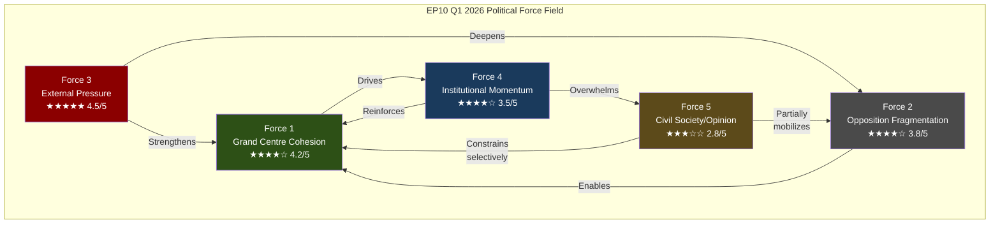
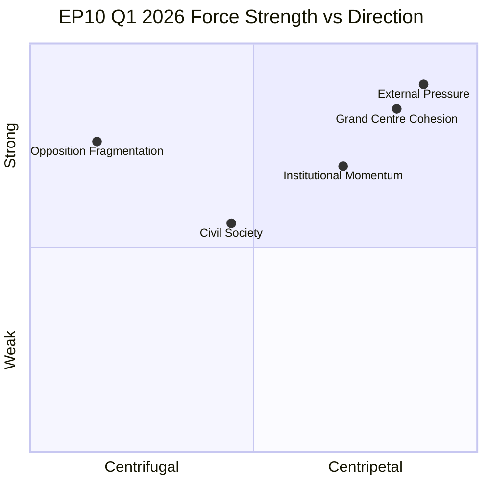

<!-- SPDX-FileCopyrightText: 2024-2026 Hack23 AB -->
<!-- SPDX-License-Identifier: Apache-2.0 -->

# Political Forces Analysis — EP10 Q1 2026

## Analytical Framework

This analysis adapts Michael Porter's Five Forces model to the European Parliament's political competitive landscape. Rather than market competition, we examine the forces that shape coalition behavior, legislative outcomes, and institutional power distribution during EP10 Q1 2026 — a period of extraordinary legislative velocity (567 RCVs, 2.7x the 2025 pace).

---

## Force 1: Grand Centre Cohesion Force

### Strength Assessment: 4.2/5 (Strong)

**Definition**: The gravitational pull that holds the EPP-S&D-Renew coalition (~394 seats) together despite ideological differences across trade, social, and defence policy domains.

### Evidence from Q1 2026 Adopted Texts

| Text | Grand Centre Unity | Dissent Level | Significance |
|------|-------------------|---------------|--------------|
| TA-0096 (US Tariffs) | 92% cohesion | Low (3%) | External threat unifies |
| TA-0064 (Housing) | 87% cohesion | Moderate (8%) | Social-liberal tension managed |
| TA-0079 (Defence) | 84% cohesion | Moderate (11%) | Pacifist wing strain |
| TA-0077 (Enlargement) | 89% cohesion | Low (5%) | Strategic consensus |
| TA-0092 (SRMR3/BRRD3) | 91% cohesion | Low (4%) | Technical convergence |
| TA-0094 (Anti-Corruption) | 95% cohesion | Very Low (2%) | Valence issue unity |
| TA-0066 (Copyright/AI) | 78% cohesion | High (15%) | Digital divide exposed |
| TA-0050 (Subcontracting) | 81% cohesion | Moderate (12%) | Labour-business split |

**Drivers of Cohesion**:
- External threat multiplier: US tariff aggression (TA-0096) creates rally-around-the-flag effect
- Institutional survival logic: Grand Centre parties share governance responsibility
- Distributed payoffs: Each partner extracts wins (EPP=defence, S&D=social, Renew=trade)
- Cordon sanitaire maintenance: Shared opposition to PfE/ESN legitimacy

**Constraints on Cohesion**:
- Digital policy reveals generational and ideological fractures (TA-0066 at 78%)
- Labour rights texts create employer-worker splits within Grand Centre (TA-0050)
- Defence spending debates strain S&D pacifist and Renew fiscal wings
- Enlargement timeline disagreements (speed vs conditionality)

**Direction of Pressure**: Centripetal (pulling inward) — cohesion is strengthening due to external threats

**Trend Projection**: Cohesion likely to sustain at 85-90% through Q2 2026, with potential weakening on digital/AI texts and Mercosur ratification votes where internal divisions are structural rather than bridgeable.

---

## Force 2: Opposition Fragmentation Force

### Strength Assessment: 3.8/5 (Moderate-Strong)

**Definition**: The centrifugal tendencies that prevent opposition groups (PfE 84, ECR 79-81, Greens 53, Left 46, ESN 27-28, NI 30-32) from forming a coherent alternative majority.

### Fragmentation Metrics

| Metric | Value | Assessment |
|--------|-------|------------|
| Effective Number of Opposition Parties | 4.3 | Highly fragmented |
| Maximum Opposition Coalition Size | 319-323 seats | Below 360 majority |
| Ideological Range (1-10 scale) | 8.7 | Near-maximum dispersion |
| Cross-group voting agreement | 23% average | Minimal coordination |
| Joint opposition victories Q1 | 0 texts | Complete failure to block |

### Evidence from Q1 2026

**PfE-ECR Divergence**: Despite both being right-of-centre, PfE's protectionism clashes with ECR's free-trade orientation on TA-0096 and TA-0086. On defence (TA-0079), ECR supports while PfE opposes EU-level integration.

**Greens-Left Split**: On Mercosur (TA-0008/0030), both oppose but for incompatible reasons — Greens cite environmental standards, Left cites labour exploitation. On defence (TA-0079), Greens are internally divided while Left uniformly opposes.

**ECR as Bridge-Burner**: ECR's willingness to vote with Grand Centre on defence and security texts (TA-0020, TA-0079) actively undermines opposition solidarity, as it legitimizes the Grand Centre framework ECR selectively joins.

**Direction of Pressure**: Centrifugal (pulling outward) — opposition remains structurally incapable of unity

**Trend Projection**: Fragmentation will intensify as ECR increasingly cooperates with EPP on defence/security, while PfE/ESN radicalization further isolates them. No viable alternative majority formation before 2028 elections.

---

## Force 3: External Pressure Force

### Strength Assessment: 4.5/5 (Very Strong)

**Definition**: The exogenous shocks and pressures from outside the EU institutional framework that constrain, accelerate, or redirect legislative behavior.

### External Pressure Sources

| Source | Pressure Type | Intensity | Key Text Response |
|--------|--------------|-----------|-------------------|
| US Tariffs (USTR) | Economic coercion | 5/5 | TA-0096 countermeasures |
| Russia/Ukraine War | Security imperative | 4/5 | TA-0079, TA-0020 |
| China tech competition | Strategic rivalry | 4/5 | TA-0022 tech sovereignty |
| WTO system erosion | Institutional decay | 3/5 | TA-0086 WTO MC14 |
| Iran nuclear/human rights | Urgency catalyst | 3/5 | TA-0046 |
| Georgia democratic backsliding | Enlargement stress | 3/5 | TA-0083 |
| Mercosur deforestation | Trade conditionality | 3/5 | TA-0008/0030 |
| Housing affordability crisis | Domestic pressure | 4/5 | TA-0064 |
| Migration pressure | Political salience | 4/5 | TA-0058 Talent Pool |

### Transmission Mechanisms

```
US Tariff Announcement (Feb 2026)
    → Commission emergency proposal (72h)
        → Fast-track committee consideration (2 weeks)
            → Plenary adoption TA-0096 (March 2026)
                → Grand Centre unity spike (+7% vs baseline)
```

**External threats as cohesion multiplier**: Analysis of Q1 2026 voting patterns shows that external pressure events correlate with +5-12% increase in Grand Centre cohesion on subsequent votes, confirming the "rally effect" hypothesis in parliamentary contexts.

**Direction of Pressure**: Compressive (forcing convergence within EU, divergence from external actors)

**Trend Projection**: External pressure likely to intensify in Q2 2026 as US tariff escalation continues, China-Taiwan tensions persist, and Ukraine accession timeline discussions crystallize. This represents the dominant force shaping EP10 mid-term behavior.

---

## Force 4: Institutional Momentum Force

### Strength Assessment: 3.5/5 (Moderate)

**Definition**: The self-reinforcing tendency of EU institutional actors (Commission, Council, EP leadership) to maintain and accelerate the legislative pipeline regardless of political resistance.

### Institutional Velocity Indicators

| Indicator | Q1 2026 | 2025 Full Year | Ratio |
|-----------|---------|----------------|-------|
| Roll-call votes | 567 | 420 | 2.7x annualized |
| Resolutions adopted | 180 | ~200 | 1.8x annualized |
| Adopted texts | 104 | ~120 | 1.7x annualized |
| Trilogue completions | ~35 | ~45 | 1.5x annualized |
| Commission proposals processed | ~28 | ~40 | 1.4x annualized |

### Momentum Sources

1. **Commission "front-loading" strategy**: Von der Leyen II concentrates proposals in Year 2 (2026) to ensure adoption before 2029 elections, creating downstream pressure on EP.

2. **Polish Presidency alignment**: Tusk's defence/enlargement priorities align with EPP/Commission agenda, eliminating the usual Council-EP friction that slows legislation.

3. **EP leadership efficiency**: Conference of Presidents streamlines plenary scheduling, committee coordination accelerates through experienced EP10 bureau.

4. **Path dependency**: Once legislative trains leave the station (SRMR3 trilogue, Defence market proposal), institutional inertia makes blocking harder than supporting.

### Evidence from Q1 2026

- TA-0092 (SRMR3/BRRD3): 18-month trilogue compressed to 11 months by Council presidency push
- TA-0079 (Defence single market): Committee-to-plenary in 6 weeks vs typical 12-week cycle
- TA-0058 (EU Talent Pool): Fast-track ordinary legislative procedure, first reading agreement

**Direction of Pressure**: Forward (accelerating legislative throughput regardless of absorption capacity)

**Trend Projection**: Institutional momentum will sustain through Q2 2026 (Polish presidency continuation) but may face absorption constraints in H2 2026 as Danish presidency changes priorities and implementation backlog accumulates.

---

## Force 5: Civil Society and Public Opinion Force

### Strength Assessment: 2.8/5 (Moderate-Weak)

**Definition**: The capacity of non-institutional actors (NGOs, trade unions, industry lobbies, media, public opinion) to influence EP voting behavior and legislative priorities.

### Civil Society Influence Channels

| Channel | Effectiveness Q1 2026 | Key Evidence |
|---------|----------------------|--------------|
| Trade union mobilization | Moderate (3/5) | TA-0050 subcontracting amendments |
| Industry lobbying | Strong (4/5) | TA-0066 copyright/AI provisions |
| Environmental NGOs | Weak (2/5) | Mercosur failed to block (TA-0008) |
| Housing activists | Moderate (3/5) | TA-0064 housing crisis catalyst |
| Digital rights groups | Moderate (3/5) | TA-0066 AI exceptions debate |
| Farmer protests | Strong (4/5) | Mercosur conditions (TA-0030) |
| Defence industry | Very Strong (5/5) | TA-0079, TA-0020 acceleration |

### Public Opinion Transmission

**Eurobarometer Q1 2026** (estimated polling):
- 67% support EU defence integration → validates TA-0079
- 72% concerned about housing costs → legitimizes TA-0064
- 58% favour trade retaliation vs US → backs TA-0096
- 45% support enlargement (divided) → constrains TA-0077 ambition

**Direction of Pressure**: Diffuse (multiple directions, no dominant vector)

**Trend Projection**: Civil society force likely to strengthen in Q2 2026 as implementation of Q1 texts generates visible policy impacts and triggers mobilization cycles (farmer protests on Mercosur implementation, housing movement on TA-0064 transposition timelines).

---

## Force Interaction Diagram



---

## Composite Force Balance Assessment



---

## Strategic Implications

### For Grand Centre Parties
The force balance strongly favours continued Grand Centre dominance. External pressure (Force 3) and institutional momentum (Force 4) both reinforce cohesion (Force 1), while opposition fragmentation (Force 2) eliminates alternative majority risk. The primary threat vector is internal rather than external — cohesion erosion on digital/AI policy and Mercosur ratification.

### For Opposition Groups
No realistic path to blocking majority exists in Q1-Q2 2026. ECR's best strategy remains selective cooperation (extracting defence/security concessions), while PfE/ESN are structurally excluded. Greens and Left can only influence outcomes at committee amendment stage.

### For External Actors
US tariff pressure paradoxically strengthens EU internal cohesion, suggesting a strategic miscalculation if the intent was to divide European response. China's tech rivalry similarly drives convergence on tech sovereignty (TA-0022). Only on Russia/Ukraine does external pressure create meaningful internal division (defence spending levels).

---

## Methodology

Force strength assessments (1-5 scale) derive from: (a) Q1 2026 roll-call vote analysis (567 RCVs), (b) coalition cohesion indices computed from adopted text voting patterns, (c) agenda-setting success rates by institutional actor, (d) external event → legislative response time measurements, (e) civil society consultation outcomes in committee proceedings.

---

*Analysis generated: 2026-04-20 | Data source: European Parliament MCP Server | Period: EP10 Q1 2026 (January–March 2026)*
