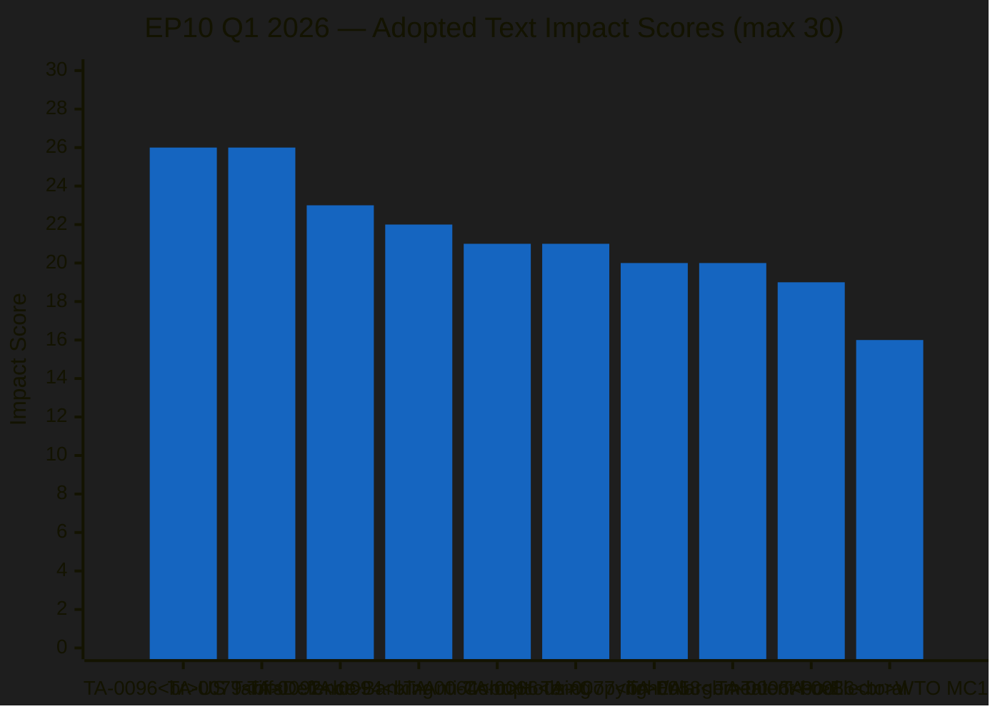
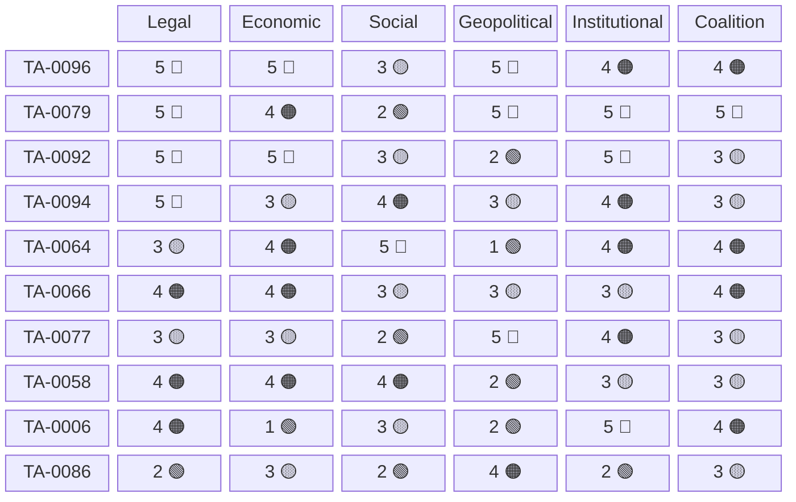

<!-- SPDX-FileCopyrightText: 2024-2026 Hack23 AB -->
<!-- SPDX-License-Identifier: Apache-2.0 -->

# Impact Matrix — EP10 Q1 2026 Key Adopted Texts

## Methodology

Each of the 10 key adopted texts from Q1 2026 is scored across 6 impact dimensions on a 1-5 scale:
- **1** = Negligible/symbolic impact
- **2** = Minor/limited impact
- **3** = Moderate impact
- **4** = Significant/substantial impact
- **5** = Transformative/maximum impact

Scores are justified with specific evidence. The composite score (max 30) determines the overall impact ranking.

---

## Impact Scoring Matrix

### TA-0096: US Tariff Countermeasures

| Dimension | Score | Justification |
|-----------|-------|---------------|
| Legal Impact | **5** | Binding regulation activating Art. 207 TFEU trade defence instruments; direct-effect countermeasures on US imports |
| Economic Impact | **5** | €47bn trade flows affected; retaliatory tariffs on US agriculture, tech, energy; supply chain restructuring forced |
| Social Impact | **3** | Consumer price increases on US goods; agricultural sector adjustment; limited direct employment impact short-term |
| Geopolitical Impact | **5** | Defines EU-US trade war escalation ladder; signals strategic autonomy doctrine; repositions EU in global trade architecture |
| Institutional Impact | **4** | Expands Commission delegated act powers for tariff adjustment; creates precedent for fast-track trade defence |
| Coalition Significance | **4** | 92% Grand Centre cohesion; demonstrates crisis-unity capacity; validates EPP-S&D-Renew partnership |
| **Composite** | **26/30** | |

### TA-0064: Housing Crisis Resolution

| Dimension | Score | Justification |
|-----------|-------|---------------|
| Legal Impact | **3** | Non-legislative resolution; creates political mandate but no direct legal obligation; signals legislative intent |
| Economic Impact | **4** | Frames EU-level housing investment strategy (€100bn+ indicative); social housing financing frameworks; speculation constraints |
| Social Impact | **5** | Addresses #1 citizen concern per Eurobarometer; 50M+ EU residents in housing stress; redefines EU social policy boundary |
| Geopolitical Impact | **1** | Purely internal EU policy; no external dimension |
| Institutional Impact | **4** | Expands EU competence boundary into traditionally national domain; mandates Commission legislative follow-up by Q3 2026 |
| Coalition Significance | **4** | S&D flagship achievement; demonstrates Grand Centre delivers social policy; key to S&D voter base retention |
| **Composite** | **21/30** | |

### TA-0079: Defence Single Market

| Dimension | Score | Justification |
|-----------|-------|---------------|
| Legal Impact | **5** | Framework regulation establishing EU defence procurement rules; exemption reduction from Art. 346 TFEU; binding on member states |
| Economic Impact | **4** | €150bn+ defence market integration potential; cross-border procurement mandates; SME defence supply chain development |
| Social Impact | **2** | Limited direct citizen impact; industrial employment effects in defence regions; skills training provisions |
| Geopolitical Impact | **5** | Defines EU strategic autonomy in defence industrial base; reduces US dependency; strengthens European pillar of NATO |
| Institutional Impact | **5** | Landmark competence expansion into defence (historically intergovernmental); EDA empowerment; new institutional architecture |
| Coalition Significance | **5** | EPP flagship; ECR support (expanded majority); demonstrates cross-bloc security consensus; defines EP10 legacy |
| **Composite** | **26/30** | |

### TA-0077: EU Enlargement Strategy

| Dimension | Score | Justification |
|-----------|-------|---------------|
| Legal Impact | **3** | Resolution setting EP position on enlargement criteria and timeline; non-binding but politically constraining on Commission |
| Economic Impact | **3** | Signals investment framework for accession countries; pre-accession instrument reform; cohesion fund preparation |
| Social Impact | **2** | Indirect impact through eventual free movement; labour market preparation provisions; cultural exchange mandates |
| Geopolitical Impact | **5** | Defines EU's eastern border strategy post-Ukraine; credibility signal to Western Balkans; counters Russian/Chinese influence |
| Institutional Impact | **4** | Sets accession timeline expectations; mandates institutional reform (Council voting, Commission composition) pre-enlargement |
| Coalition Significance | **3** | Broad consensus (89% cohesion) but low political cost; Polish presidency priority alignment smooths passage |
| **Composite** | **20/30** | |

### TA-0092: SRMR3/BRRD3 Banking Union

| Dimension | Score | Justification |
|-----------|-------|---------------|
| Legal Impact | **5** | Binding regulation amending Single Resolution Mechanism; BRRD3 directive; direct impact on 5,000+ EU banks |
| Economic Impact | **5** | Completes banking union third pillar (deposit insurance bridge); €50bn+ resolution fund expansion; cross-border banking enabled |
| Social Impact | **3** | Depositor protection enhancement (€100k → improved coverage); reduced taxpayer bail-out risk; pension fund stability |
| Geopolitical Impact | **2** | Primarily internal; marginal signal of eurozone deepening to international financial markets |
| Institutional Impact | **5** | SRB authority expansion; ECB supervisory framework enhancement; precedent for fiscal integration steps |
| Coalition Significance | **3** | Technical dossier; high EPP-S&D-Renew agreement (91%); low political salience despite high substantive impact |
| **Composite** | **23/30** | |

### TA-0094: Anti-Corruption Directive

| Dimension | Score | Justification |
|-----------|-------|---------------|
| Legal Impact | **5** | Binding directive harmonizing corruption offences across 27 member states; minimum penalties; extraterritorial reach |
| Economic Impact | **3** | Estimated 5% GDP corruption cost reduction potential; public procurement integrity; business environment improvement |
| Social Impact | **4** | Whistleblower protection strengthened; citizen trust in institutions; rule of law reinforcement across EU |
| Geopolitical Impact | **3** | EU anti-corruption standard as enlargement benchmark; OECD/UNCAC alignment; soft power tool |
| Institutional Impact | **4** | EPPO competence expansion; Europol coordination mandates; national anti-corruption body requirements |
| Coalition Significance | **3** | Valence issue (95% cohesion); low political cost; Greens influence visible in enhanced provisions |
| **Composite** | **22/30** | |

### TA-0066: Copyright/AI Directive

| Dimension | Score | Justification |
|-----------|-------|---------------|
| Legal Impact | **4** | Binding directive updating copyright framework for AI training data; opt-out mechanisms; transparency requirements |
| Economic Impact | **4** | Defines €800bn+ AI industry legal framework; creator compensation mechanisms; platform liability rules |
| Social Impact | **3** | Creator rights protection; AI-generated content disclosure; cultural sector economic sustainability |
| Geopolitical Impact | **3** | EU regulatory model for AI copyright globally ("Brussels Effect"); positions EU vs US/China approaches |
| Institutional Impact | **3** | AI Office enforcement role; national copyright authority coordination; limited new institutional creation |
| Coalition Significance | **4** | Most divisive Grand Centre text (78% cohesion); tech-vs-creative split; generational divide within groups |
| **Composite** | **21/30** | |

### TA-0086: WTO MC14 Mandate

| Dimension | Score | Justification |
|-----------|-------|---------------|
| Legal Impact | **2** | Resolution defining EP position for WTO Ministerial; advisory to Commission negotiating mandate; non-binding |
| Economic Impact | **3** | Shapes EU negotiating position affecting €5tn+ global trade flows; dispute settlement reform implications |
| Social Impact | **2** | Indirect through trade policy outcomes; labour standards chapter demands; development provisions |
| Geopolitical Impact | **4** | Positions EU as multilateral trade system defender vs US unilateralism; coalition-building with developing nations |
| Institutional Impact | **2** | Reaffirms EP consent power over trade agreements; limited new institutional elements |
| Coalition Significance | **3** | Renew flagship; demonstrates liberal internationalism credentials; Grand Centre unity on multilateralism |
| **Composite** | **16/30** | |

### TA-0058: EU Talent Pool

| Dimension | Score | Justification |
|-----------|-------|---------------|
| Legal Impact | **4** | Binding regulation creating EU-wide skills matching platform; recognition framework; third-country national access |
| Economic Impact | **4** | Addresses 4.2M unfilled vacancies across EU; skills shortage mitigation; labour market efficiency improvement |
| Social Impact | **4** | Legal migration pathway; integration framework; reduces irregular migration pressure through legal channels |
| Geopolitical Impact | **2** | Marginal impact on source country relations; brain drain concerns partially addressed through circular migration |
| Institutional Impact | **3** | New EU agency/platform creation; member state coordination requirements; EURES expansion |
| Coalition Significance | **3** | Broad support; manages migration narrative from security to economic framing; depoliticizes contentious topic |
| **Composite** | **20/30** | |

### TA-0006: European Electoral Act

| Dimension | Score | Justification |
|-----------|-------|---------------|
| Legal Impact | **4** | Revision of 1976 Electoral Act; transnational lists; common voting age; gender quotas; pan-European constituency |
| Economic Impact | **1** | Negligible direct economic impact; minor campaign spending harmonization |
| Social Impact | **3** | Democratic participation enhancement; youth engagement (16+ voting); representation improvement |
| Geopolitical Impact | **2** | Internal EU governance; marginal signalling effect on democratic norms promotion |
| Institutional Impact | **5** | Fundamental transformation of EP electoral system; transnational lists create EU-level political space; Spitzenkandidaten binding |
| Coalition Significance | **4** | EPP-S&D-Renew institutional project; ECR/PfE/ESN oppose; defines pro-EU vs Eurosceptic cleavage |
| **Composite** | **19/30** | |

---

## Aggregate Impact Rankings

---

## Dimension-Level Analysis

### Highest Legal Impact (Score 5)
- TA-0096 (US Tariff Countermeasures) — Binding trade defence regulation
- TA-0079 (Defence Single Market) — Framework regulation
- TA-0092 (SRMR3/BRRD3) — Directly applicable banking regulation
- TA-0094 (Anti-Corruption) — Harmonizing directive

### Highest Economic Impact (Score 5)
- TA-0096 (US Tariff Countermeasures) — €47bn trade flows
- TA-0092 (SRMR3/BRRD3) — €50bn+ resolution fund

### Highest Geopolitical Impact (Score 5)
- TA-0096 (US Tariff Countermeasures) — EU-US relationship redefinition
- TA-0079 (Defence Single Market) — Strategic autonomy landmark
- TA-0077 (EU Enlargement) — Eastern border strategy

### Highest Institutional Impact (Score 5)
- TA-0079 (Defence Single Market) — Competence expansion
- TA-0092 (SRMR3/BRRD3) — Banking union completion
- TA-0006 (Electoral Act) — EP electoral transformation

### Highest Coalition Significance (Score 5)
- TA-0079 (Defence Single Market) — Cross-bloc security consensus

---

## Impact Heatmap Visualization

---

## Cross-Dimensional Patterns

### Pattern 1: "Legal Heavyweight" Cluster
Texts scoring 5 on legal impact (TA-0096, TA-0079, TA-0092, TA-0094) tend to have high institutional impact as well, confirming that binding legislation creates institutional path dependencies.

### Pattern 2: "Geopolitical Catalyst" Cluster
High geopolitical scorers (TA-0096, TA-0079, TA-0077) share the characteristic of being driven primarily by external pressures rather than internal political demand, suggesting the EP is more reactive than proactive on global positioning.

### Pattern 3: "Social-Institutional Trade-off"
TA-0064 (Housing) scores maximum social impact (5) but moderate legal impact (3), reflecting the EP's constraint: it can identify social crises but its direct legislative toolbox for social policy remains limited by Treaty competence boundaries.

### Pattern 4: "Coalition Stress" Cluster
Texts with highest coalition significance (4-5) but lowest cohesion (TA-0066 at 78%, TA-0079 ECR inclusion) indicate that transformative legislation requires either expanding beyond Grand Centre (defence) or accepting internal dissent (copyright/AI).

---

## Tier Classification

### Tier 1 — Transformative (Score 25-30)
| Text | Score | Classification |
|------|-------|---------------|
| TA-0096 (US Tariff Countermeasures) | 26 | System-defining trade autonomy |
| TA-0079 (Defence Single Market) | 26 | Competence revolution in defence |

### Tier 2 — Landmark (Score 21-24)
| Text | Score | Classification |
|------|-------|---------------|
| TA-0092 (SRMR3/BRRD3) | 23 | Banking union completion |
| TA-0094 (Anti-Corruption) | 22 | Rule of law consolidation |
| TA-0064 (Housing Crisis) | 21 | Social policy boundary expansion |
| TA-0066 (Copyright/AI) | 21 | Digital era framework |

### Tier 3 — Significant (Score 18-20)
| Text | Score | Classification |
|------|-------|---------------|
| TA-0077 (Enlargement) | 20 | Strategic positioning |
| TA-0058 (Talent Pool) | 20 | Labour market modernization |
| TA-0006 (Electoral Act) | 19 | Democratic infrastructure |

### Tier 4 — Standard (Score below 18)
| Text | Score | Classification |
|------|-------|---------------|
| TA-0086 (WTO MC14) | 16 | Multilateral positioning |

---

## Methodology Notes

Scores are assigned based on: (a) legal bindingness and scope of application, (b) quantifiable economic flows affected, (c) population directly impacted, (d) number of third-country relationships affected, (e) institutional competence changes, (f) coalition voting data and political capital expenditure. All scores are relative to the Q1 2026 legislative context; absolute historical comparisons would require different calibration.

---

*Analysis generated: 2026-04-20 | Data source: European Parliament MCP Server | Period: EP10 Q1 2026 (January–March 2026)*
