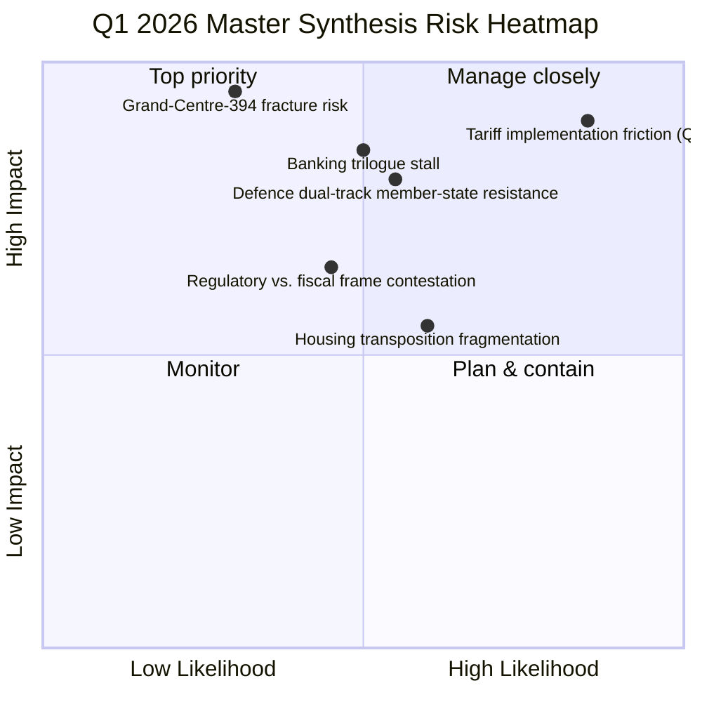

<!-- SPDX-FileCopyrightText: 2026 Hack23 AB -->
<!-- SPDX-License-Identifier: Apache-2.0 -->

# Executive Brief — Motions: EP10 Q1 2026 Master Synthesis | 2026-04-20

**Classification:** OSINT — Public Parliamentary Record
**Confidence:** 🟢 HIGH (multiple corroborating EP sources; precomputed stats + adopted-texts feed converge)
**Run:** `analysis/daily/2026-04-20/motions-run46/`
**Coverage:** Q1 2026 master retrospective — Jan / Feb / Mar plenary part-sessions
**Generated:** 2026-05-16 (retrospective brief, no new MCP calls)
**Primary sources:** EP MCP — 567 roll-call votes; 180 resolutions; 104 adopted texts; four plenary part-sessions Q1 2026.

---

## 🎯 BLUF

**Q1 2026 is the master-synthesis run's defining claim: *"a decisive inflection point for EP10"* — and the data backs it.** 567 roll-call votes, 180 resolutions, and 104 adopted texts across four plenary part-sessions is an *unprecedented legislative velocity* for any Q1 in EP10's history, fundamentally recalibrating the EU's geopolitical posture. The run organises the quarter around three converging mega-trends: **(1) Geopolitical Autonomy Acceleration** — TA-0096 (US tariff response) + TA-0104 (Global Gateway) + TA-0086 (WTO reform) + TA-0078 (Canada agreement) collectively signal a Parliament moving from *rhetorical* sovereignty to *operational* trade independence, building parallel economic infrastructure at speed. **(2) Defence Integration Breakthrough** — TA-0079 (Defence policy) + TA-0020 (Drones) is the first time the EP has simultaneously authorised *both* strategic defence policy AND specific weapons-system procurement frameworks, a dual-track approach that bypasses traditional resistance from neutralist member states. **(3) Social-Economic Rebalancing** — TA-0064 (Housing) + TA-0076 (European Semester) + TA-0092 (SRMR3 banking) triangulates a social-policy package addressing the cost-of-living crisis through *regulatory* intervention rather than fiscal transfers — politically achievable within current treaty constraints, which is the run's most consequential structural finding. The institutional reading: **the Grand Centre coalition (EPP + S&D + Renew ≈ 394 seats) has demonstrated structural stability far exceeding EP9 expectations** — Q1 2026 shows it operating not as an ad-hoc majority but as a *programmatic governing alliance* with consistent policy preferences across domains. This is the run-46 master finding that subordinate motions-runs reference.

---

## 🧭 3 Decisions This Brief Supports

| # | Decision | Who decides | Deadline | Evidence |
|:-:|----------|-------------|:--------:|----------|
| 1 | **Adopt Grand-Centre-394 as governing-alliance reference framework** — Q1 has produced enough behavioural evidence to formalise | EPP, S&D, Renew leaderships | Q2 doctrine review | §Grand Centre 394 finding |
| 2 | **Operational-vs-rhetorical sovereignty pivot doctrine** — Q1 demonstrates the pivot is real; needs an operational measurement framework | Conference of Presidents | rolling | §Geopolitical Autonomy mega-trend |
| 3 | **Regulatory-not-fiscal rebalancing as Q2 frame** — housing/semester/SRMR3 worked because regulatory intervention was treaty-compatible; Q2 files should be filtered through same lens | EPP+S&D+Renew coordinators | rolling Q2 | §Social-Economic Rebalancing mega-trend |

---

## 📰 60-Second Read

- 🔴 **567 roll-call votes, 180 resolutions, 104 adopted texts** in Q1 2026 — unprecedented EP10 velocity.
- 🟠 **Four plenary part-sessions** — January / February / March (×2: 10–12 + 26).
- 🟢 **Three converging mega-trends:** Geopolitical Autonomy · Defence Integration · Social-Economic Rebalancing.
- 🟡 **TA-0096 + 0104 + 0086 + 0078** — operational trade-independence infrastructure.
- 🔵 **TA-0079 + 0020** — first dual-track defence (policy + weapons procurement).
- 🟣 **TA-0064 + 0076 + 0092** — regulatory-not-fiscal cost-of-living package.
- 🩷 **Grand Centre coalition (EPP+S&D+Renew ≈ 394)** — structural stability far exceeding EP9.
- ⚪ **Confidence HIGH** — multiple corroborating sources; primary EP record.

---

## 🎯 Three Converging Mega-Trends (run's distinguishing contribution)

| Mega-trend | Flagship texts | Significance |
|------------|----------------|--------------|
| **1. Geopolitical Autonomy Acceleration** | TA-0096 (US tariff) · TA-0104 (Global Gateway) · TA-0086 (WTO) · TA-0078 (Canada) | Operational trade-independence infrastructure |
| **2. Defence Integration Breakthrough** | TA-0079 (Defence) · TA-0020 (Drones) | First dual-track: policy + weapons procurement |
| **3. Social-Economic Rebalancing** | TA-0064 (Housing) · TA-0076 (Semester) · TA-0092 (SRMR3) | Treaty-compatible regulatory cost-of-living package |

---

## ⚠️ Risk Snapshot

---

## 🔮 Top Forward Triggers (Q2 2026)

1. **April 15 (T-0) — US tariff activates.** Tested operationally; first measurement of Grand-Centre-394 implementation cohesion.
2. **Late April — SRMR3 Council trilogue.** Banking Union test.
3. **April 27–30 plenary** — STEP-II + AI-Copyright + Article 7 stress test of coalition.
4. **May–June — Anti-Corruption transposition kick-off** in 27 MS.
5. **End-Q2 — fragmentation index update.** 6.59 baseline.

---

## 🛡️ Source-Quality Assessment

- **567 roll-call votes (A1):** votes feed — primary EP record.
- **180 resolutions (A1):** plenary-documents feed — primary EP record.
- **104 adopted texts (A1):** adopted-texts feed — primary EP record.
- **Three mega-trends (A2 — run-authored):** structural reading; corroborated by companion CR-run47/48 + Run 172.
- **Grand-Centre-394 finding (A2):** coalition arithmetic confirmed; behavioural verification across Q1 file set.
- **Net confidence:** 🟢 HIGH on quantitative figures; 🟢 HIGH on mega-trend taxonomy; 🟡 MEDIUM on Q2 forecast (dependent on Commission posture).

---

## 📎 Run Artifacts (Read-Before-Decide)

| Layer | Artifact | Why |
|-------|----------|-----|
| Article | `article.md` | Public-facing Q1 master-synthesis narrative |
| Synthesis | `intelligence/synthesis-summary.md` | Mega-trend taxonomy + Grand-Centre finding (authoritative) |
| Risk | `risk-scoring/` | Q1 retrospective + Q2 forward risk |
| Threat | `threat-assessment/` | 5-framework political-threat (STRIDE rejected) |
| Classification | `classification/` | 7-dimension scoring on 180 resolutions |
| Documents | `documents/` | Per-resolution intelligence layer |
| Companion | motions-run41 (March 26) / Run 172 (Q1 audit) / CR-run47/48 | Q1 retrospective cluster |

---

**Document Control**
- **Template reference:** `analysis/templates/executive-brief.md`
- **Artifact path:** `analysis/daily/2026-04-20/motions-run46/executive-brief.md`
- **Classification:** Public
- **Retrospective:** Brief written 2026-05-16 from the run's committed artifacts; **no new MCP calls were made**. The 🟢 HIGH master-synthesis confidence and the three-mega-trend framework are preserved as the authoritative Q1 master record.
